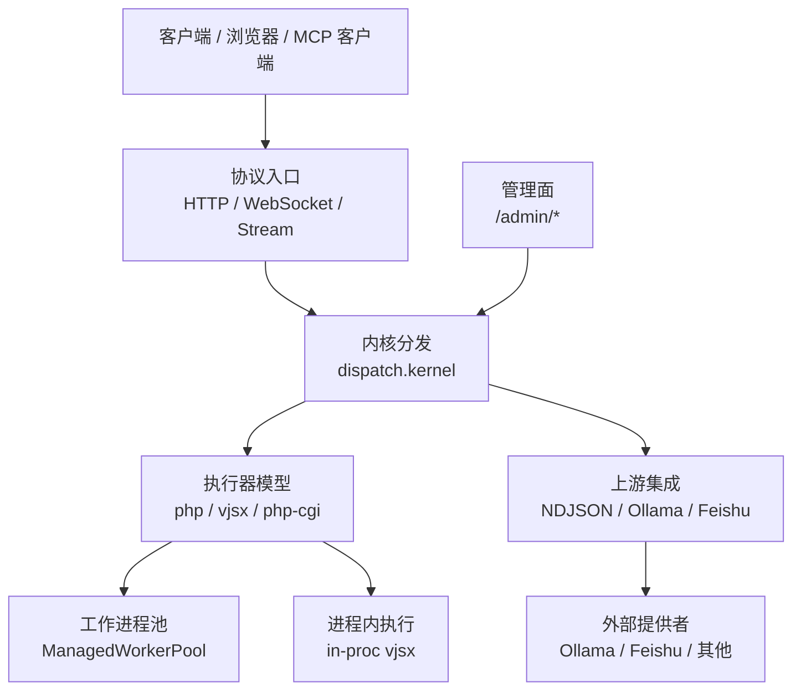
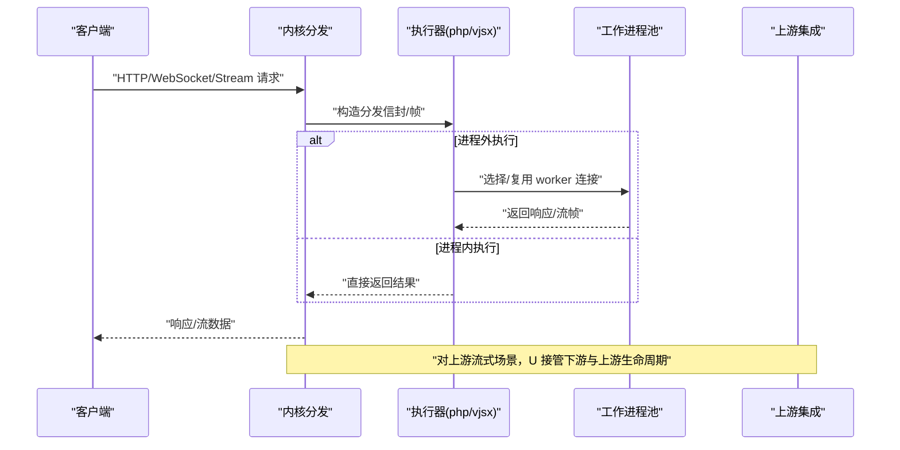
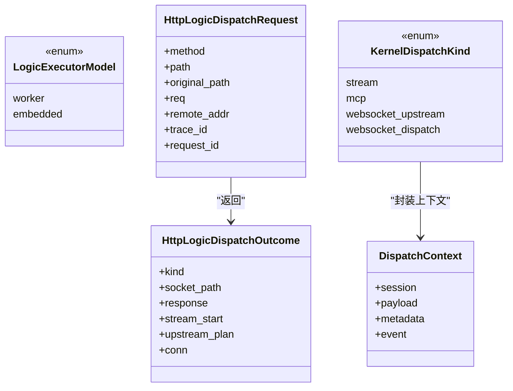
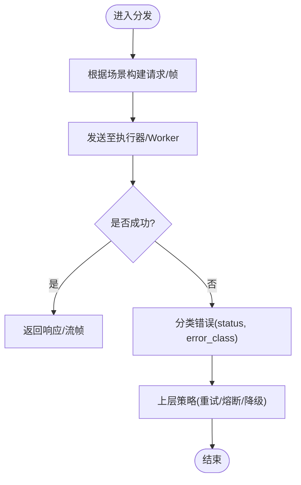
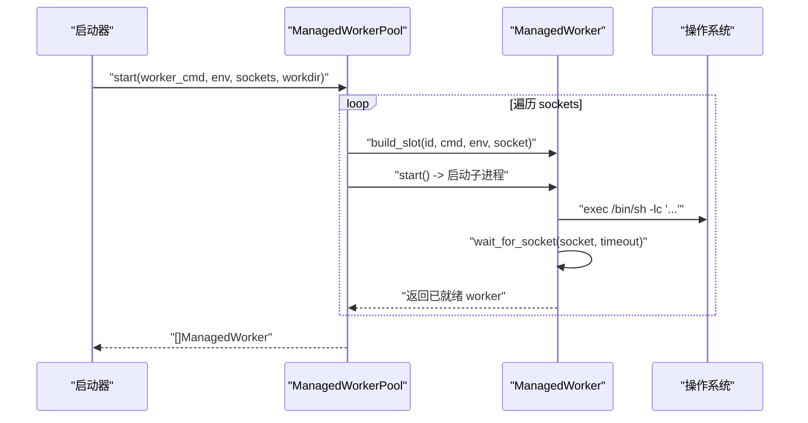
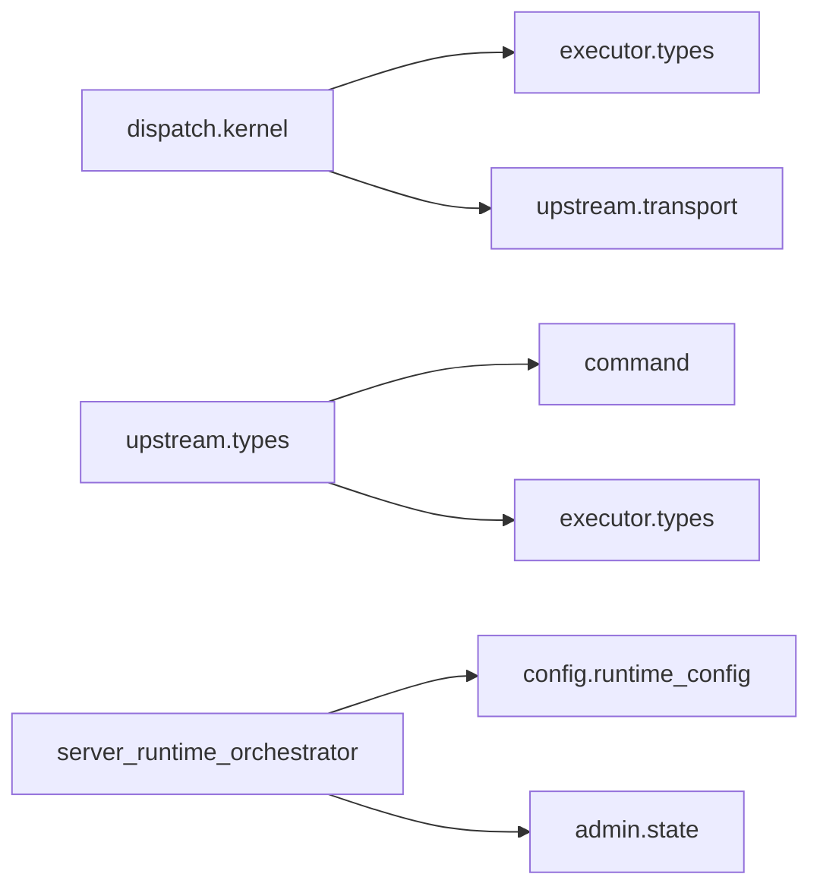

# 微服务架构模式

<cite>
**本文引用的文件列表**
- [README.md](file://README.md)
- [EXECUTOR_MODES.md](file://docs/EXECUTOR_MODES.md)
- [server_runtime_orchestrator.v](file://src/server_runtime_orchestrator.v)
- [executor/types.v](file://src/executor/types.v)
- [dispatch/kernel.v](file://src/dispatch/kernel.v)
- [upstream/types.v](file://src/upstream/types.v)
- [upstream/transport/worker_pool.v](file://src/upstream/transport/worker_pool.v)
- [executor/php_cgi_executor.v](file://src/executor/php_cgi_executor.v)
- [executor/inproc_vjsx_host_runtime_api.v](file://src/executor/inproc_vjsx_host_runtime_api.v)
- [config/config.v](file://src/config/config.v)
- [server_lifecycle/runtime_config.v](file://src/server_lifecycle/runtime_config.v)
- [admin/state.v](file://src/admin/state.v)
- [ws/runtime.v](file://src/ws/runtime.v)
</cite>

## 目录
1. [引言](#引言)
2. [项目结构](#项目结构)
3. [核心组件](#核心组件)
4. [架构总览](#架构总览)
5. [详细组件分析](#详细组件分析)
6. [依赖关系分析](#依赖关系分析)
7. [性能与可扩展性](#性能与可扩展性)
8. [故障排查指南](#故障排查指南)
9. [结论](#结论)
10. [附录：关键实现路径参考](#附录关键实现路径参考)

## 引言
本文件围绕 VHTTPD 的微服务化能力，系统阐述其“执行器模式”驱动的服务拆分、进程内与进程外隔离、多协议接入（HTTP/WebSocket/流式）、以及面向上游的网关与调度能力。重点覆盖：
- 服务拆分原则与边界
- 服务间通信机制（Unix Socket、FastCGI、WebSocket、NDJSON/Upstream）
- 负载均衡策略（Worker Pool、选择诊断）
- 执行器模式在 PHP Worker 与 VJSX 中的落地
- 服务发现、配置中心、熔断降级的现状与建议方案
- API 网关设计要点与分布式事务处理思路

## 项目结构
VHTTPD 以“协议入口 + 执行器 + 传输层 + 上游集成”的分层组织为核心，强调 veb/http 作为事实来源，vhttpd 聚焦于传输、编排、可观测性与运行时治理。

图示来源
- [README.md:84-126](file://README.md#L84-L126)
- [dispatch/kernel.v:1-151](file://src/dispatch/kernel.v#L1-L151)
- [executor/types.v:1-120](file://src/executor/types.v#L1-L120)
- [upstream/types.v:1-120](file://src/upstream/types.v#L1-L120)

章节来源
- [README.md:1-126](file://README.md#L1-L126)

## 核心组件
- 执行器模型与类型
  - 统一抽象了 HTTP 逻辑分发、WebSocket 会话、Stream/MCP 等内核分发信封，屏蔽底层差异。
- 内核分发
  - 负责将请求封装为统一的 transport 帧或请求对象，并分类错误与状态。
- 工作进程池
  - 负责 worker 生命周期、启动、优雅停止、退避重启与连接等待。
- 上游集成
  - 提供 NDJSON/流式映射、事件快照、活动追踪与发送命令标准化。
- 管理面与可观测性
  - 暴露运行态统计、活跃计数、管道路由摘要等。

章节来源
- [executor/types.v:1-200](file://src/executor/types.v#L1-L200)
- [dispatch/kernel.v:1-151](file://src/dispatch/kernel.v#L1-L151)
- [upstream/transport/worker_pool.v:1-219](file://src/upstream/transport/worker_pool.v#L1-L219)
- [upstream/types.v:1-165](file://src/upstream/types.v#L1-L165)
- [admin/state.v:38-54](file://src/admin/state.v#L38-L54)

## 架构总览
VHTTPD 采用“薄内核 + 插件化执行器 + 传输/上游扩展”的架构。HTTP/WebSocket/Stream 进入后由内核分发到具体执行器；执行器可选择进程外（PHP Worker/PHP-CGI）或进程内（VJSX）。对于长连接与流式场景，通过 Upstream 子系统对接外部服务，并以事件/活动快照进行可观测。

图示来源
- [dispatch/kernel.v:30-121](file://src/dispatch/kernel.v#L30-L121)
- [executor/types.v:15-35](file://src/executor/types.v#L15-L35)
- [upstream/transport/worker_pool.v:178-202](file://src/upstream/transport/worker_pool.v#L178-L202)

## 详细组件分析

### 执行器模式与类型定义
- 统一模型
  - 逻辑执行器模型分为 worker 与 embedded 两类，分别对应进程外与进程内执行。
  - 每种执行器对外暴露 kind/provider/model/lifecycle 等元信息，便于管理面展示与路由选择。
- 分发契约
  - HTTP 分发返回 response/stream/upstream_plan 三类结果；WebSocket 支持 open 与事件分发；内核分发信封统一 stream/mcp/websocket_upstream/websocket_dispatch 四类。

图示来源
- [executor/types.v:9-35](file://src/executor/types.v#L9-L35)
- [executor/types.v:381-448](file://src/executor/types.v#L381-L448)
- [executor/types.v:268-313](file://src/executor/types.v#L268-L313)

章节来源
- [executor/types.v:1-200](file://src/executor/types.v#L1-L200)

### 内核分发与错误分类
- 构建标准请求/帧
  - 针对 stream、mcp、websocket_upstream、websocket_dispatch 四类场景，提供工厂方法构造 transport 请求/帧，确保跨执行器一致。
- 错误分类
  - 将后端错误归类为 status 与 error_class，便于上层做熔断/降级决策。

图示来源
- [dispatch/kernel.v:30-121](file://src/dispatch/kernel.v#L30-L121)
- [dispatch/kernel.v:12-28](file://src/dispatch/kernel.v#L12-L28)

章节来源
- [dispatch/kernel.v:1-151](file://src/dispatch/kernel.v#L1-L151)

### 工作进程池与负载均衡
- 进程管理
  - 启动时按 socket 列表创建 ManagedWorker，注入环境变量，等待 socket 就绪，记录子进程 PID 用于监控。
  - 停止时先 SIGTERM，再 SIGKILL，确保进程组清理。
- 退避重启
  - 基于 restart_count 计算指数退避延迟，限制最大间隔，避免雪崩。
- 选择诊断
  - 暴露每个 slot 的存活、draining、inflight、probe_error 等信息，辅助上层选择健康实例。

图示来源
- [upstream/transport/worker_pool.v:178-202](file://src/upstream/transport/worker_pool.v#L178-L202)
- [upstream/transport/worker_pool.v:63-74](file://src/upstream/transport/worker_pool.v#L63-L74)
- [upstream/transport/worker_pool.v:204-218](file://src/upstream/transport/worker_pool.v#L204-L218)

章节来源
- [upstream/transport/worker_pool.v:1-219](file://src/upstream/transport/worker_pool.v#L1-L219)

### PHP-CGI 执行器（进程外 FastCGI）
- 行为特征
  - 仅支持 HTTP 响应模式，不支持 WebSocket/Stream/MCP。
  - 通过 Unix Socket 与 php-cgi 进程通信，编码/解码 FastCGI 帧。
- 适用场景
  - 需要与现有 CGI 生态兼容且无需长连接的短请求场景。

章节来源
- [executor/php_cgi_executor.v:1-118](file://src/executor/php_cgi_executor.v#L1-L118)

### 进程内 VJSX 执行器（进程内嵌入）
- 行为特征
  - 默认禁用 worker 套接字与自动启动，适合轻量 HTTP 与部分 upstream 场景。
  - 通过 Host API 向应用侧暴露 emit/snapshot 等能力，支持运行时事件上报与快照聚合。
- 隔离与部署
  - 进程内执行天然具备内存级隔离，适合独立线程/协程并发，但需注意资源竞争与崩溃影响范围。

章节来源
- [EXECUTOR_MODES.md:82-125](file://docs/EXECUTOR_MODES.md#L82-L125)
- [executor/inproc_vjsx_host_runtime_api.v:1-137](file://src/executor/inproc_vjsx_host_runtime_api.v#L1-L137)

### 上游集成与事件/活动快照
- 标准化发送
  - UpstreamSendRequest 提供 provider/instance/target/message_type/content 等字段，支持 content_fields/text 便捷构造。
- 事件与活动
  - UpstreamEventSnapshot/UpstreamActivitySnapshot 记录事件与活动轨迹，包含 trace_id、received_at、worker_handled 等关键字段。
- 流式映射
  - ExecState 维护 IO 桥接、SSE 事件名、字段映射、状态码与响应头等，支撑 NDJSON/Token 流转发。

章节来源
- [upstream/types.v:82-165](file://src/upstream/types.v#L82-L165)
- [upstream/types.v:239-328](file://src/upstream/types.v#L239-L328)

### 管理面与可观测性
- 运行态统计
  - 汇总 HTTP/Worker/Upstream/MCP/Feishu 等维度指标，暴露给 /admin 接口。
- 活跃计数
  - 暴露 websockets/upstreams/mcp_sessions/gateways 等活跃数，便于容量规划与告警。

章节来源
- [admin/state.v:38-54](file://src/admin/state.v#L38-L54)
- [executor/types.v:95-200](file://src/executor/types.v#L95-L200)

### 配置中心与运行时装配
- TOML 配置
  - 支持变量展开、多站点、多监听器、执行器切换、vjsx 参数等。
- 运行时装配
  - server_runtime_orchestrator 挂载静态资源、安装中间件、启动管理面与上游提供者，并输出端点日志。
- 运行时配置透传
  - runtime_config 将 admin、assets、worker 超时/队列、workdir 等参数注入 AppRuntimeBuildConfig。

章节来源
- [README.md:437-617](file://README.md#L437-L617)
- [server_runtime_orchestrator.v:72-98](file://src/server_runtime_orchestrator.v#L72-L98)
- [server_lifecycle/runtime_config.v:146-171](file://src/server_lifecycle/runtime_config.v#L146-L171)
- [config/config.v:2235-2257](file://src/config/config.v#L2235-L2257)

### WebSocket 会话与 Hub 状态
- 连接注册与会话状态
  - HubState.register_conn 记录连接元信息与生命周期，conn_open/mark_closing 控制入队与关闭。
- 与执行器协作
  - 结合内核分发与执行器，实现消息派发与房间/成员元数据传递。

章节来源
- [ws/runtime.v:49-101](file://src/ws/runtime.v#L49-L101)

## 依赖关系分析
- 模块耦合
  - dispatch.kernel 依赖 executor.types 与 upstream.transport，形成“分发-执行-传输”的清晰分层。
  - upstream.types 依赖 command 与 executor，向上游发送命令提供标准化载体。
  - server_runtime_orchestrator 依赖配置与启动流程，串联资产、中间件、管理面与上游提供者。
- 外部依赖
  - 通过 veb/http 作为事实来源，保持 vhttpd 薄内核定位。

图示来源
- [dispatch/kernel.v:1-10](file://src/dispatch/kernel.v#L1-L10)
- [upstream/types.v:1-10](file://src/upstream/types.v#L1-L10)
- [server_runtime_orchestrator.v:72-98](file://src/server_runtime_orchestrator.v#L72-L98)

章节来源
- [dispatch/kernel.v:1-151](file://src/dispatch/kernel.v#L1-L151)
- [upstream/types.v:1-165](file://src/upstream/types.v#L1-L165)
- [server_runtime_orchestrator.v:72-98](file://src/server_runtime_orchestrator.v#L72-L98)

## 性能与可扩展性
- 进程外执行（PHP Worker/PHP-CGI）
  - 优点：语言/框架隔离、崩溃隔离、可按业务域拆分进程；缺点：IPC 开销、需关注队列与超时。
  - 建议：合理设置 pool_size、read_timeout_ms、queue_capacity/timeouts，配合退避重启策略。
- 进程内执行（VJSX）
  - 优点：低延迟、无 IPC；缺点：共享地址空间，需防范单点崩溃影响。
  - 建议：使用线程/协程隔离、限流与熔断保护关键路径。
- 上游流式
  - 利用 ExecState 与 NDJSON 映射，减少序列化与缓冲，提升端到端吞吐。
- 可观测性
  - 借助 /admin 统计与活动快照，建立容量与异常基线，指导扩缩容与调优。

[本节为通用指导，不直接分析具体文件]

## 故障排查指南
- Worker 启动失败
  - 检查 socket 是否就绪、命令模板是否正确、环境变量是否注入。
  - 参考 wait_for_socket 与 start 流程。
- 请求超时/错误
  - 查看 transport_failure 的错误分类结果，确认 error_class 与 status。
- 上游事件丢失
  - 核对 UpstreamEventSnapshot/UpstreamActivitySnapshot 的 received_at/recorded_at 与 worker_handled 标记。
- 管理面不可用
  - 确认 orchestrator 是否完成挂载与启动，检查 admin 端口与 token。

章节来源
- [upstream/transport/worker_pool.v:63-74](file://src/upstream/transport/worker_pool.v#L63-L74)
- [dispatch/kernel.v:12-28](file://src/dispatch/kernel.v#L12-L28)
- [upstream/types.v:239-328](file://src/upstream/types.v#L239-L328)
- [server_runtime_orchestrator.v:72-98](file://src/server_runtime_orchestrator.v#L72-L98)

## 结论
VHTTPD 通过“执行器模式 + 内核分发 + 传输/上游扩展”，实现了灵活的服务拆分与多协议接入。进程外与进程内两种执行路径兼顾隔离与性能，配合工作进程池与退避策略，提供了稳定的基础能力。当前仓库未内置完整的服务发现、配置中心与熔断降级组件，但提供了足够的扩展点与可观测性，可在上层补齐这些微服务核心能力。

[本节为总结性内容，不直接分析具体文件]

## 附录：关键实现路径参考
- 执行器模式与类型
  - [executor/types.v:1-200](file://src/executor/types.v#L1-L200)
- 内核分发与错误分类
  - [dispatch/kernel.v:1-151](file://src/dispatch/kernel.v#L1-L151)
- 工作进程池与退避重启
  - [upstream/transport/worker_pool.v:178-219](file://src/upstream/transport/worker_pool.v#L178-L219)
- PHP-CGI 执行器
  - [executor/php_cgi_executor.v:1-118](file://src/executor/php_cgi_executor.v#L1-L118)
- 进程内 VJSX Host API
  - [executor/inproc_vjsx_host_runtime_api.v:1-137](file://src/executor/inproc_vjsx_host_runtime_api.v#L1-L137)
- 上游事件与活动快照
  - [upstream/types.v:132-238](file://src/upstream/types.v#L132-L238)
- 管理面统计
  - [admin/state.v:38-54](file://src/admin/state.v#L38-L54)
- 配置与运行时装配
  - [README.md:437-617](file://README.md#L437-L617)
  - [server_runtime_orchestrator.v:72-98](file://src/server_runtime_orchestrator.v#L72-L98)
  - [server_lifecycle/runtime_config.v:146-171](file://src/server_lifecycle/runtime_config.v#L146-L171)
  - [config/config.v:2235-2257](file://src/config/config.v#L2235-L2257)
- WebSocket Hub 状态
  - [ws/runtime.v:49-101](file://src/ws/runtime.v#L49-L101)