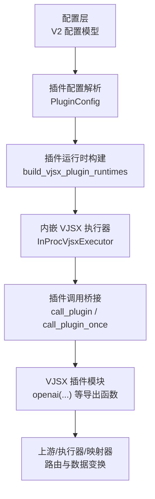
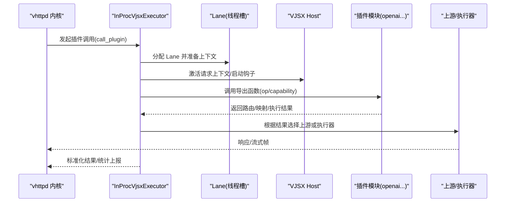
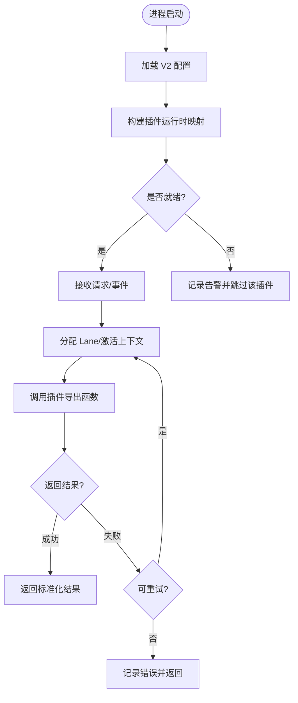
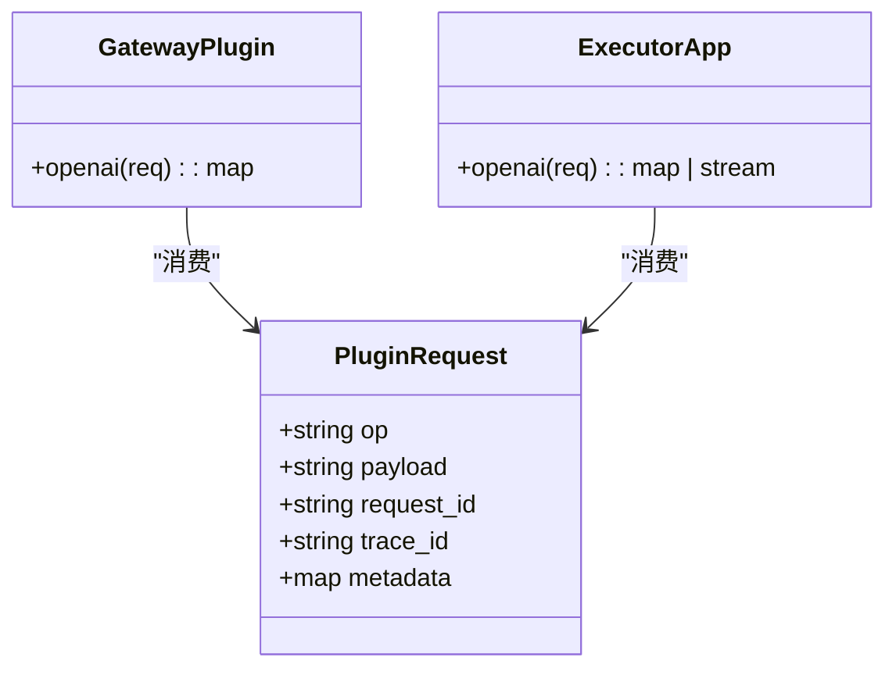
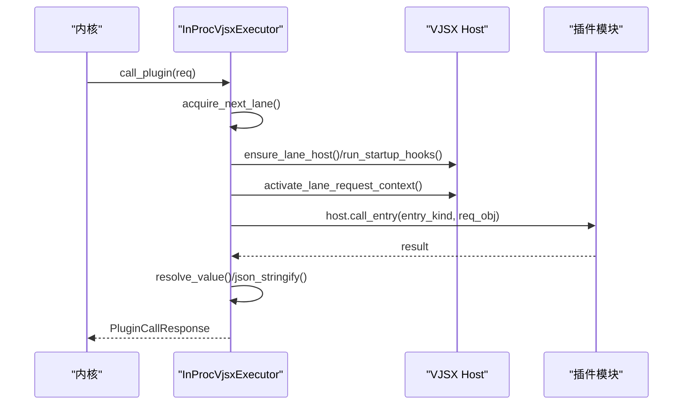

# 插件化扩展架构

<cite>
**本文引用的文件**   
- [src/plugin/types.v](file://src/plugin/types.v)
- [src/plugin/runtime.v](file://src/plugin/runtime.v)
- [src/config/config.v](file://src/config/config.v)
- [src/executor/inproc_vjsx_plugin_runtime.v](file://src/executor/inproc_vjsx_plugin_runtime.v)
- [examples/vjsx/openai-gateway-plugin.mts](file://examples/vjsx/openai-gateway-plugin.mts)
- [examples/vjsx/openai-executor-app.mts](file://examples/vjsx/openai-executor-app.mts)
- [examples/vjsx/openai-dashscope-coding-plugin.mts](file://examples/vjsx/openai-dashscope-coding-plugin.mts)
- [src/config/v2_config.v](file://src/config/v2_config.v)
- [docs/CONFIGURATION_MODEL_V2.md](file://docs/CONFIGURATION_MODEL_V2.md)
- [README.md](file://README.md)
</cite>

## 目录
1. [简介](#简介)
2. [项目结构](#项目结构)
3. [核心组件](#核心组件)
4. [架构总览](#架构总览)
5. [详细组件分析](#详细组件分析)
6. [依赖关系分析](#依赖关系分析)
7. [性能与隔离特性](#性能与隔离特性)
8. [安全机制与治理](#安全机制与治理)
9. [插件开发指南](#插件开发指南)
10. [故障排查](#故障排查)
11. [结论](#结论)

## 简介
本文件系统化阐述 VHTTPD 的插件化扩展架构，围绕“插件接口定义、生命周期管理、依赖注入机制”展开，并给出如何开发自定义执行器、提供者、转换器等各类插件的实践路径。同时覆盖版本管理、热加载、沙箱隔离等高级特性的实现方案，以及插件市场、签名验证、权限控制等安全机制的设计建议。文末提供从简单到复杂的完整插件开发示例与全流程指导（开发、测试、部署）。

## 项目结构
VHTTPD 将“协议接入—交换规范—转换处理—出口适配”解耦为可插拔管线，并通过“引擎/适配器/转换器/策略/管道/中继”等配置域进行编排。插件以 VJSX 模块为载体，通过运行时入口函数暴露能力，由内核调度至线程池中的 Lane 执行。

图表来源
- [src/config/v2_config.v:120-155](file://src/config/v2_config.v#L120-L155)
- [src/config/config.v:88-104](file://src/config/config.v#L88-L104)
- [src/plugin/runtime.v:48-61](file://src/plugin/runtime.v#L48-L61)
- [src/executor/inproc_vjsx_plugin_runtime.v:76-91](file://src/executor/inproc_vjsx_plugin_runtime.v#L76-L91)
- [examples/vjsx/openai-gateway-plugin.mts:197-212](file://examples/vjsx/openai-gateway-plugin.mts#L197-L212)

章节来源
- [README.md:1-41](file://README.md#L1-L41)
- [docs/CONFIGURATION_MODEL_V2.md:42-61](file://docs/CONFIGURATION_MODEL_V2.md#L42-L61)

## 核心组件
- 插件配置与状态
  - PluginConfig：描述插件类型、入口、模块根、签名根、线程数、资源开关等。
  - PluginState：维护插件配置集合与对应 VJSX 执行器实例。
- 插件运行时构建
  - vjsx_plugin_runtime_config：将 PluginConfig 转换为 VJSX 运行时 Facade 配置。
  - build_vjsx_plugin_runtimes：按名称构建多个 VJSX 插件运行时的映射。
- 插件调用桥接
  - InProcVjsxExecutor.call_plugin / call_plugin_once：分配 Lane、启动钩子、激活请求上下文、序列化入参、调用插件导出函数、反序列化解结果、重试与错误记录。

章节来源
- [src/config/config.v:88-104](file://src/config/config.v#L88-L104)
- [src/plugin/types.v:6-12](file://src/plugin/types.v#L6-L12)
- [src/plugin/runtime.v:14-46](file://src/plugin/runtime.v#L14-L46)
- [src/plugin/runtime.v:48-61](file://src/plugin/runtime.v#L48-L61)
- [src/executor/inproc_vjsx_plugin_runtime.v:5-74](file://src/executor/inproc_vjsx_plugin_runtime.v#L5-L74)
- [src/executor/inproc_vjsx_plugin_runtime.v:76-91](file://src/executor/inproc_vjsx_plugin_runtime.v#L76-L91)

## 架构总览
VHTTPD 的插件体系遵循“协议无关、能力可插拔”的原则：
- 配置驱动：通过 V2 配置模型声明 engines/adapters/transforms/policies/pipelines/relays 等，统一编排。
- 插件即模块：VJSX 插件以模块形式提供导出函数，按 capability/op 路由到具体逻辑。
- 执行模型：内核在 Lane 上异步执行插件，支持重试、追踪 ID 透传、上下文隔离。
- 能力边界：插件仅负责业务级握手、路由、映射与编排；底层连接、流控、观测由内核持有。

图表来源
- [src/executor/inproc_vjsx_plugin_runtime.v:5-74](file://src/executor/inproc_vjsx_plugin_runtime.v#L5-L74)
- [examples/vjsx/openai-gateway-plugin.mts:197-212](file://examples/vjsx/openai-gateway-plugin.mts#L197-L212)

## 详细组件分析

### 插件配置与生命周期
- 配置项要点
  - kind：插件类型，默认 vjsx。
  - entry/app_entry：插件入口与可选应用入口。
  - module_root/build_root：模块与构建根目录。
  - signature_root/include/exclude：签名校验范围。
  - runtime_profile/thread_count/max_requests：运行时画像、并发与限流。
  - enable_fs/enable_process/enable_network：沙箱能力开关。
- 生命周期阶段
  - 构建期：解析配置→生成 VJSX 运行时配置→创建执行器实例。
  - 启动期：按需初始化宿主环境、加载模块、注册导出函数。
  - 运行期：按请求分发到 Lane，执行插件导出函数，收集指标。
  - 停止期：释放资源、清理上下文、持久化快照（若启用）。

图表来源
- [src/plugin/runtime.v:48-61](file://src/plugin/runtime.v#L48-L61)
- [src/executor/inproc_vjsx_plugin_runtime.v:76-91](file://src/executor/inproc_vjsx_plugin_runtime.v#L76-L91)

章节来源
- [src/config/config.v:88-104](file://src/config/config.v#L88-L104)
- [src/plugin/runtime.v:14-46](file://src/plugin/runtime.v#L14-L46)
- [src/plugin/runtime.v:48-61](file://src/plugin/runtime.v#L48-L61)

### 插件接口约定与能力路由
- 通用请求体
  - op：操作名（如 models/chat.route/responses.route/chat.map_frame/chat.fallback/chat.execute/responses.execute）。
  - payload：JSON 字符串化的业务负载。
  - request_id/trace_id/metadata：链路追踪与元数据。
- 能力命名空间
  - 当 capability 为空时，默认使用 plugin 命名空间；否则按 capability 值作为入口前缀。
- 典型能力
  - OpenAI 网关插件：models/chat.route/responses.route/chat.map_frame/chat.fallback。
  - 执行器应用：chat.execute/responses.execute，直接产出标准化帧或 Responses 事件。

图表来源
- [examples/vjsx/openai-gateway-plugin.mts:1-212](file://examples/vjsx/openai-gateway-plugin.mts#L1-L212)
- [examples/vjsx/openai-executor-app.mts:1-102](file://examples/vjsx/openai-executor-app.mts#L1-L102)

章节来源
- [examples/vjsx/openai-gateway-plugin.mts:197-212](file://examples/vjsx/openai-gateway-plugin.mts#L197-L212)
- [examples/vjsx/openai-executor-app.mts:51-101](file://examples/vjsx/openai-executor-app.mts#L51-L101)

### 插件调用流程（代码级）
- 关键步骤
  - 获取 Lane 并保证宿主已就绪。
  - 运行启动钩子，激活请求上下文（包含 method/path/trace_id/request_id）。
  - 将请求对象 JSON 编码后传入宿主，按 capability 或默认 plugin 入口调用。
  - 解析返回值，必要时重试，记录成功/失败指标。

图表来源
- [src/executor/inproc_vjsx_plugin_runtime.v:5-74](file://src/executor/inproc_vjsx_plugin_runtime.v#L5-L74)

章节来源
- [src/executor/inproc_vjsx_plugin_runtime.v:5-74](file://src/executor/inproc_vjsx_plugin_runtime.v#L5-L74)

### 转换器与提供者（概念性说明）
- 转换器（Transform）
  - 基于 V2 配置的 transforms 域声明，kind/engine/handler/target 指定实现位置与目标。
  - 可在管道中串联多个转换器，完成协议归一化、字段映射、鉴权增强等。
- 提供者（Provider）
  - 基于 providers 域声明，runtime.driver/protocol/plugin/engine 决定运行方式。
  - 可通过 hooks/capabilities 暴露能力，供上层适配器或管道消费。

章节来源
- [src/config/v2_config.v:184-197](file://src/config/v2_config.v#L184-L197)
- [src/config/v2_config.v:261-277](file://src/config/v2_config.v#L261-L277)
- [docs/CONFIGURATION_MODEL_V2.md:42-61](file://docs/CONFIGURATION_MODEL_V2.md#L42-L61)

## 依赖关系分析
- 配置到运行时
  - V2 配置模型 → 插件配置解析 → 插件运行时构建 → 执行器实例化。
- 运行时到插件
  - 执行器 → Lane 管理 → 宿主调用 → 插件模块导出函数。
- 插件到外部
  - 插件通过路由/映射选择上游或执行器，不直接持有底层 socket。

图表来源
- [src/config/v2_config.v:120-155](file://src/config/v2_config.v#L120-L155)
- [src/config/config.v:88-104](file://src/config/config.v#L88-L104)
- [src/plugin/runtime.v:48-61](file://src/plugin/runtime.v#L48-L61)
- [src/executor/inproc_vjsx_plugin_runtime.v:76-91](file://src/executor/inproc_vjsx_plugin_runtime.v#L76-L91)

章节来源
- [src/config/v2_config.v:120-155](file://src/config/v2_config.v#L120-L155)
- [src/config/config.v:88-104](file://src/config/config.v#L88-L104)
- [src/plugin/runtime.v:48-61](file://src/plugin/runtime.v#L48-L61)
- [src/executor/inproc_vjsx_plugin_runtime.v:76-91](file://src/executor/inproc_vjsx_plugin_runtime.v#L76-L91)

## 性能与隔离特性
- 并发与队列
  - thread_count：每个插件独立的线程槽数量。
  - max_requests：单实例最大请求数，用于优雅重启与内存回收。
- 资源与沙箱
  - enable_fs/enable_process/enable_network：细粒度能力开关，限制文件系统、进程与网络访问。
- 重试与容错
  - 插件调用具备可配置的重试次数与错误分类，避免瞬时抖动导致失败。
- 观测与追踪
  - trace_id/request_id 贯穿调用链，便于定位问题与性能分析。

章节来源
- [src/config/config.v:88-104](file://src/config/config.v#L88-L104)
- [src/executor/inproc_vjsx_plugin_runtime.v:76-91](file://src/executor/inproc_vjsx_plugin_runtime.v#L76-L91)

## 安全机制与治理
- 签名校验
  - signature_root/include/exclude：限定可加载模块范围，防止未授权代码执行。
- 能力白名单
  - 通过沙箱开关限制敏感能力，最小权限原则。
- 版本与替换
  - 结合 V2 配置域的 engines/adapters/transforms 与运行时替换能力，可实现灰度发布与回滚。
- 审计与合规
  - 借助 observability 与事件日志，对插件行为进行审计与取证。

章节来源
- [src/config/config.v:88-104](file://src/config/config.v#L88-L104)
- [docs/CONFIGURATION_MODEL_V2.md:42-61](file://docs/CONFIGURATION_MODEL_V2.md#L42-L61)

## 插件开发指南

### 快速开始：OpenAI 网关插件
- 目标
  - 对外暴露 OpenAI 兼容接口，内部路由到不同后端（OpenAI/Ollama/自定义），并进行流式映射与降级。
- 关键导出
  - openai(req)：根据 op 分支处理 models/chat.route/responses.route/chat.map_frame/chat.fallback。
- 参考实现
  - [examples/vjsx/openai-gateway-plugin.mts](file://examples/vjsx/openai-gateway-plugin.mts)

章节来源
- [examples/vjsx/openai-gateway-plugin.mts:197-212](file://examples/vjsx/openai-gateway-plugin.mts#L197-L212)

### 进阶：自定义执行器应用
- 目标
  - 直接实现 chat.execute/responses.execute，输出标准化帧或 Responses 事件，供网关统一封装。
- 关键点
  - 支持流式与非流式两种模式。
  - 返回 usage 等结构化信息，便于计费与观测。
- 参考实现
  - [examples/vjsx/openai-executor-app.mts](file://examples/vjsx/openai-executor-app.mts)

章节来源
- [examples/vjsx/openai-executor-app.mts:51-101](file://examples/vjsx/openai-executor-app.mts#L51-L101)

### 场景：多厂商路由与映射
- 目标
  - 根据 model 动态选择 Ollama/百炼编码等不同后端，并进行格式映射。
- 参考实现
  - [examples/vjsx/openai-dashscope-coding-plugin.mts](file://examples/vjsx/openai-dashscope-coding-plugin.mts)

章节来源
- [examples/vjsx/openai-dashscope-coding-plugin.mts:54-74](file://examples/vjsx/openai-dashscope-coding-plugin.mts#L54-L74)

### 开发流程
- 本地开发
  - 编写 VJSX 插件模块，导出 openai 或其他能力函数。
  - 在配置中声明 plugins.* 或 engines/transforms/providers，指向模块根与入口。
- 单元测试
  - 构造 PluginRequest，断言返回的路由/映射/执行结果是否符合预期。
- 集成测试
  - 通过 vhttpd 启动，走真实管线，验证端到端行为。
- 部署上线
  - 使用 V2 配置域进行灰度与回滚，配合签名校验与能力白名单保障安全。

### 版本管理与热加载
- 版本管理
  - 通过 engines/transforms/providers 的版本化配置与替换 API，实现平滑升级。
- 热加载
  - 利用运行时替换能力与 Lane 复用，在不重启进程的情况下更新插件逻辑（需确保无状态或可恢复）。

章节来源
- [docs/CONFIGURATION_MODEL_V2.md:42-61](file://docs/CONFIGURATION_MODEL_V2.md#L42-L61)

### 插件市场、签名与权限控制（设计建议）
- 插件市场
  - 提供清单与元数据（名称、版本、能力、依赖），支持在线检索与安装。
- 签名验证
  - 基于 signature_root/include/exclude 与外部签名服务，校验插件完整性与来源可信。
- 权限控制
  - 结合沙箱开关与策略域（policies/security），实施最小权限与访问控制。

[本节为概念性设计，无需源码引用]

## 故障排查
- 常见问题
  - 插件未找到导出函数：检查 capability 与入口命名约定。
  - 上下文缺失：确认 trace_id/request_id 是否正确透传。
  - 资源受限：核对 enable_fs/enable_process/enable_network 配置。
  - 超时与重试：调整 max_requests、thread_count 与重试策略。
- 定位手段
  - 查看插件调用错误码与 Lane 错误记录。
  - 开启 observability 的事件日志与追踪导出。

章节来源
- [src/executor/inproc_vjsx_plugin_runtime.v:5-74](file://src/executor/inproc_vjsx_plugin_runtime.v#L5-L74)
- [src/executor/inproc_vjsx_plugin_runtime.v:76-91](file://src/executor/inproc_vjsx_plugin_runtime.v#L76-L91)

## 结论
VHTTPD 的插件化架构以配置驱动为核心，通过 VJSX 插件模块承载快速演进的协议与业务逻辑，并以严格的沙箱与签名机制保障安全可控。借助 V2 配置模型与运行时替换能力，可实现灰度发布与热加载。开发者可按本文指南从零搭建简单功能扩展到复杂业务插件，并在生产环境中获得高可用与可观测的运行体验。