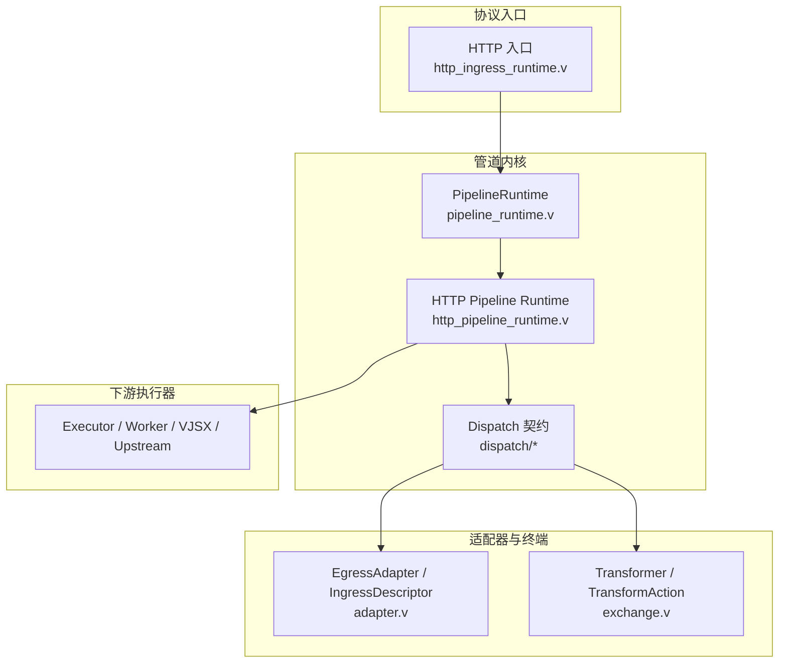
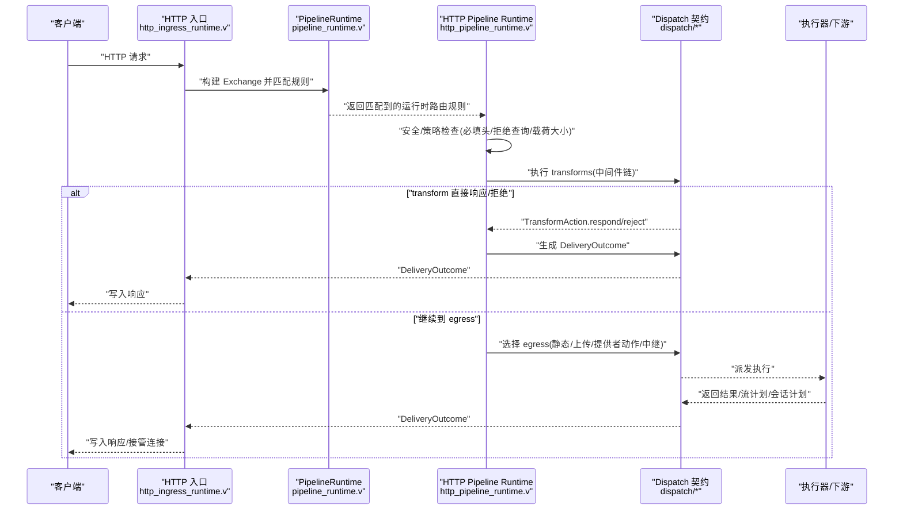
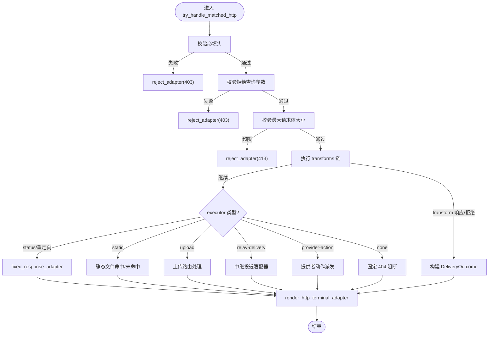
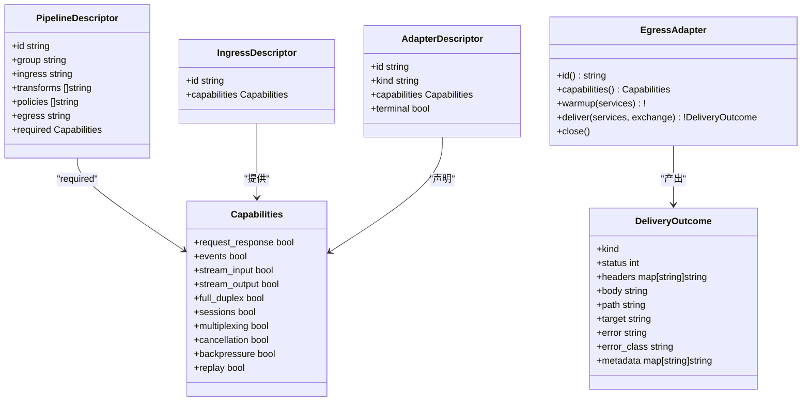
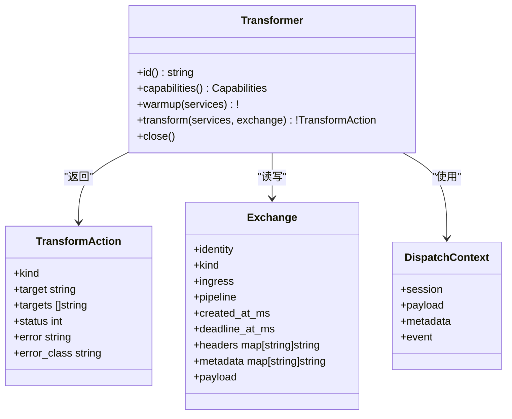
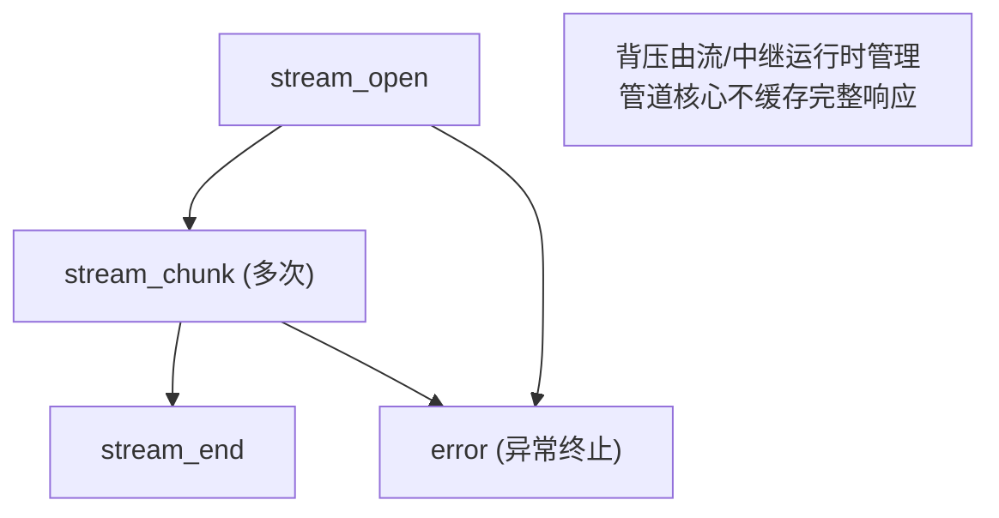
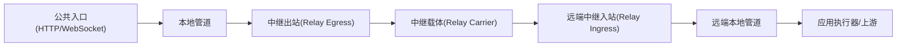
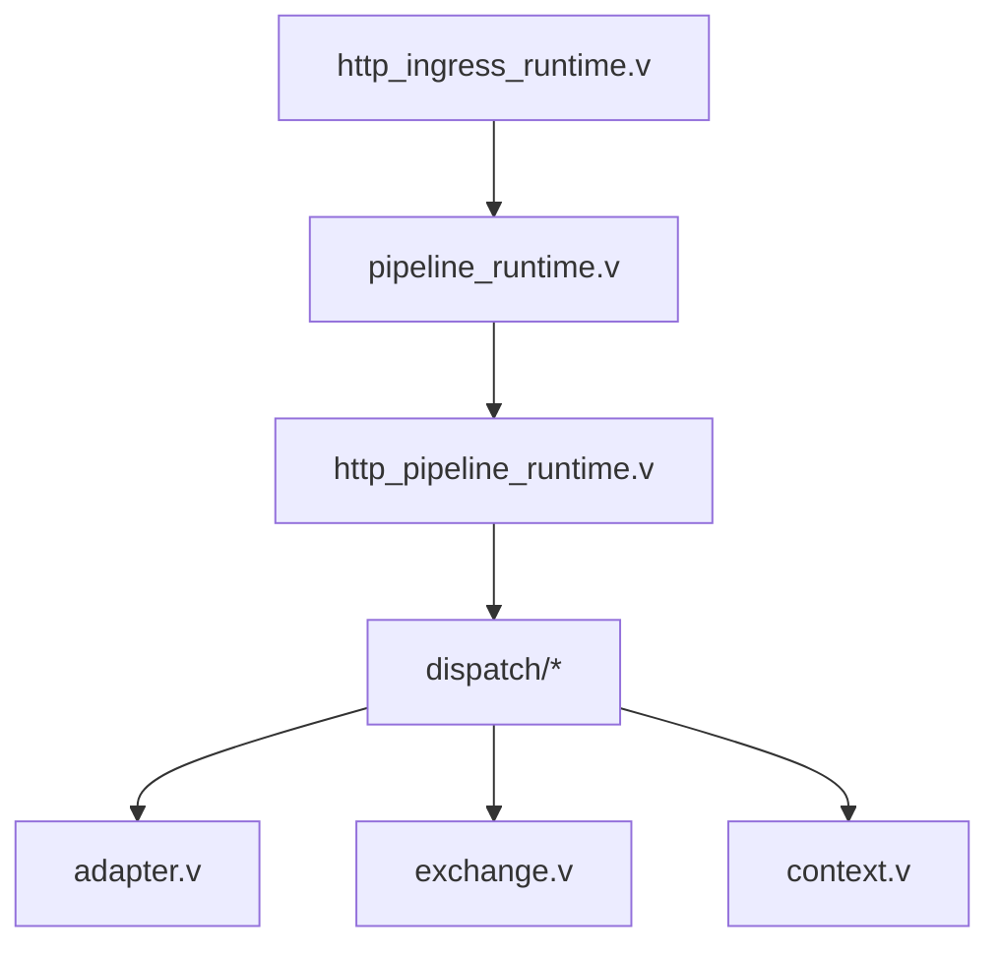

# 管道处理模式

<cite>
**本文引用的文件**   
- [src/dispatch/pipeline.v](file://src/dispatch/pipeline.v)
- [src/dispatch/exchange.v](file://src/dispatch/exchange.v)
- [src/dispatch/adapter.v](file://src/dispatch/adapter.v)
- [src/dispatch/context.v](file://src/dispatch/context.v)
- [src/pipeline_runtime.v](file://src/pipeline_runtime.v)
- [src/http_pipeline_runtime.v](file://src/http_pipeline_runtime.v)
- [src/http_ingress_runtime.v](file://src/http_ingress_runtime.v)
- [docs/PROTOCOL_PIPELINE_IMPLEMENTATION_PLAN.md](file://docs/PROTOCOL_PIPELINE_IMPLEMENTATION_PLAN.md)
- [docs/PROTOCOL_PIPELINE_RELAY_ARCHITECTURE.md](file://docs/PROTOCOL_PIPELINE_RELAY_ARCHITECTURE.md)
</cite>

## 目录
1. [简介](#简介)
2. [项目结构](#项目结构)
3. [核心组件](#核心组件)
4. [架构总览](#架构总览)
5. [详细组件分析](#详细组件分析)
6. [依赖关系分析](#依赖关系分析)
7. [性能考量](#性能考量)
8. [故障排查指南](#故障排查指南)
9. [结论](#结论)
10. [附录](#附录)

## 简介
本文件系统化阐述 vhttpd 的“管道处理模式”，围绕请求处理的管道架构设计，说明中间件链式调用、过滤器模式与责任链模式在系统中的落地方式。重点覆盖：
- HTTP 请求进入后的路由匹配、权限与安全校验、业务逻辑执行与响应渲染全流程
- 自定义中间件（Transform）开发指南：接口定义、上下文传递、错误处理机制
- 流式处理管道模式：数据转换、格式编码、背压控制等要点与实践建议

## 项目结构
vhttpd 将协议无关的“交换体”和“管道契约”从具体协议实现中解耦，形成可复用的管道内核；HTTP、WebSocket、MCP、Relay 等协议作为入站/出站适配器接入同一管道模型。

图表来源
- [src/http_ingress_runtime.v:111-122](file://src/http_ingress_runtime.v#L111-L122)
- [src/pipeline_runtime.v:91-129](file://src/pipeline_runtime.v#L91-L129)
- [src/http_pipeline_runtime.v:21-161](file://src/http_pipeline_runtime.v#L21-L161)
- [src/dispatch/adapter.v:1-137](file://src/dispatch/adapter.v#L1-L137)
- [src/dispatch/exchange.v:106-160](file://src/dispatch/exchange.v#L106-L160)

章节来源
- [src/http_ingress_runtime.v:111-122](file://src/http_ingress_runtime.v#L111-L122)
- [src/pipeline_runtime.v:91-129](file://src/pipeline_runtime.v#L91-L129)
- [src/http_pipeline_runtime.v:21-161](file://src/http_pipeline_runtime.v#L21-L161)
- [src/dispatch/adapter.v:1-137](file://src/dispatch/adapter.v#L1-L137)
- [src/dispatch/exchange.v:106-160](file://src/dispatch/exchange.v#L106-L160)

## 核心组件
- 交换体 Exchange：统一的内部消息载体，承载身份、元数据、负载与生命周期阶段信息，贯穿整个管道。
- 管道描述符 PipelineDescriptor：声明 ingress、transforms、policies、egress 及所需能力，用于编译期与运行期校验。
- 转换器 Transformer：中间件形态，支持 continue/respond/reject/forward/fanout/drop 等动作，构成链式过滤与变换。
- 入站/出站适配器 Ingress/Egress Adapter：协议边界适配，负责将外部协议转换为 Exchange，或将 DeliveryOutcome 写回协议层。
- 交付结果 DeliveryOutcome：协议无关的终态表达，统一驱动响应、文件、流计划、会话计划、中继投递或失败路径。
- 调度上下文 DispatchContext：面向不同协议场景的上下文构造，便于中间件与执行器访问会话、事件、元数据等。

章节来源
- [src/dispatch/exchange.v:1-160](file://src/dispatch/exchange.v#L1-L160)
- [src/dispatch/pipeline.v:1-119](file://src/dispatch/pipeline.v#L1-L119)
- [src/dispatch/adapter.v:1-137](file://src/dispatch/adapter.v#L1-L137)
- [src/dispatch/context.v:1-66](file://src/dispatch/context.v#L1-L66)

## 架构总览
vhttpd 的协议无关管道遵循“入站适配器 -> 标准化交换体 -> 零或多个转换器 -> 出站适配器”的数据通路，跨网络时通过 Relay 串联两端 vhttpd 实例。

图表来源
- [src/http_ingress_runtime.v:111-122](file://src/http_ingress_runtime.v#L111-L122)
- [src/pipeline_runtime.v:91-129](file://src/pipeline_runtime.v#L91-L129)
- [src/http_pipeline_runtime.v:21-161](file://src/http_pipeline_runtime.v#L21-L161)
- [src/dispatch/adapter.v:1-137](file://src/dispatch/adapter.v#L1-L137)
- [src/dispatch/exchange.v:106-160](file://src/dispatch/exchange.v#L106-L160)

## 详细组件分析

### 组件一：HTTP 请求处理管道（从进入到响应）
- 入口归一化：HTTP 入口将原始请求归一化为 Exchange，携带 trace_id、request_id、ingress 标识等。
- 路由匹配：基于编译后的管道规则进行方法、主机、路径、查询、头部匹配，得到运行时路由规则。
- 安全与策略：校验必填头、拒绝查询参数、最大请求体大小等，不满足则短路返回固定响应。
- 转换器链：按声明顺序执行 transforms，支持提前 respond/reject/forward/fanout/drop。
- 出站决策：根据 executor 类型走静态文件、上传、提供者动作、中继投递或阻塞（none）。
- 响应渲染：所有有限响应均通过 DeliveryOutcome 统一渲染，确保 header、trace、观察字段一致。

图表来源
- [src/http_pipeline_runtime.v:21-161](file://src/http_pipeline_runtime.v#L21-L161)

章节来源
- [src/http_pipeline_runtime.v:21-161](file://src/http_pipeline_runtime.v#L21-L161)
- [src/pipeline_runtime.v:91-129](file://src/pipeline_runtime.v#L91-L129)
- [docs/PROTOCOL_PIPELINE_IMPLEMENTATION_PLAN.md:989-1006](file://docs/PROTOCOL_PIPELINE_IMPLEMENTATION_PLAN.md#L989-L1006)

### 组件二：管道契约与能力校验
- 管道描述符包含 ingress、transforms、policies、egress 以及 required capabilities。
- 能力校验：比较入站能力与管道所需能力，输出稳定错误码与诊断信息，避免运行期 IO 耦合。
- 终端适配器：fixed-response、reject 等以纯值形式产出 DeliveryOutcome，保持协议无关性。

图表来源
- [src/dispatch/pipeline.v:1-119](file://src/dispatch/pipeline.v#L1-L119)
- [src/dispatch/adapter.v:1-137](file://src/dispatch/adapter.v#L1-L137)

章节来源
- [src/dispatch/pipeline.v:1-119](file://src/dispatch/pipeline.v#L1-L119)
- [src/dispatch/adapter.v:1-137](file://src/dispatch/adapter.v#L1-L137)

### 组件三：中间件（Transform）开发与上下文传递
- 中间件接口：实现 Transformer，具备 warmup/transform/close 生命周期；transform 返回 TransformAction 控制后续流程。
- 上下文传递：通过 Exchange.headers/metadata 与 DispatchContext 在不同阶段共享信息；不同协议场景由 context.v 提供专用构造器。
- 错误处理：transform 可直接 reject/respond，或通过 EgressAdapter 抛出失败类 DeliveryOutcome，统一进入渲染路径。

图表来源
- [src/dispatch/exchange.v:106-160](file://src/dispatch/exchange.v#L106-L160)
- [src/dispatch/context.v:1-66](file://src/dispatch/context.v#L1-L66)

章节来源
- [src/dispatch/exchange.v:106-160](file://src/dispatch/exchange.v#L106-L160)
- [src/dispatch/context.v:1-66](file://src/dispatch/context.v#L1-L66)

### 组件四：流式处理管道模式
- 流式语义：ExchangeKind 支持 stream_open/stream_chunk/stream_end，流数据不在管道核心聚合为 body，而是逐帧流转。
- 背压控制：背压由 stream 与 relay 运行时拥有，管道核心不缓冲整段响应，保证低延迟与大吞吐。
- 会话与中继：WebSocket/MCP 会话产生 session_* 交换体；跨节点通过 Relay 透传，保持长连接与状态一致性。

图表来源
- [src/dispatch/exchange.v:11-22](file://src/dispatch/exchange.v#L11-L22)
- [docs/PROTOCOL_PIPELINE_IMPLEMENTATION_PLAN.md:397-406](file://docs/PROTOCOL_PIPELINE_IMPLEMENTATION_PLAN.md#L397-L406)

章节来源
- [src/dispatch/exchange.v:11-22](file://src/dispatch/exchange.v#L11-L22)
- [docs/PROTOCOL_PIPELINE_IMPLEMENTATION_PLAN.md:397-406](file://docs/PROTOCOL_PIPELINE_IMPLEMENTATION_PLAN.md#L397-L406)

### 组件五：跨节点中继（Relay）管道
- 公共入口 -> 本地管道 -> 中继出站 -> 远端中继入站 -> 本地管道 -> 应用执行器
- 适用于公网到内网的转发、长连接恢复、跨节点追踪传播等场景。

图表来源
- [docs/PROTOCOL_PIPELINE_RELAY_ARCHITECTURE.md:1-645](file://docs/PROTOCOL_PIPELINE_RELAY_ARCHITECTURE.md#L1-L645)

章节来源
- [docs/PROTOCOL_PIPELINE_RELAY_ARCHITECTURE.md:1-645](file://docs/PROTOCOL_PIPELINE_RELAY_ARCHITECTURE.md#L1-L645)

## 依赖关系分析
- 协议无关契约位于 dispatch 模块，HTTP 管道运行时仅消费这些契约，避免与具体协议耦合。
- HTTP 入口负责协议级归一化与动态引擎选择，随后交由 PipelineRuntime 与 HttpPipelineRuntime 完成策略与出站决策。
- 终端适配器与转换器通过能力校验保障组合正确性，减少运行期错误。

图表来源
- [src/http_ingress_runtime.v:111-122](file://src/http_ingress_runtime.v#L111-L122)
- [src/pipeline_runtime.v:91-129](file://src/pipeline_runtime.v#L91-L129)
- [src/http_pipeline_runtime.v:21-161](file://src/http_pipeline_runtime.v#L21-L161)
- [src/dispatch/adapter.v:1-137](file://src/dispatch/adapter.v#L1-L137)
- [src/dispatch/exchange.v:1-160](file://src/dispatch/exchange.v#L1-L160)
- [src/dispatch/context.v:1-66](file://src/dispatch/context.v#L1-L66)

章节来源
- [src/http_ingress_runtime.v:111-122](file://src/http_ingress_runtime.v#L111-L122)
- [src/pipeline_runtime.v:91-129](file://src/pipeline_runtime.v#L91-L129)
- [src/http_pipeline_runtime.v:21-161](file://src/http_pipeline_runtime.v#L21-L161)
- [src/dispatch/adapter.v:1-137](file://src/dispatch/adapter.v#L1-L137)
- [src/dispatch/exchange.v:1-160](file://src/dispatch/exchange.v#L1-L160)
- [src/dispatch/context.v:1-66](file://src/dispatch/context.v#L1-L66)

## 性能考量
- 拷贝预算：管道各阶段尽量避免显式克隆，仅在所有权转移边界（队列、中继帧、扇出子任务）允许复制。
- 并发有界：每个引擎、转换器队列、中继通道与流缓冲区均有上限；VJSX 复用 lane 而非无界线程。
- 性能基线：HTTP 兼容路径相较基线不超过 5% 吞吐退化；静态响应路径独立于 PHP/VJSX 执行；缓存命中不触发应用转换器除非配置要求。
- 流式路径：永不缓冲完整响应，维持端到端低延迟。

章节来源
- [docs/PROTOCOL_PIPELINE_IMPLEMENTATION_PLAN.md:638-659](file://docs/PROTOCOL_PIPELINE_IMPLEMENTATION_PLAN.md#L638-L659)

## 故障排查指南
- 必填头缺失：会记录 warn 日志并返回 403，附带 pipeline_id、header 名等信息，便于快速定位。
- 拒绝查询参数：命中后返回 403，日志包含 query 名称与 pipeline_id。
- 请求体过大：超过阈值返回 413，日志包含 body_len 与 max_body_bytes。
- 静态资源未命中：返回 404，日志包含 file_path 与 pipeline_id。
- 提供者动作缺失/无效：返回错误，日志包含 adapter_id 与错误码。
- 阻塞（none）：返回 404，日志包含 pipeline_id。

章节来源
- [src/http_pipeline_runtime.v:21-161](file://src/http_pipeline_runtime.v#L21-L161)

## 结论
vhttpd 的管道处理模式以“协议无关的交换体+管道契约”为核心，将中间件链式调用、过滤器模式与责任链模式统一在一致的抽象之上。HTTP 入口负责协议归一化与动态引擎选择，PipelineRuntime 与 HttpPipelineRuntime 负责策略校验、转换器链执行与出站决策，最终通过 DeliveryOutcome 统一渲染。该设计既保证了扩展性与可观测性，又兼顾了流式处理与跨节点中继的高性能需求。

## 附录
- 自定义中间件开发步骤（概览）
  - 实现 Transformer 接口，定义 id/capabilities/warmup/transform/close
  - 在 transform 中读取/写入 Exchange.headers/metadata，必要时使用 DispatchContext 获取会话与事件信息
  - 通过 TransformAction.respond/reject 提前终结流程，或 continue_pipeline 继续后续中间件
  - 在管道描述符中声明 transforms 列表，确保能力匹配与顺序正确
- 流式处理最佳实践
  - 避免在中间件中缓存完整响应，按需分块处理
  - 利用 stream_plan/session_plan 交付结果，让上层运行时接管连接与背压
  - 在中继场景中关注 completion_mode 与超时配置，确保长连接稳定性