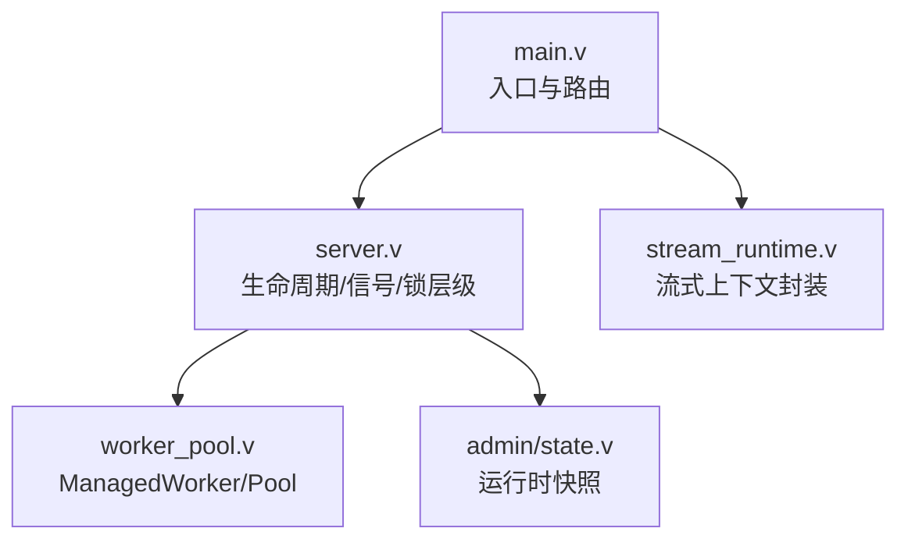
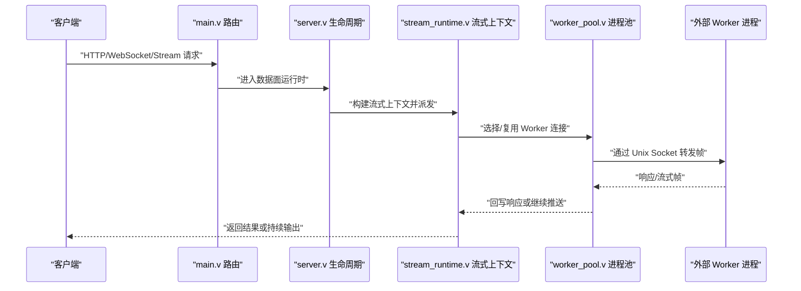
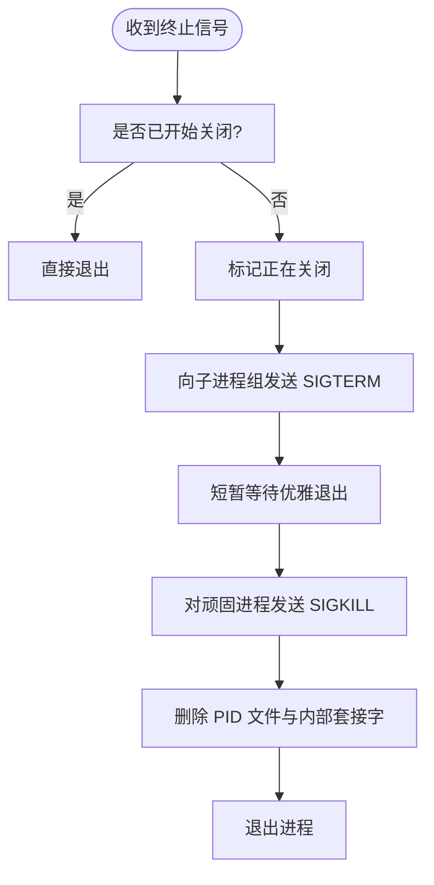
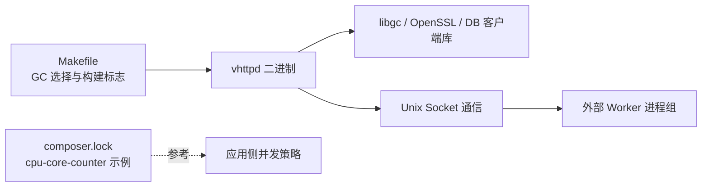

# 内存和CPU优化

<cite>
**本文引用的文件**
- [README.md](file://README.md)
- [Makefile](file://Makefile)
- [src/main.v](file://src/main.v)
- [src/server.v](file://src/server.v)
- [src/stream_runtime.v](file://src/stream_runtime.v)
- [src/upstream/transport/worker_pool.v](file://src/upstream/transport/worker_pool.v)
- [src/admin/state.v](file://src/admin/state.v)
- [articles/11-observability.md](file://articles/11-observability.md)
- [examples/codexbot-app/composer.lock](file://examples/codexbot-app/composer.lock)
</cite>

## 目录
1. [引言](#引言)
2. [项目结构](#项目结构)
3. [核心组件](#核心组件)
4. [架构总览](#架构总览)
5. [详细组件分析](#详细组件分析)
6. [依赖关系分析](#依赖关系分析)
7. [性能考量](#性能考量)
8. [故障排查指南](#故障排查指南)
9. [结论](#结论)
10. [附录](#附录)

## 引言
本指南聚焦 VHTTPD 的内存与 CPU 性能优化，覆盖以下主题：
- 内存管理机制与 GC 调优（构建期 GC 选择、进程级内存回收策略）
- 内存分配优化（Worker 池、队列容量、超时与退避）
- CPU 使用优化（线程/协程调度、亲和性、并发模型）
- 内存泄漏检测与定位方法
- 性能剖析工具与指标采集
- CPU 密集型任务优化（异步处理、并行计算）
- 生产环境监控与告警配置建议

## 项目结构
VHTTPD 以 veb 为 HTTP 运行时基础，自身专注于传输、Worker 编排、流式处理与可观测性。关键入口与模块：
- 主程序入口与请求路由分发
- 服务器生命周期与信号处理
- Worker 进程池管理（启动、优雅退出、重启退避）
- 流式运行时上下文封装
- 管理员状态快照（用于监控与诊断）

图表来源
- [src/main.v:1-117](file://src/main.v#L1-L117)
- [src/server.v:1-372](file://src/server.v#L1-L372)
- [src/stream_runtime.v:1-48](file://src/stream_runtime.v#L1-L48)
- [src/upstream/transport/worker_pool.v:1-219](file://src/upstream/transport/worker_pool.v#L1-L219)
- [src/admin/state.v:86-102](file://src/admin/state.v#L86-L102)

章节来源
- [README.md:1-174](file://README.md#L1-L174)
- [src/main.v:1-117](file://src/main.v#L1-L117)
- [src/server.v:1-372](file://src/server.v#L1-L372)
- [src/stream_runtime.v:1-48](file://src/stream_runtime.v#L1-L48)
- [src/upstream/transport/worker_pool.v:1-219](file://src/upstream/transport/worker_pool.v#L1-L219)
- [src/admin/state.v:86-102](file://src/admin/state.v#L86-L102)

## 核心组件
- 主程序与路由：负责解析参数、注册中间件、将请求路由到数据面运行时。
- 服务器生命周期：定义全局锁层级、信号处理、多监听器模式、时区配置等。
- Worker 进程池：管理外部 Worker 子进程组，包含启动、等待 socket、优雅停止、重启退避。
- 流式运行时：封装 open/next/close 分派函数，统一事件发射接口。
- 管理员状态：聚合活跃连接、会话、统计信息，供监控面板消费。

章节来源
- [src/main.v:1-117](file://src/main.v#L1-L117)
- [src/server.v:1-372](file://src/server.v#L1-L372)
- [src/stream_runtime.v:1-48](file://src/stream_runtime.v#L1-L48)
- [src/upstream/transport/worker_pool.v:1-219](file://src/upstream/transport/worker_pool.v#L1-L219)
- [src/admin/state.v:86-102](file://src/admin/state.v#L86-L102)

## 架构总览
下图展示从客户端到执行器的整体路径，以及 Worker 进程管理与流式处理的关键交互点。

图表来源
- [src/main.v:83-116](file://src/main.v#L83-L116)
- [src/server.v:276-319](file://src/server.v#L276-L319)
- [src/stream_runtime.v:30-47](file://src/stream_runtime.v#L30-L47)
- [src/upstream/transport/worker_pool.v:103-136](file://src/upstream/transport/worker_pool.v#L103-L136)

## 详细组件分析

### 内存管理与 GC 调优
- 构建期 GC 选择
  - Makefile 支持通过环境变量选择 GC，默认自动探测 Boehm GC；CI 构建显式启用 Boehm GC。
  - 发布产物会打包 libgc 等运行时库，便于在无系统包环境中运行。
- 进程级内存回收策略
  - 通过 max_requests 定期重启 Worker，避免长期驻留导致的内存增长。
  - 结合 read_timeout、queue_capacity、queue_timeout 控制背压，防止内存积压。
- 内存使用观测
  - 管理员状态提供 memory_mb 指标，可用于监控趋势与异常峰值。

章节来源
- [Makefile:6-11](file://Makefile#L6-L11)
- [Makefile:96-101](file://Makefile#L96-L101)
- [README.md:242-247](file://README.md#L242-L247)
- [README.md:295-297](file://README.md#L295-L297)
- [README.md:337-345](file://README.md#L337-L345)
- [articles/11-observability.md:602-618](file://articles/11-observability.md#L602-L618)
- [articles/11-observability.md:622-632](file://articles/11-observability.md#L622-L632)

### CPU 使用优化与并发模型
- Worker 池大小
  - 推荐按 CPU 核心数调整，常见经验值为“核心数 × 2”，需结合 I/O 与业务特性压测确定。
- 队列与超时
  - queue_capacity 与 queue_timeout_ms 决定背压阈值与等待上限，避免 CPU 空转与忙等。
- 流式与长连接
  - 流式场景适当增大 read_timeout_ms，减少频繁重试带来的 CPU 抖动。
- 内嵌 vjsx 线程数
  - 在 in-proc 模式下，thread_count 影响并发度，应结合负载特征与延迟目标调优。

章节来源
- [articles/11-observability.md:624-632](file://articles/11-observability.md#L624-L632)
- [articles/11-observability.md:634-646](file://articles/11-observability.md#L634-L646)
- [articles/11-observability.md:648-654](file://articles/11-observability.md#L648-L654)
- [README.md:646-652](file://README.md#L646-L652)

### 进程与资源管理（优雅退出与清理）
- 信号处理
  - 接收 SIGINT/SIGTERM 后，向所有子进程组发送终止信号，清理 PID 文件与内部套接字。
- Worker 停止流程
  - 先 SIGTERM 允许优雅退出，再 SIGKILL 确保残留进程被清理，最后 wait/close 释放资源。
- 进程组追踪
  - 维护子进程 PID 列表，便于统一终止与日志审计。

图表来源
- [src/server.v:116-135](file://src/server.v#L116-L135)
- [src/upstream/transport/worker_pool.v:155-176](file://src/upstream/transport/worker_pool.v#L155-L176)
- [src/upstream/transport/worker_pool.v:178-202](file://src/upstream/transport/worker_pool.v#L178-L202)

章节来源
- [src/server.v:116-135](file://src/server.v#L116-L135)
- [src/upstream/transport/worker_pool.v:155-176](file://src/upstream/transport/worker_pool.v#L155-L176)
- [src/upstream/transport/worker_pool.v:178-202](file://src/upstream/transport/worker_pool.v#L178-L202)

### 锁层级与并发安全
- 全局锁层级
  - 明确 L0–L7 获取顺序，禁止逆序加锁，降低死锁风险。
- 读锁优化建议
  - 只读聚合场景建议使用读写锁提升并发度（文档中提出改进建议）。

章节来源
- [src/server.v:4-24](file://src/server.v#L4-L24)
- [docs/refactor_0601.md:46-51](file://docs/refactor_0601.md#L46-L51)

### 流式运行时上下文
- 统一 emit 接口与 open/next/close 分派函数封装，便于扩展与测试。
- 通过闭包捕获 App 引用，实现跨层事件传播。

章节来源
- [src/stream_runtime.v:1-48](file://src/stream_runtime.v#L1-L48)

### 管理员状态与监控指标
- 聚合活跃 WebSocket、Upstreams、MCP 会话、网关数量等指标。
- 暴露 memory_mb 等关键指标，配合外部监控系统进行告警。

章节来源
- [src/admin/state.v:86-102](file://src/admin/state.v#L86-L102)
- [articles/11-observability.md:602-618](file://articles/11-observability.md#L602-L618)

## 依赖关系分析
- 构建期依赖
  - Boehm GC 作为默认 GC 选项，CI 构建显式启用，发布包附带 libgc 等运行时库。
- 运行时依赖
  - 通过 Unix Socket 与外部 Worker 通信，进程组管理保证优雅退出。
- 第三方库
  - PHP 生态中的 CPU 核心计数库可作为参考，辅助应用侧并发策略制定。

图表来源
- [Makefile:6-11](file://Makefile#L6-L11)
- [Makefile:96-101](file://Makefile#L96-L101)
- [README.md:337-345](file://README.md#L337-L345)
- [examples/codexbot-app/composer.lock:198-235](file://examples/codexbot-app/composer.lock#L198-L235)

章节来源
- [Makefile:6-11](file://Makefile#L6-L11)
- [Makefile:96-101](file://Makefile#L96-L101)
- [README.md:337-345](file://README.md#L337-L345)
- [examples/codexbot-app/composer.lock:198-235](file://examples/codexbot-app/composer.lock#L198-L235)

## 性能考量
- 内存
  - 合理设置 max_requests 定期重启 Worker，缓解内存泄漏累积。
  - 调整 queue_capacity 与 queue_timeout_ms，避免请求堆积导致内存膨胀。
  - 关注 memory_mb 指标趋势，识别异常增长。
- CPU
  - 根据 CPU 核心数与 I/O 特征调整 pool_size。
  - 流式场景提高 read_timeout_ms，减少频繁重试造成的 CPU 抖动。
  - in-proc vjsx 的 thread_count 应与负载匹配，避免过度并行导致上下文切换开销。
- 构建与部署
  - 使用 Boehm GC 构建，并在发布包中携带必要运行时库，减少动态加载失败与回退成本。

章节来源
- [articles/11-observability.md:622-632](file://articles/11-observability.md#L622-L632)
- [articles/11-observability.md:634-646](file://articles/11-observability.md#L634-L646)
- [articles/11-observability.md:648-654](file://articles/11-observability.md#L648-L654)
- [README.md:242-247](file://README.md#L242-L247)
- [README.md:295-297](file://README.md#L295-L297)
- [README.md:337-345](file://README.md#L337-L345)

## 故障排查指南
- 内存泄漏排查
  - 观察 memory_mb 指标，结合 Worker 内存分布，定位异常增长来源。
  - 通过 max_requests 限制单次 Worker 生命周期内的最大请求数，周期性重启以释放内存。
- CPU 热点定位
  - 检查 pool_size 与 queue 配置是否合理，避免忙等或饥饿。
  - 针对流式场景，评估 read_timeout_ms 是否过短导致频繁重试。
- 进程与资源问题
  - 确认信号处理逻辑是否生效，子进程组是否正确终止。
  - 检查 PID 文件与内部套接字是否在退出时被清理。

章节来源
- [articles/11-observability.md:602-618](file://articles/11-observability.md#L602-L618)
- [articles/11-observability.md:622-632](file://articles/11-observability.md#L622-L632)
- [src/server.v:116-135](file://src/server.v#L116-L135)
- [src/upstream/transport/worker_pool.v:155-176](file://src/upstream/transport/worker_pool.v#L155-L176)

## 结论
通过对构建期 GC 选择、Worker 生命周期管理、队列与超时配置、锁层级规范与管理员指标的综合优化，可在生产环境中显著提升 VHTTPD 的内存稳定性与 CPU 利用率。建议结合监控与告警体系，持续跟踪 memory_mb、pool 占用、队列长度与超时比例，形成闭环的性能治理流程。

## 附录
- 常用 CLI 与配置项
  - worker-pool-size、worker-max-requests、worker-read-timeout-ms、worker-queue-capacity、worker-queue-timeout-ms、admin-host、admin-port、admin-token 等。
- 多监听器与站点隔离
  - 多监听器模式下，每个站点拥有独立运行时与执行器选择，便于差异化调优。

章节来源
- [README.md:1065-1089](file://README.md#L1065-L1089)
- [README.md:533-603](file://README.md#L533-L603)