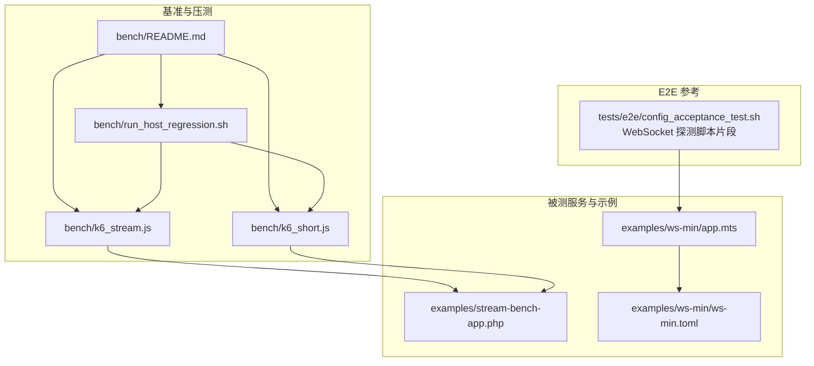
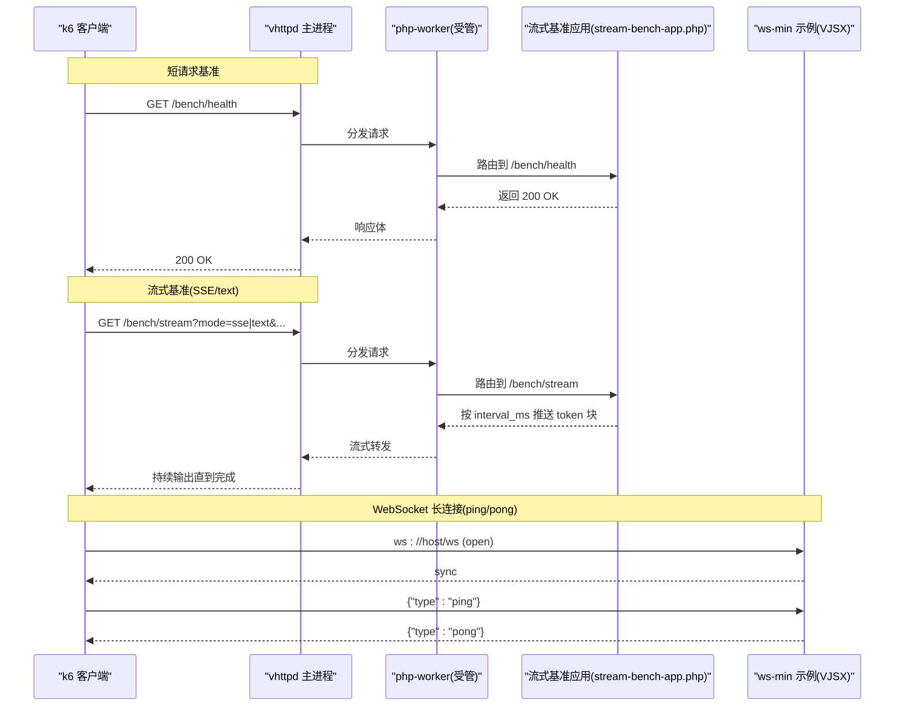
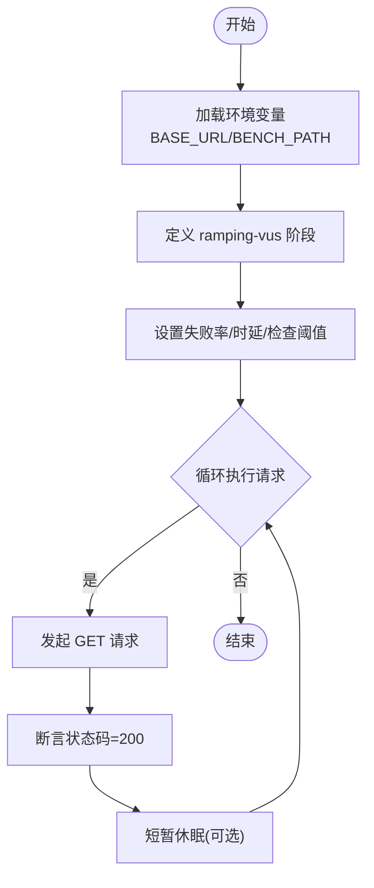
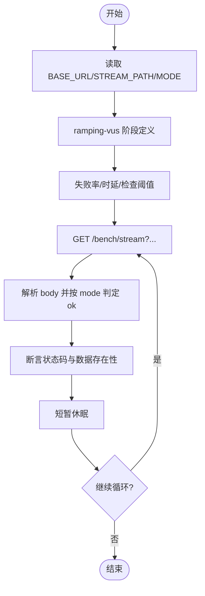
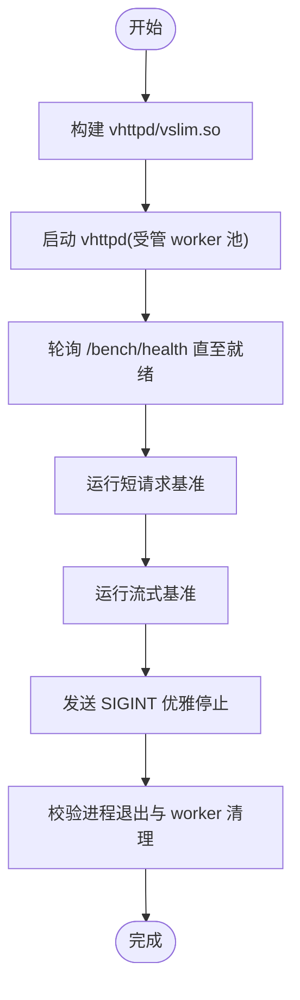
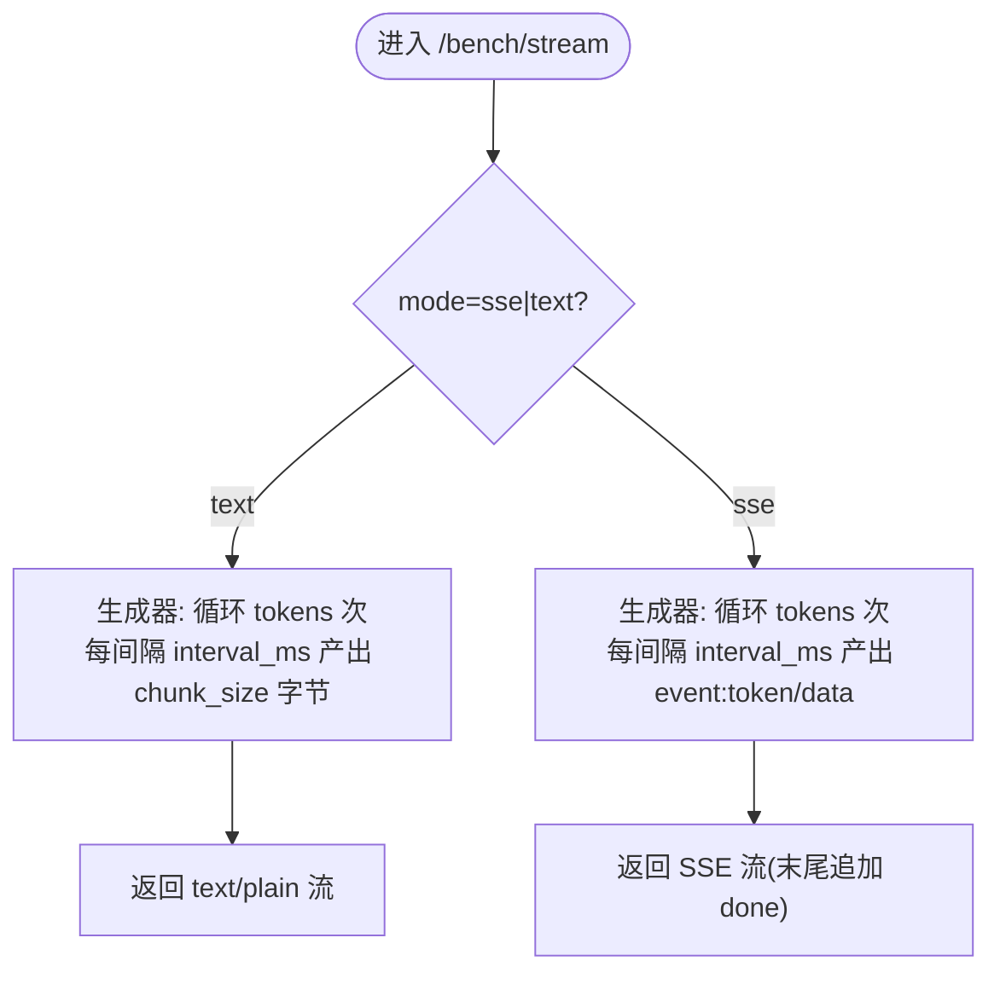
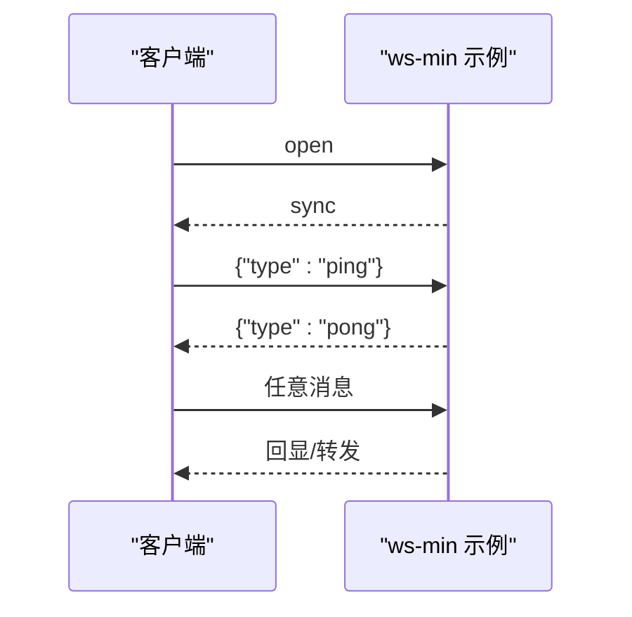
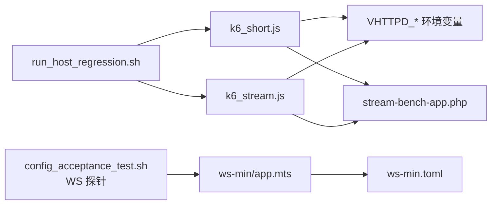

# 基准测试和压测

<cite>
**本文引用的文件**
- [bench/README.md](file://bench/README.md)
- [bench/k6_short.js](file://bench/k6_short.js)
- [bench/k6_stream.js](file://bench/k6_stream.js)
- [bench/run_host_regression.sh](file://bench/run_host_regression.sh)
- [examples/stream-bench-app.php](file://examples/stream-bench-app.php)
- [examples/ws-min/app.mts](file://examples/ws-min/app.mts)
- [examples/ws-min/ws-min.toml](file://examples/ws-min/ws-min.toml)
- [tests/e2e/config_acceptance_test.sh](file://tests/e2e/config_acceptance_test.sh)
</cite>

## 目录
1. [简介](#简介)
2. [项目结构](#项目结构)
3. [核心组件](#核心组件)
4. [架构总览](#架构总览)
5. [详细组件分析](#详细组件分析)
6. [依赖关系分析](#依赖关系分析)
7. [性能考量](#性能考量)
8. [故障排查指南](#故障排查指南)
9. [结论](#结论)
10. [附录](#附录)

## 简介
本指南面向 VHTTPD 的性能测试与压力测试，聚焦以下目标：
- 使用 k6 进行 HTTP API、SSE/text 流式响应以及 WebSocket 长连接的压测方法
- 设计可复现的基准场景与对比矩阵
- 搭建自动化回归流程（含一键主机回归脚本）
- 生成并解读测试结果，建立性能基线与趋势分析
- 定位与复现性能问题的系统化方法

## 项目结构
与性能测试直接相关的目录与文件如下：
- bench：k6 脚本与一键回归脚本、使用说明
- examples：流式基准应用与最小 WebSocket 示例
- tests/e2e：端到端测试中内嵌的 WebSocket 探测脚本（可用于扩展压测）

图表来源
- [bench/README.md:1-158](file://bench/README.md#L1-L158)
- [bench/k6_short.js:1-44](file://bench/k6_short.js#L1-L44)
- [bench/k6_stream.js:1-52](file://bench/k6_stream.js#L1-L52)
- [bench/run_host_regression.sh:1-130](file://bench/run_host_regression.sh#L1-L130)
- [examples/stream-bench-app.php:1-88](file://examples/stream-bench-app.php#L1-L88)
- [examples/ws-min/app.mts:1-44](file://examples/ws-min/app.mts#L1-L44)
- [examples/ws-min/ws-min.toml:1-16](file://examples/ws-min/ws-min.toml#L1-L16)
- [tests/e2e/config_acceptance_test.sh:779-830](file://tests/e2e/config_acceptance_test.sh#L779-L830)

章节来源
- [bench/README.md:1-158](file://bench/README.md#L1-L158)
- [bench/run_host_regression.sh:1-130](file://bench/run_host_regression.sh#L1-L130)

## 核心组件
- k6 短请求基准脚本：用于对静态或简单业务接口进行吞吐与时延评估，内置渐进式并发与阈值断言。
- k6 流式基准脚本：针对 SSE 与 text 流式响应，验证数据完整性与整体时延。
- 一键主机回归脚本：自动构建、启动 vhttpd、运行短请求与流式基准、优雅停止并校验进程清理。
- 流式基准应用：提供确定性 /bench/stream 接口，支持 tokens、interval_ms、chunk_size 等参数化控制。
- WebSocket 最小示例与配置：提供 ws 回显与 ping/pong 能力，便于编写 WS 压测用例。
- E2E 中的 WebSocket 探测脚本：可作为 WS 压测客户端参考实现。

章节来源
- [bench/k6_short.js:1-44](file://bench/k6_short.js#L1-L44)
- [bench/k6_stream.js:1-52](file://bench/k6_stream.js#L1-L52)
- [bench/run_host_regression.sh:1-130](file://bench/run_host_regression.sh#L1-L130)
- [examples/stream-bench-app.php:1-88](file://examples/stream-bench-app.php#L1-L88)
- [examples/ws-min/app.mts:1-44](file://examples/ws-min/app.mts#L1-L44)
- [examples/ws-min/ws-min.toml:1-16](file://examples/ws-min/ws-min.toml#L1-L16)
- [tests/e2e/config_acceptance_test.sh:779-830](file://tests/e2e/config_acceptance_test.sh#L779-L830)

## 架构总览
下图展示从 k6 到 vhttpd 再到 PHP/Node 执行器的关键调用路径，覆盖短请求、SSE/text 流与 WebSocket 三种典型场景。

图表来源
- [bench/k6_short.js:1-44](file://bench/k6_short.js#L1-L44)
- [bench/k6_stream.js:1-52](file://bench/k6_stream.js#L1-L52)
- [examples/stream-bench-app.php:1-88](file://examples/stream-bench-app.php#L1-L88)
- [examples/ws-min/app.mts:1-44](file://examples/ws-min/app.mts#L1-L44)

## 详细组件分析

### 短请求基准(k6_short.js)
- 场景模型：ramping-vus 渐进式并发，先升后降，带优雅收尾
- 阈值策略：失败率、P95/P99 时延、检查通过率
- 标签维度：endpoint、profile，便于结果聚合与筛选
- 适用对象：健康检查、静态资源、轻量 API

图表来源
- [bench/k6_short.js:1-44](file://bench/k6_short.js#L1-L44)

章节来源
- [bench/k6_short.js:1-44](file://bench/k6_short.js#L1-L44)

### 流式基准(k6_stream.js)
- 场景模型：ramping-vus，适合长连接/流式负载
- 阈值策略：失败率放宽至 5%，P95 时延上限更高，检查通过率要求
- 断言逻辑：根据 mode(sse/text) 判断响应体是否包含预期标记或长度大于 0
- 适用对象：SSE 事件流、text 分块流

图表来源
- [bench/k6_stream.js:1-52](file://bench/k6_stream.js#L1-L52)

章节来源
- [bench/k6_stream.js:1-52](file://bench/k6_stream.js#L1-L52)

### 一键主机回归(run_host_regression.sh)
- 功能要点：
  - 自动构建 vhttpd 与 vslim.so
  - 以受管 worker 池方式启动 vhttpd
  - 等待健康端点就绪
  - 依次运行短请求与流式基准
  - 发送 SIGINT 优雅退出，校验无 php-worker 泄漏
- 变量约定：统一使用 VHTTPD_* 前缀，兼容旧名；可通过 RUN_K6 跳过 k6 仅做生命周期验证

图表来源
- [bench/run_host_regression.sh:1-130](file://bench/run_host_regression.sh#L1-L130)

章节来源
- [bench/run_host_regression.sh:1-130](file://bench/run_host_regression.sh#L1-L130)

### 流式基准应用(stream-bench-app.php)
- 提供两个端点：
  - /bench/health：返回 200 OK
  - /bench/stream：支持 mode=sse|text，tokens、interval_ms、chunk_size 可控
- 行为特征：
  - text：按 interval_ms 间隔 yield 固定大小 chunk
  - sse：按 interval_ms 间隔推送 event:token/data 事件，最后推送 done
- 用途：为 k6 流式基准提供稳定、可重复的数据源

图表来源
- [examples/stream-bench-app.php:1-88](file://examples/stream-bench-app.php#L1-L88)

章节来源
- [examples/stream-bench-app.php:1-88](file://examples/stream-bench-app.php#L1-L88)

### WebSocket 最小示例与压测参考
- ws-min 示例：
  - open 时下发 set_meta/join/sync
  - message 处理 ping→pong 与回显
- 配置：启用 websocket_dispatch，绑定站点与 VJSX 运行时
- E2E 探测脚本：Node 实现的 WebSocket 探针，记录 opened/closed/messages，适合作为 WS 压测客户端原型

图表来源
- [examples/ws-min/app.mts:1-44](file://examples/ws-min/app.mts#L1-L44)
- [examples/ws-min/ws-min.toml:1-16](file://examples/ws-min/ws-min.toml#L1-L16)
- [tests/e2e/config_acceptance_test.sh:779-830](file://tests/e2e/config_acceptance_test.sh#L779-L830)

章节来源
- [examples/ws-min/app.mts:1-44](file://examples/ws-min/app.mts#L1-L44)
- [examples/ws-min/ws-min.toml:1-16](file://examples/ws-min/ws-min.toml#L1-L16)
- [tests/e2e/config_acceptance_test.sh:779-830](file://tests/e2e/config_acceptance_test.sh#L779-L830)

## 依赖关系分析
- 脚本与环境变量
  - k6 脚本通过环境变量注入目标地址、路径与模式，避免硬编码，提升可移植性
  - 回归脚本统一管理构建、启动、压测与清理，屏蔽底层差异
- 被测应用
  - 流式基准应用提供确定性的流式数据，便于隔离传输层开销与可扩展性分析
  - ws-min 示例提供最小可用的 WS 交互，便于快速验证与扩展压测
- 外部工具
  - k6：压测引擎
  - Node：E2E 中的 WS 探针（可复用为自定义 WS 压测客户端）

图表来源
- [bench/k6_short.js:1-44](file://bench/k6_short.js#L1-L44)
- [bench/k6_stream.js:1-52](file://bench/k6_stream.js#L1-L52)
- [bench/run_host_regression.sh:1-130](file://bench/run_host_regression.sh#L1-L130)
- [examples/stream-bench-app.php:1-88](file://examples/stream-bench-app.php#L1-L88)
- [examples/ws-min/app.mts:1-44](file://examples/ws-min/app.mts#L1-L44)
- [examples/ws-min/ws-min.toml:1-16](file://examples/ws-min/ws-min.toml#L1-L16)
- [tests/e2e/config_acceptance_test.sh:779-830](file://tests/e2e/config_acceptance_test.sh#L779-L830)

章节来源
- [bench/README.md:1-158](file://bench/README.md#L1-L158)
- [bench/run_host_regression.sh:1-130](file://bench/run_host_regression.sh#L1-L130)

## 性能考量
- 场景设计建议
  - 短请求：关注 P95/P99 时延与错误率，采用 ramping-vus 模拟真实流量波动
  - 流式响应：固定 tokens 变化 interval_ms 以测量传输开销；固定 interval_ms 变化 tokens 以验证线性扩展
  - WebSocket：基于 ws-min 示例扩展多会话并发、心跳保活与消息体积梯度
- 指标采集
  - 利用 k6 tags 区分 endpoint/profile/mode，便于结果聚合
  - 结合 vhttpd 事件日志与 stdout 日志，关联压测时间窗
- 环境一致性
  - 使用回归脚本锁定构建产物与启动参数，确保可比性
  - 明确 worker 池大小与 socket 前缀，避免进程泄漏干扰

[本节为通用指导，不直接分析具体文件]

## 故障排查指南
- 常见现象与定位
  - 服务未就绪：回归脚本会轮询 /bench/health，若超时将打印最近日志并给出提示
  - Worker 泄漏：停止后检测是否存在残留 php-worker 进程，若有则列出详细信息
  - 流式数据缺失：检查 stream-bench-app 的路由与参数，确认 mode/tokens/interval_ms/chunk_size 合理
  - WebSocket 连通性问题：参考 E2E 探针逻辑，记录 opened/closed/messages，定位握手或消息收发异常
- 建议步骤
  - 使用 RUN_K6=0 仅验证生命周期，排除 k6 引入的不确定性
  - 逐步缩小范围：先 /bench/health，再 /bench/stream，最后 WS 示例
  - 收集证据：stdout_log、event_log、k6 输出与探针 JSON 结果

章节来源
- [bench/run_host_regression.sh:1-130](file://bench/run_host_regression.sh#L1-L130)
- [tests/e2e/config_acceptance_test.sh:779-830](file://tests/e2e/config_acceptance_test.sh#L779-L830)

## 结论
- 仓库已提供开箱即用的 k6 短请求与流式基准脚本，配合回归脚本可实现“一键式”性能回归
- 流式基准应用与 ws-min 示例为不同协议场景提供了稳定的被测端
- 建议在 CI 中集成回归脚本与 k6 阈值断言，沉淀性能基线并监控趋势
- 对于复杂场景（如大规模 WS 会话），可在 E2E 探针基础上扩展为专用压测客户端

[本节为总结性内容，不直接分析具体文件]

## 附录

### 常用命令速查
- 安装 k6：参见 README 前置说明
- 运行短请求基准：参考 README 第 1 节
- 运行流式基准：参考 README 第 2 节
- 一键主机回归：参考 README 第 0 节

章节来源
- [bench/README.md:1-158](file://bench/README.md#L1-L158)