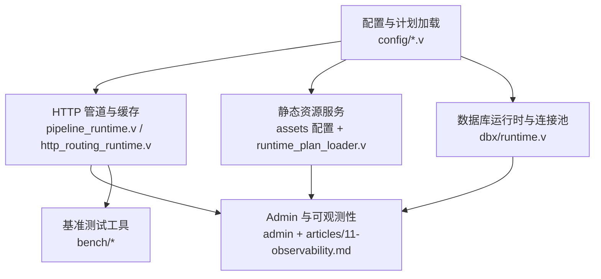
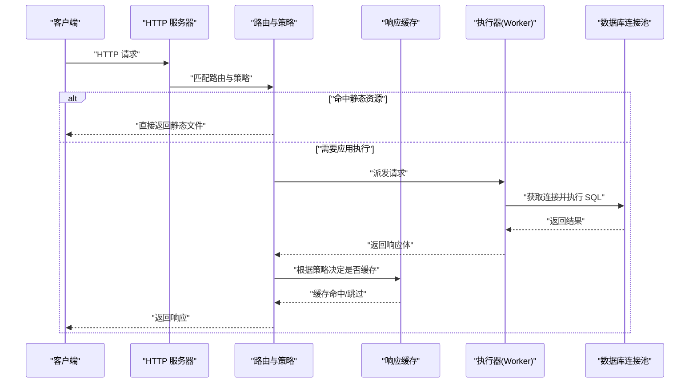
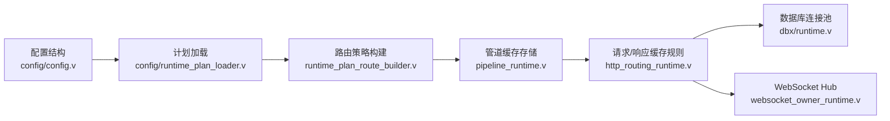

# 性能优化最佳实践

<cite>
**本文引用的文件列表**
- [bench/README.md](file://bench/README.md)
- [bench/k6_short.js](file://bench/k6_short.js)
- [bench/k6_stream.js](file://bench/k6_stream.js)
- [bench/run_host_regression.sh](file://bench/run_host_regression.sh)
- [config/vhttpd.example.toml](file://config/vhttpd.example.toml)
- [src/config/config.v](file://src/config/config.v)
- [src/config/runtime_plan_loader.v](file://src/config/runtime_plan_loader.v)
- [src/pipeline_runtime.v](file://src/pipeline_runtime.v)
- [src/http_routing_runtime.v](file://src/http_routing_runtime.v)
- [src/runtime_plan_route_builder.v](file://src/runtime_plan_route_builder.v)
- [src/dbx/runtime.v](file://src/dbx/runtime.v)
- [src/cache_runtime.v](file://src/cache_runtime.v)
- [articles/11-observability.md](file://articles/11-observability.md)
- [src/websocket_owner_runtime.v](file://src/websocket_owner_runtime.v)
</cite>

## 目录
1. [引言](#引言)
2. [项目结构](#项目结构)
3. [核心组件](#核心组件)
4. [架构总览](#架构总览)
5. [详细组件分析](#详细组件分析)
6. [依赖关系分析](#依赖关系分析)
7. [性能考量与调优建议](#性能考量与调优建议)
8. [基准测试与压测方法](#基准测试与压测方法)
9. [故障排查指南](#故障排查指南)
10. [结论](#结论)
11. [附录](#附录)

## 引言
本指南面向 VHTTPD 的生产环境运维与开发者，聚焦于可落地的性能优化最佳实践。内容覆盖服务器配置、执行器参数、连接池管理、内存使用优化、并发处理策略、缓存策略、数据库查询优化、静态文件服务优化以及 WebSocket 连接管理等关键场景，并提供基于 k6 的基准测试方法与监控指标采集分析建议。

## 项目结构
VHTTPD 的性能相关能力分布在以下模块：
- 配置与运行时计划加载：负责解析 TOML 配置并生成运行时计划（引擎、资源、适配器、路由等）
- HTTP 管道与响应缓存：在请求到达后根据规则决定是否缓存及如何绕过
- 数据库运行时与连接池：提供 MySQL/PostgreSQL 连接池、空闲探测、慢查询统计
- 静态资源服务：通过 assets 配置启用静态文件服务与缓存控制头
- Admin 与可观测性：暴露运行时快照、工作进程状态、缓存运行态等
- 基准测试工具：k6 脚本与回归脚本用于短请求与流式请求压测

图表来源
- [src/config/config.v:132-179](file://src/config/config.v#L132-L179)
- [src/config/runtime_plan_loader.v:443-473](file://src/config/runtime_plan_loader.v#L443-L473)
- [src/pipeline_runtime.v:189-223](file://src/pipeline_runtime.v#L189-L223)
- [src/http_routing_runtime.v:367-482](file://src/http_routing_runtime.v#L367-L482)
- [src/dbx/runtime.v:518-588](file://src/dbx/runtime.v#L518-L588)
- [config/vhttpd.example.toml:1-67](file://config/vhttpd.example.toml#L1-L67)
- [bench/README.md:1-158](file://bench/README.md#L1-L158)

章节来源
- [config/vhttpd.example.toml:1-67](file://config/vhttpd.example.toml#L1-L67)
- [src/config/config.v:132-179](file://src/config/config.v#L132-L179)
- [src/config/runtime_plan_loader.v:443-473](file://src/config/runtime_plan_loader.v#L443-L473)
- [src/pipeline_runtime.v:189-223](file://src/pipeline_runtime.v#L189-L223)
- [src/http_routing_runtime.v:367-482](file://src/http_routing_runtime.v#L367-L482)
- [src/dbx/runtime.v:518-588](file://src/dbx/runtime.v#L518-L588)
- [bench/README.md:1-158](file://bench/README.md#L1-L158)

## 核心组件
- 服务器与监听器：通过 server.host/server.port 配置监听地址与端口
- 静态资源服务：assets.enabled/assets.root/assets.cache_control 控制静态文件服务与缓存头
- 执行器与工作进程：worker.pool_size、read_timeout_ms、max_requests、queue_* 等参数影响并发与稳定性
- 响应缓存：按路由策略 TTL、Cookie 绕过、Cache-Control 指令判断是否存储与命中
- 数据库连接池：支持 MySQL/PostgreSQL，提供 pool_size、idle_ping_ms、慢查询阈值等
- Admin 与可观测性：暴露运行时快照、工作进程状态、缓存运行态等指标

章节来源
- [config/vhttpd.example.toml:8-47](file://config/vhttpd.example.toml#L8-L47)
- [src/config/config.v:139-165](file://src/config/config.v#L139-L165)
- [src/pipeline_runtime.v:189-223](file://src/pipeline_runtime.v#L189-L223)
- [src/http_routing_runtime.v:367-482](file://src/http_routing_runtime.v#L367-L482)
- [src/dbx/runtime.v:518-588](file://src/dbx/runtime.v#L518-L588)
- [articles/11-observability.md:600-769](file://articles/11-observability.md#L600-L769)

## 架构总览
下图展示了从请求进入 vhttpd 到响应返回的关键路径，包括静态资源、应用执行器、响应缓存与数据库连接池的交互。

图表来源
- [src/pipeline_runtime.v:189-223](file://src/pipeline_runtime.v#L189-L223)
- [src/http_routing_runtime.v:367-482](file://src/http_routing_runtime.v#L367-L482)
- [src/dbx/runtime.v:518-588](file://src/dbx/runtime.v#L518-L588)

## 详细组件分析

### 服务器与静态资源服务优化
- 监听与根路径：server.host/server.port 决定入口；paths.web_root 指定静态资源根目录
- 静态资源开关与缓存头：assets.enabled 控制是否启用；assets.cache_control 设置默认缓存控制头
- 资源路径解析：runtime_plan_loader 会解析 resources.storage 与 adapters.static 的资源引用，确保静态文件服务正确挂载

优化要点
- 为静态资源开启缓存并设置合理的 max-age，减少后端压力
- 将静态资源根目录指向只读文件系统或对象存储前缀，避免频繁磁盘 IO
- 结合 CDN 进行边缘缓存，降低回源率

章节来源
- [config/vhttpd.example.toml:1-14](file://config/vhttpd.example.toml#L1-L14)
- [config/vhttpd.example.toml:43-47](file://config/vhttpd.example.toml#L43-L47)
- [src/config/runtime_plan_loader.v:443-473](file://src/config/runtime_plan_loader.v#L443-L473)

### 执行器与工作进程并发优化
- Worker 池大小：pool_size 建议设置为 CPU 核心数 × 2，平衡吞吐与上下文切换
- 超时与队列：read_timeout_ms 控制普通请求超时；AI 流式场景需提高超时；queue_capacity/queue_timeout_ms 控制排队行为
- 生命周期与重启：max_requests 定期重启 Worker 防止内存泄漏；restart_backoff_* 控制重连退避

优化要点
- 针对 AI 流式请求单独提升 read_timeout_ms，避免长连接被误杀
- 合理设置 queue_capacity，避免突发流量导致大量丢弃
- 结合 max_requests 与监控指标，动态调整以规避内存增长

章节来源
- [config/vhttpd.example.toml:19-26](file://config/vhttpd.example.toml#L19-L26)
- [articles/11-observability.md:622-664](file://articles/11-observability.md#L622-L664)

### 响应缓存策略与绕过规则
- 缓存 TTL：route.response_cache_ttl_ms 控制缓存有效期
- 请求绕过：非 GET/HEAD、携带 Authorization、特定 Cookie 名称将触发绕过
- 响应绕过：非 200、Set-Cookie、Cache-Control 包含 no-store/no-cache/private/max-age=0/s-maxage=0 时不缓存
- 忽略 Cookie：ignore_cookie_patterns 允许某些 Cookie 不参与缓存判定

优化要点
- 对公开页面启用缓存，显著降低后端负载
- 利用 bypass/ignore 模式精细控制用户态与 AB 实验 Cookie 的影响
- 结合 CDN 做二级缓存，提升整体命中率

章节来源
- [src/runtime_plan_route_builder.v:174-192](file://src/runtime_plan_route_builder.v#L174-L192)
- [src/pipeline_runtime.v:189-223](file://src/pipeline_runtime.v#L189-L223)
- [src/http_routing_runtime.v:367-482](file://src/http_routing_runtime.v#L367-L482)

### 数据库连接池与查询优化
- 连接池：支持 MySQL/PostgreSQL，通过 pool_size 控制最大连接数
- 空闲探测：idle_ping_ms 对空闲连接进行 ping，失败则重建连接，避免“连接丢失”错误
- 慢查询统计：slow_query_ms 阈值记录慢查询，便于定位热点 SQL

优化要点
- 根据并发量与数据库容量设置合适的 pool_size，避免过多连接导致数据库抖动
- 启用 idle_ping_ms，提升连接健壮性
- 结合慢查询日志与最近查询快照，持续优化 SQL 与索引

章节来源
- [src/dbx/runtime.v:518-588](file://src/dbx/runtime.v#L518-L588)
- [src/dbx/runtime.v:1-200](file://src/dbx/runtime.v#L1-L200)

### WebSocket 连接管理与性能
- Hub 状态：维护连接集合、房间成员、待发消息、上游活动快照等
- 动态上游：auto_start_dynamic_upstreams 控制动态上游自动启动
- 活跃连接计数：active_connections 提供实时连接数快照

优化要点
- 合理限制 recent_dispatch_limit 与 pending 消息数量，避免内存膨胀
- 对高并发场景采用事件驱动与异步处理，避免长连接占用 Worker
- 结合 Admin 接口监控 active_connections 与 upstream 活动，及时扩容或限流

章节来源
- [src/websocket_owner_runtime.v:1-44](file://src/websocket_owner_runtime.v#L1-L44)

### 缓存运行时与数据面
- 缓存运行时：cache_runtime_server_run 启动缓存数据面服务
- 快照输出：cache_runtime_snapshot 输出 JSON 快照，便于 Admin 展示

优化要点
- 将缓存作为独立数据面部署，隔离业务与缓存 I/O
- 通过 Admin 端点观察 total_ops、keys 等指标，评估缓存命中率与容量

章节来源
- [src/cache_runtime.v:1-10](file://src/cache_runtime.v#L1-L10)

## 依赖关系分析
- 配置层：config.v 定义 AssetsConfig/McpConfig 等结构；runtime_plan_loader.v 解析资源与引擎路径
- 路由与策略：runtime_plan_route_builder.v 将策略编译为路由规则（TTL、Cookie 绕过、安全限制等）
- 管道层：pipeline_runtime.v 在交付阶段调用缓存存储逻辑
- 网络层：http_routing_runtime.v 实现请求级缓存绕过与响应级缓存跳过判断
- 数据层：dbx/runtime.v 提供连接池与慢查询统计
- 可观测性：articles/11-observability.md 提供性能调优与监控建议

图表来源
- [src/config/config.v:132-179](file://src/config/config.v#L132-L179)
- [src/config/runtime_plan_loader.v:443-473](file://src/config/runtime_plan_loader.v#L443-L473)
- [src/runtime_plan_route_builder.v:174-192](file://src/runtime_plan_route_builder.v#L174-L192)
- [src/pipeline_runtime.v:189-223](file://src/pipeline_runtime.v#L189-L223)
- [src/http_routing_runtime.v:367-482](file://src/http_routing_runtime.v#L367-L482)
- [src/dbx/runtime.v:518-588](file://src/dbx/runtime.v#L518-L588)
- [src/websocket_owner_runtime.v:1-44](file://src/websocket_owner_runtime.v#L1-L44)

## 性能考量与调优建议
- 服务器配置
  - 监听地址与端口：server.host/server.port 应绑定到内网或反向代理前端
  - 静态资源：assets.enabled=true，设置合理的 cache_control，配合 CDN
- 执行器参数
  - pool_size：CPU 核心数 × 2 起步，结合压测逐步上调
  - read_timeout_ms：普通请求 3s，AI 流式 60s
  - queue_capacity/queue_timeout_ms：根据峰值 QPS 与延迟目标设定
  - max_requests：定期重启 Worker，避免内存泄漏累积
- 连接池管理
  - pool_size：根据数据库容量与并发量设置，避免过大造成抖动
  - idle_ping_ms：开启以提升连接健壮性
- 内存使用优化
  - 监控 memory_mb 与 workers[].memory_mb，发现异常增长及时重启或优化代码
  - 限制 pending 消息与 recent_activities 长度，避免内存膨胀
- 并发处理优化
  - 使用事件驱动与异步处理，避免长连接占用 Worker
  - 对 AI 流式场景采用连接与 Worker 解耦的模型（参考 Stream Phase 2 设计思路）
- 缓存策略优化
  - 启用响应缓存，设置 TTL 与 Cookie 绕过/忽略策略
  - 结合 CDN 做边缘缓存，降低回源率
- 数据库查询优化
  - 使用慢查询阈值与最近查询快照定位热点 SQL
  - 优化索引与查询语句，减少全表扫描
- 静态文件服务优化
  - 启用静态资源服务，设置缓存头，减少后端计算
- WebSocket 连接管理
  - 监控 active_connections 与 upstream 活动，及时扩容或限流
  - 使用房间与消息队列机制，避免单连接阻塞

[本节为通用指导，无需具体文件分析]

## 基准测试与压测方法
- 安装 k6：brew install k6
- 短请求压测：k6 run bench/k6_short.js，默认目标路径 /laravel/hello/guweigang
- 流式请求压测：k6 run bench/k6_stream.js，支持 SSE/text 两种模式
- 一键回归：bench/run_host_regression.sh 自动构建、启动、压测、清理并验证无泄漏
- 变量约定：统一使用 VHTTPD_* 前缀，兼容旧名

推荐对比矩阵
- Group A：固定 tokens，变化 interval，评估传输开销
- Group B：固定 interval，变化 tokens，评估可扩展性

章节来源
- [bench/README.md:1-158](file://bench/README.md#L1-L158)
- [bench/k6_short.js:1-44](file://bench/k6_short.js#L1-L44)
- [bench/k6_stream.js:1-51](file://bench/k6_stream.js#L1-L51)
- [bench/run_host_regression.sh:90-129](file://bench/run_host_regression.sh#L90-L129)

## 故障排查指南
- 内存持续增长
  - 监控 admin/runtime 的 memory_mb 与 admin/workers 的每个 worker 内存
  - 设置 max_requests 定期重启 Worker，优化 PHP 代码减少内存占用
- 连接丢失与慢查询
  - 检查 dbx 的 last_error 与 slow_queries，必要时增大 pool_size 或优化 SQL
- 缓存未命中
  - 检查请求方法、Authorization、Cookie 是否触发绕过
  - 检查响应 Cache-Control 是否包含 no-store/no-cache/private/max-age=0/s-maxage=0

章节来源
- [articles/11-observability.md:600-769](file://articles/11-observability.md#L600-L769)
- [src/http_routing_runtime.v:367-482](file://src/http_routing_runtime.v#L367-L482)
- [src/dbx/runtime.v:1-200](file://src/dbx/runtime.v#L1-L200)

## 结论
通过对服务器配置、执行器参数、连接池管理、内存使用、并发处理、缓存策略、数据库查询、静态文件服务与 WebSocket 连接的全面优化，并结合 k6 基准测试与 Admin 可观测性，可以显著提升 VHTTPD 在生产环境的吞吐、稳定性与可维护性。建议以压测驱动调优，持续监控关键指标，逐步迭代优化。

[本节为总结，无需具体文件分析]

## 附录
- 示例配置：config/vhttpd.example.toml
- 可观测性与调优文章：articles/11-observability.md
- 基准测试脚本：bench/k6_short.js、bench/k6_stream.js、bench/run_host_regression.sh

章节来源
- [config/vhttpd.example.toml:1-67](file://config/vhttpd.example.toml#L1-L67)
- [articles/11-observability.md:600-769](file://articles/11-observability.md#L600-L769)
- [bench/k6_short.js:1-44](file://bench/k6_short.js#L1-L44)
- [bench/k6_stream.js:1-51](file://bench/k6_stream.js#L1-L51)
- [bench/run_host_regression.sh:90-129](file://bench/run_host_regression.sh#L90-L129)