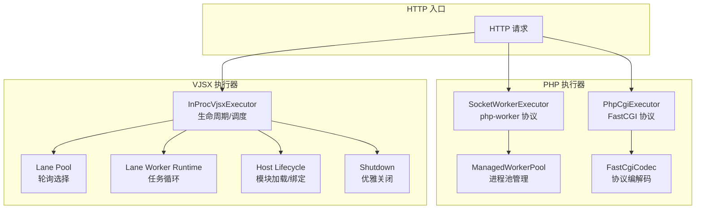
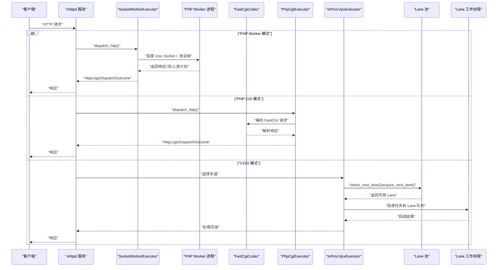
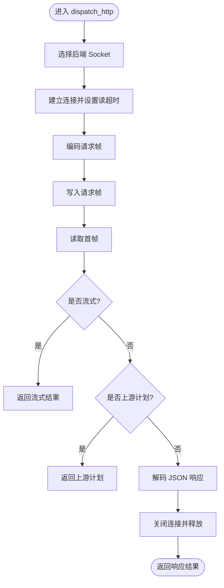
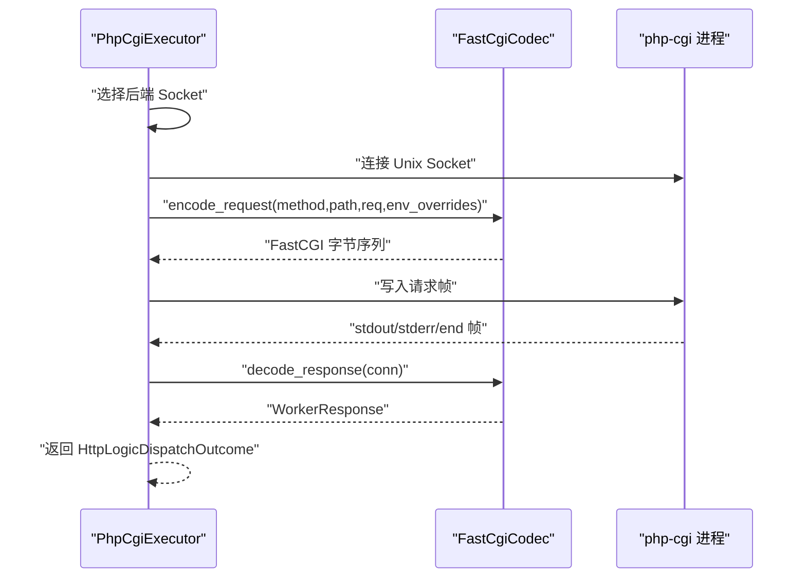
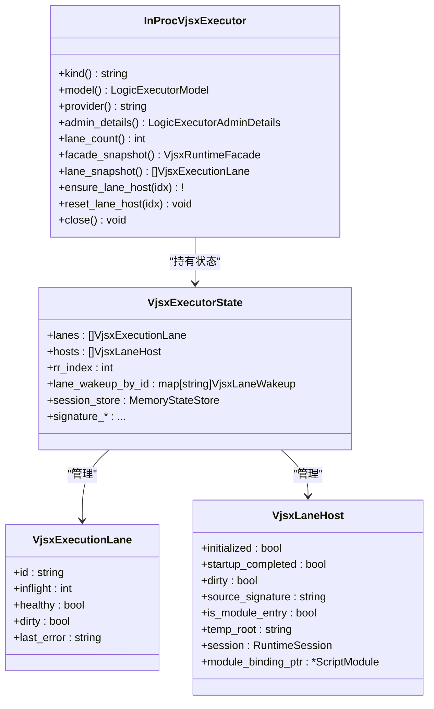
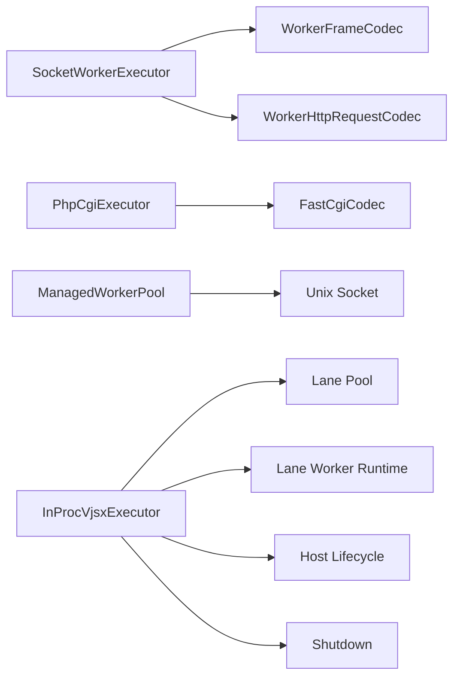

# 执行器性能优化

<cite>
**本文引用的文件**   
- [src/executor/php_cgi_executor.v](file://src/executor/php_cgi_executor.v)
- [src/executor/socket_worker_executor.v](file://src/executor/socket_worker_executor.v)
- [src/upstream/transport/fastcgi.v](file://src/upstream/transport/fastcgi.v)
- [src/upstream/transport/worker_pool.v](file://src/upstream/transport/worker_pool.v)
- [src/executor/inproc_vjsx_lifecycle.v](file://src/executor/inproc_vjsx_lifecycle.v)
- [src/executor/inproc_vjsx_lane_pool.v](file://src/executor/inproc_vjsx_lane_pool.v)
- [src/executor/inproc_vjsx_host_lifecycle.v](file://src/executor/inproc_vjsx_host_lifecycle.v)
- [src/executor/inproc_vjsx_lane_worker_runtime.v](file://src/executor/inproc_vjsx_lane_worker_runtime.v)
- [src/executor/inproc_vjsx_lane_wakeup_runtime.v](file://src/executor/inproc_vjsx_lane_wakeup_runtime.v)
- [src/executor/inproc_vjsx_host_shutdown.v](file://src/executor/inproc_vjsx_host_shutdown.v)
- [docs/EXECUTOR_MODES.md](file://docs/EXECUTOR_MODES.md)
- [config/vhttpd.example.toml](file://config/vhttpd.example.toml)
- [config/vhttpd.vjsx.example.toml](file://config/vhttpd.vjsx.example.toml)
- [articles/11-observability.md](file://articles/11-observability.md)
</cite>

## 目录
1. [引言](#引言)
2. [项目结构](#项目结构)
3. [核心组件](#核心组件)
4. [架构总览](#架构总览)
5. [详细组件分析](#详细组件分析)
6. [依赖关系分析](#依赖关系分析)
7. [性能考量与调优](#性能考量与调优)
8. [故障排查指南](#故障排查指南)
9. [结论](#结论)
10. [附录](#附录)

## 引言
本指南聚焦 vhttpd 的执行器性能优化，覆盖 PHP Worker 与 VJSX 两种执行模式。内容涵盖：
- Worker 池大小、进程间通信、内存管理与超时配置
- CGI 模式与 Worker 模式的差异及适用场景
- 生命周期管理（启动预热、优雅关闭、故障恢复）
- 资源隔离、负载均衡与弹性扩缩容方案与最佳实践

## 项目结构
vhttpd 提供两类内置执行器：
- PHP 模式：通过 Unix Socket 与外部 PHP Worker 通信（支持 FastCGI 与自定义 Worker 协议）
- VJSX 模式：进程内嵌入执行，基于“车道”并发模型

图示来源
- [src/executor/socket_worker_executor.v:1-157](file://src/executor/socket_worker_executor.v#L1-L157)
- [src/executor/php_cgi_executor.v:1-118](file://src/executor/php_cgi_executor.v#L1-L118)
- [src/upstream/transport/worker_pool.v:1-219](file://src/upstream/transport/worker_pool.v#L1-L219)
- [src/upstream/transport/fastcgi.v:1-386](file://src/upstream/transport/fastcgi.v#L1-L386)
- [src/executor/inproc_vjsx_lifecycle.v:1-155](file://src/executor/inproc_vjsx_lifecycle.v#L1-L155)
- [src/executor/inproc_vjsx_lane_pool.v:1-144](file://src/executor/inproc_vjsx_lane_pool.v#L1-L144)
- [src/executor/inproc_vjsx_lane_worker_runtime.v:1-87](file://src/executor/inproc_vjsx_lane_worker_runtime.v#L1-L87)
- [src/executor/inproc_vjsx_host_lifecycle.v:1-193](file://src/executor/inproc_vjsx_host_lifecycle.v#L1-L193)
- [src/executor/inproc_vjsx_host_shutdown.v:1-73](file://src/executor/inproc_vjsx_host_shutdown.v#L1-L73)

章节来源
- [docs/EXECUTOR_MODES.md:1-136](file://docs/EXECUTOR_MODES.md#L1-L136)

## 核心组件
- PHP Worker 执行器（SocketWorkerExecutor）
  - 负责通过 Unix Socket 与 PHP Worker 进程通信，支持 HTTP、流式、WebSocket 等分发
  - 使用 WorkerFrameCodec/WorkerHttpRequestCodec 进行帧编解码
- PHP CGI 执行器（PhpCgiExecutor）
  - 通过 FastCGI 协议与 php-cgi 交互，仅支持 HTTP 响应
- VJSX 执行器（InProcVjsxExecutor）
  - 进程内执行，按线程数创建“车道”，采用轮询+健康检查的调度策略
  - 包含 Host 生命周期管理、任务派发、唤醒机制与优雅关闭

章节来源
- [src/executor/socket_worker_executor.v:1-157](file://src/executor/socket_worker_executor.v#L1-L157)
- [src/executor/php_cgi_executor.v:1-118](file://src/executor/php_cgi_executor.v#L1-L118)
- [src/executor/inproc_vjsx_lifecycle.v:1-155](file://src/executor/inproc_vjsx_lifecycle.v#L1-L155)

## 架构总览
下图展示 PHP 与 VJSX 两条路径的关键交互与数据流。

图示来源
- [src/executor/socket_worker_executor.v:43-95](file://src/executor/socket_worker_executor.v#L43-L95)
- [src/executor/php_cgi_executor.v:42-82](file://src/executor/php_cgi_executor.v#L42-L82)
- [src/upstream/transport/fastcgi.v:79-249](file://src/upstream/transport/fastcgi.v#L79-L249)
- [src/executor/inproc_vjsx_lane_pool.v:5-30](file://src/executor/inproc_vjsx_lane_pool.v#L5-L30)
- [src/executor/inproc_vjsx_lane_worker_runtime.v:7-86](file://src/executor/inproc_vjsx_lane_worker_runtime.v#L7-L86)

## 详细组件分析

### PHP Worker 执行器（SocketWorkerExecutor）
- 职责
  - 选择目标 Unix Socket，设置读超时，编码请求帧并写入
  - 读取首帧判断为普通响应、流或上游计划，分别返回不同结果类型
  - 支持 WebSocket 会话打开与事件分发
- 关键流程
  - 选择 socket -> 连接 -> 写帧 -> 读首帧 -> 分支处理 -> 释放连接

图示来源
- [src/executor/socket_worker_executor.v:43-95](file://src/executor/socket_worker_executor.v#L43-L95)

章节来源
- [src/executor/socket_worker_executor.v:1-157](file://src/executor/socket_worker_executor.v#L1-L157)

### PHP CGI 执行器（PhpCgiExecutor）
- 职责
  - 将 HTTP 请求转换为 FastCGI 请求帧，发送至 php-cgi 进程
  - 解析 stdout/stderr 并构造 WorkerResponse
- 关键流程
  - 选择 socket -> 连接 -> 编码 FastCGI 请求 -> 写入 -> 读取记录 -> 解析响应

图示来源
- [src/executor/php_cgi_executor.v:42-82](file://src/executor/php_cgi_executor.v#L42-L82)
- [src/upstream/transport/fastcgi.v:79-249](file://src/upstream/transport/fastcgi.v#L79-L249)
- [src/upstream/transport/fastcgi.v:266-317](file://src/upstream/transport/fastcgi.v#L266-L317)

章节来源
- [src/executor/php_cgi_executor.v:1-118](file://src/executor/php_cgi_executor.v#L1-L118)
- [src/upstream/transport/fastcgi.v:1-386](file://src/upstream/transport/fastcgi.v#L1-L386)

### VJSX 执行器（InProcVjsxExecutor）
- 职责
  - 维护多个“车道”（线程级执行上下文），提供轮询选择、等待获取、释放能力
  - 管理 Host 生命周期（模块加载、全局函数发现、事件绑定）
  - 驱动 Lane 工作协程循环，处理 WebSocket 回调、快照、预热、亲和性任务
  - 提供唤醒调度与优雅关闭
- 关键流程
  - 选择车道 -> 获取可用车道 -> 投递任务 -> 等待结果 -> 释放车道

图示来源
- [src/executor/inproc_vjsx_lifecycle.v:16-87](file://src/executor/inproc_vjsx_lifecycle.v#L16-L87)
- [src/executor/inproc_vjsx_lifecycle.v:102-118](file://src/executor/inproc_vjsx_lifecycle.v#L102-L118)
- [src/executor/inproc_vjsx_lifecycle.v:120-155](file://src/executor/inproc_vjsx_lifecycle.v#L120-L155)
- [src/executor/inproc_vjsx_lane_pool.v:5-30](file://src/executor/inproc_vjsx_lane_pool.v#L5-L30)
- [src/executor/inproc_vjsx_lane_pool.v:83-101](file://src/executor/inproc_vjsx_lane_pool.v#L83-L101)
- [src/executor/inproc_vjsx_lane_pool.v:126-144](file://src/executor/inproc_vjsx_lane_pool.v#L126-L144)
- [src/executor/inproc_vjsx_host_lifecycle.v:8-34](file://src/executor/inproc_vjsx_host_lifecycle.v#L8-L34)
- [src/executor/inproc_vjsx_host_lifecycle.v:175-192](file://src/executor/inproc_vjsx_host_lifecycle.v#L175-L192)
- [src/executor/inproc_vjsx_host_shutdown.v:23-72](file://src/executor/inproc_vjsx_host_shutdown.v#L23-L72)

章节来源
- [src/executor/inproc_vjsx_lifecycle.v:1-155](file://src/executor/inproc_vjsx_lifecycle.v#L1-L155)
- [src/executor/inproc_vjsx_lane_pool.v:1-144](file://src/executor/inproc_vjsx_lane_pool.v#L1-L144)
- [src/executor/inproc_vjsx_host_lifecycle.v:1-193](file://src/executor/inproc_vjsx_host_lifecycle.v#L1-L193)
- [src/executor/inproc_vjsx_lane_worker_runtime.v:1-87](file://src/executor/inproc_vjsx_lane_worker_runtime.v#L1-L87)
- [src/executor/inproc_vjsx_lane_wakeup_runtime.v:1-58](file://src/executor/inproc_vjsx_lane_wakeup_runtime.v#L1-L58)
- [src/executor/inproc_vjsx_host_shutdown.v:1-73](file://src/executor/inproc_vjsx_host_shutdown.v#L1-L73)

## 依赖关系分析
- PHP 执行器依赖
  - SocketWorkerExecutor 依赖 transport.WorkerFrameCodec/WorkerHttpRequestCodec 与 Unix Socket
  - PhpCgiExecutor 依赖 transport.FastCgiCodec 进行协议编解码
  - ManagedWorkerPool 负责子进程生命周期、优雅停止与重启退避
- VJSX 执行器依赖
  - 内部状态机与多通道任务队列（WebSocket、快照、预热、泵、亲和性）
  - 运行时会话与模块加载、全局函数发现、事件绑定
  - 唤醒调度与优雅关闭

图示来源
- [src/executor/socket_worker_executor.v:1-157](file://src/executor/socket_worker_executor.v#L1-L157)
- [src/executor/php_cgi_executor.v:1-118](file://src/executor/php_cgi_executor.v#L1-L118)
- [src/upstream/transport/worker_pool.v:1-219](file://src/upstream/transport/worker_pool.v#L1-L219)
- [src/executor/inproc_vjsx_lifecycle.v:1-155](file://src/executor/inproc_vjsx_lifecycle.v#L1-L155)
- [src/executor/inproc_vjsx_lane_pool.v:1-144](file://src/executor/inproc_vjsx_lane_pool.v#L1-L144)
- [src/executor/inproc_vjsx_lane_worker_runtime.v:1-87](file://src/executor/inproc_vjsx_lane_worker_runtime.v#L1-L87)
- [src/executor/inproc_vjsx_host_lifecycle.v:1-193](file://src/executor/inproc_vjsx_host_lifecycle.v#L1-L193)
- [src/executor/inproc_vjsx_host_shutdown.v:1-73](file://src/executor/inproc_vjsx_host_shutdown.v#L1-L73)

章节来源
- [src/upstream/transport/worker_pool.v:1-219](file://src/upstream/transport/worker_pool.v#L1-L219)
- [src/upstream/transport/fastcgi.v:1-386](file://src/upstream/transport/fastcgi.v#L1-L386)

## 性能考量与调优

### 执行模式对比与适用场景
- PHP Worker 模式
  - 优点：与现有 PHP 生态兼容良好；支持流式与 WebSocket；可独立扩展 Worker 数量
  - 缺点：跨进程通信开销；需关注进程池与超时配置
  - 适用：复杂 PHP 应用、需要长连接/流式输出、已有 PHP 基础设施
- PHP CGI 模式
  - 优点：实现简单，适合传统 CGI 部署
  - 缺点：不支持 WebSocket/流式；每次请求可能涉及环境构建成本
  - 适用：轻量静态/动态混合站点、快速迁移
- VJSX 模式
  - 优点：进程内执行，低延迟；线程级并发；无需外部进程管理
  - 缺点：受限于单进程资源；需关注内存与 CPU 占用
  - 适用：高吞吐短请求、Node/TS 生态应用、对延迟敏感的场景

章节来源
- [docs/EXECUTOR_MODES.md:25-136](file://docs/EXECUTOR_MODES.md#L25-L136)

### Worker 池大小与负载均衡
- PHP Worker 池
  - 建议初始值：CPU 核心数 × 2；根据 QPS 与平均时延调整
  - 监控指标：活跃连接、队列长度、错误率、内存使用
  - 负载均衡：默认轮询选择可用 Socket；结合 max_requests 定期重启避免内存泄漏
- VJSX 车道池
  - thread_count 决定并发车道数；建议等于或略小于 CPU 核心数
  - 选择策略：轮询 + 健康检查；不可用或脏态车道会被跳过
  - 等待获取：当无可用车道时，带超时轮询等待，避免忙等

章节来源
- [src/executor/socket_worker_executor.v:43-95](file://src/executor/socket_worker_executor.v#L43-L95)
- [src/executor/inproc_vjsx_lane_pool.v:5-30](file://src/executor/inproc_vjsx_lane_pool.v#L5-L30)
- [src/executor/inproc_vjsx_lane_pool.v:83-101](file://src/executor/inproc_vjsx_lane_pool.v#L83-L101)
- [config/vhttpd.example.toml:19-26](file://config/vhttpd.example.toml#L19-L26)
- [config/vhttpd.vjsx.example.toml:21-25](file://config/vhttpd.vjsx.example.toml#L21-L25)

### 进程间通信优化（PHP）
- 使用 Unix Socket 而非 TCP，减少网络栈开销
- 合理设置 read_timeout_ms，避免阻塞；AI 流式请求可适当提高
- 控制请求体分片大小与参数键值对分帧，避免单次过大帧导致拥塞
- 利用环境变量传递必要信息，减少重复计算

章节来源
- [src/executor/socket_worker_executor.v:43-95](file://src/executor/socket_worker_executor.v#L43-L95)
- [src/upstream/transport/fastcgi.v:79-249](file://src/upstream/transport/fastcgi.v#L79-L249)
- [articles/11-observability.md:624-654](file://articles/11-observability.md#L624-L654)

### 内存管理策略
- PHP
  - 设置 max_requests 定期重启 Worker，缓解内存泄漏
  - 监控 worker 内存使用，必要时增加 pool_size 分担压力
  - 优化 PHP 代码，减少大对象驻留与全局变量累积
- VJSX
  - 控制 thread_count 与模块体积，避免单进程内存峰值过高
  - 合理使用临时目录与模块绑定释放，避免句柄泄漏
  - 观察 lane inflight 与健康状态，及时清理异常车道

章节来源
- [config/vhttpd.example.toml:24](file://config/vhttpd.example.toml#L24)
- [articles/11-observability.md:615-618](file://articles/11-observability.md#L615-L618)
- [src/executor/inproc_vjsx_lane_pool.v:126-144](file://src/executor/inproc_vjsx_lane_pool.v#L126-L144)

### 超时与队列配置
- 普通请求：read_timeout_ms 建议 2~5s
- AI 流式请求：read_timeout_ms 建议 30~120s
- 队列容量与等待超时：根据峰值 QPS 与尾延迟要求设定

章节来源
- [config/vhttpd.example.toml:19-26](file://config/vhttpd.example.toml#L19-L26)
- [articles/11-observability.md:634-654](file://articles/11-observability.md#L634-L654)

### 生命周期管理优化
- 启动预热
  - VJSX：在 ensure_lane_host 中预加载模块与绑定处理器，减少首次请求冷启动
  - PHP：autostart=true 配合 pool_size 预热，缩短冷启动时间
- 优雅关闭
  - PHP：向子进程组发送 SIGTERM，随后 SIGKILL 确保清理
  - VJSX：停止 lane worker 协程，重置主机状态，释放会话与模块绑定
- 故障恢复
  - PHP：重启退避算法（指数退避，上限限制），避免雪崩
  - VJSX：标记脏态车道，按需 reset_lane_host 重建宿主

章节来源
- [src/upstream/transport/worker_pool.v:155-176](file://src/upstream/transport/worker_pool.v#L155-L176)
- [src/upstream/transport/worker_pool.v:204-218](file://src/upstream/transport/worker_pool.v#L204-L218)
- [src/executor/inproc_vjsx_host_lifecycle.v:8-34](file://src/executor/inproc_vjsx_host_lifecycle.v#L8-L34)
- [src/executor/inproc_vjsx_host_shutdown.v:23-72](file://src/executor/inproc_vjsx_host_shutdown.v#L23-L72)

### 资源隔离与弹性扩缩容
- 资源隔离
  - PHP：每个 Worker 独立进程，天然隔离；可通过 cgroup/systemd 进一步限制 CPU/内存
  - VJSX：单进程多线程，注意共享内存与锁竞争；可按业务拆分实例
- 弹性扩缩容
  - PHP：水平扩展（多实例）+ 垂直扩展（增大 pool_size）；结合自动伸缩策略
  - VJSX：垂直扩展（增大 thread_count）；高负载下考虑多实例横向扩展

章节来源
- [docs/EXECUTOR_MODES.md:25-136](file://docs/EXECUTOR_MODES.md#L25-L136)
- [config/vhttpd.example.toml:19-26](file://config/vhttpd.example.toml#L19-L26)
- [config/vhttpd.vjsx.example.toml:21-25](file://config/vhttpd.vjsx.example.toml#L21-L25)

## 故障排查指南
- 常见问题定位
  - 监控内存使用与 Worker 内存分布
  - 检查 Worker 最大请求数与重启间隔
  - 确认超时与队列容量是否匹配业务特征
- 常用命令
  - 监控内存：curl admin 接口查看 memory_mb
  - 检查 Worker 列表与内存：curl /admin/workers
  - 限制 Worker 最大请求数：在配置中设置 max_requests

章节来源
- [articles/11-observability.md:602-618](file://articles/11-observability.md#L602-L618)
- [articles/11-observability.md:624-666](file://articles/11-observability.md#L624-L666)

## 结论
- 选择合适的执行器模式是性能优化的第一步：PHP Worker 适合复杂生态与长连接，VJSX 适合低延迟与高吞吐
- 合理配置池大小、超时与队列容量，结合监控持续调优
- 重视生命周期管理：预热、优雅关闭与故障恢复能显著提升稳定性
- 通过资源隔离与弹性扩缩容，保障系统在高峰期的稳定与高效

## 附录
- 示例配置
  - PHP 模式示例：[config/vhttpd.example.toml](file://config/vhttpd.example.toml)
  - VJSX 模式示例：[config/vhttpd.vjsx.example.toml](file://config/vhttpd.vjsx.example.toml)
- 文档参考
  - 执行器模式说明：[docs/EXECUTOR_MODES.md](file://docs/EXECUTOR_MODES.md)