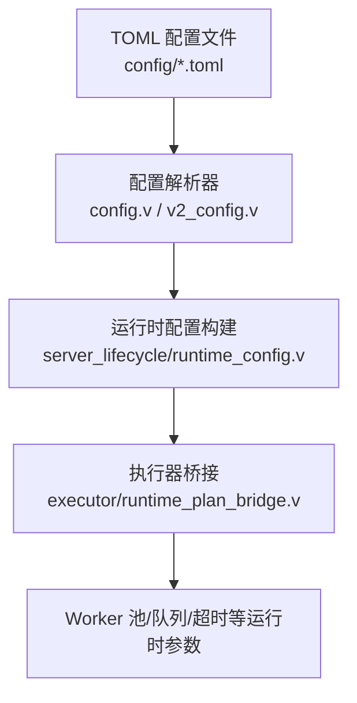
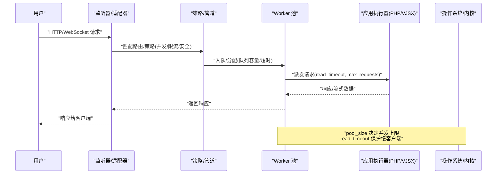
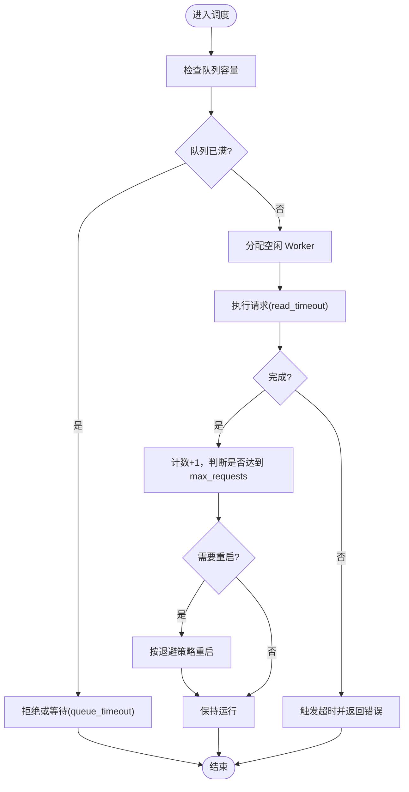
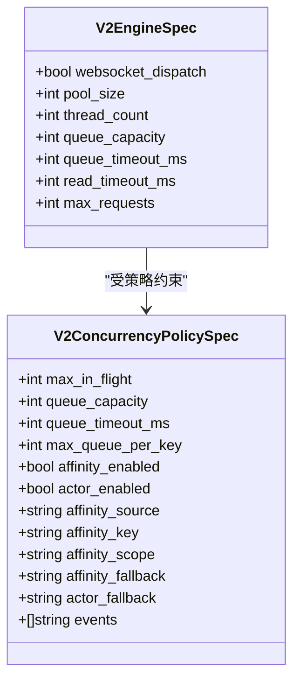

# 服务器配置调优

<cite>
**本文引用的文件**   
- [config/vhttpd.example.toml](file://config/vhttpd.example.toml)
- [config/vhttpd.multi.example.toml](file://config/vhttpd.multi.example.toml)
- [config/vhttpd.vjsx.example.toml](file://config/vhttpd.vjsx.example.toml)
- [src/config/config.v](file://src/config/config.v)
- [src/config/v2_config.v](file://src/config/v2_config.v)
- [src/server_lifecycle/runtime_config.v](file://src/server_lifecycle/runtime_config.v)
- [src/executor/runtime_plan_bridge.v](file://src/executor/runtime_plan_bridge.v)
- [README.md](file://README.md)
- [articles/11-observability.md](file://articles/11-observability.md)
- [examples/config/stream-bench.toml](file://examples/config/stream-bench.toml)
- [examples/config/stream-dispatch.toml](file://examples/config/stream-dispatch.toml)
- [examples/config/ollama-proxy.toml](file://examples/config/ollama-proxy.toml)
- [examples/public/websocket_echo_app.js](file://examples/public/websocket_echo_app.js)
</cite>

## 目录
1. [简介](#简介)
2. [项目结构](#项目结构)
3. [核心组件](#核心组件)
4. [架构总览](#架构总览)
5. [详细组件分析](#详细组件分析)
6. [依赖关系分析](#依赖关系分析)
7. [性能考量](#性能考量)
8. [故障排查指南](#故障排查指南)
9. [结论](#结论)
10. [附录](#附录)

## 简介
本指南聚焦 VHTTPD 服务器的生产级配置调优，围绕工作进程池、连接超时、队列与内存限制、静态资源缓存、WebSocket 长连接等关键维度，给出不同负载场景下的最佳实践与权衡建议。文档同时覆盖安全加固与可观测性指标的配置方法，帮助读者在 CPU、内存、网络 I/O 之间取得稳定高效的平衡。

## 项目结构
VHTTPD 的运行时配置由两套模型共同驱动：
- 传统 TOML 配置（v1）：通过 config.v 解析并映射到内部结构体，如 WorkerConfig、AssetsConfig、McpConfig 等。
- 新版 v2 计划配置：通过 v2_config.v 定义 EngineSpec、AdapterSpec、PolicySpecs 等，用于更细粒度的并发、限流与安全策略编排。

图示来源
- [src/config/config.v:33-50](file://src/config/config.v#L33-L50)
- [src/config/v2_config.v:120-155](file://src/config/v2_config.v#L120-L155)
- [src/server_lifecycle/runtime_config.v:89-112](file://src/server_lifecycle/runtime_config.v#L89-L112)
- [src/executor/runtime_plan_bridge.v:56-81](file://src/executor/runtime_plan_bridge.v#L56-L81)

章节来源
- [config/vhttpd.example.toml:19-27](file://config/vhttpd.example.toml#L19-L27)
- [config/vhttpd.multi.example.toml:44-55](file://config/vhttpd.multi.example.toml#L44-L55)
- [config/vhttpd.vjsx.example.toml:21-26](file://config/vhttpd.vjsx.example.toml#L21-L26)
- [src/config/config.v:33-50](file://src/config/config.v#L33-L50)
- [src/config/v2_config.v:120-155](file://src/config/v2_config.v#L120-L155)
- [src/server_lifecycle/runtime_config.v:89-112](file://src/server_lifecycle/runtime_config.v#L89-L112)
- [src/executor/runtime_plan_bridge.v:56-81](file://src/executor/runtime_plan_bridge.v#L56-L81)

## 核心组件
本节梳理影响性能的关键配置项及其作用域。

- 工作进程池与生命周期
  - pool_size：控制 worker 数量，直接影响并发吞吐与 CPU 利用率。
  - max_requests：单 worker 最大请求数，用于周期性重启以释放内存泄漏风险。
  - restart_backoff_ms / restart_backoff_max_ms：重启退避时间范围，避免雪崩。
  - autostart：是否自动拉起 worker。
  - socket/socket_prefix/sockets：worker 通信套接字命名策略。
  - read_timeout_ms：读取超时，保护慢客户端与后端处理。
  - queue_capacity / queue_timeout_ms：入队容量与等待超时，削峰填谷。

- 静态资源与缓存
  - assets.enabled/prefix/root/cache_control：静态资源开关、路径前缀、根目录与缓存头。

- 管理面与可观测性
  - admin.host/port/token：管理面监听与鉴权。
  - observability.event_log/log_level/tracing：事件日志、日志级别与追踪导出。

- MCP 与会话
  - mcp.max_sessions/max_pending_messages/session_ttl_seconds：会话上限、消息积压与 TTL。

- WebSocket 并发与亲和性
  - concurrency.*：max_in_flight、queue_*、affinity_*、actor_* 等，控制并发度、排队与粘性路由。

章节来源
- [src/config/config.v:33-50](file://src/config/config.v#L33-L50)
- [src/config/config.v:139-145](file://src/config/config.v#L139-L145)
- [src/config/config.v:172-179](file://src/config/config.v#L172-L179)
- [src/config/v2_config.v:243-259](file://src/config/v2_config.v#L243-L259)
- [config/vhttpd.example.toml:38-47](file://config/vhttpd.example.toml#L38-L47)
- [config/vhttpd.multi.example.toml:18-22](file://config/vhttpd.multi.example.toml#L18-L22)

## 架构总览
下图展示从配置到运行时的关键链路，以及各层对性能参数的影响点。

图示来源
- [src/config/v2_config.v:120-155](file://src/config/v2_config.v#L120-L155)
- [src/config/v2_config.v:243-259](file://src/config/v2_config.v#L243-L259)
- [src/server_lifecycle/runtime_config.v:89-112](file://src/server_lifecycle/runtime_config.v#L89-L112)
- [src/executor/runtime_plan_bridge.v:56-81](file://src/executor/runtime_plan_bridge.v#L56-L81)

## 详细组件分析

### 工作进程池与队列
- 目标
  - 在高并发下最大化吞吐，同时避免 OOM 与抖动。
- 关键参数
  - pool_size：推荐为 CPU 核数的 1~2 倍；I/O 密集可适当放大。
  - max_requests：设置合理阈值定期重启，抑制内存增长。
  - restart_backoff_ms / restart_backoff_max_ms：平滑重启，避免集中重启。
  - queue_capacity / queue_timeout_ms：缓冲突发流量，防止瞬时过载。
  - read_timeout_ms：短请求 2~5s，AI 流式或长任务需放宽至数十秒。
- 典型场景建议
  - 高并发静态文件服务：增大 pool_size，启用静态缓存，缩短 read_timeout。
  - 动态应用处理：结合 max_requests 与队列容量，避免长时间阻塞。
  - AI 流式/长连接：提高 read_timeout，适度扩大队列容量与 in-flight 上限。

图示来源
- [src/config/config.v:33-50](file://src/config/config.v#L33-L50)
- [src/executor/runtime_plan_bridge.v:56-81](file://src/executor/runtime_plan_bridge.v#L56-L81)
- [src/server_lifecycle/runtime_config.v:89-112](file://src/server_lifecycle/runtime_config.v#L89-L112)

章节来源
- [src/config/config.v:33-50](file://src/config/config.v#L33-L50)
- [src/executor/runtime_plan_bridge.v:56-81](file://src/executor/runtime_plan_bridge.v#L56-L81)
- [src/server_lifecycle/runtime_config.v:89-112](file://src/server_lifecycle/runtime_config.v#L89-L112)
- [README.md:1065-1089](file://README.md#L1065-L1089)

### 静态资源与缓存
- 目标
  - 降低后端压力，提升首字节时间与缓存命中率。
- 关键参数
  - assets.enabled/prefix/root：开启静态服务与根目录映射。
  - assets.cache_control：设置浏览器/CDN 缓存策略。
- 建议
  - 对图片、脚本、样式等设置较长 max-age，配合版本号或指纹化文件名。
  - 大文件传输时适当提高 read_timeout，避免误判。

章节来源
- [config/vhttpd.example.toml:43-47](file://config/vhttpd.example.toml#L43-L47)
- [config/vhttpd.multi.example.toml:18-22](file://config/vhttpd.multi.example.toml#L18-L22)
- [config/vhttpd.vjsx.example.toml:32-36](file://config/vhttpd.vjsx.example.toml#L32-L36)

### WebSocket 长连接与并发策略
- 目标
  - 保障长连接稳定性与低延迟，支持粘性路由与 Actor 模型。
- 关键参数
  - websocket_dispatch：启用 WebSocket 分发。
  - concurrency.queue_capacity / queue_timeout_ms：控制并发排队。
  - affinity_enabled / actor_enabled：连接粘性与 Actor 绑定。
  - max_in_flight：并发上限，避免后端过载。
- 建议
  - 聊天/协作类应用：开启 affinity/actor，按 session 或 connectionId 做粘性。
  - 高吞吐广播：放宽 max_in_flight，但需监控后端处理能力。

图示来源
- [src/config/v2_config.v:243-259](file://src/config/v2_config.v#L243-L259)
- [src/config/v2_config.v:120-155](file://src/config/v2_config.v#L120-L155)

章节来源
- [src/config/v2_config.v:120-155](file://src/config/v2_config.v#L120-L155)
- [src/config/v2_config.v:243-259](file://src/config/v2_config.v#L243-L259)
- [examples/config/stream-dispatch.toml:10-11](file://examples/config/stream-dispatch.toml#L10-L11)
- [examples/config/stream-bench.toml:10](file://examples/config/stream-bench.toml#L10)
- [examples/public/websocket_echo_app.js:1-45](file://examples/public/websocket_echo_app.js#L1-L45)

### 管理面与可观测性
- 目标
  - 提供运行时诊断能力，便于定位瓶颈与异常。
- 关键参数
  - admin.host/port/token：管理面端口与鉴权。
  - observability.event_log/log_level/tracing：事件日志、日志级别与追踪导出。
- 建议
  - 生产环境仅绑定本地回环地址，使用强口令 token。
  - 将 event_log 输出到独立磁盘分区，避免与业务日志争用 IO。

章节来源
- [config/vhttpd.example.toml:38-41](file://config/vhttpd.example.toml#L38-L41)
- [config/vhttpd.vjsx.example.toml:27-30](file://config/vhttpd.vjsx.example.toml#L27-L30)
- [articles/11-observability.md:602-666](file://articles/11-observability.md#L602-L666)

## 依赖关系分析
- 配置来源优先级
  - CLI 参数 > v2 计划配置 > TOML 配置 > 默认值。
- 关键映射链
  - TOML/CLI → config.v/v2_config.v → runtime_config.v → executor/runtime_plan_bridge.v → 运行时参数。

图示来源
- [src/config/config.v:33-50](file://src/config/config.v#L33-L50)
- [src/config/v2_config.v:120-155](file://src/config/v2_config.v#L120-L155)
- [src/server_lifecycle/runtime_config.v:89-112](file://src/server_lifecycle/runtime_config.v#L89-L112)
- [src/executor/runtime_plan_bridge.v:56-81](file://src/executor/runtime_plan_bridge.v#L56-L81)

章节来源
- [src/config/config.v:33-50](file://src/config/config.v#L33-L50)
- [src/config/v2_config.v:120-155](file://src/config/v2_config.v#L120-L155)
- [src/server_lifecycle/runtime_config.v:89-112](file://src/server_lifecycle/runtime_config.v#L89-L112)
- [src/executor/runtime_plan_bridge.v:56-81](file://src/executor/runtime_plan_bridge.v#L56-L81)

## 性能考量
- CPU 使用率
  - pool_size 与线程数(thread_count)应与 CPU 核数匹配；CPU 密集型应用不宜过度放大。
- 内存占用
  - max_requests 定期重启可缓解内存泄漏；监控 admin/workers 接口观察每个 worker 的内存曲线。
- 网络 I/O
  - read_timeout 过短会导致正常长任务被中断；过长会占用连接资源。
  - 队列容量与超时用于削峰，过大可能掩盖后端瓶颈。
- 静态资源
  - 合理的 cache_control 能显著降低带宽与后端压力。

章节来源
- [articles/11-observability.md:622-666](file://articles/11-observability.md#L622-L666)
- [config/vhttpd.example.toml:19-27](file://config/vhttpd.example.toml#L19-L27)
- [config/vhttpd.multi.example.toml:44-55](file://config/vhttpd.multi.example.toml#L44-L55)
- [config/vhttpd.vjsx.example.toml:21-26](file://config/vhttpd.vjsx.example.toml#L21-L26)

## 故障排查指南
- 常见症状
  - 内存持续增长：检查 max_requests 是否过小或未设置；观察 admin/workers 中各 worker 内存。
  - 请求频繁超时：调整 read_timeout；确认后端处理耗时与队列堆积情况。
  - 连接抖动：检查重启退避参数与 worker 健康状态。
- 排查步骤
  - 监控内存：通过管理面接口查看整体与单个 worker 的内存占用。
  - 检查队列：观察 queue_capacity 与 queue_timeout 是否导致大量等待。
  - 验证静态缓存：确认 cache_control 命中情况与带宽节省效果。
- 解决方案
  - 设置合适的 max_requests 周期重启 worker。
  - 优化应用代码减少内存占用。
  - 根据负载增加 pool_size 分担压力。

章节来源
- [articles/11-observability.md:602-666](file://articles/11-observability.md#L602-L666)

## 结论
通过对工作进程池、超时、队列、静态缓存、WebSocket 并发策略与管理面的系统调优，可在不同负载场景下实现稳定的吞吐与低延迟。建议在生产环境中结合可观测性指标持续迭代参数，确保 CPU、内存与网络 I/O 三者之间的均衡。

## 附录

### 不同负载场景的最佳配置要点
- 高并发静态文件服务
  - 增大 pool_size，启用静态资源与缓存，缩短 read_timeout。
  - 参考示例：assets 段与 cache_control 的设置。
- 动态应用处理
  - 合理设置 max_requests 与队列容量，避免长时间阻塞。
  - 参考示例：PHP/VJSX 引擎的 pool_size 与 thread_count。
- WebSocket 长连接
  - 启用 websocket_dispatch，配置 affinity/actor 粘性路由，放宽 read_timeout。
  - 参考示例：stream-dispatch 与 stream-bench 配置。

章节来源
- [config/vhttpd.example.toml:43-47](file://config/vhttpd.example.toml#L43-L47)
- [config/vhttpd.multi.example.toml:44-55](file://config/vhttpd.multi.example.toml#L44-L55)
- [config/vhttpd.vjsx.example.toml:21-26](file://config/vhttpd.vjsx.example.toml#L21-L26)
- [examples/config/stream-dispatch.toml:10-11](file://examples/config/stream-dispatch.toml#L10-L11)
- [examples/config/stream-bench.toml:10](file://examples/config/stream-bench.toml#L10)
- [examples/config/ollama-proxy.toml:10](file://examples/config/ollama-proxy.toml#L10)

### 生产环境安全配置建议
- 管理面
  - 仅绑定 127.0.0.1，设置强口令 token，关闭不必要的端口。
- 站点安全头
  - 建议在响应策略中添加必要的头部（如 CSP、X-Frame-Options、X-Content-Type-Options、Referrer-Policy、Permissions-Policy）。
- 资源访问
  - 严格限定 assets.root 与 document_root，避免越权访问。

章节来源
- [config/vhttpd.example.toml:38-41](file://config/vhttpd.example.toml#L38-L41)
- [config/vhttpd.vjsx.example.toml:27-30](file://config/vhttpd.vjsx.example.toml#L27-L30)
- [php/package/src/VHttpd/WordPress/Profiler.php:1176-1197](file://php/package/src/VHttpd/WordPress/Profiler.php#L1176-L1197)

### 性能监控指标配置方法
- 管理面指标
  - 使用 admin/runtime 与 admin/workers 接口获取整体与 worker 级别的内存、请求统计。
- 事件日志
  - 配置 observability.event_log 与 log_level，必要时启用 tracing 导出。
- 基准与压测
  - 结合 stream-bench 与 k6 脚本进行回归测试，评估参数变更的影响。

章节来源
- [articles/11-observability.md:602-666](file://articles/11-observability.md#L602-L666)
- [README.md:1065-1089](file://README.md#L1065-L1089)