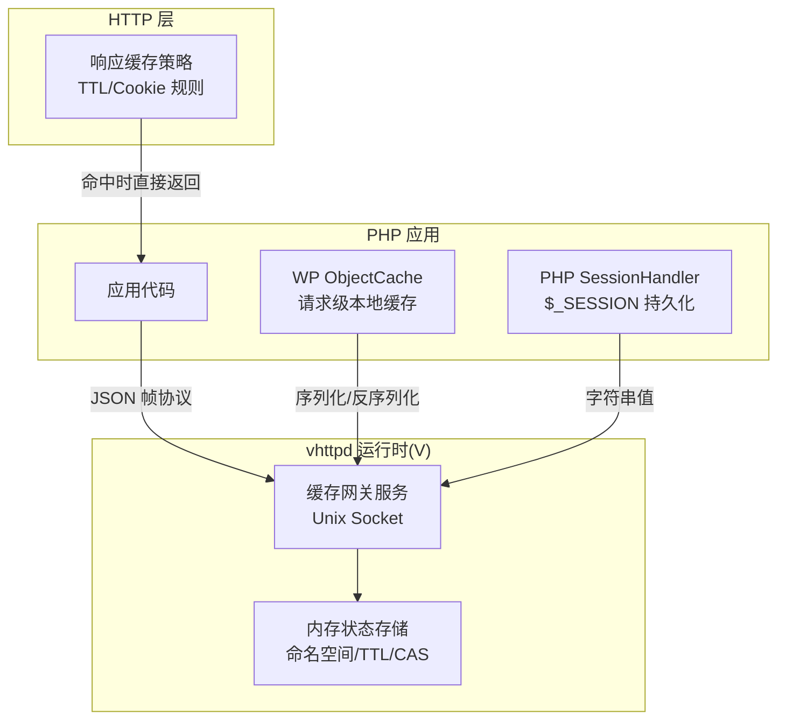
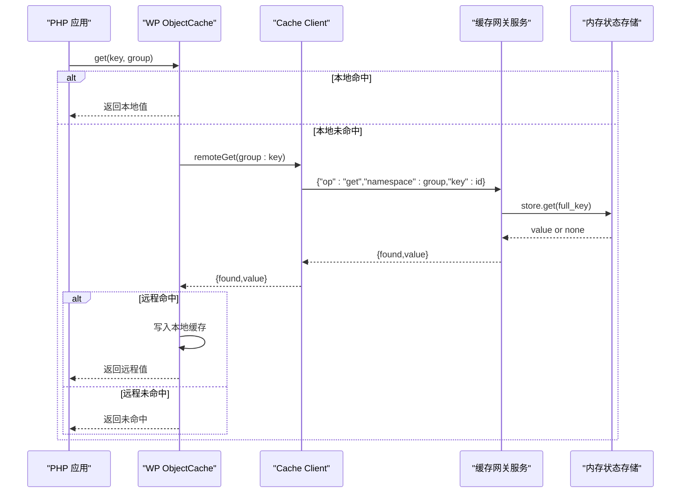
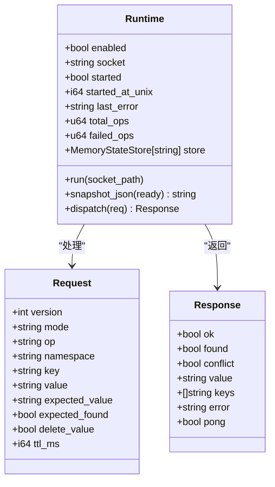
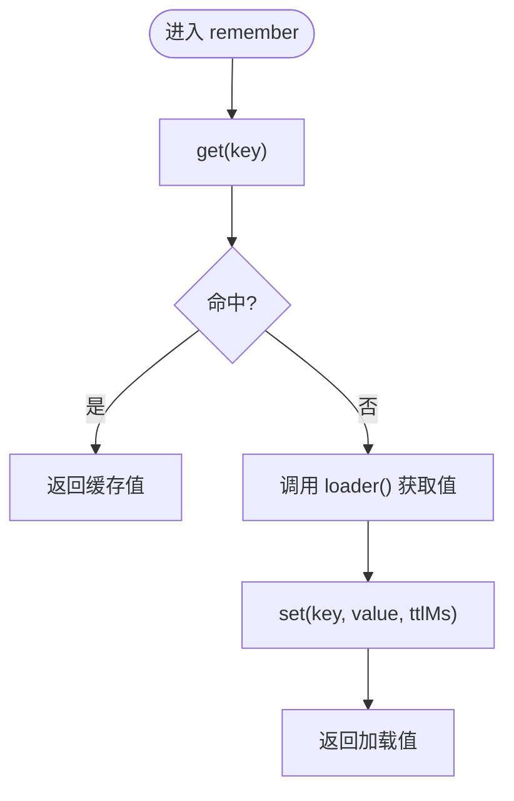
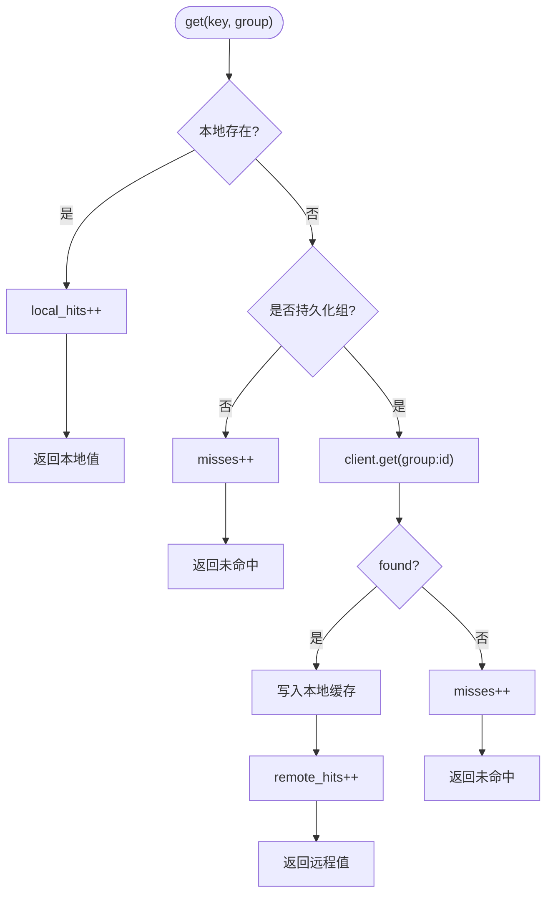
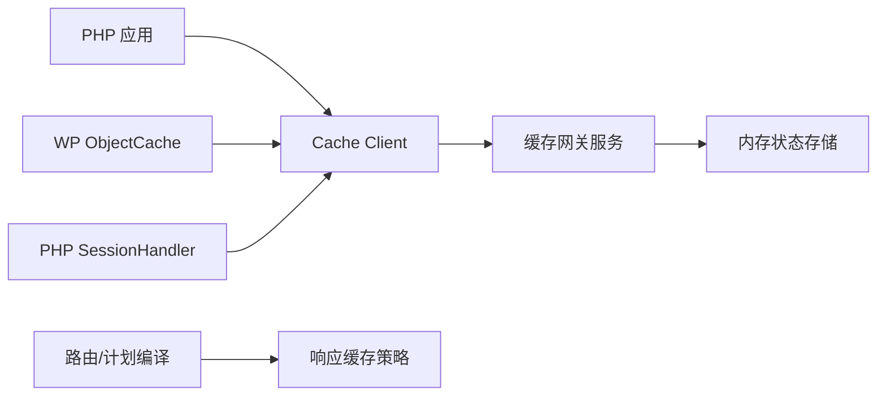

# 缓存策略优化

<cite>
**本文引用的文件**   
- [src/cache_runtime.v](file://src/cache_runtime.v)
- [src/cachex/runtime.v](file://src/cachex/runtime.v)
- [php/package/src/VHttpd/Cache/Client.php](file://php/package/src/VHttpd/Cache/Client.php)
- [php/package/src/VHttpd/PhpWorker/SessionHandler.php](file://php/package/src/VHttpd/PhpWorker/SessionHandler.php)
- [php/package/src/VHttpd/WordPress/ObjectCache.php](file://php/package/src/VHttpd/WordPress/ObjectCache.php)
- [php/package/wordpress/v-profiler/object-cache.php](file://php/package/wordpress/v-profiler/object-cache.php)
- [src/config/config.v](file://src/config/config.v)
- [src/runtime_plan_route_builder.v](file://src/runtime_plan_route_builder.v)
- [php/package/README.md](file://php/package/README.md)
</cite>

## 目录
1. [引言](#引言)
2. [项目结构](#项目结构)
3. [核心组件](#核心组件)
4. [架构总览](#架构总览)
5. [详细组件分析](#详细组件分析)
6. [依赖关系分析](#依赖关系分析)
7. [性能考量](#性能考量)
8. [故障排查指南](#故障排查指南)
9. [结论](#结论)
10. [附录](#附录)

## 引言
本指南围绕 vhttpd 的缓存能力，系统梳理其多级缓存架构与策略设计：进程内内存缓存、PHP 侧请求级本地缓存、分布式/持久化扩展点（通过统一客户端协议），以及与 HTTP 响应缓存、会话状态存储的组合使用。文档同时给出一致性保证、失效与降级策略、监控指标与优化技巧，帮助在热点数据、查询结果、会话状态等典型场景下构建高命中、低延迟、可观测的缓存体系。

## 项目结构
vhttpd 的缓存相关实现分布在以下层次：
- 运行时层（V）：提供基于 Unix Socket 的缓存网关服务，内部使用内存状态存储，支持命名空间、TTL、CAS 操作与键枚举。
- PHP 客户端层：提供统一的 Cache Client，封装 JSON 帧协议，供 PHP Worker 或应用调用。
- WordPress 集成层：提供 Object Cache 适配器，具备“请求级本地缓存 + 远程持久化”两级结构，并暴露命中率统计。
- 配置与路由层：提供缓存开关、Socket 路径配置，以及 HTTP 响应缓存策略（如 TTL、Cookie 忽略/绕过模式）。

图表来源
- [src/cachex/runtime.v:1-341](file://src/cachex/runtime.v#L1-L341)
- [php/package/src/VHttpd/Cache/Client.php:1-171](file://php/package/src/VHttpd/Cache/Client.php#L1-L171)
- [php/package/src/VHttpd/WordPress/ObjectCache.php:1-389](file://php/package/src/VHttpd/WordPress/ObjectCache.php#L1-L389)
- [php/package/src/VHttpd/PhpWorker/SessionHandler.php:1-62](file://php/package/src/VHttpd/PhpWorker/SessionHandler.php#L1-L62)
- [src/config/config.v:307-341](file://src/config/config.v#L307-L341)
- [src/runtime_plan_route_builder.v:174-217](file://src/runtime_plan_route_builder.v#L174-L217)

章节来源
- [src/cachex/runtime.v:1-341](file://src/cachex/runtime.v#L1-L341)
- [php/package/src/VHttpd/Cache/Client.php:1-171](file://php/package/src/VHttpd/Cache/Client.php#L1-L171)
- [php/package/src/VHttpd/WordPress/ObjectCache.php:1-389](file://php/package/src/VHttpd/WordPress/ObjectCache.php#L1-L389)
- [php/package/src/VHttpd/PhpWorker/SessionHandler.php:1-62](file://php/package/src/VHttpd/PhpWorker/SessionHandler.php#L1-L62)
- [src/config/config.v:307-341](file://src/config/config.v#L307-L341)
- [src/runtime_plan_route_builder.v:174-217](file://src/runtime_plan_route_builder.v#L174-L217)

## 核心组件
- 缓存网关服务（V）
  - 监听 Unix Socket，接收长度前缀的 JSON 帧请求，按 op 分发到 get/set/patch/delete/exists/keys/ping。
  - 内部使用内存状态存储，支持命名空间隔离、TTL 过期、compare-and-swap 原子更新。
  - 提供运行快照（enabled、socket、started、total_ops、failed_ops、keys 数量等）。
- PHP 缓存客户端
  - 通过环境变量注入 socket 与 namespace，封装 ping/get/set/delete/exists/keys/remember 等方法。
  - 对 patch 操作区分冲突返回，便于上层做重试或降级。
- WordPress Object Cache
  - 请求级本地缓存优先，命中则直接返回；未命中且组为持久化时访问远程缓存。
  - 提供 add/replace/set/get/delete/incr/decr/flush_group 等接口，并维护 cache_hits/local_hits/remote_hits/cache_misses 统计。
- PHP Session Handler
  - 将 $_SESSION 读写映射到缓存网关，默认 TTL 与 PHP session gc 生命周期对齐。
- 配置与路由
  - 提供缓存开关与 socket 路径配置项。
  - 提供 HTTP 响应缓存策略字段（TTL、Cookie 忽略/绕过模式），用于静态或固定响应快速命中。

章节来源
- [src/cachex/runtime.v:1-341](file://src/cachex/runtime.v#L1-L341)
- [php/package/src/VHttpd/Cache/Client.php:1-171](file://php/package/src/VHttpd/Cache/Client.php#L1-L171)
- [php/package/src/VHttpd/WordPress/ObjectCache.php:1-389](file://php/package/src/VHttpd/WordPress/ObjectCache.php#L1-L389)
- [php/package/src/VHttpd/PhpWorker/SessionHandler.php:1-62](file://php/package/src/VHttpd/PhpWorker/SessionHandler.php#L1-L62)
- [src/config/config.v:307-341](file://src/config/config.v#L307-L341)
- [src/runtime_plan_route_builder.v:174-217](file://src/runtime_plan_route_builder.v#L174-L217)

## 架构总览
下图展示了从 PHP 应用到 vhttpd 缓存网关的数据流，以及 WP Object Cache 的两级缓存路径。

图表来源
- [php/package/src/VHttpd/WordPress/ObjectCache.php:111-140](file://php/package/src/VHttpd/WordPress/ObjectCache.php#L111-L140)
- [php/package/src/VHttpd/Cache/Client.php:56-64](file://php/package/src/VHttpd/Cache/Client.php#L56-L64)
- [src/cachex/runtime.v:194-276](file://src/cachex/runtime.v#L194-L276)

## 详细组件分析

### 组件一：缓存网关服务（V）
- 职责
  - 解析 JSON 帧请求，校验 mode/op/namespace/key 等参数。
  - 执行 get/set/patch/delete/exists/keys/ping 等操作。
  - 维护运行态统计（总操作数、失败数、最后错误、键数量等）。
- 关键数据结构
  - Runtime：包含 enabled、socket、store、stats 等。
  - Request/Response：定义协议字段与返回值语义。
- 并发与一致性
  - 使用互斥锁保护 store 访问。
  - patch 支持 compare-and-swap（含 delete_value 分支），返回 conflict 表示 CAS 失败。
- 可扩展性
  - 当前后端为内存状态存储，未来可在同一客户端协议之上替换为 Redis 等外部存储，无需改动 PHP 应用。

图表来源
- [src/cachex/runtime.v:24-62](file://src/cachex/runtime.v#L24-L62)
- [src/cachex/runtime.v:194-276](file://src/cachex/runtime.v#L194-L276)

章节来源
- [src/cachex/runtime.v:1-341](file://src/cachex/runtime.v#L1-L341)

### 组件二：PHP 缓存客户端
- 职责
  - 封装 JSON 帧协议，提供 get/set/delete/exists/keys/remember 等便捷方法。
  - 支持 fromEnv 构造，读取 VHTTPD_CACHE_SOCKET 与 VHTTPD_CACHE_NAMESPACE。
  - 对 patch 冲突进行非抛出式返回，便于上层控制重试或回退。
- 典型用法
  - remember(key, ttlMs, loader)：先读后写，避免穿透。
  - compareAndSwapSet/Delete：配合业务逻辑实现幂等更新。

图表来源
- [php/package/src/VHttpd/Cache/Client.php:133-143](file://php/package/src/VHttpd/Cache/Client.php#L133-L143)

章节来源
- [php/package/src/VHttpd/Cache/Client.php:1-171](file://php/package/src/VHttpd/Cache/Client.php#L1-L171)

### 组件三：WordPress Object Cache（两级缓存）
- 职责
  - 请求级本地缓存优先，减少跨进程通信开销。
  - 持久化组通过 Cache Client 访问远程存储（当前为内存状态存储）。
  - 提供 add/replace/set/get/delete/incr/decr/flush_group 等接口，兼容 WP 对象缓存约定。
- 统计与可观测性
  - 维护 cache_hits、local_hits、remote_hits、cache_misses，便于评估命中率与定位瓶颈。
- 多站点与分组
  - 支持多站点 blogId 前缀，支持全局组与非持久化组标记。

图表来源
- [php/package/src/VHttpd/WordPress/ObjectCache.php:111-140](file://php/package/src/VHttpd/WordPress/ObjectCache.php#L111-L140)
- [php/package/src/VHttpd/WordPress/ObjectCache.php:344-360](file://php/package/src/VHttpd/WordPress/ObjectCache.php#L344-L360)

章节来源
- [php/package/src/VHttpd/WordPress/ObjectCache.php:1-389](file://php/package/src/VHttpd/WordPress/ObjectCache.php#L1-L389)
- [php/package/wordpress/v-profiler/object-cache.php:46-78](file://php/package/wordpress/v-profiler/object-cache.php#L46-L78)

### 组件四：PHP Session 存储
- 职责
  - 将 $_SESSION 的 read/write/destroy/gc 映射到缓存网关。
  - 默认 TTL 与 PHP session gc 生命周期一致，降低额外清理成本。
- 适用场景
  - 需要跨请求共享用户状态，且希望利用 vhttpd 内存缓存的低延迟特性。

章节来源
- [php/package/src/VHttpd/PhpWorker/SessionHandler.php:1-62](file://php/package/src/VHttpd/PhpWorker/SessionHandler.php#L1-L62)

### 组件五：HTTP 响应缓存策略
- 配置项
  - response_cache_ttl_ms：响应缓存 TTL（毫秒）。
  - cache_ignore_cookie_patterns / cache_bypass_cookie_patterns：基于 Cookie 的忽略/绕过规则。
- 作用
  - 对静态或固定响应进行缓存命中，减少后端计算与 IO。
  - 结合 Cookie 规则，确保个性化或鉴权相关请求不被误缓存。

章节来源
- [src/config/config.v:307-341](file://src/config/config.v#L307-L341)
- [src/runtime_plan_route_builder.v:174-217](file://src/runtime_plan_route_builder.v#L174-L217)

## 依赖关系分析
- PHP 应用依赖 Cache Client 进行远程缓存访问。
- WP Object Cache 依赖 Cache Client 作为远程存储后端。
- PHP Session Handler 依赖 Cache Client 作为会话存储后端。
- vhttpd 缓存网关服务依赖内存状态存储，对外暴露统一协议。
- HTTP 响应缓存策略由路由/计划编译阶段注入，影响终端渲染前的命中判断。

图表来源
- [php/package/src/VHttpd/Cache/Client.php:1-171](file://php/package/src/VHttpd/Cache/Client.php#L1-L171)
- [php/package/src/VHttpd/WordPress/ObjectCache.php:1-389](file://php/package/src/VHttpd/WordPress/ObjectCache.php#L1-L389)
- [php/package/src/VHttpd/PhpWorker/SessionHandler.php:1-62](file://php/package/src/VHttpd/PhpWorker/SessionHandler.php#L1-L62)
- [src/cachex/runtime.v:1-341](file://src/cachex/runtime.v#L1-L341)
- [src/runtime_plan_route_builder.v:174-217](file://src/runtime_plan_route_builder.v#L174-L217)

章节来源
- [php/package/src/VHttpd/Cache/Client.php:1-171](file://php/package/src/VHttpd/Cache/Client.php#L1-L171)
- [php/package/src/VHttpd/WordPress/ObjectCache.php:1-389](file://php/package/src/VHttpd/WordPress/ObjectCache.php#L1-L389)
- [php/package/src/VHttpd/PhpWorker/SessionHandler.php:1-62](file://php/package/src/VHttpd/PhpWorker/SessionHandler.php#L1-L62)
- [src/cachex/runtime.v:1-341](file://src/cachex/runtime.v#L1-L341)
- [src/runtime_plan_route_builder.v:174-217](file://src/runtime_plan_route_builder.v#L174-L217)

## 性能考量
- 命中率与分层
  - 充分利用 WP Object Cache 的本地缓存层，减少跨进程调用。
  - 针对热点键设置合理 TTL，避免频繁重建。
- 内存占用
  - 关注 keys 数量与单键大小，必要时拆分命名空间或缩短 TTL。
- 网络与超时
  - 合理设置连接与读取超时，避免阻塞主流程。
- 竞争与一致性
  - 使用 compare-and-swap 实现幂等更新，避免覆盖竞态。
- 响应缓存
  - 对静态或固定响应启用 response_cache_ttl_ms，并结合 Cookie 规则避免误命中。

[本节为通用指导，不直接分析具体文件]

## 故障排查指南
- 常见问题
  - 连接不可用：检查 VHTTPD_CACHE_SOCKET 是否正确，确认缓存网关已启动。
  - 命名空间缺失：确保请求携带有效 namespace。
  - CAS 冲突：patch 返回 conflict 时需在上层处理重试或降级。
  - 序列化异常：WP Object Cache 对非可序列化值会视为未命中，需调整数据类型。
- 诊断手段
  - 使用 ping 检测连通性。
  - 观察 Object Cache 的 local_hits/remote_hits/misses 指标，定位瓶颈。
  - 查看缓存网关快照（enabled、started、total_ops、failed_ops、keys 数量等）。

章节来源
- [php/package/src/VHttpd/Cache/Client.php:50-54](file://php/package/src/VHttpd/Cache/Client.php#L50-L54)
- [php/package/src/VHttpd/WordPress/ObjectCache.php:20-24](file://php/package/src/VHttpd/WordPress/ObjectCache.php#L20-L24)
- [src/cachex/runtime.v:79-96](file://src/cachex/runtime.v#L79-L96)

## 结论
vhttpd 的缓存体系以“进程内内存缓存 + PHP 请求级本地缓存 + 统一客户端协议”为核心，既满足高性能需求，又具备良好的可扩展性与可观测性。通过合理的分层、TTL 与 CAS 策略，以及 HTTP 响应缓存的配合，可以在热点数据、查询结果与会话状态等场景中显著提升命中率与稳定性。建议在生产环境持续监控命中率与内存占用，结合业务特征动态调优。

[本节为总结性内容，不直接分析具体文件]

## 附录
- 参考说明
  - 缓存网关与 DB 网关共用相同 JSON 帧格式，便于统一运维与扩展。
  - WordPress Object Cache 可通过 drop-in 自动加载，并在不可用时优雅降级至本地缓存。

章节来源
- [php/package/README.md:545-605](file://php/package/README.md#L545-L605)