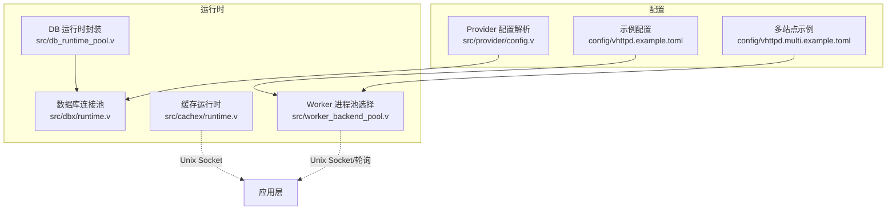
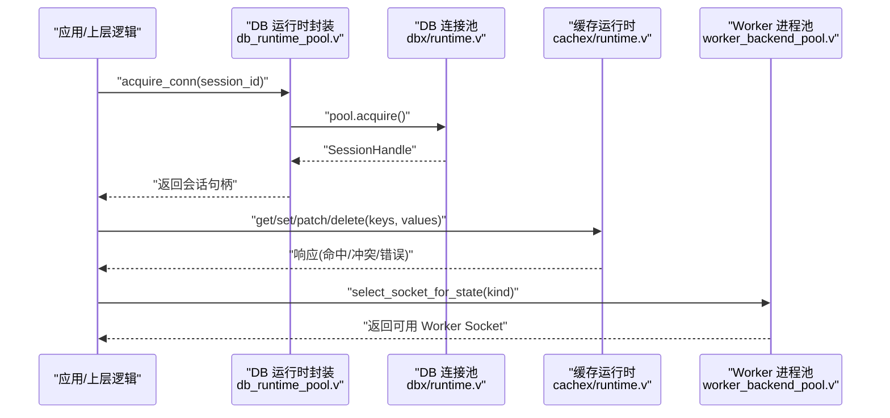
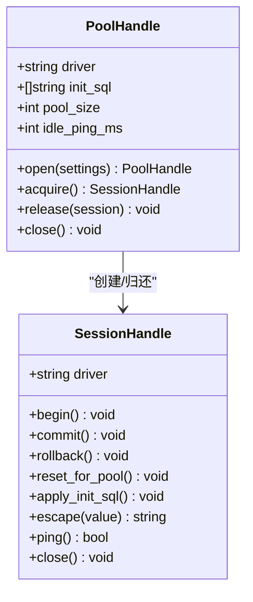
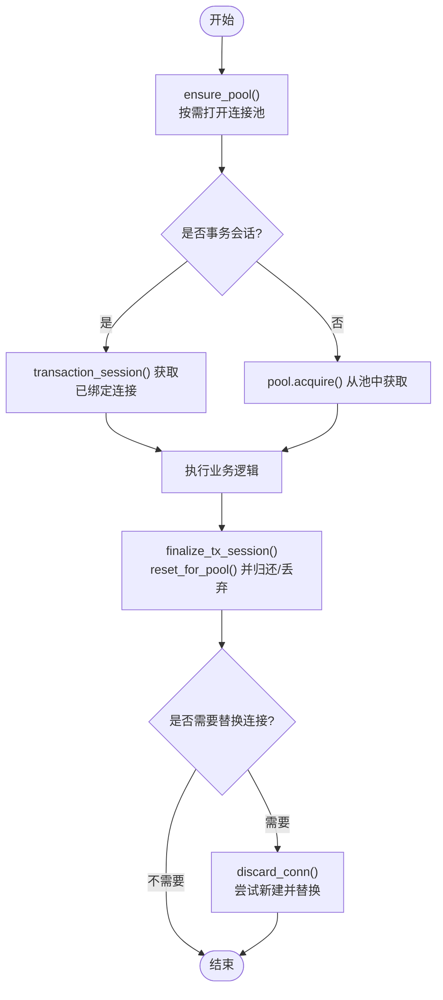
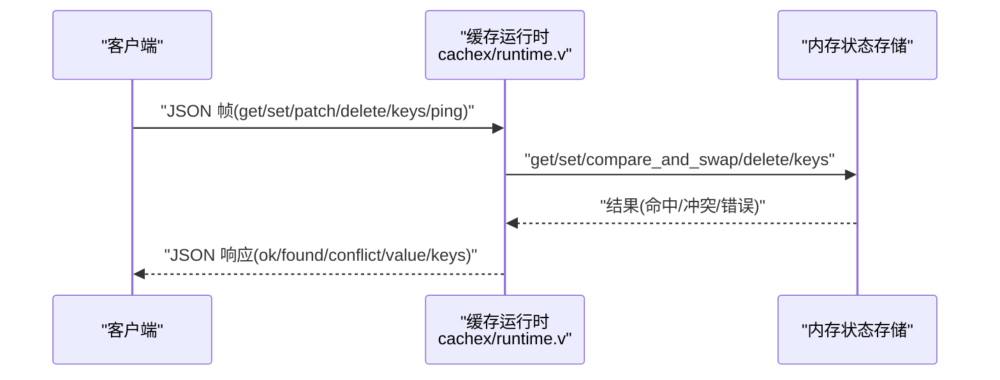
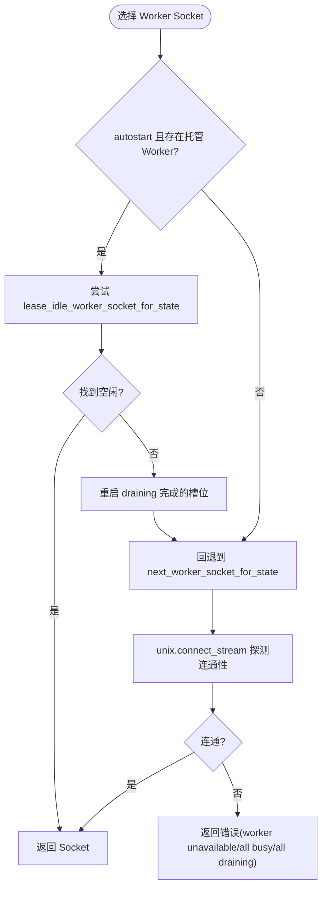
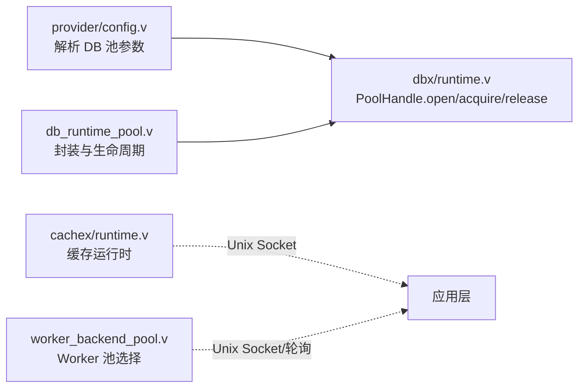

# 连接池管理优化

<cite>
**本文引用的文件**   
- [src/dbx/runtime.v](file://src/dbx/runtime.v)
- [src/db_runtime_pool.v](file://src/db_runtime_pool.v)
- [src/provider/config.v](file://src/provider/config.v)
- [config/vhttpd.example.toml](file://config/vhttpd.example.toml)
- [config/vhttpd.multi.example.toml](file://config/vhttpd.multi.example.toml)
- [src/cachex/runtime.v](file://src/cachex/runtime.v)
- [src/worker_backend_pool.v](file://src/worker_backend_pool.v)
- [README.md](file://README.md)
- [articles/12-advanced-patterns.md](file://articles/12-advanced-patterns.md)
- [php/package/wordpress/v-profiler/v-profiler-admin.php](file://php/package/wordpress/v-profiler/v-profiler-admin.php)
</cite>

## 目录
1. [引言](#引言)
2. [项目结构](#项目结构)
3. [核心组件](#核心组件)
4. [架构总览](#架构总览)
5. [详细组件分析](#详细组件分析)
6. [依赖关系分析](#依赖关系分析)
7. [性能考虑与调优](#性能考虑与调优)
8. [故障处理与自动恢复](#故障处理与自动恢复)
9. [监控指标与可观测性](#监控指标与可观测性)
10. [分布式协调策略](#分布式协调策略)
11. [结论](#结论)
12. [附录：配置参考](#附录配置参考)

## 引言
本指南聚焦 VHTTPD 中的连接池管理与优化，覆盖数据库连接池、缓存连接池、上游服务连接池（含 PHP Worker 进程池）等。文档从系统架构、数据流、关键实现入手，提供基于业务负载与系统资源的调优方法，并给出监控指标、性能分析方法、故障处理与自动恢复机制，以及分布式环境下的协调策略建议。

## 项目结构
VHTTPD 的连接池相关能力分布在以下模块：
- 数据库连接池：dbx 运行时与 db_runtime_pool 封装
- 缓存连接池：cachex 运行时（内存态键值存储，通过 Unix Socket 暴露）
- 上游服务连接池：worker_backend_pool（PHP Worker 进程池选择与复用）
- 配置入口：provider/config 解析数据库连接池参数；示例配置展示 worker 池大小等

图表来源
- [src/dbx/runtime.v:484-588](file://src/dbx/runtime.v#L484-L588)
- [src/db_runtime_pool.v:1-155](file://src/db_runtime_pool.v#L1-L155)
- [src/cachex/runtime.v:1-70](file://src/cachex/runtime.v#L1-L70)
- [src/worker_backend_pool.v:1-137](file://src/worker_backend_pool.v#L1-L137)
- [src/provider/config.v:205-229](file://src/provider/config.v#L205-L229)
- [config/vhttpd.example.toml:19-26](file://config/vhttpd.example.toml#L19-L26)
- [config/vhttpd.multi.example.toml:44-55](file://config/vhttpd.multi.example.toml#L44-L55)

章节来源
- [src/dbx/runtime.v:484-588](file://src/dbx/runtime.v#L484-L588)
- [src/db_runtime_pool.v:1-155](file://src/db_runtime_pool.v#L1-L155)
- [src/cachex/runtime.v:1-70](file://src/cachex/runtime.v#L1-L70)
- [src/worker_backend_pool.v:1-137](file://src/worker_backend_pool.v#L1-L137)
- [src/provider/config.v:205-229](file://src/provider/config.v#L205-L229)
- [config/vhttpd.example.toml:19-26](file://config/vhttpd.example.toml#L19-L26)
- [config/vhttpd.multi.example.toml:44-55](file://config/vhttpd.multi.example.toml#L44-L55)

## 核心组件
- 数据库连接池（MySQL/PostgreSQL）
  - 支持按驱动初始化连接池，MySQL 使用固定容量 channel 预创建连接，PostgreSQL 使用库级连接池
  - 会话句柄封装，支持事务、重置回池、空闲探测（MySQL idle_ping_ms）
  - 运行时统计：查询/执行计数、慢查询计数、最近查询快照
- 缓存连接池（内存态）
  - 通过 Unix Socket 暴露 get/set/patch/delete/keys/ping 等操作
  - 内部为线程安全的内存状态存储，支持 TTL
- Worker 进程池（PHP 等）
  - 基于 Unix Socket 的进程池选择策略：优先空闲、回退到轮询、探测连通性
  - 支持自动启动、draining 重启、并发请求计数

章节来源
- [src/dbx/runtime.v:484-588](file://src/dbx/runtime.v#L484-L588)
- [src/dbx/runtime.v:556-607](file://src/dbx/runtime.v#L556-L607)
- [src/dbx/runtime.v:681-706](file://src/dbx/runtime.v#L681-L706)
- [src/dbx/runtime.v:188-227](file://src/dbx/runtime.v#L188-L227)
- [src/cachex/runtime.v:194-276](file://src/cachex/runtime.v#L194-L276)
- [src/worker_backend_pool.v:30-58](file://src/worker_backend_pool.v#L30-L58)
- [src/worker_backend_pool.v:60-124](file://src/worker_backend_pool.v#L60-L124)

## 架构总览
下图展示了 vhttpd 中三类连接池的关键交互：应用侧通过运行时接口获取连接或调用缓存操作，底层分别对接数据库连接池、内存缓存和 Worker 进程池。

图表来源
- [src/db_runtime_pool.v:58-73](file://src/db_runtime_pool.v#L58-L73)
- [src/dbx/runtime.v:556-588](file://src/dbx/runtime.v#L556-L588)
- [src/cachex/runtime.v:194-276](file://src/cachex/runtime.v#L194-L276)
- [src/worker_backend_pool.v:60-124](file://src/worker_backend_pool.v#L60-L124)

## 详细组件分析

### 数据库连接池（MySQL/PostgreSQL）
- 连接池打开与默认大小
  - 当未显式设置 pool_size 时，默认值为 5
  - MySQL 以固定容量 channel 预创建连接；PostgreSQL 使用库级连接池并设置最大连接数
- 获取与释放
  - acquire() 返回 SessionHandle；release() 将连接归还池（MySQL 直接放回 channel，PostgreSQL 关闭句柄由库管理）
  - reset_for_pool() 在返回前重置会话状态（如 autocommit、init_sql 重放）
- 空闲探测与预热
  - MySQL 支持 idle_ping_ms：若超过阈值则 ping 失败则重建连接
  - init_sql 可在每次获取后重放，确保会话一致性
- 事务与会话隔离
  - 支持 begin/commit/rollback；reset_for_pool 保证事务结束后状态干净
- 运行统计与慢查询
  - 记录 total_queries/total_executes/slow_queries/last_query_ms/recent_queries

图表来源
- [src/dbx/runtime.v:388-407](file://src/dbx/runtime.v#L388-L407)
- [src/dbx/runtime.v:484-588](file://src/dbx/runtime.v#L484-L588)
- [src/dbx/runtime.v:556-607](file://src/dbx/runtime.v#L556-L607)
- [src/dbx/runtime.v:681-706](file://src/dbx/runtime.v#L681-L706)

章节来源
- [src/dbx/runtime.v:484-588](file://src/dbx/runtime.v#L484-L588)
- [src/dbx/runtime.v:556-607](file://src/dbx/runtime.v#L556-L607)
- [src/dbx/runtime.v:681-706](file://src/dbx/runtime.v#L681-L706)
- [src/dbx/runtime.v:188-227](file://src/dbx/runtime.v#L188-L227)

### 数据库运行时封装（生命周期与错误处理）
- 懒加载与安装
  - ensure_pool() 按需打开池，install_pool_if_missing() 避免重复安装
- 事务会话绑定
  - transaction_session() 用于 session_id 绑定的事务上下文
- 失败连接回收与替换
  - release_failed_conn() 根据错误类型决定是否丢弃连接
  - discard_conn() 在池就绪时尝试用新连接替换旧连接，保障稳定性
- 清理与关闭
  - cleanup_sessions() 回收残留会话；close_pool() 安全关闭池

图表来源
- [src/db_runtime_pool.v:6-25](file://src/db_runtime_pool.v#L6-L25)
- [src/db_runtime_pool.v:58-73](file://src/db_runtime_pool.v#L58-L73)
- [src/db_runtime_pool.v:39-56](file://src/db_runtime_pool.v#L39-L56)
- [src/db_runtime_pool.v:75-103](file://src/db_runtime_pool.v#L75-L103)
- [src/db_runtime_pool.v:105-123](file://src/db_runtime_pool.v#L105-L123)
- [src/db_runtime_pool.v:125-142](file://src/db_runtime_pool.v#L125-L142)

章节来源
- [src/db_runtime_pool.v:6-25](file://src/db_runtime_pool.v#L6-L25)
- [src/db_runtime_pool.v:39-56](file://src/db_runtime_pool.v#L39-L56)
- [src/db_runtime_pool.v:75-103](file://src/db_runtime_pool.v#L75-L103)
- [src/db_runtime_pool.v:105-123](file://src/db_runtime_pool.v#L105-L123)
- [src/db_runtime_pool.v:125-142](file://src/db_runtime_pool.v#L125-L142)

### 缓存连接池（内存态）
- 协议与帧格式
  - 采用 4 字节长度前缀 + JSON 体，支持 get/set/patch/delete/keys/ping
- 命名空间与键
  - full_key(namespace:key) 统一键空间，避免跨命名冲突
- 并发与原子性
  - patch 支持 compare_and_swap_set_with_ttl / compare_and_swap_delete，返回 conflict 表示竞争
- 监控
  - snapshot_json 输出 enabled/started/total_ops/failed_ops/keys 等

图表来源
- [src/cachex/runtime.v:157-187](file://src/cachex/runtime.v#L157-L187)
- [src/cachex/runtime.v:194-276](file://src/cachex/runtime.v#L194-L276)
- [src/cachex/runtime.v:79-96](file://src/cachex/runtime.v#L79-L96)

章节来源
- [src/cachex/runtime.v:194-276](file://src/cachex/runtime.v#L194-L276)
- [src/cachex/runtime.v:79-96](file://src/cachex/runtime.v#L79-L96)

### 上游服务连接池（PHP Worker 进程池）
- 选择策略
  - 优先选择空闲且存活的 Worker（lease_idle_worker_socket_for_state）
  - 若无空闲，回退到轮询（next_worker_socket_for_state），并进行连通性探测
- 自动启动与排空
  - autostart=true 时，对 draining 完成且无 inflight 的 Worker 立即重启
- 诊断与事件
  - select_socket_for_state_core 失败时发出 worker.select.failed 事件，附带诊断信息

图表来源
- [src/worker_backend_pool.v:30-58](file://src/worker_backend_pool.v#L30-L58)
- [src/worker_backend_pool.v:60-124](file://src/worker_backend_pool.v#L60-L124)

章节来源
- [src/worker_backend_pool.v:30-58](file://src/worker_backend_pool.v#L30-L58)
- [src/worker_backend_pool.v:60-124](file://src/worker_backend_pool.v#L60-L124)

## 依赖关系分析
- provider/config 负责解析数据库连接池参数（driver/host/port/username/password/database/pool_size/idle_ping_ms/init_sql），并注入到 dbx 运行时
- db_runtime_pool 作为应用侧封装，负责懒加载、事务会话绑定、失败连接回收与替换
- cachex 提供内存缓存运行时，独立于数据库池
- worker_backend_pool 提供 Worker 进程池选择，与上层调度器协作

图表来源
- [src/provider/config.v:205-229](file://src/provider/config.v#L205-L229)
- [src/dbx/runtime.v:484-588](file://src/dbx/runtime.v#L484-L588)
- [src/db_runtime_pool.v:1-155](file://src/db_runtime_pool.v#L1-L155)
- [src/cachex/runtime.v:1-70](file://src/cachex/runtime.v#L1-L70)
- [src/worker_backend_pool.v:1-137](file://src/worker_backend_pool.v#L1-L137)

章节来源
- [src/provider/config.v:205-229](file://src/provider/config.v#L205-L229)
- [src/dbx/runtime.v:484-588](file://src/dbx/runtime.v#L484-L588)
- [src/db_runtime_pool.v:1-155](file://src/db_runtime_pool.v#L1-L155)
- [src/cachex/runtime.v:1-70](file://src/cachex/runtime.v#L1-L70)
- [src/worker_backend_pool.v:1-137](file://src/worker_backend_pool.v#L1-L137)

## 性能考虑与调优
- 数据库连接池大小
  - 默认 pool_size=5；对于高并发读场景可适当增大，写密集需结合数据库服务器限制与锁竞争评估
  - MySQL idle_ping_ms 开启后可减少“假活”连接带来的失败重试开销
- 缓存命中率与 TTL
  - 合理设置 TTL 降低热点键失效风暴；利用 patch 的 CAS 语义避免并发更新冲突
- Worker 进程池
  - pool_size 应与 CPU 核数及 I/O 特性匹配；autostart 配合 draining 提升吞吐与稳定性
- 慢查询与最近查询快照
  - 关注 slow_queries 与 last_query_ms，结合 recent_queries 定位热点 SQL

章节来源
- [src/dbx/runtime.v:484-588](file://src/dbx/runtime.v#L484-L588)
- [src/dbx/runtime.v:188-227](file://src/dbx/runtime.v#L188-L227)
- [src/cachex/runtime.v:194-276](file://src/cachex/runtime.v#L194-L276)
- [config/vhttpd.example.toml:19-26](file://config/vhttpd.example.toml#L19-L26)
- [config/vhttpd.multi.example.toml:44-55](file://config/vhttpd.multi.example.toml#L44-L55)

## 故障处理与自动恢复
- 数据库连接丢失检测与替换
  - is_connection_lost_error 识别常见断连错误；release_failed_conn 区分普通错误与断连，必要时丢弃连接
  - discard_conn 在池就绪时尝试新建连接并替换，保障后续可用性
- 事务会话异常
  - finalize_tx_session 在 reusable=false 时丢弃连接；reusable=true 时 reset_for_pool 后归还
- Worker 进程健康检查
  - 选择流程包含进程存活与 draining 状态判断；失败时发出 worker.select.failed 事件并附带诊断

章节来源
- [src/dbx/runtime.v:179-186](file://src/dbx/runtime.v#L179-L186)
- [src/db_runtime_pool.v:39-56](file://src/db_runtime_pool.v#L39-L56)
- [src/db_runtime_pool.v:75-103](file://src/db_runtime_pool.v#L75-L103)
- [src/db_runtime_pool.v:105-123](file://src/db_runtime_pool.v#L105-L123)
- [src/worker_backend_pool.v:60-124](file://src/worker_backend_pool.v#L60-L124)

## 监控指标与可观测性
- 数据库连接池
  - 关键指标：total_queries、total_executes、failed_queries、slow_queries、last_query_ms、recent_queries
  - 可通过 admin/runtime 端点获取快照（例如 /admin/runtime/db）
- 缓存运行时
  - 关键指标：total_ops、failed_ops、keys、ready
  - 可通过 admin/runtime/cache 查看
- Worker 进程池
  - 关键指标：worker_pool_size、active/inflight 计数、选择失败事件
  - README 提供了 worker_pool_size 与 admin 端点说明

章节来源
- [src/dbx/runtime.v:188-227](file://src/dbx/runtime.v#L188-L227)
- [src/cachex/runtime.v:79-96](file://src/cachex/runtime.v#L79-L96)
- [README.md:1065-1145](file://README.md#L1065-L1145)
- [README.md:1258-1303](file://README.md#L1258-L1303)

## 分布式协调策略
- 连接池本地化
  - 数据库与缓存连接池均为进程内资源，适合单实例部署；跨实例共享需通过外部中间件（如 Redis、ProxySQL）
- Worker 进程池扩展
  - 通过多站点或多实例部署，结合负载均衡与粘性会话（如 WebSocket sticky）提升整体吞吐
- 事件与遥测
  - 使用 event_log 与 admin/runtime 端点进行集中采集与分析，辅助定位跨实例问题

章节来源
- [config/vhttpd.multi.example.toml:44-55](file://config/vhttpd.multi.example.toml#L44-L55)
- [README.md:1065-1145](file://README.md#L1065-L1145)
- [articles/12-advanced-patterns.md:484-553](file://articles/12-advanced-patterns.md#L484-L553)

## 结论
VHTTPD 的连接池体系围绕“进程内高效复用 + 健壮的错误处理 + 完善的可观测性”展开。数据库连接池提供 MySQL/PostgreSQL 双驱动支持与空闲探测；缓存运行时提供轻量内存态键值服务；Worker 进程池提供稳定的执行引擎复用。通过合理的池大小、TTL 与监控指标，可以在不同负载特征下取得稳定与高性能表现。

## 附录：配置参考
- 数据库连接池参数
  - 由 provider/config 解析，包括 driver/host/port/username/password/database/pool_size/idle_ping_ms/init_sql
- Worker 池大小
  - 示例配置展示 pool_size 与 socket_prefix 等字段
- WordPress 集成提示
  - 通过环境变量与桥接文件启用数据库连接池与对象缓存复用

章节来源
- [src/provider/config.v:205-229](file://src/provider/config.v#L205-L229)
- [config/vhttpd.example.toml:19-26](file://config/vhttpd.example.toml#L19-L26)
- [php/package/wordpress/v-profiler/v-profiler-admin.php:449-464](file://php/package/wordpress/v-profiler/v-profiler-admin.php#L449-L464)