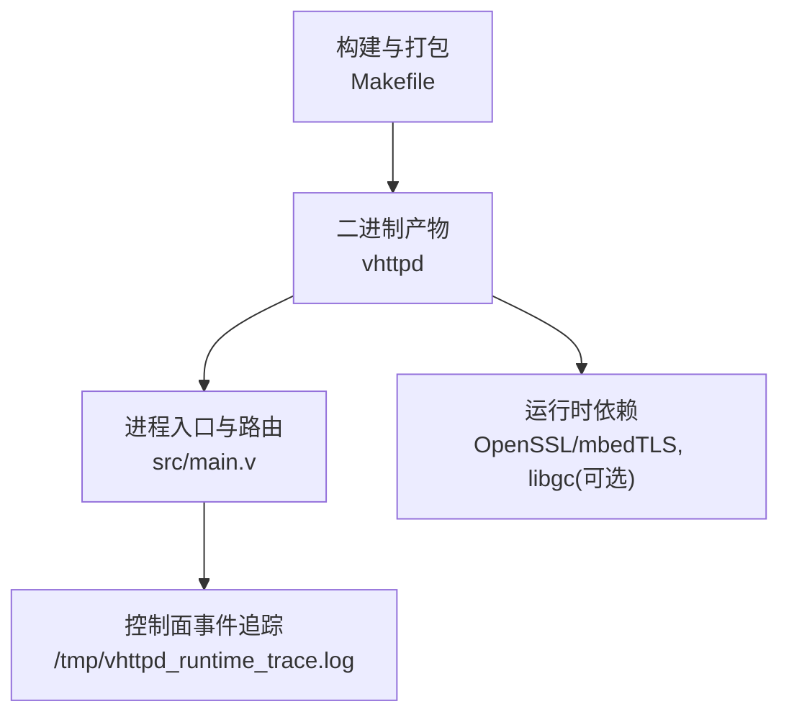
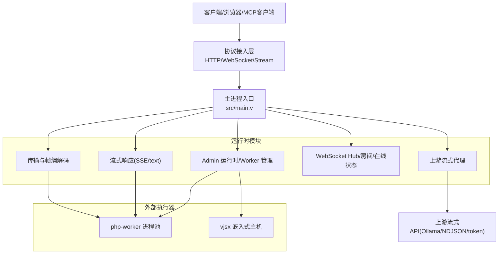
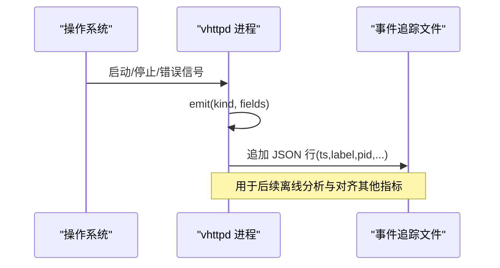
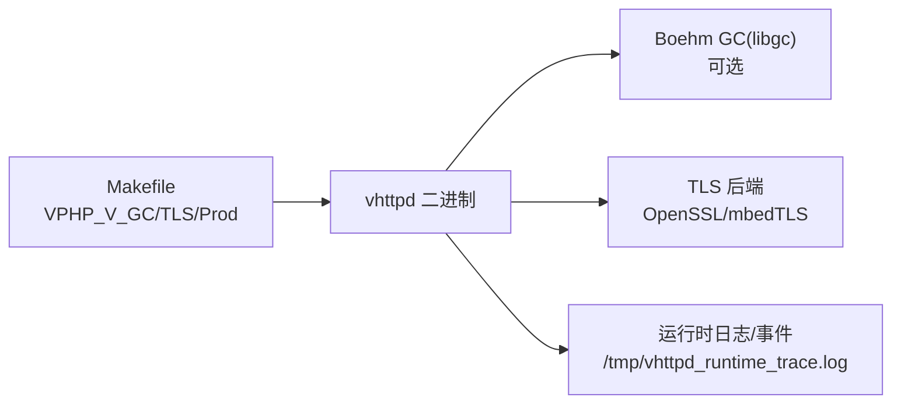

# 内存和CPU分析

<cite>
**本文引用的文件**   
- [README.md](file://README.md)
- [Makefile](file://Makefile)
- [src/main.v](file://src/main.v)
- [docs/refactor_0601.md](file://docs/refactor_0601.md)
</cite>

## 目录
1. [简介](#简介)
2. [项目结构](#项目结构)
3. [核心组件](#核心组件)
4. [架构总览](#架构总览)
5. [详细组件分析](#详细组件分析)
6. [依赖关系分析](#依赖关系分析)
7. [性能考量](#性能考量)
8. [故障排查指南](#故障排查指南)
9. [结论](#结论)
10. [附录](#附录) 

## 简介
本指南聚焦于在 VHTTPD 环境下进行深入的内存与 CPU 使用分析，覆盖以下主题：
- 内存泄漏检测：堆栈跟踪、内存快照对比、对象生命周期监控
- CPU 使用率分析：热点函数识别、线程阻塞分析、上下文切换监控
- 系统级工具应用：top、htop、valgrind、perf 等在 VHTTPD 进程中的使用方法
- 高级技术：内存使用模式分析、GC 行为调优、CPU 亲和性设置、进程间资源竞争

VHTTPD 是一个基于 V 语言的高性能 HTTP/WS/stream 运行时，内嵌 vjsx（QuickJS）并管理外部 PHP worker。其构建与运行选项直接影响 GC、TLS 后端、可观测性与调试能力，是性能分析的起点。

章节来源
- [README.md:1-120](file://README.md#L1-L120)

## 项目结构
从性能分析视角，关注以下与内存/CPU相关的工程要素：
- 构建与运行时开关：是否启用 Boehm GC、TLS 后端选择、生产编译标志等
- 进程入口与事件追踪：主进程结构体、关键事件落盘、请求 ID/Trace ID 解析
- 文档建议：错误分类、panic 处理、配置校验等对稳定性与可观测性的影响

图表来源
- [Makefile:1-35](file://Makefile#L1-L35)
- [src/main.v:15-23](file://src/main.v#L15-L23)
- [src/main.v:25-38](file://src/main.v#L25-L38)

章节来源
- [Makefile:1-35](file://Makefile#L1-L35)
- [src/main.v:15-23](file://src/main.v#L15-L23)
- [src/main.v:25-38](file://src/main.v#L25-L38)

## 核心组件
- 构建与 GC 开关
  - Makefile 自动探测 bdw-gc，若存在则启用 Boehm GC；否则默认 none。可通过环境变量 VPHP_V_GC 强制指定。
  - 生产构建使用 -prod 与 -nocache，有助于减少调试开销。
- 进程入口与事件追踪
  - App 结构体位于堆上（@['heap']），承载数据面与控制面运行时。
  - emit 方法对关键生命周期事件写入 /tmp/vhttpd_runtime_trace.log，便于定位启动/停止/失败等阶段。
- 文档改进建议
  - 消除裸 panic、统一错误分类、审计静默错误点，提升稳定性与可观测性，间接降低异常路径的内存/CPU消耗。

章节来源
- [Makefile:8-11](file://Makefile#L8-L11)
- [Makefile:101-102](file://Makefile#L101-L102)
- [src/main.v:15-23](file://src/main.v#L15-L23)
- [src/main.v:75-81](file://src/main.v#L75-L81)
- [docs/refactor_0601.md:62-68](file://docs/refactor_0601.md#L62-L68)

## 架构总览
下图展示 vhttpd 在协议层与执行侧的关键交互，以及对外部 worker 与上游流式 API 的调度关系。该图用于理解不同路径下的内存/CPU压力点。

图表来源
- [README.md:84-126](file://README.md#L84-L126)

## 详细组件分析

### 构建与运行时开关对性能的影响
- Boehm GC 启用策略
  - 当检测到 bdw-gc 时，构建自动添加 -gc boehm；也可通过 VPHP_V_GC=boehm 显式开启。
  - 启用 Boehm GC 后，C/V 混合堆分配由外部 GC 管理，可能改变内存增长曲线与回收时机。
- TLS 后端
  - OpenSSL 或 mbedTLS 的选择会影响网络 I/O 路径的 CPU 占用与延迟特性。
- 生产构建
  - -prod 与 -nocache 可减少调试与缓存相关开销，适合压测与线上环境。

章节来源
- [Makefile:8-11](file://Makefile#L8-L11)
- [Makefile:12-16](file://Makefile#L12-L16)
- [Makefile:101-102](file://Makefile#L101-L102)

### 进程入口与事件追踪
- App 结构体驻留堆上，避免栈溢出风险，适合长期运行的守护进程。
- emit 方法将关键事件追加到 /tmp/vhttpd_runtime_trace.log，包含时间戳、标签与 PID，可用于：
  - 定位服务启停、失败、worker 选择失败等事件的时间线
  - 结合系统日志与 perf/valgrind 输出进行关联分析

图表来源
- [src/main.v:15-23](file://src/main.v#L15-L23)
- [src/main.v:75-81](file://src/main.v#L75-L81)
- [src/main.v:25-38](file://src/main.v#L25-L38)

章节来源
- [src/main.v:15-23](file://src/main.v#L15-L23)
- [src/main.v:75-81](file://src/main.v#L75-L81)
- [src/main.v:25-38](file://src/main.v#L25-L38)

### 内存泄漏检测方法（结合 VHTTPD）
- 堆栈跟踪分析
  - 使用 valgrind 的 memcheck 捕获未释放分配与越界访问，结合 emit 事件时间戳定位问题阶段。
  - 针对长连接与流式路径（WebSocket/SSE/upstream），重点关注连接关闭后的资源释放。
- 内存快照对比
  - 在生产或压测中，定期导出进程内存映射与堆信息（例如通过 gcore + gdb 或系统提供的工具），对比不同时间点的增长趋势。
  - 若启用 Boehm GC，需区分 V 堆与 C 堆分配，结合 GC 统计与系统 RSS 变化判断是否为 GC 碎片或外部库泄漏。
- 对象生命周期监控
  - 利用 /tmp/vhttpd_runtime_trace.log 的事件序列，标记“创建-活跃-销毁”的生命周期边界，配合 perf 火焰图验证热点是否在预期路径。
  - 对于 php-worker 子进程，结合父进程的 worker 选择失败事件，检查子进程退出原因与资源清理。

章节来源
- [src/main.v:75-81](file://src/main.v#L75-L81)
- [src/main.v:25-38](file://src/main.v#L25-L38)
- [Makefile:8-11](file://Makefile#L8-L11)

### CPU 使用率分析技巧（结合 VHTTPD）
- 热点函数识别
  - 使用 perf record/report 采集 CPU 热点，结合 vhttpd 的协议路径（HTTP/WS/stream）与 executor 分支（php/vjsx）定位瓶颈。
  - 在高并发下，优先观察网络 I/O 与序列化/反序列化路径。
- 线程阻塞分析
  - 使用 perf sched 或 ftrace 观察系统调用阻塞点（如 epoll、I/O、锁等待）。
  - 结合 admin 运行时端点（参考 README 中的 admin 能力）查看 worker 队列长度与活跃会话数，辅助判断是否因队列积压导致 CPU 抖动。
- 上下文切换监控
  - 使用 top/htop 的 %us/%sy/%wa/%st 与 perf stat 的 context-switches 指标，评估多核利用率与跨核迁移成本。
  - 对 WebSocket 与 upstream 长连接场景，注意事件循环与回调路径的锁粒度。

章节来源
- [README.md:152-173](file://README.md#L152-L173)

### 系统级监控工具在 VHTTPD 的应用
- top/htop
  - 观察整体 CPU、内存、I/O 与进程树，确认 vhttpd 与其子进程（php-worker、vjsx host）的资源分布。
- valgrind
  - memcheck：检测内存泄漏与非法访问；建议在开发/预发环境运行，或在可控压测窗口内短时采样。
  - 针对 Boehm GC 构建，额外关注 C 堆分配与第三方库的内存行为。
- perf
  - record/report：生成火焰图，定位热点函数与调用链。
  - stat：采集上下文切换、缺页中断、cache miss 等指标，辅助判断系统级瓶颈。
- 事件追踪
  - 结合 /tmp/vhttpd_runtime_trace.log 与系统日志，建立时间轴，将性能数据与业务事件对齐。

章节来源
- [src/main.v:25-38](file://src/main.v#L25-L38)
- [Makefile:8-11](file://Makefile#L8-L11)

### 内存使用模式分析与 GC 行为调优
- 使用模式分析
  - 区分短请求（HTTP request/response）与长连接（WebSocket/upstream）的内存占用特征。
  - 关注流式路径的缓冲策略与帧编解码路径，避免大对象频繁分配。
- GC 行为调优
  - 若启用 Boehm GC，可通过环境变量或构建参数调整 GC 阈值与收集频率，平衡吞吐与延迟。
  - 在生产构建中使用 -prod 与 -nocache，减少不必要的调试与缓存开销。
- 外部依赖
  - TLS 后端（OpenSSL/mbedTLS）与数据库客户端库的内存行为需纳入整体分析。

章节来源
- [Makefile:8-11](file://Makefile#L8-L11)
- [Makefile:101-102](file://Makefile#L101-L102)
- [README.md:332-346](file://README.md#L332-L346)

### CPU 亲和性与进程间资源竞争
- CPU 亲和性
  - 使用 taskset 或 cgroup 将 vhttpd 主进程与关键子进程绑定到固定 CPU 核，减少跨核迁移带来的缓存失效。
- 进程间竞争
  - 观察 php-worker 与 vjsx host 的 CPU 与内存争用，必要时拆分实例或使用独立监听端口隔离负载。
  - 结合 admin 运行时端点，监控 worker 池大小、队列容量与超时配置，避免过载导致的抖动。

章节来源
- [README.md:152-173](file://README.md#L152-L173)

## 依赖关系分析
下图展示构建期与运行期的关键依赖与开关，这些开关直接影响内存与 CPU 表现。

图表来源
- [Makefile:8-16](file://Makefile#L8-L16)
- [src/main.v:25-38](file://src/main.v#L25-L38)

章节来源
- [Makefile:8-16](file://Makefile#L8-L16)
- [src/main.v:25-38](file://src/main.v#L25-L38)

## 性能考量
- 构建优化
  - 生产构建使用 -prod 与 -nocache，减少调试与缓存开销。
  - 根据目标平台与需求决定是否启用 Boehm GC。
- 运行时配置
  - 合理设置 worker 池大小、队列容量与超时，避免队列积压引发 CPU 抖动。
  - 针对长连接与流式路径，关注缓冲与帧编解码路径的内存占用。
- 可观测性
  - 利用 emit 事件与 admin 运行时端点，建立端到端的性能基线与告警。

章节来源
- [Makefile:101-102](file://Makefile#L101-L102)
- [README.md:152-173](file://README.md#L152-L173)

## 故障排查指南
- 事件追踪
  - 检查 /tmp/vhttpd_runtime_trace.log 中的 server.started/server.failed/admin.started/internal_admin.error/worker.select.failed 等事件，定位异常发生阶段。
- 错误分类与 panic
  - 遵循重构建议，消除裸 panic、统一错误分类，减少不可恢复错误对稳定性的影响。
- 静默错误审计
  - 审计 or {} 等静默错误点，补充警告日志，确保异常路径可被观测。

章节来源
- [src/main.v:75-81](file://src/main.v#L75-L81)
- [docs/refactor_0601.md:62-68](file://docs/refactor_0601.md#L62-L68)

## 结论
在 VHTTPD 环境中进行内存与 CPU 分析，应从构建与运行时开关入手，结合事件追踪与系统级工具形成闭环：
- 明确 GC 与 TLS 后端的选择及其影响
- 利用 emit 事件与 admin 运行时端点建立时间轴
- 使用 valgrind 与 perf 进行深度诊断
- 通过 CPU 亲和性与进程隔离缓解资源竞争
- 持续完善错误分类与可观测性，提升稳定性与可维护性

## 附录
- 常用命令参考
  - 构建与运行：make prod、./vhttpd --config ...
  - 事件追踪：tail -f /tmp/vhttpd_runtime_trace.log
  - 性能采集：perf record/report、perf stat
  - 内存检测：valgrind --tool=memcheck ./vhttpd
- 参考文档
  - 架构与模块说明见 README 中的架构图与依赖说明
  - 重构建议见 docs/refactor_0601.md