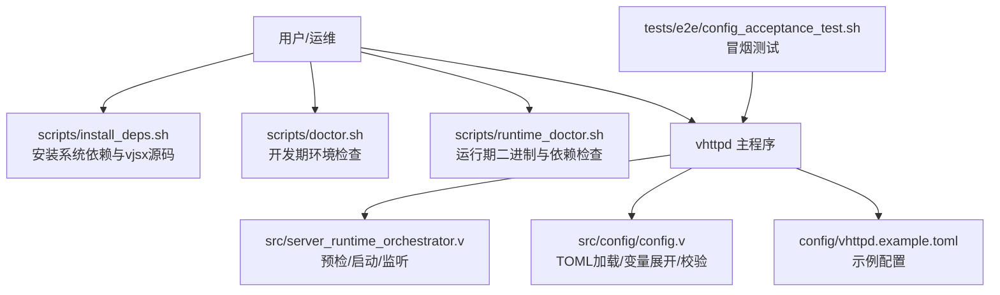
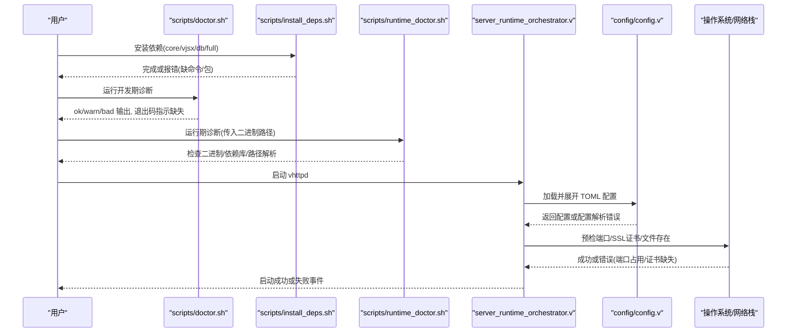
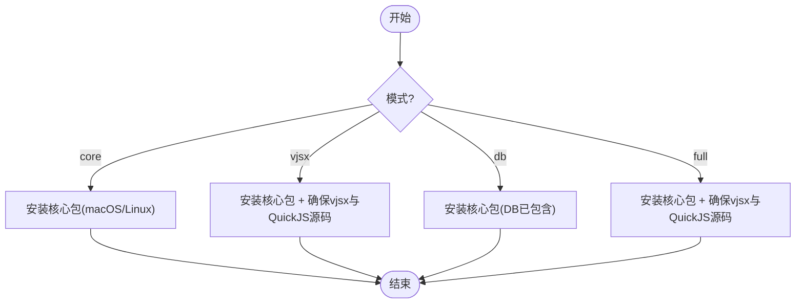
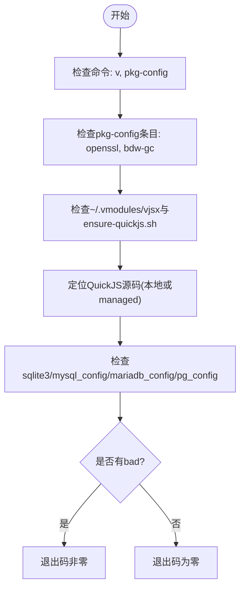
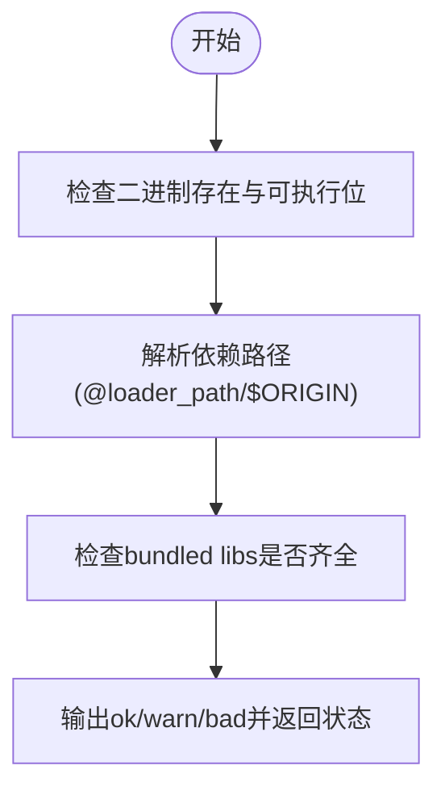
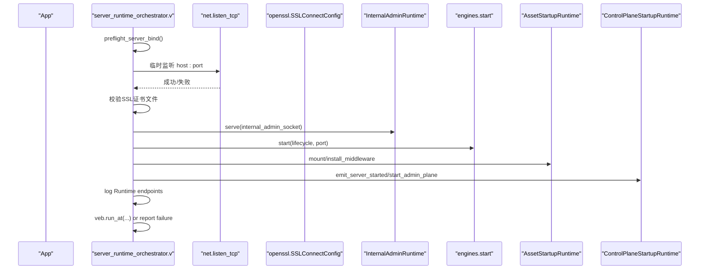
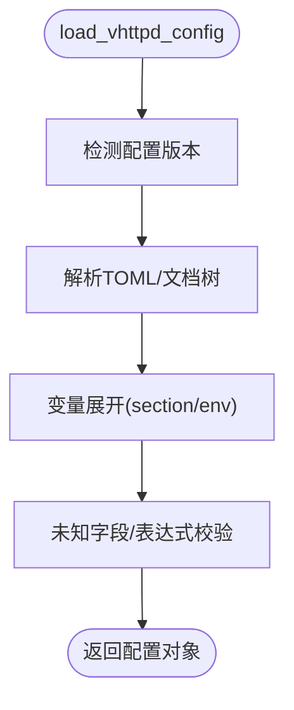
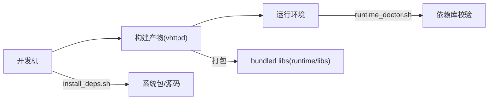

# 启动问题排查

<cite>
**本文引用的文件**   
- [scripts/doctor.sh](file://scripts/doctor.sh)
- [scripts/install_deps.sh](file://scripts/install_deps.sh)
- [scripts/runtime_doctor.sh](file://scripts/runtime_doctor.sh)
- [src/server_runtime_orchestrator.v](file://src/server_runtime_orchestrator.v)
- [src/config/config.v](file://src/config/config.v)
- [config/vhttpd.example.toml](file://config/vhttpd.example.toml)
- [README.md](file://README.md)
- [tests/e2e/config_acceptance_test.sh](file://tests/e2e/config_acceptance_test.sh)
</cite>

## 目录
1. [简介](#简介)
2. [项目结构](#项目结构)
3. [核心组件](#核心组件)
4. [架构总览](#架构总览)
5. [详细组件分析](#详细组件分析)
6. [依赖关系分析](#依赖关系分析)
7. [性能考虑](#性能考虑)
8. [故障排查指南](#故障排查指南)
9. [结论](#结论)
10. [附录](#附录)

## 简介
本指南聚焦 vhttpd 的“启动失败”问题，提供从环境到运行时、从配置到权限的系统化排查方法。内容覆盖：
- 常见启动失败原因与解决方案（依赖缺失、端口冲突、SSL 证书错误、配置文件解析错误、路径与权限问题等）
- 诊断脚本使用：开发期 doctor.sh、运行期 runtime_doctor.sh
- 典型错误信息解读与定位步骤（编译/构建、运行时绑定、配置变量展开、数据库客户端库检测等）
- 系统环境变量、路径设置、文件权限等基础设施层面的诊断方法

## 项目结构
围绕启动链路的关键位置：
- 安装与依赖准备：scripts/install_deps.sh
- 开发期诊断：scripts/doctor.sh
- 运行期诊断：scripts/runtime_doctor.sh
- 服务器启动编排与预检：src/server_runtime_orchestrator.v
- 配置加载与变量展开：src/config/config.v
- 示例配置：config/vhttpd.example.toml
- 端到端冒烟测试（含启动场景）：tests/e2e/config_acceptance_test.sh
- 总体说明与依赖/构建入口：README.md

图表来源
- [scripts/install_deps.sh:1-138](file://scripts/install_deps.sh#L1-L138)
- [scripts/doctor.sh:1-108](file://scripts/doctor.sh#L1-L108)
- [scripts/runtime_doctor.sh:1-44](file://scripts/runtime_doctor.sh#L1-L44)
- [src/server_runtime_orchestrator.v:1-143](file://src/server_runtime_orchestrator.v#L1-L143)
- [src/config/config.v:448-482](file://src/config/config.v#L448-L482)
- [config/vhttpd.example.toml:1-67](file://config/vhttpd.example.toml#L1-L67)
- [tests/e2e/config_acceptance_test.sh:1-50](file://tests/e2e/config_acceptance_test.sh#L1-L50)

章节来源
- [README.md:210-248](file://README.md#L210-L248)
- [scripts/install_deps.sh:1-138](file://scripts/install_deps.sh#L1-L138)
- [scripts/doctor.sh:1-108](file://scripts/doctor.sh#L1-L108)
- [scripts/runtime_doctor.sh:1-44](file://scripts/runtime_doctor.sh#L1-L44)
- [src/server_runtime_orchestrator.v:1-143](file://src/server_runtime_orchestrator.v#L1-L143)
- [src/config/config.v:448-482](file://src/config/config.v#L448-L482)
- [config/vhttpd.example.toml:1-67](file://config/vhttpd.example.toml#L1-L67)
- [tests/e2e/config_acceptance_test.sh:1-50](file://tests/e2e/config_acceptance_test.sh#L1-L50)

## 核心组件
- 依赖安装器：按平台自动安装 OpenSSL、Boehm GC、pkg-config、SQLite/MySQL/PostgreSQL 客户端开发包；支持 vjsx 与 QuickJS 源码管理
- 诊断脚本：
  - 开发期：检查命令、pkg-config 条目、vjsx 模块路径、QuickJS 源码、sqlite3/mysql_config/mariadb_config/pg_config 可用性
  - 运行期：验证二进制可执行、RPATH/loader_path 解析、打包库存在性
- 服务器启动编排：预检端口与 SSL 证书、启动数据面与管理面、记录启动事件
- 配置加载：TOML 解析、变量展开（${section.key}、${env.NAME:-default}）、未知字段与表达式错误提示
- 示例配置：包含 server、admin、worker、php、feishu、assets 等常用段

章节来源
- [scripts/install_deps.sh:50-84](file://scripts/install_deps.sh#L50-L84)
- [scripts/doctor.sh:24-101](file://scripts/doctor.sh#L24-L101)
- [scripts/runtime_doctor.sh:22-44](file://scripts/runtime_doctor.sh#L22-L44)
- [src/server_runtime_orchestrator.v:11-46](file://src/server_runtime_orchestrator.v#L11-L46)
- [src/config/config.v:448-482](file://src/config/config.v#L448-L482)
- [config/vhttpd.example.toml:1-67](file://config/vhttpd.example.toml#L1-L67)

## 架构总览
下图展示“启动前准备 → 启动编排 → 配置加载 → 服务监听”的主流程及关键错误点。

图表来源
- [scripts/install_deps.sh:117-135](file://scripts/install_deps.sh#L117-L135)
- [scripts/doctor.sh:49-101](file://scripts/doctor.sh#L49-L101)
- [scripts/runtime_doctor.sh:39-44](file://scripts/runtime_doctor.sh#L39-L44)
- [src/server_runtime_orchestrator.v:11-46](file://src/server_runtime_orchestrator.v#L11-L46)
- [src/config/config.v:448-482](file://src/config/config.v#L448-L482)

## 详细组件分析

### 组件A：依赖安装器 install_deps.sh
- 功能要点
  - 平台分支：macOS 使用 brew，Linux 使用 apt-get
  - 安装 core 基础包：openssl、bdw-gc、pkg-config、sqlite、git、curl、unzip 等
  - DB 相关：默认安装 MySQL/MariaDB、PostgreSQL、SQLite 开发包
  - vjsx 与 QuickJS：确保 ~/.vmodules/vjsx 存在，优先使用 ../quickjs 本地源码，否则通过 ensure-quickjs.sh 拉取/准备
- 常见问题
  - 缺少 brew/apt 或无 sudo 权限导致安装失败
  - 网络受限无法克隆 vjsx 或下载 QuickJS 源码
  - 非 Linux/macOS 平台直接报错

图表来源
- [scripts/install_deps.sh:50-84](file://scripts/install_deps.sh#L50-L84)
- [scripts/install_deps.sh:86-115](file://scripts/install_deps.sh#L86-L115)
- [scripts/install_deps.sh:117-135](file://scripts/install_deps.sh#L117-L135)

章节来源
- [scripts/install_deps.sh:1-138](file://scripts/install_deps.sh#L1-138)

### 组件B：开发期诊断脚本 doctor.sh
- 检查项
  - 命令：v、pkg-config
  - pkg-config 条目：openssl、bdw-gc
  - vjsx 模块路径与 ensure-quickjs.sh 是否存在
  - QuickJS 源码：优先 ../quickjs，否则通过 vjsx 脚本准备
  - sqlite3、mysql_config/mariadb_config、pg_config 可选检查
- 输出语义
  - ok：满足
  - warn：可选但建议具备
  - bad：必需缺失，最终退出码非零
- 典型修复
  - 安装缺失的包或修正 PATH
  - 在仓库同级放置 quickjs 源码或允许脚本自动准备
  - 安装 mysql_config/mariadb_config/pg_config 以启用 WITH_DB=1 构建

图表来源
- [scripts/doctor.sh:24-101](file://scripts/doctor.sh#L24-L101)

章节来源
- [scripts/doctor.sh:1-108](file://scripts/doctor.sh#L1-L108)

### 组件C：运行期诊断脚本 runtime_doctor.sh
- 功能要点
  - 校验二进制存在且可执行
  - 解析 macOS @loader_path/@executable_path 与 Linux $ORIGIN 等 RPATH 指向的依赖库
  - 报告缺失的运行时库（如 libmysqlclient/libmariadb、libpq、libssl、libcrypto、libgc）
- 适用场景
  - 分发包部署后快速自检
  - 定位“动态库找不到”导致的启动崩溃

图表来源
- [scripts/runtime_doctor.sh:22-44](file://scripts/runtime_doctor.sh#L22-L44)

章节来源
- [scripts/runtime_doctor.sh:1-44](file://scripts/runtime_doctor.sh#L1-L44)

### 组件D：服务器启动编排 server_runtime_orchestrator.v
- 预检逻辑
  - 端口预检：尝试临时监听目标地址，失败则报 bind preflight failed
  - 非法端口：port<=0 直接报错
  - HTTPS 预检：开启时要求 cert/cert_key 非空且文件存在
- 启动流程
  - 初始化内部传输与管理面
  - 启动引擎生命周期
  - 挂载静态资源、安装中间件
  - 启动 admin 平面、upstream providers
  - 打印 Data Plane 访问地址
- 失败上报
  - 捕获 veb.run_at 错误，统一 emit('server.failed') 并记录日志

图表来源
- [src/server_runtime_orchestrator.v:11-46](file://src/server_runtime_orchestrator.v#L11-L46)
- [src/server_runtime_orchestrator.v:55-90](file://src/server_runtime_orchestrator.v#L55-L90)
- [src/server_runtime_orchestrator.v:100-134](file://src/server_runtime_orchestrator.v#L100-L134)

章节来源
- [src/server_runtime_orchestrator.v:1-143](file://src/server_runtime_orchestrator.v#L1-L143)

### 组件E：配置加载与变量展开 config/config.v
- 加载顺序与优先级
  - 从 --config/VHTTPD_CONFIG/命令行参数推断配置路径
  - 版本检测与 v2 兼容处理
  - 变量展开：${section.key}、${env.NAME:-default}
- 常见错误
  - 未知字段：v2 严格模式会拒绝未定义字段
  - 变量表达式无效：缺少闭合括号、空表达式、未知键、缺失环境变量
- 路径解析
  - paths.root 相对路径解析
  - worker socket 列表推导与默认前缀

图表来源
- [src/config/config.v:448-482](file://src/config/config.v#L448-L482)
- [src/config/config.v:2307-2392](file://src/config/config.v#L2307-L2392)

章节来源
- [src/config/config.v:448-482](file://src/config/config.v#L448-L482)
- [src/config/config.v:2307-2392](file://src/config/config.v#L2307-L2392)

## 依赖关系分析
- 构建期依赖
  - 命令：v、pkg-config、git、curl、unzip、apt-get/brew
  - 库：OpenSSL、Boehm GC、SQLite/MySQL/PostgreSQL 客户端开发包
- 运行期依赖
  - 二进制 RPATH/loader_path 指向 bundled libs（mysqlclient/mariadb、libpq、libssl、libcrypto、libgc）
  - 可选工具：sqlite3、mysql_config/mariadb_config、pg_config（用于诊断与部分构建）

图表来源
- [scripts/install_deps.sh:50-84](file://scripts/install_deps.sh#L50-L84)
- [scripts/runtime_doctor.sh:22-44](file://scripts/runtime_doctor.sh#L22-L44)
- [README.md:332-347](file://README.md#L332-L347)

章节来源
- [scripts/install_deps.sh:1-138](file://scripts/install_deps.sh#L1-L138)
- [scripts/runtime_doctor.sh:1-44](file://scripts/runtime_doctor.sh#L1-L44)
- [README.md:332-347](file://README.md#L332-L347)

## 性能考虑
- 启动阶段主要开销来自依赖检查与配置解析，通常可忽略
- 若启用 vjsx 与内嵌 TS/JS 编译缓存，首次启动可能较慢，可通过指定 build_root 稳定缓存位置加速后续启动
- 多站点/多监听会增加启动时间，按需启用

[本节为通用指导，不直接分析具体文件]

## 故障排查指南

### 一、依赖与环境问题
- 症状
  - 构建失败：缺少 v/pkg-config/gcc 等
  - 运行失败：动态库找不到（libmysqlclient/libpq/libssl/libgc）
- 定位
  - 运行 scripts/doctor.sh 查看 missing/warn
  - 运行 scripts/runtime_doctor.sh 检查 bundled libs 与路径解析
- 解决
  - 使用 make deps-core / deps-vjsx / deps-db / deps-full 安装依赖
  - 在仓库同级放置 quickjs 源码，或允许脚本自动准备
  - 确认 PATH 包含所需命令，必要时使用 sudo 安装系统包

章节来源
- [scripts/doctor.sh:24-101](file://scripts/doctor.sh#L24-L101)
- [scripts/runtime_doctor.sh:22-44](file://scripts/runtime_doctor.sh#L22-L44)
- [scripts/install_deps.sh:50-84](file://scripts/install_deps.sh#L50-L84)
- [README.md:210-248](file://README.md#L210-L248)

### 二、端口冲突与绑定失败
- 症状
  - 启动时报 bind preflight failed 或 server failed
- 定位
  - 检查 server.host/server.port 或 sites.<id>.host/port
  - 使用 netstat/ss/lsof 查找占用进程
- 解决
  - 更换端口或释放占用进程
  - 确认防火墙/SELinux 策略允许监听

章节来源
- [src/server_runtime_orchestrator.v:11-26](file://src/server_runtime_orchestrator.v#L11-L26)
- [config/vhttpd.example.toml:8-10](file://config/vhttpd.example.toml#L8-L10)

### 三、HTTPS/SSL 证书错误
- 症状
  - https preflight failed: missing ssl cert / key 或 not found
- 定位
  - 检查 server.ssl.enabled 与对应证书路径
- 解决
  - 提供有效证书与私钥文件，并确保 vhttpd 进程可读

章节来源
- [src/server_runtime_orchestrator.v:27-40](file://src/server_runtime_orchestrator.v#L27-L40)

### 四、配置文件错误
- 症状
  - 启动即报错，提示未知字段或变量表达式无效
- 定位
  - 关注 v2_config_unknown_field 与 invalid variable expression 类错误
  - 检查 ${section.key} 与 ${env.NAME:-default} 是否正确
- 解决
  - 修正未知字段名，遵循示例配置结构
  - 补全环境变量或提供默认值
  - 使用示例配置作为基线逐步迁移

章节来源
- [src/config/config.v:2307-2392](file://src/config/config.v#L2307-L2392)
- [config/vhttpd.example.toml:1-67](file://config/vhttpd.example.toml#L1-L67)

### 五、PHP/vjsx 执行器路径缺失
- 症状
  - 启动时快速失败，提示 php_worker_entry_not_found 或类似路径缺失
- 定位
  - 检查 [paths] 与 [php]/[vjsx] 中 app_entry/worker_entry/module_root/build_root 等路径
- 解决
  - 修正绝对/相对路径，确保文件存在且可执行
  - 对 vjsx，确认 build_root 可写

章节来源
- [config/vhttpd.example.toml:1-67](file://config/vhttpd.example.toml#L1-L67)

### 六、数据库客户端库检测
- 症状
  - 构建 WITH_DB=1 时报找不到 mysql_config/mariadb_config/pg_config
  - 运行期连接失败（驱动不可用）
- 定位
  - 运行 scripts/doctor.sh 观察 db 工具链告警
- 解决
  - 安装对应开发包与工具（参考 install_deps.sh 的 apt/brew 分支）
  - 确认 RPATH/loader_path 下 bundled libs 可用

章节来源
- [scripts/doctor.sh:89-101](file://scripts/doctor.sh#L89-L101)
- [scripts/install_deps.sh:64-78](file://scripts/install_deps.sh#L64-L78)
- [README.md:332-347](file://README.md#L332-L347)

### 七、权限与路径问题
- 症状
  - 无法写入 pid_file/event_log
  - 无法读取证书/应用入口文件
- 定位
  - 检查 files.pid_file/files.event_log 与证书路径
- 解决
  - 调整文件/目录权限，或使用有权限的用户/组运行
  - 避免将敏感文件放在不可信目录

章节来源
- [config/vhttpd.example.toml:12-14](file://config/vhttpd.example.toml#L12-L14)

### 八、环境变量与路径设置
- 关键点
  - VHTTPD_CONFIG：指定配置文件路径
  - VJSX_ASSET_ROOT：覆盖 vjsx 运行时资产目录（仅开发/调试）
  - 其他 env.* 变量需在 TOML 中以 ${env.NAME:-default} 引用
- 排查
  - 在 shell 中 echo 确认变量值
  - 使用示例配置中的 ${env.XXX:-default} 形式避免空值

章节来源
- [README.md:439-446](file://README.md#L439-L446)
- [README.md:355-359](file://README.md#L355-L359)
- [src/config/config.v:2344-2392](file://src/config/config.v#L2344-L2392)

### 九、典型错误信息与解决步骤速查
- “bind preflight failed for ... : address already in use”
  - 含义：端口被占用
  - 处理：释放端口或更换端口
- “https preflight failed: missing ssl cert/key / not found”
  - 含义：证书缺失或路径错误
  - 处理：提供正确路径并确保可读
- “invalid variable expression in config string: missing '}' / unknown config variable”
  - 含义：TOML 变量语法错误或变量不存在
  - 处理：修正表达式或补充环境变量/默认值
- “v2_config_unknown_field:...”
  - 含义：使用了未定义的字段
  - 处理：对照示例配置或文档修正字段名
- “php_worker_entry_not_found:...”
  - 含义：PHP worker 入口路径不存在
  - 处理：修正路径或安装对应工件

章节来源
- [src/server_runtime_orchestrator.v:11-40](file://src/server_runtime_orchestrator.v#L11-L40)
- [src/config/config.v:2307-2392](file://src/config/config.v#L2307-L2392)
- [config/vhttpd.example.toml:1-67](file://config/vhttpd.example.toml#L1-L67)

### 十、使用诊断脚本进行快速自检
- 开发期
  - 运行 scripts/doctor.sh，逐项修复 bad/warn
  - 如需 vjsx，先执行 scripts/install_deps.sh vjsx
- 运行期
  - 运行 scripts/runtime_doctor.sh ./vhttpd，修复缺失的 bundled libs
- 端到端验证
  - 使用 tests/e2e/config_acceptance_test.sh 启动实例并验证基本能力

章节来源
- [scripts/doctor.sh:1-108](file://scripts/doctor.sh#L1-L108)
- [scripts/install_deps.sh:117-135](file://scripts/install_deps.sh#L117-L135)
- [scripts/runtime_doctor.sh:1-44](file://scripts/runtime_doctor.sh#L1-L44)
- [tests/e2e/config_acceptance_test.sh:1-50](file://tests/e2e/config_acceptance_test.sh#L1-L50)

## 结论
启动失败多数源于三类问题：环境依赖不完整、端口/证书/路径配置错误、权限不足。借助 install_deps.sh、doctor.sh、runtime_doctor.sh 以及 server_runtime_orchestrator.v 的预检机制，可在最短时间内定位并修复。建议在正式部署前，先在目标环境完整跑一遍依赖安装与诊断脚本，并以示例配置为基线逐步迁移。

[本节为总结性内容，不直接分析具体文件]

## 附录
- 示例配置参考：config/vhttpd.example.toml
- 构建与依赖入口：README.md 的 Dependencies/Build/Distribution 章节
- 多站点/多监听：README.md 的多监听示例与说明

章节来源
- [config/vhttpd.example.toml:1-67](file://config/vhttpd.example.toml#L1-L67)
- [README.md:210-248](file://README.md#L210-L248)
- [README.md:332-347](file://README.md#L332-L347)