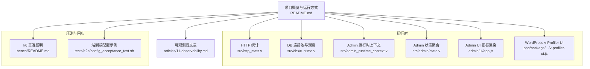
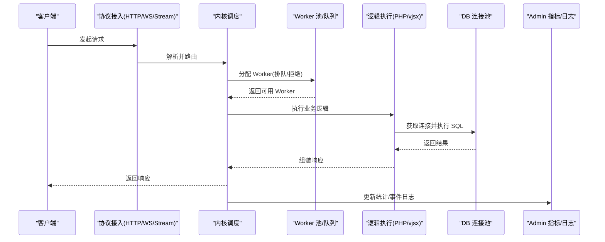
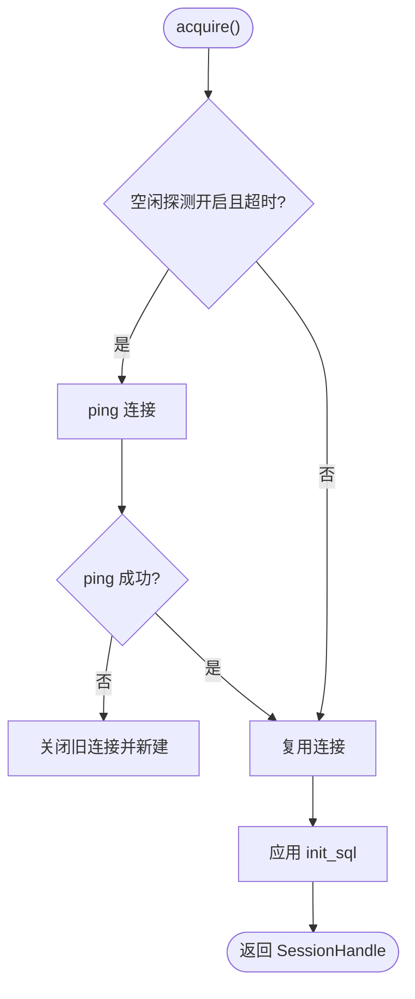
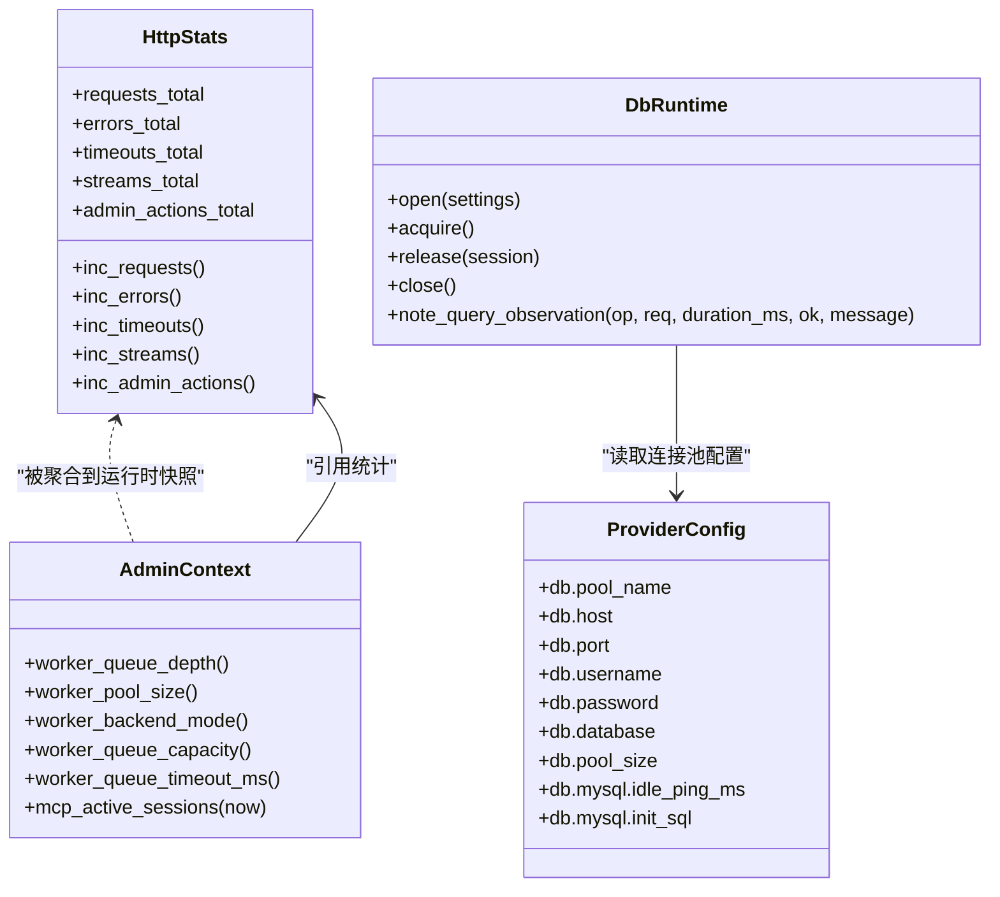

# 性能问题优化

<cite>
**本文引用的文件**   
- [README.md](file://README.md)
- [bench/README.md](file://bench/README.md)
- [src/http_stats.v](file://src/http_stats.v)
- [src/dbx/runtime.v](file://src/dbx/runtime.v)
- [articles/11-observability.md](file://articles/11-observability.md)
- [php/package/wordpress/v-profiler/v-profiler-ui.js](file://php/package/wordpress/v-profiler/v-profiler-ui.js)
- [admin/ui/app.js](file://admin/ui/app.js)
- [src/admin/state.v](file://src/admin/state.v)
- [src/admin_runtime_context.v](file://src/admin_runtime_context.v)
- [src/provider/config.v](file://src/provider/config.v)
- [tests/e2e/config_acceptance_test.sh](file://tests/e2e/config_acceptance_test.sh)
</cite>

## 目录
1. [引言](#引言)
2. [项目结构](#项目结构)
3. [核心组件](#核心组件)
4. [架构总览](#架构总览)
5. [详细组件分析](#详细组件分析)
6. [依赖关系分析](#依赖关系分析)
7. [性能考量与调优策略](#性能考量与调优策略)
8. [故障排查指南](#故障排查指南)
9. [结论](#结论)
10. [附录](#附录)

## 引言
本指南面向在生产环境中遇到 CPU 使用率过高、内存泄漏、响应时间延迟、并发处理能力不足等问题的工程师，提供系统化的定位与分析方法。内容覆盖：
- 运行时监控指标与工具（Admin 平面、事件日志、内置统计）
- 性能分析器与内存使用监控（v-Profiler）
- 连接池配置、线程池大小调整、缓存策略优化、数据库查询优化
- 负载测试与基准测试（k6）、瓶颈识别与回归检测实践

## 项目结构
vhttpd 作为协议与执行宿主，围绕 HTTP/WebSocket/流式传输、Worker 编排、上游集成与可观测性展开。与性能相关的关键位置包括：
- Admin 管理平面与运行时快照
- Worker 池与队列参数
- 数据库连接池实现
- 内置 HTTP 统计计数
- 压测脚本与回归流程

图表来源
- [README.md](file://README.md)
- [src/http_stats.v](file://src/http_stats.v)
- [src/dbx/runtime.v](file://src/dbx/runtime.v)
- [src/admin_runtime_context.v](file://src/admin_runtime_context.v)
- [src/admin/state.v](file://src/admin/state.v)
- [admin/ui/app.js](file://admin/ui/app.js)
- [php/package/wordpress/v-profiler/v-profiler-ui.js](file://php/package/wordpress/v-profiler/v-profiler-ui.js)
- [bench/README.md](file://bench/README.md)
- [tests/e2e/config_acceptance_test.sh](file://tests/e2e/config_acceptance_test.sh)
- [articles/11-observability.md](file://articles/11-observability.md)

章节来源
- [README.md](file://README.md)
- [bench/README.md](file://bench/README.md)

## 核心组件
- HTTP 请求统计：维护请求总数、错误数、超时数、流式请求数与管理动作计数，用于快速评估吞吐与健康度。
- DB 连接池与观察：封装 MySQL/PostgreSQL 连接池，记录慢查询、失败次数、最近查询明细，支持空闲探测与初始化 SQL。
- Admin 运行时上下文：暴露 worker 池容量、队列深度、后端模式、生命周期等关键指标。
- Admin 状态聚合：汇总活跃会话、管道、监听器、能力集与统计信息，供前端展示与外部抓取。
- Admin UI 指标面板：将运行时数据可视化，便于快速发现异常。
- WordPress v-Profiler：页面级性能剖析，包含耗时瀑布图、SQL 统计、缓存命中率、内存峰值、外部 HTTP 调用等。

章节来源
- [src/http_stats.v](file://src/http_stats.v)
- [src/dbx/runtime.v](file://src/dbx/runtime.v)
- [src/admin_runtime_context.v](file://src/admin_runtime_context.v)
- [src/admin/state.v](file://src/admin/state.v)
- [admin/ui/app.js](file://admin/ui/app.js)
- [php/package/wordpress/v-profiler/v-profiler-ui.js](file://php/package/wordpress/v-profiler/v-profiler-ui.js)

## 架构总览
从性能视角看，vhttpd 的“入站—调度—执行—出站”链路中，以下环节最易成为瓶颈：
- 入站与协议层：HTTP/WebSocket/流式处理
- 调度与 Worker 池：队列积压、可用 Worker 数量
- 执行侧：PHP Worker 或 vjsx 内嵌执行
- 资源访问：数据库连接池、外部 HTTP 调用
- 可观测性：指标采集、事件日志、性能剖析

图表来源
- [README.md](file://README.md)
- [src/http_stats.v](file://src/http_stats.v)
- [src/dbx/runtime.v](file://src/dbx/runtime.v)
- [src/admin_runtime_context.v](file://src/admin_runtime_context.v)
- [src/admin/state.v](file://src/admin/state.v)

## 详细组件分析

### HTTP 统计与可观测入口
- 统计字段：请求总数、错误数、超时数、流式请求数、管理动作数
- 用途：快速判断整体健康度、错误率与超时趋势
- 建议阈值：错误率突增、超时数上升需立即关注

章节来源
- [src/http_stats.v](file://src/http_stats.v)
- [articles/11-observability.md](file://articles/11-observability.md)

### 数据库连接池与慢查询观察
- 连接池：MySQL 基于通道预创建连接；PostgreSQL 使用官方库连接池
- 观察指标：总查询/执行次数、失败次数、慢查询计数、最近查询明细（含 SQL 文本、耗时、是否慢查询）
- 空闲探测：对 MySQL 连接在空闲超过阈值时 ping 并重建
- 初始化 SQL：每次获取连接后执行 init_sql，确保会话环境一致

图表来源
- [src/dbx/runtime.v](file://src/dbx/runtime.v)

章节来源
- [src/dbx/runtime.v](file://src/dbx/runtime.v)

### Admin 运行时上下文与状态聚合
- 暴露指标：worker 池大小、队列深度、队列容量、队列超时、后端模式、生命周期、MCP 会话数、WebSocket 活跃连接等
- 状态聚合：整合管道、监听器、能力集与活跃计数，形成统一快照

章节来源
- [src/admin_runtime_context.v](file://src/admin_runtime_context.v)
- [src/admin/state.v](file://src/admin/state.v)

### Admin UI 指标面板
- 展示 HTTP 请求总量、错误率、路由数量、WebSockets、运行时长等
- 通过 Admin API 拉取数据并渲染，辅助快速定位异常

章节来源
- [admin/ui/app.js](file://admin/ui/app.js)

### WordPress v-Profiler 性能剖析
- 功能：页面级耗时瀑布图、SQL 统计、缓存命中率、内存峰值、外部 HTTP 调用、安全与环境信息等
- 适用场景：定位 PHP 应用内部热点、慢查询、缓存未命中、外部依赖延迟

章节来源
- [php/package/wordpress/v-profiler/v-profiler-ui.js](file://php/package/wordpress/v-profiler/v-profiler-ui.js)

## 依赖关系分析
- Admin 上下文依赖引擎指标（worker 池、队列、后端模式）
- DB 运行时依赖 provider 配置（驱动、主机、端口、用户名、密码、数据库、池大小、空闲探测间隔、init_sql）
- Admin UI 依赖 Admin API 提供的运行时快照
- v-Profiler 依赖页面注入的性能数据

图表来源
- [src/http_stats.v](file://src/http_stats.v)
- [src/dbx/runtime.v](file://src/dbx/runtime.v)
- [src/admin_runtime_context.v](file://src/admin_runtime_context.v)
- [src/provider/config.v](file://src/provider/config.v)

章节来源
- [src/provider/config.v](file://src/provider/config.v)

## 性能考量与调优策略

### 一、CPU 使用率过高
- 现象：Worker 长期 busy、队列积压、错误率上升
- 定位：
  - 查看 Admin 运行时摘要中的 worker_available、worker_queue_length
  - 结合事件日志分析 http.request 与 worker.request 的耗时分布
- 调优：
  - 合理设置 worker pool_size（参考 CPU 核数 × 2）
  - 缩短 read_timeout_ms 避免长尾占用
  - 增加 queue_capacity 与 queue_timeout_ms 以缓冲突发流量
  - 针对热点路径进行代码级优化（减少锁竞争、避免阻塞 IO）

章节来源
- [articles/11-observability.md](file://articles/11-observability.md)
- [tests/e2e/config_acceptance_test.sh](file://tests/e2e/config_acceptance_test.sh)

### 二、内存泄漏
- 现象：进程内存持续增长、Worker 内存差异明显
- 定位：
  - 监控 /admin/runtime 的 memory_mb 与 /admin/workers 各 Worker 内存
  - 使用 v-Profiler 查看 peak_memory 与内存变化
- 调优：
  - 设置 max_requests 定期重启 Worker，释放累积内存
  - 优化 PHP 代码，减少大对象常驻内存
  - 检查第三方扩展与全局变量泄露

章节来源
- [articles/11-observability.md](file://articles/11-observability.md)
- [php/package/wordpress/v-profiler/v-profiler-ui.js](file://php/package/wordpress/v-profiler/v-profiler-ui.js)

### 三、响应时间延迟
- 现象：P95/P99 延迟升高、首字节时间变长
- 定位：
  - 使用 v-Profiler 的耗时瀑布图定位阶段瓶颈（启动、插件、SQL、外部 HTTP）
  - 关注 DB 慢查询与外部 HTTP 调用耗时
- 调优：
  - 优化 SQL（索引、分页、批量操作）
  - 引入缓存（对象缓存、页面缓存）
  - 合并或异步化外部 HTTP 调用
  - 调整 stream 模式与 chunk 大小以降低传输开销

章节来源
- [php/package/wordpress/v-profiler/v-profiler-ui.js](file://php/package/wordpress/v-profiler/v-profiler-ui.js)
- [bench/README.md](file://bench/README.md)

### 四、并发处理能力不足
- 现象：高并发下队列满、请求被拒、超时增多
- 定位：
  - 观察 worker_queue_length、worker_rejected_total
  - 结合 k6 压测结果分析 RPS 与延迟拐点
- 调优：
  - 增大 pool_size 与 queue_capacity
  - 调整 queue_timeout_ms 与 read_timeout_ms
  - 水平扩容多实例，配合负载均衡

章节来源
- [tests/e2e/config_acceptance_test.sh](file://tests/e2e/config_acceptance_test.sh)
- [bench/README.md](file://bench/README.md)

### 五、连接池配置优化
- 目标：降低连接建立开销、避免连接失效导致的重试风暴
- 建议：
  - 根据并发量与数据库承载能力设置 pool_size
  - 启用 idle_ping_ms 防止空闲连接被远端回收
  - 使用 init_sql 初始化会话参数（如字符集、时区）
  - 对 PostgreSQL 使用官方连接池，合理设置最大连接数

章节来源
- [src/dbx/runtime.v](file://src/dbx/runtime.v)
- [src/provider/config.v](file://src/provider/config.v)

### 六、线程池大小调整（vjsx）
- 目标：平衡 CPU 利用率与上下文切换开销
- 建议：
  - 根据 CPU 核数与任务类型（IO/CPU 密集）调整 thread_count
  - 观察 Admin 运行时快照中的活跃会话与队列深度，动态调优

章节来源
- [README.md](file://README.md)

### 七、缓存策略优化
- 目标：降低重复计算与 IO 压力
- 建议：
  - 启用对象缓存（Redis/Memcached），提高缓存命中率
  - 对静态资源启用 CDN 与浏览器缓存
  - 使用 v-Profiler 的 Cache 面板评估命中率与收益

章节来源
- [php/package/wordpress/v-profiler/v-profiler-ui.js](file://php/package/wordpress/v-profiler/v-profiler-ui.js)

### 八、数据库查询优化
- 目标：减少慢查询与全表扫描
- 建议：
  - 使用 EXPLAIN 分析执行计划，添加合适索引
  - 限制返回列与行数，避免 N+1 查询
  - 利用事务与批处理提升吞吐

章节来源
- [src/dbx/runtime.v](file://src/dbx/runtime.v)

### 九、负载测试与基准测试
- 短请求基准：使用 k6 对固定路径进行 RPS 与延迟测试
- 流式基准：SSE/text 模式下调节 tokens 与 interval_ms，评估传输开销与可扩展性
- 主机回归：一键构建、启动、压测、清理，验证生命周期与无残留进程

章节来源
- [bench/README.md](file://bench/README.md)

### 十、性能回归检测
- 基线：保存典型场景下的 k6 结果（RPS、P50/P95/P99、错误率）
- 门禁：CI 中自动执行回归脚本，对比阈值告警
- 根因：结合 Admin 指标与事件日志定位变更点

章节来源
- [bench/README.md](file://bench/README.md)

## 故障排查指南

### 常见症状与步骤
- Worker 无响应
  - 查看 /admin/workers 与事件日志中的 worker.error
  - 必要时重启单个或全部 Worker
- 上游连接频繁断开
  - 查看 /admin/runtime/upstreams/websocket 与 events
  - 校验网络与 Token 有效性
- MCP 会话无法创建
  - 查看 /admin/runtime/mcp 与会话状态
  - 检查 Worker 是否 busy 与错误日志
- 内存持续增长
  - 监控 /admin/runtime.memory_mb 与各 Worker 内存
  - 设置 max_requests 定期重启，优化代码

章节来源
- [articles/11-observability.md](file://articles/11-observability.md)

### 监控与告警
- 指标端点：/admin/runtime、/admin/stats、/admin/workers
- Prometheus 集成：/admin/metrics（按规划文档）
- 告警规则：Worker 池耗尽、队列积压、高错误率、上游断开、MCP 会话接近上限

章节来源
- [articles/11-observability.md](file://articles/11-observability.md)

## 结论
通过系统化的指标采集、性能剖析与压测回归，可以高效定位 CPU、内存、延迟与并发瓶颈。结合连接池与线程池调优、缓存与 SQL 优化，以及合理的超时与队列配置，能够在生产环境中显著提升稳定性与吞吐。

## 附录

### 关键配置项速查
- Worker 池：pool_size、max_requests、restart_backoff_ms、restart_backoff_max_ms
- 超时：read_timeout_ms（普通/AI 流式不同）
- 队列：queue_capacity、queue_timeout_ms、queue_poll_ms
- DB 池：pool_size、idle_ping_ms、init_sql
- vjsx：thread_count、runtime_profile

章节来源
- [README.md](file://README.md)
- [src/provider/config.v](file://src/provider/config.v)
- [tests/e2e/config_acceptance_test.sh](file://tests/e2e/config_acceptance_test.sh)