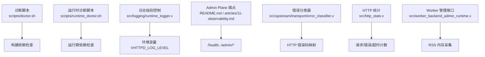
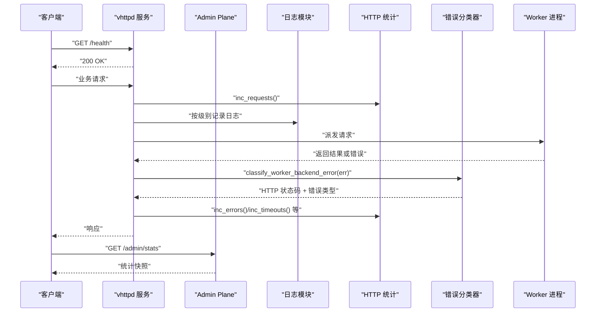
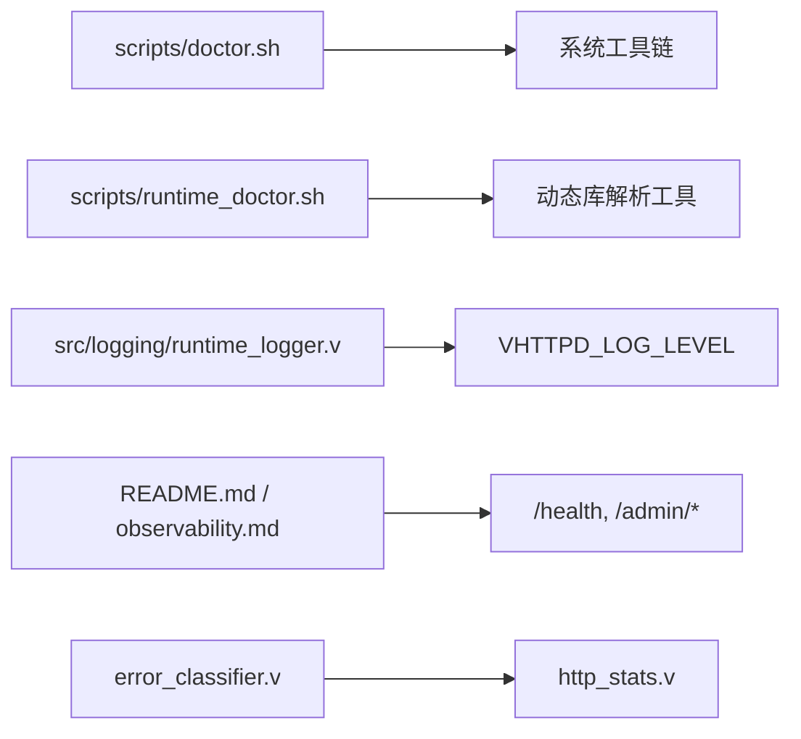

# 故障排除指南

<cite>
**本文引用的文件**   
- [scripts/doctor.sh](file://scripts/doctor.sh)
- [scripts/runtime_doctor.sh](file://scripts/runtime_doctor.sh)
- [src/logging/runtime_logger.v](file://src/logging/runtime_logger.v)
- [README.md](file://README.md)
- [articles/11-observability.md](file://articles/11-observability.md)
- [src/upstream/transport/error_classifier.v](file://src/upstream/transport/error_classifier.v)
- [src/http_stats.v](file://src/http_stats.v)
- [src/worker_backend_admin_runtime.v](file://src/worker_backend_admin_runtime.v)
</cite>

## 目录
1. [简介](#简介)
2. [项目结构](#项目结构)
3. [核心组件](#核心组件)
4. [架构总览](#架构总览)
5. [详细组件分析](#详细组件分析)
6. [依赖关系分析](#依赖关系分析)
7. [性能注意事项](#性能注意事项)
8. [故障排除指南](#故障排除指南)
9. [结论](#结论)
10. [附录](#附录)

## 简介
本指南面向生产与运维人员，聚焦 vhttpd 的常见故障场景与系统化排查方法。内容覆盖：
- 启动失败、配置错误、性能问题、网络连接异常等典型问题
- 系统健康检查工具与脚本（如 doctor.sh、runtime_doctor.sh）的使用方法
- 日志分析与调试技巧（日志级别、关键日志识别、性能瓶颈定位）
- 内存泄漏检测、CPU 使用率分析、磁盘空间监控等系统级问题
- 网络连通性测试、端口占用检查、依赖服务状态验证等基础设施层面的步骤

## 项目结构
围绕“可观测性与排障”的关键位置包括：
- 诊断脚本：scripts/doctor.sh、scripts/runtime_doctor.sh
- 运行时日志与级别控制：src/logging/runtime_logger.v
- Admin Plane 端点与健康检查：README.md、articles/11-observability.md
- 错误分类与统计：src/upstream/transport/error_classifier.v、src/http_stats.v
- Worker 进程指标采集：src/worker_backend_admin_runtime.v

图表来源
- [scripts/doctor.sh:1-108](file://scripts/doctor.sh#L1-L108)
- [scripts/runtime_doctor.sh:1-126](file://scripts/runtime_doctor.sh#L1-L126)
- [src/logging/runtime_logger.v:1-42](file://src/logging/runtime_logger.v#L1-L42)
- [README.md:1090-1289](file://README.md#L1090-L1289)
- [articles/11-observability.md:1-177](file://articles/11-observability.md#L1-L177)
- [src/upstream/transport/error_classifier.v:1-19](file://src/upstream/transport/error_classifier.v#L1-L19)
- [src/http_stats.v:1-32](file://src/http_stats.v#L1-L32)
- [src/worker_backend_admin_runtime.v:1-40](file://src/worker_backend_admin_runtime.v#L1-L40)

章节来源
- [scripts/doctor.sh:1-108](file://scripts/doctor.sh#L1-L108)
- [scripts/runtime_doctor.sh:1-126](file://scripts/runtime_doctor.sh#L1-L126)
- [src/logging/runtime_logger.v:1-42](file://src/logging/runtime_logger.v#L1-L42)
- [README.md:1090-1289](file://README.md#L1090-L1289)
- [articles/11-observability.md:1-177](file://articles/11-observability.md#L1-L177)
- [src/upstream/transport/error_classifier.v:1-19](file://src/upstream/transport/error_classifier.v#L1-L19)
- [src/http_stats.v:1-32](file://src/http_stats.v#L1-L32)
- [src/worker_backend_admin_runtime.v:1-40](file://src/worker_backend_admin_runtime.v#L1-L40)

## 核心组件
- 诊断脚本
  - 构建期环境检查：编译器、pkg-config、OpenSSL、BDW-GC、QuickJS、sqlite3、MySQL/MariaDB/PostgreSQL 客户端工具等
  - 运行期二进制依赖检查：Linux ldd、macOS otool、sqlite3、数据库客户端工具、VJSX 资源嵌入情况
- 日志子系统
  - 通过环境变量 VHTTPD_LOG_LEVEL 控制日志级别；默认在 prod 与非 prod 下不同
- Admin Plane 与可观测性
  - /health 健康检查、/admin/workers、/admin/stats、/admin/runtime 等端点用于运行时观测与管理
- 错误分类与统计
  - 将后端错误消息分类为 HTTP 状态码与错误类型，便于上层统一处理与告警
  - 维护全局 HTTP 请求/错误/超时/流式响应/管理动作计数
- Worker 进程指标
  - 暴露 worker 存活、队列长度、已服务请求数、重启次数、RSS 内存等

章节来源
- [scripts/doctor.sh:1-108](file://scripts/doctor.sh#L1-L108)
- [scripts/runtime_doctor.sh:1-126](file://scripts/runtime_doctor.sh#L1-L126)
- [src/logging/runtime_logger.v:1-42](file://src/logging/runtime_logger.v#L1-L42)
- [README.md:1090-1289](file://README.md#L1090-L1289)
- [articles/11-observability.md:1-177](file://articles/11-observability.md#L1-L177)
- [src/upstream/transport/error_classifier.v:1-19](file://src/upstream/transport/error_classifier.v#L1-L19)
- [src/http_stats.v:1-32](file://src/http_stats.v#L1-L32)
- [src/worker_backend_admin_runtime.v:1-40](file://src/worker_backend_admin_runtime.v#L1-L40)

## 架构总览
下图展示了从外部调用到内部统计与诊断的整体路径，以及健康检查与错误分类的位置。

图表来源
- [README.md:1090-1289](file://README.md#L1090-L1289)
- [src/logging/runtime_logger.v:1-42](file://src/logging/runtime_logger.v#L1-L42)
- [src/http_stats.v:1-32](file://src/http_stats.v#L1-L32)
- [src/upstream/transport/error_classifier.v:1-19](file://src/upstream/transport/error_classifier.v#L1-L19)

## 详细组件分析

### 诊断脚本：构建期与环境检查
- 功能要点
  - 检查 v、pkg-config、openssl、bdw-gc 等编译依赖
  - 检查 vjsx 构建模块与 QuickJS 源码是否就绪
  - 检查 sqlite3、mysql_config/mariadb_config、pg_config 等可选依赖
  - 输出 ok/warn/bad 三类信息并设置退出码
- 适用场景
  - 首次安装、CI 构建前校验、升级后回归检查

章节来源
- [scripts/doctor.sh:1-108](file://scripts/doctor.sh#L1-L108)

### 诊断脚本：运行期依赖检查
- 功能要点
  - 校验二进制存在与可执行位
  - Linux 使用 ldd、macOS 使用 otool 解析动态库依赖并判断缺失
  - 检查 sqlite3、mysql_config/mariadb_config、pg_config 是否存在
  - 检查 VJSX 资源是否内嵌或受 VJSX_ASSET_ROOT 覆盖
- 适用场景
  - 部署后快速自检、容器镜像完整性验证、跨平台迁移验证

章节来源
- [scripts/runtime_doctor.sh:1-126](file://scripts/runtime_doctor.sh#L1-L126)

### 日志级别与配置
- 行为说明
  - 支持 debug/info/warn/error/fatal 级别
  - 通过环境变量 VHTTPD_LOG_LEVEL 覆盖默认级别
  - 非 prod 默认 info，prod 默认 warn
- 排障建议
  - 临时提升为 debug 以捕获更多上下文
  - 结合 Admin Plane 事件日志进行关联分析

章节来源
- [src/logging/runtime_logger.v:1-42](file://src/logging/runtime_logger.v#L1-L42)

### Admin Plane 健康检查与运行时观测
- 健康检查
  - GET /health 返回 200 OK，适合探针与负载均衡健康检查
- 运行时观测
  - GET /admin/workers：Worker 池状态、存活、队列、重启计数
  - GET /admin/stats：进程级计数器（请求、错误、超时、流式、管理动作等）
  - GET /admin/runtime：能力标志、活跃连接/会话、队列容量与深度等
- 认证模型
  - 当启用 admin token 时，需携带 x-vhttpd-admin-token 或通过查询参数传递
- 端口策略
  - admin 独立端口时，数据平面 /admin/* 返回 404；未启用时数据平面提供 /admin/*

章节来源
- [README.md:1090-1289](file://README.md#L1090-L1289)
- [articles/11-observability.md:1-177](file://articles/11-observability.md#L1-L177)

### 错误分类与统计
- 错误分类
  - 根据后端错误消息关键词映射为 HTTP 状态码与错误类型（如 worker_pool_exhausted、worker_queue_full、worker_queue_timeout、timeout、transport_error）
- 统计项
  - requests_total、errors_total、timeouts_total、streams_total、admin_actions_total
- 应用价值
  - 统一错误语义，便于告警规则与仪表盘展示

章节来源
- [src/upstream/transport/error_classifier.v:1-19](file://src/upstream/transport/error_classifier.v#L1-L19)
- [src/http_stats.v:1-32](file://src/http_stats.v#L1-L32)

### Worker 进程指标采集
- 指标范围
  - id、socket、alive、pid、rss_kb、draining、inflight_requests、served_requests、restart_count、next_retry_ts
- 实现方式
  - 通过 ps -o rss= -p <pid> 获取 RSS（KB），兼容 macOS/Linux
- 使用建议
  - 结合 /admin/workers 与 /admin/stats 观察内存与负载趋势

章节来源
- [src/worker_backend_admin_runtime.v:1-40](file://src/worker_backend_admin_runtime.v#L1-L40)

## 依赖关系分析
- 脚本与系统工具
  - doctor.sh 依赖 v、pkg-config、openssl、bdw-gc、sqlite3、mysql_config/mariadb_config、pg_config
  - runtime_doctor.sh 依赖 ldd/otool、sqlite3、数据库客户端工具
- 运行时与 Admin Plane
  - 日志模块由环境变量驱动
  - Admin Plane 提供健康与统计端点，供外部监控系统拉取
- 错误分类与统计
  - 上游传输层错误经分类器归一化，统计模块聚合计数

图表来源
- [scripts/doctor.sh:1-108](file://scripts/doctor.sh#L1-L108)
- [scripts/runtime_doctor.sh:1-126](file://scripts/runtime_doctor.sh#L1-L126)
- [src/logging/runtime_logger.v:1-42](file://src/logging/runtime_logger.v#L1-L42)
- [README.md:1090-1289](file://README.md#L1090-L1289)
- [articles/11-observability.md:1-177](file://articles/11-observability.md#L1-L177)
- [src/upstream/transport/error_classifier.v:1-19](file://src/upstream/transport/error_classifier.v#L1-L19)
- [src/http_stats.v:1-32](file://src/http_stats.v#L1-L32)

## 性能注意事项
- 关注队列深度与拒绝计数
  - 通过 /admin/stats 中的 worker_queue_* 相关计数判断拥塞
- 关注 Worker 内存增长
  - 结合 /admin/workers 中 memory_mb 与 RSS 变化评估是否需要限流或重启
- 关注超时与错误比例
  - 通过 timeouts_total、errors_total 与 p95/p99 延迟指标联动分析

[本节为通用指导，不直接分析具体文件]

## 故障排除指南

### 1. 启动失败
- 可能原因
  - 构建依赖缺失（v、pkg-config、openssl、bdw-gc、QuickJS 等）
  - 运行期动态库缺失（ldd/otool 报告 not found）
  - 数据库客户端工具缺失导致某些功能不可用
- 诊断步骤
  - 运行构建期诊断脚本，确认依赖齐全
  - 运行运行期诊断脚本，检查二进制依赖与资源嵌入
  - 若提示缺少 sqlite3/mysql_config/pg_config，按需安装对应开发包
- 参考命令
  - 构建期：scripts/doctor.sh
  - 运行期：scripts/runtime_doctor.sh ./vhttpd

章节来源
- [scripts/doctor.sh:1-108](file://scripts/doctor.sh#L1-L108)
- [scripts/runtime_doctor.sh:1-126](file://scripts/runtime_doctor.sh#L1-L126)

### 2. 配置错误
- 常见问题
  - Admin 端口与数据平面端口冲突或未正确分离
  - 未设置 admin token 导致权限问题
  - 环境变量 VHTTPD_LOG_LEVEL 设置无效
- 诊断步骤
  - 核对 README 中端口与认证模型说明
  - 使用 /health 与 /admin/workers 验证服务可达性与鉴权
  - 调整 VHTTPD_LOG_LEVEL 并复现问题，观察日志级别是否生效
- 参考端点
  - GET /health
  - GET /admin/workers
  - GET /admin/stats
  - GET /admin/runtime

章节来源
- [README.md:1090-1289](file://README.md#L1090-L1289)
- [src/logging/runtime_logger.v:1-42](file://src/logging/runtime_logger.v#L1-L42)

### 3. 性能问题（高延迟、吞吐下降）
- 现象
  - p95/p99 延迟升高、队列深度增加、错误/超时增多
- 诊断步骤
  - 查看 /admin/stats 的 rate_1m/rate_5m、latency_ms 分位数
  - 查看 /admin/workers 的 inflight_requests、served_requests、memory_mb
  - 结合事件日志分析热点路径与慢请求
- 优化建议
  - 合理设置 worker pool_size、queue_capacity、queue_timeout_ms
  - 针对长耗时任务调大 read_timeout_ms
  - 对 AI 流式场景单独配置超时与队列参数

章节来源
- [articles/11-observability.md:1-177](file://articles/11-observability.md#L1-L177)
- [README.md:1090-1289](file://README.md#L1090-L1289)

### 4. 网络连接异常（上游频繁断开、重连）
- 现象
  - WebSocket 上游不断重连、消息收发异常
- 诊断步骤
  - 查看 /admin/runtime/upstreams/websocket 的连接状态与事件
  - 测试上游服务连通性（例如 Ollama 本地 API）
  - 检查 Token 有效期与证书配置
- 参考命令
  - curl 访问上游示例 API 验证连通性

章节来源
- [articles/11-observability.md:1-177](file://articles/11-observability.md#L1-L177)

### 5. 内存泄漏检测与 CPU 使用率分析
- 内存泄漏检测
  - 持续观察 /admin/workers 中 memory_mb 与 RSS 变化
  - 结合 /admin/stats 的 restart_count 与 served_requests 评估是否需限制 max_requests
- CPU 使用率分析
  - 使用系统工具（top、htop、perf、pprof 等）定位热点函数
  - 结合 Admin Plane 的速率与延迟指标缩小问题范围
- 磁盘空间监控
  - 监控日志与事件文件体积，避免磁盘写满导致服务异常

章节来源
- [src/worker_backend_admin_runtime.v:1-40](file://src/worker_backend_admin_runtime.v#L1-L40)
- [README.md:1090-1289](file://README.md#L1090-L1289)

### 6. 网络连通性测试、端口占用检查、依赖服务状态验证
- 连通性测试
  - 使用 curl 访问 /health 与业务端点
  - 使用 --noproxy '*' 绕过代理进行本地冒烟测试
- 端口占用检查
  - 使用 ss/netstat/lsof 检查监听端口是否被占用
- 依赖服务状态验证
  - 数据库：mysql_config/mariadb_config/pg_config 可用性与连通性
  - 上游服务：Ollama、飞书回调地址等

章节来源
- [README.md:1090-1289](file://README.md#L1090-L1289)
- [scripts/doctor.sh:1-108](file://scripts/doctor.sh#L1-L108)
- [scripts/runtime_doctor.sh:1-126](file://scripts/runtime_doctor.sh#L1-L126)

### 7. 日志分析与调试技巧
- 日志级别配置
  - 通过 VHTTPD_LOG_LEVEL 设置为 debug 以捕获更详细信息
- 关键日志识别
  - 关注 error、timeout、upstream.*、worker.* 等事件
- 性能瓶颈定位
  - 结合 /admin/stats 的分位数延迟与错误分类，定位是队列拥塞还是上游慢
- 事件日志分析
  - 使用 jq 过滤与聚合 NDJSON 事件，提取慢请求与错误分布

章节来源
- [src/logging/runtime_logger.v:1-42](file://src/logging/runtime_logger.v#L1-L42)
- [articles/11-observability.md:1-177](file://articles/11-observability.md#L1-L177)

### 8. 错误分类与统一处理
- 错误分类映射
  - worker_pool_exhausted、worker_queue_full、worker_queue_timeout、timeout、transport_error
- 处理建议
  - 对 503 类错误实施退避重试与熔断
  - 对 504 超时错误调整超时阈值或扩容 Worker
  - 对 transport_error 检查底层网络与依赖服务

章节来源
- [src/upstream/transport/error_classifier.v:1-19](file://src/upstream/transport/error_classifier.v#L1-L19)

## 结论
通过内置的诊断脚本、Admin Plane 端点、日志与错误分类机制，vhttpd 提供了完善的排障基础。建议在生产环境中：
- 定期运行 doctor.sh 与 runtime_doctor.sh 进行环境与依赖巡检
- 基于 /health 与 /admin/* 建立监控与告警
- 结合事件日志与错误分类进行根因定位
- 对内存与 CPU 进行常态化监控，配合合理的 Worker 与队列参数调优

[本节为总结性内容，不直接分析具体文件]

## 附录

### 常用命令速查
- 健康检查
  - curl http://127.0.0.1:<data_port>/health
- Admin 观测
  - curl -H 'x-vhttpd-admin-token: xxx' http://127.0.0.1:<admin_port>/admin/workers
  - curl -H 'x-vhttpd-admin-token: xxx' http://127.0.0.1:<admin_port>/admin/stats
  - curl -H 'x-vhttpd-admin-token: xxx' http://127.0.0.1:<admin_port>/admin/runtime
- 事件日志分析
  - tail -f /var/log/vhttpd/events.ndjson | jq .
  - cat /var/log/vhttpd/events.ndjson | jq 'select(.kind == "error")' | wc -l

章节来源
- [README.md:1090-1289](file://README.md#L1090-L1289)
- [articles/11-observability.md:1-177](file://articles/11-observability.md#L1-L177)