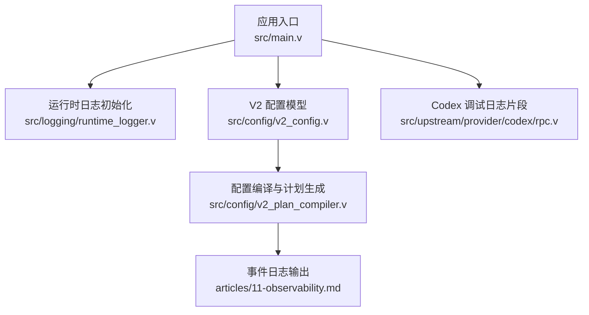
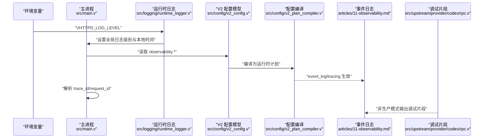
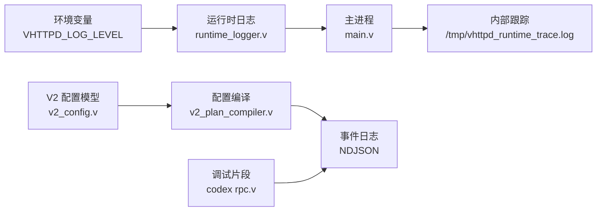

# 日志分析和调试

<cite>
**本文引用的文件**   
- [src/logging/runtime_logger.v](file://src/logging/runtime_logger.v)
- [src/config/v2_config.v](file://src/config/v2_config.v)
- [src/config/v2_plan_compiler.v](file://src/config/v2_plan_compiler.v)
- [config/vhttpd.example.toml](file://config/vhttpd.example.toml)
- [tests/e2e/config_acceptance_test.sh](file://tests/e2e/config_acceptance_test.sh)
- [articles/11-observability.md](file://articles/11-observability.md)
- [README.md](file://README.md)
- [deploy/systemd/vhttpd@.service](file://deploy/systemd/vhttpd@.service)
- [deploy/launchd/io.guweigang.vhttpd.plist](file://deploy/launchd/io.guweigang.vhttpd.plist)
- [src/main.v](file://src/main.v)
- [src/upstream/provider/codex/rpc.v](file://src/upstream/provider/codex/rpc.v)
</cite>

## 目录
1. [简介](#简介)
2. [项目结构](#项目结构)
3. [核心组件](#核心组件)
4. [架构总览](#架构总览)
5. [详细组件分析](#详细组件分析)
6. [依赖关系分析](#依赖关系分析)
7. [性能与可观测性](#性能与可观测性)
8. [故障排查指南](#故障排查指南)
9. [结论](#结论)
10. [附录](#附录)

## 简介
本指南面向 vhttpd 的日志分析与调试，覆盖以下主题：
- 日志级别配置与环境变量控制
- 结构化事件日志（NDJSON）输出与字段说明
- 请求链路追踪（trace_id、request_id）
- 错误堆栈与调试片段输出
- 性能指标与 Prometheus 集成
- 日志轮转策略与生产运维建议
- 常用日志过滤与分析命令
- 与 ELK Stack、Prometheus + Grafana 的集成思路

## 项目结构
vhttpd 的可观测性与日志相关能力分布在如下位置：
- 运行时日志初始化与级别解析：src/logging/runtime_logger.v
- V2 配置模型（含 observability.tracing 等）：src/config/v2_config.v
- 配置编译与计划生成（将 observability 注入运行期）：src/config/v2_plan_compiler.v
- 示例配置中的 event_log 路径：config/vhttpd.example.toml
- 端到端测试中大量使用 event_log 进行断言：tests/e2e/config_acceptance_test.sh
- 可观测性文档（日志类型、分析命令、Prometheus 集成、日志轮转）：articles/11-observability.md
- README 中对日志级别的说明：README.md
- systemd/launchd 部署模板中的环境变量设置：deploy/systemd/vhttpd@.service、deploy/launchd/io.guweigang.vhttpd.plist
- 主进程对 trace_id/request_id 的解析与内部跟踪：src/main.v
- Codex 模块的调试日志片段输出：src/upstream/provider/codex/rpc.v

图表来源
- [src/main.v:1-117](file://src/main.v#L1-L117)
- [src/logging/runtime_logger.v:1-42](file://src/logging/runtime_logger.v#L1-L42)
- [src/config/v2_config.v:59-72](file://src/config/v2_config.v#L59-L72)
- [src/config/v2_plan_compiler.v:182-203](file://src/config/v2_plan_compiler.v#L182-L203)
- [articles/11-observability.md:333-371](file://articles/11-observability.md#L333-L371)
- [src/upstream/provider/codex/rpc.v:275-281](file://src/upstream/provider/codex/rpc.v#L275-L281)

章节来源
- [src/logging/runtime_logger.v:1-42](file://src/logging/runtime_logger.v#L1-L42)
- [src/config/v2_config.v:59-72](file://src/config/v2_config.v#L59-L72)
- [src/config/v2_plan_compiler.v:182-203](file://src/config/v2_plan_compiler.v#L182-L203)
- [config/vhttpd.example.toml:1-67](file://config/vhttpd.example.toml#L1-L67)
- [tests/e2e/config_acceptance_test.sh:507-542](file://tests/e2e/config_acceptance_test.sh#L507-L542)
- [articles/11-observability.md:333-371](file://articles/11-observability.md#L333-L371)
- [README.md:270](file://README.md#L270)
- [deploy/systemd/vhttpd@.service:12](file://deploy/systemd/vhttpd@.service#L12)
- [deploy/launchd/io.guweigang.vhttpd.plist:18](file://deploy/launchd/io.guweigang.vhttpd.plist#L18)
- [src/main.v:25-56](file://src/main.v#L25-L56)
- [src/upstream/provider/codex/rpc.v:275-281](file://src/upstream/provider/codex/rpc.v#L275-L281)

## 核心组件
- 运行时日志初始化与级别控制
  - 通过环境变量 VHTTPD_LOG_LEVEL 控制全局日志级别，支持 debug|info|warn|error|fatal；未设置时按构建模式选择默认级别。
  - 初始化时将本地时间启用并替换全局 logger。
- V2 可观测性配置
  - observability.event_log：事件日志输出路径（NDJSON）。
  - observability.log_level：V2 配置中的日志级别（与 VHTTPD_LOG_LEVEL 共同作用）。
  - observability.tracing：分布式追踪开关、导出器、端点与采样率。
- 配置编译与计划生成
  - 将 observability 配置注入到运行时计划，供后续子系统消费。
- 事件日志与日志类型
  - 文档定义了 http.request、worker.*、upstream.*、error、mcp.session.* 等事件类型及常用分析命令。
- 请求链路追踪
  - 主进程从查询参数或请求头解析 trace_id 与 request_id，并在内部跟踪中写入 /tmp/vhttpd_runtime_trace.log。
- 调试辅助
  - Codex 模块在非生产模式下输出带标签的调试片段，便于定位问题。

章节来源
- [src/logging/runtime_logger.v:8-41](file://src/logging/runtime_logger.v#L8-L41)
- [src/config/v2_config.v:59-72](file://src/config/v2_config.v#L59-L72)
- [src/config/v2_plan_compiler.v:182-203](file://src/config/v2_plan_compiler.v#L182-L203)
- [articles/11-observability.md:333-371](file://articles/11-observability.md#L333-L371)
- [src/main.v:25-56](file://src/main.v#L25-L56)
- [src/upstream/provider/codex/rpc.v:275-281](file://src/upstream/provider/codex/rpc.v#L275-L281)

## 架构总览
下图展示了日志与可观测性在启动与运行期的关键交互：

图表来源
- [src/logging/runtime_logger.v:27-41](file://src/logging/runtime_logger.v#L27-L41)
- [src/config/v2_config.v:59-72](file://src/config/v2_config.v#L59-L72)
- [src/config/v2_plan_compiler.v:182-203](file://src/config/v2_plan_compiler.v#L182-L203)
- [src/main.v:40-56](file://src/main.v#L40-L56)
- [src/upstream/provider/codex/rpc.v:275-281](file://src/upstream/provider/codex/rpc.v#L275-L281)
- [articles/11-observability.md:333-371](file://articles/11-observability.md#L333-L371)

## 详细组件分析

### 日志级别与格式
- 级别来源优先级
  - 环境变量 VHTTPD_LOG_LEVEL 优先于默认级别；默认级别由构建模式决定（prod 下更严格）。
  - V2 配置项 observability.log_level 提供声明式配置，最终由编译阶段注入运行期。
- 格式与时间
  - 运行时初始化启用本地时间戳；事件日志采用 NDJSON 单行 JSON 格式，便于流式处理与聚合。
- 参考实现与示例
  - 运行时日志初始化与级别解析：[src/logging/runtime_logger.v:8-41](file://src/logging/runtime_logger.v#L8-L41)
  - V2 配置模型（observability.log_level）：[src/config/v2_config.v:59-72](file://src/config/v2_config.v#L59-L72)
  - 配置编译注入：[src/config/v2_plan_compiler.v:182-203](file://src/config/v2_plan_compiler.v#L182-L203)
  - 示例配置中的 event_log 路径：[config/vhttpd.example.toml:12-15](file://config/vhttpd.example.toml#L12-L15)
  - README 对日志级别的说明：[README.md:270](file://README.md#L270)

章节来源
- [src/logging/runtime_logger.v:8-41](file://src/logging/runtime_logger.v#L8-L41)
- [src/config/v2_config.v:59-72](file://src/config/v2_config.v#L59-L72)
- [src/config/v2_plan_compiler.v:182-203](file://src/config/v2_plan_compiler.v#L182-L203)
- [config/vhttpd.example.toml:12-15](file://config/vhttpd.example.toml#L12-L15)
- [README.md:270](file://README.md#L270)

### 事件日志与日志类型
- 事件日志路径
  - 通过 observability.event_log 指定输出文件，常见为 .ndjson 后缀。
  - 示例与测试中广泛使用该字段进行断言与验证。
- 日志类型与关键字段
  - 文档定义了多种 kind（如 http.request、worker.*、upstream.*、error、mcp.session.*），并提供常用 jq 分析命令。
- 参考实现与示例
  - 事件日志类型与分析命令：[articles/11-observability.md:333-371](file://articles/11-observability.md#L333-L371)
  - 测试用例中 event_log 的使用：[tests/e2e/config_acceptance_test.sh:507-542](file://tests/e2e/config_acceptance_test.sh#L507-L542)

章节来源
- [articles/11-observability.md:333-371](file://articles/11-observability.md#L333-L371)
- [tests/e2e/config_acceptance_test.sh:507-542](file://tests/e2e/config_acceptance_test.sh#L507-L542)

### 请求链路追踪（trace_id、request_id）
- 解析来源
  - 优先从查询参数获取，其次从请求头 x-trace-id/x-request-id 获取，最后回退到上下文或自动生成。
- 内部跟踪
  - 主进程将关键事件追加写入 /tmp/vhttpd_runtime_trace.log，便于快速定位系统级事件。
- 参考实现
  - 主进程解析逻辑与内部跟踪：[src/main.v:25-56](file://src/main.v#L25-L56)

章节来源
- [src/main.v:25-56](file://src/main.v#L25-L56)

### 错误堆栈与调试片段
- 调试片段输出
  - Codex 模块在非生产模式下输出带标签的调试片段，限制长度以避免过大日志。
- 参考实现
  - 调试片段输出函数：[src/upstream/provider/codex/rpc.v:275-281](file://src/upstream/provider/codex/rpc.v#L275-L281)

章节来源
- [src/upstream/provider/codex/rpc.v:275-281](file://src/upstream/provider/codex/rpc.v#L275-L281)

### 分布式追踪（Tracing）
- 配置项
  - observability.tracing.enabled/exporter/endpoint/sample_rate 用于开启与配置追踪导出。
- 参考实现
  - V2 配置模型与编译注入：[src/config/v2_config.v:66-72](file://src/config/v2_config.v#L66-L72)、[src/config/v2_plan_compiler.v:182-203](file://src/config/v2_plan_compiler.v#L182-L203)

章节来源
- [src/config/v2_config.v:66-72](file://src/config/v2_config.v#L66-L72)
- [src/config/v2_plan_compiler.v:182-203](file://src/config/v2_plan_compiler.v#L182-L203)

### 日志轮转策略
- 推荐方案
  - 使用 logrotate 按日切割，保留压缩归档，并通过信号通知进程重新打开日志文件。
- 参考文档
  - 日志轮转与归档策略说明：[articles/11-observability.md:436-466](file://articles/11-observability.md#L436-L466)

章节来源
- [articles/11-observability.md:436-466](file://articles/11-observability.md#L436-L466)

### 监控平台集成（Prometheus + Grafana）
- 指标端点
  - 通过 Admin API 暴露 /admin/metrics，以 Prometheus text format 输出。
- 抓取配置
  - 在 prometheus.yml 中配置 job_name、metrics_path 与认证头。
- 参考文档
  - Prometheus 集成与自定义 Metrics 说明：[articles/11-observability.md:406-433](file://articles/11-observability.md#L406-L433)

章节来源
- [articles/11-observability.md:406-433](file://articles/11-observability.md#L406-L433)

### 开发调试技巧
- 实时查看与过滤
  - 使用 tail -f 与 jq 组合进行实时查看与过滤。
- 异常模式识别
  - 基于 kind 与字段进行筛选，例如统计 error 数量、分析慢请求等。
- 断点与调试
  - 结合 trace_id/request_id 关联多组件日志；利用 Codex 调试片段快速定位问题。
- 参考文档
  - 日志分析命令与调试建议：[articles/11-observability.md:349-371](file://articles/11-observability.md#L349-L371)

章节来源
- [articles/11-observability.md:349-371](file://articles/11-observability.md#L349-L371)

## 依赖关系分析
- 组件耦合
  - 运行时日志初始化依赖环境变量与构建模式；V2 配置模型被编译为运行时计划；主进程负责链路追踪与内部跟踪。
- 外部依赖
  - 事件日志输出为 NDJSON，便于外部工具（jq、ELK、Fluent Bit 等）采集；Prometheus 通过 HTTP 抓取指标。
- 潜在风险
  - 高并发场景下需关注 event_log 写入性能与磁盘 I/O；建议配合 logrotate 与异步采集。

图表来源
- [src/logging/runtime_logger.v:27-41](file://src/logging/runtime_logger.v#L27-L41)
- [src/config/v2_config.v:59-72](file://src/config/v2_config.v#L59-L72)
- [src/config/v2_plan_compiler.v:182-203](file://src/config/v2_plan_compiler.v#L182-L203)
- [src/main.v:25-56](file://src/main.v#L25-L56)
- [src/upstream/provider/codex/rpc.v:275-281](file://src/upstream/provider/codex/rpc.v#L275-L281)

章节来源
- [src/logging/runtime_logger.v:27-41](file://src/logging/runtime_logger.v#L27-L41)
- [src/config/v2_config.v:59-72](file://src/config/v2_config.v#L59-L72)
- [src/config/v2_plan_compiler.v:182-203](file://src/config/v2_plan_compiler.v#L182-L203)
- [src/main.v:25-56](file://src/main.v#L25-L56)
- [src/upstream/provider/codex/rpc.v:275-281](file://src/upstream/provider/codex/rpc.v#L275-L281)

## 性能与可观测性
- 日志级别对性能的影响
  - 在高负载环境下建议使用 warn/error 级别以减少 I/O 开销；仅在必要时临时提升为 info/debug。
- 事件日志写入
  - 建议将 event_log 置于高性能磁盘，并结合 logrotate 与异步采集工具降低主进程压力。
- 追踪采样
  - 合理设置 tracing.sample_rate，避免全量采样导致额外开销。
- 指标抓取
  - 调整 Prometheus scrape_interval 与超时，避免频繁抓取影响服务稳定性。

## 故障排查指南
- 常见问题
  - 日志级别不生效：检查环境变量 VHTTPD_LOG_LEVEL 与 V2 配置 observability.log_level 的优先级。
  - 事件日志为空：确认 observability.event_log 路径权限与写入状态。
  - 无法解析 trace_id：检查请求头或查询参数是否携带正确标识。
  - 调试片段缺失：确认当前为非生产模式。
- 实用命令
  - 实时查看与过滤：tail -f events.ndjson | jq 'select(.kind == "error")'
  - 统计错误数量：cat events.ndjson | jq 'select(.kind == "error")' | wc -l
  - 分析慢请求：cat events.ndjson | jq 'select(.kind == "http.request" and .duration_ms > 100)'
- 参考文档
  - 日志分析命令与调试建议：[articles/11-observability.md:349-371](file://articles/11-observability.md#L349-L371)

章节来源
- [articles/11-observability.md:349-371](file://articles/11-observability.md#L349-L371)

## 结论
vhttpd 提供了完善的日志与可观测性能力：通过环境变量与 V2 配置灵活控制日志级别，输出结构化事件日志，支持分布式追踪与 Prometheus 指标抓取。结合 logrotate 与外部采集工具，可在生产环境实现高效、可靠的日志管理与问题定位。

## 附录
- 部署模板中的环境变量设置
  - systemd 模板默认设置 VHTTPD_LOG_LEVEL=info：[deploy/systemd/vhttpd@.service:12](file://deploy/systemd/vhttpd@.service#L12)
  - launchd plist 包含 VHTTPD_LOG_LEVEL 键值：[deploy/launchd/io.guweigang.vhttpd.plist:18](file://deploy/launchd/io.guweigang.vhttpd.plist#L18)
- 示例配置中的 event_log 路径
  - 示例配置文件：[config/vhttpd.example.toml:12-15](file://config/vhttpd.example.toml#L12-L15)

章节来源
- [deploy/systemd/vhttpd@.service:12](file://deploy/systemd/vhttpd@.service#L12)
- [deploy/launchd/io.guweigang.vhttpd.plist:18](file://deploy/launchd/io.guweigang.vhttpd.plist#L18)
- [config/vhttpd.example.toml:12-15](file://config/vhttpd.example.toml#L12-L15)