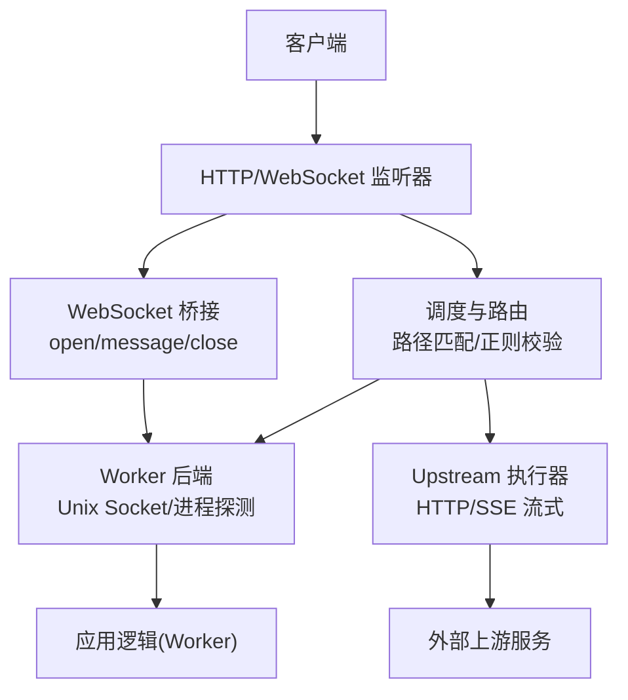
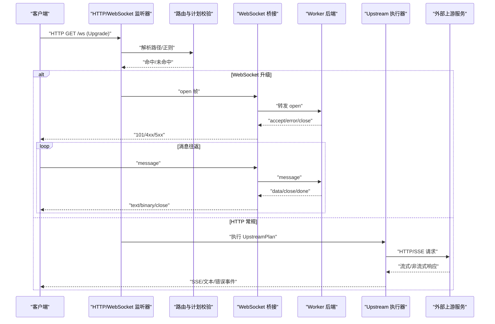
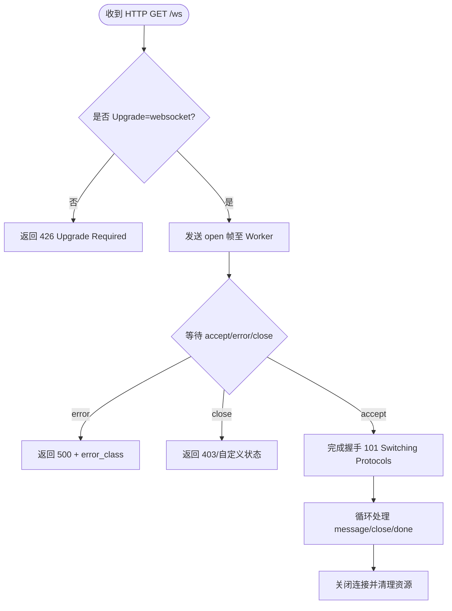
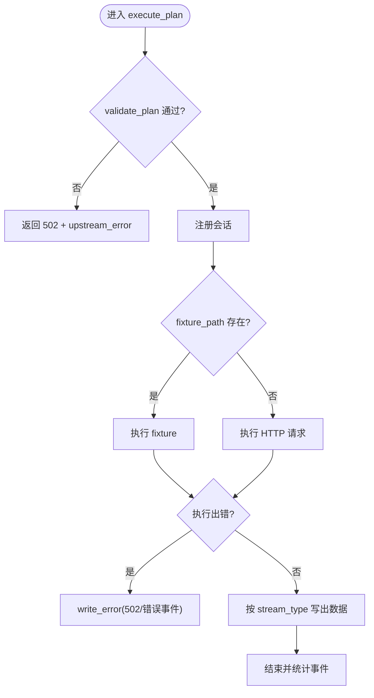
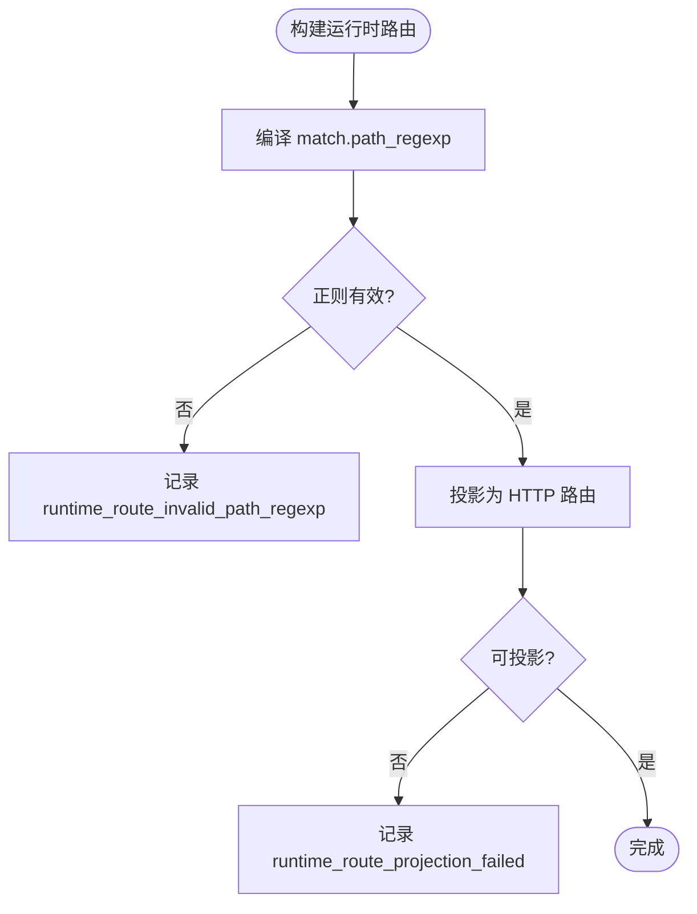
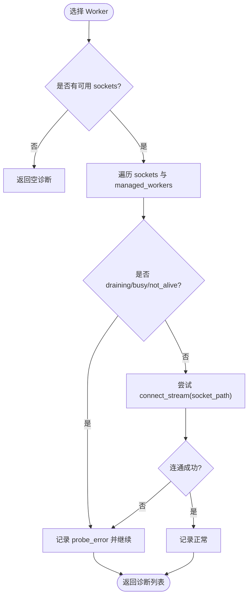
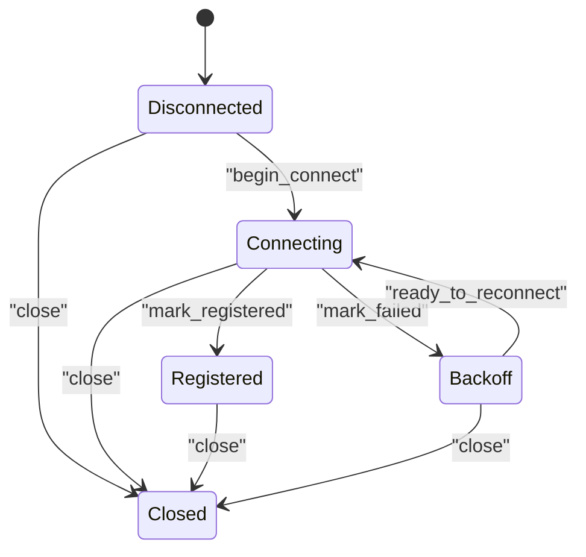
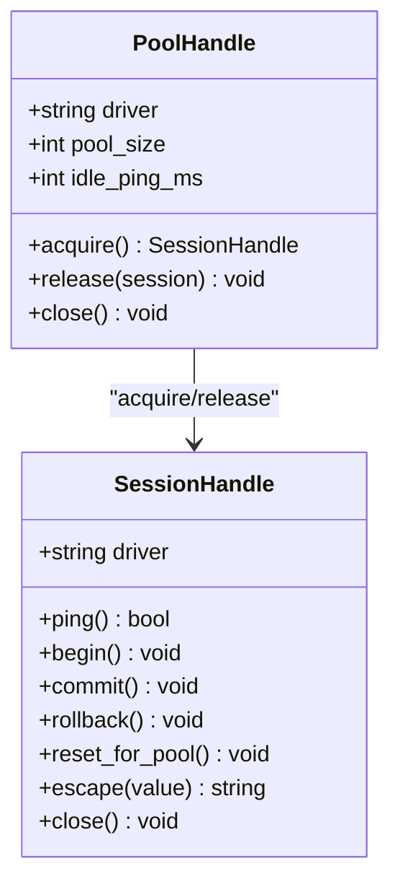
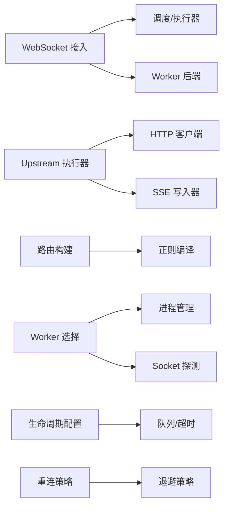

# 网络连接问题

<cite>
**本文引用的文件**   
- [failure_model.md](file://docs/failure_model.md)
- [websocket_ingress_runtime.v](file://src/websocket_ingress_runtime.v)
- [upstream_runtime.v](file://src/upstream_runtime.v)
- [runtime_plan_route_builder.v](file://src/runtime_plan_route_builder.v)
- [worker_backend_selection_diagnostics.v](file://src/worker_backend_selection_diagnostics.v)
- [server_lifecycle/runtime_config.v](file://src/server_lifecycle/runtime_config.v)
- [relay/agent_state_test.v](file://src/relay/agent_state_test.v)
- [config/v2_config_test.v](file://src/config/v2_config_test.v)
- [provider_instance_runtime.v](file://src/provider_instance_runtime.v)
- [dbx/runtime.v](file://src/dbx/runtime.v)
- [examples/public/websocket_echo_app.js](file://examples/public/websocket_echo_app.js)
- [examples/websocket_echo_app.php](file://examples/websocket_echo_app.php)
</cite>

## 目录
1. [引言](#引言)
2. [项目结构](#项目结构)
3. [核心组件](#核心组件)
4. [架构总览](#架构总览)
5. [详细组件分析](#详细组件分析)
6. [依赖关系分析](#依赖关系分析)
7. [性能与稳定性考量](#性能与稳定性考量)
8. [故障排查指南](#故障排查指南)
9. [结论](#结论)
10. [附录](#附录)

## 引言
本指南面向在生产环境中遇到网络相关问题的工程师，聚焦以下场景：HTTP 请求超时、WebSocket 连接断开、上游服务不可用、SSL/TLS 证书错误等。文档结合代码实现，给出端到端的诊断思路、可观测字段定位方法、以及基础设施层面的配置检查清单（防火墙、代理、负载均衡）。同时覆盖连接池管理、重试机制、超时配置、错误恢复等高级特性的调试要点。

## 项目结构
围绕“网络连接问题”的排查，需要重点关注如下模块与文件：
- 失败语义与超时模型：统一错误分类、响应信封、超时维度与默认值
- WebSocket 接入与桥接：握手、消息转发、关闭流程、错误处理
- Upstream 执行器：SSE/流式输出、错误写入、统计事件
- 路由与计划校验：路径正则、运行时诊断
- Worker 选择与探测：进程存活、忙闲状态、Socket 连通性
- 生命周期与队列参数：读超时、队列容量与等待超时
- 重连策略：Agent 状态机与退避
- 数据库连接池：获取/释放、空闲保活、慢查询观察
- 示例与测试：WebSocket 前端页面、PHP 示例页、V2 配置项

[无图表来源；该图为概念性结构示意]

**章节来源**
- [failure_model.md:1-133](file://docs/failure_model.md#L1-L133)
- [websocket_ingress_runtime.v:1-482](file://src/websocket_ingress_runtime.v#L1-L482)
- [upstream_runtime.v:1-187](file://src/upstream_runtime.v#L1-L187)
- [runtime_plan_route_builder.v:74-112](file://src/runtime_plan_route_builder.v#L74-L112)
- [worker_backend_selection_diagnostics.v:1-63](file://src/worker_backend_selection_diagnostics.v#L1-L63)
- [server_lifecycle/runtime_config.v:146-171](file://src/server_lifecycle/runtime_config.v#L146-L171)
- [relay/agent_state_test.v:1-89](file://src/relay/agent_state_test.v#L1-L89)
- [config/v2_config_test.v:81-108](file://src/config/v2_config_test.v#L81-L108)
- [provider_instance_runtime.v:81-126](file://src/provider_instance_runtime.v#L81-L126)
- [dbx/runtime.v:484-607](file://src/dbx/runtime.v#L484-L607)

## 核心组件
- 失败与超时模型：定义错误类别、响应头约定、超时维度与默认值、队列语义与可观测字段
- WebSocket 接入层：负责握手、消息转发、关闭通知、错误返回码与错误类
- Upstream 执行器：负责将请求映射到上游 HTTP/SSE，并在错误时写出错误事件或降级为文本
- 路由与计划校验：对路径正则进行编译与诊断，避免无效规则导致请求无法命中
- Worker 选择与探测：检测进程存活、忙闲、Socket 连通性，辅助快速定位 Worker 侧问题
- 生命周期与队列参数：暴露 worker_read_timeout_ms、worker_queue_capacity、worker_queue_timeout_ms 等关键参数
- 重连策略：基于配置的指数退避与上限控制，保障长连接稳定性
- 数据库连接池：支持 MySQL/PostgreSQL，提供连接获取、空闲保活、慢查询统计

**章节来源**
- [failure_model.md:1-133](file://docs/failure_model.md#L1-L133)
- [websocket_ingress_runtime.v:46-101](file://src/websocket_ingress_runtime.v#L46-L101)
- [upstream_runtime.v:58-162](file://src/upstream_runtime.v#L58-L162)
- [runtime_plan_route_builder.v:74-112](file://src/runtime_plan_route_builder.v#L74-L112)
- [worker_backend_selection_diagnostics.v:1-63](file://src/worker_backend_selection_diagnostics.v#L1-L63)
- [server_lifecycle/runtime_config.v:146-171](file://src/server_lifecycle/runtime_config.v#L146-L171)
- [relay/agent_state_test.v:30-68](file://src/relay/agent_state_test.v#L30-L68)
- [dbx/runtime.v:484-607](file://src/dbx/runtime.v#L484-L607)

## 架构总览
下图展示从客户端到 Worker/Upstream 的关键调用链路与错误传播路径。

**图表来源**
- [websocket_ingress_runtime.v:279-411](file://src/websocket_ingress_runtime.v#L279-L411)
- [upstream_runtime.v:58-162](file://src/upstream_runtime.v#L58-L162)
- [runtime_plan_route_builder.v:74-112](file://src/runtime_plan_route_builder.v#L74-L112)

## 详细组件分析

### WebSocket 接入与桥接
- 握手阶段：校验 Upgrade 头、生成 key、向 Worker 发送 open 帧并等待 accept/error/close
- 消息阶段：仅支持 text/binary，不支持则关闭；转发 message 给 Worker，并处理 close/done
- 关闭阶段：若 Worker 主动关闭，透传 code/reason；否则在清理时注册注销与资源回收
- 错误处理：根据 Worker 返回设置 403/500/502 等状态码，并附加 x-vhttpd-error-class

**图表来源**
- [websocket_ingress_runtime.v:46-101](file://src/websocket_ingress_runtime.v#L46-L101)
- [websocket_ingress_runtime.v:103-221](file://src/websocket_ingress_runtime.v#L103-L221)
- [websocket_ingress_runtime.v:279-339](file://src/websocket_ingress_runtime.v#L279-L339)

**章节来源**
- [websocket_ingress_runtime.v:46-101](file://src/websocket_ingress_runtime.v#L46-L101)
- [websocket_ingress_runtime.v:103-221](file://src/websocket_ingress_runtime.v#L103-L221)
- [websocket_ingress_runtime.v:279-339](file://src/websocket_ingress_runtime.v#L279-L339)

### Upstream 执行器（HTTP/SSE）
- 计划校验：validate_plan 失败直接返回 502 并标注 error_class
- 注册/注销：记录活跃会话，结束时清理
- 流式输出：SSE 模式下先写头部，再逐条写出数据；错误时写错误事件并结束
- 非 SSE：以文本形式写出错误信息
- 统计事件：记录 method/path/status/request_id/trace_id/duration_ms/stream_mode

**图表来源**
- [upstream_runtime.v:58-162](file://src/upstream_runtime.v#L58-L162)
- [upstream_runtime.v:164-186](file://src/upstream_runtime.v#L164-L186)

**章节来源**
- [upstream_runtime.v:58-162](file://src/upstream_runtime.v#L58-L162)
- [upstream_runtime.v:164-186](file://src/upstream_runtime.v#L164-L186)

### 路由与计划校验
- 路径正则：编译与诊断，非法正则会产出错误级诊断，阻止运行时生效
- 路由投影：当 pipeline 无法投影为 HTTP 路由时，产生警告级诊断

**图表来源**
- [runtime_plan_route_builder.v:74-112](file://src/runtime_plan_route_builder.v#L74-L112)

**章节来源**
- [runtime_plan_route_builder.v:74-112](file://src/runtime_plan_route_builder.v#L74-L112)

### Worker 选择与探测
- 探测维度：进程存活、draining 状态、inflight_requests、Socket 连通性
- 诊断输出：包含 socket_path、proc_alive、draining、inflight_requests、probe_error

**图表来源**
- [worker_backend_selection_diagnostics.v:1-63](file://src/worker_backend_selection_diagnostics.v#L1-L63)

**章节来源**
- [worker_backend_selection_diagnostics.v:1-63](file://src/worker_backend_selection_diagnostics.v#L1-L63)

### 生命周期与队列参数
- 关键参数：worker_read_timeout_ms、worker_restart_backoff_ms、worker_max_requests、worker_queue_capacity、worker_queue_timeout_ms
- 这些参数影响读超时、重启退避、最大请求数、应用层等待队列容量与等待超时

**章节来源**
- [server_lifecycle/runtime_config.v:146-171](file://src/server_lifecycle/runtime_config.v#L146-L171)

### 重连策略（Agent）
- 状态机：disconnected → connecting → registered/backoff/closed
- 退避：基于 initial_delay_ms 与 max_delay_ms 限制，逐步增加下次尝试时间
- 终端状态：closed 后不再允许重新连接

**图表来源**
- [relay/agent_state_test.v:1-89](file://src/relay/agent_state_test.v#L1-L89)

**章节来源**
- [relay/agent_state_test.v:1-89](file://src/relay/agent_state_test.v#L1-L89)

### 数据库连接池
- 驱动能力：MySQL/PostgreSQL 均支持 pool/transactions/parameters/prepared/savepoints
- 连接获取：MySQL 使用 channel 预分配连接，支持 idle_ping_ms 保活；PostgreSQL 使用库内连接池
- 慢查询观察：记录最近查询、耗时、是否慢查询、错误信息等

**图表来源**
- [dbx/runtime.v:484-607](file://src/dbx/runtime.v#L484-L607)
- [dbx/runtime.v:556-607](file://src/dbx/runtime.v#L556-L607)

**章节来源**
- [dbx/runtime.v:484-607](file://src/dbx/runtime.v#L484-L607)
- [dbx/runtime.v:556-607](file://src/dbx/runtime.v#L556-L607)

## 依赖关系分析
- WebSocket 接入依赖调度与执行器，并通过 Unix Socket 与 Worker 通信
- Upstream 执行器依赖 HTTP 客户端与 SSE 写入器，负责错误事件与统计
- 路由构建依赖正则编译与诊断，确保路径规则正确
- Worker 选择依赖进程管理与 Socket 探测，用于快速定位 Worker 健康状态
- 生命周期配置影响队列与超时行为，决定系统在高负载下的表现
- Agent 重连策略受配置项控制，影响长连接的稳定性

[无图表来源；该图为概念性依赖示意]

**章节来源**
- [websocket_ingress_runtime.v:279-411](file://src/websocket_ingress_runtime.v#L279-L411)
- [upstream_runtime.v:58-162](file://src/upstream_runtime.v#L58-L162)
- [runtime_plan_route_builder.v:74-112](file://src/runtime_plan_route_builder.v#L74-L112)
- [worker_backend_selection_diagnostics.v:1-63](file://src/worker_backend_selection_diagnostics.v#L1-L63)
- [server_lifecycle/runtime_config.v:146-171](file://src/server_lifecycle/runtime_config.v#L146-L171)
- [relay/agent_state_test.v:30-68](file://src/relay/agent_state_test.v#L30-L68)

## 性能与稳定性考量
- 超时维度：建议设置合理的 connect/read/global 超时，避免长时间阻塞
- 队列容量与等待超时：在高并发下启用队列可提升吞吐，但需监控深度与拒绝率
- 空闲保活：数据库连接池 idle_ping_ms 可减少冷连接失败
- 慢查询统计：关注 slow_queries 与 last_query_ms，优化热点 SQL
- 重连退避：合理设置 initial/max delay，避免雪崩

[本节为通用指导，不直接分析具体文件]

## 故障排查指南

### 一、HTTP 请求超时
- 现象：返回 504 Gateway Timeout，或上游流式响应中断
- 定位步骤：
  - 检查 worker_read_timeout_ms 与全局超时配置
  - 查看结构化日志中的 duration_ms、path/method/trace_id
  - 确认 Upstream 是否正确写出错误事件或尾片段
- 参考依据：
  - 超时语义与默认值、错误类约定
  - Upstream 错误写入与统计事件

**章节来源**
- [failure_model.md:66-79](file://docs/failure_model.md#L66-L79)
- [upstream_runtime.v:145-162](file://src/upstream_runtime.v#L145-L162)
- [server_lifecycle/runtime_config.v:146-171](file://src/server_lifecycle/runtime_config.v#L146-L171)

### 二、WebSocket 连接断开
- 现象：客户端断连、服务端 close 回调触发、消息转发失败
- 定位步骤：
  - 检查握手阶段是否返回 403/500/502，并查看 error_class
  - 确认消息仅支持 text/binary，其他 opcode 会被拒绝
  - 观察 close 回调中 worker_initiated 标志，判断是否为 Worker 主动关闭
- 参考依据：
  - WebSocket 握手与消息处理流程
  - 错误返回码与错误类设置

**章节来源**
- [websocket_ingress_runtime.v:46-101](file://src/websocket_ingress_runtime.v#L46-L101)
- [websocket_ingress_runtime.v:103-221](file://src/websocket_ingress_runtime.v#L103-L221)
- [websocket_ingress_runtime.v:279-339](file://src/websocket_ingress_runtime.v#L279-L339)

### 三、上游服务不可用
- 现象：Upstream 执行失败，返回 502 或在流中写入错误事件
- 定位步骤：
  - 检查 validate_plan 是否通过，错误类是否为 upstream_error
  - 查看 http.stream.error 事件中的 method/path/request_id/trace_id/error
  - 确认下游是否已开始写出，以便区分 502 与流内错误事件
- 参考依据：
  - Upstream 执行与错误处理流程

**章节来源**
- [upstream_runtime.v:58-162](file://src/upstream_runtime.v#L58-L162)
- [upstream_runtime.v:164-186](file://src/upstream_runtime.v#L164-L186)

### 四、SSL/TLS 证书错误
- 现象：WSS 连接建立失败、握手异常
- 定位步骤：
  - 检查证书链与域名匹配、过期时间
  - 确认代理/负载均衡层的 TLS 终止与证书传递
  - 验证 Agent 重连策略与退避是否生效
- 参考依据：
  - Agent 状态机与重连退避

**章节来源**
- [relay/agent_state_test.v:30-68](file://src/relay/agent_state_test.v#L30-L68)

### 五、网络连通性测试工具
- 端口扫描：使用 nmap 扫描目标主机端口，确认监听与可达性
- HTTP 健康检查：curl 访问 /health 或自定义健康端点，检查状态码与响应体
- WebSocket 连接测试：
  - 浏览器示例：examples/public/websocket_echo_app.js
  - PHP 示例页：examples/websocket_echo_app.php（含 /ws 端点说明）
- 参考依据：
  - 示例页面与端点说明

**章节来源**
- [examples/public/websocket_echo_app.js:1-45](file://examples/public/websocket_echo_app.js#L1-L45)
- [examples/websocket_echo_app.php:148-180](file://examples/websocket_echo_app.php#L148-L180)

### 六、防火墙/代理/负载均衡配置
- 防火墙：放行必要端口（HTTP/HTTPS/WSS），检查入站/出站规则
- 代理：确认代理层是否支持 Upgrade 与长连接，透传必要头
- 负载均衡：检查会话保持、超时与重试策略，避免与 vhttpd 队列冲突
- 参考依据：
  - V2 配置项 relays.edge.carrier/url/autostart/reconnect_delay_ms

**章节来源**
- [config/v2_config_test.v:81-108](file://src/config/v2_config_test.v#L81-L108)

### 七、连接池管理
- 连接获取：MySQL 使用 channel 预分配，注意 idle_ping_ms 保活
- 连接释放：PostgreSQL 使用库内连接池，提交/回滚后可直接归还
- 慢查询：关注 slow_queries 与 last_query_ms，优化热点 SQL
- 参考依据：
  - 连接池实现与观察统计

**章节来源**
- [dbx/runtime.v:484-607](file://src/dbx/runtime.v#L484-L607)
- [dbx/runtime.v:556-607](file://src/dbx/runtime.v#L556-L607)

### 八、重试机制与错误恢复
- 当前阶段不在 vhttpd 层做自动重试与业务 fallback
- 建议在客户端或服务网关层实现幂等重试与熔断
- 参考依据：
  - 失败模型的 Non-Goals

**章节来源**
- [failure_model.md:127-133](file://docs/failure_model.md#L127-L133)

### 九、队列与超时配置
- 队列容量与等待超时：监控 worker_queue_depth、rejected_total、timeouts_total
- 读超时：调整 worker_read_timeout_ms 以适应不同业务 SLA
- 参考依据：
  - 队列语义与可观测字段
  - 生命周期配置

**章节来源**
- [failure_model.md:80-103](file://docs/failure_model.md#L80-L103)
- [server_lifecycle/runtime_config.v:146-171](file://src/server_lifecycle/runtime_config.v#L146-L171)

### 十、Provider 实例与上游控制
- Provider 实例动态更新：如 feishu/codex 的配置变更，确保上游连接稳定
- 参考依据：
  - Provider 实例运行时处理

**章节来源**
- [provider_instance_runtime.v:81-126](file://src/provider_instance_runtime.v#L81-L126)

## 结论
通过对失败语义、WebSocket 接入、Upstream 执行、路由校验、Worker 选择、生命周期配置、重连策略与连接池的全面分析，可以系统化地定位和解决 HTTP 超时、WebSocket 断连、上游不可用与 SSL/TLS 错误等问题。配合连通性测试工具与基础设施配置检查，能够显著提升排障效率与系统稳定性。

## 附录
- 可观测字段建议：trace_id、request_id、method、path、status、error_class、duration_ms
- 常见错误类：transport_error、worker_runtime_error、app_contract_error、upstream_error、worker_queue_full、worker_queue_timeout

[本节为总结性内容，不直接分析具体文件]