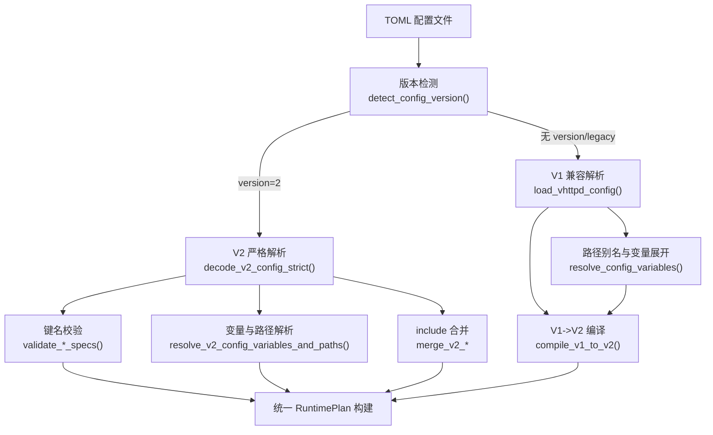
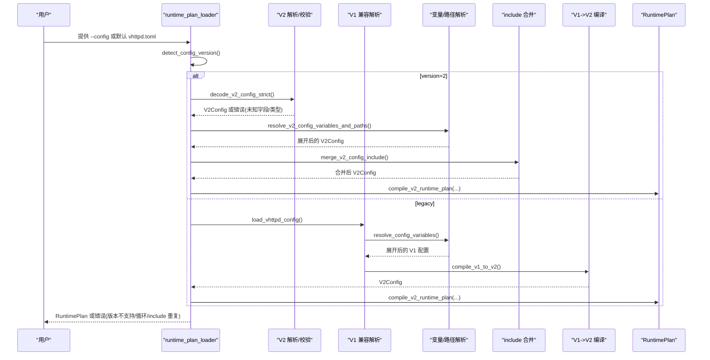
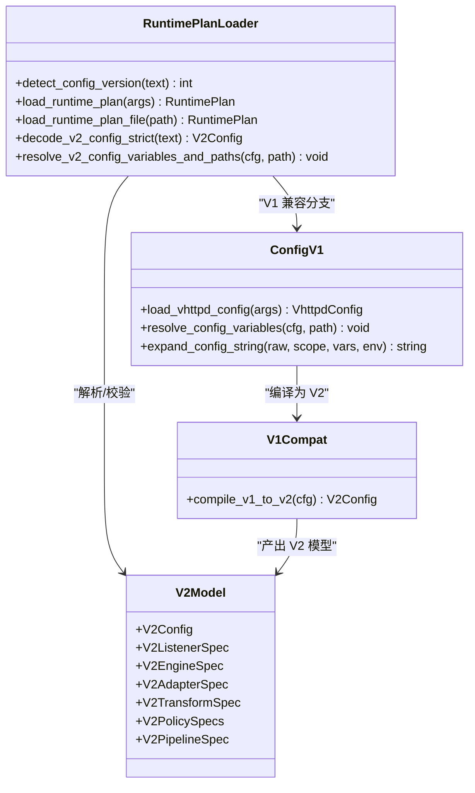

# 配置错误诊断

<cite>
**本文引用的文件列表**
- [config/vhttpd.example.toml](file://config/vhttpd.example.toml)
- [src/config/config.v](file://src/config/config.v)
- [src/config/v2_config.v](file://src/config/v2_config.v)
- [src/config/runtime_plan_loader.v](file://src/config/runtime_plan_loader.v)
- [src/config/v1_plan_compat.v](file://src/config/v1_plan_compat.v)
- [src/config/v2_config_test.v](file://src/config/v2_config_test.v)
- [src/config/runtime_plan_loader_test.v](file://src/config/runtime_plan_loader_test.v)
</cite>

## 目录
1. [简介](#简介)
2. [项目结构](#项目结构)
3. [核心组件](#核心组件)
4. [架构总览](#架构总览)
5. [详细组件分析](#详细组件分析)
6. [依赖关系分析](#依赖关系分析)
7. [性能与稳定性考量](#性能与稳定性考量)
8. [故障排查指南](#故障排查指南)
9. [结论](#结论)
10. [附录](#附录)

## 简介
本指南聚焦于 vhttpd 的 TOML 配置错误诊断，覆盖语法错误、类型不匹配、路径引用错误等常见问题；系统介绍配置验证机制与错误信息解读，包括配置项依赖关系、环境变量覆盖规则、路径别名解析；并提供常见配置错误的修复示例（执行器配置、路由规则、安全设置、性能参数等）以及高级问题（热更新失败、加载顺序、多环境配置管理）的排查步骤。

## 项目结构
vhttpd 的配置体系包含两个版本：
- V1 兼容模式：通过 legacy 结构体与编译层映射到统一的运行时计划（RuntimePlan）。
- V2 严格模式：以 schema 校验、include 合并、变量与路径解析为核心。

图表来源
- [src/config/runtime_plan_loader.v:10-46](file://src/config/runtime_plan_loader.v#L10-L46)
- [src/config/runtime_plan_loader.v:108-117](file://src/config/runtime_plan_loader.v#L108-L117)
- [src/config/runtime_plan_loader.v:416-493](file://src/config/runtime_plan_loader.v#L416-L493)
- [src/config/config.v:448-482](file://src/config/config.v#L448-L482)
- [src/config/v1_plan_compat.v:5-9](file://src/config/v1_plan_compat.v#L5-L9)

章节来源
- [src/config/runtime_plan_loader.v:10-46](file://src/config/runtime_plan_loader.v#L10-L46)
- [src/config/config.v:448-482](file://src/config/config.v#L448-L482)

## 核心组件
- 配置模型定义
  - V1 模型：ServerConfig、WorkerConfig、ExecutorConfig、PhpConfig、RouteRuleConfig、SiteConfig、VhttpdConfig 等。
  - V2 模型：V2Config、V2ListenerSpec、V2EngineSpec、V2AdapterSpec、V2TransformSpec、V2PolicySpecs、V2PipelineSpec 等。
- 配置加载与解析
  - 版本检测与分发：detect_config_version()。
  - V2 严格解析：decode_v2_config_strict() + validate_*_specs()。
  - V1 兼容解析：load_vhttpd_config() + resolve_config_variables()。
- 变量与路径解析
  - V1：expand_config_string()/resolve_config_variable() 支持 ${env.X} 与 ${paths.*} 等。
  - V2：resolve_v2_config_variables_and_paths() 对 listener TLS、资源、引擎、适配器等进行路径与值展开。
- include 与合并
  - V2 include 循环检测、同名冲突检测、策略/管道合并。
- 兼容性编译
  - compile_v1_to_v2() 将 V1 站点、路由、插件、OpenAI/飞书/Codex 等映射为 V2 管线与适配器。

章节来源
- [src/config/config.v:6-423](file://src/config/config.v#L6-L423)
- [src/config/v2_config.v:3-318](file://src/config/v2_config.v#L3-L318)
- [src/config/runtime_plan_loader.v:108-117](file://src/config/runtime_plan_loader.v#L108-L117)
- [src/config/config.v:2307-2392](file://src/config/config.v#L2307-L2392)
- [src/config/runtime_plan_loader.v:416-493](file://src/config/runtime_plan_loader.v#L416-L493)
- [src/config/v1_plan_compat.v:49-100](file://src/config/v1_plan_compat.v#L49-L100)

## 架构总览
下图展示从 TOML 到 RuntimePlan 的关键流程与错误点：

图表来源
- [src/config/runtime_plan_loader.v:18-46](file://src/config/runtime_plan_loader.v#L18-L46)
- [src/config/runtime_plan_loader.v:108-117](file://src/config/runtime_plan_loader.v#L108-L117)
- [src/config/runtime_plan_loader.v:416-493](file://src/config/runtime_plan_loader.v#L416-L493)
- [src/config/config.v:448-482](file://src/config/config.v#L448-L482)
- [src/config/v1_plan_compat.v:5-9](file://src/config/v1_plan_compat.v#L5-L9)

## 详细组件分析

### 1) TOML 语法与类型错误
- 现象
  - 根级未知字段报错：如意外拼写或废弃字段。
  - 子表未知字段报错：如 engines.app.poolz。
  - 数组元素字段未知报错：如 listeners.web.tls.certificates[0].xxx。
- 触发位置
  - V2 严格键名校验：validate_keys()/validate_optional_table()/validate_named_specs()/validate_listener_specs()/validate_observability_specs()/validate_resource_specs()/validate_policy_specs()/validate_pipeline_specs()。
- 典型错误码
  - v2_config_unknown_field:<完整路径>
- 定位方法
  - 查看错误消息中的路径，对照 V2 模型字段白名单。
- 修复建议
  - 修正字段名；删除废弃字段；按 V2 文档补齐必填字段。

章节来源
- [src/config/runtime_plan_loader.v:505-533](file://src/config/runtime_plan_loader.v#L505-L533)
- [src/config/runtime_plan_loader.v:585-674](file://src/config/runtime_plan_loader.v#L585-L674)
- [src/config/runtime_plan_loader_test.v:190-232](file://src/config/runtime_plan_loader_test.v#L190-L232)

### 2) 环境变量与变量表达式错误
- 现象
  - 缺少必需的环境变量：${env.VAR} 未设置且无默认值。
  - 空表达式或非法表达式：${} 或 ${:-}。
  - 变量循环引用导致“超过最大展开次数”。
- 触发位置
  - expand_config_string()/resolve_config_variable()。
- 典型错误码
  - invalid variable expression in config string: missing "}"
  - invalid empty variable expression in config string
  - invalid env variable expression
  - missing environment variable "${VAR}"
  - unknown config variable "${key}"
  - config variable expansion exceeded max passes (possible cyclic reference)
- 修复建议
  - 确保 ${env.X} 存在或提供默认值 ${env.X:-default}。
  - 避免自引用或间接循环引用。
  - 使用 paths.root 与相对路径简化引用。

章节来源
- [src/config/config.v:2307-2392](file://src/config/config.v#L2307-L2392)
- [src/config/config.v:2063-2063](file://src/config/config.v#L2063-L2063)

### 3) 路径引用与别名解析错误
- 现象
  - 相对路径无法解析或指向不存在的路径。
  - 路径末尾多余斜杠导致不一致。
  - 在 V2 中证书、存储 root、引擎 entry/app/module_root 等路径未正确解析。
- 触发位置
  - V1：resolve_config_path()/normalize_config_path_value()。
  - V2：resolve_v2_config_variables_and_paths() 中对各路径字段逐一解析。
- 修复建议
  - 使用 ${paths.root} 作为基准目录；保持路径简洁。
  - 检查绝对/相对路径组合是否符合预期。
  - 确认目标文件/目录存在。

章节来源
- [src/config/config.v:2066-2094](file://src/config/config.v#L2066-L2094)
- [src/config/runtime_plan_loader.v:416-493](file://src/config/runtime_plan_loader.v#L416-L493)

### 4) Include 循环与重复定义
- 现象
  - include 循环：A include B，B 又 include A。
  - 同名对象重复定义：listeners、engines、adapters、transforms、providers、relays、pipelines.id 等。
- 触发位置
  - load_v2_config_file_with_seen() 循环检测。
  - merge_v2_named_map()/merge_v2_pipelines() 重复检测。
- 典型错误码
  - v2_config_include_cycle:<绝对路径>
  - v2_config_include_duplicate:<domain>.<id>:<source_path>
  - v2_config_include_duplicate:pipelines.<id>:<source_path>
- 修复建议
  - 拆分 include 层级，消除环。
  - 保证各域内 id 唯一；必要时重命名。

章节来源
- [src/config/runtime_plan_loader.v:66-84](file://src/config/runtime_plan_loader.v#L66-L84)
- [src/config/runtime_plan_loader.v:134-184](file://src/config/runtime_plan_loader.v#L134-L184)

### 5) 版本不支持与兼容模式
- 现象
  - 指定了不受支持的 version 值。
  - 未声明 version 时回退到 V1 兼容模式，并产生诊断信息。
- 触发位置
  - detect_config_version() 与 load_runtime_plan_file()。
- 典型错误码
  - runtime_plan_unsupported_version:<version>
- 修复建议
  - 明确声明 version = 2 并使用 V2 规范。
  - 若仍使用 V1，注意兼容性诊断提示。

章节来源
- [src/config/runtime_plan_loader.v:10-16](file://src/config/runtime_plan_loader.v#L10-L16)
- [src/config/runtime_plan_loader.v:34-46](file://src/config/runtime_plan_loader.v#L34-L46)
- [src/config/runtime_plan_loader_test.v:174-188](file://src/config/runtime_plan_loader_test.v#L174-L188)

### 6) V1 到 V2 编译与遗留特性
- 现象
  - routes.executor 使用静态/上传/拒绝等“魔法执行器”被转换为适配器或终端。
  - on_completed 回调被编译为事件管线。
  - 生成 diagnostics 提示 legacy_schema 等。
- 触发位置
  - compile_v1_to_v2() 及 v1_plan_diagnostics()。
- 修复建议
  - 逐步迁移到 V2 的 adapters/transforms/policies/pipelines 显式声明。
  - 使用 policies.security/response/limits/cache 替代旧 route 字段。

章节来源
- [src/config/v1_plan_compat.v:11-47](file://src/config/v1_plan_compat.v#L11-L47)
- [src/config/v1_plan_compat.v:146-276](file://src/config/v1_plan_compat.v#L146-L276)

### 7) 关键配置项调试要点

#### 执行器配置（PHP/VJSX）
- 关注点
  - kind、entry/app/binary、module_root/build_root、socket/socket_prefix、extensions、args、env、options。
  - V1 中 worker 与 php/vjsx 字段映射到 V2 EngineSpec。
- 常见错误
  - 路径未解析或不存在；环境变量缺失；选项类型不匹配。
- 参考示例
  - 示例配置：[config/vhttpd.example.toml](file://config/vhttpd.example.toml)
  - V2 引擎字段定义：[src/config/v2_config.v:120-155](file://src/config/v2_config.v#L120-L155)
  - V1 引擎映射：[src/config/v1_plan_compat.v:546-598](file://src/config/v1_plan_compat.v#L546-L598)

章节来源
- [config/vhttpd.example.toml:28-36](file://config/vhttpd.example.toml#L28-L36)
- [src/config/v2_config.v:120-155](file://src/config/v2_config.v#L120-L155)
- [src/config/v1_plan_compat.v:546-598](file://src/config/v1_plan_compat.v#L546-L598)

#### 路由规则与管线
- 关注点
  - match.methods/paths/path_regexp/query/headers/metadata。
  - transforms/policies/egress 引用是否正确。
- 常见错误
  - 未知字段；match.query 类型应为 map[string][]string；pipeline id 重复。
- 参考示例
  - V2 匹配与管线定义：[src/config/v2_config.v:279-300](file://src/config/v2_config.v#L279-L300)
  - 校验逻辑：[src/config/runtime_plan_loader.v:647-663](file://src/config/runtime_plan_loader.v#L647-L663)

章节来源
- [src/config/v2_config.v:279-300](file://src/config/v2_config.v#L279-L300)
- [src/config/runtime_plan_loader.v:647-663](file://src/config/runtime_plan_loader.v#L647-L663)

#### 安全设置
- 关注点
  - policies.security.required_headers/denied_query_patterns/allowed_origins。
  - V1 路由 required_headers/denied_query_patterns 映射到 security policy。
- 常见错误
  - 字段名错误或类型不匹配；allowed_origins 应为字符串数组。
- 参考示例
  - V2 安全策略字段：[src/config/v2_config.v:224-229](file://src/config/v2_config.v#L224-L229)
  - V1 到 V2 转换：[src/config/v1_plan_compat.v:234-241](file://src/config/v1_plan_compat.v#L234-L241)

章节来源
- [src/config/v2_config.v:224-229](file://src/config/v2_config.v#L224-L229)
- [src/config/v1_plan_compat.v:234-241](file://src/config/v1_plan_compat.v#L234-L241)

#### 性能参数
- 关注点
  - pool_size/thread_count/max_requests/restart_backoff_ms/restart_backoff_max_ms/read_timeout_ms/queue_capacity/queue_timeout_ms。
  - V1 worker 与 V2 engine 字段对应关系。
- 常见错误
  - 数值越界或类型错误；队列超时与容量不匹配。
- 参考示例
  - V2 引擎性能字段：[src/config/v2_config.v:120-155](file://src/config/v2_config.v#L120-L155)
  - V1 worker 字段：[src/config/config.v:33-50](file://src/config/config.v#L33-L50)

章节来源
- [src/config/v2_config.v:120-155](file://src/config/v2_config.v#L120-L155)
- [src/config/config.v:33-50](file://src/config/config.v#L33-L50)

### 8) 配置热更新失败
- 可能原因
  - 新配置包含未知字段或类型错误。
  - include 循环或重复定义。
  - 变量/路径解析失败。
- 排查步骤
  - 使用最小化配置复现；逐段启用 include 定位问题。
  - 检查错误码：v2_config_unknown_field、v2_config_include_cycle、v2_config_include_duplicate。
  - 校验环境变量是否齐全。
- 相关实现
  - include 合并与校验：[src/config/runtime_plan_loader.v:119-184](file://src/config/runtime_plan_loader.v#L119-L184)
  - 变量/路径解析：[src/config/runtime_plan_loader.v:416-493](file://src/config/runtime_plan_loader.v#L416-L493)

章节来源
- [src/config/runtime_plan_loader.v:119-184](file://src/config/runtime_plan_loader.v#L119-L184)
- [src/config/runtime_plan_loader.v:416-493](file://src/config/runtime_plan_loader.v#L416-L493)

### 9) 配置加载顺序
- 行为
  - 先读取主配置，再按 include 列表递归加载子配置，进行合并。
  - include 路径基于当前配置文件的目录解析。
- 注意事项
  - 同名对象不允许重复；管道 id 必须唯一。
- 相关实现
  - 加载与合并：[src/config/runtime_plan_loader.v:61-106](file://src/config/runtime_plan_loader.v#L61-L106)

章节来源
- [src/config/runtime_plan_loader.v:61-106](file://src/config/runtime_plan_loader.v#L61-L106)

### 10) 多环境配置管理
- 推荐做法
  - 使用 include 拆分公共与环境特定配置（dev/staging/prod）。
  - 使用 ${env.X:-default} 注入敏感信息与差异项。
  - 使用 ${paths.root} 与相对路径减少硬编码。
- 参考示例
  - 示例配置含环境变量与路径别名：[config/vhttpd.example.toml](file://config/vhttpd.example.toml)
  - V2 测试用例演示 include 与路径解析：[src/config/runtime_plan_loader_test.v:546-606](file://src/config/runtime_plan_loader_test.v#L546-L606)

章节来源
- [config/vhttpd.example.toml:1-67](file://config/vhttpd.example.toml#L1-L67)
- [src/config/runtime_plan_loader_test.v:546-606](file://src/config/runtime_plan_loader_test.v#L546-L606)

## 依赖关系分析
- 模块耦合
  - runtime_plan_loader 依赖 toml 解析与 V2 模型；V1 兼容层依赖 V2 模型进行编译。
  - config.v 提供 V1 模型与变量/路径解析；runtime_plan_loader 负责 V2 解析与校验。
- 外部依赖
  - TOML 库用于文本解析与解码。
  - 操作系统 API 用于路径与文件操作。
- 潜在风险
  - V1 与 V2 双轨并行，需关注字段映射一致性。
  - 大量字符串展开与路径解析，需注意性能与循环引用保护。

图表来源
- [src/config/runtime_plan_loader.v:10-46](file://src/config/runtime_plan_loader.v#L10-L46)
- [src/config/config.v:448-482](file://src/config/config.v#L448-L482)
- [src/config/v1_plan_compat.v:5-9](file://src/config/v1_plan_compat.v#L5-L9)
- [src/config/v2_config.v:3-318](file://src/config/v2_config.v#L3-L318)

章节来源
- [src/config/runtime_plan_loader.v:10-46](file://src/config/runtime_plan_loader.v#L10-L46)
- [src/config/config.v:448-482](file://src/config/config.v#L448-L482)
- [src/config/v1_plan_compat.v:5-9](file://src/config/v1_plan_compat.v#L5-L9)
- [src/config/v2_config.v:3-318](file://src/config/v2_config.v#L3-L318)

## 性能与稳定性考量
- 变量展开
  - 限制最大展开次数，防止循环引用导致的死循环。
- 路径解析
  - 规范化路径（去除尾部斜杠），减少文件系统访问异常。
- 严格校验
  - V2 模式下提前发现未知字段与类型错误，降低运行期失败概率。
- include 合并
  - 避免重复定义与循环，提升可维护性与稳定性。

章节来源
- [src/config/config.v:2063-2063](file://src/config/config.v#L2063-L2063)
- [src/config/config.v:2073-2094](file://src/config/config.v#L2073-L2094)
- [src/config/runtime_plan_loader.v:134-184](file://src/config/runtime_plan_loader.v#L134-L184)

## 故障排查指南
- 快速定位
  - 根据错误码前缀判断阶段：
    - v2_config_unknown_field：V2 字段名错误。
    - v2_config_include_cycle / duplicate：include 问题。
    - runtime_plan_unsupported_version：版本不支持。
    - invalid variable expression / missing environment variable / unknown config variable：变量表达式问题。
- 分步排查
  - 最小化配置复现：仅保留必要字段，逐步添加。
  - 隔离 include：逐个注释 include 块，定位冲突源。
  - 校验环境变量：打印或 echo 关键 ${env.X} 值。
  - 路径检查：确认 ${paths.root} 与相对路径最终解析结果。
- 常见修复清单
  - 修正字段名与类型；补齐必填字段。
  - 为 ${env.X} 提供默认值或确保已设置。
  - 调整 include 层级，避免循环与重复。
  - 将 V1 路由规则迁移至 V2 的 transforms/policies/pipelines。

章节来源
- [src/config/runtime_plan_loader_test.v:174-232](file://src/config/runtime_plan_loader_test.v#L174-L232)
- [src/config/config.v:2307-2392](file://src/config/config.v#L2307-L2392)
- [src/config/runtime_plan_loader.v:66-84](file://src/config/runtime_plan_loader.v#L66-L84)

## 结论
vhttpd 的配置系统在 V2 下提供了严格的键名校验、安全的变量与路径解析、以及灵活的 include 合并能力；同时通过 V1 兼容层平滑过渡。遵循本文的诊断方法与修复建议，可高效定位并解决绝大多数配置错误，保障服务稳定运行。

## 附录
- 示例配置参考
  - [config/vhttpd.example.toml](file://config/vhttpd.example.toml)
- V2 模型与校验
  - [src/config/v2_config.v](file://src/config/v2_config.v)
  - [src/config/runtime_plan_loader.v](file://src/config/runtime_plan_loader.v)
- V1 兼容与变量解析
  - [src/config/config.v](file://src/config/config.v)
  - [src/config/v1_plan_compat.v](file://src/config/v1_plan_compat.v)
- 测试用例（帮助理解行为）
  - [src/config/v2_config_test.v](file://src/config/v2_config_test.v)
  - [src/config/runtime_plan_loader_test.v](file://src/config/runtime_plan_loader_test.v)