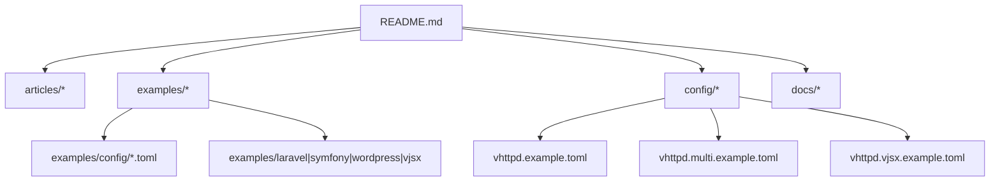
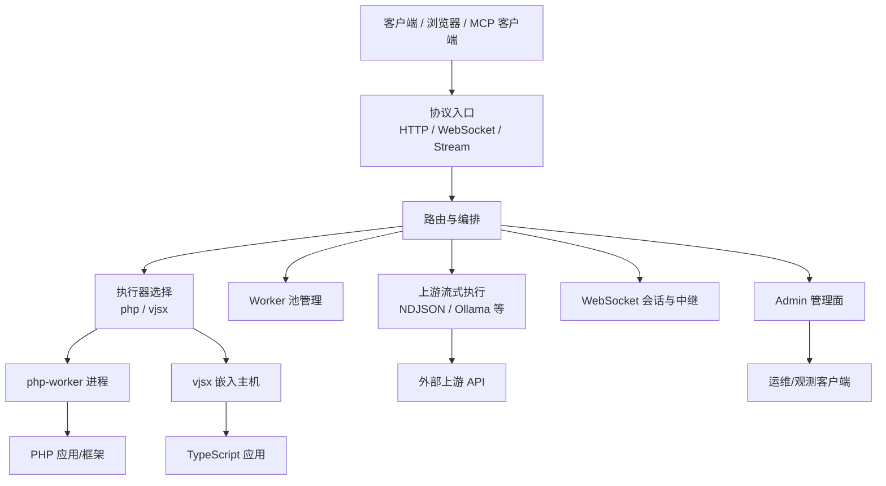
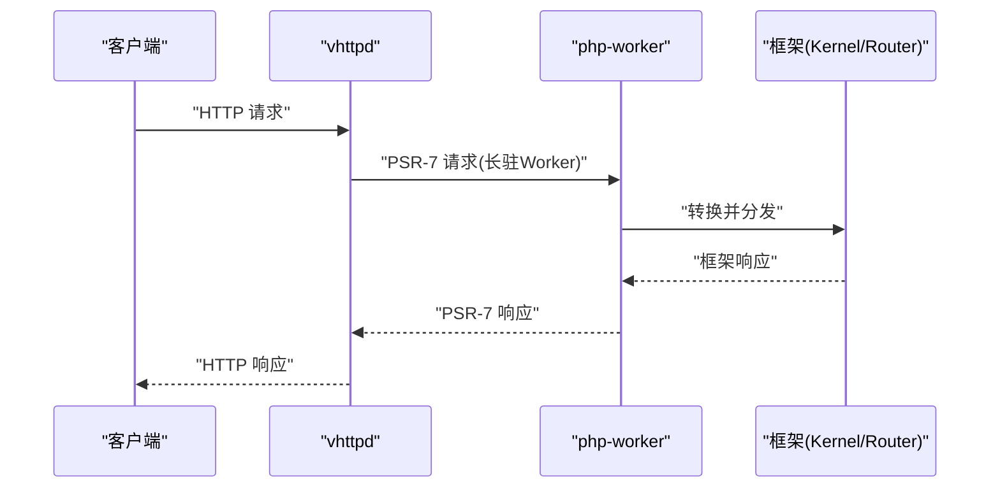
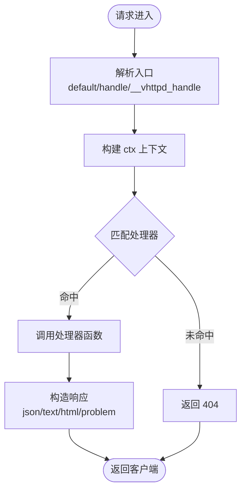
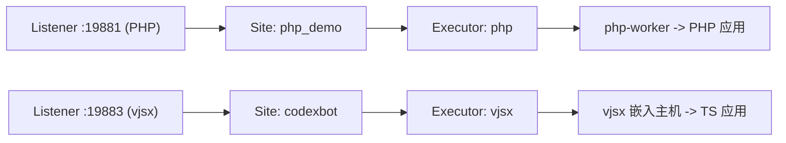
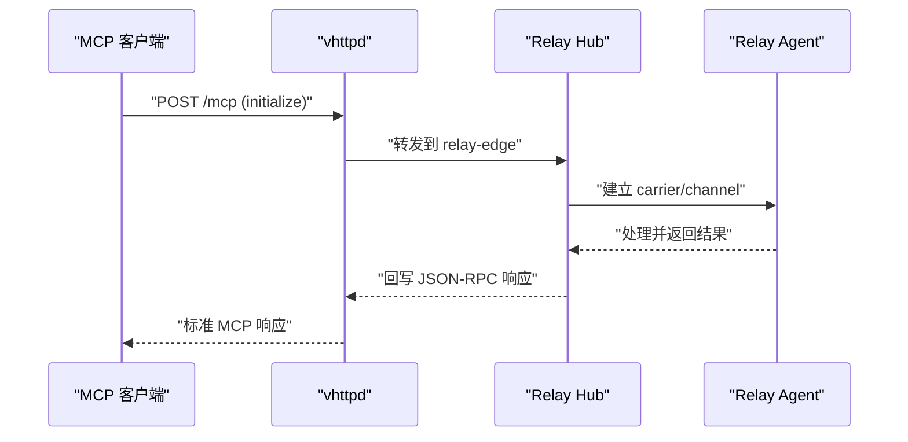
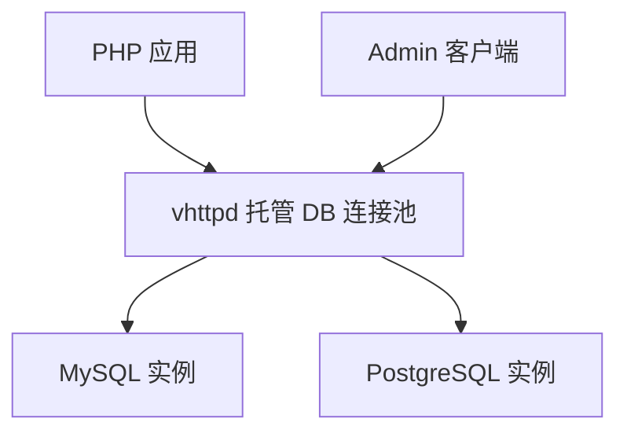
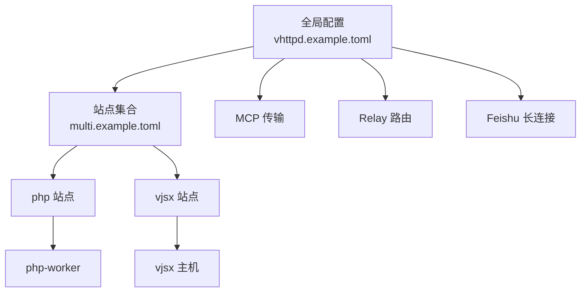

# 示例和最佳实践

<cite>
**本文引用的文件**   
- [README.md](file://README.md)
- [03-php-apps.md](file://articles/03-php-apps.md)
- [08-vjsx-intro.md](file://articles/08-vjsx-intro.md)
- [examples/README.md](file://examples/README.md)
- [config/vhttpd.example.toml](file://config/vhttpd.example.toml)
- [config/vhttpd.multi.example.toml](file://config/vhttpd.multi.example.toml)
- [config/vhttpd.vjsx.example.toml](file://config/vhttpd.vjsx.example.toml)
- [examples/config/hello.toml](file://examples/config/hello.toml)
- [examples/laravel/app.php](file://examples/laravel/app.php)
- [examples/symfony/app.php](file://examples/symfony/app.php)
- [examples/wordpress/app.php](file://examples/wordpress/app.php)
- [examples/vjsx/hello-handler.mts](file://examples/vjsx/hello-handler.mts)
- [examples/vjsx/api-demo-handler.mts](file://examples/vjsx/api-demo-handler.mts)
- [examples/codexbot-app/app.php](file://examples/codexbot-app/app.php)
- [examples/codexbot-app-ts/app.mts](file://examples/codexbot-app-ts/app.mts)
- [examples/config/db-upstream.toml](file://examples/config/db-upstream.toml)
- [examples/config/db-upstream-pg.toml](file://examples/config/db-upstream-pg.toml)
- [docs/VJSX_FACADE_REFERENCE.md](file://docs/VJSX_FACADE_REFERENCE.md)
</cite>

## 目录
1. [简介](#简介)
2. [项目结构](#项目结构)
3. [核心组件](#核心组件)
4. [架构总览](#架构总览)
5. [详细组件分析](#详细组件分析)
6. [依赖关系分析](#依赖关系分析)
7. [性能与调优](#性能与调优)
8. [安全开发指南](#安全开发指南)
9. [故障排除指南](#故障排除指南)
10. [结论](#结论)
11. [附录：示例清单与快速上手](#附录示例清单与快速上手)

## 简介
本文件面向希望将 vhttpd 用于生产环境的开发者与运维工程师，提供从 PHP 应用部署、VJSX 应用开发、混合应用架构到微服务集成的完整示例与最佳实践。内容覆盖用户认证、数据持久化、缓存策略、消息队列等常见业务模式；同时给出性能优化与安全开发的指导原则，并附带故障排除方法。

vhttpd 作为协议与执行宿主，统一承载 HTTP/WebSocket/流式响应，并通过可插拔执行器（php-worker、vjsx）对接不同运行时，形成“薄网关 + 厚业务”的清晰边界。

## 项目结构
仓库采用“文档 + 示例 + 配置 + 源码”的分层组织方式：
- 文档与文章：README、articles、docs
- 示例：examples（PHP/Laravel/Symfony/WordPress、vjsx、MCP、AI 流、WebSocket、Relay 等）
- 配置：config（全局与多站点示例）、examples/config（场景化 TOML）
- 源码：src（内核、调度、执行器、上游、管理面等）

图表来源
- [README.md:1-150](file://README.md#L1-L150)
- [examples/README.md:1-120](file://examples/README.md#L1-L120)

章节来源
- [README.md:1-150](file://README.md#L1-L150)
- [examples/README.md:1-120](file://examples/README.md#L1-L120)

## 核心组件
- 执行器模型
  - php-worker：外部进程 Worker，适合复杂业务与生态集成
  - vjsx：嵌入式 TypeScript/JavaScript 执行器，适合轻量逻辑、中间件与协议粘合
- 运行模式
  - 普通 HTTP、流式响应（SSE/text）、WebSocket、Upstream Plan（phase 3）
- 管理面与可观测性
  - Admin API、事件日志、运行时快照、Worker 池监控

章节来源
- [README.md:33-126](file://README.md#L33-L126)
- [docs/VJSX_FACADE_REFERENCE.md:1-70](file://docs/VJSX_FACADE_REFERENCE.md#L1-L70)

## 架构总览
vhttpd 在协议层终止 HTTP/WebSocket/Stream，在运行时侧编排 Worker 池、上游连接、Admin 与 MCP 能力，并将请求分发至具体执行器。

图表来源
- [README.md:84-126](file://README.md#L84-L126)

## 详细组件分析

### PHP 应用部署（Laravel/Symfony/WordPress）
- 目标
  - 以最小改动接入 vhttpd，复用现有框架生态
  - 利用 Worker 常驻优势，保持连接池与预热状态
- 关键要点
  - PSR-7 桥接：通过 Symfony Bridge 将 PSR-7 请求转换为框架原生 Request/Response
  - 启动一次、多次复用：在 worker 内静态初始化容器/路由/Kernel
  - 配置项：worker.autostart、pool_size、read_timeout_ms、socket 路径、环境变量注入
- 参考实现
  - Laravel 集成入口：[examples/laravel/app.php](file://examples/laravel/app.php)
  - Symfony 集成入口：[examples/symfony/app.php](file://examples/symfony/app.php)
  - WordPress 集成入口：[examples/wordpress/app.php](file://examples/wordpress/app.php)
  - 通用说明与对比：[articles/03-php-apps.md](file://articles/03-php-apps.md)

图表来源
- [examples/laravel/app.php:17-54](file://examples/laravel/app.php#L17-L54)
- [examples/symfony/app.php:23-66](file://examples/symfony/app.php#L23-L66)
- [examples/wordpress/app.php:42-251](file://examples/wordpress/app.php#L42-L251)

章节来源
- [examples/laravel/app.php:1-55](file://examples/laravel/app.php#L1-L55)
- [examples/symfony/app.php:1-67](file://examples/symfony/app.php#L1-L67)
- [examples/wordpress/app.php:1-252](file://examples/wordpress/app.php#L1-L252)
- [articles/03-php-apps.md:1-200](file://articles/03-php-apps.md#L1-L200)

### VJSX 应用开发（嵌入式 TypeScript/JavaScript）
- 目标
  - 使用 .mts 编写轻量逻辑、中间件、协议适配或前端网关
  - 零外部依赖，多线程执行，快速原型
- 关键要点
  - 入口解析顺序：export default > export const handle > globalThis.__vhttpd_handle
  - 上下文 ctx：方法/路径/查询头体、语义化响应、内容协商
  - 运行时 ctx.runtime：日志、事件、快照、HTTP 发起、文件读取
- 参考实现
  - 基础 Handler：[examples/vjsx/hello-handler.mts](file://examples/vjsx/hello-handler.mts)
  - API 演示：[examples/vjsx/api-demo-handler.mts](file://examples/vjsx/api-demo-handler.mts)
  - Facade 参考：[docs/VJSX_FACADE_REFERENCE.md](file://docs/VJSX_FACADE_REFERENCE.md)
  - 入门教程：[articles/08-vjsx-intro.md](file://articles/08-vjsx-intro.md)

图表来源
- [docs/VJSX_FACADE_REFERENCE.md:1-25](file://docs/VJSX_FACADE_REFERENCE.md#L1-L25)
- [examples/vjsx/hello-handler.mts:1-16](file://examples/vjsx/hello-handler.mts#L1-L16)
- [examples/vjsx/api-demo-handler.mts:33-88](file://examples/vjsx/api-demo-handler.mts#L33-L88)

章节来源
- [examples/vjsx/hello-handler.mts:1-16](file://examples/vjsx/hello-handler.mts#L1-L16)
- [examples/vjsx/api-demo-handler.mts:1-91](file://examples/vjsx/api-demo-handler.mts#L1-L91)
- [docs/VJSX_FACADE_REFERENCE.md:1-70](file://docs/VJSX_FACADE_REFERENCE.md#L1-L70)
- [articles/08-vjsx-intro.md:1-200](file://articles/08-vjsx-intro.md#L1-L200)

### 混合应用架构（PHP + vjsx 同进程多站点）
- 目标
  - 单进程监听多个端口，分别承载 PHP 与 vjsx 站点
  - 共享全局配置（assets、feishu、codex），站点级覆盖差异
- 关键要点
  - Site DSL：每个站点独立 executor、app、worker 参数
  - 变量展开：TOML 支持 ${section.key} 与 ${env.NAME:-default}
- 参考配置
  - 多站点示例：[config/vhttpd.multi.example.toml](file://config/vhttpd.multi.example.toml)
  - 全局示例：[config/vhttpd.example.toml](file://config/vhttpd.example.toml)

图表来源
- [config/vhttpd.multi.example.toml:44-73](file://config/vhttpd.multi.example.toml#L44-L73)

章节来源
- [config/vhttpd.multi.example.toml:1-73](file://config/vhttpd.multi.example.toml#L1-L73)
- [config/vhttpd.example.toml:1-67](file://config/vhttpd.example.toml#L1-L67)

### 微服务集成（MCP/Relay/Feishu）
- 目标
  - 通过内置 MCP 传输与 Relay 机制，将 vhttpd 作为协议网关
  - 结合 Feishu 长连接事件回调与发送通道，打通 IM 场景
- 关键要点
  - MCP：POST/GET /mcp，Session + SSE 最小可用
  - Relay：public HTTP 经 relay-delivery adapter 投递到 hub，等待 agent 返回
  - Feishu：事件订阅、回调验证、聊天发现、消息发送
- 参考示例
  - MCP 示例与用法：[examples/README.md:218-404](file://examples/README.md#L218-L404)
  - Relay 本地 Smoke：[examples/README.md:54-74](file://examples/README.md#L54-L74)
  - CodexBot（PHP）：[examples/codexbot-app/app.php](file://examples/codexbot-app/app.php)
  - CodexBot（TS）：[examples/codexbot-app-ts/app.mts](file://examples/codexbot-app-ts/app.mts)

图表来源
- [examples/README.md:54-74](file://examples/README.md#L54-L74)
- [examples/README.md:218-404](file://examples/README.md#L218-L404)

章节来源
- [examples/README.md:54-74](file://examples/README.md#L54-L74)
- [examples/README.md:218-404](file://examples/README.md#L218-L404)
- [examples/codexbot-app/app.php:1-15](file://examples/codexbot-app/app.php#L1-L15)
- [examples/codexbot-app-ts/app.mts:1-35](file://examples/codexbot-app-ts/app.mts#L1-L35)

### 数据持久化与数据库连接池（MySQL/PostgreSQL）
- 目标
  - 由 vhttpd 托管数据库连接池，通过 unix socket 暴露 db runtime
  - 上游可通过 /admin/runtime/db 查看状态
- 关键要点
  - 启用 db 模块，配置驱动、连接参数与池大小
  - 站点通过 worker.env 注入环境变量，供应用读取
- 参考配置
  - MySQL：[examples/config/db-upstream.toml](file://examples/config/db-upstream.toml)
  - PostgreSQL：[examples/config/db-upstream-pg.toml](file://examples/config/db-upstream-pg.toml)

图表来源
- [examples/config/db-upstream.toml:15-27](file://examples/config/db-upstream.toml#L15-L27)
- [examples/config/db-upstream-pg.toml:15-27](file://examples/config/db-upstream-pg.toml#L15-L27)

章节来源
- [examples/config/db-upstream.toml:1-45](file://examples/config/db-upstream.toml#L1-L45)
- [examples/config/db-upstream-pg.toml:1-45](file://examples/config/db-upstream-pg.toml#L1-L45)

### 消息队列与会话（WebSocket/事件总线）
- 目标
  - 使用 WebSocket 承载长连接与事件分发
  - 结合 Feishu 事件订阅与回调，实现双向通信
- 关键要点
  - 简单 Echo 示例：WebSocket 升级与消息回显
  - Feishu：事件自动 ack、chat 快照、消息发送
- 参考示例
  - WebSocket Echo：[examples/README.md:117-147](file://examples/README.md#L117-L147)
  - Feishu 能力概览：[README.md:674-731](file://README.md#L674-L731)

章节来源
- [examples/README.md:117-147](file://examples/README.md#L117-L147)
- [README.md:674-731](file://README.md#L674-L731)

## 依赖关系分析
- 执行器与站点
  - 多站点模式下，每个站点绑定一个 executor（php 或 vjsx）
  - 全局配置被站点继承并可覆盖
- 上游与协议
  - MCP/Relay/Feishu 作为上游或协议适配器，通过 vhttpd 统一暴露
- 配置优先级
  - 默认值 -> TOML -> CLI 参数（CLI 最高）

图表来源
- [config/vhttpd.example.toml:1-67](file://config/vhttpd.example.toml#L1-L67)
- [config/vhttpd.multi.example.toml:1-73](file://config/vhttpd.multi.example.toml#L1-L73)

章节来源
- [config/vhttpd.example.toml:1-67](file://config/vhttpd.example.toml#L1-L67)
- [config/vhttpd.multi.example.toml:1-73](file://config/vhttpd.multi.example.toml#L1-L73)

## 性能与调优
- Worker 池与超时
  - pool_size 按 CPU 核数与 IO 特性调整
  - read_timeout_ms 控制 worker 读超时，避免阻塞
  - max_requests 定期重启避免内存泄漏
- 资源与缓存
  - 静态资源开启 assets 并提供 cache-control
  - 在 PHP 中利用 worker 常驻维护连接池与缓存
- 并发与流式
  - 优先使用 phase 3 upstream plan 解耦下游与上游生命周期
  - vjsx 线程数 thread_count 与 CPU 核数匹配
- 参考配置
  - 全局示例：[config/vhttpd.example.toml:19-26](file://config/vhttpd.example.toml#L19-L26)
  - 多站点示例：[config/vhttpd.multi.example.toml:44-73](file://config/vhttpd.multi.example.toml#L44-L73)
  - 最佳实践建议：[articles/03-php-apps.md:448-482](file://articles/03-php-apps.md#L448-L482)

章节来源
- [config/vhttpd.example.toml:19-26](file://config/vhttpd.example.toml#L19-L26)
- [config/vhttpd.multi.example.toml:44-73](file://config/vhttpd.multi.example.toml#L44-L73)
- [articles/03-php-apps.md:448-482](file://articles/03-php-apps.md#L448-L482)

## 安全开发指南
- 输入校验
  - 对 query/header/body 进行类型与格式校验，拒绝非法输入
  - 使用语义化响应（如 badRequest/unprocessableEntity）明确错误
- 权限控制
  - 在 vjsx 中间件层统一鉴权，再放行到后端
  - 对外部上游调用时传递必要的安全头（如 Authorization）
- 安全头设置
  - 设置 Content-Type、Cache-Control、CORS 等头部
  - 对敏感接口限制来源与跨域
- 参考实现
  - vjsx 鉴权与 CORS 示例：[articles/08-vjsx-intro.md:329-392](file://articles/08-vjsx-intro.md#L329-L392)
  - vjsx 语义化响应与问题详情：[examples/vjsx/api-demo-handler.mts:42-72](file://examples/vjsx/api-demo-handler.mts#L42-L72)

章节来源
- [articles/08-vjsx-intro.md:329-392](file://articles/08-vjsx-intro.md#L329-L392)
- [examples/vjsx/api-demo-handler.mts:42-72](file://examples/vjsx/api-demo-handler.mts#L42-L72)

## 故障排除指南
- 常见问题
  - Worker 无法启动：检查 worker.entry、app_entry、extensions 是否存在
  - 端口冲突：确认 admin 与 site 端口不重复
  - 环境变量缺失：确保 VHTTPD_APP、VSLIM_EXT、VSLIM_WP_ROOT 等已设置
- 定位手段
  - 查看事件日志 event_log
  - 访问 Admin 端点获取运行时与 Worker 快照
  - 使用最小配置复现问题（hello.toml）
- 参考配置与命令
  - 最小 Hello 配置：[examples/config/hello.toml](file://examples/config/hello.toml)
  - Admin 与运行时查看：[articles/03-php-apps.md:467-474](file://articles/03-php-apps.md#L467-L474)

章节来源
- [examples/config/hello.toml:1-22](file://examples/config/hello.toml#L1-L22)
- [articles/03-php-apps.md:467-474](file://articles/03-php-apps.md#L467-L474)

## 结论
通过将协议与执行解耦，vhttpd 为 PHP 与 vjsx 提供了统一的运行时表面。借助多站点、上游计划与丰富的示例，可以快速落地从传统 PHP 应用到现代 AI 流与 IM 集成的多种场景。遵循本文的最佳实践，可在保证稳定性的同时获得更高的吞吐与更低的延迟。

## 附录：示例清单与快速上手
- 一键启动
  - 使用 TOML 配置直接运行：[examples/README.md:1-37](file://examples/README.md#L1-L37)
- 常用示例
  - WebSocket Echo：[examples/README.md:117-147](file://examples/README.md#L117-L147)
  - AI Token Streaming：[examples/README.md:148-174](file://examples/README.md#L148-L174)
  - Ollama 代理（phase 3）：[examples/README.md:175-217](file://examples/README.md#L175-L217)
  - MCP Phase A/B：[examples/README.md:218-404](file://examples/README.md#L218-L404)
- 框架示例
  - Laravel：[examples/laravel/app.php](file://examples/laravel/app.php)
  - Symfony：[examples/symfony/app.php](file://examples/symfony/app.php)
  - WordPress：[examples/wordpress/app.php](file://examples/wordpress/app.php)
- vjsx 示例
  - 基础与 API 演示：[examples/vjsx/hello-handler.mts](file://examples/vjsx/hello-handler.mts)、[examples/vjsx/api-demo-handler.mts](file://examples/vjsx/api-demo-handler.mts)
- 配置文件
  - 全局示例：[config/vhttpd.example.toml](file://config/vhttpd.example.toml)
  - 多站点示例：[config/vhttpd.multi.example.toml](file://config/vhttpd.multi.example.toml)
  - vjsx 示例：[config/vhttpd.vjsx.example.toml](file://config/vhttpd.vjsx.example.toml)
  - Hello 最小配置：[examples/config/hello.toml](file://examples/config/hello.toml)

章节来源
- [examples/README.md:1-425](file://examples/README.md#L1-L425)
- [config/vhttpd.example.toml:1-67](file://config/vhttpd.example.toml#L1-L67)
- [config/vhttpd.multi.example.toml:1-73](file://config/vhttpd.multi.example.toml#L1-L73)
- [config/vhttpd.vjsx.example.toml:1-37](file://config/vhttpd.vjsx.example.toml#L1-L37)
- [examples/config/hello.toml:1-22](file://examples/config/hello.toml#L1-L22)