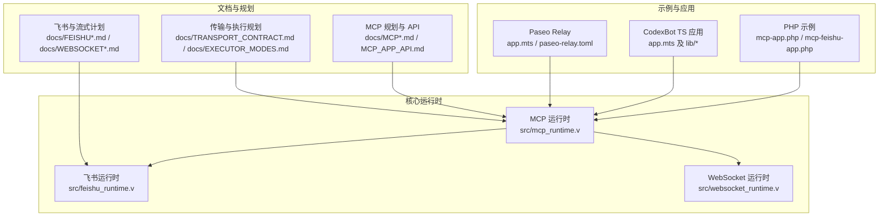
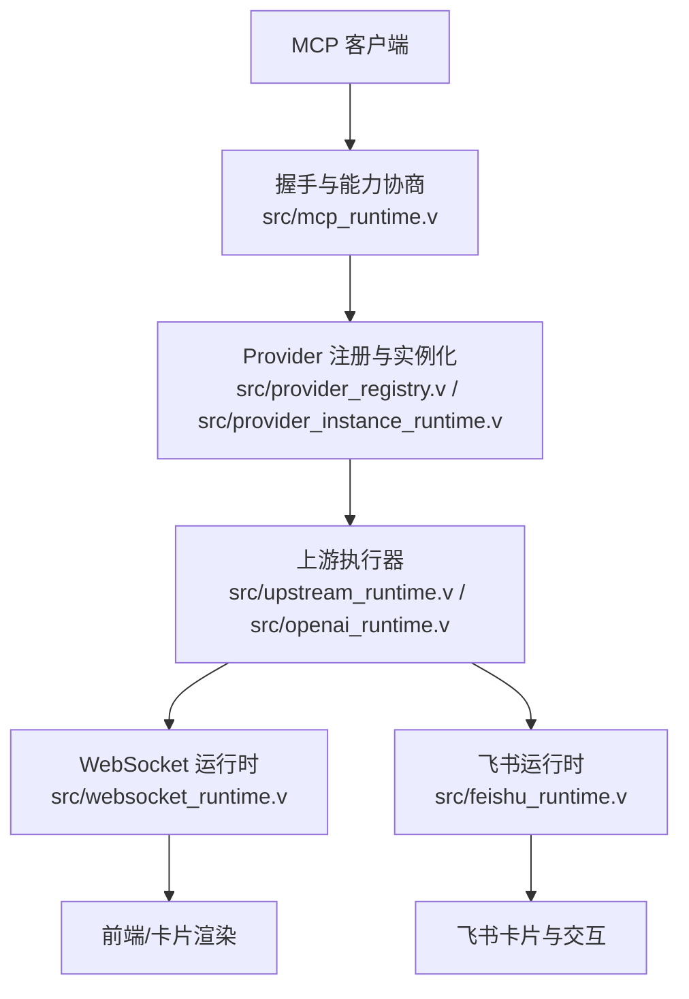
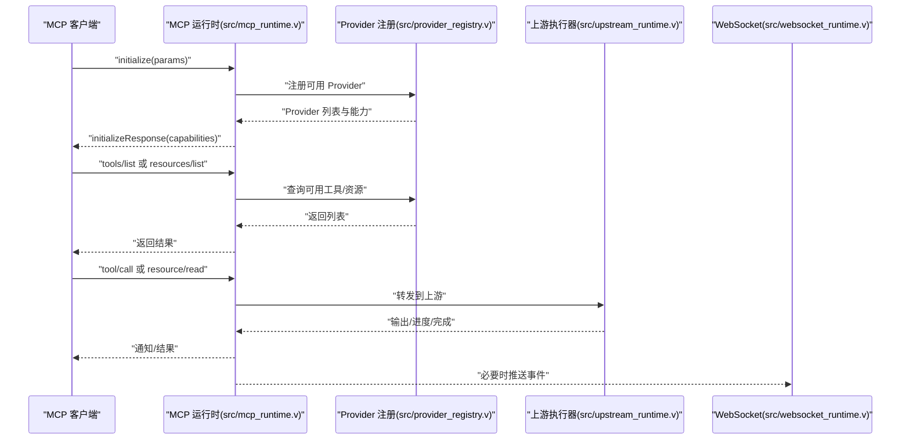
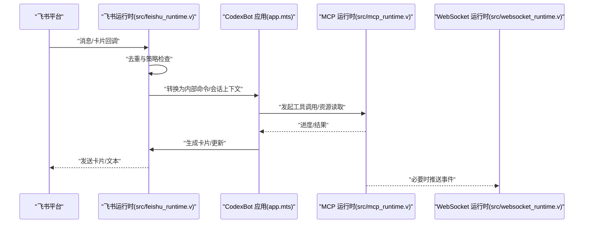
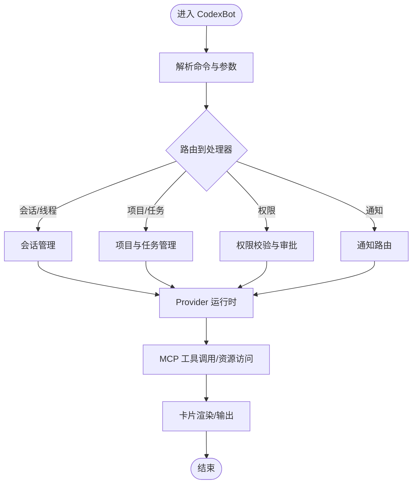
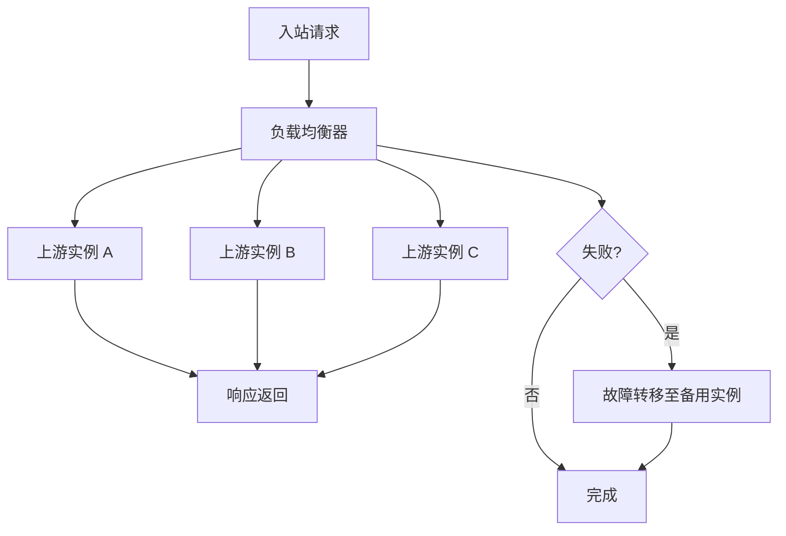
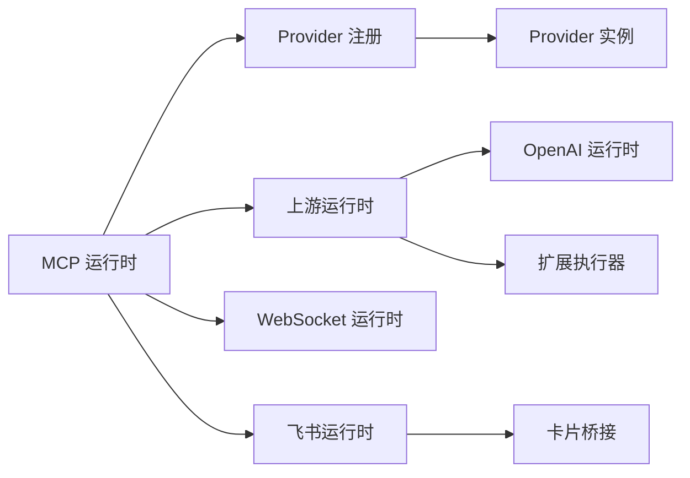

# MCP 应用示例

<cite>
**本文引用的文件**
- [docs/MCP.md](file://docs/MCP.md)
- [docs/MCP_APP_API.md](file://docs/MCP_APP_API.md)
- [docs/MCP_RUNBOOK.md](file://docs/MCP_RUNBOOK.md)
- [examples/mcp-app.php](file://examples/mcp-app.php)
- [examples/mcp-feishu-app.php](file://examples/mcp-feishu-app.php)
- [src/mcp_runtime.v](file://src/mcp_runtime.v)
- [examples/paseo-relay/app.mts](file://examples/paseo-relay/app.mts)
- [examples/paseo-relay/paseo-relay.toml](file://examples/paseo-relay/paseo-relay.toml)
- [examples/codexbot-app/app.php](file://examples/codexbot-app/app.php)
- [examples/codexbot-app/codexbot.toml](file://examples/codexbot-app/codexbot.toml)
- [examples/codexbot-app-ts/lib/codex.mts](file://examples/codexbot-app-ts/lib/codex.mts)
- [examples/codexbot-app-ts/lib/bot-runtime.mjs](file://examples/codexbot-app-ts/lib/bot-runtime.mjs)
- [examples/codexbot-app-ts/lib/commands.mts](file://examples/codexbot-app-ts/lib/commands.mts)
- [examples/codexbot-app-ts/lib/project-admin-commands.mjs](file://examples/codexbot-app-ts/lib/project-admin-commands.mjs)
- [examples/codexbot-app-ts/lib/thread-task-commands.mjs](file://examples/codexbot-app-ts/lib/thread-task-commands.mjs)
- [examples/codexbot-app-ts/lib/provider-runtime.mjs](file://examples/codexbot-app-ts/lib/provider-runtime.mjs)
- [examples/codexbot-app-ts/lib/command-router.mjs](file://examples/codexbot-app-ts/lib/command-router.mjs)
- [examples/codexbot-app-ts/lib/notification-router.mjs](file://examples/codexbot-app-ts/lib/notification-router.mjs)
- [examples/codexbot-app-ts/lib/session-commands.mjs](file://examples/codexbot-app-ts/lib/session-commands.mjs)
- [examples/codexbot-app-ts/lib/ui-text.mts](file://examples/codexbot-app-ts/lib/ui-text.mts)
- [examples/codexbot-app-ts/feishu/inbound.mts](file://examples/codexbot-app-ts/feishu/inbound.mts)
- [examples/codexbot-app-ts/feishu/dedupe.mts](file://examples/codexbot-app-ts/feishu/dedupe.mts)
- [examples/codexbot-app-ts/feishu/card-policy.mts](file://examples/codexbot-app-ts/feishu/card-policy.mts)
- [examples/codexbot-app-ts/config/config.mts](file://examples/codexbot-app-ts/config/config.mts)
- [examples/codexbot-app-ts/config/provider-config.mts](file://examples/codexbot-app-ts/config/provider-config.mts)
- [examples/codexbot-app-ts/app.mts](file://examples/codexbot-app-ts/app.mts)
- [examples/codexbot-app-ts/README.md](file://examples/codexbot-app-ts/README.md)
- [articles/07-feishu-bot.md](file://articles/07-feishu-bot.md)
- [articles/09-codexbot.md](file://articles/09-codexbot.md)
- [docs/PASEO_RELAY_VHTTPD_PLAN.md](file://docs/PASEO_RELAY_VHTTPD_PLAN.md)
- [docs/FEISHU_GATEWAY_REMOVAL_PLAN.md](file://docs/FEISHU_GATEWAY_REMOVAL_PLAN.md)
- [docs/FEISHU_RUNTIME_COMPATIBILITY_PLAN.md](file://docs/FEISHU_RUNTIME_COMPATIBILITY_PLAN.md)
- [docs/FEISHU_STREAMING_CARD_PLAN.md](file://docs/FEISHU_STREAMING_CARD_PLAN.md)
- [docs/WEBSOCKET_EVENT_BUS_PLAN.md](file://docs/WEBSOCKET_EVENT_BUS_PLAN.md)
- [docs/WEBSOCKET_MESSAGE_DISPATCH_PLAN.md](file://docs/WEBSOCKET_MESSAGE_DISPATCH_PLAN.md)
- [docs/WEBSOCKET_MVP_PLAN.md](file://docs/WEBSOCKET_MVP_PLAN.md)
- [docs/WEBSOCKET_PHASE2_IMPLEMENTATION_PLAN.md](file://docs/WEBSOCKET_PHASE2_IMPLEMENTATION_PLAN.md)
- [docs/WEBSOCKET_UPSTREAM_PLAN.md](file://docs/WEBSOCKET_UPSTREAM_PLAN.md)
- [docs/EXECUTOR_MODES.md](file://docs/EXECUTOR_MODES.md)
- [docs/RUNTIME_MODULE_MAP.md](file://docs/RUNTIME_MODULE_MAP.md)
- [docs/SITE_CONFIG_DSL.md](file://docs/SITE_CONFIG_DSL.md)
- [docs/TRANSPORT_CONTRACT.md](file://docs/TRANSPORT_CONTRACT.md)
- [docs/INTERNAL_HOST_SOCKET_PROTOCOL.md](file://docs/INTERNAL_HOST_SOCKET_PROTOCOL.md)
- [docs/COMMAND_CONTRACT_INVENTORY.md](file://docs/COMMAND_CONTRACT_INVENTORY.md)
- [docs/OPENAI_AGGREGATION_GATEWAY_PLAN.md](file://docs/OPENAI_AGGREGATION_GATEWAY_PLAN.md)
- [docs/OBSERVABILITY.md](file://docs/OBSERVABILITY.md)
- [docs/VEB_REUSE_1_1_PLAN.md](file://docs/VEB_REUSE_1_1_PLAN.md)
- [docs/VJSX_FACADE_REFERENCE.md](file://docs/VJSX_FACADE_REFERENCE.md)
- [docs/STREAM_PHASE2_IMPLEMENTATION_PLAN.md](file://docs/STREAM_PHASE2_IMPLEMENTATION_PLAN.md)
- [docs/STREAM_RUNTIME_PHASES.md](file://docs/STREAM_RUNTIME_PHASES.md)
- [docs/STRUCT_RELATIONSHIP_MAP.md](file://docs/STRUCT_RELATIONSHIP_MAP.md)
- [docs/UPSTREAM_PLAN_PHASE3.md](file://docs/UPSTREAM_PLAN_PHASE3.md)
- [docs/COBOT_APPROVAL_TEST.md](file://docs/COBOT_APPROVAL_TEST.md)
- [docs/COBOT_CORE_TEST.md](file://docs/COBOT_CORE_TEST.md)
- [docs/COBOT_LIFECYCLE_TEST.md](file://docs/COBOT_LIFECYCLE_TEST.md)
- [docs/COBOT_PROJECTS_TEST.md](file://docs/COBOT_PROJECTS_TEST.md)
- [docs/COBOT_READ_RPC_TEST.md](file://docs/COBOT_READ_RPC_TEST.md)
- [docs/COBOT_SEMANTICS_TEST.md](file://docs/COBOT_SEMANTICS_TEST.md)
- [docs/COBOT_THREADS_TEST.md](file://docs/COBOT_THREADS_TEST.md)
- [docs/COBOT_TEST_HELPERS.md](file://docs/COBOT_TEST_HELPERS.md)
- [src/inproc_vjsx_executor_codexbot_approval_test.v](file://src/inproc_vjsx_executor_codexbot_approval_test.v)
- [src/inproc_vjsx_executor_codexbot_core_test.v](file://src/inproc_vjsx_executor_codexbot_core_test.v)
- [src/inproc_vjsx_executor_codexbot_lifecycle_test.v](file://src/inproc_vjsx_executor_codexbot_lifecycle_test.v)
- [src/inproc_vjsx_executor_codexbot_projects_test.v](file://src/inproc_vjsx_executor_codexbot_projects_test.v)
- [src/inproc_vjsx_executor_codexbot_read_rpc_test.v](file://src/inproc_vjsx_executor_codexbot_read_rpc_test.v)
- [src/inproc_vjsx_executor_codexbot_semantics_test.v](file://src/inproc_vjsx_executor_codexbot_semantics_test.v)
- [src/inproc_vjsx_executor_codexbot_threads_test.v](file://src/inproc_vjsx_executor_codexbot_threads_test.v)
- [src/inproc_vjsx_executor_feishu_cb_app_test.v](file://src/inproc_vjsx_executor_feishu_cb_app_test.v)
- [src/inproc_vjsx_executor_http_fetch_test.v](file://src/inproc_vjsx_executor_http_fetch_test.v)
- [src/inproc_vjsx_executor_test.v](file://src/inproc_vjsx_executor_test.v)
- [src/inproc_vjsx_host_api_test.v](file://src/inproc_vjsx_host_api_test.v)
- [src/inproc_vjsx_startup_sequence_test.v](file://src/inproc_vjsx_startup_sequence_test.v)
- [src/inproc_vjsx_warmup_test.v](file://src/inproc_vjsx_warmup_test.v)
- [src/inproc_vjsx_executor_codexbot_test_helpers.v](file://src/inproc_vjsx_executor_codexbot_test_helpers.v)
- [src/feishu_runtime.v](file://src/feishu_runtime.v)
- [src/feishu_runtime_test.v](file://src/feishu_runtime_test.v)
- [src/feishu_card_bridge.v](file://src/feishu_card_bridge.v)
- [src/websocket_runtime.v](file://src/websocket_runtime.v)
- [src/websocket_upstream_runtime.v](file://src/websocket_upstream_runtime.v)
- [src/websocket_upstream_runtime_test.v](file://src/websocket_upstream_runtime_test.v)
- [src/websocket_dispatch_lifecycle_test.v](file://src/websocket_dispatch_lifecycle_test.v)
- [src/websocket_binary_support_test.v](file://src/websocket_binary_support_test.v)
- [src/openai_runtime.v](file://src/openai_runtime.v)
- [src/openai_runtime_test.v](file://src/openai_runtime_test.v)
- [src/openai_gateway_integration_test.v](file://src/openai_gateway_integration_test.v)
- [src/admin_runtime.v](file://src/admin_runtime.v)
- [src/admin_server.v](file://src/admin_server.v)
- [src/admin_workers.v](file://src/admin_workers.v)
- [src/server.v](file://src/server.v)
- [src/server_runtime_config.v](file://src/server_runtime_config.v)
- [src/server_runtime_orchestrator.v](file://src/server_runtime_orchestrator.v)
- [src/multi_server_runtime_config.v](file://src/multi_server_runtime_config.v)
- [src/multi_server_runtime_orchestrator.v](file://src/multi_server_runtime_orchestrator.v)
- [src/kernel_dispatch.v](file://src/kernel_dispatch.v)
- [src/kernel_dispatch_test.v](file://src/kernel_dispatch_test.v)
- [src/command.v](file://src/command.v)
- [src/command_executor.v](file://src/command_executor.v)
- [src/command_executor_test.v](file://src/command_executor_test.v)
- [src/command_handlers.v](file://src/command_handlers.v)
- [src/command_test.v](file://src/command_test.v)
- [src/transport/worker_protocol.v](file://src/transport/worker_protocol.v)
- [src/transport/worker_pool.v](file://src/transport/worker_pool.v)
- [src/transport/worker_framing.v](file://src/transport/worker_framing.v)
- [src/transport/session_handle.v](file://src/transport/session_handle.v)
- [src/transport/transport_handle.v](file://src/transport/transport_handle.v)
- [src/executor_bridge.v](file://src/executor_bridge.v)
- [src/executor_config.v](file://src/executor_config.v)
- [src/executor_lifecycle.v](file://src/executor_lifecycle.v)
- [src/executor_runtime_plan.v](file://src/executor_runtime_plan.v)
- [src/executor_spec.v](file://src/executor_spec.v)
- [src/app_runtime_builder.v](file://src/app_runtime_builder.v)
- [src/app_states.v](file://src/app_states.v)
- [src/codex_runtime.v](file://src/codex_runtime.v)
- [src/codex_runtime_test.v](file://src/codex_runtime_test.v)
- [src/state_store/state_store.v](file://src/state_store/state_store.v)
- [src/state_store/state_store_test.v](file://src/state_store/state_store_test.v)
- [src/jsonutils/json_utils.v](file://src/jsonutils/json_utils.v)
- [src/jsonutils/json_utils_test.v](file://src/jsonutils/json_utils_test.v)
- [src/logging/runtime_logger.v](file://src/logging/runtime_logger.v)
- [src/provider_registry.v](file://src/provider_registry.v)
- [src/provider_registry_test.v](file://src/provider_registry_test.v)
- [src/provider_bootstrap.v](file://src/provider_bootstrap.v)
- [src/provider_bootstrap_test.v](file://src/provider_bootstrap_test.v)
- [src/provider_config.v](file://src/provider_config.v)
- [src/provider_instance_runtime.v](file://src/provider_instance_runtime.v)
- [src/provider_spec.v](file://src/provider_spec.v)
- [src/plugin_runtime.v](file://src/plugin_runtime.v)
- [src/upstream_runtime.v](file://src/upstream_runtime.v)
- [src/stream_runtime.v](file://src/stream_runtime.v)
- [src/main.v](file://src/main.v)
- [src/test_sqlite_support.v](file://src/test_sqlite_support.v)
- [vhttpd.toml](file://vhttpd.toml)
- [config/vhttpd.example.toml](file://config/vhttpd.example.toml)
- [config/vhttpd.multi.example.toml](file://config/vhttpd.multi.example.toml)
- [config/vhttpd.vjsx.example.toml](file://config/vhttpd.vjsx.example.toml)
</cite>

## 目录
1. [简介](#简介)
2. [项目结构](#项目结构)
3. [核心组件](#核心组件)
4. [架构总览](#架构总览)
5. [详细组件分析](#详细组件分析)
6. [依赖关系分析](#依赖关系分析)
7. [性能考量](#性能考量)
8. [故障排查指南](#故障排查指南)
9. [结论](#结论)
10. [附录](#附录)

## 简介
本文件面向 AI 应用开发者与企业集成工程师，系统化梳理 vhttpd 中的 MCP（Model Context Protocol）应用示例与实现，覆盖以下主题：
- MCP 协议核心概念：服务器发现、资源访问、提示工程
- MCP 客户端与服务端实现差异：握手、消息传递、状态管理
- Feishu 机器人与 MCP 的结合：企业级消息通道与卡片交互
- CodexBot 复杂应用：项目管理、权限控制、协作与通知路由
- Paseo Relay 代理：请求转发、负载均衡与故障转移
- 配置、调试、测试与部署最佳实践

## 项目结构
vhttpd 提供了多语言与多运行时的 MCP 示例与基础设施，核心目录与文件如下：
- 文档与规划：docs/MCP*.md、docs/PASEO*.md、docs/WEBSOCKET*.md 等
- PHP 示例：examples/mcp-app.php、examples/mcp-feishu-app.php
- TypeScript/CodexBot：examples/codexbot-app-ts 及其子模块
- Paseo Relay：examples/paseo-relay
- 核心运行时：src/mcp_runtime.v、src/feishu_runtime.v、src/websocket_runtime.v 等
- 配置样例：config/*.toml、vhttpd.toml

**图表来源**
- [src/mcp_runtime.v](file://src/mcp_runtime.v)
- [src/feishu_runtime.v](file://src/feishu_runtime.v)
- [src/websocket_runtime.v](file://src/websocket_runtime.v)
- [docs/MCP.md](file://docs/MCP.md)
- [docs/MCP_APP_API.md](file://docs/MCP_APP_API.md)
- [docs/FEISHU_STREAMING_CARD_PLAN.md](file://docs/FEISHU_STREAMING_CARD_PLAN.md)
- [docs/WEBSOCKET_MESSAGE_DISPATCH_PLAN.md](file://docs/WEBSOCKET_MESSAGE_DISPATCH_PLAN.md)
- [docs/TRANSPORT_CONTRACT.md](file://docs/TRANSPORT_CONTRACT.md)
- [docs/EXECUTOR_MODES.md](file://docs/EXECUTOR_MODES.md)
- [examples/mcp-app.php](file://examples/mcp-app.php)
- [examples/mcp-feishu-app.php](file://examples/mcp-feishu-app.php)
- [examples/codexbot-app-ts/app.mts](file://examples/codexbot-app-ts/app.mts)
- [examples/paseo-relay/app.mts](file://examples/paseo-relay/app.mts)

**章节来源**
- [docs/MCP.md](file://docs/MCP.md)
- [docs/MCP_APP_API.md](file://docs/MCP_APP_API.md)
- [docs/MCP_RUNBOOK.md](file://docs/MCP_RUNBOOK.md)
- [examples/mcp-app.php](file://examples/mcp-app.php)
- [examples/mcp-feishu-app.php](file://examples/mcp-feishu-app.php)
- [src/mcp_runtime.v](file://src/mcp_runtime.v)

## 核心组件
- MCP 运行时：负责 MCP 协议的初始化、能力协商、资源访问与工具调用分发。
- 飞书运行时：桥接飞书消息与 MCP，支持卡片渲染、去重与策略控制。
- WebSocket 运行时：提供事件总线与消息分发，支撑实时协作与通知。
- CodexBot 应用：基于 TS 的复杂应用，包含命令路由、会话管理、项目与任务管理、权限与审批流程等。
- Paseo Relay：代理层，实现上游请求转发、粘性会话与故障转移。

**章节来源**
- [src/mcp_runtime.v](file://src/mcp_runtime.v)
- [src/feishu_runtime.v](file://src/feishu_runtime.v)
- [src/websocket_runtime.v](file://src/websocket_runtime.v)
- [examples/codexbot-app-ts/app.mts](file://examples/codexbot-app-ts/app.mts)
- [examples/paseo-relay/app.mts](file://examples/paseo-relay/app.mts)

## 架构总览
下图展示了 MCP 在 vhttpd 中的整体架构：客户端通过 MCP 握手与能力协商接入；运行时根据配置选择上游（如 OpenAI、本地模型或自定义 Provider），并通过 WebSocket 或飞书进行消息与卡片交互。

**图表来源**
- [src/mcp_runtime.v](file://src/mcp_runtime.v)
- [src/provider_registry.v](file://src/provider_registry.v)
- [src/provider_instance_runtime.v](file://src/provider_instance_runtime.v)
- [src/upstream_runtime.v](file://src/upstream_runtime.v)
- [src/openai_runtime.v](file://src/openai_runtime.v)
- [src/websocket_runtime.v](file://src/websocket_runtime.v)
- [src/feishu_runtime.v](file://src/feishu_runtime.v)

## 详细组件分析

### MCP 协议与运行时
- 协议核心：握手、能力协商、资源枚举/访问、工具调用与进度通知。
- 运行时职责：解析初始化参数、注册 Provider、建立上游连接、分发请求与回传响应。
- 能力协商：在握手阶段确定可用资源、工具与通知类型，避免后续不兼容。
- 状态管理：维护会话状态、工具调用状态与进度通知，确保客户端可见性。

**图表来源**
- [src/mcp_runtime.v](file://src/mcp_runtime.v)
- [src/provider_registry.v](file://src/provider_registry.v)
- [src/provider_instance_runtime.v](file://src/provider_instance_runtime.v)
- [src/upstream_runtime.v](file://src/upstream_runtime.v)
- [src/websocket_runtime.v](file://src/websocket_runtime.v)

**章节来源**
- [docs/MCP.md](file://docs/MCP.md)
- [docs/MCP_APP_API.md](file://docs/MCP_APP_API.md)
- [src/mcp_runtime.v](file://src/mcp_runtime.v)
- [src/provider_registry.v](file://src/provider_registry.v)
- [src/provider_instance_runtime.v](file://src/provider_instance_runtime.v)
- [src/upstream_runtime.v](file://src/upstream_runtime.v)
- [src/websocket_runtime.v](file://src/websocket_runtime.v)

### Feishu 机器人与 MCP 集成
- 入站消息处理：接收飞书消息，去重与策略控制，转换为 MCP 请求。
- 卡片渲染：将工具输出或流式结果渲染为飞书卡片，支持交互按钮与更新。
- 会话与状态：维护用户会话与上下文，确保连续对话与状态一致性。

**图表来源**
- [src/feishu_runtime.v](file://src/feishu_runtime.v)
- [src/feishu_card_bridge.v](file://src/feishu_card_bridge.v)
- [examples/codexbot-app-ts/app.mts](file://examples/codexbot-app-ts/app.mts)
- [src/mcp_runtime.v](file://src/mcp_runtime.v)
- [src/websocket_runtime.v](file://src/websocket_runtime.v)

**章节来源**
- [articles/07-feishu-bot.md](file://articles/07-feishu-bot.md)
- [docs/FEISHU_GATEWAY_REMOVAL_PLAN.md](file://docs/FEISHU_GATEWAY_REMOVAL_PLAN.md)
- [docs/FEISHU_RUNTIME_COMPATIBILITY_PLAN.md](file://docs/FEISHU_RUNTIME_COMPATIBILITY_PLAN.md)
- [docs/FEISHU_STREAMING_CARD_PLAN.md](file://docs/FEISHU_STREAMING_CARD_PLAN.md)
- [src/feishu_runtime.v](file://src/feishu_runtime.v)
- [src/feishu_card_bridge.v](file://src/feishu_card_bridge.v)
- [examples/codexbot-app-ts/feishu/inbound.mts](file://examples/codexbot-app-ts/feishu/inbound.mts)
- [examples/codexbot-app-ts/feishu/dedupe.mts](file://examples/codexbot-app-ts/feishu/dedupe.mts)
- [examples/codexbot-app-ts/feishu/card-policy.mts](file://examples/codexbot-app-ts/feishu/card-policy.mts)

### CodexBot 应用：项目管理、权限与协作
- 命令路由：将用户输入解析为具体命令，分派至相应处理器。
- 会话与线程：维护对话上下文与线程生命周期，支持多轮协作。
- 项目与任务：围绕项目维度进行权限控制、任务分配与状态跟踪。
- 通知路由：将系统通知与工具调用结果推送到飞书卡片或 WebSocket。
- Provider 运行时：抽象上游能力，统一工具调用与资源访问。

**图表来源**
- [examples/codexbot-app-ts/lib/commands.mts](file://examples/codexbot-app-ts/lib/commands.mts)
- [examples/codexbot-app-ts/lib/session-commands.mjs](file://examples/codexbot-app-ts/lib/session-commands.mjs)
- [examples/codexbot-app-ts/lib/project-admin-commands.mjs](file://examples/codexbot-app-ts/lib/project-admin-commands.mjs)
- [examples/codexbot-app-ts/lib/thread-task-commands.mjs](file://examples/codexbot-app-ts/lib/thread-task-commands.mjs)
- [examples/codexbot-app-ts/lib/command-router.mjs](file://examples/codexbot-app-ts/lib/command-router.mjs)
- [examples/codexbot-app-ts/lib/notification-router.mjs](file://examples/codexbot-app-ts/lib/notification-router.mjs)
- [examples/codexbot-app-ts/lib/provider-runtime.mjs](file://examples/codexbot-app-ts/lib/provider-runtime.mjs)
- [examples/codexbot-app-ts/lib/bot-runtime.mjs](file://examples/codexbot-app-ts/lib/bot-runtime.mjs)
- [examples/codexbot-app-ts/lib/ui-text.mts](file://examples/codexbot-app-ts/lib/ui-text.mts)

**章节来源**
- [articles/09-codexbot.md](file://articles/09-codexbot.md)
- [examples/codexbot-app-ts/app.mts](file://examples/codexbot-app-ts/app.mts)
- [examples/codexbot-app-ts/lib/commands.mts](file://examples/codexbot-app-ts/lib/commands.mts)
- [examples/codexbot-app-ts/lib/command-router.mjs](file://examples/codexbot-app-ts/lib/command-router.mjs)
- [examples/codexbot-app-ts/lib/notification-router.mjs](file://examples/codexbot-app-ts/lib/notification-router.mjs)
- [examples/codexbot-app-ts/lib/provider-runtime.mjs](file://examples/codexbot-app-ts/lib/provider-runtime.mjs)
- [examples/codexbot-app-ts/lib/bot-runtime.mjs](file://examples/codexbot-app-ts/lib/bot-runtime.mjs)
- [examples/codexbot-app-ts/lib/session-commands.mjs](file://examples/codexbot-app-ts/lib/session-commands.mjs)
- [examples/codexbot-app-ts/lib/project-admin-commands.mjs](file://examples/codexbot-app-ts/lib/project-admin-commands.mjs)
- [examples/codexbot-app-ts/lib/thread-task-commands.mjs](file://examples/codexbot-app-ts/lib/thread-task-commands.mjs)
- [examples/codexbot-app-ts/lib/ui-text.mts](file://examples/codexbot-app-ts/lib/ui-text.mts)

### Paseo Relay 代理：转发、负载均衡与故障转移
- 请求转发：根据配置将请求转发到后端上游，支持粘性会话与无状态转发。
- 负载均衡：在多个上游实例间分配请求，提升吞吐与可用性。
- 故障转移：检测上游异常并自动切换到备用实例，保障连续性。
- 配置驱动：通过 TOML 配置定义上游集合、权重与健康检查策略。

**图表来源**
- [examples/paseo-relay/app.mts](file://examples/paseo-relay/app.mts)
- [examples/paseo-relay/paseo-relay.toml](file://examples/paseo-relay/paseo-relay.toml)
- [docs/PASEO_RELAY_VHTTPD_PLAN.md](file://docs/PASEO_RELAY_VHTTPD_PLAN.md)

**章节来源**
- [examples/paseo-relay/app.mts](file://examples/paseo-relay/app.mts)
- [examples/paseo-relay/paseo-relay.toml](file://examples/paseo-relay/paseo-relay.toml)
- [docs/PASEO_RELAY_VHTTPD_PLAN.md](file://docs/PASEO_RELAY_VHTTPD_PLAN.md)

### PHP 示例：MCP 客户端与 Feishu 集成
- PHP 版本的 MCP 客户端示例，演示握手、工具调用与资源访问。
- 与飞书机器人的集成方式，展示企业级消息通道接入。

**章节来源**
- [examples/mcp-app.php](file://examples/mcp-app.php)
- [examples/mcp-feishu-app.php](file://examples/mcp-feishu-app.php)

## 依赖关系分析
- 组件耦合：MCP 运行时对 Provider 注册中心与上游执行器存在直接依赖；飞书与 WebSocket 运行时作为外部桥接模块被 MCP 调用。
- 执行模式：支持同步与异步执行，配合流式输出与卡片渲染。
- 测试覆盖：针对 MCP、飞书、CodexBot、Paseo Relay 的测试用例分布在对应模块中，确保关键路径稳定。

**图表来源**
- [src/mcp_runtime.v](file://src/mcp_runtime.v)
- [src/provider_registry.v](file://src/provider_registry.v)
- [src/provider_instance_runtime.v](file://src/provider_instance_runtime.v)
- [src/upstream_runtime.v](file://src/upstream_runtime.v)
- [src/openai_runtime.v](file://src/openai_runtime.v)
- [src/websocket_runtime.v](file://src/websocket_runtime.v)
- [src/feishu_runtime.v](file://src/feishu_runtime.v)
- [src/feishu_card_bridge.v](file://src/feishu_card_bridge.v)

**章节来源**
- [src/mcp_runtime.v](file://src/mcp_runtime.v)
- [src/provider_registry.v](file://src/provider_registry.v)
- [src/provider_instance_runtime.v](file://src/provider_instance_runtime.v)
- [src/upstream_runtime.v](file://src/upstream_runtime.v)
- [src/openai_runtime.v](file://src/openai_runtime.v)
- [src/websocket_runtime.v](file://src/websocket_runtime.v)
- [src/feishu_runtime.v](file://src/feishu_runtime.v)
- [src/feishu_card_bridge.v](file://src/feishu_card_bridge.v)

## 性能考量
- 并发与池化：工作池与帧协议优化消息吞吐，减少阻塞。
- 缓存与去重：飞书消息去重与卡片缓存降低重复计算与网络开销。
- 流式输出：WebSocket 与卡片流式渲染提升用户体验。
- 负载均衡与故障转移：Paseo Relay 的多实例与健康检查保障高可用。

**章节来源**
- [docs/TRANSPORT_CONTRACT.md](file://docs/TRANSPORT_CONTRACT.md)
- [docs/EXECUTOR_MODES.md](file://docs/EXECUTOR_MODES.md)
- [src/transport/worker_pool.v](file://src/transport/worker_pool.v)
- [src/transport/worker_framing.v](file://src/transport/worker_framing.v)
- [examples/codexbot-app-ts/feishu/dedupe.mts](file://examples/codexbot-app-ts/feishu/dedupe.mts)
- [examples/paseo-relay/app.mts](file://examples/paseo-relay/app.mts)

## 故障排查指南
- 日志与可观测性：启用运行时日志，定位握手、能力协商与上游调用问题。
- 测试用例：利用内置测试套件验证 MCP、飞书与 CodexBot 的关键流程。
- 配置核对：确认 TOML 配置项、上游地址与认证信息正确。
- 端到端验证：通过 PHP 示例与 TS 应用进行端到端回归。

**章节来源**
- [docs/OBSERVABILITY.md](file://docs/OBSERVABILITY.md)
- [src/logging/runtime_logger.v](file://src/logging/runtime_logger.v)
- [src/mcp_runtime.v](file://src/mcp_runtime.v)
- [src/feishu_runtime.v](file://src/feishu_runtime.v)
- [src/websocket_runtime.v](file://src/websocket_runtime.v)
- [src/inproc_vjsx_executor_codexbot_core_test.v](file://src/inproc_vjsx_executor_codexbot_core_test.v)
- [src/inproc_vjsx_executor_feishu_cb_app_test.v](file://src/inproc_vjsx_executor_feishu_cb_app_test.v)

## 结论
vhttpd 的 MCP 应用示例提供了从协议实现到企业级集成的完整路径：以 MCP 运行时为核心，结合飞书与 WebSocket 桥接，构建可扩展的 AI 应用生态。CodexBot 展示了复杂业务场景下的命令路由、权限与协作能力；Paseo Relay 提供了高可用的代理与负载均衡方案。通过完善的文档、测试与配置样例，开发者可以快速落地 MCP 驱动的企业级 AI 应用。

## 附录
- 配置参考：vhttpd.toml、config/vhttpd*.example.toml
- 运行时映射与站点配置 DSL：docs/RUNTIME_MODULE_MAP.md、docs/SITE_CONFIG_DSL.md
- 传输契约与内部主机协议：docs/TRANSPORT_CONTRACT.md、docs/INTERNAL_HOST_SOCKET_PROTOCOL.md
- 计划与路线图：docs/WEBSOCKET*.md、docs/FEISHU*.md、docs/PASEO*.md

**章节来源**
- [vhttpd.toml](file://vhttpd.toml)
- [config/vhttpd.example.toml](file://config/vhttpd.example.toml)
- [config/vhttpd.multi.example.toml](file://config/vhttpd.multi.example.toml)
- [config/vhttpd.vjsx.example.toml](file://config/vhttpd.vjsx.example.toml)
- [docs/RUNTIME_MODULE_MAP.md](file://docs/RUNTIME_MODULE_MAP.md)
- [docs/SITE_CONFIG_DSL.md](file://docs/SITE_CONFIG_DSL.md)
- [docs/TRANSPORT_CONTRACT.md](file://docs/TRANSPORT_CONTRACT.md)
- [docs/INTERNAL_HOST_SOCKET_PROTOCOL.md](file://docs/INTERNAL_HOST_SOCKET_PROTOCOL.md)
- [docs/WEBSOCKET_MVP_PLAN.md](file://docs/WEBSOCKET_MVP_PLAN.md)
- [docs/WEBSOCKET_PHASE2_IMPLEMENTATION_PLAN.md](file://docs/WEBSOCKET_PHASE2_IMPLEMENTATION_PLAN.md)
- [docs/WEBSOCKET_UPSTREAM_PLAN.md](file://docs/WEBSOCKET_UPSTREAM_PLAN.md)
- [docs/WEBSOCKET_EVENT_BUS_PLAN.md](file://docs/WEBSOCKET_EVENT_BUS_PLAN.md)
- [docs/WEBSOCKET_MESSAGE_DISPATCH_PLAN.md](file://docs/WEBSOCKET_MESSAGE_DISPATCH_PLAN.md)
- [docs/FEISHU_GATEWAY_REMOVAL_PLAN.md](file://docs/FEISHU_GATEWAY_REMOVAL_PLAN.md)
- [docs/FEISHU_RUNTIME_COMPATIBILITY_PLAN.md](file://docs/FEISHU_RUNTIME_COMPATIBILITY_PLAN.md)
- [docs/FEISHU_STREAMING_CARD_PLAN.md](file://docs/FEISHU_STREAMING_CARD_PLAN.md)
- [docs/PASEO_RELAY_VHTTPD_PLAN.md](file://docs/PASEO_RELAY_VHTTPD_PLAN.md)