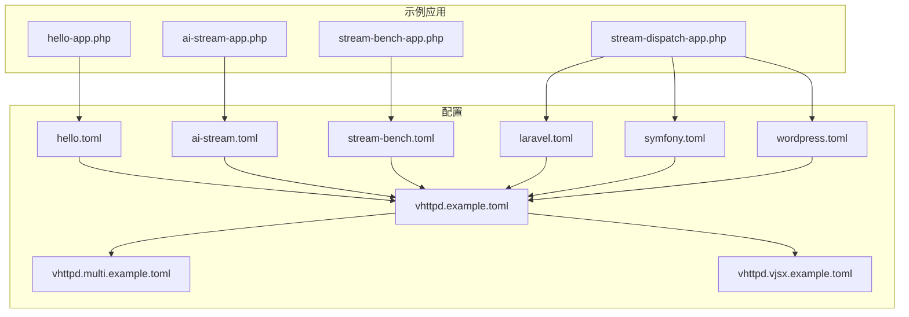
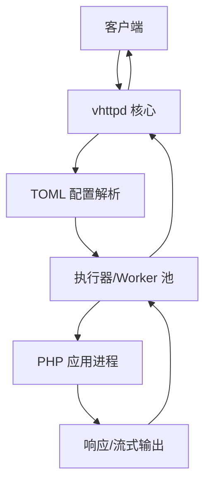
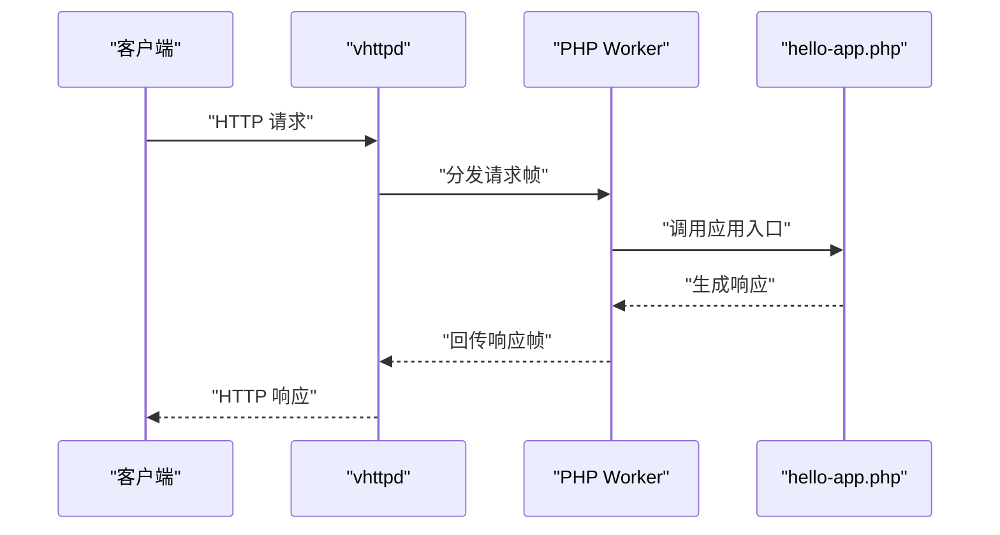
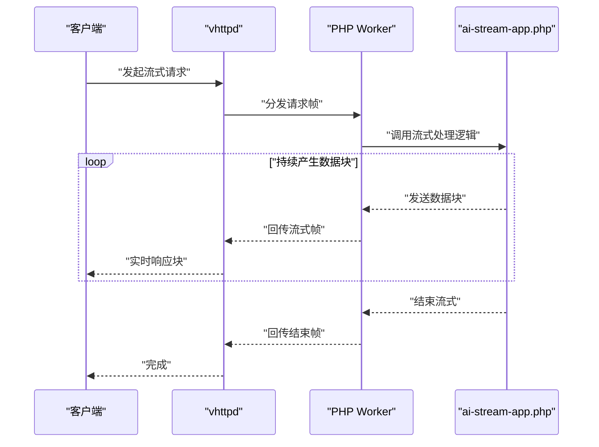
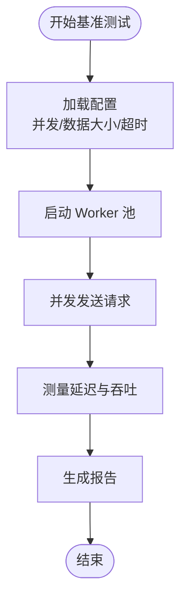
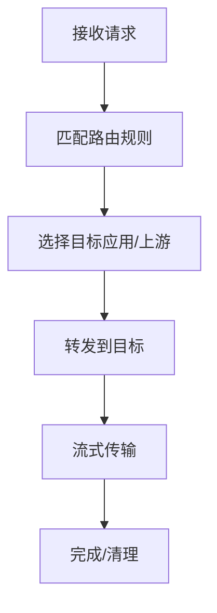
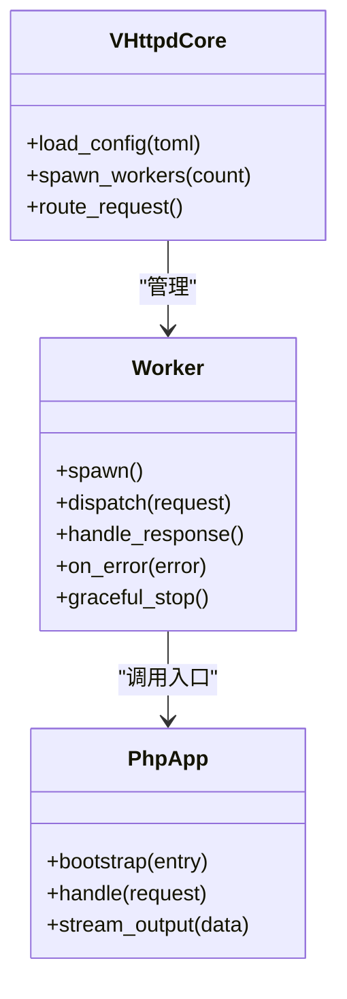
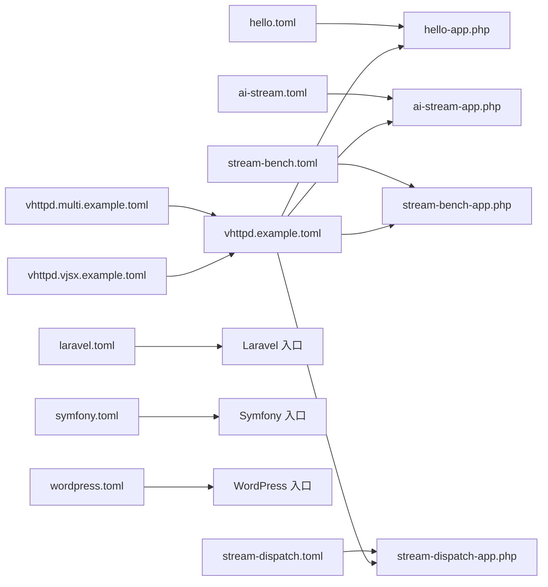

# PHP 应用示例

<cite>
**本文引用的文件**
- [hello-app.php](file://examples/hello-app.php)
- [ai-stream-app.php](file://examples/ai-stream-app.php)
- [stream-bench-app.php](file://examples/stream-bench-app.php)
- [stream-dispatch-app.php](file://examples/stream-dispatch-app.php)
- [vhttpd.example.toml](file://config/vhttpd.example.toml)
- [vhttpd.multi.example.toml](file://config/vhttpd.multi.example.toml)
- [vhttpd.vjsx.example.toml](file://config/vhttpd.vjsx.example.toml)
- [hello.toml](file://examples/config/hello.toml)
- [laravel.toml](file://examples/config/laravel.toml)
- [symfony.toml](file://examples/config/symfony.toml)
- [wordpress.toml](file://examples/config/wordpress.toml)
- [ai-stream.toml](file://examples/config/ai-stream.toml)
- [stream-bench.toml](file://examples/config/stream-bench.toml)
- [stream-dispatch.toml](file://examples/config/stream-dispatch.toml)
- [run_demo.sh](file://examples/run_demo.sh)
- [README.md](file://examples/README.md)
- [README.md](file://articles/03-php-apps.md)
- [README.md](file://articles/04-ai-streaming.md)
- [README.md](file://README.md)
</cite>

## 目录
1. [简介](#简介)
2. [项目结构](#项目结构)
3. [核心组件](#核心组件)
4. [架构总览](#架构总览)
5. [详细组件分析](#详细组件分析)
6. [依赖关系分析](#依赖关系分析)
7. [性能考量](#性能考量)
8. [故障排查指南](#故障排查指南)
9. [结论](#结论)
10. [附录](#附录)

## 简介
本教程面向 PHP 开发者，系统讲解如何在 vhttpd 中集成传统 PHP 应用与现代框架（如 Laravel、Symfony、WordPress），并深入演示 AI 流式处理应用的实现、性能基准测试以及调度应用的配置。同时，我们将解析 PHP Worker 执行器的工作原理，包括进程管理、请求处理与错误处理机制，并提供配置文件、运行步骤、调试技巧与最佳实践，帮助你从入门到高级逐步掌握。

## 项目结构
vhttpd 示例工程包含多个 PHP 应用与对应的配置文件，覆盖从“Hello World”到复杂框架与 AI 流式场景的全栈示例。主要目录与文件如下：
- examples/hello-app.php：最简 PHP 入门示例
- examples/ai-stream-app.php：AI 流式响应示例
- examples/stream-bench-app.php：流式性能基准示例
- examples/stream-dispatch-app.php：流式分发调度示例
- examples/config/*.toml：各应用的 vhttpd 配置模板
- config/*.toml：vhttpd 主配置与多实例配置模板
- examples/run_demo.sh：一键运行示例脚本
- articles/03-php-apps.md、articles/04-ai-streaming.md：官方文章，提供背景与进阶说明
- README.md：项目总体说明

图表来源
- [hello-app.php](file://examples/hello-app.php)
- [ai-stream-app.php](file://examples/ai-stream-app.php)
- [stream-bench-app.php](file://examples/stream-bench-app.php)
- [stream-dispatch-app.php](file://examples/stream-dispatch-app.php)
- [hello.toml](file://examples/config/hello.toml)
- [ai-stream.toml](file://examples/config/ai-stream.toml)
- [stream-bench.toml](file://examples/config/stream-bench.toml)
- [laravel.toml](file://examples/config/laravel.toml)
- [symfony.toml](file://examples/config/symfony.toml)
- [wordpress.toml](file://examples/config/wordpress.toml)
- [vhttpd.example.toml](file://config/vhttpd.example.toml)
- [vhttpd.multi.example.toml](file://config/vhttpd.multi.example.toml)
- [vhttpd.vjsx.example.toml](file://config/vhttpd.vjsx.example.toml)

章节来源
- [README.md](file://README.md)
- [examples/README.md](file://examples/README.md)

## 核心组件
- PHP Worker 执行器：负责启动与管理 PHP 子进程，接收来自 vhttpd 的请求帧，转发至 PHP 应用并回传响应或流式数据。
- 应用适配层：通过 PSR-7 适配器与 vhttpd 协议对接，支持同步与流式响应。
- 配置系统：以 TOML 描述应用入口、工作进程数、上游服务等参数，支持单实例与多实例部署。
- 基准与调度：提供流式性能测试与分发调度示例，便于评估与优化。

章节来源
- [README.md](file://README.md)
- [articles/03-php-apps.md](file://articles/03-php-apps.md)
- [articles/04-ai-streaming.md](file://articles/04-ai-streaming.md)

## 架构总览
下图展示了 vhttpd 如何加载 PHP 应用与配置，以及请求在系统中的流转过程。

图表来源
- [vhttpd.example.toml](file://config/vhttpd.example.toml)
- [hello.toml](file://examples/config/hello.toml)
- [ai-stream.toml](file://examples/config/ai-stream.toml)
- [stream-bench.toml](file://examples/config/stream-bench.toml)
- [stream-dispatch.toml](file://examples/config/stream-dispatch.toml)

## 详细组件分析

### Hello 应用（hello-app.php）
- 功能概述：最简 PHP HTTP 应用，返回静态文本或简单 JSON，适合初学者理解 vhttpd 的 PHP 集成方式。
- 关键点：
  - 使用 PSR-7 适配器将 vhttpd 请求转换为 PHP 可用的请求对象。
  - 将响应写入输出流，支持同步返回。
- 运行与调试：
  - 在 examples/config/hello.toml 中配置入口文件与监听端口。
  - 使用 examples/run_demo.sh 启动示例。
  - 若出现路由或权限问题，检查配置文件与工作目录权限。

图表来源
- [hello-app.php](file://examples/hello-app.php)
- [hello.toml](file://examples/config/hello.toml)

章节来源
- [hello-app.php](file://examples/hello-app.php)
- [hello.toml](file://examples/config/hello.toml)
- [run_demo.sh](file://examples/run_demo.sh)

### AI 流式应用（ai-stream-app.php）
- 功能概述：演示如何在 PHP 中实现流式响应，适用于 AI 对话、日志实时推送等场景。
- 关键点：
  - 使用流式输出接口，按块发送数据，降低首字节延迟。
  - 支持中断与错误处理，确保客户端可感知异常。
- 性能与基准：
  - 结合 examples/config/ai-stream.toml 进行吞吐与延迟测试。
  - 参考 articles/04-ai-streaming.md 获取更多实现细节与优化建议。

图表来源
- [ai-stream-app.php](file://examples/ai-stream-app.php)
- [ai-stream.toml](file://examples/config/ai-stream.toml)

章节来源
- [ai-stream-app.php](file://examples/ai-stream-app.php)
- [ai-stream.toml](file://examples/config/ai-stream.toml)
- [articles/04-ai-streaming.md](file://articles/04-ai-streaming.md)

### 流式性能基准（stream-bench-app.php）
- 功能概述：用于评估 vhttpd + PHP 的流式吞吐与延迟表现，支持自定义并发与数据大小。
- 关键点：
  - 通过配置文件控制工作进程数、请求并发与数据块大小。
  - 输出吞吐量、P50/P95 延迟等指标，便于横向对比不同配置。
- 调试与优化：
  - 逐步调整 worker 数与内存限制，观察资源占用与性能拐点。
  - 关注 PHP 内存峰值与 GC 行为对流式稳定性的影响。

图表来源
- [stream-bench-app.php](file://examples/stream-bench-app.php)
- [stream-bench.toml](file://examples/config/stream-bench.toml)

章节来源
- [stream-bench-app.php](file://examples/stream-bench-app.php)
- [stream-bench.toml](file://examples/config/stream-bench.toml)

### 流式分发调度（stream-dispatch-app.php）
- 功能概述：演示如何在多应用或多上游之间进行流式分发与调度，适合构建网关或代理层。
- 关键点：
  - 基于路由规则选择后端应用或上游服务。
  - 统一处理流式头部、数据块与结束信号。
- 配置要点：
  - 在 examples/config/stream-dispatch.toml 中定义路由与上游映射。
  - 结合 vhttpd.multi.example.toml 实现多实例部署与负载均衡。

图表来源
- [stream-dispatch-app.php](file://examples/stream-dispatch-app.php)
- [stream-dispatch.toml](file://examples/config/stream-dispatch.toml)
- [vhttpd.multi.example.toml](file://config/vhttpd.multi.example.toml)

章节来源
- [stream-dispatch-app.php](file://examples/stream-dispatch-app.php)
- [stream-dispatch.toml](file://examples/config/stream-dispatch.toml)
- [vhttpd.multi.example.toml](file://config/vhttpd.multi.example.toml)

### 框架集成：Laravel、Symfony、WordPress
- Laravel 集成
  - 在 examples/config/laravel.toml 中配置入口文件与工作进程数。
  - 将 Laravel 的 public/index.php 作为入口，确保环境变量与 vendor 加载正确。
- Symfony 集成
  - 在 examples/config/symfony.toml 中配置入口文件与环境变量。
  - 将 Symfony 的 public/index.php 作为入口，注意缓存与静态资源处理。
- WordPress 集成
  - 在 examples/config/wordpress.toml 中配置入口文件与站点根目录。
  - 注意 wp-config.php 与 .htaccess/rewrite 规则在非 Apache 环境下的替代方案。

章节来源
- [laravel.toml](file://examples/config/laravel.toml)
- [symfony.toml](file://examples/config/symfony.toml)
- [wordpress.toml](file://examples/config/wordpress.toml)

### PHP Worker 执行器工作原理
- 进程管理
  - vhttpd 启动固定数量的 PHP Worker 进程，每个进程常驻以减少冷启动开销。
  - 支持热重启与优雅退出，避免请求丢失。
- 请求处理
  - vhttpd 将 HTTP 请求封装为内部帧，投递给 Worker。
  - Worker 通过 PSR-7 适配器还原请求上下文，调用应用入口。
  - 应用返回响应或触发流式输出，Worker 逐块回传给 vhttpd。
- 错误处理
  - 应用抛出异常或返回错误状态码时，Worker 记录日志并返回标准化错误响应。
  - 超时、OOM 或子进程崩溃会触发自动重启与告警。

图表来源
- [vhttpd.example.toml](file://config/vhttpd.example.toml)
- [hello.toml](file://examples/config/hello.toml)

章节来源
- [vhttpd.example.toml](file://config/vhttpd.example.toml)
- [articles/03-php-apps.md](file://articles/03-php-apps.md)

## 依赖关系分析
- 配置驱动：所有应用均通过 TOML 配置文件声明入口、工作进程数、上游与安全策略。
- 多实例支持：vhttpd.multi.example.toml 提供多实例部署模板，适合高可用与水平扩展。
- VJSX 集成：vhttpd.vjsx.example.toml 展示了与前端运行时的协同，便于构建混合型应用。

图表来源
- [hello.toml](file://examples/config/hello.toml)
- [ai-stream.toml](file://examples/config/ai-stream.toml)
- [stream-bench.toml](file://examples/config/stream-bench.toml)
- [stream-dispatch.toml](file://examples/config/stream-dispatch.toml)
- [laravel.toml](file://examples/config/laravel.toml)
- [symfony.toml](file://examples/config/symfony.toml)
- [wordpress.toml](file://examples/config/wordpress.toml)
- [vhttpd.example.toml](file://config/vhttpd.example.toml)
- [vhttpd.multi.example.toml](file://config/vhttpd.multi.example.toml)
- [vhttpd.vjsx.example.toml](file://config/vhttpd.vjsx.example.toml)

章节来源
- [vhttpd.example.toml](file://config/vhttpd.example.toml)
- [vhttpd.multi.example.toml](file://config/vhttpd.multi.example.toml)
- [vhttpd.vjsx.example.toml](file://config/vhttpd.vjsx.example.toml)

## 性能考量
- Worker 数量：根据 CPU 核心数与 IO 密集度设置，避免过多上下文切换。
- 内存与 GC：长连接与流式场景需关注内存回收，必要时手动释放大对象。
- 缓存与静态资源：将静态资源交由 vhttpd 直接服务，减少 PHP 处理开销。
- 并发模型：合理设置超时与队列长度，防止雪崩效应。
- 基准测试：使用 stream-bench-app.php 与对应配置进行回归测试，建立性能基线。

## 故障排查指南
- 启动失败
  - 检查 vhttpd.example.toml 与应用配置是否一致。
  - 确认入口文件路径与权限，确保 PHP 可执行。
- 请求无响应
  - 查看 Worker 日志，确认是否存在未捕获异常。
  - 检查上游服务连通性与超时设置。
- 流式中断
  - 确保应用正确发送结束帧，避免客户端阻塞。
  - 关注网络中断与客户端断开的处理逻辑。
- 性能退化
  - 分析 Worker 指标，定位瓶颈（CPU/IO/内存）。
  - 逐步缩小问题范围，结合基准测试验证修复效果。

章节来源
- [vhttpd.example.toml](file://config/vhttpd.example.toml)
- [articles/03-php-apps.md](file://articles/03-php-apps.md)
- [articles/04-ai-streaming.md](file://articles/04-ai-streaming.md)

## 结论
通过本教程，你已掌握在 vhttpd 中集成传统 PHP 应用与现代框架的方法，了解了 AI 流式处理的实现思路与性能基准测试流程，并熟悉了 PHP Worker 执行器的工作原理与最佳实践。建议在实际项目中结合配置模板与基准测试，持续优化性能与稳定性。

## 附录
- 快速开始
  - 克隆仓库并进入 examples 目录，执行 examples/run_demo.sh 启动示例。
  - 根据需要修改对应 TOML 配置，然后重新启动 vhttpd。
- 进阶阅读
  - articles/03-php-apps.md：PHP 应用集成与适配要点
  - articles/04-ai-streaming.md：AI 流式处理与优化策略
  - README.md：项目总体说明与贡献指南

章节来源
- [run_demo.sh](file://examples/run_demo.sh)
- [README.md](file://README.md)
- [articles/03-php-apps.md](file://articles/03-php-apps.md)
- [articles/04-ai-streaming.md](file://articles/04-ai-streaming.md)