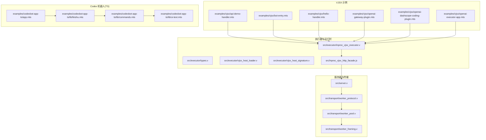
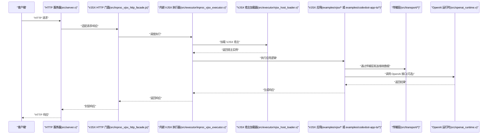
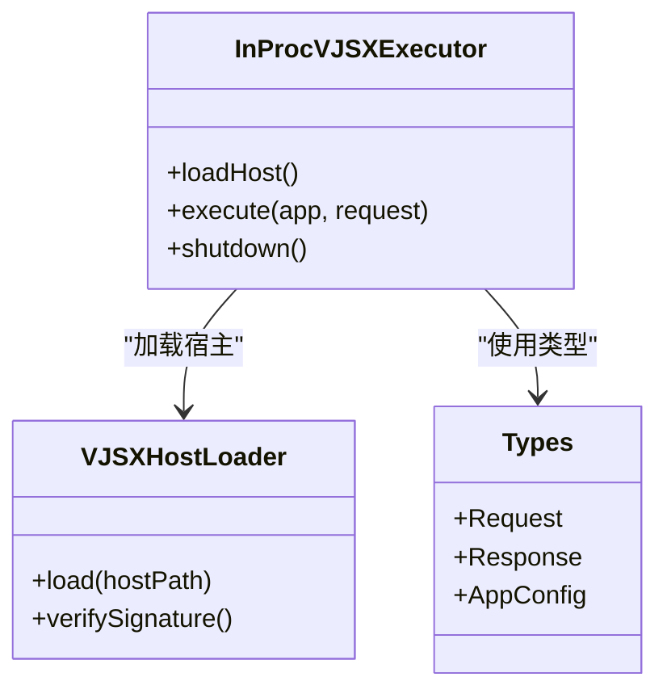
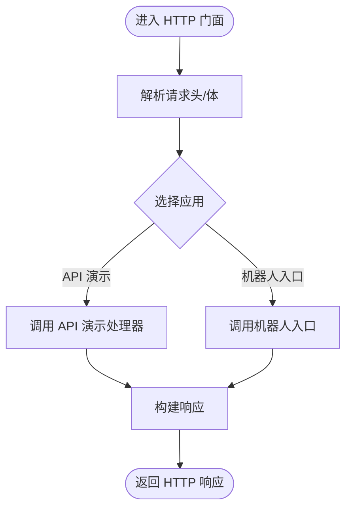
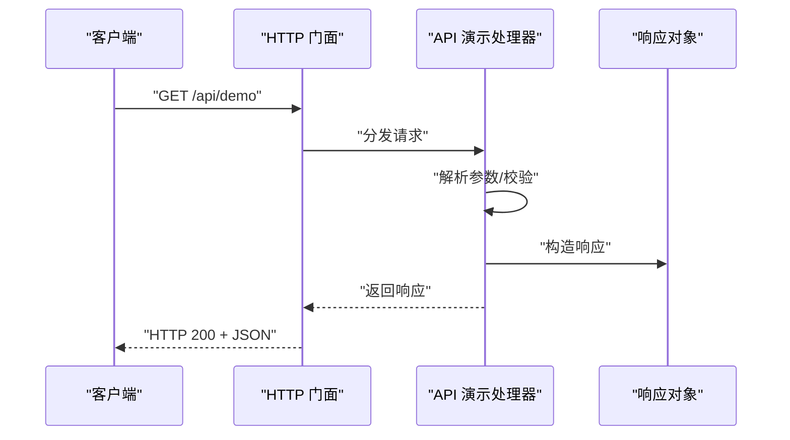
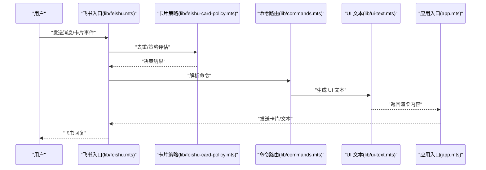
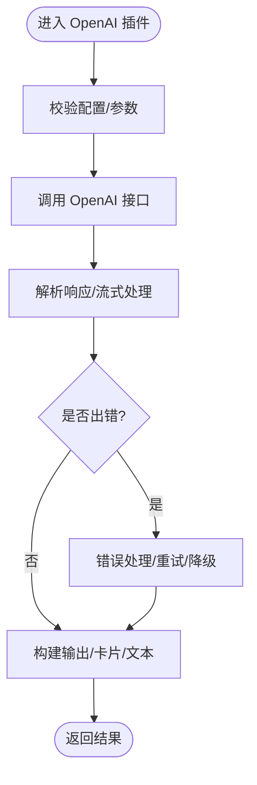
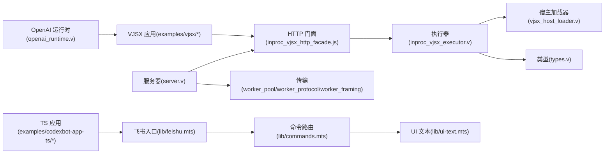

# VJSX 应用示例

<cite>
**本文引用的文件**
- [examples/vjsx/api-demo-handler.mts](file://examples/vjsx/api-demo-handler.mts)
- [examples/vjsx/bot-entry.mts](file://examples/vjsx/bot-entry.mts)
- [examples/vjsx/hello-handler.mts](file://examples/vjsx/hello-handler.mts)
- [examples/vjsx/openai-dashscope-coding-plugin.mts](file://examples/vjsx/openai-dashscope-coding-plugin.mts)
- [examples/vjsx/openai-executor-app.mts](file://examples/vjsx/openai-executor-app.mts)
- [examples/vjsx/openai-gateway-plugin.mts](file://examples/vjsx/openai-gateway-plugin.mts)
- [examples/codexbot-app-ts/app.mts](file://examples/codexbot-app-ts/app.mts)
- [examples/codexbot-app-ts/lib/codex.mts](file://examples/codexbot-app-ts/lib/codex.mts)
- [examples/codexbot-app-ts/lib/commands.mts](file://examples/codexbot-app-ts/lib/commands.mts)
- [examples/codexbot-app-ts/lib/feishu.mts](file://examples/codexbot-app-ts/lib/feishu.mts)
- [examples/codexbot-app-ts/lib/feishu-card-policy.mts](file://examples/codexbot-app-ts/lib/feishu-card-policy.mts)
- [examples/codexbot-app-ts/lib/feishu-session-helpers.mts](file://examples/codexbot-app-ts/lib/feishu-session-helpers.mts)
- [examples/codexbot-app-ts/lib/ui-text.mts](file://examples/codexbot-app-ts/lib/ui-text.mts)
- [src/inproc_vjsx_http_facade.js](file://src/inproc_vjsx_http_facade.js)
- [src/executor/inproc_vjsx_executor.v](file://src/executor/inproc_vjsx_executor.v)
- [src/executor/types.v](file://src/executor/types.v)
- [src/executor/vjsx_host_loader.v](file://src/executor/vjsx_host_loader.v)
- [src/executor/vjsx_host_signature.v](file://src/executor/vjsx_host_signature.v)
- [src/openai_runtime.v](file://src/openai_runtime.v)
- [src/plugin_runtime.v](file://src/plugin_runtime.v)
- [src/transport/worker_protocol.v](file://src/transport/worker_protocol.v)
- [src/transport/worker_pool.v](file://src/transport/worker_pool.v)
- [src/transport/worker_framing.v](file://src/transport/worker_framing.v)
- [src/transport/session_handle.v](file://src/transport/session_handle.v)
- [src/transport/transport_handle.v](file://src/transport/transport_handle.v)
- [src/admin_runtime.v](file://src/admin_runtime.v)
- [src/multi_server_runtime_config.v](file://src/multi_server_runtime_config.v)
- [src/multi_server_runtime_orchestrator.v](file://src/multi_server_runtime_orchestrator.v)
- [src/server_runtime_config.v](file://src/server_runtime_config.v)
- [src/server_runtime_orchestrator.v](file://src/server_runtime_orchestrator.v)
- [src/server.v](file://src/server.v)
- [src/main.v](file://src/main.v)
- [config/vjsx.example.toml](file://config/vjsx.example.toml)
- [examples/vjsx/hello-handler.mts.lane_0.vjsbuild/__vjs_runtime/dom_runtime.js](file://examples/vjsx/hello-handler.mts.lane_0.vjsbuild/__vjs_runtime/dom_runtime.js)
</cite>

## 目录
1. [简介](#简介)
2. [项目结构](#项目结构)
3. [核心组件](#核心组件)
4. [架构总览](#架构总览)
5. [详细组件分析](#详细组件分析)
6. [依赖关系分析](#依赖关系分析)
7. [性能考虑](#性能考虑)
8. [故障排查指南](#故障排查指南)
9. [结论](#结论)
10. [附录](#附录)

## 简介
本文件为 vhttpd 的 VJSX 应用示例提供面向前端与全栈开发者的 TypeScript/JavaScript 开发指南。重点涵盖：
- 内嵌 VJSX 执行器在 V 环境中的工作原理与调用链路
- 使用 TypeScript 构建智能对话机器人的完整流程（含飞书入口、卡片策略、会话助手）
- API 演示处理器的实现思路（RESTful API 创建与处理）
- OpenAI 集成插件的开发要点（请求封装、响应处理、错误管理）
- VJSX 应用的配置、构建流程、调试方法与性能优化建议

## 项目结构
本仓库包含多种语言与运行时的示例应用，其中与 VJSX 直接相关的关键目录如下：
- examples/vjsx：VJSX 示例应用（API 演示、机器人入口、OpenAI 插件等）
- examples/codexbot-app-ts：基于 TypeScript 的 Codex 机器人应用（飞书集成、命令路由、UI 文本渲染等）
- src/executor：VJSX 执行器与宿主加载逻辑（in-process VJSX 执行器、类型定义、宿主签名）
- src：服务器、运行时、传输层、插件与 OpenAI 运行时等核心模块
- config：示例配置（如 vjsx.example.toml）

图表来源
- [examples/vjsx/api-demo-handler.mts](file://examples/vjsx/api-demo-handler.mts)
- [examples/vjsx/bot-entry.mts](file://examples/vjsx/bot-entry.mts)
- [examples/vjsx/hello-handler.mts](file://examples/vjsx/hello-handler.mts)
- [examples/vjsx/openai-gateway-plugin.mts](file://examples/vjsx/openai-gateway-plugin.mts)
- [examples/vjsx/openai-dashscope-coding-plugin.mts](file://examples/vjsx/openai-dashscope-coding-plugin.mts)
- [examples/vjsx/openai-executor-app.mts](file://examples/vjsx/openai-executor-app.mts)
- [examples/codexbot-app-ts/app.mts](file://examples/codexbot-app-ts/app.mts)
- [examples/codexbot-app-ts/lib/feishu.mts](file://examples/codexbot-app-ts/lib/feishu.mts)
- [examples/codexbot-app-ts/lib/commands.mts](file://examples/codexbot-app-ts/lib/commands.mts)
- [examples/codexbot-app-ts/lib/ui-text.mts](file://examples/codexbot-app-ts/lib/ui-text.mts)
- [src/executor/inproc_vjsx_executor.v](file://src/executor/inproc_vjsx_executor.v)
- [src/executor/types.v](file://src/executor/types.v)
- [src/executor/vjsx_host_loader.v](file://src/executor/vjsx_host_loader.v)
- [src/executor/vjsx_host_signature.v](file://src/executor/vjsx_host_signature.v)
- [src/inproc_vjsx_http_facade.js](file://src/inproc_vjsx_http_facade.js)
- [src/server.v](file://src/server.v)
- [src/transport/worker_protocol.v](file://src/transport/worker_protocol.v)
- [src/transport/worker_pool.v](file://src/transport/worker_pool.v)
- [src/transport/worker_framing.v](file://src/transport/worker_framing.v)

章节来源
- [examples/vjsx/api-demo-handler.mts](file://examples/vjsx/api-demo-handler.mts)
- [examples/vjsx/bot-entry.mts](file://examples/vjsx/bot-entry.mts)
- [examples/vjsx/hello-handler.mts](file://examples/vjsx/hello-handler.mts)
- [examples/vjsx/openai-gateway-plugin.mts](file://examples/vjsx/openai-gateway-plugin.mts)
- [examples/vjsx/openai-dashscope-coding-plugin.mts](file://examples/vjsx/openai-dashscope-coding-plugin.mts)
- [examples/vjsx/openai-executor-app.mts](file://examples/vjsx/openai-executor-app.mts)
- [examples/codexbot-app-ts/app.mts](file://examples/codexbot-app-ts/app.mts)
- [examples/codexbot-app-ts/lib/feishu.mts](file://examples/codexbot-app-ts/lib/feishu.mts)
- [examples/codexbot-app-ts/lib/commands.mts](file://examples/codexbot-app-ts/lib/commands.mts)
- [examples/codexbot-app-ts/lib/ui-text.mts](file://examples/codexbot-app-ts/lib/ui-text.mts)
- [src/executor/inproc_vjsx_executor.v](file://src/executor/inproc_vjsx_executor.v)
- [src/executor/types.v](file://src/executor/types.v)
- [src/executor/vjsx_host_loader.v](file://src/executor/vjsx_host_loader.v)
- [src/executor/vjsx_host_signature.v](file://src/executor/vjsx_host_signature.v)
- [src/inproc_vjsx_http_facade.js](file://src/inproc_vjsx_http_facade.js)
- [src/server.v](file://src/server.v)
- [src/transport/worker_protocol.v](file://src/transport/worker_protocol.v)
- [src/transport/worker_pool.v](file://src/transport/worker_pool.v)
- [src/transport/worker_framing.v](file://src/transport/worker_framing.v)

## 核心组件
- 内嵌 VJSX 执行器：负责在 V 环境中加载与执行 VJSX 应用，提供宿主签名与加载器支持。
- HTTP 处理门面：将 VJSX 应用与 HTTP 请求/响应桥接，便于在 V 中以 JS/TS 编写 Web 层。
- 传输与会话：提供工作池、帧协议、会话句柄与传输句柄，支撑多路复用与流式处理。
- OpenAI 运行时与插件：封装 OpenAI/GPT 相关调用、响应解析与错误处理。
- Codex 机器人（TS）：飞书入口、卡片策略、命令路由与 UI 文本渲染等模块化组件。

章节来源
- [src/executor/inproc_vjsx_executor.v](file://src/executor/inproc_vjsx_executor.v)
- [src/executor/types.v](file://src/executor/types.v)
- [src/executor/vjsx_host_loader.v](file://src/executor/vjsx_host_loader.v)
- [src/executor/vjsx_host_signature.v](file://src/executor/vjsx_host_signature.v)
- [src/inproc_vjsx_http_facade.js](file://src/inproc_vjsx_http_facade.js)
- [src/transport/worker_protocol.v](file://src/transport/worker_protocol.v)
- [src/transport/worker_pool.v](file://src/transport/worker_pool.v)
- [src/transport/worker_framing.v](file://src/transport/worker_framing.v)
- [src/openai_runtime.v](file://src/openai_runtime.v)
- [examples/codexbot-app-ts/lib/feishu.mts](file://examples/codexbot-app-ts/lib/feishu.mts)
- [examples/codexbot-app-ts/lib/commands.mts](file://examples/codexbot-app-ts/lib/commands.mts)
- [examples/codexbot-app-ts/lib/ui-text.mts](file://examples/codexbot-app-ts/lib/ui-text.mts)

## 架构总览
下图展示了从 HTTP 请求到 VJSX 应用执行，再到 OpenAI 插件与传输层的整体调用链。

图表来源
- [src/server.v](file://src/server.v)
- [src/inproc_vjsx_http_facade.js](file://src/inproc_vjsx_http_facade.js)
- [src/executor/inproc_vjsx_executor.v](file://src/executor/inproc_vjsx_executor.v)
- [src/executor/vjsx_host_loader.v](file://src/executor/vjsx_host_loader.v)
- [src/transport/worker_protocol.v](file://src/transport/worker_protocol.v)
- [src/openai_runtime.v](file://src/openai_runtime.v)
- [examples/vjsx/api-demo-handler.mts](file://examples/vjsx/api-demo-handler.mts)
- [examples/vjsx/bot-entry.mts](file://examples/vjsx/bot-entry.mts)
- [examples/codexbot-app-ts/app.mts](file://examples/codexbot-app-ts/app.mts)

## 详细组件分析

### 内嵌 VJSX 执行器与宿主加载
- 类型与接口：定义了执行器所需的类型、消息格式与生命周期接口，确保在 V 环境中安全地承载 JS/TS 应用。
- 宿主加载器：负责加载 VJSX 宿主，建立运行时上下文，并提供签名验证与版本兼容性检查。
- 执行器：在收到请求后，协调宿主加载、应用初始化与执行，最终将响应回传给门面层。

图表来源
- [src/executor/inproc_vjsx_executor.v](file://src/executor/inproc_vjsx_executor.v)
- [src/executor/vjsx_host_loader.v](file://src/executor/vjsx_host_loader.v)
- [src/executor/types.v](file://src/executor/types.v)

章节来源
- [src/executor/inproc_vjsx_executor.v](file://src/executor/inproc_vjsx_executor.v)
- [src/executor/types.v](file://src/executor/types.v)
- [src/executor/vjsx_host_loader.v](file://src/executor/vjsx_host_loader.v)
- [src/executor/vjsx_host_signature.v](file://src/executor/vjsx_host_signature.v)

### VJSX HTTP 门面与请求适配
- 作用：将 HTTP 请求/响应转换为 VJSX 可消费的数据结构，同时负责将 VJSX 的输出适配为标准 HTTP 响应。
- 关键点：保持与 VJSX 宿主的解耦，通过统一接口对接不同应用（API 演示、机器人入口等）。

图表来源
- [src/inproc_vjsx_http_facade.js](file://src/inproc_vjsx_http_facade.js)
- [examples/vjsx/api-demo-handler.mts](file://examples/vjsx/api-demo-handler.mts)
- [examples/vjsx/bot-entry.mts](file://examples/vjsx/bot-entry.mts)

章节来源
- [src/inproc_vjsx_http_facade.js](file://src/inproc_vjsx_http_facade.js)

### API 演示处理器（RESTful API）
- 设计目标：演示如何在 VJSX 中快速创建 RESTful API，包括路径参数、查询参数、请求体解析与响应格式化。
- 实现要点：通过门面层将 HTTP 请求映射到处理器函数；在处理器内部进行业务逻辑处理与数据校验；最后统一返回结构化响应。

图表来源
- [examples/vjsx/api-demo-handler.mts](file://examples/vjsx/api-demo-handler.mts)
- [src/inproc_vjsx_http_facade.js](file://src/inproc_vjsx_http_facade.js)

章节来源
- [examples/vjsx/api-demo-handler.mts](file://examples/vjsx/api-demo-handler.mts)

### 机器人应用示例（Codex 机器人 TS）
- 飞书入口与卡片策略：负责接收飞书回调、去重、解析消息并根据卡片策略生成回复。
- 命令路由与 UI 文本：将用户输入解析为命令，路由到相应功能模块，并生成符合 UI 规范的文本内容。
- 会话与状态：维护会话上下文与状态机，保证多轮交互的一致性与连贯性。

图表来源
- [examples/codexbot-app-ts/app.mts](file://examples/codexbot-app-ts/app.mts)
- [examples/codexbot-app-ts/lib/feishu.mts](file://examples/codexbot-app-ts/lib/feishu.mts)
- [examples/codexbot-app-ts/lib/feishu-card-policy.mts](file://examples/codexbot-app-ts/lib/feishu-card-policy.mts)
- [examples/codexbot-app-ts/lib/commands.mts](file://examples/codexbot-app-ts/lib/commands.mts)
- [examples/codexbot-app-ts/lib/ui-text.mts](file://examples/codexbot-app-ts/lib/ui-text.mts)

章节来源
- [examples/codexbot-app-ts/app.mts](file://examples/codexbot-app-ts/app.mts)
- [examples/codexbot-app-ts/lib/feishu.mts](file://examples/codexbot-app-ts/lib/feishu.mts)
- [examples/codexbot-app-ts/lib/feishu-card-policy.mts](file://examples/codexbot-app-ts/lib/feishu-card-policy.mts)
- [examples/codexbot-app-ts/lib/commands.mts](file://examples/codexbot-app-ts/lib/commands.mts)
- [examples/codexbot-app-ts/lib/ui-text.mts](file://examples/codexbot-app-ts/lib/ui-text.mts)

### OpenAI 集成插件
- 网关插件：封装 OpenAI/GPT 的调用流程，统一请求参数、认证与响应格式。
- DashScope 编码插件：针对特定上游（如 DashScope）的编码能力进行适配与增强。
- 执行器应用：作为独立应用入口，集中编排 OpenAI 能力与业务逻辑。

图表来源
- [examples/vjsx/openai-gateway-plugin.mts](file://examples/vjsx/openai-gateway-plugin.mts)
- [examples/vjsx/openai-dashscope-coding-plugin.mts](file://examples/vjsx/openai-dashscope-coding-plugin.mts)
- [examples/vjsx/openai-executor-app.mts](file://examples/vjsx/openai-executor-app.mts)
- [src/openai_runtime.v](file://src/openai_runtime.v)

章节来源
- [examples/vjsx/openai-gateway-plugin.mts](file://examples/vjsx/openai-gateway-plugin.mts)
- [examples/vjsx/openai-dashscope-coding-plugin.mts](file://examples/vjsx/openai-dashscope-coding-plugin.mts)
- [examples/vjsx/openai-executor-app.mts](file://examples/vjsx/openai-executor-app.mts)
- [src/openai_runtime.v](file://src/openai_runtime.v)

### VJSX 应用的配置、构建与调试
- 配置：参考示例配置文件，设置 VJSX 应用的运行参数、端口、日志级别与插件开关。
- 构建：VJSX 应用通常由 VJSX 构建系统产出，生成可在 V 环境中执行的宿主与运行时资源。
- 调试：结合门面层与执行器的日志输出，定位请求分发、宿主加载与应用执行阶段的问题；利用浏览器或网络抓包工具辅助前端侧调试。

章节来源
- [config/vjsx.example.toml](file://config/vjsx.example.toml)
- [examples/vjsx/hello-handler.mts.lane_0.vjsbuild/__vjs_runtime/dom_runtime.js](file://examples/vjsx/hello-handler.mts.lane_0.vjsbuild/__vjs_runtime/dom_runtime.js)

## 依赖关系分析
- 组件耦合：执行器与宿主加载器高度内聚，通过类型系统与签名约束降低耦合度；门面层与应用层通过统一接口解耦。
- 传输层：工作池与帧协议为高并发场景提供基础能力；会话与传输句柄保障连接稳定与有序。
- 插件体系：OpenAI 运行时与插件模块相互独立，便于替换与扩展。

图表来源
- [src/executor/inproc_vjsx_executor.v](file://src/executor/inproc_vjsx_executor.v)
- [src/executor/vjsx_host_loader.v](file://src/executor/vjsx_host_loader.v)
- [src/executor/types.v](file://src/executor/types.v)
- [src/inproc_vjsx_http_facade.js](file://src/inproc_vjsx_http_facade.js)
- [src/server.v](file://src/server.v)
- [src/transport/worker_pool.v](file://src/transport/worker_pool.v)
- [src/transport/worker_protocol.v](file://src/transport/worker_protocol.v)
- [src/transport/worker_framing.v](file://src/transport/worker_framing.v)
- [examples/vjsx/api-demo-handler.mts](file://examples/vjsx/api-demo-handler.mts)
- [examples/vjsx/bot-entry.mts](file://examples/vjsx/bot-entry.mts)
- [examples/codexbot-app-ts/lib/feishu.mts](file://examples/codexbot-app-ts/lib/feishu.mts)
- [examples/codexbot-app-ts/lib/commands.mts](file://examples/codexbot-app-ts/lib/commands.mts)
- [examples/codexbot-app-ts/lib/ui-text.mts](file://examples/codexbot-app-ts/lib/ui-text.mts)
- [src/openai_runtime.v](file://src/openai_runtime.v)

章节来源
- [src/executor/inproc_vjsx_executor.v](file://src/executor/inproc_vjsx_executor.v)
- [src/executor/vjsx_host_loader.v](file://src/executor/vjsx_host_loader.v)
- [src/executor/types.v](file://src/executor/types.v)
- [src/inproc_vjsx_http_facade.js](file://src/inproc_vjsx_http_facade.js)
- [src/server.v](file://src/server.v)
- [src/transport/worker_pool.v](file://src/transport/worker_pool.v)
- [src/transport/worker_protocol.v](file://src/transport/worker_protocol.v)
- [src/transport/worker_framing.v](file://src/transport/worker_framing.v)
- [examples/vjsx/api-demo-handler.mts](file://examples/vjsx/api-demo-handler.mts)
- [examples/vjsx/bot-entry.mts](file://examples/vjsx/bot-entry.mts)
- [examples/codexbot-app-ts/lib/feishu.mts](file://examples/codexbot-app-ts/lib/feishu.mts)
- [examples/codexbot-app-ts/lib/commands.mts](file://examples/codexbot-app-ts/lib/commands.mts)
- [examples/codexbot-app-ts/lib/ui-text.mts](file://examples/codexbot-app-ts/lib/ui-text.mts)
- [src/openai_runtime.v](file://src/openai_runtime.v)

## 性能考虑
- 并发模型：利用工作池与帧协议提升吞吐量；合理设置并发度与背压策略，避免阻塞。
- 流式处理：对长耗时任务采用流式输出，减少等待时间并改善用户体验。
- 缓存与去重：在飞书入口与卡片策略中实施消息去重与缓存，降低重复计算。
- 构建优化：VJSX 构建产物按需加载，避免冷启动开销；生产环境启用压缩与持久缓存。
- 错误与降级：插件层实现重试、熔断与降级策略，保障整体稳定性。

## 故障排查指南
- 启动与加载
  - 检查宿主签名与版本兼容性，确认加载器返回成功。
  - 查看执行器日志，定位应用初始化失败原因。
- 请求分发
  - 通过门面层日志核对请求路径与参数映射是否正确。
  - 对比预期与实际响应，确认处理器逻辑分支。
- 传输与会话
  - 检查工作池状态与队列长度，观察是否存在积压。
  - 校验帧协议与会话句柄有效性，排查连接异常。
- OpenAI 集成
  - 校验认证信息与上游配置，确认请求参数与响应格式。
  - 记录错误码与重试次数，必要时启用降级策略。

章节来源
- [src/executor/vjsx_host_signature.v](file://src/executor/vjsx_host_signature.v)
- [src/inproc_vjsx_http_facade.js](file://src/inproc_vjsx_http_facade.js)
- [src/transport/worker_pool.v](file://src/transport/worker_pool.v)
- [src/transport/worker_protocol.v](file://src/transport/worker_protocol.v)
- [src/transport/session_handle.v](file://src/transport/session_handle.v)
- [src/transport/transport_handle.v](file://src/transport/transport_handle.v)
- [src/openai_runtime.v](file://src/openai_runtime.v)

## 结论
本指南围绕 VJSX 在 V 环境中的执行机制、API 演示、机器人应用与 OpenAI 集成进行了系统性梳理。通过内嵌执行器、HTTP 门面与传输层的协同，开发者可以高效地在 TypeScript/JavaScript 中构建高性能、可扩展的 Web 应用与 AI 集成服务。建议在实际项目中遵循本文的配置、构建与调试建议，并结合性能与故障排查清单持续优化。

## 附录
- 快速开始
  - 配置示例：参考示例配置文件，设置应用参数与插件开关。
  - 启动顺序：先启动服务器，再加载 VJSX 应用；确保门面与执行器正常通信。
- 常用路径
  - VJSX 示例：examples/vjsx/*
  - TS 机器人：examples/codexbot-app-ts/*
  - 执行器与类型：src/executor/*
  - 传输层：src/transport/*
  - OpenAI 运行时：src/openai_runtime.v