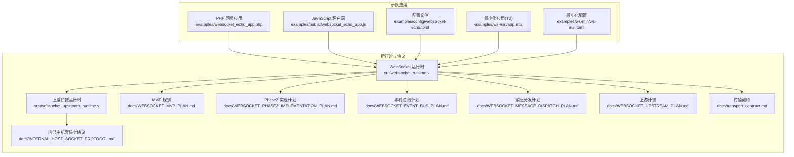
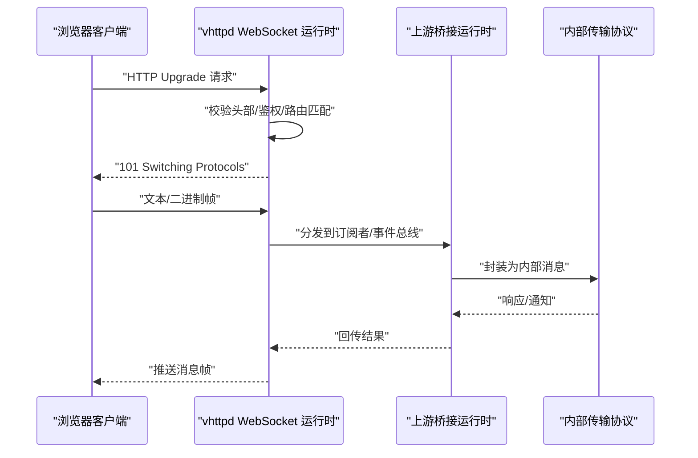
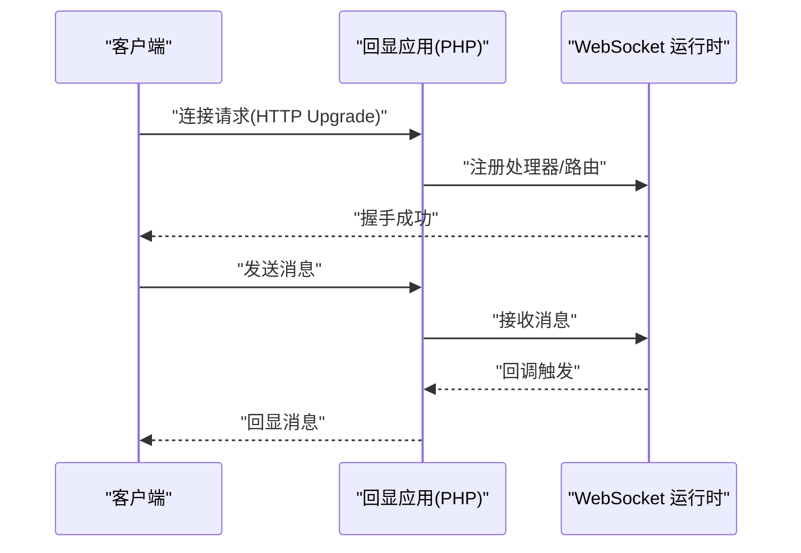
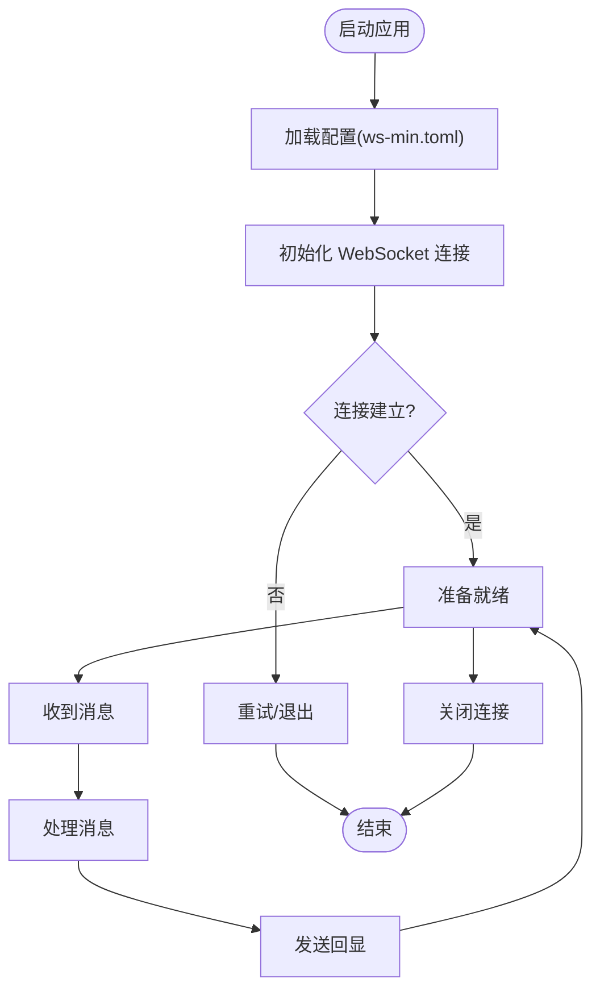
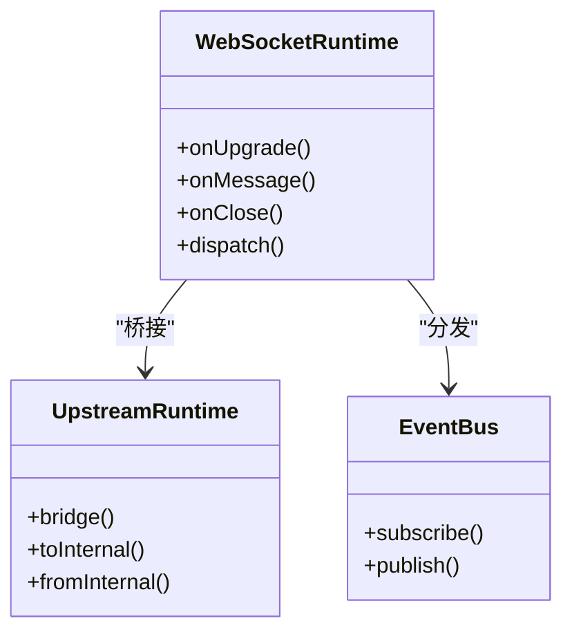
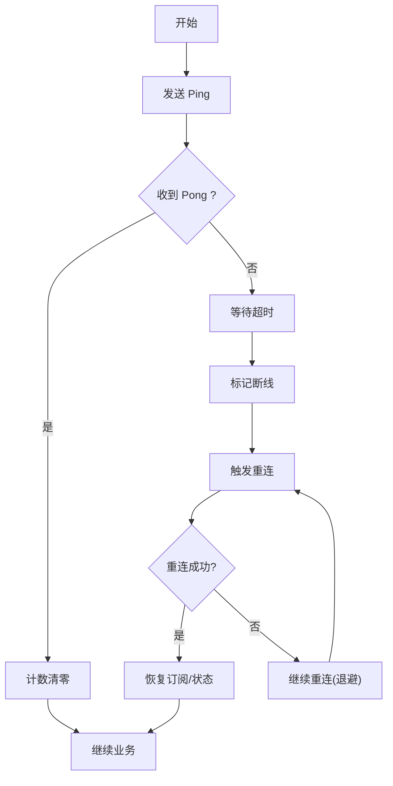
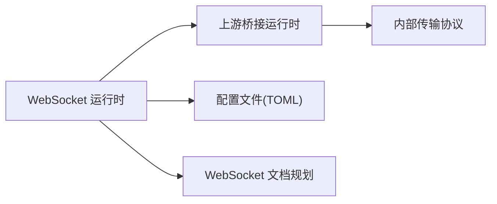

# WebSocket 应用示例

<cite>
**本文引用的文件**
- [websocket_echo_app.php](file://examples/websocket_echo_app.php)
- [websocket_echo_app.js](file://examples/public/websocket_echo_app.js)
- [websocket-echo.toml](file://examples/config/websocket-echo.toml)
- [ws-min.toml](file://examples/ws-min/ws-min.toml)
- [app.mts](file://examples/ws-min/app.mts)
- [websocket_runtime.v](file://src/websocket_runtime.v)
- [websocket_upstream_runtime.v](file://src/websocket_upstream_runtime.v)
- [websocket_dispatch_lifecycle_test.v](file://src/websocket_dispatch_lifecycle_test.v)
- [websocket_binary_support_test.v](file://src/websocket_binary_support_test.v)
- [WEBSOCKET_MVP_PLAN.md](file://docs/WEBSOCKET_MVP_PLAN.md)
- [WEBSOCKET_PHASE2_IMPLEMENTATION_PLAN.md](file://docs/WEBSOCKET_PHASE2_IMPLEMENTATION_PLAN.md)
- [WEBSOCKET_EVENT_BUS_PLAN.md](file://docs/WEBSOCKET_EVENT_BUS_PLAN.md)
- [WEBSOCKET_MESSAGE_DISPATCH_PLAN.md](file://docs/WEBSOCKET_MESSAGE_DISPATCH_PLAN.md)
- [WEBSOCKET_UPSTREAM_PLAN.md](file://docs/WEBSOCKET_UPSTREAM_PLAN.md)
- [INTERNAL_HOST_SOCKET_PROTOCOL.md](file://docs/INTERNAL_HOST_SOCKET_PROTOCOL.md)
- [transport_contract.md](file://docs/transport_contract.md)
- [vhttpd.toml](file://vhttpd.toml)
</cite>

## 目录
1. [简介](#简介)
2. [项目结构](#项目结构)
3. [核心组件](#核心组件)
4. [架构总览](#架构总览)
5. [详细组件分析](#详细组件分析)
6. [依赖关系分析](#依赖关系分析)
7. [性能考量](#性能考量)
8. [故障排查指南](#故障排查指南)
9. [结论](#结论)
10. [附录](#附录)

## 简介
本文件面向实时应用开发者，系统性介绍 vhttpd 的 WebSocket 能力与应用实践。内容涵盖协议实现、连接建立、消息传递、连接管理、心跳与重连、错误处理、性能优化、安全与监控，并给出回显应用、最小化应用以及常见场景（聊天室、实时通知、游戏同步）的实现模式与部署建议。

## 项目结构
vhttpd 提供了 PHP 与 TypeScript 双端示例，分别演示服务端与客户端的 WebSocket 交互；同时在源码中实现了 WebSocket 运行时与上游桥接层，支撑事件总线、消息分发与内部传输协议。

图表来源
- [websocket_runtime.v](file://src/websocket_runtime.v)
- [websocket_upstream_runtime.v](file://src/websocket_upstream_runtime.v)
- [websocket-echo.toml](file://examples/config/websocket-echo.toml)
- [ws-min.toml](file://examples/ws-min/ws-min.toml)
- [WEBSOCKET_MVP_PLAN.md](file://docs/WEBSOCKET_MVP_PLAN.md)
- [WEBSOCKET_PHASE2_IMPLEMENTATION_PLAN.md](file://docs/WEBSOCKET_PHASE2_IMPLEMENTATION_PLAN.md)
- [WEBSOCKET_EVENT_BUS_PLAN.md](file://docs/WEBSOCKET_EVENT_BUS_PLAN.md)
- [WEBSOCKET_MESSAGE_DISPATCH_PLAN.md](file://docs/WEBSOCKET_MESSAGE_DISPATCH_PLAN.md)
- [WEBSOCKET_UPSTREAM_PLAN.md](file://docs/WEBSOCKET_UPSTREAM_PLAN.md)
- [INTERNAL_HOST_SOCKET_PROTOCOL.md](file://docs/INTERNAL_HOST_SOCKET_PROTOCOL.md)
- [transport_contract.md](file://docs/transport_contract.md)

章节来源
- [websocket_runtime.v](file://src/websocket_runtime.v)
- [websocket_upstream_runtime.v](file://src/websocket_upstream_runtime.v)
- [websocket-echo.toml](file://examples/config/websocket-echo.toml)
- [ws-min.toml](file://examples/ws-min/ws-min.toml)
- [WEBSOCKET_MVP_PLAN.md](file://docs/WEBSOCKET_MVP_PLAN.md)
- [WEBSOCKET_PHASE2_IMPLEMENTATION_PLAN.md](file://docs/WEBSOCKET_PHASE2_IMPLEMENTATION_PLAN.md)
- [WEBSOCKET_EVENT_BUS_PLAN.md](file://docs/WEBSOCKET_EVENT_BUS_PLAN.md)
- [WEBSOCKET_MESSAGE_DISPATCH_PLAN.md](file://docs/WEBSOCKET_MESSAGE_DISPATCH_PLAN.md)
- [WEBSOCKET_UPSTREAM_PLAN.md](file://docs/WEBSOCKET_UPSTREAM_PLAN.md)
- [INTERNAL_HOST_SOCKET_PROTOCOL.md](file://docs/INTERNAL_HOST_SOCKET_PROTOCOL.md)
- [transport_contract.md](file://docs/transport_contract.md)

## 核心组件
- WebSocket 运行时：负责握手、帧解析、消息分发、连接生命周期管理与错误处理。
- 上游桥接运行时：将 WebSocket 会话与内部传输协议对接，支持事件总线与多路复用。
- 配置系统：通过 TOML 文件定义路由、认证、上游与运行参数。
- 示例应用：PHP 回显应用与 JavaScript 客户端，演示基础双向通信。
- 最小化应用：TS 版本的极简实现，便于快速上手与扩展。

章节来源
- [websocket_runtime.v](file://src/websocket_runtime.v)
- [websocket_upstream_runtime.v](file://src/websocket_upstream_runtime.v)
- [websocket-echo.toml](file://examples/config/websocket-echo.toml)
- [ws-min.toml](file://examples/ws-min/ws-min.toml)
- [websocket_echo_app.php](file://examples/websocket_echo_app.php)
- [websocket_echo_app.js](file://examples/public/websocket_echo_app.js)
- [app.mts](file://examples/ws-min/app.mts)

## 架构总览
WebSocket 在 vhttpd 中采用“运行时 + 上游桥接 + 内部传输”的分层设计。客户端通过 HTTP 升级请求进入运行时，随后由运行时进行协议协商与消息分发；运行时再通过上游桥接与内部传输协议交互，实现跨进程/模块的事件与数据流转。

图表来源
- [websocket_runtime.v](file://src/websocket_runtime.v)
- [websocket_upstream_runtime.v](file://src/websocket_upstream_runtime.v)
- [INTERNAL_HOST_SOCKET_PROTOCOL.md](file://docs/INTERNAL_HOST_SOCKET_PROTOCOL.md)
- [transport_contract.md](file://docs/transport_contract.md)

## 详细组件分析

### 回显应用（PHP）
回显应用展示了最基础的双向通信：客户端发送消息，服务端原样返回。该模式适合验证连接、测试延迟与吞吐。

图表来源
- [websocket_echo_app.php](file://examples/websocket_echo_app.php)
- [websocket_runtime.v](file://src/websocket_runtime.v)

章节来源
- [websocket_echo_app.php](file://examples/websocket_echo_app.php)
- [websocket_runtime.v](file://src/websocket_runtime.v)

### 最小化 WebSocket 应用（TypeScript）
最小化应用以最少代码实现连接、消息收发与基本错误处理，适合快速原型与教学演示。

图表来源
- [app.mts](file://examples/ws-min/app.mts)
- [ws-min.toml](file://examples/ws-min/ws-min.toml)

章节来源
- [app.mts](file://examples/ws-min/app.mts)
- [ws-min.toml](file://examples/ws-min/ws-min.toml)

### 消息处理与分发
- 帧解析：区分文本与二进制帧，按类型路由至相应处理器。
- 事件总线：基于订阅/发布模型，支持多路复用与广播。
- 上游桥接：将消息映射为内部传输消息，实现跨模块协作。

图表来源
- [websocket_runtime.v](file://src/websocket_runtime.v)
- [websocket_upstream_runtime.v](file://src/websocket_upstream_runtime.v)
- [WEBSOCKET_EVENT_BUS_PLAN.md](file://docs/WEBSOCKET_EVENT_BUS_PLAN.md)
- [WEBSOCKET_MESSAGE_DISPATCH_PLAN.md](file://docs/WEBSOCKET_MESSAGE_DISPATCH_PLAN.md)

章节来源
- [websocket_runtime.v](file://src/websocket_runtime.v)
- [websocket_upstream_runtime.v](file://src/websocket_upstream_runtime.v)
- [WEBSOCKET_EVENT_BUS_PLAN.md](file://docs/WEBSOCKET_EVENT_BUS_PLAN.md)
- [WEBSOCKET_MESSAGE_DISPATCH_PLAN.md](file://docs/WEBSOCKET_MESSAGE_DISPATCH_PLAN.md)

### 心跳检测与重连机制
- 心跳：服务端定期发送 ping，客户端回显 pong；超时则判定断开并触发重连。
- 退避重连：指数退避或固定间隔重试，避免雪崩效应。
- 断线恢复：重连后恢复订阅状态或回放未确认消息。

图表来源
- [websocket_runtime.v](file://src/websocket_runtime.v)
- [WEBSOCKET_PHASE2_IMPLEMENTATION_PLAN.md](file://docs/WEBSOCKET_PHASE2_IMPLEMENTATION_PLAN.md)

章节来源
- [websocket_runtime.v](file://src/websocket_runtime.v)
- [WEBSOCKET_PHASE2_IMPLEMENTATION_PLAN.md](file://docs/WEBSOCKET_PHASE2_IMPLEMENTATION_PLAN.md)

### 错误处理策略
- 握手失败：校验头部、版本、子协议与鉴权，失败返回对应状态码。
- 运行时异常：捕获解析错误、路由缺失、订阅失败等，记录日志并优雅关闭。
- 资源限制：超限断开、丢弃无效帧、降级处理。
- 用户态错误：向客户端返回可理解的错误码与信息，便于前端提示。

章节来源
- [websocket_runtime.v](file://src/websocket_runtime.v)
- [websocket_upstream_runtime.v](file://src/websocket_upstream_runtime.v)

### 安全考虑
- 认证与授权：基于配置文件的路由鉴权、IP 白名单、子协议白名单。
- 路径与来源：严格校验 Origin、路径前缀与路由规则。
- 压缩与限流：启用压缩减少带宽，设置每秒消息数与帧大小上限。
- 加密传输：强制使用 WSS（TLS），避免明文传输敏感数据。

章节来源
- [websocket-echo.toml](file://examples/config/websocket-echo.toml)
- [ws-min.toml](file://examples/ws-min/ws-min.toml)
- [WEBSOCKET_MVP_PLAN.md](file://docs/WEBSOCKET_MVP_PLAN.md)

### 监控与可观测性
- 指标采集：连接数、消息速率、帧类型分布、错误率、延迟。
- 日志分级：调试、信息、警告、错误；区分业务日志与协议日志。
- 告警阈值：连接失败率、平均延迟、内存与 CPU 使用率。
- 追踪链路：为每个会话分配 ID，贯穿握手、处理与关闭全过程。

章节来源
- [WEBSOCKET_MVP_PLAN.md](file://docs/WEBSOCKET_MVP_PLAN.md)
- [WEBSOCKET_PHASE2_IMPLEMENTATION_PLAN.md](file://docs/WEBSOCKET_PHASE2_IMPLEMENTATION_PLAN.md)

## 依赖关系分析
WebSocket 运行时与上游桥接运行时通过内部传输协议耦合，配置文件驱动路由与鉴权，文档规划指导功能演进。

图表来源
- [websocket_runtime.v](file://src/websocket_runtime.v)
- [websocket_upstream_runtime.v](file://src/websocket_upstream_runtime.v)
- [INTERNAL_HOST_SOCKET_PROTOCOL.md](file://docs/INTERNAL_HOST_SOCKET_PROTOCOL.md)
- [transport_contract.md](file://docs/transport_contract.md)
- [websocket-echo.toml](file://examples/config/websocket-echo.toml)
- [ws-min.toml](file://examples/ws-min/ws-min.toml)
- [WEBSOCKET_MVP_PLAN.md](file://docs/WEBSOCKET_MVP_PLAN.md)

章节来源
- [websocket_runtime.v](file://src/websocket_runtime.v)
- [websocket_upstream_runtime.v](file://src/websocket_upstream_runtime.v)
- [INTERNAL_HOST_SOCKET_PROTOCOL.md](file://docs/INTERNAL_HOST_SOCKET_PROTOCOL.md)
- [transport_contract.md](file://docs/transport_contract.md)
- [websocket-echo.toml](file://examples/config/websocket-echo.toml)
- [ws-min.toml](file://examples/ws-min/ws-min.toml)
- [WEBSOCKET_MVP_PLAN.md](file://docs/WEBSOCKET_MVP_PLAN.md)

## 性能考量
- 连接池与复用：合理设置并发上限，避免过多长连接导致资源耗尽。
- 帧聚合：批量发送减少网络往返，注意背压控制。
- 压缩策略：对重复性强的数据启用压缩，平衡 CPU 与带宽。
- GC 与内存：及时释放无用对象，避免闭包持有导致内存泄漏。
- 广播优化：对不关心的消息进行过滤，减少序列化与网络开销。

## 故障排查指南
- 握手失败：检查配置中的路由、鉴权与子协议是否一致。
- 无法收发：确认客户端是否正确处理 ping/pong 与重连逻辑。
- 性能瓶颈：查看指标与日志，定位慢查询、阻塞操作或内存泄漏。
- 上游异常：检查上游桥接状态与内部传输队列积压情况。

章节来源
- [websocket_runtime.v](file://src/websocket_runtime.v)
- [websocket_upstream_runtime.v](file://src/websocket_upstream_runtime.v)
- [websocket_dispatch_lifecycle_test.v](file://src/websocket_dispatch_lifecycle_test.v)
- [websocket_binary_support_test.v](file://src/websocket_binary_support_test.v)

## 结论
vhttpd 的 WebSocket 能力以清晰的分层架构与完善的文档规划为基础，既满足 MVP 快速落地，又具备 Phase2 的扩展能力。通过回显与最小化示例，开发者可以快速掌握连接、消息与生命周期管理；结合心跳、重连、安全与监控策略，可构建稳定可靠的实时应用。

## 附录

### 常见应用场景实现模式
- 聊天室：基于订阅/发布，维护房间成员列表与消息历史，支持私聊与群聊。
- 实时通知：事件驱动推送，按用户维度订阅主题，支持离线补发。
- 游戏同步：高频率小包采用二进制帧，使用时间戳与序列号保证一致性。

章节来源
- [WEBSOCKET_EVENT_BUS_PLAN.md](file://docs/WEBSOCKET_EVENT_BUS_PLAN.md)
- [WEBSOCKET_MESSAGE_DISPATCH_PLAN.md](file://docs/WEBSOCKET_MESSAGE_DISPATCH_PLAN.md)
- [WEBSOCKET_UPSTREAM_PLAN.md](file://docs/WEBSOCKET_UPSTREAM_PLAN.md)

### 部署与运维要点
- 配置文件：确保路由、鉴权、上游与传输参数正确。
- 进程与端口：合理分配端口与工作进程，开启 TLS。
- 监控告警：设置关键指标阈值，建立自动化巡检与应急流程。

章节来源
- [websocket-echo.toml](file://examples/config/websocket-echo.toml)
- [ws-min.toml](file://examples/ws-min/ws-min.toml)
- [vhttpd.toml](file://vhttpd.toml)