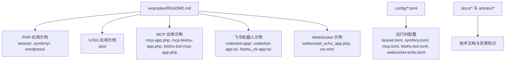
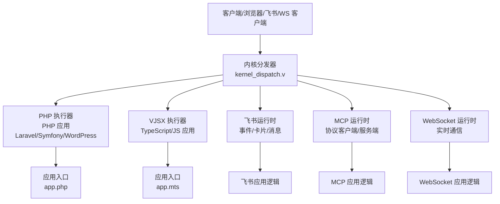
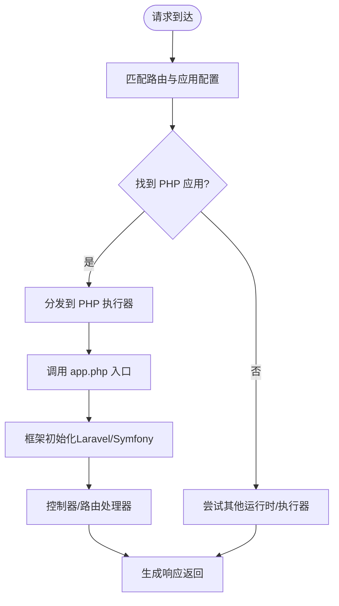
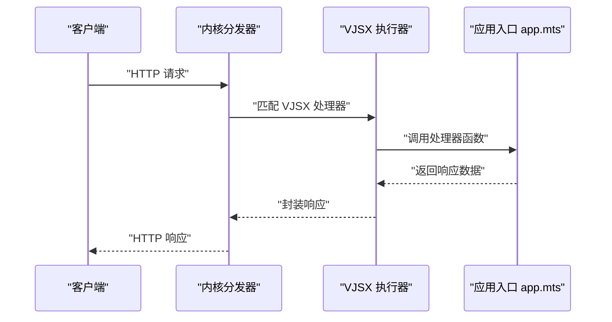
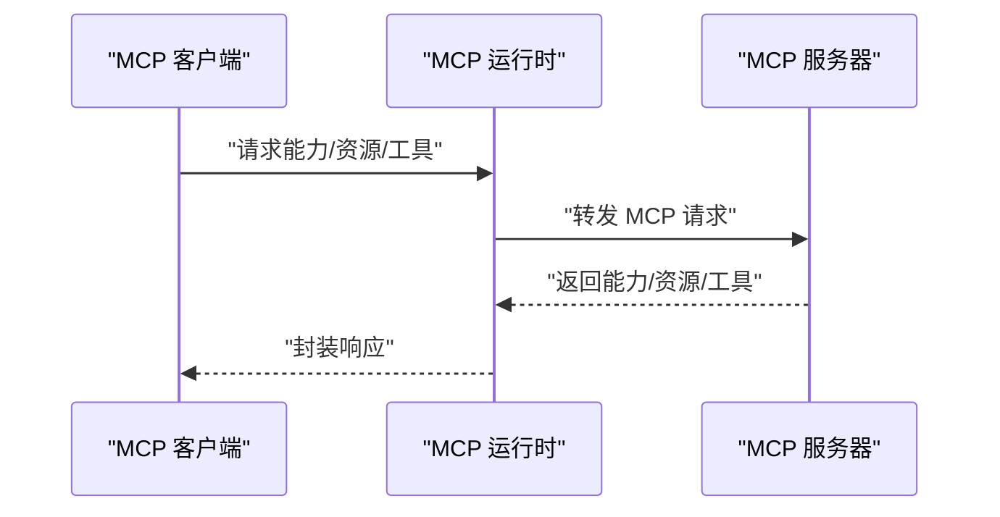
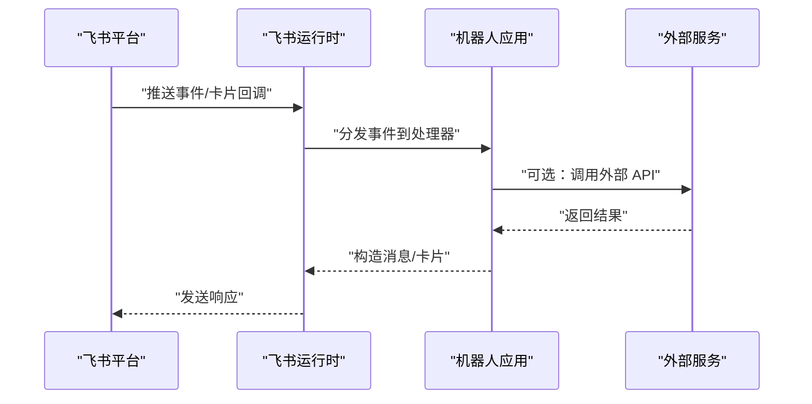
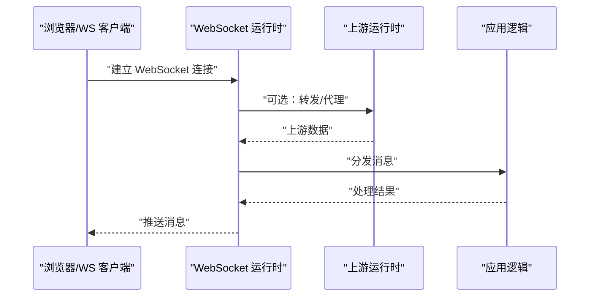
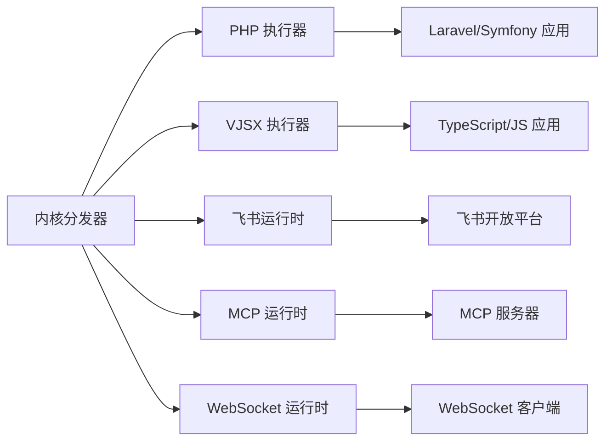

# 示例应用

<cite>
**本文引用的文件**
- [examples/README.md](file://examples/README.md)
- [articles/03-php-apps.md](file://articles/03-php-apps.md)
- [articles/08-vjsx-intro.md](file://articles/08-vjsx-intro.md)
- [articles/07-feishu-bot.md](file://articles/07-feishu-bot.md)
- [docs/MCP.md](file://docs/MCP.md)
- [docs/WEBSOCKET_MVP_PLAN.md](file://docs/WEBSOCKET_MVP_PLAN.md)
- [config/vhttpd.example.toml](file://config/vhttpd.example.toml)
- [config/vhttpd.vjsx.example.toml](file://config/vhttpd.vjsx.example.toml)
- [examples/config/laravel.toml](file://examples/config/laravel.toml)
- [examples/config/symfony.toml](file://examples/config/symfony.toml)
- [examples/config/mcp.toml](file://examples/config/mcp.toml)
- [examples/config/feishu-bot.toml](file://examples/config/feishu-bot.toml)
- [examples/config/websocket-echo.toml](file://examples/config/websocket-echo.toml)
- [examples/hello-app.php](file://examples/hello-app.php)
- [examples/mcp-app.php](file://examples/mcp-app.php)
- [examples/mcp-feishu-app.php](file://examples/mcp-feishu-app.php)
- [examples/feishu-bot-mcp-app.php](file://examples/feishu-bot-mcp-app.php)
- [examples/websocket_echo_app.php](file://examples/websocket_echo_app.php)
- [examples/codexbot-app/app.php](file://examples/codexbot-app/app.php)
- [examples/codexbot-app/README.md](file://examples/codexbot-app/README.md)
- [examples/codexbot-app-ts/app.mts](file://examples/codexbot-app-ts/app.mts)
- [examples/codexbot-app-ts/README.md](file://examples/codexbot-app-ts/README.md)
- [examples/vjsx/bot-entry.mts](file://examples/vjsx/bot-entry.mts)
- [examples/vjsx/openai-executor-app.mts](file://examples/vjsx/openai-executor-app.mts)
- [examples/vjsx/openai-gateway-plugin.mts](file://examples/vjsx/openai-gateway-plugin.mts)
- [examples/vjsx/api-demo-handler.mts](file://examples/vjsx/api-demo-handler.mts)
- [examples/vjsx/hello-handler.mts](file://examples/vjsx/hello-handler.mts)
- [examples/ws-min/app.mts](file://examples/ws-min/app.mts)
- [examples/ws-min/ws-min.toml](file://examples/ws-min/ws-min.toml)
- [examples/public/websocket_echo_app.js](file://examples/public/websocket_echo_app.js)
- [examples/laravel/app.php](file://examples/laravel/app.php)
- [examples/symfony/app.php](file://examples/symfony/app.php)
- [examples/wordpress/app.php](file://examples/wordpress/app.php)
- [src/main.v](file://src/main.v)
- [src/server.v](file://src/server.v)
- [src/executor/inproc_vjsx_executor.v](file://src/executor/inproc_vjsx_executor.v)
- [src/feishu_runtime.v](file://src/feishu_runtime.v)
- [src/mcp_runtime.v](file://src/mcp_runtime.v)
- [src/websocket_runtime.v](file://src/websocket_runtime.v)
- [src/websocket_upstream_runtime.v](file://src/websocket_upstream_runtime.v)
- [src/admin_server.v](file://src/admin_server.v)
- [src/command_handlers.v](file://src/command_handlers.v)
- [src/kernel_dispatch.v](file://src/kernel_dispatch.v)
</cite>

## 目录
1. [简介](#简介)
2. [项目结构](#项目结构)
3. [核心组件](#核心组件)
4. [架构总览](#架构总览)
5. [详细组件分析](#详细组件分析)
6. [依赖分析](#依赖分析)
7. [性能考虑](#性能考虑)
8. [故障排查指南](#故障排查指南)
9. [结论](#结论)
10. [附录](#附录)

## 简介
本教程面向不同技术背景的开发者，系统讲解 vhttpd 的示例应用与运行实践，覆盖以下主题：
- PHP 应用：Laravel 与 Symfony 集成方式与配置要点
- VJSX 应用：TypeScript/JavaScript 在 vhttpd 中的执行与桥接
- MCP 应用：模型上下文协议（MCP）的客户端与服务端实现
- 飞书机器人：事件处理、消息发送与卡片交互
- WebSocket 应用：实时通信的实现模式与最小可用示例
- 配置说明、运行步骤与调试技巧

## 项目结构
vhttpd 示例位于 examples/ 目录，涵盖 PHP、VJSX、MCP、飞书机器人与 WebSocket 等多种类型的应用示例；同时在 docs/ 与 articles/ 提供了深入的技术文档与背景介绍。

**章节来源**
- [examples/README.md](file://examples/README.md)
- [config/vhttpd.example.toml](file://config/vhttpd.example.toml)

## 核心组件
- 运行时内核与调度：负责启动、路由请求、分发到具体应用或执行器
- PHP 执行器：适配 PHP 应用（含 Laravel/Symfony/WordPress），通过内置网关与 vhttpd 协同
- VJSX 执行器：在进程内运行 TypeScript/JavaScript，桥接 vhttpd 内部 API
- 飞书运行时：处理飞书事件、卡片交互与消息派发
- MCP 运行时：实现模型上下文协议的服务端与客户端能力
- WebSocket 运行时：支持双向通信与上游转发

**章节来源**
- [src/main.v](file://src/main.v)
- [src/server.v](file://src/server.v)
- [src/kernel_dispatch.v](file://src/kernel_dispatch.v)
- [src/executor/inproc_vjsx_executor.v](file://src/executor/inproc_vjsx_executor.v)
- [src/feishu_runtime.v](file://src/feishu_runtime.v)
- [src/mcp_runtime.v](file://src/mcp_runtime.v)
- [src/websocket_runtime.v](file://src/websocket_runtime.v)
- [src/websocket_upstream_runtime.v](file://src/websocket_upstream_runtime.v)

## 架构总览
下图展示了 vhttpd 的典型请求生命周期：请求进入后由内核分发至对应运行时或执行器，再调用具体应用逻辑。

**图表来源**
- [src/kernel_dispatch.v](file://src/kernel_dispatch.v)
- [src/executor/inproc_vjsx_executor.v](file://src/executor/inproc_vjsx_executor.v)
- [src/feishu_runtime.v](file://src/feishu_runtime.v)
- [src/mcp_runtime.v](file://src/mcp_runtime.v)
- [src/websocket_runtime.v](file://src/websocket_runtime.v)

## 详细组件分析

### PHP 应用示例（Laravel 与 Symfony）
- 集成方式
  - 通过配置文件指定 PHP 应用入口与路由规则，vhttpd 将 HTTP 请求转交给 PHP 执行器
  - Laravel/Symfony 示例分别提供 composer.json 与 app.php 入口文件
- 配置要点
  - 使用 examples/config/laravel.toml 与 examples/config/symfony.toml
  - 关注应用根目录、自动加载、路由前缀与静态资源映射
- 运行步骤
  - 安装依赖（composer install）
  - 启动 vhttpd 并加载对应 TOML 配置
  - 访问应用路由验证集成效果
- 调试技巧
  - 查看 vhttpd 日志定位路由与执行器绑定问题
  - 检查 PHP 应用错误日志与 composer 依赖完整性

**图表来源**
- [src/kernel_dispatch.v](file://src/kernel_dispatch.v)
- [examples/laravel/app.php](file://examples/laravel/app.php)
- [examples/symfony/app.php](file://examples/symfony/app.php)
- [examples/config/laravel.toml](file://examples/config/laravel.toml)
- [examples/config/symfony.toml](file://examples/config/symfony.toml)

**章节来源**
- [articles/03-php-apps.md](file://articles/03-php-apps.md)
- [examples/laravel/app.php](file://examples/laravel/app.php)
- [examples/symfony/app.php](file://examples/symfony/app.php)
- [examples/config/laravel.toml](file://examples/config/laravel.toml)
- [examples/config/symfony.toml](file://examples/config/symfony.toml)

### VJSX 应用示例（TypeScript/JavaScript）
- 执行方式
  - 在进程内运行 TypeScript/JavaScript，通过 vhttpd 提供的宿主 API 与内部系统交互
  - 支持 HTTP 处理器、插件与执行器等场景
- 示例入口
  - bot-entry.mts、openai-executor-app.mts、openai-gateway-plugin.mts、api-demo-handler.mts、hello-handler.mts
- 配置要点
  - 使用 config/vhttpd.vjsx.example.toml 作为参考
  - 关注执行器注册、模块加载与权限策略
- 运行步骤
  - 编译/打包 TS 源码（如需）
  - 启动 vhttpd 并加载 VJSX 配置
  - 访问示例处理器验证输出
- 调试技巧
  - 利用内置日志与断点定位执行器生命周期问题
  - 对比不同处理器的行为差异以定位业务逻辑问题

**图表来源**
- [src/executor/inproc_vjsx_executor.v](file://src/executor/inproc_vjsx_executor.v)
- [examples/vjsx/bot-entry.mts](file://examples/vjsx/bot-entry.mts)
- [examples/vjsx/openai-executor-app.mts](file://examples/vjsx/openai-executor-app.mts)
- [examples/vjsx/openai-gateway-plugin.mts](file://examples/vjsx/openai-gateway-plugin.mts)
- [config/vhttpd.vjsx.example.toml](file://config/vhttpd.vjsx.example.toml)

**章节来源**
- [articles/08-vjsx-intro.md](file://articles/08-vjsx-intro.md)
- [examples/vjsx/bot-entry.mts](file://examples/vjsx/bot-entry.mts)
- [examples/vjsx/openai-executor-app.mts](file://examples/vjsx/openai-executor-app.mts)
- [examples/vjsx/openai-gateway-plugin.mts](file://examples/vjsx/openai-gateway-plugin.mts)
- [config/vhttpd.vjsx.example.toml](file://config/vhttpd.vjsx.example.toml)

### MCP 应用示例（模型上下文协议）
- 协议概述
  - MCP 用于在 AI 工作流中提供统一的“提示词”、“工具”、“资源”等上下文能力
  - 文档与计划详见 docs/MCP.md
- 客户端与服务端
  - 客户端：向 MCP 服务器发起请求，获取资源、工具与提示词
  - 服务端：暴露资源列表、工具清单与提示词模板
- 示例入口
  - mcp-app.php（通用客户端示例）
  - mcp-feishu-app.php（结合飞书的 MCP 客户端）
  - feishu-bot-mcp-app.php（飞书机器人与 MCP 的组合）
- 配置要点
  - 使用 examples/config/mcp.toml
  - 关注 MCP 服务器地址、认证与能力协商
- 运行步骤
  - 启动 vhttpd 并加载 MCP 配置
  - 触发示例请求，观察资源/工具/提示词的返回
- 调试技巧
  - 关注能力协商与权限校验流程
  - 使用日志追踪请求链路与错误位置

**图表来源**
- [src/mcp_runtime.v](file://src/mcp_runtime.v)
- [examples/mcp-app.php](file://examples/mcp-app.php)
- [examples/mcp-feishu-app.php](file://examples/mcp-feishu-app.php)
- [examples/feishu-bot-mcp-app.php](file://examples/feishu-bot-mcp-app.php)
- [examples/config/mcp.toml](file://examples/config/mcp.toml)
- [docs/MCP.md](file://docs/MCP.md)

**章节来源**
- [docs/MCP.md](file://docs/MCP.md)
- [examples/mcp-app.php](file://examples/mcp-app.php)
- [examples/mcp-feishu-app.php](file://examples/mcp-feishu-app.php)
- [examples/feishu-bot-mcp-app.php](file://examples/feishu-bot-mcp-app.php)
- [examples/config/mcp.toml](file://examples/config/mcp.toml)

### 飞书机器人示例（事件处理、消息发送、卡片交互）
- 功能范围
  - 接收飞书事件（如加群、审批、用户交互）
  - 发送文本/富文本/卡片消息
  - 处理卡片按钮点击与回调
- 示例入口
  - codexbot-app/ 与 codexbot-app-ts/ 提供 PHP 与 TS 双版本实现
  - feishu_cb-app-ts/ 提供卡片回调示例
- 配置要点
  - 使用 examples/config/feishu-bot.toml
  - 关注机器人 ID/密钥、事件订阅与卡片策略
- 运行步骤
  - 配置飞书企业自建应用与回调地址
  - 启动 vhttpd 并加载飞书配置
  - 在飞书侧触发事件，观察响应与卡片交互
- 调试技巧
  - 开启飞书运行时日志，核对事件签名与回调地址
  - 使用卡片去重与幂等策略避免重复处理

**图表来源**
- [src/feishu_runtime.v](file://src/feishu_runtime.v)
- [examples/codexbot-app/app.php](file://examples/codexbot-app/app.php)
- [examples/codexbot-app-ts/app.mts](file://examples/codexbot-app-ts/app.mts)
- [examples/config/feishu-bot.toml](file://examples/config/feishu-bot.toml)
- [articles/07-feishu-bot.md](file://articles/07-feishu-bot.md)

**章节来源**
- [articles/07-feishu-bot.md](file://articles/07-feishu-bot.md)
- [examples/codexbot-app/app.php](file://examples/codexbot-app/app.php)
- [examples/codexbot-app/README.md](file://examples/codexbot-app/README.md)
- [examples/codexbot-app-ts/app.mts](file://examples/codexbot-app-ts/app.mts)
- [examples/codexbot-app-ts/README.md](file://examples/codexbot-app-ts/README.md)
- [examples/config/feishu-bot.toml](file://examples/config/feishu-bot.toml)

### WebSocket 应用示例（实时通信）
- 实现模式
  - 支持双向通信与上游转发，适用于聊天室、监控面板等场景
  - 提供最小可用示例（ws-min）与前端演示（websocket_echo_app.js）
- 示例入口
  - websocket_echo_app.php（PHP WebSocket 示例）
  - ws-min/app.mts（VJSX 最小示例）
- 配置要点
  - 使用 examples/config/websocket-echo.toml
  - 关注监听端口、握手路径与上游转发设置
- 运行步骤
  - 启动 vhttpd 并加载 WebSocket 配置
  - 使用浏览器或 WebSocket 客户端连接，验证消息收发
- 调试技巧
  - 关注握手阶段与帧格式，检查上游运行时状态
  - 使用最小示例快速定位网络层与协议层问题

**图表来源**
- [src/websocket_runtime.v](file://src/websocket_runtime.v)
- [src/websocket_upstream_runtime.v](file://src/websocket_upstream_runtime.v)
- [examples/websocket_echo_app.php](file://examples/websocket_echo_app.php)
- [examples/ws-min/app.mts](file://examples/ws-min/app.mts)
- [examples/config/websocket-echo.toml](file://examples/config/websocket-echo.toml)
- [examples/public/websocket_echo_app.js](file://examples/public/websocket_echo_app.js)
- [docs/WEBSOCKET_MVP_PLAN.md](file://docs/WEBSOCKET_MVP_PLAN.md)

**章节来源**
- [docs/WEBSOCKET_MVP_PLAN.md](file://docs/WEBSOCKET_MVP_PLAN.md)
- [examples/websocket_echo_app.php](file://examples/websocket_echo_app.php)
- [examples/ws-min/app.mts](file://examples/ws-min/app.mts)
- [examples/ws-min/ws-min.toml](file://examples/ws-min/ws-min.toml)
- [examples/config/websocket-echo.toml](file://examples/config/websocket-echo.toml)
- [examples/public/websocket_echo_app.js](file://examples/public/websocket_echo_app.js)

## 依赖分析
- 组件耦合
  - 内核分发器与各运行时/执行器松耦合，通过配置与路由进行绑定
  - VJSX 执行器与 PHP 执行器互不干扰，可并存运行
  - 飞书与 MCP 运行时独立工作，但均可被内核统一调度
- 外部依赖
  - PHP 应用依赖 Composer 生态（Laravel/Symfony）
  - VJSX 应用依赖 TypeScript/JS 运行环境与构建工具
  - 飞书机器人依赖飞书开放平台 API
  - WebSocket 依赖浏览器或客户端 SDK

**图表来源**
- [src/kernel_dispatch.v](file://src/kernel_dispatch.v)
- [src/executor/inproc_vjsx_executor.v](file://src/executor/inproc_vjsx_executor.v)
- [src/feishu_runtime.v](file://src/feishu_runtime.v)
- [src/mcp_runtime.v](file://src/mcp_runtime.v)
- [src/websocket_runtime.v](file://src/websocket_runtime.v)

## 性能考虑
- 路由与分发
  - 使用精确的路由前缀与路径匹配，减少不必要的分发开销
- 执行器选择
  - PHP 应用建议启用 OPcache 与 Composer 自动加载优化
  - VJSX 应用建议预编译与缓存常用模块
- 飞书与 MCP
  - 合理设置能力协商与缓存策略，降低重复请求
- WebSocket
  - 控制消息大小与频率，避免阻塞上游运行时

## 故障排查指南
- 常见问题
  - 路由不匹配：检查配置文件中的路径与前缀
  - PHP 应用异常：查看应用日志与依赖安装情况
  - VJSX 执行器报错：确认入口文件与模块导入
  - 飞书回调失败：核对签名与回调地址
  - WebSocket 握手失败：检查端口占用与握手路径
- 调试命令
  - 使用 vhttpd 内置诊断与日志功能
  - 结合示例配置文件逐项比对参数

**章节来源**
- [src/admin_server.v](file://src/admin_server.v)
- [src/command_handlers.v](file://src/command_handlers.v)

## 结论
vhttpd 提供了统一的运行时内核与多类执行器/运行时，能够支撑从传统 PHP 应用到现代 VJSX、飞书机器人与 MCP 的多样化场景。通过合理的配置与最小可用示例，开发者可以快速上手并扩展到生产环境。

## 附录
- 快速开始
  - 选择示例：根据技术栈选择 PHP/Laravel/Symfony、VJSX、飞书机器人或 WebSocket 示例
  - 加载配置：使用对应 TOML 文件启动 vhttpd
  - 访问验证：打开浏览器或使用客户端工具测试功能
- 学习路径建议
  - PHP 场景：先跑通 hello-app.php，再接入 Laravel/Symfony
  - VJSX 场景：先理解 bot-entry.mts，再尝试插件与执行器
  - 飞书场景：先完成基础事件处理，再实现卡片交互
  - WebSocket 场景：先跑通 echo 示例，再扩展业务逻辑