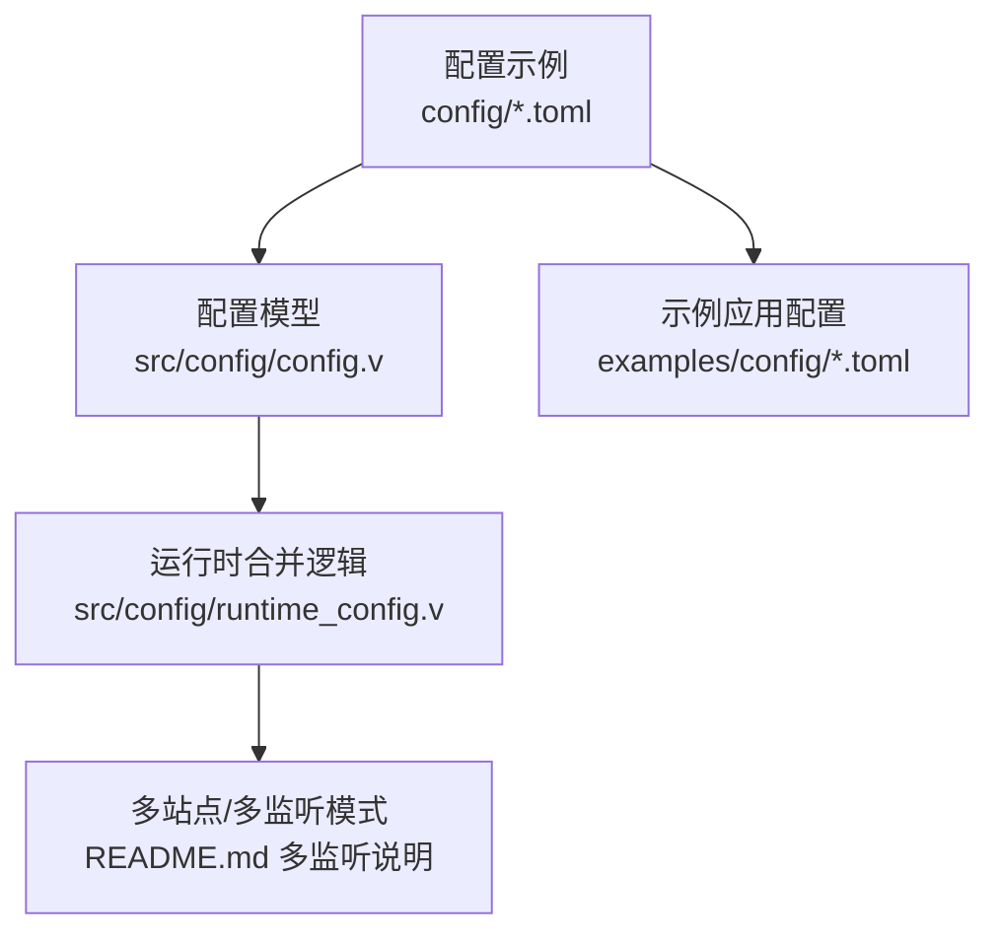
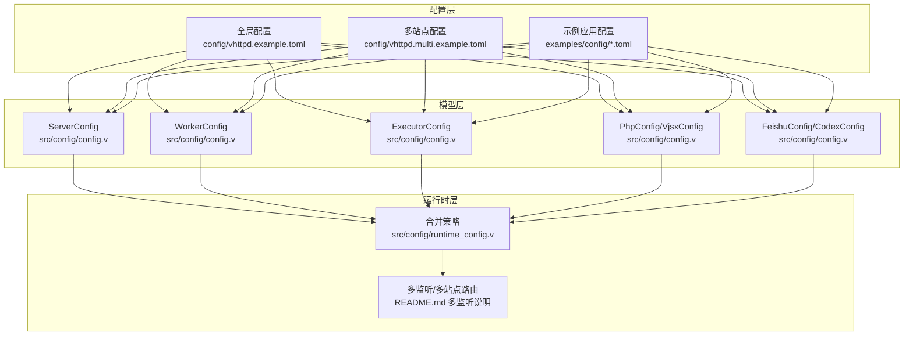
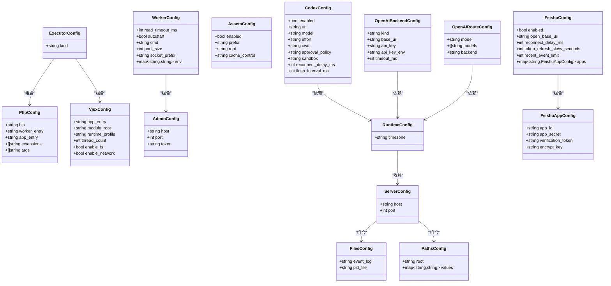

# 配置示例详解

<cite>
**本文引用的文件**   
- [vhttpd.example.toml](file://config/vhttpd.example.toml)
- [vhttpd.multi.example.toml](file://config/vhttpd.multi.example.toml)
- [vhttpd.vjsx.example.toml](file://config/vhttpd.vjsx.example.toml)
- [vhttpd.toml](file://vhttpd.toml)
- [hello.toml](file://examples/config/hello.toml)
- [laravel.toml](file://examples/config/laravel.toml)
- [symfony.toml](file://examples/config/symfony.toml)
- [mcp.toml](file://examples/config/mcp.toml)
- [websocket-echo.toml](file://examples/config/websocket-echo.toml)
- [feishu-bot.toml](file://examples/config/feishu-bot.toml)
- [db-upstream.toml](file://examples/config/db-upstream.toml)
- [openai-gateway.toml](file://examples/config/openai-gateway.toml)
- [config.v](file://src/config/config.v)
- [runtime_config.v](file://src/config/runtime_config.v)
- [README.md](file://README.md)
</cite>

## 目录
1. [简介](#简介)
2. [项目结构](#项目结构)
3. [核心组件](#核心组件)
4. [架构总览](#架构总览)
5. [详细组件分析](#详细组件分析)
6. [依赖分析](#依赖分析)
7. [性能考虑](#性能考虑)
8. [故障排除指南](#故障排除指南)
9. [结论](#结论)
10. [附录](#附录)

## 简介
本文件面向运维工程师与系统管理员，系统性解析 vhttpd 的 TOML 配置示例与运行时配置模型，覆盖以下主题：
- 服务器配置、执行器配置与运行时配置的语法与选项
- 不同应用类型（PHP 应用、VJSX 应用、MCP 应用、WebSocket 应用）的配置差异
- 企业级最佳实践：安全、性能调优与高可用部署
- 上游代理、数据库连接与第三方服务集成配置
- 配置验证、热更新与故障排除方法

## 项目结构
vhttpd 的配置以 TOML 文件为核心，结合内置的配置模型与多站点/多监听模式，实现灵活的应用编排与隔离运行。

图示来源
- [config.v:1-200](file://src/config/config.v#L1-L200)
- [runtime_config.v:1-200](file://src/config/runtime_config.v#L1-L200)
- [README.md:533-611](file://README.md#L533-L611)

章节来源
- [config.v:1-200](file://src/config/config.v#L1-L200)
- [runtime_config.v:1-200](file://src/config/runtime_config.v#L1-L200)
- [README.md:533-611](file://README.md#L533-L611)

## 核心组件
本节从配置模型角度梳理关键配置段落与字段语义，帮助快速定位与理解各配置项的作用域与默认值。

- 服务器配置
  - [server.host](file://config/vhttpd.example.toml#L9)、[server.port](file://config/vhttpd.example.toml#L10)：监听地址与端口
- 运行时配置
  - [runtime.timezone](file://config/vhttpd.example.toml#L17)：时区设置
- 文件与日志
  - [files.pid_file](file://config/vhttpd.example.toml#L13)、[files.event_log](file://config/vhttpd.example.toml#L14)：进程 PID 与事件日志路径
- 工作进程（Worker）
  - [worker.read_timeout_ms](file://config/vhttpd.example.toml#L20)、[worker.autostart](file://config/vhttpd.example.toml#L21)、[worker.pool_size](file://config/vhttpd.example.toml#L22)、[worker.socket_prefix](file://config/vhttpd.example.toml#L23)、[worker.max_requests](file://config/vhttpd.example.toml#L24)、[worker.restart_backoff_ms](file://config/vhttpd.example.toml#L25)、[worker.restart_backoff_max_ms](file://config/vhttpd.example.toml#L26)
  - [worker.cmd](file://vhttpd.toml#L12)：显式命令行启动参数
  - [worker.env.*:14-16](file://vhttpd.toml#L14-L16)：注入到 PHP Worker 的环境变量
- 执行器配置
  - [executor.kind](file://config/vhttpd.example.toml#L29)：执行器类型（如 php、vjsx）
- PHP 执行器
  - [php.bin](file://config/vhttpd.example.toml#L32)、[php.worker_entry](file://config/vhttpd.example.toml#L33)、[php.app_entry](file://config/vhttpd.example.toml#L34)、[php.extensions](file://config/vhttpd.example.toml#L35)、[php.args](file://config/vhttpd.example.toml#L36)
- VJSX 执行器
  - [vjsx.app_entry](file://config/vhttpd.vjsx.example.toml#L22)、[vjsx.module_root](file://config/vhttpd.vjsx.example.toml#L23)、[vjsx.runtime_profile](file://config/vhttpd.vjsx.example.toml#L24)、[vjsx.thread_count](file://config/vhttpd.vjsx.example.toml#L25)
- 管理接口（Admin）
  - [admin.host](file://config/vhttpd.example.toml#L38)、[admin.port](file://config/vhttpd.example.toml#L39)、[admin.token](file://config/vhttpd.example.toml#L41)
- 资源静态服务（Assets）
  - [assets.enabled](file://config/vhttpd.example.toml#L43)、[assets.prefix](file://config/vhttpd.example.toml#L45)、[assets.root](file://config/vhttpd.example.toml#L46)、[assets.cache_control](file://config/vhttpd.example.toml#L47)
- 飞书（Feishu）
  - [feishu.enabled](file://config/vhttpd.example.toml#L50)、[feishu.open_base_url](file://config/vhttpd.example.toml#L51)、[feishu.reconnect_delay_ms](file://config/vhttpd.example.toml#L52)、[feishu.token_refresh_skew_seconds](file://config/vhttpd.example.toml#L53)、[feishu.recent_event_limit](file://config/vhttpd.example.toml#L54)
  - [feishu.main.*:56-60](file://config/vhttpd.example.toml#L56-L60)、[feishu.openclaw.*:62-66](file://config/vhttpd.example.toml#L62-L66)：多应用实例配置
- Codex（可选）
  - [codex.enabled](file://config/vhttpd.multi.example.toml#L24)、[codex.url](file://config/vhttpd.multi.example.toml#L25)、[codex.model](file://config/vhttpd.multi.example.toml#L26)、[codex.effort](file://config/vhttpd.multi.example.toml#L27)、[codex.cwd](file://config/vhttpd.multi.example.toml#L28)、[codex.approval_policy](file://config/vhttpd.multi.example.toml#L29)、[codex.sandbox](file://config/vhttpd.multi.example.toml#L30)、[codex.reconnect_delay_ms](file://config/vhttpd.multi.example.toml#L31)、[codex.flush_interval_ms](file://config/vhttpd.multi.example.toml#L32)
- 多站点/多监听（Multi-site）
  - [sites.<id>.*:44-72](file://config/vhttpd.multi.example.toml#L44-L72)：站点级配置，支持按站点隔离执行器与资源
- OpenAI 网关（示例）
  - [openai.*:5-9](file://examples/config/openai-gateway.toml#L5-L9)、[plugins.*:11-24](file://examples/config/openai-gateway.toml#L11-L24)、[openai.backends.*:25-44](file://examples/config/openai-gateway.toml#L25-L44)、[openai.routes.*:46-64](file://examples/config/openai-gateway.toml#L46-L64)

章节来源
- [config.v:6-200](file://src/config/config.v#L6-L200)
- [runtime_config.v:1-200](file://src/config/runtime_config.v#L1-L200)
- [vhttpd.example.toml:1-67](file://config/vhttpd.example.toml#L1-L67)
- [vhttpd.vjsx.example.toml:1-37](file://config/vhttpd.vjsx.example.toml#L1-L37)
- [vhttpd.multi.example.toml:1-73](file://config/vhttpd.multi.example.toml#L1-L73)
- [vhttpd.toml:1-32](file://vhttpd.toml#L1-L32)
- [openai-gateway.toml:1-65](file://examples/config/openai-gateway.toml#L1-L65)

## 架构总览
vhttpd 的配置解析与运行时行为由“配置模型 + 合并策略 + 多站点/多监听”共同决定。下图展示配置在运行时如何被解析与应用：

图示来源
- [config.v:1-200](file://src/config/config.v#L1-L200)
- [runtime_config.v:1-200](file://src/config/runtime_config.v#L1-L200)
- [README.md:533-611](file://README.md#L533-L611)
- [vhttpd.example.toml:1-67](file://config/vhttpd.example.toml#L1-L67)
- [vhttpd.multi.example.toml:1-73](file://config/vhttpd.multi.example.toml#L1-L73)
- [hello.toml:1-22](file://examples/config/hello.toml#L1-L22)

## 详细组件分析

### 服务器与运行时配置
- 服务器监听
  - 使用 [server.host](file://config/vhttpd.example.toml#L9) 与 [server.port](file://config/vhttpd.example.toml#L10) 指定监听地址与端口；示例中分别使用本地回环与高数值端口，避免与系统常用端口冲突。
- 运行时时间
  - 使用 [runtime.timezone](file://config/vhttpd.example.toml#L17) 统一时区，确保日志与定时任务行为一致。
- 文件与日志
  - [files.pid_file](file://config/vhttpd.example.toml#L13) 与 [files.event_log](file://config/vhttpd.example.toml#L14) 分别控制进程 PID 与事件日志输出位置，便于运维检索与轮转。

章节来源
- [config.v:6-20](file://src/config/config.v#L6-L20)
- [config.v:132-135](file://src/config/config.v#L132-L135)
- [config.v:12-16](file://src/config/config.v#L12-L16)
- [vhttpd.example.toml:8-17](file://config/vhttpd.example.toml#L8-L17)

### 工作进程（Worker）与执行器
- Worker 参数
  - [worker.read_timeout_ms](file://config/vhttpd.example.toml#L20) 控制读超时；[worker.autostart](file://config/vhttpd.example.toml#L21) 决定是否随主进程启动；[worker.pool_size](file://config/vhttpd.example.toml#L22) 控制工作进程池大小；[worker.socket_prefix](file://config/vhttpd.example.toml#L23) 用于 Unix Socket 前缀；[worker.max_requests](file://config/vhttpd.example.toml#L24) 限制单进程最大请求数；[worker.restart_backoff_ms](file://config/vhttpd.example.toml#L25) 与 [worker.restart_backoff_max_ms](file://config/vhttpd.example.toml#L26) 控制失败重启退避策略。
  - 在单进程模式下，可通过 [worker.cmd](file://vhttpd.toml#L12) 显式指定启动命令，并通过 [worker.env.*:14-16](file://vhttpd.toml#L14-L16) 注入环境变量（例如 [VHTTPD_APP](file://vhttpd.toml#L15)）。
- 执行器选择
  - [executor.kind](file://config/vhttpd.example.toml#L29) 指定执行器类型（php 或 vjsx）。当未显式设置时，可通过站点层的 [executor](file://config/vhttpd.multi.example.toml#L48) 或 [app](file://config/vhttpd.multi.example.toml#L54) 推断（例如以 .php 结尾自动推断为 php）。

章节来源
- [config.v:24-41](file://src/config/config.v#L24-L41)
- [config.v:43-46](file://src/config/config.v#L43-L46)
- [runtime_config.v:70-90](file://src/config/runtime_config.v#L70-L90)
- [vhttpd.example.toml:19-30](file://config/vhttpd.example.toml#L19-L30)
- [vhttpd.toml:8-16](file://vhttpd.toml#L8-L16)
- [vhttpd.multi.example.toml:44-55](file://config/vhttpd.multi.example.toml#L44-L55)

### PHP 应用配置
- PHP 引导
  - [php.bin](file://config/vhttpd.example.toml#L32) 指定 PHP 可执行文件；[php.worker_entry](file://config/vhttpd.example.toml#L33) 与 [php.app_entry](file://config/vhttpd.example.toml#L34) 分别指向工作进程入口与应用入口；[php.extensions](file://config/vhttpd.example.toml#L35) 用于加载扩展（如 vslim 扩展）；[php.args](file://config/vhttpd.example.toml#L36) 传入额外参数。
- 示例对比
  - [hello.toml:1-22](file://examples/config/hello.toml#L1-L22)、[laravel.toml:1-23](file://examples/config/laravel.toml#L1-L23)、[symfony.toml:1-22](file://examples/config/symfony.toml#L1-L22) 展示了不同框架的最小化配置差异，均通过 [worker.env.VHTTPD_APP:15-16](file://examples/config/hello.toml#L15-L16) 指向各自入口文件。

章节来源
- [config.v:48-55](file://src/config/config.v#L48-L55)
- [config.v:495-566](file://src/config/config.v#L495-L566)
- [vhttpd.example.toml:31-36](file://config/vhttpd.example.toml#L31-L36)
- [hello.toml:15-16](file://examples/config/hello.toml#L15-L16)
- [laravel.toml:16-17](file://examples/config/laravel.toml#L16-L17)
- [symfony.toml:15-16](file://examples/config/symfony.toml#L15-L16)

### VJSX 应用配置
- VJSX 引导
  - [vjsx.app_entry](file://config/vhttpd.vjsx.example.toml#L22)、[vjsx.module_root](file://config/vhttpd.vjsx.example.toml#L23)、[vjsx.runtime_profile](file://config/vhttpd.vjsx.example.toml#L24)、[vjsx.thread_count](file://config/vhttpd.vjsx.example.toml#L25) 控制应用入口、模块根目录、运行时配置与线程数。
- 多站点示例
  - [vhttpd.multi.example.toml:57-72](file://config/vhttpd.multi.example.toml#L57-L72) 中的站点 [sites.codexbot](file://config/vhttpd.multi.example.toml#L57) 展示了启用飞书桥接、开启文件系统访问与线程数配置等。

章节来源
- [config.v:57-71](file://src/config/config.v#L57-L71)
- [config.v:113-153](file://src/config/config.v#L113-L153)
- [vhttpd.vjsx.example.toml:18-26](file://config/vhttpd.vjsx.example.toml#L18-L26)
- [vhttpd.multi.example.toml:57-72](file://config/vhttpd.multi.example.toml#L57-L72)

### MCP 应用配置
- MCP 特有配置
  - [mcp.max_sessions](file://examples/config/mcp.toml#L25)、[mcp.max_pending_messages](file://examples/config/mcp.toml#L26)、[mcp.session_ttl_seconds](file://examples/config/mcp.toml#L27)、[mcp.sampling_capability_policy](file://examples/config/mcp.toml#L28)、[mcp.allowed_origins:29-32](file://examples/config/mcp.toml#L29-L32) 控制会话上限、消息队列容量、会话 TTL 与跨域策略。
- 资源服务
  - [assets.*:34-38](file://examples/config/mcp.toml#L34-L38) 提供静态资源服务，便于前端调试或辅助页面。

章节来源
- [config.v:137-144](file://src/config/config.v#L137-L144)
- [mcp.toml:24-39](file://examples/config/mcp.toml#L24-L39)

### WebSocket 应用配置
- 长连接与资源服务
  - [worker.read_timeout_ms](file://examples/config/websocket-echo.toml#L11) 设置较长读超时以适配长连接；[assets.enabled](file://examples/config/websocket-echo.toml#L24) 开启静态资源服务，便于前端测试。

章节来源
- [config.v:24-41](file://src/config/config.v#L24-L41)
- [websocket-echo.toml:1-28](file://examples/config/websocket-echo.toml#L1-L28)

### 飞书（Feishu）集成配置
- 基础开关与参数
  - [feishu.enabled](file://config/vhttpd.example.toml#L50)、[feishu.open_base_url](file://config/vhttpd.example.toml#L51)、[feishu.reconnect_delay_ms](file://config/vhttpd.example.toml#L52)、[feishu.token_refresh_skew_seconds](file://config/vhttpd.example.toml#L53)、[feishu.recent_event_limit](file://config/vhttpd.example.toml#L54) 控制飞书桥接行为。
- 多应用实例
  - [feishu.main.*:56-60](file://config/vhttpd.example.toml#L56-L60) 与 [feishu.openclaw.*:62-66](file://config/vhttpd.example.toml#L62-L66) 支持多实例配置，分别对应不同飞书应用。
- 示例应用
  - [feishu-bot.toml:28-40](file://examples/config/feishu-bot.toml#L28-L40) 展示了启用飞书桥接与密钥配置方式。

章节来源
- [config.v:146-163](file://src/config/config.v#L146-L163)
- [vhttpd.example.toml:49-66](file://config/vhttpd.example.toml#L49-L66)
- [feishu-bot.toml:28-40](file://examples/config/feishu-bot.toml#L28-L40)

### 数据库上游配置
- 本地数据库桥接
  - [db.enabled](file://examples/config/db-upstream.toml#L16)、[db.socket](file://examples/config/db-upstream.toml#L17)、[db.driver](file://examples/config/db-upstream.toml#L18)、[db.mysql.*:20-26](file://examples/config/db-upstream.toml#L20-L26) 定义数据库驱动、套接字与 MySQL 连接参数。
- 站点绑定
  - [sites.db_upstream.*:33-44](file://examples/config/db-upstream.toml#L33-L44) 将站点与 PHP 应用、工作进程入口与扩展绑定。

章节来源
- [config.v:1-200](file://src/config/config.v#L1-L200)
- [db-upstream.toml:15-44](file://examples/config/db-upstream.toml#L15-L44)

### 第三方服务集成（OpenAI 网关示例）
- 网关总控
  - [openai.enabled](file://examples/config/openai-gateway.toml#L6)、[openai.base_path](file://examples/config/openai-gateway.toml#L7)、[openai.default_backend](file://examples/config/openai-gateway.toml#L8)、[openai.plugin](file://examples/config/openai-gateway.toml#L9) 控制网关启用、基础路径与默认后端。
- 插件与执行器
  - [plugins.openai_gateway.*:11-16](file://examples/config/openai-gateway.toml#L11-L16)、[plugins.custom_executor.*:18-24](file://examples/config/openai-gateway.toml#L18-L24) 定义插件与自定义执行器的运行时参数。
- 后端与路由
  - [openai.backends.*:25-44](file://examples/config/openai-gateway.toml#L25-L44) 定义多个后端（如 openai_http、http、executor），[openai.routes.*:46-64](file://examples/config/openai-gateway.toml#L46-L64) 将模型映射到具体后端。

章节来源
- [config.v:1-200](file://src/config/config.v#L1-L200)
- [openai-gateway.toml:1-65](file://examples/config/openai-gateway.toml#L1-L65)

### 多站点/多监听模式
- 站点别名与推断
  - [sites.<id>.*:44-72](file://config/vhttpd.multi.example.toml#L44-L72) 支持按站点隔离执行器与资源；当省略 [listeners] 时，vhttpd 会从站点的 [host:44-58](file://config/vhttpd.multi.example.toml#L44-L58) 与 [port:45-59](file://config/vhttpd.multi.example.toml#L45-L59) 自动合成监听器。
  - [root](file://config/vhttpd.multi.example.toml#L47) 作为 [project_root](file://config/vhttpd.multi.example.toml#L50) 的简写；[app](file://config/vhttpd.multi.example.toml#L54) 作为执行器入口的统一别名（php 对应 [php.app_entry](file://config/vhttpd.multi.example.toml#L54)，vjsx 对应 [vjsx.app_entry](file://config/vhttpd.multi.example.toml#L62)）。
- 执行器选择
  - 支持简写 [executor = "vjsx"](file://config/vhttpd.multi.example.toml#L61) 或展开形式 [sites.demo.executor.kind](file://config/vhttpd.multi.example.toml#L79)；若未显式设置，以文件扩展名推断（.php 推断为 php，否则为 vjsx）。

章节来源
- [README.md:533-611](file://README.md#L533-L611)
- [vhttpd.multi.example.toml:37-72](file://config/vhttpd.multi.example.toml#L37-L72)
- [runtime_config.v:70-90](file://src/config/runtime_config.v#L70-L90)

## 依赖分析
配置层与模型层之间的依赖关系如下：

图示来源
- [config.v:6-200](file://src/config/config.v#L6-L200)

章节来源
- [config.v:1-200](file://src/config/config.v#L1-L200)

## 性能考虑
- Worker 池与请求生命周期
  - 通过 [worker.pool_size](file://config/vhttpd.example.toml#L22) 与 [worker.max_requests](file://config/vhttpd.example.toml#L24) 平衡吞吐与内存占用；合理设置 [worker.read_timeout_ms](file://config/vhttpd.example.toml#L20) 以避免长尾阻塞。
- 启动与重启稳定性
  - [worker.restart_backoff_ms](file://config/vhttpd.example.toml#L25) 与 [worker.restart_backoff_max_ms](file://config/vhttpd.example.toml#L26) 控制失败重试退避，降低雪崩风险。
- 执行器线程与网络能力
  - VJSX 场景可通过 [vjsx.thread_count](file://config/vhttpd.vjsx.example.toml#L25) 与 [vjsx.enable_network](file://config/vhttpd.vjsx.example.toml#L25) 调整并发与网络访问能力。
- 多站点隔离
  - 利用多站点模式按业务隔离资源，避免共享资源争用；参考 [vhttpd.multi.example.toml:44-72](file://config/vhttpd.multi.example.toml#L44-L72) 的分站配置。

章节来源
- [config.v:24-41](file://src/config/config.v#L24-L41)
- [config.v:57-71](file://src/config/config.v#L57-L71)
- [vhttpd.multi.example.toml:44-72](file://config/vhttpd.multi.example.toml#L44-L72)

## 故障排除指南
- 配置验证
  - 使用内置解析器对 TOML 文件进行校验；若 [worker.cmd](file://vhttpd.toml#L12) 为空且 [executor.kind](file://config/vhttpd.example.toml#L29) 为 php，vhttpd 会基于 [php.*:31-36](file://config/vhttpd.example.toml#L31-L36) 自动构建命令，并在缺失必要路径时快速失败，避免运行期错误。
- 环境变量注入
  - 通过 [worker.env.*:14-16](file://vhttpd.toml#L14-L16) 注入环境变量（如 [VHTTPD_APP](file://vhttpd.toml#L15)），确保 PHP Worker 能正确加载应用入口。
- 日志与 PID
  - 检查 [files.pid_file](file://config/vhttpd.example.toml#L13) 与 [files.event_log](file://config/vhttpd.example.toml#L14) 输出，定位启动与运行异常。
- 多站点/多监听
  - 若未显式配置 [listeners]，确认每个站点的 [host:44-58](file://config/vhttpd.multi.example.toml#L44-L58) 与 [port:45-59](file://config/vhttpd.multi.example.toml#L45-L59) 唯一且未被占用。
- 飞书桥接
  - 核对 [feishu.main.*:56-60](file://config/vhttpd.example.toml#L56-L60) 与 [feishu.openclaw.*:62-66](file://config/vhttpd.example.toml#L62-L66) 的密钥配置，以及 [feishu.reconnect_delay_ms](file://config/vhttpd.example.toml#L52) 是否过小导致频繁重连。
- 数据库上游
  - 检查 [db.socket](file://examples/config/db-upstream.toml#L17) 与 [db.mysql.*:20-26](file://examples/config/db-upstream.toml#L20-L26) 连接参数，确认套接字权限与网络可达性。
- OpenAI 网关
  - 核对 [openai.backends.*:25-44](file://examples/config/openai-gateway.toml#L25-L44) 的后端地址与凭据环境变量，以及 [openai.routes.*:46-64](file://examples/config/openai-gateway.toml#L46-L64) 的模型映射是否正确。

章节来源
- [runtime_config.v:70-90](file://src/config/runtime_config.v#L70-L90)
- [vhttpd.example.toml:31-36](file://config/vhttpd.example.toml#L31-L36)
- [vhttpd.toml:12-16](file://vhttpd.toml#L12-L16)
- [README.md:533-611](file://README.md#L533-L611)
- [vhttpd.example.toml:49-66](file://config/vhttpd.example.toml#L49-L66)
- [db-upstream.toml:15-26](file://examples/config/db-upstream.toml#L15-L26)
- [openai-gateway.toml:1-65](file://examples/config/openai-gateway.toml#L1-L65)

## 结论
通过对 vhttpd 配置示例与运行时模型的系统解析，可以实现：
- 清晰的服务器、执行器与运行时配置结构
- 面向不同应用类型的差异化配置要点
- 企业级安全、性能与高可用的落地建议
- 上游代理、数据库与第三方服务的集成范式
- 可操作的配置验证、热更新与故障排除流程

建议在生产环境中：
- 使用多站点/多监听模式隔离业务，明确资源边界
- 严格管理环境变量与密钥，避免明文硬编码
- 结合日志与监控指标持续优化 Worker 池与超时参数
- 对第三方服务采用健康检查与降级策略

## 附录
- 配置示例清单
  - [vhttpd.example.toml:1-67](file://config/vhttpd.example.toml#L1-L67)
  - [vhttpd.multi.example.toml:1-73](file://config/vhttpd.multi.example.toml#L1-L73)
  - [vhttpd.vjsx.example.toml:1-37](file://config/vhttpd.vjsx.example.toml#L1-L37)
  - [vhttpd.toml:1-32](file://vhttpd.toml#L1-L32)
  - [hello.toml:1-22](file://examples/config/hello.toml#L1-L22)
  - [laravel.toml:1-23](file://examples/config/laravel.toml#L1-L23)
  - [symfony.toml:1-22](file://examples/config/symfony.toml#L1-L22)
  - [mcp.toml:1-39](file://examples/config/mcp.toml#L1-L39)
  - [websocket-echo.toml:1-28](file://examples/config/websocket-echo.toml#L1-L28)
  - [feishu-bot.toml:1-40](file://examples/config/feishu-bot.toml#L1-L40)
  - [db-upstream.toml:1-45](file://examples/config/db-upstream.toml#L1-L45)
  - [openai-gateway.toml:1-65](file://examples/config/openai-gateway.toml#L1-L65)
- 关键模型定义
  - [config.v:1-200](file://src/config/config.v#L1-L200)
  - [runtime_config.v:1-200](file://src/config/runtime_config.v#L1-L200)
- 多监听模式说明
  - [README.md:533-611](file://README.md#L533-L611)