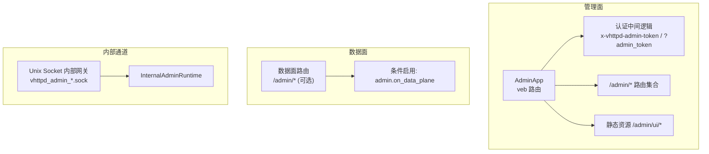
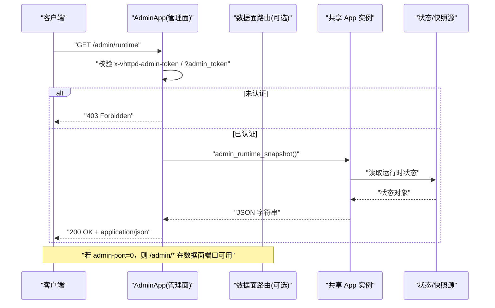
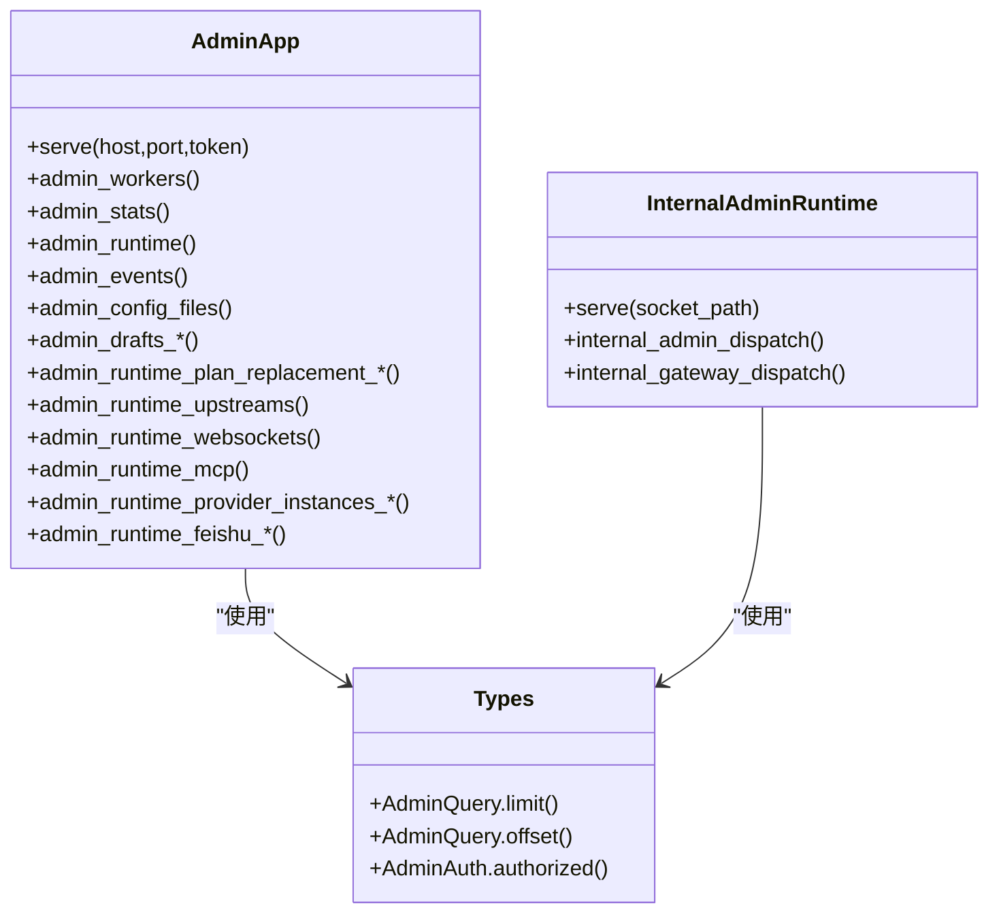

# Admin API 参考

<cite>
**本文引用的文件**   
- [README.md](file://README.md)
- [admin_server.v](file://src/admin_server.v)
- [admin_runtime.v](file://src/admin_runtime.v)
- [admin_provider_runtime.v](file://src/admin_provider_runtime.v)
- [internal_admin.v](file://src/internal_admin.v)
- [types.v](file://src/admin/types.v)
- [app.js](file://admin/ui/app.js)
</cite>

## 目录
1. [简介](#简介)
2. [项目结构](#项目结构)
3. [核心组件](#核心组件)
4. [架构总览](#架构总览)
5. [详细接口参考](#详细接口参考)
6. [依赖关系分析](#依赖关系分析)
7. [性能与可用性建议](#性能与可用性建议)
8. [故障排查指南](#故障排查指南)
9. [结论](#结论)

## 简介
本参考文档面向 vhttpd 的管理端（Admin）API，覆盖运行时状态查询、Worker 管理、配置与草稿管理、事件监控、应用/提供者/执行器信息、计划替换工作流等。文档包含：
- 所有管理端点的 HTTP 方法、URL 路径、请求参数、响应格式与错误码
- 认证机制说明与端口暴露模型
- 分页、过滤与批量操作使用指南
- 典型请求/响应示例（以 curl 形式给出）

## 项目结构
Admin API 由“管理面”和“数据面”两套路由组成：
- 管理面：独立监听 admin host/port，默认提供 /health、/admin/* 等管理端点，支持静态 UI 资源挂载
- 数据面：当 admin-port 为 0 时，/admin/* 在数据平面端口提供服务；否则仅出现在管理面

图示来源
- [admin_server.v:111-115](file://src/admin_server.v#L111-L115)
- [admin_server.v:987-1028](file://src/admin_server.v#L987-L1028)
- [admin_runtime.v:7-20](file://src/admin_runtime.v#L7-L20)
- [internal_admin.v:217-295](file://src/internal_admin.v#L217-L295)

章节来源
- [admin_server.v:111-115](file://src/admin_server.v#L111-L115)
- [admin_server.v:987-1028](file://src/admin_server.v#L987-L1028)
- [admin_runtime.v:7-20](file://src/admin_runtime.v#L7-L20)
- [internal_admin.v:217-295](file://src/internal_admin.v#L217-L295)

## 核心组件
- AdminApp：管理面 HTTP 服务，负责路由注册、认证校验、JSON/文本响应封装、静态资源挂载
- 数据面路由：在特定条件下于数据平面暴露 /admin/*
- InternalAdminRuntime：通过 Unix Socket 暴露的内部管理接口，供进程内其他模块调用
- 认证与查询工具：AdminAuth、AdminQuery 提供 token 校验与 limit/offset 等通用参数处理

章节来源
- [admin_server.v:13-22](file://src/admin_server.v#L13-L22)
- [admin_server.v:101-109](file://src/admin_server.v#L101-L109)
- [types.v:105-139](file://src/admin/types.v#L105-L139)
- [internal_admin.v:11-16](file://src/internal_admin.v#L11-L16)

## 架构总览
管理面与数据面的路由分发、认证与响应封装流程如下：

图示来源
- [admin_server.v:143-153](file://src/admin_server.v#L143-L153)
- [admin_server.v:101-109](file://src/admin_server.v#L101-L109)
- [admin_runtime.v:7-20](file://src/admin_runtime.v#L7-L20)

## 详细接口参考

### 认证与端口暴露模型
- 认证方式
  - 当未设置 admin token 时，管理面端口开放访问
  - 当设置了 admin token 时，需在请求中携带以下任一方式：
    - 请求头：x-vhttpd-admin-token: <token>
    - 查询参数：?admin_token=<token>
  - 缺失或无效 token 返回 403 Forbidden
- 端口暴露模型
  - 当 --admin-port 为 0（禁用）时：/admin/* 在数据平面端口提供服务
  - 当 --admin-port > 0（启用）时：/admin/* 从数据平面移除（返回 404），仅在管理面 host/port 上提供服务

章节来源
- [README.md:1187-1203](file://README.md#L1187-L1203)
- [types.v:130-139](file://src/admin/types.v#L130-L139)

### 健康检查
- GET /health
  - 用途：管理面存活检查
  - 成功响应：200 OK，文本体为 OK
  - 无需认证

章节来源
- [admin_server.v:111-115](file://src/admin_server.v#L111-L115)

### 运行时概览
- GET /admin/runtime
  - 用途：获取运行时能力与活跃连接/会话计数
  - 认证：需要（如配置了 token）
  - 响应：application/json; charset=utf-8
  - 示例：见 README 中的 curl 示例

章节来源
- [README.md:1158-1160](file://README.md#L1158-L1160)
- [admin_server.v:143-153](file://src/admin_server.v#L143-L153)
- [admin_runtime.v:7-20](file://src/admin_runtime.v#L7-L20)

- GET /admin/runtime/graph
  - 用途：获取运行时图快照
  - 认证：需要
  - 响应：application/json; charset=utf-8

章节来源
- [admin_server.v:187-197](file://src/admin_server.v#L187-L197)
- [admin_runtime.v:60-73](file://src/admin_runtime.v#L60-L73)

- GET /admin/runtime/plan
  - 用途：获取当前运行时的 plan JSON
  - 认证：需要
  - 响应：application/json; charset=utf-8

章节来源
- [admin_server.v:155-165](file://src/admin_server.v#L155-L165)
- [admin_runtime.v:22-35](file://src/admin_runtime.v#L22-L35)

### Worker 管理
- GET /admin/workers
  - 用途：返回 worker 池运行时快照
  - 认证：需要
  - 响应：application/json; charset=utf-8
  - 字段说明：顶层包含 worker_autostart、worker_pool_size、worker_rr_index、worker_max_requests、worker_sockets、workers 列表；每个 worker 项包含 id、socket、alive、draining、inflight_requests、served_requests、restart_count、next_retry_ts 等
  - 示例：见 README 中的 curl 示例

章节来源
- [README.md:1152-1154](file://README.md#L1152-L1154)
- [README.md:1204-1221](file://README.md#L1204-L1221)
- [admin_server.v:117-129](file://src/admin_server.v#L117-L129)

- POST /admin/workers/restart?id=<worker_id>
  - 用途：按 ID 重启单个受管 worker
  - 认证：需要
  - 请求参数：id（必填，整数）
  - 响应：application/json; charset=utf-8，包含 ok、mode、worker 状态
  - 错误码：400 缺少 id；404 worker 不存在；403 未认证

章节来源
- [README.md:1180-1182](file://README.md#L1180-L1182)
- [admin_server.v:839-878](file://src/admin_server.v#L839-L878)

- POST /admin/workers/restart/all
  - 用途：重启池中所有受管 worker
  - 认证：需要
  - 请求参数：force（可选，布尔值）
  - 响应：application/json; charset=utf-8，包含 ok、mode、restarted、force
  - 错误码：403 未认证

章节来源
- [README.md:1183-1185](file://README.md#L1183-L1185)
- [admin_server.v:880-904](file://src/admin_server.v#L880-L904)

- POST /admin/workers/drain
  - 用途：对指定引擎的 worker 进行排空（drain）
  - 认证：需要
  - 请求参数：engine 或 kind（二选一，字符串）
  - 响应：application/json; charset=utf-8，包含 engine、draining_count、inflight_requests
  - 错误码：404 引擎不存在；403 未认证

章节来源
- [admin_server.v:906-928](file://src/admin_server.v#L906-L928)

### 统计与事件
- GET /admin/stats
  - 用途：返回进程级运行时计数器
  - 认证：需要
  - 响应：application/json; charset=utf-8

章节来源
- [README.md:1155-1157](file://README.md#L1155-L1157)
- [admin_server.v:131-141](file://src/admin_server.v#L131-L141)

- GET /admin/events?limit=N
  - 用途：列出最近的事件日志
  - 认证：需要
  - 请求参数：limit（可选，默认 100，最大 1000）
  - 响应：application/json; charset=utf-8

章节来源
- [admin_server.v:167-185](file://src/admin_server.v#L167-L185)
- [admin_runtime.v:37-58](file://src/admin_runtime.v#L37-L58)
- [types.v:109-118](file://src/admin/types.v#L109-L118)

### 配置与草稿管理
- GET /admin/config/files
  - 用途：列出配置文件清单
  - 认证：需要
  - 响应：application/json; charset=utf-8

章节来源
- [admin_server.v:307-317](file://src/admin_server.v#L307-L317)
- [admin_runtime.v:159-172](file://src/admin_runtime.v#L159-L172)

- POST /admin/config/files/draft?path=...
  - 用途：打开配置文件的草稿编辑会话
  - 认证：需要
  - 请求参数：path 或 include_path（二选一，目标文件路径）
  - 响应：application/json; charset=utf-8，包含 draft_id、ok、error
  - 状态码：200 成功；422 参数不合法

章节来源
- [admin_server.v:319-334](file://src/admin_server.v#L319-L334)
- [admin_runtime.v:174-192](file://src/admin_runtime.v#L174-L192)

- GET /admin/source/files
  - 用途：列出源代码文件清单
  - 认证：需要
  - 响应：application/json; charset=utf-8

章节来源
- [admin_server.v:336-346](file://src/admin_server.v#L336-L346)

- POST /admin/source/files/draft?path=...
  - 用途：打开源代码文件的草稿编辑会话
  - 认证：需要
  - 请求参数：path 或 include_path（二选一，目标文件路径）
  - 响应：application/json; charset=utf-8，包含 draft_id、ok、error
  - 状态码：200 成功；400 参数不合法

章节来源
- [admin_server.v:348-363](file://src/admin_server.v#L348-L363)

- GET /admin/drafts
  - 用途：列出所有草稿
  - 认证：需要
  - 响应：application/json; charset=utf-8

章节来源
- [admin_server.v:288-305](file://src/admin_server.v#L288-L305)
- [admin_runtime.v:137-157](file://src/admin_runtime.v#L137-L157)

- POST /admin/drafts?id=...
  - 用途：创建或更新草稿条目（body 为 JSON）
  - 认证：需要
  - 请求参数：id（可选，用于定位草稿）
  - 响应：application/json; charset=utf-8，包含 key、draft_id 等
  - 状态码：200 成功；400 写入失败

章节来源
- [admin_server.v:365-385](file://src/admin_server.v#L365-L385)
- [admin_runtime.v:194-217](file://src/admin_runtime.v#L194-L217)

- GET /admin/drafts/:id
  - 用途：获取指定草稿内容
  - 认证：需要
  - 路径参数：id
  - 响应：application/json; charset=utf-8
  - 状态码：200 成功；404 不存在

章节来源
- [admin_server.v:405-423](file://src/admin_server.v#L405-L423)
- [admin_runtime.v:219-240](file://src/admin_runtime.v#L219-L240)

- PUT /admin/drafts/:id
  - 用途：更新指定草稿（body 为 JSON）
  - 认证：需要
  - 路径参数：id
  - 响应：application/json; charset=utf-8
  - 状态码：200 成功；400 写入失败

章节来源
- [admin_server.v:425-444](file://src/admin_server.v#L425-L444)
- [admin_runtime.v:242-264](file://src/admin_runtime.v#L242-L264)

- DELETE /admin/drafts/:id
  - 用途：删除指定草稿
  - 认证：需要
  - 路径参数：id
  - 响应：application/json; charset=utf-8，包含 ok、draft_id
  - 状态码：200 成功；400 删除失败

章节来源
- [admin_server.v:446-468](file://src/admin_server.v#L446-L468)
- [admin_runtime.v:266-291](file://src/admin_runtime.v#L266-L291)

- POST /admin/drafts/:id/validate
  - 用途：验证草稿合法性
  - 认证：需要
  - 路径参数：id
  - 响应：application/json; charset=utf-8，包含 ok、error
  - 状态码：200 合法；422 非法

章节来源
- [admin_server.v:930-944](file://src/admin_server.v#L930-L944)
- [admin_runtime.v:293-310](file://src/admin_runtime.v#L293-L310)

- GET /admin/drafts/:id/diff
  - 用途：预览草稿差异
  - 认证：需要
  - 路径参数：id
  - 响应：application/json; charset=utf-8，包含 allowed、strategy 等
  - 状态码：200 成功；422 预览失败

章节来源
- [admin_server.v:946-967](file://src/admin_server.v#L946-L967)
- [admin_runtime.v:312-336](file://src/admin_runtime.v#L312-L336)

- POST /admin/drafts/:id/publish?path=...
  - 用途：发布草稿到目标路径
  - 认证：需要
  - 路径参数：id
  - 请求参数：path 或 include_path（二选一，目标路径）
  - 响应：application/json; charset=utf-8，包含 ok、error
  - 状态码：200 成功；422 发布失败

章节来源
- [admin_server.v:969-985](file://src/admin_server.v#L969-L985)
- [admin_runtime.v:338-357](file://src/admin_runtime.v#L338-L357)

### 运行时计划替换工作流
- GET /admin/runtime/plan/replacement?config=...
  - 用途：预览运行时计划替换效果
  - 认证：需要
  - 请求参数：config 或 path（二选一，配置文件路径）
  - 响应：application/json; charset=utf-8，包含 allowed 等
  - 状态码：200 成功；400 预览失败

章节来源
- [admin_server.v:470-489](file://src/admin_server.v#L470-L489)
- [admin_runtime.v:359-381](file://src/admin_runtime.v#L359-L381)

- GET /admin/runtime/plan/replacement/state
  - 用途：获取替换工作流当前状态
  - 认证：需要
  - 响应：application/json; charset=utf-8

章节来源
- [admin_server.v:491-501](file://src/admin_server.v#L491-L501)
- [admin_runtime.v:383-396](file://src/admin_runtime.v#L383-L396)

- POST /admin/runtime/plan/replacement/apply?config=...
  - 用途：应用替换计划
  - 认证：需要
  - 请求参数：config 或 path（二选一，配置文件路径）
  - 响应：application/json; charset=utf-8，包含 applied、status、error
  - 状态码：200 成功；400 应用失败

章节来源
- [admin_server.v:503-525](file://src/admin_server.v#L503-L525)
- [admin_runtime.v:398-423](file://src/admin_runtime.v#L398-L423)

- POST /admin/runtime/plan/replacement/finalize
  - 用途：确认并终态化替换结果
  - 认证：需要
  - 响应：application/json; charset=utf-8，包含 applied、status、error
  - 状态码：200 成功；非 200 表示未完成或失败

章节来源
- [admin_server.v:527-541](file://src/admin_server.v#L527-L541)
- [admin_runtime.v:425-442](file://src/admin_runtime.v#L425-L442)

- POST /admin/runtime/plan/replacement/cancel
  - 用途：取消替换工作流
  - 认证：需要
  - 响应：application/json; charset=utf-8，包含 cancelled、status、error
  - 状态码：200 成功；非 200 表示无法取消或失败

章节来源
- [admin_server.v:543-557](file://src/admin_server.v#L543-L557)
- [admin_runtime.v:444-461](file://src/admin_runtime.v#L444-L461)

### 应用与提供者/执行器
- GET /admin/apps
  - 用途：获取应用快照（别名）
  - 认证：需要
  - 响应：application/json; charset=utf-8

章节来源
- [admin_server.v:199-209](file://src/admin_server.v#L199-L209)

- GET /admin/applications
  - 用途：获取应用快照（别名）
  - 认证：需要
  - 响应：application/json; charset=utf-8

章节来源
- [admin_server.v:211-221](file://src/admin_server.v#L211-L221)

- GET /admin/sites
  - 用途：获取站点快照（别名）
  - 认证：需要
  - 响应：application/json; charset=utf-8

章节来源
- [admin_server.v:223-233](file://src/admin_server.v#L223-L233)

- GET /admin/providers/specs
  - 用途：获取已注册的提供者规格
  - 认证：需要
  - 响应：application/json; charset=utf-8

章节来源
- [admin_server.v:599-609](file://src/admin_server.v#L599-L609)
- [admin_provider_runtime.v:6-18](file://src/admin_provider_runtime.v#L6-L18)

- GET /admin/providers/runtimes
  - 用途：获取提供者运行时快照
  - 认证：需要
  - 响应：application/json; charset=utf-8

章节来源
- [admin_server.v:611-621](file://src/admin_server.v#L611-L621)
- [admin_provider_runtime.v:20-32](file://src/admin_provider_runtime.v#L20-L32)

- GET /admin/executors
  - 用途：获取执行器规格快照
  - 认证：需要
  - 响应：application/json; charset=utf-8

章节来源
- [admin_server.v:587-597](file://src/admin_server.v#L587-L597)

### 运行时子系统与上游连接
- GET /admin/runtime/upstreams?details=1&limit=20&offset=0&role=&provider=
  - 用途：获取活跃的 phase-3 上游会话
  - 认证：需要
  - 请求参数：
    - details：是否返回详细信息（布尔值）
    - limit：返回条数上限（默认 100，最大 1000）
    - offset：偏移量
    - role：角色过滤
    - provider：提供者过滤
  - 响应：application/json; charset=utf-8

章节来源
- [README.md:1161-1165](file://README.md#L1161-L1165)
- [admin_server.v:623-639](file://src/admin_server.v#L623-L639)
- [admin_runtime.v:478-497](file://src/admin_runtime.v#L478-L497)
- [types.v:105-126](file://src/admin/types.v#L105-L126)

- GET /admin/runtime/websockets?details=1&limit=20&offset=0&room=&conn_id=
  - 用途：获取活跃的 WebSocket 连接与房间快照
  - 认证：需要
  - 请求参数：
    - details：是否返回详细信息（布尔值）
    - limit：返回条数上限（默认 100，最大 1000）
    - offset：偏移量
    - room：房间过滤
    - conn_id：连接 ID 过滤
  - 响应：application/json; charset=utf-8

章节来源
- [README.md:1166-1170](file://README.md#L1166-L1170)
- [admin_server.v:641-657](file://src/admin_server.v#L641-L657)
- [admin_runtime.v:499-517](file://src/admin_runtime.v#L499-L517)
- [types.v:105-126](file://src/admin/types.v#L105-L126)

- GET /admin/runtime/mcp?details=1&limit=20&offset=0&session_id=&protocol_version=
  - 用途：获取活跃的 MCP 会话快照
  - 认证：需要
  - 请求参数：
    - details：是否返回详细信息（布尔值）
    - limit：返回条数上限（默认 100，最大 1000）
    - offset：偏移量
    - session_id：会话 ID 过滤
    - protocol_version：协议版本过滤
  - 响应：application/json; charset=utf-8

章节来源
- [README.md:1171-1175](file://README.md#L1171-L1175)
- [admin_server.v:659-675](file://src/admin_server.v#L659-L675)
- [admin_runtime.v:519-538](file://src/admin_runtime.v#L519-L538)
- [types.v:105-126](file://src/admin/types.v#L105-L126)

- GET /admin/runtime/provider-instances?provider=
  - 用途：获取提供者实例快照（可按 provider 过滤）
  - 认证：需要
  - 请求参数：provider（可选）
  - 响应：application/json; charset=utf-8

章节来源
- [admin_server.v:677-688](file://src/admin_server.v#L677-L688)
- [admin_runtime.v:540-554](file://src/admin_runtime.v#L540-L554)

- POST /admin/runtime/provider-instances
  - 用途：新增或更新提供者实例（body 为 JSON）
  - 认证：需要
  - 请求体：JSON，必须包含 provider 等必要字段
  - 响应：application/json; charset=utf-8，包含 snapshot.provider、snapshot.instance
  - 状态码：200 成功；400 无效 JSON 或缺少 provider；422 其他校验失败

章节来源
- [admin_server.v:690-716](file://src/admin_server.v#L690-L716)
- [admin_runtime.v:556-585](file://src/admin_runtime.v#L556-L585)

- POST /admin/runtime/events
  - 用途：向运行时派发事件（body 为 JSON）
  - 认证：需要
  - 请求体：JSON，事件载荷
  - 响应：application/json; charset=utf-8，包含 pipeline、ingress、event
  - 状态码：202 已接受；400 派发失败

章节来源
- [admin_server.v:718-740](file://src/admin_server.v#L718-L740)
- [admin_runtime.v:587-612](file://src/admin_runtime.v#L587-L612)

- GET /admin/runtime/feishu
  - 用途：获取飞书提供者运行时快照
  - 认证：需要
  - 响应：application/json; charset=utf-8

章节来源
- [admin_server.v:742-752](file://src/admin_server.v#L742-L752)
- [admin_runtime.v:629-642](file://src/admin_runtime.v#L629-L642)

- GET /admin/runtime/codex
  - 用途：获取 Codex 提供者运行时快照
  - 认证：需要
  - 响应：application/json; charset=utf-8

章节来源
- [admin_server.v:754-764](file://src/admin_server.v#L754-L764)
- [admin_runtime.v:614-627](file://src/admin_runtime.v#L614-L627)

- GET /admin/runtime/db
  - 用途：获取数据库提供者运行时快照
  - 认证：需要
  - 响应：application/json; charset=utf-8

章节来源
- [admin_server.v:766-776](file://src/admin_server.v#L766-L776)
- [admin_runtime.v:644-657](file://src/admin_runtime.v#L644-L657)

- GET /admin/runtime/cache
  - 用途：获取缓存提供者运行时快照
  - 认证：需要
  - 响应：application/json; charset=utf-8

章节来源
- [admin_server.v:778-788](file://src/admin_server.v#L778-L788)
- [admin_runtime.v:659-672](file://src/admin_runtime.v#L659-L672)

- GET /admin/runtime/feishu/chats?limit=...&offset=...&instance=&chat_type=&chat_id=
  - 用途：获取飞书聊天快照（可分页与过滤）
  - 认证：需要
  - 请求参数：limit、offset、instance、chat_type、chat_id
  - 响应：application/json; charset=utf-8

章节来源
- [admin_server.v:790-806](file://src/admin_server.v#L790-L806)

- POST /admin/runtime/feishu/messages
  - 用途：发送飞书消息（body 为 JSON，SendMessageRequest）
  - 认证：需要
  - 请求体：JSON，符合飞书发送消息请求结构
  - 响应：application/json; charset=utf-8，包含 ok、message_id 或 error
  - 状态码：200 成功；400 无效 JSON；502 下游发送失败

章节来源
- [admin_server.v:808-837](file://src/admin_server.v#L808-L837)

### 模式与 Schema
- GET /admin/schema
  - 用途：列出所有 schema 域
  - 认证：需要
  - 响应：application/json; charset=utf-8

章节来源
- [admin_server.v:235-245](file://src/admin_server.v#L235-L245)
- [admin_runtime.v:75-88](file://src/admin_runtime.v#L75-L88)

- GET /admin/schema/:domain
  - 用途：获取指定域的 schema 定义
  - 认证：需要
  - 路径参数：domain
  - 响应：application/json; charset=utf-8
  - 状态码：200 成功；404 域不存在

章节来源
- [admin_server.v:247-265](file://src/admin_server.v#L247-L265)
- [admin_runtime.v:90-111](file://src/admin_runtime.v#L90-L111)

- GET /admin/schema/:domain/:kind
  - 用途：获取指定域与类型的 schema 定义
  - 认证：需要
  - 路径参数：domain、kind
  - 响应：application/json; charset=utf-8
  - 状态码：200 成功；404 类型不存在

章节来源
- [admin_server.v:267-286](file://src/admin_server.v#L267-L286)
- [admin_runtime.v:113-135](file://src/admin_runtime.v#L113-L135)

### 内部网关（Unix Socket）
- 内部模式：vhttpd_admin
  - 支持的 GET 路径包括：/executors、/runtime、/runtime/plan/replacement、/runtime/plan/replacement/state、/runtime/transformers、/runtime/provider-instances、/runtime/feishu、/runtime/db、/runtime/feishu/chats、/runtime/upstreams/websocket、/runtime/upstreams/websocket/events、/runtime/upstreams/websocket/activities
  - 支持的 POST 路径包括：/runtime/plan/replacement/apply、/runtime/plan/replacement/finalize、/runtime/plan/replacement/cancel、/workers/drain
- 内部模式：vhttpd_gateway
  - 支持的 POST 路径包括：/upstreams/websocket/send、/feishu/messages、/feishu/images（支持二进制负载）

章节来源
- [internal_admin.v:13-147](file://src/internal_admin.v#L13-L147)
- [internal_admin.v:149-215](file://src/internal_admin.v#L149-L215)
- [internal_admin.v:217-295](file://src/internal_admin.v#L217-L295)

### 管理 UI 前端
- 管理 UI 静态资源挂载于 /admin/ui/*，并提供根路径与常用端点的前端交互
- 前端通过 x-vhttpd-admin-token 头传递认证令牌

章节来源
- [admin_server.v:987-1008](file://src/admin_server.v#L987-L1008)
- [app.js:1-41](file://admin/ui/app.js#L1-L41)

## 依赖关系分析
- AdminApp 依赖共享 App 实例以获取各类快照与状态
- 认证与查询工具集中在 types.v 中，被管理面与数据面共同复用
- 内部网关通过 Unix Socket 与进程内调度器通信，避免额外网络开销

图示来源
- [admin_server.v:13-22](file://src/admin_server.v#L13-L22)
- [types.v:105-139](file://src/admin/types.v#L105-L139)
- [internal_admin.v:292-295](file://src/internal_admin.v#L292-L295)

章节来源
- [admin_server.v:13-22](file://src/admin_server.v#L13-L22)
- [types.v:105-139](file://src/admin/types.v#L105-L139)
- [internal_admin.v:217-295](file://src/internal_admin.v#L217-L295)

## 性能与可用性建议
- 分页与过滤
  - 所有列表型接口均支持 limit 与 offset，建议合理设置 limit（默认 100，最大 1000）以避免大响应体
  - 对于 websockets、upstreams、mcp 等高频接口，优先使用 details=false 的摘要模式，必要时再开启 details=true
- 批量操作
  - 重启所有 worker：POST /admin/workers/restart/all，配合 force 参数控制强制行为
  - 提供者实例 upsert：POST /admin/runtime/provider-instances，适合批量更新多个实例
- 超时与重试
  - 对长耗时操作（如 plan replacement apply/finalize/cancel）应实现幂等与重试策略，依据返回 status 字段判断阶段
- 安全
  - 生产环境务必启用 admin token，并通过反向代理限制来源 IP

[本节为通用指导，不涉及具体文件分析]

## 故障排查指南
- 403 Forbidden
  - 原因：未提供或提供了错误的 admin token
  - 处理：确认 x-vhttpd-admin-token 或 ?admin_token 是否正确
- 404 Not Found
  - 原因：在数据面端口访问 /admin/* 但 admin-port 已启用；或请求路径不存在
  - 处理：切换到管理面端口或修正路径
- 400 Bad Request
  - 原因：参数缺失或 JSON 解析失败
  - 处理：检查必填参数与请求体结构
- 422 Unprocessable Entity
  - 原因：草稿校验失败、发布失败、计划替换不可用等
  - 处理：查看响应中的 error 字段，修正配置或草稿内容
- 502 Bad Gateway
  - 原因：下游服务不可达（例如飞书消息发送）
  - 处理：检查下游服务状态与网络连通性

章节来源
- [admin_server.v:93-99](file://src/admin_server.v#L93-L99)
- [admin_server.v:839-878](file://src/admin_server.v#L839-L878)
- [admin_server.v:808-837](file://src/admin_server.v#L808-L837)

## 结论
本文档系统化梳理了 vhttpd 的 Admin API，涵盖认证、端口模型、全部管理端点、请求/响应规范、分页与过滤、批量操作与工作流，以及常见问题排查。建议在自动化运维与平台集成中遵循分页与过滤最佳实践，结合内部网关进行高效进程内管理。