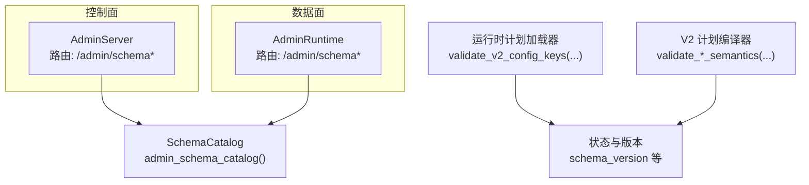
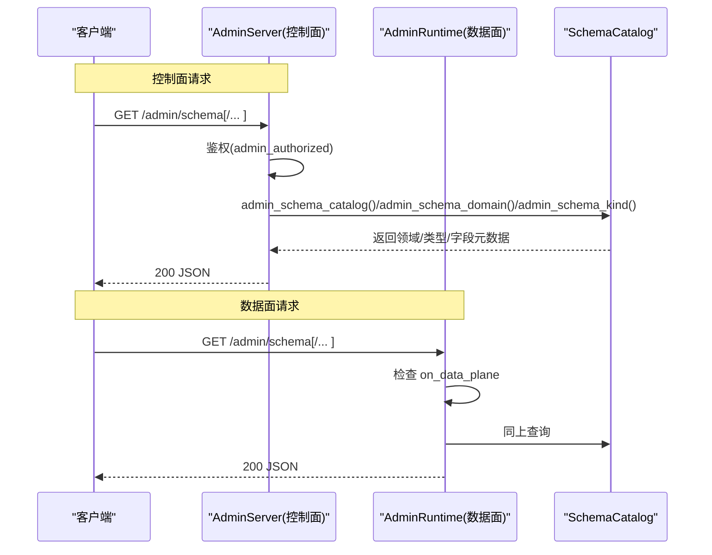
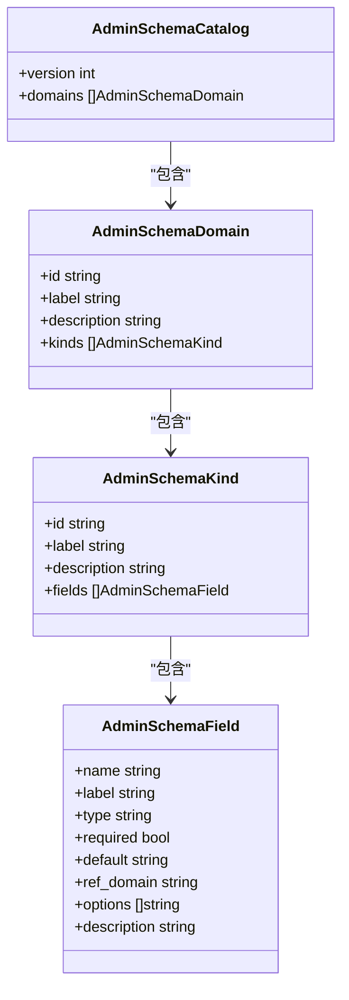

# Schema 管理 API

<cite>
**本文引用的文件**   
- [admin_server.v](file://src/admin_server.v)
- [admin_runtime.v](file://src/admin_runtime.v)
- [admin_schema_runtime.v](file://src/admin_schema_runtime.v)
- [ADMIN_CONTROL_PLANE_PLAN.md](file://docs/ADMIN_CONTROL_PLANE_PLAN.md)
- [runtime_plan_loader.v](file://src/config/runtime_plan_loader.v)
- [v2_plan_compiler.v](file://src/config/v2_plan_compiler.v)
- [admin_state_runtime.v](file://src/admin_state_runtime.v)
- [admin_runtime_plan_replacement_preview.v](file://src/admin_runtime_plan_replacement_preview.v)
- [admin_runtime_plan_replacement_types.v](file://src/admin_runtime_plan_replacement_types.v)
</cite>

## 目录
1. [简介](#简介)
2. [项目结构](#项目结构)
3. [核心组件](#核心组件)
4. [架构总览](#架构总览)
5. [详细组件分析](#详细组件分析)
6. [依赖关系分析](#依赖关系分析)
7. [性能与可用性](#性能与可用性)
8. [故障排查指南](#故障排查指南)
9. [结论](#结论)
10. [附录：Schema 领域模型与字段规范](#附录schema-领域模型与字段规范)

## 简介
本文件面向使用 vhttpd 控制面与数据面的运维与开发者，系统化说明 Schema 管理 API 的设计、实现与使用方法。重点覆盖以下接口：
- GET /admin/schema
- GET /admin/schema/:domain
- GET /admin/schema/:domain/:kind

这些接口用于暴露运行时配置模型的“元数据”，供前端或工具自动生成表单、进行校验与可视化。文档同时给出 Schema 目录结构、领域模型定义、数据类型规范，以及版本管理、兼容性检查与迁移指南，并总结最佳实践与验证工具用法。

## 项目结构
Schema 相关能力由三部分协作完成：
- 路由层：在控制面和数据面分别注册 /admin/schema* 的 GET 路由处理器
- 数据层：集中维护 Schema 目录（领域、类型、字段）
- 校验与版本：基于运行时计划加载器与编译器执行语义校验与兼容性检查

图表来源
- [admin_server.v:235-286](file://src/admin_server.v#L235-L286)
- [admin_runtime.v:75-135](file://src/admin_runtime.v#L75-L135)
- [admin_schema_runtime.v:37-70](file://src/admin_schema_runtime.v#L37-L70)
- [runtime_plan_loader.v:505-533](file://src/config/runtime_plan_loader.v#L505-L533)
- [v2_plan_compiler.v:747-787](file://src/config/v2_plan_compiler.v#L747-L787)
- [admin_state_runtime.v:31](file://src/admin_state_runtime.v#L31)

章节来源
- [admin_server.v:235-286](file://src/admin_server.v#L235-L286)
- [admin_runtime.v:75-135](file://src/admin_runtime.v#L75-L135)
- [admin_schema_runtime.v:37-70](file://src/admin_schema_runtime.v#L37-L70)

## 核心组件
- 路由处理器
  - 控制面：在 admin_server.v 中为 /admin/schema、/admin/schema/:domain、/admin/schema/:domain/:kind 提供认证后的 JSON 响应
  - 数据面：在 admin_runtime.v 中提供相同路径的数据面访问（需 on_data_plane 启用）
- Schema 目录
  - 在 admin_schema_runtime.v 中以结构化方式声明所有领域（listeners、resources、engines、adapters、transforms、policies、providers、pipelines、relays），每个领域包含若干 kind，每个 kind 包含若干 field
- 字段元信息
  - 每个 AdminSchemaField 包含 name、label、type、required、default、ref_domain、options、description，用于 UI 渲染与前端校验
- 运行时计划校验
  - runtime_plan_loader.v 对 V2 配置的键空间进行白名单校验
  - v2_plan_compiler.v 对引擎、转换器等执行语义校验
- 版本与兼容性
  - 运行时计划 source.schema_version 贯穿预览、应用、最终化流程，并在替换预览中对比当前与下一个 schema_version

章节来源
- [admin_server.v:235-286](file://src/admin_server.v#L235-L286)
- [admin_runtime.v:75-135](file://src/admin_runtime.v#L75-L135)
- [admin_schema_runtime.v:37-70](file://src/admin_schema_runtime.v#L37-L70)
- [runtime_plan_loader.v:505-533](file://src/config/runtime_plan_loader.v#L505-L533)
- [v2_plan_compiler.v:747-787](file://src/config/v2_plan_compiler.v#L747-L787)
- [admin_state_runtime.v:31](file://src/admin_state_runtime.v#L31)

## 架构总览
Schema 管理 API 的请求处理流程如下：

图表来源
- [admin_server.v:235-286](file://src/admin_server.v#L235-L286)
- [admin_runtime.v:75-135](file://src/admin_runtime.v#L75-L135)
- [admin_schema_runtime.v:37-70](file://src/admin_schema_runtime.v#L37-L70)

## 详细组件分析

### 路由与鉴权
- 控制面
  - 路径：/admin/schema、/admin/schema/:domain、/admin/schema/:domain/:kind
  - 鉴权：通过 admin_authorized(ctx) 校验 token/header/query
  - 未授权：返回 403 Forbidden
  - 成功：返回 application/json; charset=utf-8
- 数据面
  - 路径：同上
  - 前置条件：control_plane.admin.on_data_plane 必须为真，否则返回 404 Not Found
  - 成功：返回 application/json

章节来源
- [admin_server.v:235-286](file://src/admin_server.v#L235-L286)
- [admin_runtime.v:75-135](file://src/admin_runtime.v#L75-L135)

### Schema 目录结构与领域模型
- 顶层结构
  - AdminSchemaCatalog：包含 version 与 domains[]
  - AdminSchemaDomain：id、label、description、kinds[]
  - AdminSchemaKind：id、label、description、fields[]
  - AdminSchemaField：name、label、type、required、default、ref_domain、options、description
- 内置领域
  - listeners：HTTP/WebSocket 监听器
  - resources：数据库、缓存、存储、密钥源
  - engines：PHP Worker、PHP CGI、VJSX 执行引擎
  - adapters：HTTP Handler、Static、Upload、Upstream、Fixed Response、Event Ingress、MCP、Relay Delivery、Provider Action 等
  - transforms：Native、VJSX 转换器
  - policies：cache、limits、security、response、retry、concurrency
  - providers：Provider Runtime
  - pipelines：协议流水线（ingress/match/transforms/policies/egress）
  - relays：Hub/Agent 跨节点中继

章节来源
- [admin_schema_runtime.v:3-70](file://src/admin_schema_runtime.v#L3-L70)
- [admin_schema_runtime.v:72-116](file://src/admin_schema_runtime.v#L72-L116)
- [admin_schema_runtime.v:118-185](file://src/admin_schema_runtime.v#L118-L185)
- [admin_schema_runtime.v:187-225](file://src/admin_schema_runtime.v#L187-L225)
- [admin_schema_runtime.v:227-314](file://src/admin_schema_runtime.v#L227-L314)
- [admin_schema_runtime.v:316-348](file://src/admin_schema_runtime.v#L316-L348)
- [admin_schema_runtime.v:350-379](file://src/admin_schema_runtime.v#L350-L379)
- [admin_schema_runtime.v:381-410](file://src/admin_schema_runtime.v#L381-L410)
- [admin_schema_runtime.v:412-450](file://src/admin_schema_runtime.v#L412-L450)
- [admin_schema_runtime.v:452-492](file://src/admin_schema_runtime.v#L452-L492)

### 字段类型与校验元数据
- 支持类型
  - string、int、bool、path、text、enum、map、string_list、ref、ref_list、secret
- 关键字段
  - required：是否必填
  - default：默认值
  - ref_domain：引用目标领域（如 engine、resource、listener、relay、pipeline、transform、policy）
  - options：枚举选项列表
  - description：字段说明
- 策略字段类型推导
  - policy_field_type 根据命名约定自动推断 int/bool/map/string_list 等类型

章节来源
- [admin_schema_runtime.v:494-525](file://src/admin_schema_runtime.v#L494-L525)

### 接口行为与错误码
- GET /admin/schema
  - 返回完整目录（domains 列表）
- GET /admin/schema/:domain
  - 若 domain 不存在：404 + error=schema_domain_not_found
- GET /admin/schema/:domain/:kind
  - 若 kind 不存在：404 + error=schema_kind_not_found
- 控制面未授权：403 Forbidden
- 数据面未启用：404 Not Found

章节来源
- [admin_server.v:235-286](file://src/admin_server.v#L235-L286)
- [admin_runtime.v:75-135](file://src/admin_runtime.v#L75-L135)

### 与运行时计划的关联
- 运行时计划加载器对 V2 配置键空间进行白名单校验，确保新增/删除字段时具备强约束
- 编译器对引擎、转换器等进行语义校验（例如必填项缺失、未知 kind 等）
- 替换预览与应用流程会输出 current_schema_version 与 next_schema_version，便于对比变更

章节来源
- [runtime_plan_loader.v:505-533](file://src/config/runtime_plan_loader.v#L505-L533)
- [v2_plan_compiler.v:747-787](file://src/config/v2_plan_compiler.v#L747-L787)
- [admin_runtime_plan_replacement_preview.v:36-49](file://src/admin_runtime_plan_replacement_preview.v#L36-L49)
- [admin_runtime_plan_replacement_types.v:58-92](file://src/admin_runtime_plan_replacement_types.v#L58-L92)

## 依赖关系分析
- 路由层依赖 SchemaCatalog 提供的静态目录
- 运行时计划加载器与编译器负责将用户配置编译为运行时计划，并进行键空间与语义校验
- 版本信息贯穿预览、应用、最终化流程，形成可观测的变更轨迹

图表来源
- [admin_schema_runtime.v:3-35](file://src/admin_schema_runtime.v#L3-L35)

章节来源
- [admin_schema_runtime.v:3-35](file://src/admin_schema_runtime.v#L3-L35)

## 性能与可用性
- 路由层仅做鉴权与转发，SchemaCatalog 为内存中的静态结构，查询复杂度低
- 建议在生产环境开启连接复用与合理的并发限制，避免频繁拉取大体积 JSON
- 对于数据面，仅在需要时启用 on_data_plane，以减少攻击面

[本节为通用指导，不直接分析具体文件]

## 故障排查指南
- 403 Forbidden
  - 检查控制面 token 是否正确传递（header 或 query）
- 404 Not Found
  - 数据面：确认 control_plane.admin.on_data_plane 已启用
  - 路由参数：确认 domain/kind 是否存在
- 422/400 校验失败
  - 参考运行时计划加载器的键白名单与编译器的语义校验错误信息，修正配置键名或缺失必填项

章节来源
- [admin_server.v:235-286](file://src/admin_server.v#L235-L286)
- [admin_runtime.v:75-135](file://src/admin_runtime.v#L75-L135)
- [runtime_plan_loader.v:505-533](file://src/config/runtime_plan_loader.v#L505-L533)
- [v2_plan_compiler.v:747-787](file://src/config/v2_plan_compiler.v#L747-L787)

## 结论
Schema 管理 API 以“元数据驱动”的方式统一了配置模型的可发现性与可编辑性。通过控制面与数据面双通道暴露，结合运行时计划加载器与编译器的强校验，实现了从“表单生成—在线校验—预览—应用—最终化”的闭环。配合版本信息与兼容性检查，可在演进过程中保持向后兼容与可观测性。

[本节为总结，不直接分析具体文件]

## 附录：Schema 领域模型与字段规范

### 支持的字段类型
- string：文本
- int：整数
- bool：布尔
- path：文件系统路径
- text：长文本
- enum：枚举（需配合 options）
- map：键值映射
- string_list：字符串数组
- ref：引用其他资源（需 ref_domain）
- ref_list：引用多个资源（需 ref_domain）
- secret：敏感信息（UI 应隐藏）

章节来源
- [admin_schema_runtime.v:494-525](file://src/admin_schema_runtime.v#L494-L525)

### 领域一览与典型 Kind
- listeners
  - http：HTTP 监听器
  - websocket：WebSocket 监听器
- resources
  - db：数据库（mysql/pgsql）
  - cache：缓存（memory/session-store）
  - storage：存储（filesystem）
  - secret：密钥源（env/file）
- engines
  - php-worker、php-cgi、vjsx
- adapters
  - http-handler、static、upload、http-upstream、fixed-response、event-ingress、mcp、mcp-upstream、relay-delivery、provider-action
- transforms
  - native、vjsx
- policies
  - cache、limits、security、response、retry、concurrency
- providers
  - runtime
- pipelines
  - pipeline
- relays
  - hub、agent

章节来源
- [admin_schema_runtime.v:72-116](file://src/admin_schema_runtime.v#L72-L116)
- [admin_schema_runtime.v:118-185](file://src/admin_schema_runtime.v#L118-L185)
- [admin_schema_runtime.v:187-225](file://src/admin_schema_runtime.v#L187-L225)
- [admin_schema_runtime.v:227-314](file://src/admin_schema_runtime.v#L227-L314)
- [admin_schema_runtime.v:316-348](file://src/admin_schema_runtime.v#L316-L348)
- [admin_schema_runtime.v:350-379](file://src/admin_schema_runtime.v#L350-L379)
- [admin_schema_runtime.v:381-410](file://src/admin_schema_runtime.v#L381-L410)
- [admin_schema_runtime.v:412-450](file://src/admin_schema_runtime.v#L412-L450)
- [admin_schema_runtime.v:452-492](file://src/admin_schema_runtime.v#L452-L492)

### 版本管理与兼容性检查
- 版本来源
  - 运行时计划 source.schema_version 标识当前配置模型版本
- 兼容性检查
  - 加载器对 V2 配置键空间进行白名单校验
  - 编译器对引擎、转换器等进行语义校验
- 预览与应用
  - 替换预览返回 current_schema_version 与 next_schema_version，用于对比差异与风险评估

章节来源
- [admin_state_runtime.v:31](file://src/admin_state_runtime.v#L31)
- [runtime_plan_loader.v:505-533](file://src/config/runtime_plan_loader.v#L505-L533)
- [v2_plan_compiler.v:747-787](file://src/config/v2_plan_compiler.v#L747-L787)
- [admin_runtime_plan_replacement_preview.v:36-49](file://src/admin_runtime_plan_replacement_preview.v#L36-L49)
- [admin_runtime_plan_replacement_types.v:58-92](file://src/admin_runtime_plan_replacement_types.v#L58-L92)

### 迁移指南
- 从 V1 到 V2
  - 使用运行时计划加载器进行键空间校验，确保只保留允许的键
  - 遵循 V2 的资源/适配器/转换器/流水线/中继等命名与结构
  - 通过替换预览查看 schema_version 变化，评估影响范围
- 回滚策略
  - 利用替换取消与最终化流程，必要时回退到上一个稳定版本

章节来源
- [REFACTOR_PHASE_REMAINING_WORK.md:61-84](file://docs/REFACTOR_PHASE_REMAINING_WORK.md#L61-L84)
- [admin_runtime_plan_replacement_preview.v:36-49](file://src/admin_runtime_plan_replacement_preview.v#L36-L49)
- [admin_runtime_plan_replacement_types.v:58-92](file://src/admin_runtime_plan_replacement_types.v#L58-L92)

### 最佳实践
- 使用 /admin/schema 动态生成表单，减少前端重复维护规则
- 严格遵循 ref/ref_list 的 ref_domain 约束，避免悬空引用
- 对敏感字段使用 secret 类型，避免明文展示
- 在预览阶段关注 schema_version 变化与 diff 结果，降低上线风险

[本节为通用指导，不直接分析具体文件]

### 验证工具使用方法
- 获取 Schema 目录
  - 调用 GET /admin/schema，解析 domains 与 kinds，构建本地校验器
- 获取特定 Kind 的字段元数据
  - 调用 GET /admin/schema/:domain/:kind，依据 fields 进行前端校验与提示
- 结合运行时计划校验
  - 使用替换预览接口对比 current_schema_version 与 next_schema_version，并结合加载器/编译器的错误信息进行修复

章节来源
- [ADMIN_CONTROL_PLANE_PLAN.md:167-178](file://docs/ADMIN_CONTROL_PLANE_PLAN.md#L167-L178)
- [admin_server.v:235-286](file://src/admin_server.v#L235-L286)
- [admin_runtime.v:75-135](file://src/admin_runtime.v#L75-L135)
- [runtime_plan_loader.v:505-533](file://src/config/runtime_plan_loader.v#L505-L533)
- [v2_plan_compiler.v:747-787](file://src/config/v2_plan_compiler.v#L747-L787)