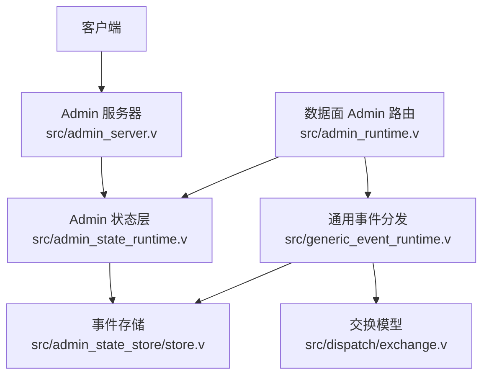
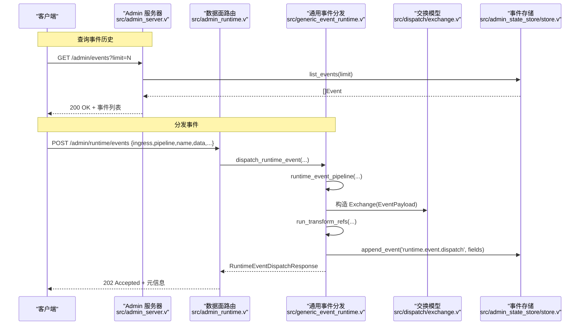
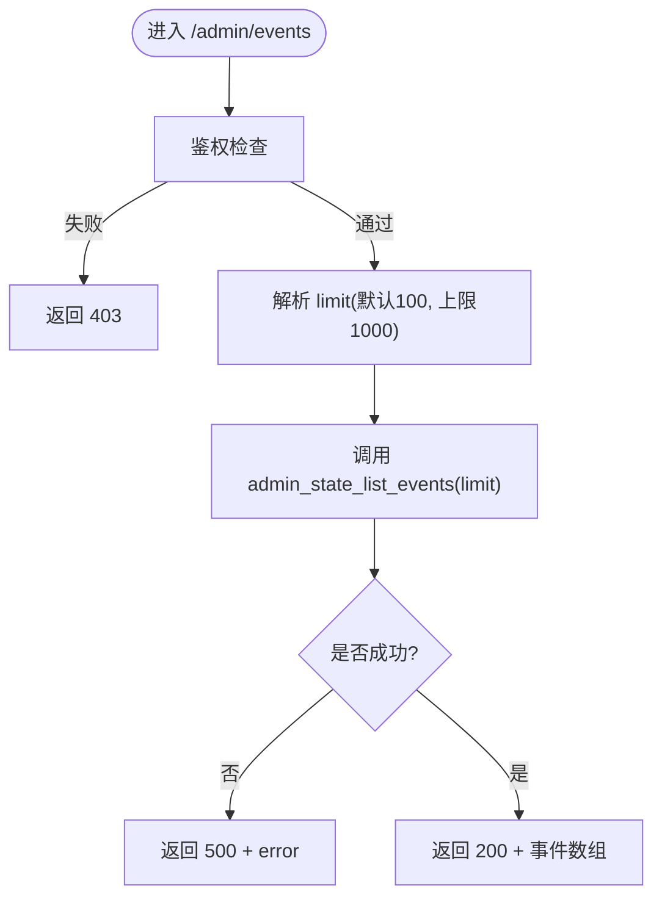
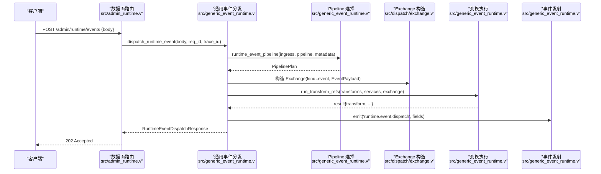
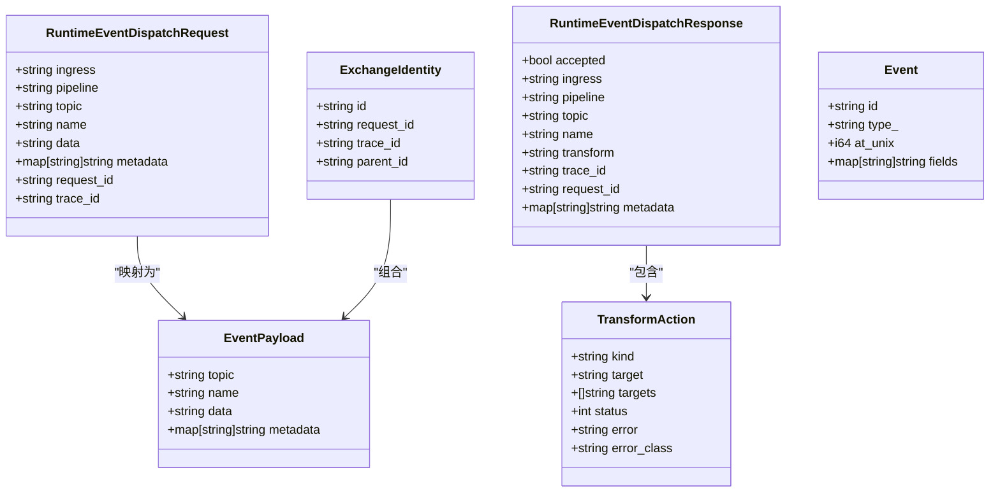
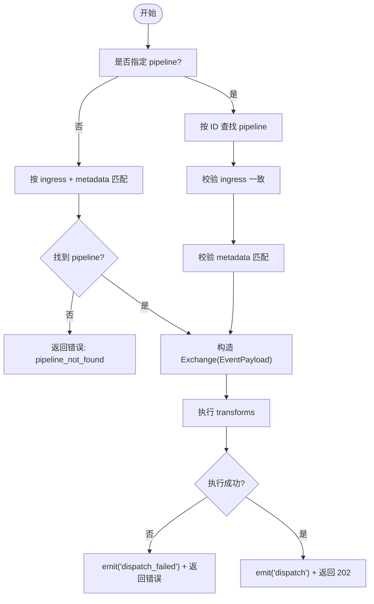
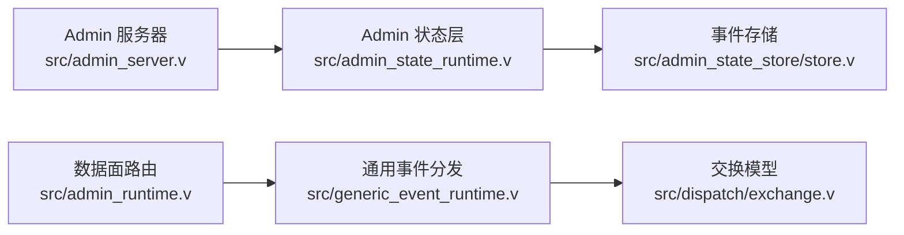

# 事件管理 API

<cite>
**本文引用的文件**   
- [src/admin_server.v](file://src/admin_server.v)
- [src/admin_runtime.v](file://src/admin_runtime.v)
- [src/generic_event_runtime.v](file://src/generic_event_runtime.v)
- [src/dispatch/exchange.v](file://src/dispatch/exchange.v)
- [src/admin_state_store/store.v](file://src/admin_state_store/store.v)
- [src/admin_state_runtime.v](file://src/admin_state_runtime.v)
</cite>

## 目录
1. [简介](#简介)
2. [项目结构](#项目结构)
3. [核心组件](#核心组件)
4. [架构总览](#架构总览)
5. [详细组件分析](#详细组件分析)
6. [依赖关系分析](#依赖关系分析)
7. [性能考虑](#性能考虑)
8. [故障排查指南](#故障排查指南)
9. [结论](#结论)
10. [附录](#附录)

## 简介
本参考文档聚焦于 vhttpd 的事件管理 API，覆盖以下能力：
- 事件历史查询：通过 /admin/events 获取系统内记录的事件日志。
- 事件分发：通过 /admin/runtime/events 将自定义事件注入运行时管道，触发配置的变换器与出口。
- 事件数据结构与类型：定义请求/响应体、交换对象、事件负载等关键数据模型。
- 事件处理流程：从 HTTP 入口到管道选择、变换执行、结果回写与可观测性输出。
- 事件驱动架构模式与异步处理实践：基于管道与变换器的解耦设计、元数据匹配路由、trace_id/request_id 贯穿链路。

## 项目结构
事件相关代码主要分布在如下模块：
- 控制面（Admin）HTTP 路由与鉴权：提供 /admin/events 与 /admin/runtime/events 两个端点。
- 通用事件分发运行时：解析请求、选择管道、构造 Exchange、执行变换器、记录事件。
- 交换与负载模型：统一描述请求/响应/事件/流式消息的中间表示。
- 事件持久化存储：以 JSONL 追加写入 events.jsonl，支持分页读取。
- 状态层：将事件列表暴露给 Admin 接口。

图表来源
- [src/admin_server.v:167-185](file://src/admin_server.v#L167-L185)
- [src/admin_runtime.v:37-58](file://src/admin_runtime.v#L37-L58)
- [src/generic_event_runtime.v:33-92](file://src/generic_event_runtime.v#L33-L92)
- [src/dispatch/exchange.v:41-90](file://src/dispatch/exchange.v#L41-L90)
- [src/admin_state_store/store.v:111-153](file://src/admin_state_store/store.v#L111-L153)
- [src/admin_state_runtime.v:171-174](file://src/admin_state_runtime.v#L171-L174)

章节来源
- [src/admin_server.v:167-185](file://src/admin_server.v#L167-L185)
- [src/admin_runtime.v:37-58](file://src/admin_runtime.v#L37-L58)
- [src/generic_event_runtime.v:33-92](file://src/generic_event_runtime.v#L33-L92)
- [src/dispatch/exchange.v:41-90](file://src/dispatch/exchange.v#L41-L90)
- [src/admin_state_store/store.v:111-153](file://src/admin_state_store/store.v#L111-L153)
- [src/admin_state_runtime.v:171-174](file://src/admin_state_runtime.v#L171-L174)

## 核心组件
- Admin 事件查询接口
  - GET /admin/events：返回最近 N 条事件记录，默认 limit=100，最大 1000。
  - 数据来源：admin_state_list_events(limit)，底层为 FileStore.list_events。
- Admin 事件分发接口
  - POST /admin/runtime/events：接收事件载荷，选择匹配的 pipeline，执行 transforms，返回调度结果。
  - 成功返回 202 Accepted，并附带 pipeline、ingress、event 等元信息。
- 通用事件分发运行时
  - 负责解析请求、规范化 ingress/pipeline、按 metadata 匹配 pipeline、构建 Exchange、运行变换器、记录 emit 事件。
- 交换与负载模型
  - ExchangeIdentity、ExchangeKind、EventPayload、TransformAction 等用于在管道中传递上下文与动作。
- 事件存储
  - append_event 追加写入 events.jsonl；list_events 读取并按 limit 截断。

章节来源
- [src/admin_server.v:167-185](file://src/admin_server.v#L167-L185)
- [src/admin_runtime.v:587-612](file://src/admin_runtime.v#L587-L612)
- [src/generic_event_runtime.v:33-92](file://src/generic_event_runtime.v#L33-L92)
- [src/dispatch/exchange.v:41-90](file://src/dispatch/exchange.v#L41-L90)
- [src/admin_state_store/store.v:111-153](file://src/admin_state_store/store.v#L111-L153)
- [src/admin_state_runtime.v:171-174](file://src/admin_state_runtime.v#L171-L174)

## 架构总览
事件管理 API 采用“控制面 + 数据面”双平面设计：
- 控制面（Admin Server）：提供 /admin/events 与 /admin/runtime/events，具备鉴权与审计。
- 数据面（Data Plane Admin）：同路径但走数据面路由，适用于内部或受限场景。
- 通用事件分发：将 HTTP 请求转换为 Exchange，按配置选择 pipeline，执行 transforms，最终产出结构化结果与可观测事件。

图表来源
- [src/admin_server.v:167-185](file://src/admin_server.v#L167-L185)
- [src/admin_runtime.v:587-612](file://src/admin_runtime.v#L587-L612)
- [src/generic_event_runtime.v:33-92](file://src/generic_event_runtime.v#L33-L92)
- [src/dispatch/exchange.v:41-90](file://src/dispatch/exchange.v#L41-L90)
- [src/admin_state_store/store.v:111-153](file://src/admin_state_store/store.v#L111-L153)

## 详细组件分析

### 组件 A：Admin 事件查询接口 GET /admin/events
- 功能说明
  - 返回最近 N 条事件记录，支持 limit 参数（默认 100，上限 1000）。
  - 错误码：未授权 403；服务异常 500。
- 请求参数
  - query.limit：整数，范围 1..1000。
- 响应体
  - 数组：每个元素包含 id、type、at_unix、fields 等字段。
- 实现要点
  - 控制面路由：admin_events -> admin_state_list_events -> FileStore.list_events。
  - 数据面路由：admin_events -> app.admin_state_list_events -> FileStore.list_events。

图表来源
- [src/admin_server.v:167-185](file://src/admin_server.v#L167-L185)
- [src/admin_runtime.v:37-58](file://src/admin_runtime.v#L37-L58)
- [src/admin_state_runtime.v:171-174](file://src/admin_state_runtime.v#L171-L174)
- [src/admin_state_store/store.v:135-153](file://src/admin_state_store/store.v#L135-L153)

章节来源
- [src/admin_server.v:167-185](file://src/admin_server.v#L167-L185)
- [src/admin_runtime.v:37-58](file://src/admin_runtime.v#L37-L58)
- [src/admin_state_runtime.v:171-174](file://src/admin_state_runtime.v#L171-L174)
- [src/admin_state_store/store.v:135-153](file://src/admin_state_store/store.v#L135-L153)

### 组件 B：Admin 事件分发接口 POST /admin/runtime/events
- 功能说明
  - 将事件注入运行时管道，根据 ingress/pipeline/metadata 选择 pipeline，执行 transforms，返回调度结果。
  - 成功返回 202 Accepted，并携带 pipeline、ingress、event 等元信息。
- 请求体字段
  - ingress：入站资源引用（如 adapter:xxx 或 listener:xxx），可为空时由系统推断。
  - pipeline：目标 pipeline 标识，可为空时按 metadata 匹配。
  - topic：主题名（可选）。
  - name：事件名（可选，若为空则使用 topic）。
  - data：事件主体（字符串）。
  - metadata：键值对，用于 pipeline 匹配与追踪。
  - request_id：请求标识（可选）。
  - trace_id：链路追踪标识（可选）。
- 响应体字段
  - accepted：是否接受。
  - ingress/pipeline/topic/name/transform：调度元信息。
  - trace_id/request_id：透传标识。
  - metadata：扩展字段集合。
- 错误码
  - 400：请求校验失败或分发失败。
  - 403：未授权。
  - 404：数据面未启用。

图表来源
- [src/admin_runtime.v:587-612](file://src/admin_runtime.v#L587-L612)
- [src/generic_event_runtime.v:33-92](file://src/generic_event_runtime.v#L33-L92)
- [src/generic_event_runtime.v:116-145](file://src/generic_event_runtime.v#L116-L145)
- [src/dispatch/exchange.v:41-90](file://src/dispatch/exchange.v#L41-L90)

章节来源
- [src/admin_runtime.v:587-612](file://src/admin_runtime.v#L587-L612)
- [src/generic_event_runtime.v:33-92](file://src/generic_event_runtime.v#L33-L92)
- [src/generic_event_runtime.v:116-145](file://src/generic_event_runtime.v#L116-L145)
- [src/dispatch/exchange.v:41-90](file://src/dispatch/exchange.v#L41-L90)

### 组件 C：事件数据结构与类型
- 事件请求/响应
  - RuntimeEventDispatchRequest：包含 ingress、pipeline、topic、name、data、metadata、request_id、trace_id。
  - RuntimeEventDispatchResponse：包含 accepted、ingress、pipeline、topic、name、transform、trace_id、request_id、metadata。
- 交换与负载
  - ExchangeIdentity：id、request_id、trace_id、parent_id。
  - ExchangeKind：枚举，包括 event、request、response、stream_*、session_*、error。
  - EventPayload：topic、name、data、metadata。
  - TransformAction：kind、target/targets、status、error、error_class。
- 事件存储
  - Event：id、type、at_unix、fields。
  - FileStore.append_event/list_events：JSONL 追加与分页读取。

图表来源
- [src/generic_event_runtime.v:8-31](file://src/generic_event_runtime.v#L8-L31)
- [src/dispatch/exchange.v:3-22](file://src/dispatch/exchange.v#L3-L22)
- [src/dispatch/exchange.v:41-47](file://src/dispatch/exchange.v#L41-L47)
- [src/dispatch/exchange.v:115-123](file://src/dispatch/exchange.v#L115-L123)
- [src/admin_state_store/store.v:16-22](file://src/admin_state_store/store.v#L16-L22)

章节来源
- [src/generic_event_runtime.v:8-31](file://src/generic_event_runtime.v#L8-L31)
- [src/dispatch/exchange.v:3-22](file://src/dispatch/exchange.v#L3-L22)
- [src/dispatch/exchange.v:41-47](file://src/dispatch/exchange.v#L41-L47)
- [src/dispatch/exchange.v:115-123](file://src/dispatch/exchange.v#L115-L123)
- [src/admin_state_store/store.v:16-22](file://src/admin_state_store/store.v#L16-L22)

### 组件 D：事件处理流程与管道选择
- 管道选择策略
  - 若指定 pipeline，则按 ID 精确匹配，并校验 ingress 与 metadata。
  - 否则按 ingress 引用遍历候选 pipeline，匹配 metadata 后选择。
- 元数据匹配
  - 使用模式匹配函数 match_value_pattern 进行 key/value 比对。
- 变换执行
  - 通过 run_transform_refs 执行 transforms，捕获错误并记录 emit('runtime.event.dispatch_failed')。
- 结果记录
  - 成功后 emit('runtime.event.dispatch')，包含 request_id、trace_id、ingress、pipeline、event、topic、transform 等。

图表来源
- [src/generic_event_runtime.v:116-145](file://src/generic_event_runtime.v#L116-L145)
- [src/generic_event_runtime.v:167-175](file://src/generic_event_runtime.v#L167-L175)
- [src/generic_event_runtime.v:62-80](file://src/generic_event_runtime.v#L62-L80)

章节来源
- [src/generic_event_runtime.v:116-145](file://src/generic_event_runtime.v#L116-L145)
- [src/generic_event_runtime.v:167-175](file://src/generic_event_runtime.v#L167-L175)
- [src/generic_event_runtime.v:62-80](file://src/generic_event_runtime.v#L62-L80)

## 依赖关系分析
- Admin 服务器依赖 Admin 状态层，状态层依赖文件存储。
- 数据面路由直接调用通用事件分发运行时。
- 通用事件分发运行时依赖交换模型与运行时计划（pipeline 配置）。
- 事件存储以 JSONL 形式追加写入，避免并发竞争导致的丢失。

图表来源
- [src/admin_server.v:167-185](file://src/admin_server.v#L167-L185)
- [src/admin_runtime.v:587-612](file://src/admin_runtime.v#L587-L612)
- [src/generic_event_runtime.v:33-92](file://src/generic_event_runtime.v#L33-L92)
- [src/dispatch/exchange.v:41-90](file://src/dispatch/exchange.v#L41-L90)
- [src/admin_state_store/store.v:111-153](file://src/admin_state_store/store.v#L111-L153)
- [src/admin_state_runtime.v:171-174](file://src/admin_state_runtime.v#L171-L174)

章节来源
- [src/admin_server.v:167-185](file://src/admin_server.v#L167-L185)
- [src/admin_runtime.v:587-612](file://src/admin_runtime.v#L587-L612)
- [src/generic_event_runtime.v:33-92](file://src/generic_event_runtime.v#L33-L92)
- [src/dispatch/exchange.v:41-90](file://src/dispatch/exchange.v#L41-L90)
- [src/admin_state_store/store.v:111-153](file://src/admin_state_store/store.v#L111-L153)
- [src/admin_state_runtime.v:171-174](file://src/admin_state_runtime.v#L171-L174)

## 性能考虑
- 事件存储采用 JSONL 追加写入，适合高吞吐写入与顺序读取；list_events 按 limit 截断，避免全量加载。
- 管道选择与变换执行在内存中进行，建议合理设置 transforms 数量与复杂度，避免长尾延迟。
- 元数据匹配使用模式匹配，建议在 pipeline 配置中精简匹配条件以提升选择效率。
- 对于高频事件分发，建议在上层做批量化或节流，减少频繁 IO 与变换开销。

## 故障排查指南
- 403 未授权
  - 检查 Admin 服务器的鉴权逻辑与请求头/查询参数是否满足要求。
- 404 数据面未启用
  - 确认 on_data_plane 标志位已开启，或使用控制面端口访问。
- 400 分发失败
  - 检查请求体字段是否完整（ingress/pipeline/name/data），以及 pipeline 是否存在且 metadata 匹配。
- 500 内部错误
  - 查看事件存储是否可用（events.jsonl 路径权限）、管道配置是否正确、变换器是否可加载。
- 无事件返回
  - 确认 limit 参数合理，检查事件存储是否写入成功。

章节来源
- [src/admin_server.v:167-185](file://src/admin_server.v#L167-L185)
- [src/admin_runtime.v:587-612](file://src/admin_runtime.v#L587-L612)
- [src/generic_event_runtime.v:62-80](file://src/generic_event_runtime.v#L62-L80)
- [src/admin_state_store/store.v:111-153](file://src/admin_state_store/store.v#L111-L153)

## 结论
vhttpd 的事件管理 API 提供了简洁而强大的事件查询与分发能力，结合管道与变换器实现了灵活的事件驱动架构。通过统一的交换模型与可观测性事件，系统具备良好的可维护性与可扩展性。建议在生产环境中结合限流、监控与告警机制，确保事件处理的稳定性与性能。

## 附录
- 最佳实践
  - 为每个事件定义清晰的 name/topic 与 metadata，便于管道匹配与追踪。
  - 使用 trace_id/request_id 贯穿调用链，提升问题定位效率。
  - 对 transforms 进行幂等设计，避免重复分发导致的数据不一致。
  - 定期清理或归档 events.jsonl，避免磁盘占用过大。