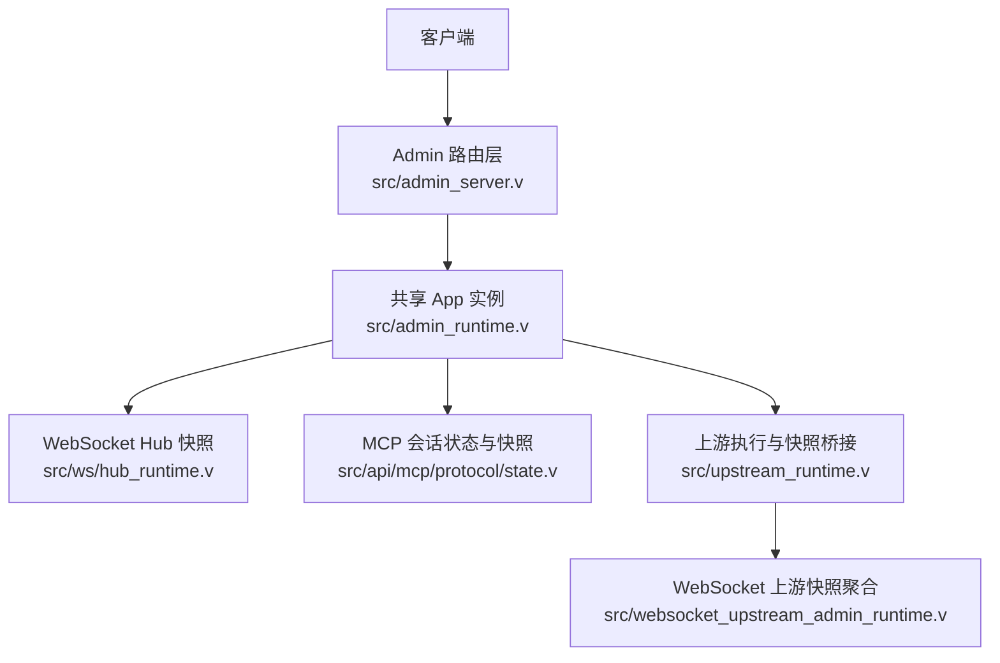
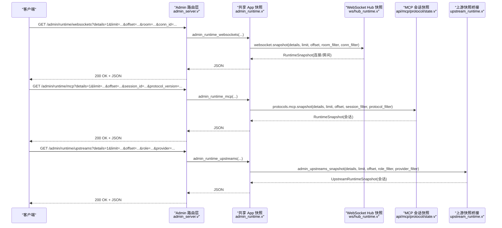
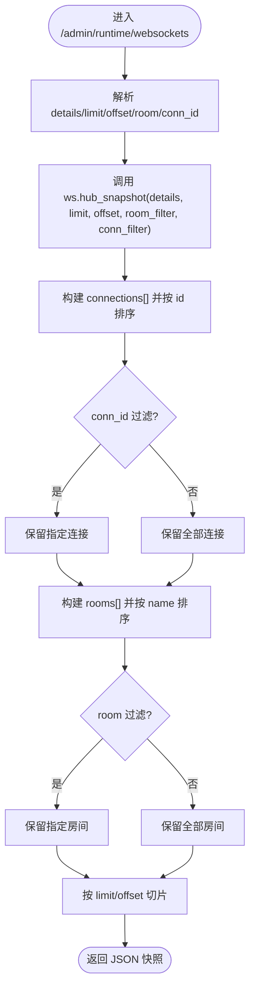
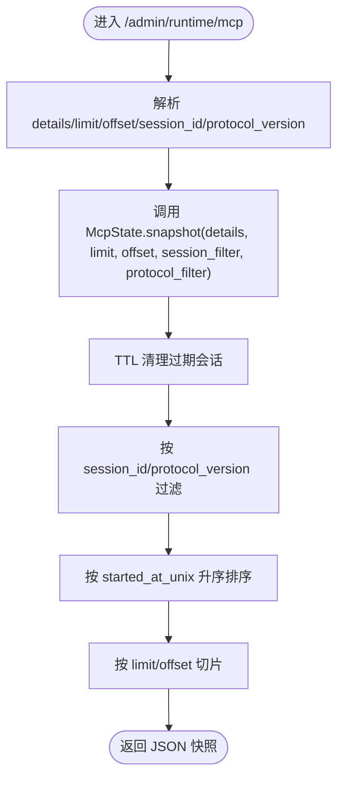
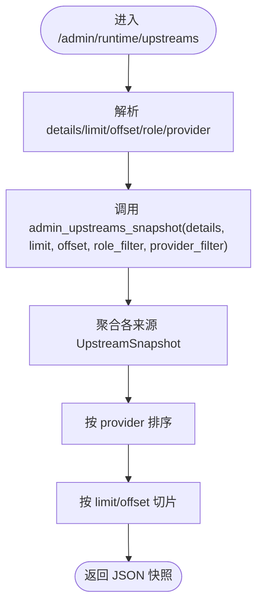
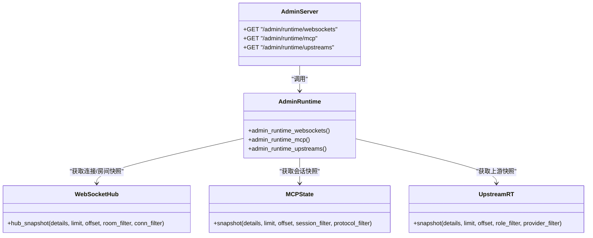

# 协议监控 API

<cite>
**本文引用的文件列表**
- [admin_server.v](file://src/admin_server.v)
- [admin_runtime.v](file://src/admin_runtime.v)
- [README.md](file://README.md)
- [hub_runtime.v](file://src/ws/hub_runtime.v)
- [state.v](file://src/api/mcp/protocol/state.v)
- [types.v](file://src/api/mcp/protocol/types.v)
- [upstream_runtime.v](file://src/upstream_runtime.v)
- [websocket_upstream_admin_runtime.v](file://src/websocket_upstream_admin_runtime.v)
</cite>

## 目录
1. [简介](#简介)
2. [项目结构](#项目结构)
3. [核心组件](#核心组件)
4. [架构总览](#架构总览)
5. [详细组件分析](#详细组件分析)
6. [依赖关系分析](#依赖关系分析)
7. [性能与分页特性](#性能与分页特性)
8. [故障排查指南](#故障排查指南)
9. [结论](#结论)

## 简介
本文件面向运维与开发者，系统化说明 vhttpd 的“协议监控”管理平面接口，重点覆盖以下三个端点：
- GET /admin/runtime/websockets：WebSocket 连接与房间快照、过滤与分页
- GET /admin/runtime/mcp：MCP 会话快照、过滤与分页
- GET /admin/runtime/upstreams：上游（Phase-3）活跃会话快照、过滤与分页

这些接口用于实时监控 WebSocket 连接状态、MCP 会话生命周期与队列积压、以及上游连接的运行态。文档同时给出请求参数、响应字段、典型调用方式与问题诊断建议。

## 项目结构
协议监控相关代码主要分布在 Admin 路由层与运行时快照实现中：
- Admin 路由层负责鉴权、解析查询参数、调用共享 App 的 snapshot 方法并返回 JSON
- 各协议的 snapshot 实现位于对应模块内部，提供过滤、排序与分页逻辑

图表来源
- [admin_server.v:623-675](file://src/admin_server.v#L623-L675)
- [admin_runtime.v:478-538](file://src/admin_runtime.v#L478-L538)
- [hub_runtime.v:438-565](file://src/ws/hub_runtime.v#L438-L565)
- [state.v:229-306](file://src/api/mcp/protocol/state.v#L229-L306)
- [upstream_runtime.v:29-56](file://src/upstream_runtime.v#L29-L56)
- [websocket_upstream_admin_runtime.v:125-159](file://src/websocket_upstream_admin_runtime.v#L125-L159)

章节来源
- [admin_server.v:623-675](file://src/admin_server.v#L623-L675)
- [admin_runtime.v:478-538](file://src/admin_runtime.v#L478-L538)

## 核心组件
- Admin 路由层
  - 统一鉴权与响应封装，解析 details/limit/offset 等通用查询参数
  - 将请求转发至共享 App 的 snapshot 方法
- WebSocket 快照
  - 基于 HubState 的 hub_snapshot 实现，支持按 room 与 conn_id 过滤，支持分页
- MCP 快照
  - 基于 McpState 的 snapshot 实现，支持按 session_id 与 protocol_version 过滤，支持分页
- 上游快照
  - 基于 UpstreamRuntimeContext.snapshot 与 UpstreamRuntimeSnapshot.from_sessions 实现，支持 role/provider 过滤与分页

章节来源
- [admin_server.v:623-675](file://src/admin_server.v#L623-L675)
- [hub_runtime.v:438-565](file://src/ws/hub_runtime.v#L438-L565)
- [state.v:229-306](file://src/api/mcp/protocol/state.v#L229-L306)
- [upstream_runtime.v:29-56](file://src/upstream_runtime.v#L29-L56)

## 架构总览
下图展示了从 HTTP 请求到具体协议快照的数据流。

图表来源
- [admin_server.v:623-675](file://src/admin_server.v#L623-L675)
- [admin_runtime.v:478-538](file://src/admin_runtime.v#L478-L538)
- [hub_runtime.v:438-565](file://src/ws/hub_runtime.v#L438-L565)
- [state.v:229-306](file://src/api/mcp/protocol/state.v#L229-L306)
- [upstream_runtime.v:29-56](file://src/upstream_runtime.v#L29-L56)

## 详细组件分析

### WebSocket 监控接口
- 路径与方法
  - GET /admin/runtime/websockets
- 认证
  - 需要携带 x-vhttpd-admin-token 或等效凭据（由 Admin 路由层校验）
- 查询参数
  - details: 是否展开 connections[] 与 rooms[]（默认 false）
  - limit: 每页数量（默认 100，最大 1000）
  - offset: 偏移量（默认 0）
  - room: 按房间名过滤（精确匹配）
  - conn_id: 按连接 ID 过滤（精确匹配）
- 响应字段（摘要）
  - active_connections: 当前 WebSocket 连接数
  - active_rooms: 房间总数
  - returned_connections/returned_rooms: 本次返回的连接/房间条目数
  - details/limit/offset/room_filter/conn_id: 本次请求上下文
  - connections[]: 连接快照（id、request_id、trace_id、path、rooms[]、metadata）
  - rooms[]: 房间快照（name、member_count、members[]）
- 行为要点
  - 当 details=false 时不返回 connections[] 与 rooms[]，仅返回计数与过滤信息
  - 过滤在内存中进行；排序对连接与房间分别按 key 排序后切片
  - 分页窗口为 [offset, offset+limit)，越界自动截断

图表来源
- [hub_runtime.v:438-565](file://src/ws/hub_runtime.v#L438-L565)

章节来源
- [admin_server.v:641-657](file://src/admin_server.v#L641-L657)
- [admin_runtime.v:499-517](file://src/admin_runtime.v#L499-L517)
- [hub_runtime.v:438-565](file://src/ws/hub_runtime.v#L438-L565)
- [README.md:1270-1286](file://README.md#L1270-L1286)

### MCP 会话监控接口
- 路径与方法
  - GET /admin/runtime/mcp
- 认证
  - 需要携带 x-vhttpd-admin-token 或等效凭据
- 查询参数
  - details: 是否展开 sessions[]（默认 false）
  - limit: 每页数量（默认 100，最大 1000）
  - offset: 偏移量（默认 0）
  - session_id: 按会话 ID 过滤（精确匹配）
  - protocol_version: 按协议版本过滤（精确匹配）
- 响应字段（摘要）
  - active_sessions: 当前活跃会话数
  - returned_sessions: 本次返回的会话条目数
  - details/limit/offset/session_id/protocol_version: 本次请求上下文
  - max_sessions/max_pending_messages/session_ttl_seconds/allowed_origins/sampling_capability_policy: 配置与策略
  - sessions[]: 会话快照（id、protocol_version、request_id、trace_id、path、started_at_unix、last_activity_unix、pending_count、connected、client_capabilities_json）
- 行为要点
  - 快照前会进行 TTL 清理与过期会话修剪
  - 若达到 max_sessions 上限，按最久未活动原则驱逐一个会话
  - pending 队列超过 max_pending_messages 时会丢弃尾部消息并记录统计

图表来源
- [state.v:229-306](file://src/api/mcp/protocol/state.v#L229-L306)

章节来源
- [admin_server.v:659-675](file://src/admin_server.v#L659-L675)
- [admin_runtime.v:519-538](file://src/admin_runtime.v#L519-L538)
- [state.v:229-306](file://src/api/mcp/protocol/state.v#L229-L306)
- [types.v:25-54](file://src/api/mcp/protocol/types.v#L25-L54)
- [README.md:1287-1303](file://README.md#L1287-L1303)

### 上游连接监控接口
- 路径与方法
  - GET /admin/runtime/upstreams
- 认证
  - 需要携带 x-vhttpd-admin-token 或等效凭据
- 查询参数
  - details: 是否展开 sessions[]（默认 false）
  - limit: 每页数量（默认 100，最大 1000）
  - offset: 偏移量（默认 0）
  - role: 按角色过滤（例如 client/server）
  - provider: 按提供者名称过滤（如 feishu/codex 等）
- 响应字段（摘要）
  - active_count: 活跃上游会话数
  - returned_count: 本次返回的会话条目数
  - details/limit/offset: 本次请求上下文
  - sessions[]: 会话快照（id、request_id、trace_id、method、path、name、transport、codec、mapper、stream_type、source、started_at_unix）
- 行为要点
  - 对于 WebSocket 上游（如 feishu/codex/fixtures），通过聚合多个来源的 UpstreamSnapshot 再统一排序与分页
  - 上游执行阶段会在注册/注销时更新活跃计数

图表来源
- [upstream_runtime.v:29-56](file://src/upstream_runtime.v#L29-L56)
- [websocket_upstream_admin_runtime.v:125-159](file://src/websocket_upstream_admin_runtime.v#L125-L159)

章节来源
- [admin_server.v:623-639](file://src/admin_server.v#L623-L639)
- [admin_runtime.v:478-497](file://src/admin_runtime.v#L478-L497)
- [upstream_runtime.v:29-56](file://src/upstream_runtime.v#L29-L56)
- [websocket_upstream_admin_runtime.v:125-159](file://src/websocket_upstream_admin_runtime.v#L125-L159)
- [README.md:1258-1269](file://README.md#L1258-L1269)

## 依赖关系分析
- Admin 路由层依赖共享 App 的 snapshot 方法，避免直接耦合具体协议实现
- WebSocket 快照依赖 HubState 的内部数据结构（连接、房间、元数据）
- MCP 快照依赖 McpState 的会话表、TTL 清理与限流策略
- 上游快照依赖 UpstreamRuntimeContext 与 UpstreamRuntimeSnapshot 的组装与分页

图表来源
- [admin_server.v:623-675](file://src/admin_server.v#L623-L675)
- [admin_runtime.v:478-538](file://src/admin_runtime.v#L478-L538)
- [hub_runtime.v:438-565](file://src/ws/hub_runtime.v#L438-L565)
- [state.v:229-306](file://src/api/mcp/protocol/state.v#L229-L306)
- [upstream_runtime.v:29-56](file://src/upstream_runtime.v#L29-L56)

## 性能与分页特性
- 通用分页
  - limit 默认 100，最大 1000；offset 默认 0
  - 所有 snapshot 均在内存中完成过滤、排序与切片，适合中小规模实时查看
- WebSocket
  - 连接与房间分别排序后切片，避免大结果集传输
- MCP
  - 快照前进行 TTL 清理与过期剔除；超出 max_pending_messages 的消息会被丢弃并计入统计
  - 超出 max_sessions 时按最久未活动驱逐一个会话
- 上游
  - 聚合多来源快照后统一排序与分页，便于跨提供者对比

[本节为通用指导，无需源码引用]

## 故障排查指南
- 无法访问管理端点
  - 确认已启用 Admin Plane 并正确设置 token
  - 检查请求头是否包含正确的认证凭据
- 返回空列表或计数为 0
  - 检查过滤参数是否正确（room/conn_id/session_id/protocol_version/role/provider）
  - 确认 details=false 时不会返回明细数组
- WebSocket 连接异常
  - 使用 conn_id 精确定位连接，查看其 rooms[] 与 metadata
  - 结合 trace_id/request_id 追踪事件链路
- MCP 会话堆积
  - 关注 pending_count 与 sampling capability policy
  - 检查 allowed_origins 是否限制来源导致初始化失败
- 上游连接不稳定
  - 使用 provider 过滤定位特定提供者
  - 结合 upstream 错误分类与重试次数判断网络或服务端问题

章节来源
- [README.md:1147-1180](file://README.md#L1147-L1180)
- [README.md:1223-1256](file://README.md#L1223-L1256)

## 结论
通过 /admin/runtime/websockets、/admin/runtime/mcp、/admin/runtime/upstreams 三组接口，vhttpd 提供了统一的协议级可观测能力。它们具备一致的鉴权与分页模型，支持细粒度过滤与实时快照，适用于日常巡检、容量评估与问题定位。建议在生产环境开启最小权限的 Admin 访问控制，并结合日志与指标系统形成闭环监控。