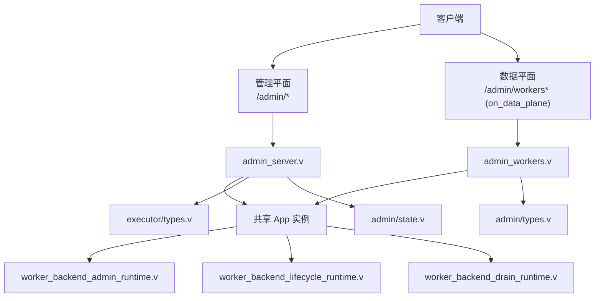
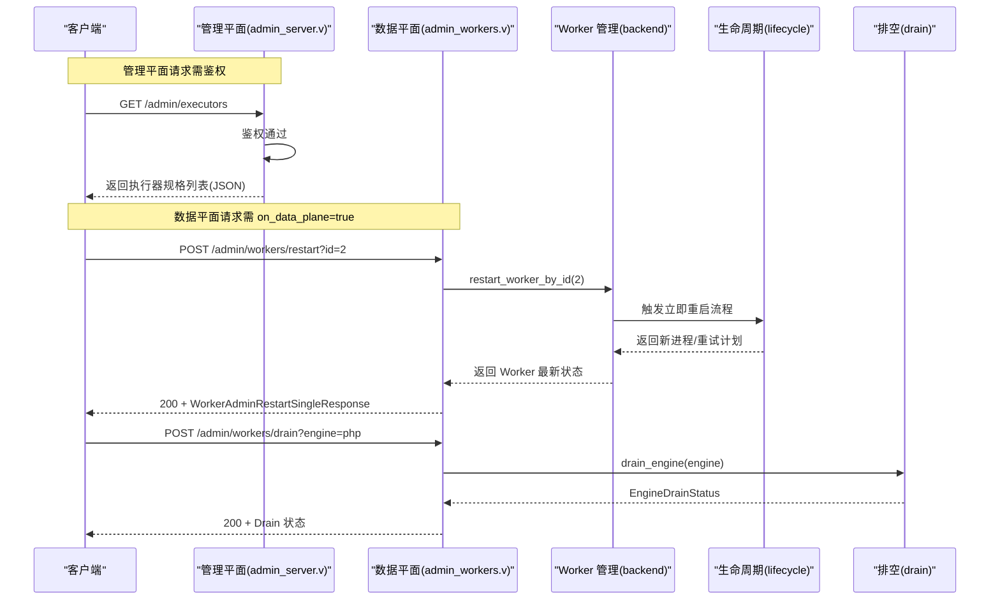
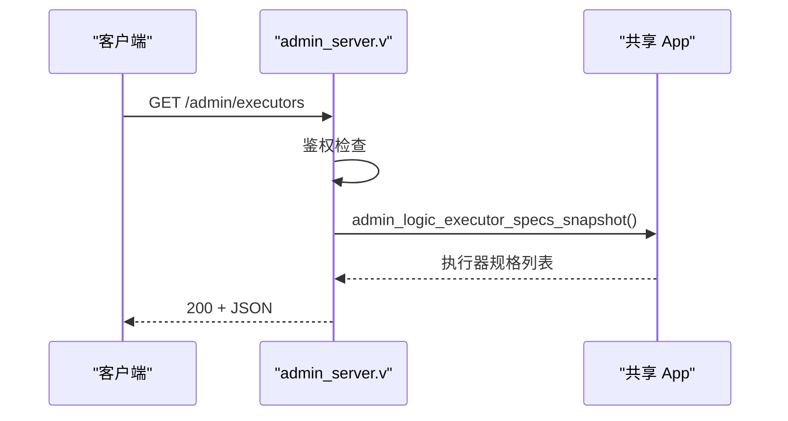
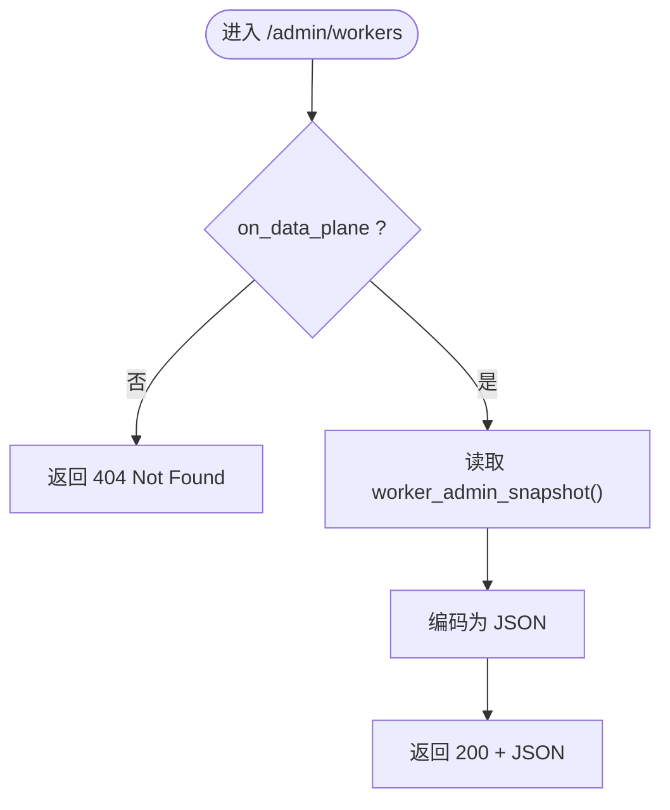
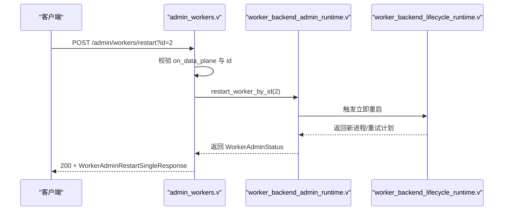
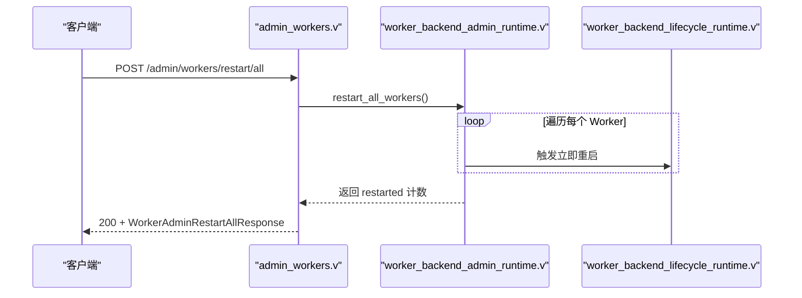
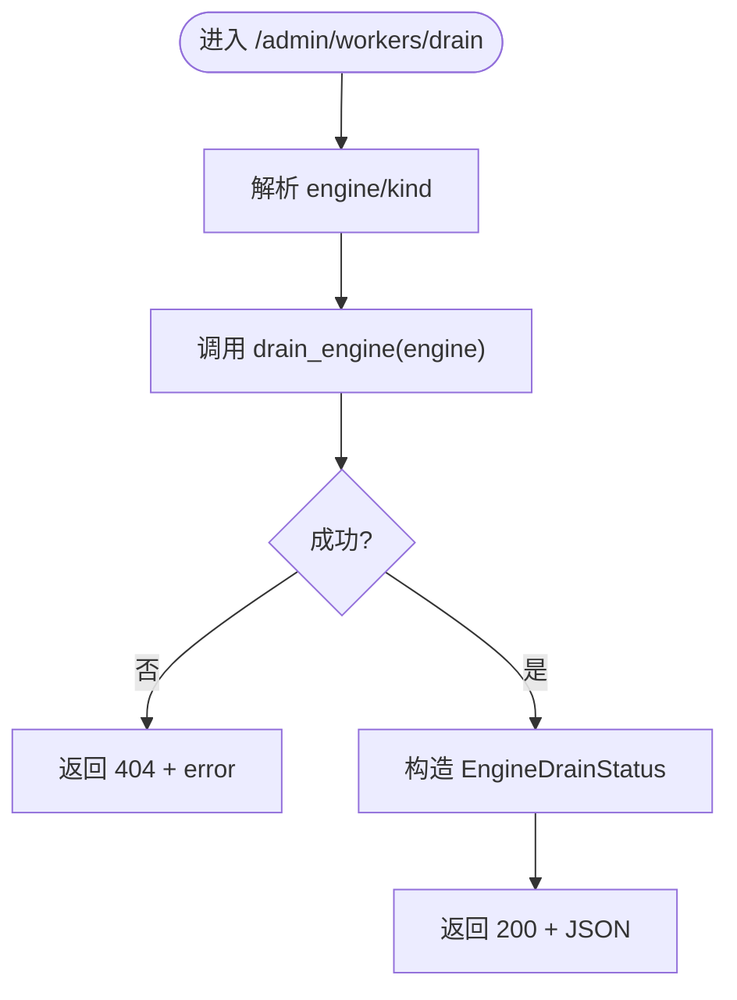
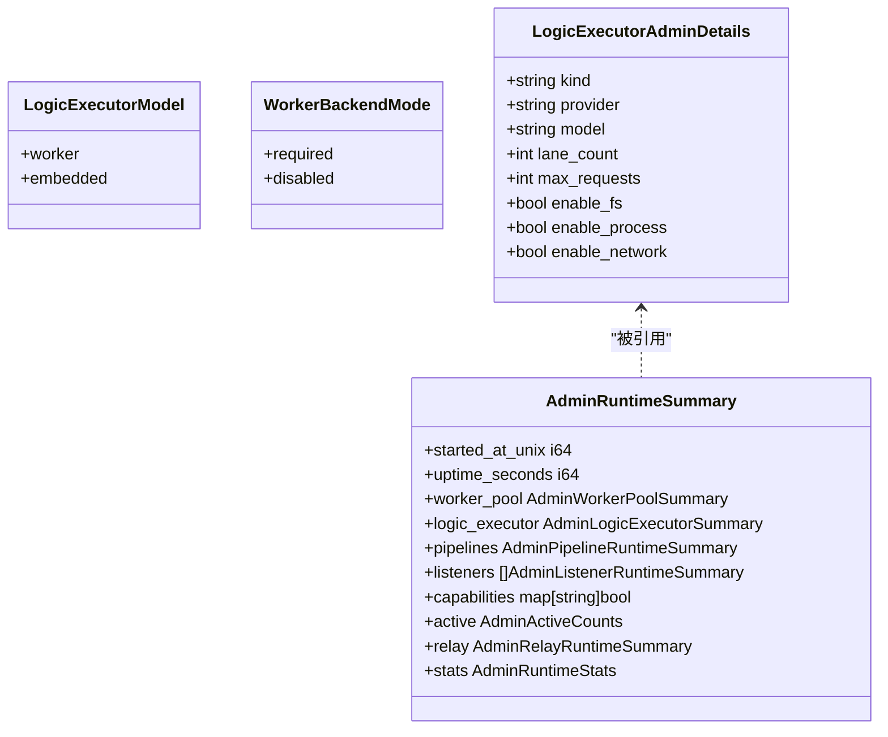
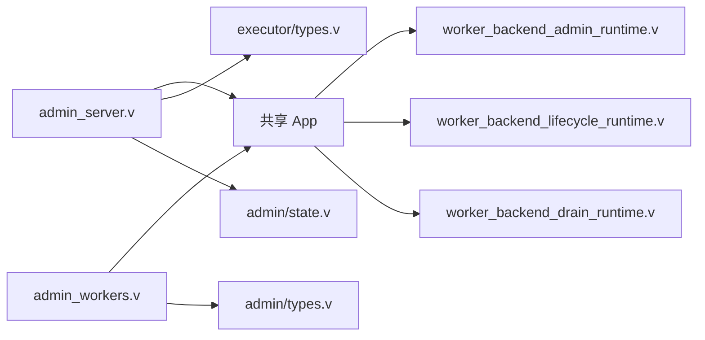

# 执行器管理 API

<cite>
**本文引用的文件**
- [src/admin_server.v](file://src/admin_server.v)
- [src/admin_workers.v](file://src/admin_workers.v)
- [src/admin/types.v](file://src/admin/types.v)
- [src/executor/types.v](file://src/executor/types.v)
- [src/admin/state.v](file://src/admin/state.v)
- [src/worker_backend_admin_runtime.v](file://src/worker_backend_admin_runtime.v)
- [src/worker_backend_lifecycle_runtime.v](file://src/worker_backend_lifecycle_runtime.v)
- [src/worker_backend_drain_runtime.v](file://src/worker_backend_drain_runtime.v)
- [README.md](file://README.md)
</cite>

## 目录
1. [简介](#简介)
2. [项目结构](#项目结构)
3. [核心组件](#核心组件)
4. [架构总览](#架构总览)
5. [详细组件分析](#详细组件分析)
6. [依赖关系分析](#依赖关系分析)
7. [性能与资源统计](#性能与资源统计)
8. [故障排查指南](#故障排查指南)
9. [结论](#结论)
10. [附录：API 参考与示例](#附录api-参考与示例)

## 简介
本文件面向运维与平台工程师，系统化梳理 vhttpd 的“执行器管理”相关管理平面 API，重点覆盖以下能力：
- Worker 进程状态查询（Worker 池快照、单进程指标）
- 执行器规格信息获取（逻辑执行器类型、模型、运行时配置等）
- Worker 池管理操作（重启单个/全部 Worker、优雅排空 Drain）
- 生命周期状态、执行器类型定义、资源使用情况统计
- 完整的响应数据结构说明与批量操作示例

## 项目结构
与执行器管理相关的代码主要分布在如下模块：
- 管理平面 HTTP 路由与鉴权：admin_server.v
- 数据平面 Worker 管理端点：admin_workers.v
- 通用管理与认证类型：admin/types.v
- 执行器模型与管理员可见的规格详情：executor/types.v
- 运行时快照构建（包含执行器摘要、队列与活跃连接计数等）：admin/state.v
- Worker 后端管理（按 ID 重启、全量重启、Drain 状态计算）：worker_backend_admin_runtime.v、worker_backend_lifecycle_runtime.v、worker_backend_drain_runtime.v

图表来源
- [src/admin_server.v:117-141](file://src/admin_server.v#L117-L141)
- [src/admin_workers.v:8-25](file://src/admin_workers.v#L8-L25)
- [src/worker_backend_admin_runtime.v:42-82](file://src/worker_backend_admin_runtime.v#L42-L82)
- [src/worker_backend_lifecycle_runtime.v:72-134](file://src/worker_backend_lifecycle_runtime.v#L72-L134)
- [src/worker_backend_drain_runtime.v:104-155](file://src/worker_backend_drain_runtime.v#L104-L155)
- [src/executor/types.v:65-91](file://src/executor/types.v#L65-L91)
- [src/admin/types.v:8-35](file://src/admin/types.v#L8-L35)
- [src/admin/state.v:56-102](file://src/admin/state.v#L56-L102)

章节来源
- [src/admin_server.v:117-141](file://src/admin_server.v#L117-L141)
- [src/admin_workers.v:8-25](file://src/admin_workers.v#L8-L25)
- [src/admin/types.v:8-35](file://src/admin/types.v#L8-L35)
- [src/executor/types.v:65-91](file://src/executor/types.v#L65-L91)
- [src/admin/state.v:56-102](file://src/admin/state.v#L56-L102)

## 核心组件
- 管理平面路由与鉴权
  - /health、/admin/workers、/admin/stats、/admin/executors 等由 admin_server.v 提供，统一鉴权与 JSON 响应封装。
- 数据平面 Worker 管理
  - /admin/workers、/admin/workers/restart、/admin/workers/restart/all、/admin/workers/drain 在 on_data_plane=true 时可用，由 admin_workers.v 暴露。
- Worker 后端管理
  - 按 ID 重启、全量重启、Drain 状态聚合由 worker_backend_admin_runtime.v 与 worker_backend_lifecycle_runtime.v、worker_backend_drain_runtime.v 实现。
- 执行器规格与运行时快照
  - executor/types.v 定义执行器模型与管理员可见的详细信息；admin/state.v 汇总运行期统计与执行器摘要。

章节来源
- [src/admin_server.v:117-141](file://src/admin_server.v#L117-L141)
- [src/admin_workers.v:8-25](file://src/admin_workers.v#L8-L25)
- [src/worker_backend_admin_runtime.v:42-82](file://src/worker_backend_admin_runtime.v#L42-L82)
- [src/worker_backend_lifecycle_runtime.v:72-134](file://src/worker_backend_lifecycle_runtime.v#L72-L134)
- [src/worker_backend_drain_runtime.v:104-155](file://src/worker_backend_drain_runtime.v#L104-L155)
- [src/executor/types.v:65-91](file://src/executor/types.v#L65-L91)
- [src/admin/state.v:56-102](file://src/admin/state.v#L56-L102)

## 架构总览
下图展示了管理平面与数据平面的职责划分以及关键调用链。

图表来源
- [src/admin_server.v:587-597](file://src/admin_server.v#L587-L597)
- [src/admin_workers.v:46-94](file://src/admin_workers.v#L46-L94)
- [src/worker_backend_admin_runtime.v:42-82](file://src/worker_backend_admin_runtime.v#L42-L82)
- [src/worker_backend_lifecycle_runtime.v:72-134](file://src/worker_backend_lifecycle_runtime.v#L72-L134)
- [src/worker_backend_drain_runtime.v:104-155](file://src/worker_backend_drain_runtime.v#L104-L155)

## 详细组件分析

### 管理平面：/admin/executors
- 功能：返回已注册逻辑执行器的规格清单，便于外部工具或控制台展示当前可用的执行器类型与能力。
- 鉴权：需要有效的 x-vhttpd-admin-token 或通过 query 参数 admin_token。
- 响应体：JSON，内容来自共享应用提供的执行器规格快照。

图表来源
- [src/admin_server.v:587-597](file://src/admin_server.v#L587-L597)

章节来源
- [src/admin_server.v:587-597](file://src/admin_server.v#L587-L597)

### 数据平面：/admin/workers（Worker 池快照）
- 功能：返回 Worker 池的运行时快照，包括每个 Worker 的存活状态、PID、内存占用、是否处于 draining、并发请求数、累计服务请求数、重启次数与下次重试时间等。
- 可用性：仅在控制平面标记 on_data_plane=true 时生效，否则返回 404。
- 响应体：JSON，字段来源于 WorkerPoolAdminStatus 与 WorkerAdminStatus。

图表来源
- [src/admin_workers.v:8-25](file://src/admin_workers.v#L8-L25)
- [src/admin/types.v:8-30](file://src/admin/types.v#L8-L30)

章节来源
- [src/admin_workers.v:8-25](file://src/admin_workers.v#L8-L25)
- [src/admin/types.v:8-30](file://src/admin/types.v#L8-L30)

### Worker 管理：重启单个 Worker
- 端点：POST /admin/workers/restart
- 参数：query id=<worker_id>（必填）
- 行为：
  - 校验 on_data_plane 开关
  - 解析并校验 worker_id
  - 调用后端按 ID 重启，成功后返回该 Worker 的最新状态
- 错误处理：
  - 缺少 id：返回 400 与错误码 missing_worker_id
  - 未找到 worker_id：返回 404 与错误消息
  - 未启用 worker pool：返回错误提示

图表来源
- [src/admin_workers.v:46-94](file://src/admin_workers.v#L46-L94)
- [src/worker_backend_admin_runtime.v:42-65](file://src/worker_backend_admin_runtime.v#L42-L65)
- [src/worker_backend_lifecycle_runtime.v:72-134](file://src/worker_backend_lifecycle_runtime.v#L72-L134)

章节来源
- [src/admin_workers.v:46-94](file://src/admin_workers.v#L46-L94)
- [src/worker_backend_admin_runtime.v:42-65](file://src/worker_backend_admin_runtime.v#L42-L65)
- [src/worker_backend_lifecycle_runtime.v:72-134](file://src/worker_backend_lifecycle_runtime.v#L72-L134)

### Worker 管理：重启所有 Worker
- 端点：POST /admin/workers/restart/all
- 行为：遍历所有受管 Worker 并触发立即重启，返回重启数量。
- 注意：管理平面与数据平面均提供此端点，但数据平面要求 on_data_plane=true。

图表来源
- [src/admin_workers.v:96-125](file://src/admin_workers.v#L96-L125)
- [src/worker_backend_admin_runtime.v:67-82](file://src/worker_backend_admin_runtime.v#L67-L82)
- [src/worker_backend_lifecycle_runtime.v:72-134](file://src/worker_backend_lifecycle_runtime.v#L72-L134)

章节来源
- [src/admin_workers.v:96-125](file://src/admin_workers.v#L96-L125)
- [src/worker_backend_admin_runtime.v:67-82](file://src/worker_backend_admin_runtime.v#L67-L82)
- [src/worker_backend_lifecycle_runtime.v:72-134](file://src/worker_backend_lifecycle_runtime.v#L72-L134)

### Worker 管理：优雅排空（Drain）
- 端点：POST /admin/workers/drain
- 参数：engine 或 kind（二选一），用于指定引擎/后端标识
- 行为：
  - 将目标引擎下的 Worker 置为 draining
  - 等待 inflight_requests 归零后视为 ready
  - 返回 draining_count、inflight_requests、ready_count 等统计
- 错误处理：找不到引擎或内部错误返回 404 与错误消息

图表来源
- [src/admin_workers.v:127-156](file://src/admin_workers.v#L127-L156)
- [src/worker_backend_drain_runtime.v:104-155](file://src/worker_backend_drain_runtime.v#L104-L155)

章节来源
- [src/admin_workers.v:127-156](file://src/admin_workers.v#L127-L156)
- [src/worker_backend_drain_runtime.v:104-155](file://src/worker_backend_drain_runtime.v#L104-L155)

### 执行器类型与规格
- 执行器模型：LogicExecutorModel 支持 worker 与 embedded 两种模式。
- Worker 后端模式：WorkerBackendMode 支持 required 与 disabled。
- 管理员可见的执行器详情：LogicExecutorAdminDetails 包含 kind、provider、model、lane_count、max_requests、能力开关（文件系统、进程、网络）等。
- 运行时快照：admin/state.v 中的 runtime_snapshot 会汇总执行器摘要、队列容量、活跃连接数等。

图表来源
- [src/executor/types.v:65-91](file://src/executor/types.v#L65-L91)
- [src/executor/types.v:157-164](file://src/executor/types.v#L157-L164)
- [src/executor/types.v:252-264](file://src/executor/types.v#L252-L264)
- [src/admin/state.v:56-102](file://src/admin/state.v#L56-L102)

章节来源
- [src/executor/types.v:65-91](file://src/executor/types.v#L65-L91)
- [src/executor/types.v:157-164](file://src/executor/types.v#L157-L164)
- [src/executor/types.v:252-264](file://src/executor/types.v#L252-L264)
- [src/admin/state.v:56-102](file://src/admin/state.v#L56-L102)

## 依赖关系分析
- 管理平面与数据平面共享同一 App 实例，通过 shared 引用访问 Worker 管理、执行器规格与运行时快照。
- Worker 管理操作依赖生命周期与排空子模块，确保重启与排空的幂等性与可观测性。
- 执行器规格与运行时快照依赖 executor/types.v 中定义的模型与统计结构。

图表来源
- [src/admin_server.v:117-141](file://src/admin_server.v#L117-L141)
- [src/admin_workers.v:8-25](file://src/admin_workers.v#L8-L25)
- [src/worker_backend_admin_runtime.v:42-82](file://src/worker_backend_admin_runtime.v#L42-L82)
- [src/worker_backend_lifecycle_runtime.v:72-134](file://src/worker_backend_lifecycle_runtime.v#L72-L134)
- [src/worker_backend_drain_runtime.v:104-155](file://src/worker_backend_drain_runtime.v#L104-L155)
- [src/executor/types.v:65-91](file://src/executor/types.v#L65-L91)
- [src/admin/types.v:8-35](file://src/admin/types.v#L8-L35)
- [src/admin/state.v:56-102](file://src/admin/state.v#L56-L102)

章节来源
- [src/admin_server.v:117-141](file://src/admin_server.v#L117-L141)
- [src/admin_workers.v:8-25](file://src/admin_workers.v#L8-L25)
- [src/worker_backend_admin_runtime.v:42-82](file://src/worker_backend_admin_runtime.v#L42-L82)
- [src/worker_backend_lifecycle_runtime.v:72-134](file://src/worker_backend_lifecycle_runtime.v#L72-L134)
- [src/worker_backend_drain_runtime.v:104-155](file://src/worker_backend_drain_runtime.v#L104-L155)
- [src/executor/types.v:65-91](file://src/executor/types.v#L65-L91)
- [src/admin/types.v:8-35](file://src/admin/types.v#L8-L35)
- [src/admin/state.v:56-102](file://src/admin/state.v#L56-L102)

## 性能与资源统计
- Worker 资源使用：WorkerAdminStatus 包含 rss_kb（进程 RSS 内存）、inflight_requests（并发请求）、served_requests（累计服务请求）、restart_count（重启次数）、next_retry_ts（下次重试时间）。
- 队列与系统统计：admin/state.v 汇总 HTTP、Worker 队列、Upstream、MCP、Feishu 等计数器，便于监控与告警。
- 排空与就绪：EngineDrainStatus 提供 draining_count、inflight_requests、ready_count，帮助判断滚动升级或扩缩容窗口。

章节来源
- [src/admin/types.v:8-30](file://src/admin/types.v#L8-L30)
- [src/admin/state.v:12-54](file://src/admin/state.v#L12-L54)
- [src/worker_backend_drain_runtime.v:130-155](file://src/worker_backend_drain_runtime.v#L130-L155)

## 故障排查指南
- 404 Not Found（数据平面）：当 on_data_plane=false 时，/admin/workers 系列端点不可用，请确认控制平面配置。
- 400 Bad Request（缺少 id）：POST /admin/workers/restart 必须携带 id 参数。
- 404 Not Found（worker id 不存在）：指定的 worker_id 不在当前池中。
- 403 Forbidden（鉴权失败）：管理平面端点需要正确的 x-vhttpd-admin-token 或 admin_token 查询参数。
- 重启失败与重试：生命周期模块会在启动失败时记录 next_retry_ts 并按退避策略重试，可通过 /admin/workers 观察 next_retry_ts 与 restart_count。

章节来源
- [src/admin_workers.v:8-25](file://src/admin_workers.v#L8-L25)
- [src/admin_workers.v:46-94](file://src/admin_workers.v#L46-L94)
- [src/admin_server.v:93-104](file://src/admin_server.v#L93-L104)
- [src/worker_backend_lifecycle_runtime.v:72-134](file://src/worker_backend_lifecycle_runtime.v#L72-L134)

## 结论
vhttpd 的管理平面与数据平面共同提供了对 Worker 与执行器的完整管理能力：
- 通过 /admin/executors 获取执行器规格，辅助自动化编排与可视化。
- 通过 /admin/workers 查看 Worker 池快照与资源使用，结合 /admin/stats 与 /admin/runtime 进行综合监控。
- 通过 /admin/workers/restart、/admin/workers/restart/all、/admin/workers/drain 完成滚动升级与弹性伸缩。
- 统一的鉴权机制与结构化 JSON 响应，便于集成到现有运维平台。

## 附录：API 参考与示例

### 端点一览
- GET /admin/executors
  - 描述：返回逻辑执行器规格列表
  - 鉴权：需要 x-vhttpd-admin-token 或 admin_token
  - 响应：application/json; charset=utf-8
- GET /admin/workers
  - 描述：返回 Worker 池快照（仅 on_data_plane=true）
  - 鉴权：无（数据平面）
  - 响应：application/json; charset=utf-8
- POST /admin/workers/restart
  - 描述：重启指定 Worker（id 必填）
  - 鉴权：无（数据平面）
  - 响应：application/json; charset=utf-8
- POST /admin/workers/restart/all
  - 描述：重启所有 Worker
  - 鉴权：无（数据平面）
  - 响应：application/json; charset=utf-8
- POST /admin/workers/drain
  - 描述：对指定 engine/kind 执行优雅排空
  - 鉴权：无（数据平面）
  - 响应：application/json; charset=utf-8

章节来源
- [src/admin_server.v:587-597](file://src/admin_server.v#L587-L597)
- [src/admin_workers.v:8-25](file://src/admin_workers.v#L8-L25)
- [src/admin_workers.v:46-94](file://src/admin_workers.v#L46-L94)
- [src/admin_workers.v:96-125](file://src/admin_workers.v#L96-L125)
- [src/admin_workers.v:127-156](file://src/admin_workers.v#L127-L156)

### 响应数据结构

- Worker 池快照（GET /admin/workers）
  - 顶层对象：WorkerPoolAdminStatus
    - worker_autostart: bool
    - worker_pool_size: int
    - worker_rr_index: int
    - worker_max_requests: int
    - worker_sockets: []string
    - workers: []WorkerAdminStatus
  - Worker 项：WorkerAdminStatus
    - id: int
    - socket: string
    - alive: bool
    - pid: int
    - rss_kb: i64
    - draining: bool
    - inflight_requests: i64
    - served_requests: i64
    - restart_count: int
    - next_retry_ts: i64

- 重启单个 Worker（POST /admin/workers/restart）
  - 成功：WorkerAdminRestartSingleResponse
    - ok: bool
    - mode: string
    - worker: WorkerAdminStatus
  - 失败：WorkerAdminErrorResponse
    - error: string

- 重启所有 Worker（POST /admin/workers/restart/all）
  - 成功：WorkerAdminRestartAllResponse
    - ok: bool
    - mode: string
    - restarted: int

- 优雅排空（POST /admin/workers/drain）
  - 成功：EngineDrainStatus（由后端返回）
    - engine: string
    - worker_count: int
    - draining_count: int
    - inflight_requests: i64
    - ready_count: int
    - changed: bool
  - 失败：WorkerAdminErrorResponse
    - error: string

- 执行器规格（GET /admin/executors）
  - 返回执行器规格列表，具体结构与字段以共享应用提供的快照为准（参见 executor/types.v 中的管理员可见详情与摘要）。

章节来源
- [src/admin/types.v:8-49](file://src/admin/types.v#L8-L49)
- [src/executor/types.v:77-91](file://src/executor/types.v#L77-L91)
- [src/executor/types.v:157-164](file://src/executor/types.v#L157-L164)
- [src/worker_backend_drain_runtime.v:130-155](file://src/worker_backend_drain_runtime.v#L130-L155)

### 批量操作示例
- 重启所有 Worker
  - curl --noproxy '*' -s -H 'x-vhttpd-admin-token: change-me' -X POST 'http://127.0.0.1:19981/admin/workers/restart/all' | jq .
- 优雅排空指定引擎
  - curl --noproxy '*' -s -H 'x-vhttpd-admin-token: change-me' -X POST 'http://127.0.0.1:19981/admin/workers/drain?engine=php' | jq .
- 查询 Worker 池快照
  - curl --noproxy '*' -s -H 'x-vhttpd-admin-token: change-me' http://127.0.0.1:19981/admin/workers | jq .

章节来源
- [README.md:1147-1347](file://README.md#L1147-L1347)