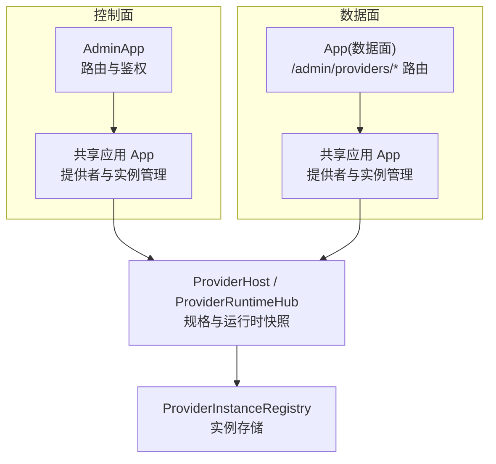
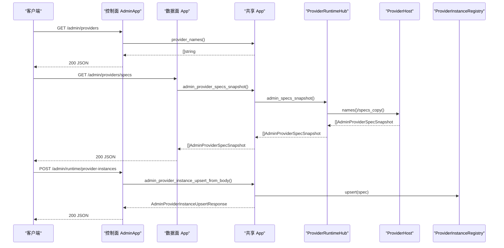
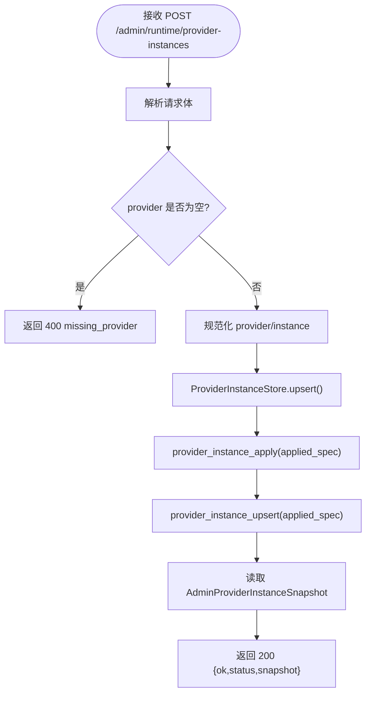
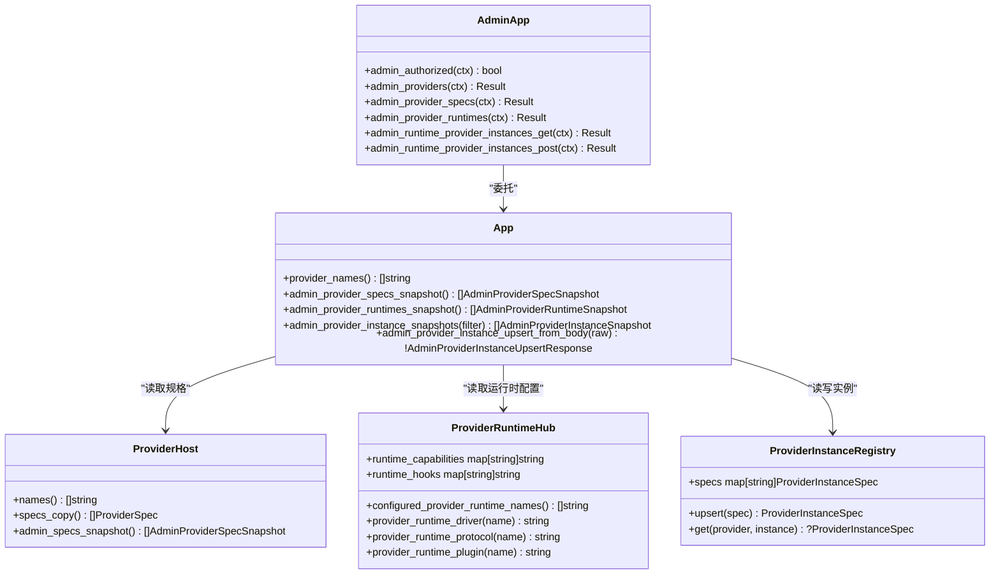

# 提供者管理 API

<cite>
**本文引用的文件**   
- [admin_server.v](file://src/admin_server.v)
- [admin_runtime.v](file://src/admin_runtime.v)
- [admin_provider_runtime.v](file://src/admin_provider_runtime.v)
- [provider/types.v](file://src/provider/types.v)
- [provider_spec.v](file://src/provider_spec.v)
- [provider_instance_admin_runtime.v](file://src/provider_instance_admin_runtime.v)
- [provider/instance.v](file://src/provider/instance.v)
</cite>

## 目录
1. [简介](#简介)
2. [项目结构](#项目结构)
3. [核心组件](#核心组件)
4. [架构总览](#架构总览)
5. [详细组件分析](#详细组件分析)
6. [依赖关系分析](#依赖关系分析)
7. [性能与可用性考虑](#性能与可用性考虑)
8. [故障排查指南](#故障排查指南)
9. [结论](#结论)
10. [附录：接口参考](#附录接口参考)

## 简介
本文件为“提供者管理 API”的完整参考文档，覆盖以下能力：
- 提供者注册表查询：列出已注册的提供者名称、规格定义（路由匹配、驱动等）
- 运行时状态监控：查看各提供者的运行时配置、协议、插件、钩子、能力以及运行时快照
- 实例生命周期管理：动态创建或更新提供者实例（upsert），并查看实例运行态（是否已连接、URL 等）
- 数据面与控制面双通道支持：在独立控制面端口与数据面模式下的统一访问方式

## 项目结构
与提供者管理 API 直接相关的实现分布在如下模块中：
- 控制面 HTTP 路由与鉴权：[admin_server.v](file://src/admin_server.v)
- 数据面 HTTP 路由与转发：[admin_runtime.v](file://src/admin_runtime.v)、[admin_provider_runtime.v](file://src/admin_provider_runtime.v)
- 提供者类型与快照模型：[provider/types.v](file://src/provider/types.v)
- 提供者规格与运行时快照聚合：[provider_spec.v](file://src/provider_spec.v)
- 实例管理与 upsert 流程：[provider_instance_admin_runtime.v](file://src/provider_instance_admin_runtime.v)、[provider/instance.v](file://src/provider/instance.v)

图表来源
- [admin_server.v:574-621](file://src/admin_server.v#L574-L621)
- [admin_runtime.v:540-585](file://src/admin_runtime.v#L540-L585)
- [admin_provider_runtime.v:6-32](file://src/admin_provider_runtime.v#L6-L32)
- [provider_spec.v:131-193](file://src/provider_spec.v#L131-L193)
- [provider_instance_admin_runtime.v:80-122](file://src/provider_instance_admin_runtime.v#L80-L122)

章节来源
- [admin_server.v:574-621](file://src/admin_server.v#L574-L621)
- [admin_runtime.v:540-585](file://src/admin_runtime.v#L540-L585)
- [admin_provider_runtime.v:6-32](file://src/admin_provider_runtime.v#L6-L32)
- [provider_spec.v:131-193](file://src/provider_spec.v#L131-L193)
- [provider_instance_admin_runtime.v:80-122](file://src/provider_instance_admin_runtime.v#L80-L122)

## 核心组件
- 控制面 AdminApp：负责鉴权、统一返回格式、将请求委派给共享 App。
- 数据面 App：当启用 on_data_plane 时，暴露相同的管理端点，便于在数据平面内访问。
- ProviderHost/ProviderRuntimeHub：维护提供者注册表、规格与运行时配置，并提供快照聚合。
- ProviderInstanceRegistry：持久化/内存中的实例规范集合，支持 upsert 与查询。
- 快照模型：AdminProviderSpecSnapshot、AdminProviderRuntimeSnapshot、AdminProviderInstanceSnapshot 用于对外暴露稳定 JSON 结构。

章节来源
- [admin_server.v:13-109](file://src/admin_server.v#L13-L109)
- [provider/types.v:14-35](file://src/provider/types.v#L14-L35)
- [provider_spec.v:14-35](file://src/provider_spec.v#L14-L35)
- [provider/instance.v:5-24](file://src/provider/instance.v#L5-L24)

## 架构总览
下图展示了从客户端到内部快照聚合的数据流，涵盖控制面与数据面两种入口。

图表来源
- [admin_server.v:574-621](file://src/admin_server.v#L574-L621)
- [admin_runtime.v:540-585](file://src/admin_runtime.v#L540-L585)
- [admin_provider_runtime.v:6-32](file://src/admin_provider_runtime.v#L6-L32)
- [provider_spec.v:131-193](file://src/provider_spec.v#L131-L193)
- [provider_instance_admin_runtime.v:96-122](file://src/provider_instance_admin_runtime.v#L96-L122)
- [provider/instance.v:5-24](file://src/provider/instance.v#L5-L24)

## 详细组件分析

### 提供者注册表查询
- 功能：返回当前已注册的提供者名称列表。
- 入口：
  - 控制面：GET /admin/providers
  - 数据面：未单独暴露该路径，通常通过控制面获取。
- 行为：
  - 控制面需鉴权；成功返回 JSON 数组。
  - 内部调用 shared.provider_names() 获取名称列表。

章节来源
- [admin_server.v:574-585](file://src/admin_server.v#L574-L585)

### 提供者规格定义
- 功能：返回所有提供者的规格快照，包括是否启用、是否具备 handler/runtime、运行时驱动、命令匹配器、路由种类等。
- 入口：
  - 控制面：GET /admin/providers/specs
  - 数据面：GET /admin/providers/specs（需在数据面模式下启用）
- 行为：
  - 控制面鉴权后返回 JSON 数组。
  - 数据面在未启用 on_data_plane 时返回 404。
  - 内部聚合逻辑遍历 ProviderHost 的 specs，生成 AdminProviderSpecSnapshot。

章节来源
- [admin_server.v:599-609](file://src/admin_server.v#L599-L609)
- [admin_provider_runtime.v:6-18](file://src/admin_provider_runtime.v#L6-L18)
- [provider_spec.v:37-61](file://src/provider_spec.v#L37-L61)
- [provider/types.v:14-23](file://src/provider/types.v#L14-L23)

### 提供者运行时状态
- 功能：返回每个提供者的运行时配置与快照，包括驱动、协议、插件、能力映射、钩子映射以及运行时 snapshot 字符串。
- 入口：
  - 控制面：GET /admin/providers/runtimes
  - 数据面：GET /admin/providers/runtimes（需在数据面模式下启用）
- 行为：
  - 控制面鉴权后返回 JSON 数组。
  - 数据面在未启用 on_data_plane 时返回 404。
  - 内部合并两类来源：已注册的 ProviderSpec 与仅配置的运行时项（如仅配置了驱动但未注册具体 provider）。

章节来源
- [admin_server.v:611-621](file://src/admin_server.v#L611-L621)
- [admin_provider_runtime.v:20-32](file://src/admin_provider_runtime.v#L20-L32)
- [provider_spec.v:147-193](file://src/provider_spec.v#L147-L193)
- [provider/types.v:25-35](file://src/provider/types.v#L25-L35)

### 实例生命周期管理（Upsert）
- 功能：创建或更新指定提供者的实例配置，并触发运行时应用，返回最新实例快照。
- 入口：
  - 控制面：POST /admin/runtime/provider-instances
  - 数据面：POST /admin/runtime/provider-instances（需在数据面模式下启用）
- 请求体字段：
  - provider：必填，提供者名称
  - instance：可选，实例名（默认归一化为 main）
  - config_json：可选，JSON 字符串形式的实例配置
  - desired_state：可选，期望状态（默认 connected）
- 响应：
  - 成功：200，包含 ok、status、snapshot（AdminProviderInstanceSnapshot）
  - 失败：400（invalid_json、missing_provider）、422（其他校验错误）
- 行为：
  - 解析请求体，规范化 provider/instance
  - 写入 ProviderInstanceStore（内存/注册表）
  - 调用 provider_instance_apply 应用变更
  - 读取最新快照返回

图表来源
- [admin_runtime.v:556-585](file://src/admin_runtime.v#L556-L585)
- [provider_instance_admin_runtime.v:96-122](file://src/provider_instance_admin_runtime.v#L96-L122)
- [provider/instance.v:5-24](file://src/provider/instance.v#L5-L24)

章节来源
- [admin_runtime.v:556-585](file://src/admin_runtime.v#L556-L585)
- [provider_instance_admin_runtime.v:96-122](file://src/provider_instance_admin_runtime.v#L96-L122)
- [provider/instance.v:5-24](file://src/provider/instance.v#L5-L24)

### 实例列表查询
- 功能：列出所有实例（含静态配置与动态 upsert 的配置），可按 provider 过滤。
- 入口：
  - 控制面：GET /admin/runtime/provider-instances?provider=xxx
  - 数据面：GET /admin/runtime/provider-instances?provider=xxx（需在数据面模式下启用）
- 行为：
  - 合并 registry.specs 与静态 spec，按 provider 过滤，排序后返回。
  - 快照中包含 stored、runtime_configured、runtime_connected、runtime_url、config_fields、desired_state 等。

章节来源
- [admin_server.v:677-688](file://src/admin_server.v#L677-L688)
- [admin_runtime.v:540-554](file://src/admin_runtime.v#L540-L554)
- [provider_instance_admin_runtime.v:19-78](file://src/provider_instance_admin_runtime.v#L19-L78)
- [provider/types.v:102-117](file://src/provider/types.v#L102-L117)

## 依赖关系分析
- 控制面 AdminApp 依赖共享 App 提供的提供者与实例管理能力。
- 数据面 App 在 on_data_plane 开启时复用相同的共享 App 能力。
- ProviderSpec 与 ProviderRuntime 由 ProviderHost/ProviderRuntimeHub 聚合，向 Admin 层暴露快照。
- ProviderInstanceRegistry 作为实例规范存储，被 upsert 与快照聚合共同使用。

图表来源
- [admin_server.v:574-716](file://src/admin_server.v#L574-L716)
- [provider_spec.v:131-193](file://src/provider_spec.v#L131-L193)
- [provider_instance_admin_runtime.v:80-122](file://src/provider_instance_admin_runtime.v#L80-L122)
- [provider/instance.v:5-24](file://src/provider/instance.v#L5-L24)

章节来源
- [admin_server.v:574-716](file://src/admin_server.v#L574-L716)
- [provider_spec.v:131-193](file://src/provider_spec.v#L131-L193)
- [provider_instance_admin_runtime.v:80-122](file://src/provider_instance_admin_runtime.v#L80-L122)
- [provider/instance.v:5-24](file://src/provider/instance.v#L5-L24)

## 性能与可用性考虑
- 快照聚合采用内存拷贝与排序，建议在高频调用场景下对结果进行缓存（例如短 TTL 缓存）。
- 数据面模式仅在 on_data_plane 启用时可用，避免不必要的跨平面转发开销。
- 实例 upsert 会触发运行时应用，建议批量操作时合并多次变更以降低抖动。

## 故障排查指南
- 403 Forbidden：控制面鉴权失败，检查 Token 或授权头。
- 404 Not Found：数据面模式下访问 /admin/providers/* 或 /admin/runtime/provider-instances 时，若 on_data_plane 未启用，将返回 404。
- 400 Bad Request：
  - invalid_json：请求体非合法 JSON。
  - missing_provider：未提供 provider 字段。
- 422 Unprocessable Entity：其他校验错误（如 provider 不存在、实例名非法等）。
- 200 OK：成功执行，响应体包含 status 与 snapshot，可据此判断实例是否已连接、URL 等信息。

章节来源
- [admin_server.v:93-109](file://src/admin_server.v#L93-L109)
- [admin_provider_runtime.v:9-17](file://src/admin_provider_runtime.v#L9-L17)
- [admin_runtime.v:556-585](file://src/admin_runtime.v#L556-L585)

## 结论
提供者管理 API 提供了统一的控制面与数据面访问方式，覆盖提供者注册、规格与运行时可见性、实例动态管理等关键能力。通过稳定的 JSON 快照模型与清晰的错误码约定，便于自动化运维与工具集成。

## 附录：接口参考

- GET /admin/providers
  - 说明：返回已注册的提供者名称列表
  - 鉴权：需要
  - 成功：200 JSON 数组
  - 失败：403 鉴权失败

- GET /admin/providers/specs
  - 说明：返回提供者规格快照
  - 鉴权：控制面需要；数据面需 on_data_plane
  - 成功：200 JSON 数组（每项包含 name、enabled、has_handler、has_runtime、runtime_driver、command_matchers、route_kind）
  - 失败：403/404

- GET /admin/providers/runtimes
  - 说明：返回提供者运行时快照
  - 鉴权：控制面需要；数据面需 on_data_plane
  - 成功：200 JSON 数组（每项包含 name、enabled、runtime_driver、protocol、plugin、capabilities、hooks、snapshot）
  - 失败：403/404

- GET /admin/runtime/provider-instances?provider=xxx
  - 说明：列出实例（支持按 provider 过滤）
  - 鉴权：控制面需要；数据面需 on_data_plane
  - 成功：200 JSON 数组（每项包含 provider、instance、source、stored、runtime_configured、runtime_connected、runtime_url、config_present、config_fields、desired_state、created_at、updated_at）
  - 失败：403/404

- POST /admin/runtime/provider-instances
  - 说明：创建或更新实例（upsert）
  - 鉴权：控制面需要；数据面需 on_data_plane
  - 请求体字段：provider（必填）、instance、config_json、desired_state
  - 成功：200 JSON（ok、status、snapshot）
  - 失败：400（invalid_json、missing_provider）、422（其他校验错误）

章节来源
- [admin_server.v:574-716](file://src/admin_server.v#L574-L716)
- [admin_provider_runtime.v:6-32](file://src/admin_provider_runtime.v#L6-L32)
- [admin_runtime.v:540-585](file://src/admin_runtime.v#L540-L585)
- [provider/types.v:14-35](file://src/provider/types.v#L14-L35)
- [provider/types.v:102-117](file://src/provider/types.v#L102-L117)
- [provider_instance_admin_runtime.v:19-78](file://src/provider_instance_admin_runtime.v#L19-L78)
- [provider_instance_admin_runtime.v:96-122](file://src/provider_instance_admin_runtime.v#L96-L122)