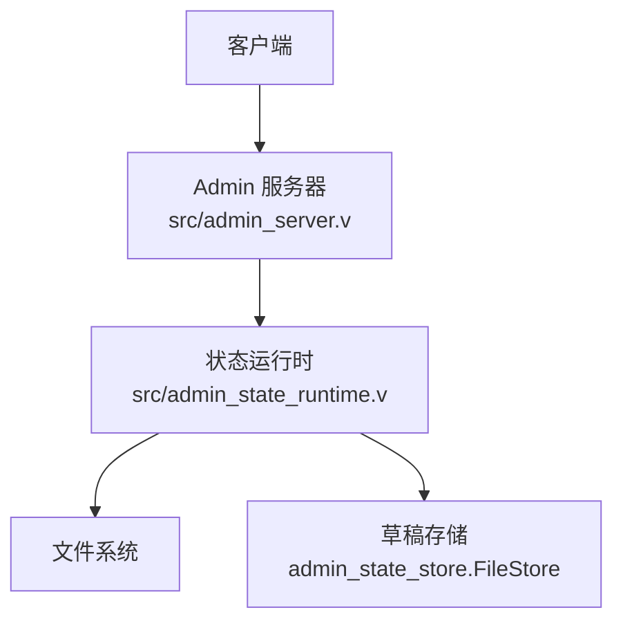
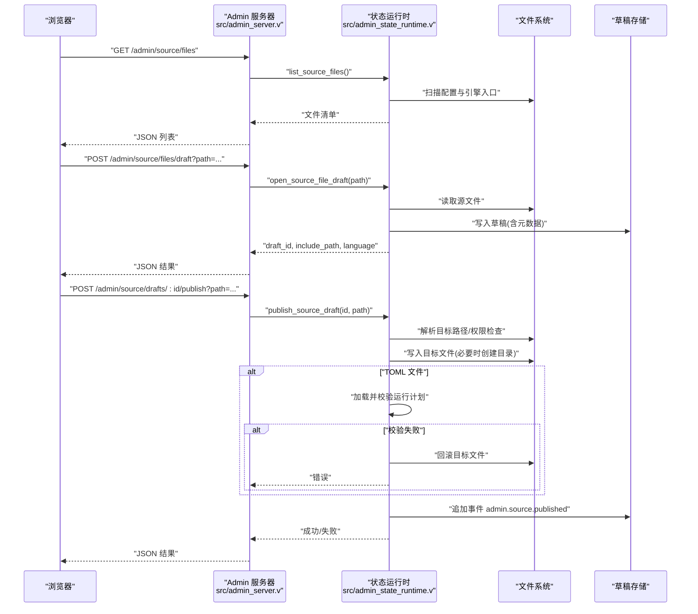
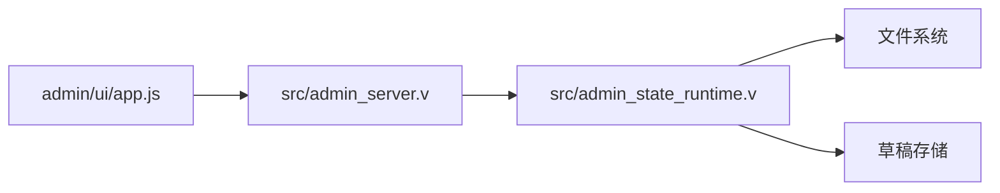

# 源码管理 API

<cite>
**本文引用的文件**   
- [src/admin_server.v](file://src/admin_server.v)
- [src/admin_state_runtime.v](file://src/admin_state_runtime.v)
- [admin/ui/app.js](file://admin/ui/app.js)
</cite>

## 目录
1. [简介](#简介)
2. [项目结构](#项目结构)
3. [核心组件](#核心组件)
4. [架构总览](#架构总览)
5. [详细组件分析](#详细组件分析)
6. [依赖关系分析](#依赖关系分析)
7. [性能考虑](#性能考虑)
8. [故障排查指南](#故障排查指南)
9. [结论](#结论)
10. [附录](#附录)

## 简介
本文件面向源码管理相关 API，覆盖以下能力：
- 源码文件列表：/admin/source/files
- 源码草稿创建：/admin/source/files/draft
- 源码发布：/admin/source/drafts/:id/publish

文档将详细说明接口定义、请求与响应字段、源码组织结构、草稿管理机制、发布流程与校验规则，并提供最佳实践与安全建议。

## 项目结构
源码管理功能由“HTTP 路由层”和“状态/存储层”两部分组成：
- HTTP 路由层负责鉴权、参数解析、调用业务逻辑并返回 JSON 结果
- 状态/存储层负责路径解析、仓库根定位、允许的文件类型判断、草稿读写、事件记录与回滚保护

图表来源
- [src/admin_server.v:336-403](file://src/admin_server.v#L336-L403)
- [src/admin_state_runtime.v:288-443](file://src/admin_state_runtime.v#L288-L443)

章节来源
- [src/admin_server.v:336-403](file://src/admin_server.v#L336-L403)
- [src/admin_state_runtime.v:288-443](file://src/admin_state_runtime.v#L288-L443)

## 核心组件
- 路由处理器
  - GET /admin/source/files：列出可编辑的源码文件
  - POST /admin/source/files/draft：打开某源码文件的草稿（读取内容并写入草稿存储）
  - POST /admin/source/drafts/:id/publish：根据草稿 ID 发布到目标路径
- 状态运行时
  - 路径解析与安全检查：限制在仓库根内、仅允许特定扩展名
  - 草稿持久化：基于 FileStore 的键值存储，附带元数据（source_path/include_path）
  - 发布流程：写文件、可选 TOML 校验、失败回滚、事件记录

章节来源
- [src/admin_server.v:336-403](file://src/admin_server.v#L336-L403)
- [src/admin_state_runtime.v:288-443](file://src/admin_state_runtime.v#L288-L443)

## 架构总览
下图展示了从浏览器 UI 到后端处理再到文件系统的完整调用链。

图表来源
- [src/admin_server.v:336-403](file://src/admin_server.v#L336-L403)
- [src/admin_state_runtime.v:288-443](file://src/admin_state_runtime.v#L288-L443)

## 详细组件分析

### 接口定义与行为

#### 获取源码文件列表
- 方法/路径：GET /admin/source/files
- 鉴权：需要管理员令牌
- 查询参数：无
- 响应体：数组，每项包含
  - role: 角色标识（如 main、include、typescript）
  - path: 绝对路径
  - include_path: 相对路径（相对于配置目录）
  - language: 语言（toml/typescript/javascript）
  - exists: 是否存在
  - bytes: 文件大小
  - draft_id: 对应草稿 ID（用于后续操作）
- 行为说明
  - 列举主配置文件及其 include 的配置文件
  - 列举引擎 entry 指向的 TypeScript/JavaScript 入口文件（若存在且未被重复）
  - 仅允许 toml/typescript/javascript 三类扩展名

章节来源
- [src/admin_server.v:336-346](file://src/admin_server.v#L336-L346)
- [src/admin_state_runtime.v:288-313](file://src/admin_state_runtime.v#L288-L313)
- [src/admin_state_runtime.v:702-732](file://src/admin_state_runtime.v#L702-L732)

#### 创建源码草稿
- 方法/路径：POST /admin/source/files/draft
- 鉴权：需要管理员令牌
- 查询参数
  - path 或 include_path：必填其一，表示要打开的源码文件路径（支持绝对路径或相对路径）
- 响应体
  - ok: 是否成功
  - error: 错误信息（失败时）
  - draft_id: 草稿唯一标识
  - path: 解析后的绝对路径
  - include_path: 相对路径
  - language: 语言
  - entry: 草稿条目（包含 value 等）
- 行为说明
  - 解析并校验路径必须在仓库根范围内
  - 读取源文件内容，生成稳定化的 draft_id（基于仓库根+相对路径）
  - 将内容与元数据（source_path/include_path）写入草稿存储
  - 返回可用于后续保存/发布的草稿 ID

章节来源
- [src/admin_server.v:348-363](file://src/admin_server.v#L348-L363)
- [src/admin_state_runtime.v:315-355](file://src/admin_state_runtime.v#L315-L355)
- [src/admin_state_runtime.v:622-651](file://src/admin_state_runtime.v#L622-L651)
- [src/admin_state_runtime.v:694-700](file://src/admin_state_runtime.v#L694-L700)

#### 发布源码草稿
- 方法/路径：POST /admin/source/drafts/:id/publish
- 鉴权：需要管理员令牌
- 路径参数
  - id: 草稿 ID
- 查询参数
  - path 或 include_path：可选；若不传则使用草稿元数据中的 source_path
- 响应体
  - ok: 是否成功
  - error: 错误信息（失败时）
  - draft_id: 草稿 ID
  - path: 目标绝对路径
  - language: 语言
  - bytes: 写入字节数
- 行为说明
  - 解析并校验目标路径必须在仓库根范围内且扩展名允许
  - 读取草稿内容，确保目标目录存在后写入
  - 若为 TOML 文件，会尝试加载并校验运行计划；失败则回滚目标文件
  - 成功后追加事件 admin.source.published 并返回成功

章节来源
- [src/admin_server.v:387-403](file://src/admin_server.v#L387-L403)
- [src/admin_state_runtime.v:357-443](file://src/admin_state_runtime.v#L357-L443)
- [src/admin_state_runtime.v:622-651](file://src/admin_state_runtime.v#L622-L651)

### 源码组织结构与识别
- 仓库根：以配置文件的父目录作为仓库根，所有路径必须位于该根下
- 列举范围
  - 主配置文件与 include 的配置文件
  - 引擎 entry 指定的 TypeScript/JavaScript 入口文件
- 允许的语言与扩展名
  - toml: .toml
  - typescript: .ts/.mts/.cts
  - javascript: .js/.mjs/.cjs
- 语言识别与相对路径计算
  - 通过扩展名映射语言
  - 相对路径基于配置目录计算，便于前端显示与二次发布

章节来源
- [src/admin_state_runtime.v:653-655](file://src/admin_state_runtime.v#L653-L655)
- [src/admin_state_runtime.v:716-732](file://src/admin_state_runtime.v#L716-L732)
- [src/admin_state_runtime.v:675-686](file://src/admin_state_runtime.v#L675-L686)

### 草稿管理机制
- 存储位置
  - 默认位于进程工作目录下的 .var/vhttpd/admin
  - 若配置了 event_log，则位于其同级 admin 子目录
- 存储键空间
  - drafts：存放草稿正文
  - draft_meta：存放草稿元数据（source_path/include_path）
- 草稿 ID 策略
  - 源码草稿：基于仓库根+相对路径的稳定化 ID（前缀 source.）
  - 配置草稿：基于文件名稳定化（前缀 config.）
- 事件记录
  - 保存/删除/发布等操作会追加事件，便于审计与追踪

章节来源
- [src/admin_state_runtime.v:99-107](file://src/admin_state_runtime.v#L99-L107)
- [src/admin_state_runtime.v:134-169](file://src/admin_state_runtime.v#L134-L169)
- [src/admin_state_runtime.v:694-700](file://src/admin_state_runtime.v#L694-L700)
- [src/admin_state_runtime.v:428-435](file://src/admin_state_runtime.v#L428-L435)

### 发布流程与验证规则
- 路径安全
  - 拒绝不在仓库根内的路径
  - 拒绝不允许的扩展名
- 幂等性与回滚
  - 写入前备份旧内容，失败时恢复或删除
  - TOML 发布失败会触发回滚
- 校验时机
  - TOML 文件在写入后立即进行运行计划加载校验
  - 非 TOML 文件不进行语法校验，但可通过通用草稿校验接口（/admin/drafts/:id/validate）进行验证（仅支持 TOML）

章节来源
- [src/admin_state_runtime.v:357-443](file://src/admin_state_runtime.v#L357-L443)
- [src/admin_state_runtime.v:622-651](file://src/admin_state_runtime.v#L622-L651)
- [src/admin_state_runtime.v:811-819](file://src/admin_state_runtime.v#L811-L819)

### 前端集成要点（参考）
- 列表页展示可编辑的源码文件，点击“Open”调用 /admin/source/files/draft
- 编辑器中支持保存草稿（PUT /admin/drafts/:id）、发布（POST /admin/source/drafts/:id/publish）、校验（POST /admin/drafts/:id/validate，仅 TOML）
- 发布成功后刷新页面以更新列表

章节来源
- [admin/ui/app.js:891-956](file://admin/ui/app.js#L891-L956)

## 依赖关系分析
- 路由层依赖状态运行时提供的函数完成具体业务
- 状态运行时依赖文件系统与草稿存储
- 前端通过 HTTP 与路由层交互，间接依赖状态运行时

图表来源
- [src/admin_server.v:336-403](file://src/admin_server.v#L336-L403)
- [src/admin_state_runtime.v:288-443](file://src/admin_state_runtime.v#L288-L443)
- [admin/ui/app.js:891-956](file://admin/ui/app.js#L891-L956)

## 性能考虑
- 列表接口会遍历配置与引擎入口，避免重复项，时间复杂度与配置/引擎数量线性相关
- 草稿读写为本地磁盘 I/O，注意并发场景下的稳定性（当前实现未加锁，建议外部控制并发）
- TOML 校验仅在发布时执行，避免频繁解析开销

[本节为通用指导，不直接分析具体文件]

## 故障排查指南
- 常见错误码与含义
  - 403：未通过管理员鉴权
  - 400：创建草稿失败（例如路径缺失或无法读取）
  - 422：发布失败（路径非法、扩展名不允许、TOML 校验失败等）
  - 404：草稿不存在（查询单个草稿时）
- 典型问题定位
  - 路径越界：确认 path/include_path 是否在仓库根内
  - 扩展名不被允许：仅 toml/typescript/javascript 可用
  - TOML 校验失败：查看错误信息，必要时先通过 /admin/drafts/:id/validate 预检
  - 回滚异常：检查目标目录权限与磁盘空间

章节来源
- [src/admin_server.v:336-403](file://src/admin_server.v#L336-L403)
- [src/admin_state_runtime.v:357-443](file://src/admin_state_runtime.v#L357-L443)
- [src/admin_state_runtime.v:622-651](file://src/admin_state_runtime.v#L622-L651)

## 结论
源码管理 API 提供了安全的源码文件浏览、草稿编辑与发布能力。通过严格的仓库根边界与扩展名白名单，结合草稿元数据与事件记录，实现了可追溯、可回滚的变更流程。建议在自动化流水线中结合校验接口，确保发布质量与安全性。

[本节为总结性内容，不直接分析具体文件]

## 附录

### 接口速查表
- GET /admin/source/files
  - 作用：列出可编辑的源码文件
  - 鉴权：必需
  - 关键返回字段：role/path/include_path/language/exists/bytes/draft_id
- POST /admin/source/files/draft
  - 作用：打开源码文件草稿
  - 鉴权：必需
  - 查询参数：path|include_path（二选一）
  - 关键返回字段：ok/error/draft_id/path/include_path/language/entry
- POST /admin/source/drafts/:id/publish
  - 作用：发布源码草稿
  - 鉴权：必需
  - 路径参数：id
  - 查询参数：path|include_path（可选，默认使用元数据）
  - 关键返回字段：ok/error/draft_id/path/language/bytes

章节来源
- [src/admin_server.v:336-403](file://src/admin_server.v#L336-L403)
- [src/admin_state_runtime.v:288-443](file://src/admin_state_runtime.v#L288-L443)

### 最佳实践
- 始终先调用列表接口获取 include_path，再打开草稿，减少路径拼写错误
- 对 TOML 文件，先通过 /admin/drafts/:id/validate 预检，再发布
- 发布前备份重要文件，或在 CI 中先行验证
- 严格控制管理员令牌，最小权限原则

[本节为通用指导，不直接分析具体文件]

### 安全考虑
- 鉴权：所有接口均需管理员令牌
- 路径隔离：严格限制在仓库根内，防止越权访问
- 扩展名白名单：仅允许受控语言类型
- 审计：关键操作均记录事件，便于事后追溯

章节来源
- [src/admin_server.v:101-109](file://src/admin_server.v#L101-L109)
- [src/admin_state_runtime.v:622-651](file://src/admin_state_runtime.v#L622-L651)
- [src/admin_state_runtime.v:428-435](file://src/admin_state_runtime.v#L428-L435)