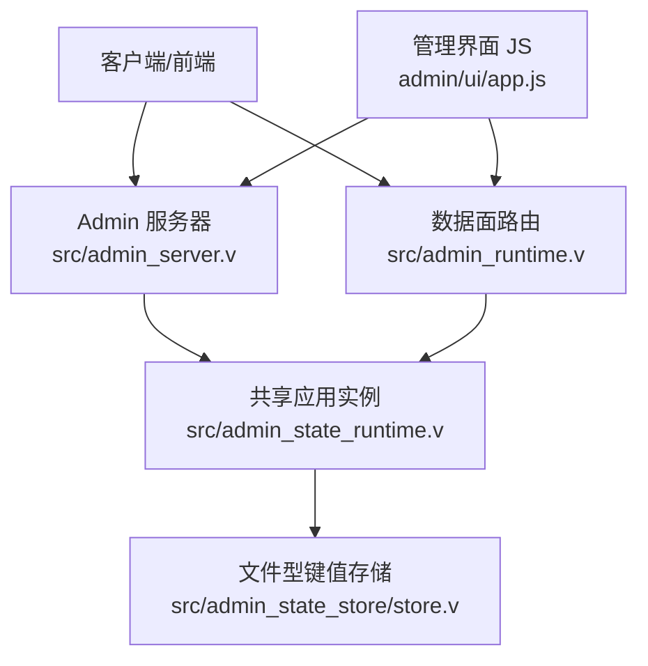
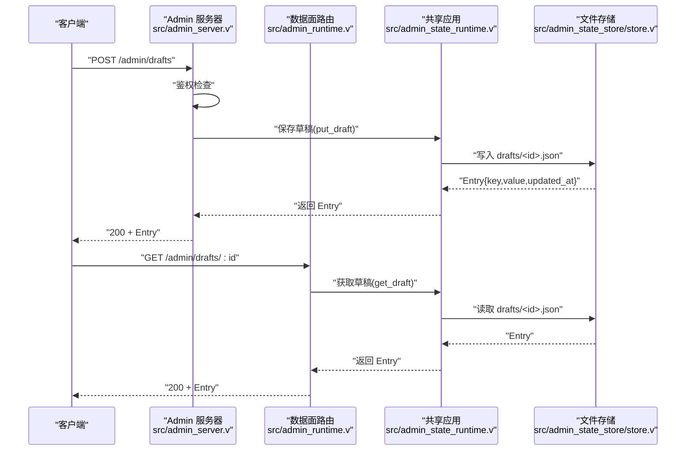
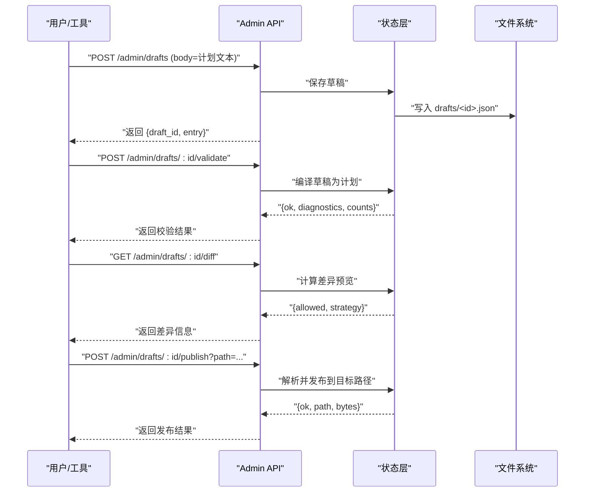

# 草稿管理 API

<cite>
**本文引用的文件**
- [src/admin_server.v](file://src/admin_server.v)
- [src/admin_runtime.v](file://src/admin_runtime.v)
- [src/admin_state_runtime.v](file://src/admin_state_runtime.v)
- [src/admin_state_store/store.v](file://src/admin_state_store/store.v)
- [admin/ui/app.js](file://admin/ui/app.js)
</cite>

## 目录
1. [简介](#简介)
2. [项目结构](#项目结构)
3. [核心组件](#核心组件)
4. [架构总览](#架构总览)
5. [详细组件分析](#详细组件分析)
6. [依赖关系分析](#依赖关系分析)
7. [性能与一致性](#性能与一致性)
8. [故障排查指南](#故障排查指南)
9. [结论](#结论)
10. [附录：API 参考](#附录api-参考)

## 简介
本文件为 vhttpd 的“草稿管理 API”完整参考文档，聚焦于 /admin/drafts 端点的 CRUD 操作（创建、查询、更新、删除），并补充校验、差异预览与发布等关键能力。文档涵盖：
- 草稿 ID 生成规则
- 草稿数据结构与持久化模型
- 草稿与正式内容（运行时计划）的关系
- 典型工作流示例与协作最佳实践

## 项目结构
与草稿管理相关的关键代码位于以下模块：
- 控制面/数据面路由与鉴权：src/admin_server.v、src/admin_runtime.v
- 草稿状态与业务逻辑：src/admin_state_runtime.v
- 草稿持久化存储：src/admin_state_store/store.v
- 前端调用示例：admin/ui/app.js



图表来源
- [src/admin_server.v:365-470](file://src/admin_server.v#L365-L470)
- [src/admin_runtime.v:136-357](file://src/admin_runtime.v#L136-L357)
- [src/admin_state_runtime.v:124-174](file://src/admin_state_runtime.v#L124-L174)
- [src/admin_state_store/store.v:42-109](file://src/admin_state_store/store.v#L42-L109)
- [admin/ui/app.js:794-993](file://admin/ui/app.js#L794-L993)

章节来源
- [src/admin_server.v:365-470](file://src/admin_server.v#L365-L470)
- [src/admin_runtime.v:136-357](file://src/admin_runtime.v#L136-L357)
- [src/admin_state_runtime.v:124-174](file://src/admin_state_runtime.v#L124-L174)
- [src/admin_state_store/store.v:42-109](file://src/admin_state_store/store.v#L42-L109)
- [admin/ui/app.js:794-993](file://admin/ui/app.js#L794-L993)

## 核心组件
- 路由层
  - 控制面路由：提供鉴权后的 /admin/drafts* 接口，用于管理后台交互。
  - 数据面路由：在启用 on_data_plane 时暴露相同语义的 /admin/drafts* 接口。
- 状态层
  - 草稿生命周期：创建、读取、更新、删除、事件记录、元数据维护。
  - 编译与校验：将草稿文本编译为运行时计划，返回诊断信息。
  - 差异预览：对比当前运行计划与草稿计划，输出变更策略与允许性。
  - 发布：将草稿写入目标路径，覆盖或合并到正式配置。
- 存储层
  - 基于文件的命名空间键值存储，支持原子写入、事件追加与列表枚举。

章节来源
- [src/admin_server.v:365-470](file://src/admin_server.v#L365-L470)
- [src/admin_runtime.v:136-357](file://src/admin_runtime.v#L136-L357)
- [src/admin_state_runtime.v:124-174](file://src/admin_state_runtime.v#L124-L174)
- [src/admin_state_store/store.v:42-109](file://src/admin_state_store/store.v#L42-L109)

## 架构总览
下图展示了从请求进入、鉴权、路由分发、状态处理到持久化的端到端流程。



图表来源
- [src/admin_server.v:365-385](file://src/admin_server.v#L365-L385)
- [src/admin_runtime.v:219-240](file://src/admin_runtime.v#L219-L240)
- [src/admin_state_runtime.v:129-145](file://src/admin_state_runtime.v#L129-L145)
- [src/admin_state_store/store.v:42-72](file://src/admin_state_store/store.v#L42-L72)

## 详细组件分析

### 端点清单与行为
- GET /admin/drafts
  - 列出所有草稿条目（命名空间 drafts）。
  - 数据面需开启 on_data_plane，否则返回 404。
- POST /admin/drafts
  - 创建或更新草稿。若 query.id 为空则自动生成 id。
  - 返回 Entry（包含 key/value/updated_at_unix）。
- GET /admin/drafts/:id
  - 按 id 获取草稿详情。
- PUT /admin/drafts/:id
  - 以指定 id 更新草稿内容。
- DELETE /admin/drafts/:id
  - 删除指定草稿及其元数据。
- POST /admin/drafts/:id/validate
  - 校验草稿是否能编译为运行时计划，返回 ok、schema_version、count、diagnostics。
- GET /admin/drafts/:id/diff
  - 计算草稿与当前运行计划的差异预览，返回 allowed、strategy 等。
- POST /admin/drafts/:id/publish
  - 将草稿发布到目标路径（query.path 或 include_path），返回 ok、path、bytes 等。

注意：
- 控制面路由会进行鉴权；数据面路由会在未启用 on_data_plane 时返回 404。
- 上述端点在控制面和数据面均有实现，语义一致。

章节来源
- [src/admin_server.v:365-470](file://src/admin_server.v#L365-L470)
- [src/admin_runtime.v:136-357](file://src/admin_runtime.v#L136-L357)
- [src/admin_server.v:930-985](file://src/admin_server.v#L930-L985)
- [src/admin_runtime.v:312-357](file://src/admin_runtime.v#L312-L357)

### 草稿 ID 生成规则
- 若请求携带 query.id 且非空，则使用该值作为草稿 id。
- 若未提供或为空，系统自动生成 id，格式为 draft_ 前缀加微秒级时间戳。
- 该规则确保 id 唯一且可追溯。

章节来源
- [src/admin_state_runtime.v:109-115](file://src/admin_state_runtime.v#L109-L115)

### 草稿数据结构与持久化
- 存储命名空间
  - drafts：存放草稿正文（JSON 字符串形式）。
  - draft_meta：存放草稿元数据（如 source_path、include_path 等）。
- Entry 字段
  - namespace：命名空间名（如 drafts）。
  - key：草稿 id。
  - value：草稿正文（字符串）。
  - updated_at_unix：更新时间（Unix 秒）。
- 文件布局
  - 根目录由 event_log 或默认 .var/vhttpd/admin 决定。
  - 每个命名空间对应一个子目录，条目以 key.json 命名。
- 并发与一致性
  - put/delete/list 使用互斥锁保护。
  - 写入采用临时文件+重命名的原子写策略。

章节来源
- [src/admin_state_store/store.v:8-14](file://src/admin_state_store/store.v#L8-L14)
- [src/admin_state_store/store.v:42-109](file://src/admin_state_store/store.v#L42-L109)
- [src/admin_state_store/store.v:187-194](file://src/admin_state_store/store.v#L187-L194)
- [src/admin_state_runtime.v:99-107](file://src/admin_state_runtime.v#L99-L107)

### 草稿与正式内容的关系
- 草稿正文是运行时计划（RuntimePlan）的文本表示。
- 校验 validate 会将草稿编译为运行时计划，返回 schema_version、计数与诊断信息。
- 差异 diff 比较草稿计划与当前运行计划，给出 allowed 与 strategy。
- 发布 publish 将草稿解析为目标路径的正式配置，并触发运行时替换流程。

章节来源
- [src/admin_state_runtime.v:176-207](file://src/admin_state_runtime.v#L176-L207)
- [src/admin_state_runtime.v:445-490](file://src/admin_state_runtime.v#L445-L490)

### 工作流序列图（创建-校验-预览-发布）


图表来源
- [src/admin_server.v:365-385](file://src/admin_server.v#L365-L385)
- [src/admin_server.v:930-985](file://src/admin_server.v#L930-L985)
- [src/admin_runtime.v:312-357](file://src/admin_runtime.v#L312-L357)
- [src/admin_state_runtime.v:176-207](file://src/admin_state_runtime.v#L176-L207)
- [src/admin_state_runtime.v:445-490](file://src/admin_state_runtime.v#L445-L490)

### 错误码与响应约定
- 成功：200，返回 JSON 对象（含 admin_endpoint、draft_id 等上下文字段）。
- 参数/校验失败：400 或 422，返回 {error}。
- 资源不存在：404。
- 权限不足：控制面返回禁止访问响应。

章节来源
- [src/admin_server.v:365-470](file://src/admin_server.v#L365-L470)
- [src/admin_runtime.v:136-357](file://src/admin_runtime.v#L136-L357)

## 依赖关系分析
- 路由层依赖状态层完成具体业务逻辑。
- 状态层依赖存储层进行持久化与事件记录。
- 前端通过控制面/数据面路由与后端交互。

```mermaid
classDiagram
class AdminServer {
"+路由 : /admin/drafts*"
"+鉴权 : admin_authorized()"
}
class DataPlane {
"+路由 : /admin/drafts*"
"+开关 : on_data_plane"
}
class AppState {
"+保存/读取/删除草稿"
"+校验/差异/发布"
"+事件记录"
}
class FileStore {
"+get/put/delete/list"
"+append_event"
"+原子写入"
}
AdminServer --> AppState : "调用"
DataPlane --> AppState : "调用"
AppState --> FileStore : "读写"
```

图表来源
- [src/admin_server.v:365-470](file://src/admin_server.v#L365-L470)
- [src/admin_runtime.v:136-357](file://src/admin_runtime.v#L136-L357)
- [src/admin_state_runtime.v:124-174](file://src/admin_state_runtime.v#L124-L174)
- [src/admin_state_store/store.v:42-109](file://src/admin_state_store/store.v#L42-L109)

章节来源
- [src/admin_server.v:365-470](file://src/admin_server.v#L365-L470)
- [src/admin_runtime.v:136-357](file://src/admin_runtime.v#L136-L357)
- [src/admin_state_runtime.v:124-174](file://src/admin_state_runtime.v#L124-L174)
- [src/admin_state_store/store.v:42-109](file://src/admin_state_store/store.v#L42-L109)

## 性能与一致性
- 原子写入：通过临时文件+mv 保证写入一致性，避免部分写入导致损坏。
- 并发安全：put/delete/list 使用互斥锁保护，避免竞态条件。
- 事件追加：事件日志以追加模式写入，适合审计与回放。
- 建议：
  - 批量操作尽量分片，避免单次过大 payload。
  - 高频读取场景可在上层引入缓存（例如短 TTL 的内存缓存）。
  - 对大文件发布，关注磁盘 I/O 与目标路径权限。

章节来源
- [src/admin_state_store/store.v:187-194](file://src/admin_state_store/store.v#L187-L194)
- [src/admin_state_store/store.v:111-133](file://src/admin_state_store/store.v#L111-L133)

## 故障排查指南
- 404 Not Found（数据面）
  - 现象：数据面路由返回 404。
  - 原因：on_data_plane 未启用。
  - 处理：确认控制平面配置已开启数据面。
- 400/422 校验失败
  - 现象：validate 返回 ok=false 与 error。
  - 原因：草稿无法编译为运行时计划或存在诊断错误。
  - 处理：根据 diagnostics 修正草稿内容。
- 403 禁止访问（控制面）
  - 现象：未通过鉴权。
  - 原因：缺少或错误的 admin_token。
  - 处理：在请求头或查询参数中提供正确的 token。
- 404 资源不存在
  - 现象：GET /admin/drafts/:id 返回 404。
  - 原因：草稿 id 不存在。
  - 处理：先列出草稿确认 id，或重新创建。

章节来源
- [src/admin_runtime.v:136-157](file://src/admin_runtime.v#L136-L157)
- [src/admin_server.v:930-985](file://src/admin_server.v#L930-L985)
- [src/admin_server.v:365-470](file://src/admin_server.v#L365-L470)

## 结论
vhttpd 的草稿管理 API 提供了完整的草稿生命周期管理能力，结合校验、差异预览与发布，形成“编辑-验证-预览-发布”的安全闭环。其基于文件系统的持久化方案具备简单可靠、易于审计的特点，并通过原子写入与互斥锁保障一致性。建议在团队协作中遵循最小权限、明确 id 规范、充分使用 validate/diff 以降低发布风险。

## 附录：API 参考

### 通用说明
- 认证
  - 控制面：需在请求头或查询参数中提供 admin_token。
  - 数据面：需在控制面启用 on_data_plane。
- 请求体
  - 创建/更新：正文为运行时计划文本。
- 响应体
  - 成功：JSON 对象，包含 admin_endpoint、draft_id 等上下文字段。
  - 失败：{error}。

### 端点定义

- GET /admin/drafts
  - 功能：列出所有草稿条目。
  - 成功响应：数组，元素为 Entry（namespace/key/value/updated_at_unix）。
  - 错误：数据面未启用时返回 404。

- POST /admin/drafts
  - 功能：创建或更新草稿。
  - 查询参数：id（可选，为空则自动生成）。
  - 请求体：运行时计划文本。
  - 成功响应：Entry。
  - 错误：400（参数或写入错误）。

- GET /admin/drafts/:id
  - 功能：获取指定草稿详情。
  - 成功响应：Entry。
  - 错误：404（不存在）、400（读取错误）。

- PUT /admin/drafts/:id
  - 功能：更新指定草稿内容。
  - 请求体：运行时计划文本。
  - 成功响应：Entry。
  - 错误：400（写入错误）。

- DELETE /admin/drafts/:id
  - 功能：删除指定草稿及元数据。
  - 成功响应：{ok:true, draft_id}。
  - 错误：400（删除错误）。

- POST /admin/drafts/:id/validate
  - 功能：校验草稿能否编译为运行时计划。
  - 成功响应：{ok, schema_version, counts, diagnostics}。
  - 错误：422（编译失败）。

- GET /admin/drafts/:id/diff
  - 功能：预览草稿与当前运行计划的差异。
  - 成功响应：{allowed, strategy}。
  - 错误：422（预览失败）。

- POST /admin/drafts/:id/publish
  - 功能：将草稿发布到目标路径。
  - 查询参数：path 或 include_path（二选一）。
  - 成功响应：{ok, path, bytes}。
  - 错误：422（发布失败）。

章节来源
- [src/admin_server.v:365-470](file://src/admin_server.v#L365-L470)
- [src/admin_runtime.v:136-357](file://src/admin_runtime.v#L136-L357)
- [src/admin_server.v:930-985](file://src/admin_server.v#L930-L985)
- [src/admin_runtime.v:312-357](file://src/admin_runtime.v#L312-L357)

### 使用示例（来自前端）
- 列举草稿：GET /admin/drafts?id=<draftId>
- 获取草稿：GET /admin/drafts/<id>
- 更新草稿：PUT /admin/drafts/<id>
- 校验草稿：POST /admin/drafts/<id>/validate
- 差异预览：GET /admin/drafts/<id>/diff
- 发布草稿：POST /admin/drafts/<id>/publish?path=<includePath>
- 删除草稿：DELETE /admin/drafts/<id>

章节来源
- [admin/ui/app.js:794-993](file://admin/ui/app.js#L794-L993)

### 协作开发最佳实践
- 统一 id 命名：建议使用业务前缀+时间戳，便于追踪。
- 强制校验：在提交前调用 validate，确保语法与结构正确。
- 差异审查：发布前调用 diff，评估影响范围与策略。
- 灰度发布：优先选择 include_path 指向独立片段，降低主配置风险。
- 审计回溯：利用事件日志与 updated_at_unix 进行变更审计。
- 权限隔离：严格控制 admin_token，仅授权必要人员。

[本节为概念性指导，不直接分析具体文件]