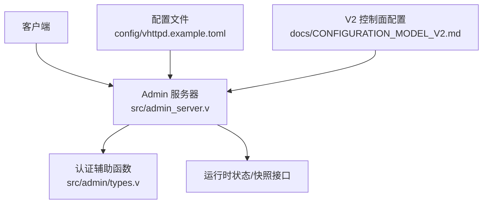
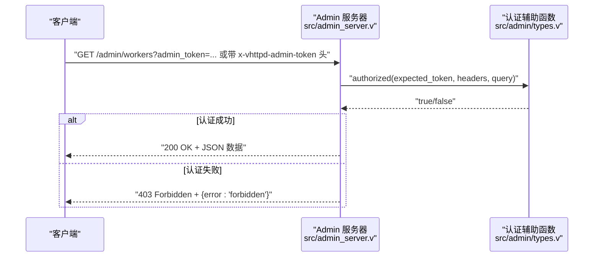
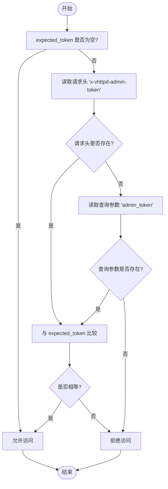
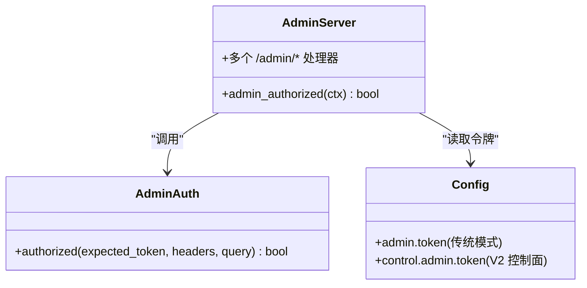

# 认证与授权

<cite>
**本文引用的文件**   
- [src/admin/types.v](file://src/admin/types.v)
- [src/admin_server.v](file://src/admin_server.v)
- [config/vhttpd.example.toml](file://config/vhttpd.example.toml)
- [README.md](file://README.md)
- [docs/CONFIGURATION_MODEL_V2.md](file://docs/CONFIGURATION_MODEL_V2.md)
</cite>

## 目录
1. [简介](#简介)
2. [项目结构](#项目结构)
3. [核心组件](#核心组件)
4. [架构总览](#架构总览)
5. [详细组件分析](#详细组件分析)
6. [依赖关系分析](#依赖关系分析)
7. [性能与安全考量](#性能与安全考量)
8. [故障排查指南](#故障排查指南)
9. [结论](#结论)
10. [附录：请求示例与错误响应](#附录请求示例与错误响应)

## 简介
本文件聚焦于 vhttpd 的 Admin API 认证与授权机制，覆盖管理员令牌配置、HTTP 头部认证方式、查询参数认证方式、权限验证流程、安全最佳实践、令牌管理策略以及常见认证错误的处理方法。文档同时提供完整的认证请求示例和错误响应格式说明，帮助读者在生产环境中正确启用并安全使用 Admin API。

## 项目结构
Admin 认证相关的关键实现位于以下位置：
- 认证逻辑与通用类型定义：src/admin/types.v
- Admin HTTP 路由与鉴权入口：src/admin_server.v
- 示例配置（包含 [admin].token）：config/vhttpd.example.toml
- 行为说明与端口暴露模型：README.md
- V2 控制面配置参考（control.admin.token）：docs/CONFIGURATION_MODEL_V2.md

图表来源
- [src/admin_server.v:101-109](file://src/admin_server.v#L101-L109)
- [src/admin/types.v:130-139](file://src/admin/types.v#L130-L139)
- [config/vhttpd.example.toml:38-42](file://config/vhttpd.example.toml#L38-L42)
- [docs/CONFIGURATION_MODEL_V2.md:218-233](file://docs/CONFIGURATION_MODEL_V2.md#L218-L233)

章节来源
- [src/admin/types.v:130-139](file://src/admin/types.v#L130-L139)
- [src/admin_server.v:101-109](file://src/admin_server.v#L101-L109)
- [config/vhttpd.example.toml:38-42](file://config/vhttpd.example.toml#L38-L42)
- [README.md:1187-1202](file://README.md#L1187-L1202)
- [docs/CONFIGURATION_MODEL_V2.md:218-233](file://docs/CONFIGURATION_MODEL_V2.md#L218-L233)

## 核心组件
- 认证辅助函数
  - 负责从请求头或查询参数中读取管理员令牌并与期望值比较，返回是否通过认证。
- Admin 服务器路由
  - 在每个受保护的 Admin 端点入口处调用认证辅助函数，未通过则返回 403。
- 配置项
  - 支持两种配置路径：
    - 传统模式：[admin].token
    - V2 控制面模式：control.admin.token（绑定到 listeners.admin）

章节来源
- [src/admin/types.v:130-139](file://src/admin/types.v#L130-L139)
- [src/admin_server.v:101-109](file://src/admin_server.v#L101-L109)
- [config/vhttpd.example.toml:38-42](file://config/vhttpd.example.toml#L38-L42)
- [docs/CONFIGURATION_MODEL_V2.md:218-233](file://docs/CONFIGURATION_MODEL_V2.md#L218-L233)

## 架构总览
Admin API 的认证流程在请求进入具体业务处理之前完成，采用“先鉴权后处理”的模式。当配置了管理员令牌时，所有 /admin/* 端点均要求携带有效令牌；否则默认开放访问（不推荐生产环境）。

图表来源
- [src/admin_server.v:101-109](file://src/admin_server.v#L101-L109)
- [src/admin/types.v:130-139](file://src/admin/types.v#L130-L139)

章节来源
- [src/admin_server.v:101-109](file://src/admin_server.v#L101-L109)
- [src/admin/types.v:130-139](file://src/admin/types.v#L130-L139)

## 详细组件分析

### 认证辅助函数（AdminAuth.authorized）
- 输入
  - expected_token：来自配置的管理员令牌
  - headers：HTTP 请求头映射
  - query：URL 查询参数映射
- 规则
  - 若 expected_token 为空字符串，则直接放行（表示未启用认证）
  - 优先从请求头 x-vhttpd-admin-token 取值
  - 若请求头不存在，则回退到查询参数 admin_token
  - 将提取到的 token 与 expected_token 进行严格相等比较
- 输出
  - bool：是否通过认证

图表来源
- [src/admin/types.v:130-139](file://src/admin/types.v#L130-L139)

章节来源
- [src/admin/types.v:130-139](file://src/admin/types.v#L130-L139)

### Admin 服务器鉴权入口
- 每个受保护端点在处理器内部调用 admin_authorized(ctx)，其内部会：
  - 从请求中提取 header 映射
  - 调用 AdminAuth.authorized(app.admin_token, headers, ctx.query)
- 未通过认证时统一返回 403 Forbidden，并在部分端点返回 JSON 错误体 {error:'forbidden'}

章节来源
- [src/admin_server.v:101-109](file://src/admin_server.v#L101-L109)
- [src/admin_server.v:117-141](file://src/admin_server.v#L117-L141)

### 配置项与令牌来源
- 传统模式（单进程/简单部署）
  - 配置段：[admin]
  - 关键字段：token
  - 示例见 config/vhttpd.example.toml
- V2 控制面模式（listeners + control）
  - 监听器：[listeners.admin]
  - 控制面：[control]
  - 关键字段：control.admin.token
  - 参考 docs/CONFIGURATION_MODEL_V2.md

章节来源
- [config/vhttpd.example.toml:38-42](file://config/vhttpd.example.toml#L38-L42)
- [docs/CONFIGURATION_MODEL_V2.md:218-233](file://docs/CONFIGURATION_MODEL_V2.md#L218-L233)

### 端口暴露与访问范围
- 当 admin 端口启用（>0）时，/admin/* 仅在 admin 平面监听地址上提供服务，数据平面不再提供这些路径
- 当 admin 端口禁用（=0）时，/admin/* 在服务数据平面的主端口上提供
- 该行为用于隔离管理面与数据面，降低误暴露风险

章节来源
- [README.md:1187-1202](file://README.md#L1187-L1202)

## 依赖关系分析
- 认证逻辑集中定义在 admin 模块的类型文件中，被 admin_server 复用，保证一致性
- 配置加载后注入到 AdminApp 实例，作为 expected_token 传入认证函数
- 认证结果直接影响路由处理器的分支与响应码

图表来源
- [src/admin_server.v:101-109](file://src/admin_server.v#L101-L109)
- [src/admin/types.v:130-139](file://src/admin/types.v#L130-L139)
- [config/vhttpd.example.toml:38-42](file://config/vhttpd.example.toml#L38-L42)
- [docs/CONFIGURATION_MODEL_V2.md:218-233](file://docs/CONFIGURATION_MODEL_V2.md#L218-L233)

章节来源
- [src/admin_server.v:101-109](file://src/admin_server.v#L101-L109)
- [src/admin/types.v:130-139](file://src/admin/types.v#L130-L139)

## 性能与安全考量
- 性能
  - 认证为轻量级字符串比较，开销极低，对整体吞吐影响可忽略
- 安全
  - 建议始终设置管理员令牌，避免在未启用认证的情况下暴露管理面
  - 仅在内网或受信任网络暴露 admin 端口，结合防火墙或反向代理限制来源 IP
  - 使用 HTTPS/TLS 终止于前置网关，确保传输层加密
  - 定期轮换令牌，最小化泄露窗口
  - 避免在日志中记录完整令牌，必要时脱敏

## 故障排查指南
- 403 Forbidden
  - 原因：缺少令牌、令牌不正确或未启用认证但服务端期望令牌
  - 检查：确认请求头或查询参数是否正确传递；核对配置中的令牌值
- 无法访问 /admin/*
  - 原因：admin 端口未启用或被路由到数据平面
  - 检查：确认 admin 端口配置与 README 中端口暴露模型一致
- 环境变量未生效
  - 原因：V2 控制面模式下 token 可能来自环境变量
  - 检查：确认 control.admin.token 的值解析正确

章节来源
- [src/admin_server.v:117-141](file://src/admin_server.v#L117-L141)
- [README.md:1187-1202](file://README.md#L1187-L1202)

## 结论
vhttpd 的 Admin API 认证采用“可选令牌校验”的策略：未配置令牌时默认开放，配置后强制校验。认证优先级为请求头 x-vhttpd-admin-token，其次为查询参数 admin_token。配合合理的端口暴露与网络隔离策略，可在保障可用性的同时提升安全性。

## 附录：请求示例与错误响应

### 认证方式
- 通过请求头
  - 添加请求头：x-vhttpd-admin-token: <your-token>
- 通过查询参数
  - URL 追加：?admin_token=<your-token>

### 成功请求示例
- 获取工作节点列表（需认证）
  - GET http://127.0.0.1:19981/admin/workers
  - 请求头：x-vhttpd-admin-token: <your-token>
  - 或查询参数：?admin_token=<your-token>
- 获取运行统计（需认证）
  - GET http://127.0.0.1:19981/admin/stats
  - 同上

### 错误响应格式
- 认证失败
  - 状态码：403 Forbidden
  - 响应体（JSON）：{ "error": "forbidden" }
- 其他错误
  - 各端点根据业务返回不同状态码与 JSON 错误体，字段通常为 error

章节来源
- [src/admin_server.v:117-141](file://src/admin_server.v#L117-L141)
- [README.md:1187-1202](file://README.md#L1187-L1202)