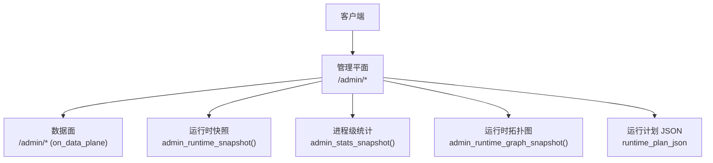
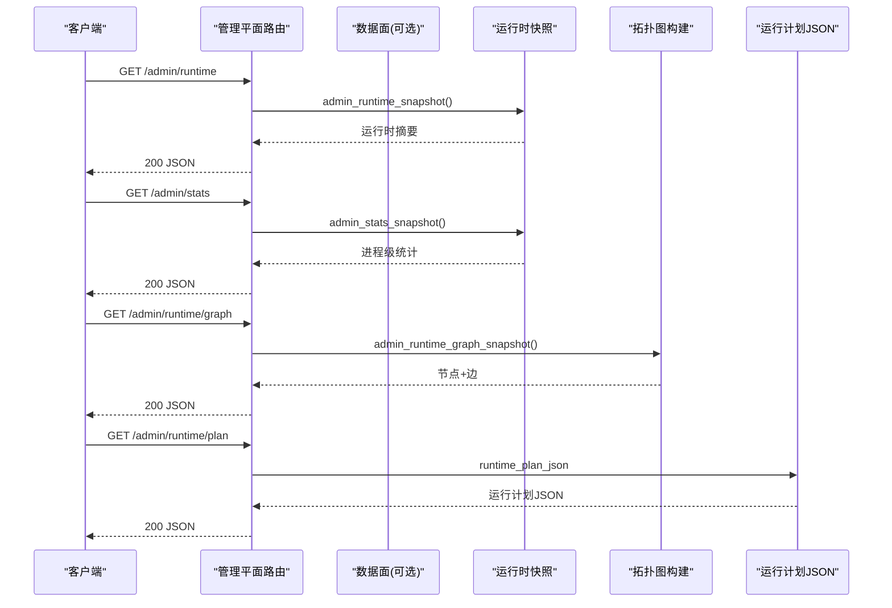
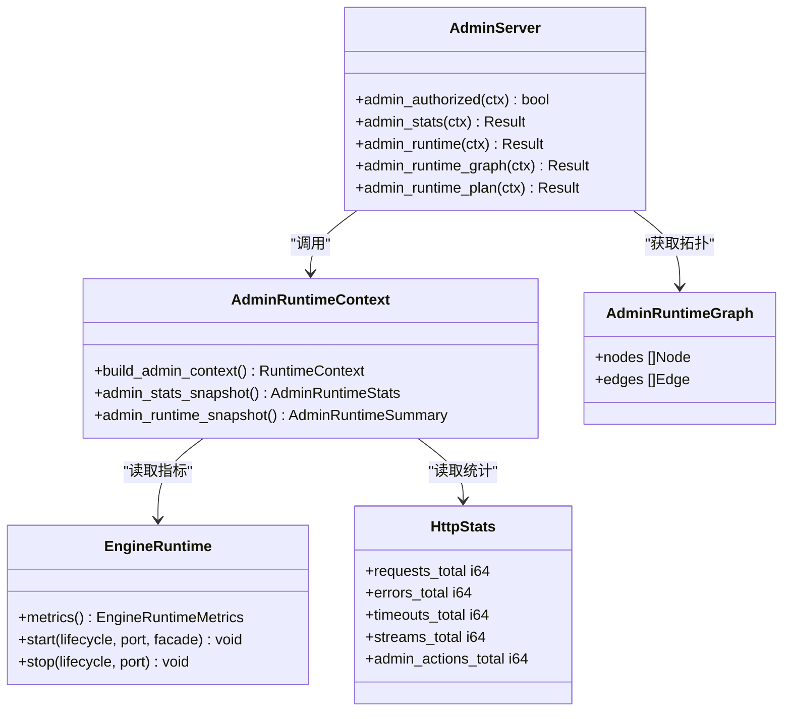

# 运行时状态 API

<cite>
**本文引用的文件**   
- [src/admin_server.v](file://src/admin_server.v)
- [src/admin_runtime.v](file://src/admin_runtime.v)
- [src/admin_runtime_graph.v](file://src/admin_runtime_graph.v)
- [src/admin_runtime_context.v](file://src/admin_runtime_context.v)
- [src/control_plane_startup_runtime.v](file://src/control_plane_startup_runtime.v)
- [src/engine_runtime.v](file://src/engine_runtime.v)
- [src/http_stats.v](file://src/http_stats.v)
- [README.md](file://README.md)
</cite>

## 目录
1. [简介](#简介)
2. [项目结构](#项目结构)
3. [核心组件](#核心组件)
4. [架构总览](#架构总览)
5. [详细端点参考](#详细端点参考)
6. [依赖关系分析](#依赖关系分析)
7. [性能与指标解读](#性能与指标解读)
8. [故障排查指南](#故障排查指南)
9. [结论](#结论)

## 简介
本文件为 vhttpd 的“运行时状态查询”管理平面 API 的完整参考文档，覆盖以下端点：
- GET /admin/runtime
- GET /admin/stats
- GET /admin/runtime/graph
- GET /admin/runtime/plan

内容包含请求参数、响应字段定义、数据结构说明、实际使用示例、监控指标解读与性能分析建议。所有信息均基于仓库源码实现进行整理。

## 项目结构
与管理平面相关的核心代码位于 src 目录下，其中：
- admin_server.v：注册并处理管理平面 HTTP 路由（包括 /admin/*），负责鉴权、统一响应封装与事件记录。
- admin_runtime.v：数据面侧的管理接口（当控制平面未启用时，部分能力回退到数据面）。
- admin_runtime_graph.v：构建运行时拓扑图（节点与边）的数据结构与生成逻辑。
- admin_runtime_context.v：将运行期统计与上下文聚合为统一的快照结构。
- control_plane_startup_runtime.v：启动管理平面服务并输出日志。
- engine_runtime.v：引擎生命周期与指标采集，供管理平面汇总。
- http_stats.v：HTTP 请求计数等基础指标。

图表来源
- [src/admin_server.v:131-197](file://src/admin_server.v#L131-L197)
- [src/admin_runtime.v:7-73](file://src/admin_runtime.v#L7-L73)
- [src/admin_runtime_graph.v:32-120](file://src/admin_runtime_graph.v#L32-L120)
- [src/admin_runtime_context.v:190-198](file://src/admin_runtime_context.v#L190-L198)

章节来源
- [src/admin_server.v:131-197](file://src/admin_server.v#L131-L197)
- [src/admin_runtime.v:7-73](file://src/admin_runtime.v#L7-L73)
- [src/admin_runtime_graph.v:32-120](file://src/admin_runtime_graph.v#L32-L120)
- [src/admin_runtime_context.v:190-198](file://src/admin_runtime_context.v#L190-L198)

## 核心组件
- 管理平面路由与鉴权：在管理平面中统一校验 token，返回 JSON 或文本响应，并记录事件元数据。
- 运行时快照：聚合 HTTP 统计、工作队列、WebSocket/MCP 会话、提供者能力等，形成结构化摘要。
- 运行计划：直接暴露当前生效的运行计划 JSON，便于外部工具解析与可视化。
- 运行时拓扑图：从运行计划构建节点与边，用于拓扑展示与变更影响分析。

章节来源
- [src/admin_server.v:101-115](file://src/admin_server.v#L101-L115)
- [src/admin_runtime_context.v:190-198](file://src/admin_runtime_context.v#L190-L198)
- [src/admin_runtime.v:22-35](file://src/admin_runtime.v#L22-L35)
- [src/admin_runtime_graph.v:32-120](file://src/admin_runtime_graph.v#L32-L120)

## 架构总览
管理平面与数据面的职责划分如下：
- 管理平面（Control Plane）：提供 /admin/* 接口，负责鉴权、统一响应格式、事件记录。
- 数据面（Data Plane）：当控制平面未启用时，部分 /admin/* 接口由数据面提供；否则由管理平面代理或直接调用内部快照方法。

图表来源
- [src/admin_server.v:131-197](file://src/admin_server.v#L131-L197)
- [src/admin_runtime.v:7-73](file://src/admin_runtime.v#L7-L73)
- [src/admin_runtime_graph.v:32-120](file://src/admin_runtime_graph.v#L32-L120)
- [src/admin_runtime_context.v:190-198](file://src/admin_runtime_context.v#L190-L198)

## 详细端点参考

### GET /admin/runtime
- 功能：返回运行时能力与活跃连接/会话计数等摘要。
- 鉴权：需要有效的管理令牌（通过请求头或查询参数传递）。
- 请求参数：无。
- 响应体：JSON，包含运行时摘要对象。该对象由运行时上下文聚合生成，涵盖 HTTP 统计、工作队列、WebSocket/MCP 会话、提供者能力等。
- 典型字段（来源于上下文聚合）：
  - started_at_unix：进程启动时间戳
  - http_requests_total：累计请求数
  - http_errors_total：累计错误数
  - http_timeouts_total：累计超时数
  - http_streams_total：累计流式连接数
  - worker_queue_waits_total：工作队列等待总数
  - worker_queue_rejected_total：工作队列拒绝总数
  - worker_queue_timeouts_total：工作队列超时总数
  - ws_hub_active_conns：活跃 WebSocket 连接数
  - mcp_active_sessions：活跃 MCP 会话数
  - provider_runtime_capabilities：已启用的提供者能力集合
  - 其他与工作池、调度模式等相关的指标
- 使用示例：
  - curl -H "x-vhttpd-admin-token: YOUR_TOKEN" http://127.0.0.1:PORT/admin/runtime

章节来源
- [src/admin_server.v:143-153](file://src/admin_server.v#L143-L153)
- [src/admin_runtime_context.v:190-198](file://src/admin_runtime_context.v#L190-L198)
- [src/admin_runtime_context.v:10-129](file://src/admin_runtime_context.v#L10-L129)

### GET /admin/stats
- 功能：返回进程级运行时计数器（如 HTTP 请求、错误、超时、流式连接等）。
- 鉴权：需要有效的管理令牌。
- 请求参数：无。
- 响应体：JSON，包含进程级统计对象。
- 典型字段（来源于 HTTP 统计与上下文聚合）：
  - requests_total、errors_total、timeouts_total、streams_total、admin_actions_total
  - 以及来自引擎的工作队列深度、容量、超时、后端模式等
- 使用示例：
  - curl -H "x-vhttpd-admin-token: YOUR_TOKEN" http://127.0.0.1:PORT/admin/stats

章节来源
- [src/admin_server.v:131-141](file://src/admin_server.v#L131-L141)
- [src/http_stats.v:4-31](file://src/http_stats.v#L4-L31)
- [src/admin_runtime_context.v:190-198](file://src/admin_runtime_context.v#L190-L198)

### GET /admin/runtime/graph
- 功能：返回运行时拓扑图，包含节点与边，用于可视化与变更影响分析。
- 鉴权：需要有效的管理令牌。
- 请求参数：无。
- 响应体：JSON，包含 nodes 与 edges 数组。
- 节点结构（AdminRuntimeGraphNode）：
  - id：唯一标识
  - ref：标准化引用（domain:id）
  - domain：域（如 listener、engine、adapter、pipeline 等）
  - label：显示标签
  - kind：类型（如 http、vjsx、relay-delivery 等）
  - group：分组（如 pipeline 组）
  - status：状态（如 configured）
  - metadata：附加键值对（如 transport、host、port、tls、capabilities 等）
- 边结构（AdminRuntimeEdge）：
  - id：边的唯一标识
  - from：起始节点引用
  - to：目标节点引用
  - kind：关系类型（如 adapter_uses_engine、ingress、egress 等）
  - metadata：附加键值对
- 使用示例：
  - curl -H "x-vhttpd-admin-token: YOUR_TOKEN" http://127.0.0.1:PORT/admin/runtime/graph

章节来源
- [src/admin_server.v:187-197](file://src/admin_server.v#L187-L197)
- [src/admin_runtime_graph.v:5-30](file://src/admin_runtime_graph.v#L5-L30)
- [src/admin_runtime_graph.v:32-120](file://src/admin_runtime_graph.v#L32-L120)

### GET /admin/runtime/plan
- 功能：返回当前生效的运行计划 JSON，便于外部系统解析与比对。
- 鉴权：需要有效的管理令牌。
- 请求参数：无。
- 响应体：JSON，即运行计划的序列化结果。
- 使用示例：
  - curl -H "x-vhttpd-admin-token: YOUR_TOKEN" http://127.0.0.1:PORT/admin/runtime/plan

章节来源
- [src/admin_server.v:155-165](file://src/admin_server.v#L155-L165)
- [src/admin_runtime.v:22-35](file://src/admin_runtime.v#L22-L35)

## 依赖关系分析
- 管理平面路由依赖：
  - 鉴权：admin.AdminAuth.authorized
  - 响应封装：admin_plane_json_response / admin_plane_text_response
  - 事件记录：HttpResponseRuntime.delivery_outcome
- 运行时快照依赖：
  - 上下文聚合：build_admin_context
  - 引擎指标：EngineRuntime.metrics
  - HTTP 统计：HttpStats
- 拓扑图构建依赖：
  - 运行计划：app.plan
  - 节点/边构造：AdminRuntimeGraphBuilder

图表来源
- [src/admin_server.v:101-115](file://src/admin_server.v#L101-L115)
- [src/admin_runtime_context.v:190-198](file://src/admin_runtime_context.v#L190-L198)
- [src/engine_runtime.v:234-249](file://src/engine_runtime.v#L234-L249)
- [src/http_stats.v:4-31](file://src/http_stats.v#L4-L31)
- [src/admin_runtime_graph.v:26-30](file://src/admin_runtime_graph.v#L26-L30)

章节来源
- [src/admin_server.v:101-115](file://src/admin_server.v#L101-L115)
- [src/admin_runtime_context.v:190-198](file://src/admin_runtime_context.v#L190-L198)
- [src/engine_runtime.v:234-249](file://src/engine_runtime.v#L234-L249)
- [src/http_stats.v:4-31](file://src/http_stats.v#L4-L31)
- [src/admin_runtime_graph.v:26-30](file://src/admin_runtime_graph.v#L26-L30)

## 性能与指标解读
- HTTP 统计
  - requests_total：累计请求数，反映整体负载趋势。
  - errors_total：累计错误数，结合请求总量可计算错误率。
  - timeouts_total：累计超时数，关注网络或上游处理延迟。
  - streams_total：累计流式连接数，评估长连接与流式处理能力。
  - admin_actions_total：管理操作次数，用于审计与异常检测。
- 工作队列与引擎
  - queue_depth：当前排队请求数，过高可能意味着处理能力不足。
  - queue_capacity：队列容量上限，接近上限需扩容或优化。
  - queue_timeout_ms：队列超时阈值，调整以平衡吞吐与时延。
  - backend_mode：后端模式（如 socket、embedded），不同模式性能特征不同。
  - pool_size：工作池大小，结合 queue_depth 判断是否需要扩缩容。
- WebSocket/MCP
  - ws_hub_active_conns：活跃 WebSocket 连接数，观察实时交互负载。
  - mcp_active_sessions：活跃 MCP 会话数，评估协议层压力。
- 提供者能力
  - provider_runtime_capabilities：已启用的提供者能力集合，用于确认功能开关与兼容性。

章节来源
- [src/http_stats.v:4-31](file://src/http_stats.v#L4-L31)
- [src/engine_runtime.v:234-249](file://src/engine_runtime.v#L234-L249)
- [src/admin_runtime_context.v:10-129](file://src/admin_runtime_context.v#L10-L129)

## 故障排查指南
- 鉴权失败
  - 现象：返回 403 Forbidden。
  - 原因：缺少或错误的管理令牌。
  - 处理：检查请求头 x-vhttpd-admin-token 或查询参数是否正确配置。
- 管理平面未启用
  - 现象：部分 /admin/* 返回 404 Not Found。
  - 原因：控制平面未启用，相关能力仅在数据面可用。
  - 处理：确认控制平面已启用并在正确端口监听。
- 运行计划不可用
  - 现象：/admin/runtime/plan 返回空或错误。
  - 原因：运行计划加载失败或未初始化。
  - 处理：检查配置文件与运行计划语法，确保加载成功。
- 拓扑图不完整
  - 现象：节点或边缺失。
  - 原因：运行计划中某些资源未配置或引用无效。
  - 处理：核对运行计划中的引用关系，确保 domain:id 格式正确。

章节来源
- [src/admin_server.v:93-115](file://src/admin_server.v#L93-L115)
- [src/admin_runtime.v:7-35](file://src/admin_runtime.v#L7-L35)
- [src/admin_runtime_graph.v:196-203](file://src/admin_runtime_graph.v#L196-L203)

## 结论
本文档整理了 vhttpd 管理平面的运行时状态查询 API，包括 /admin/runtime、/admin/stats、/admin/runtime/graph、/admin/runtime/plan 的功能、请求参数、响应结构与使用示例。通过对运行时快照、进程级统计、拓扑图与运行计划的分析，用户可全面掌握系统运行状况并进行性能调优与故障定位。