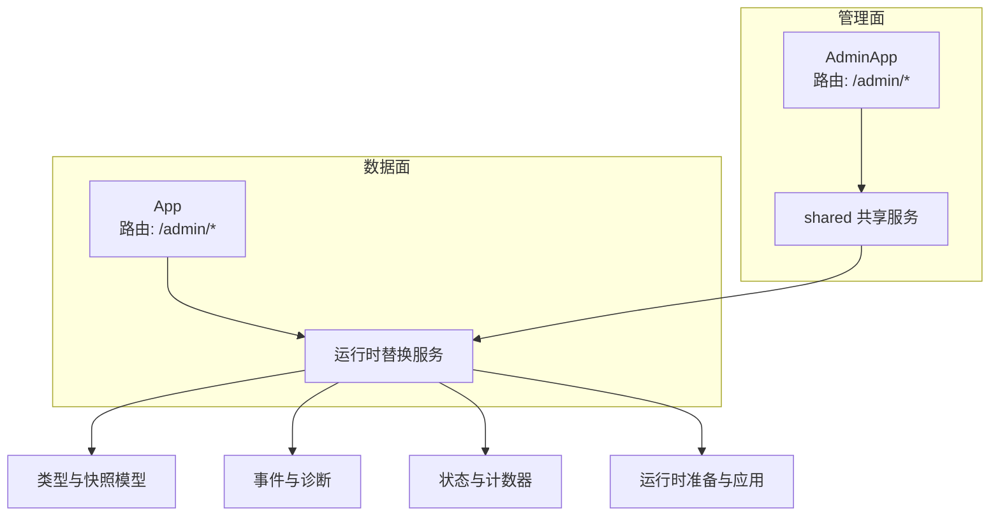
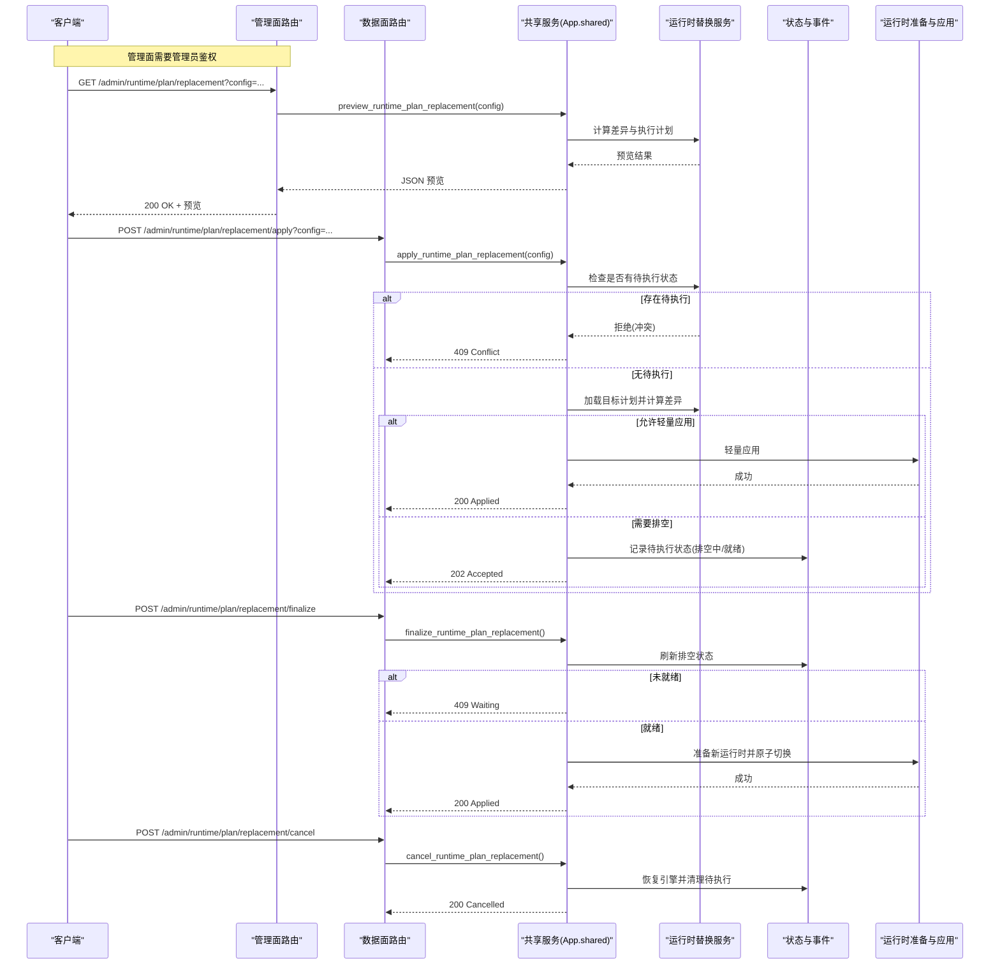
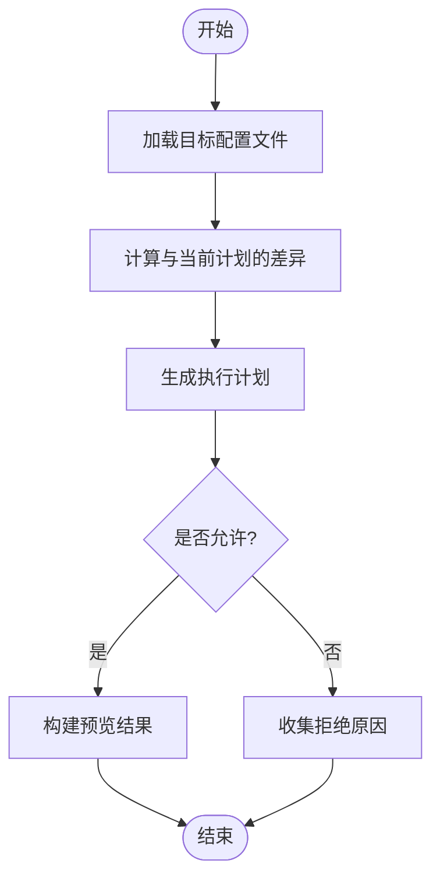
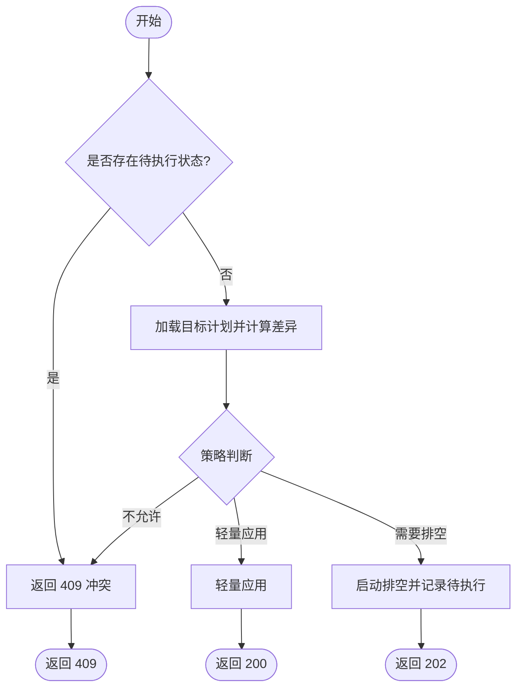
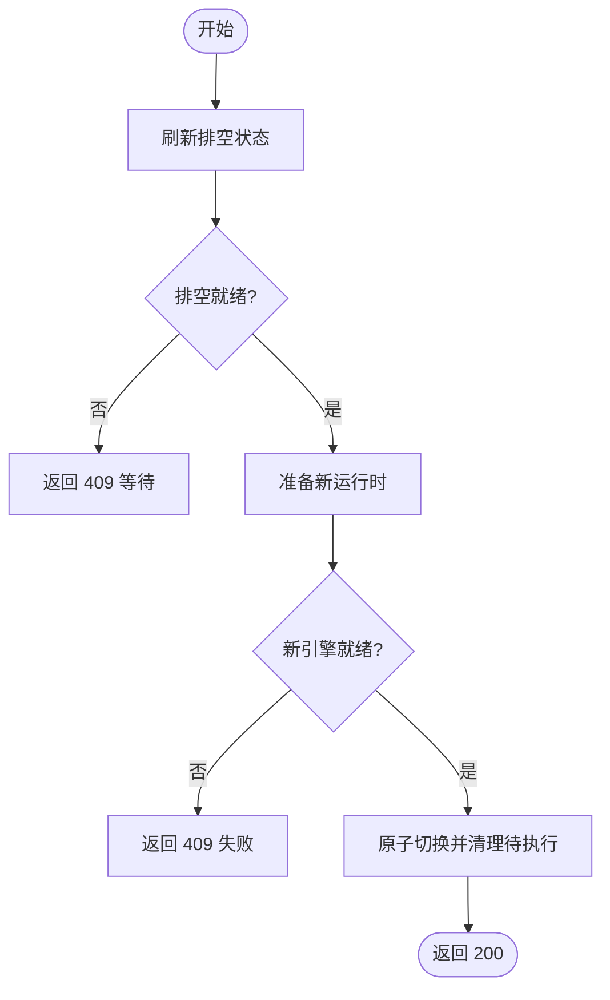
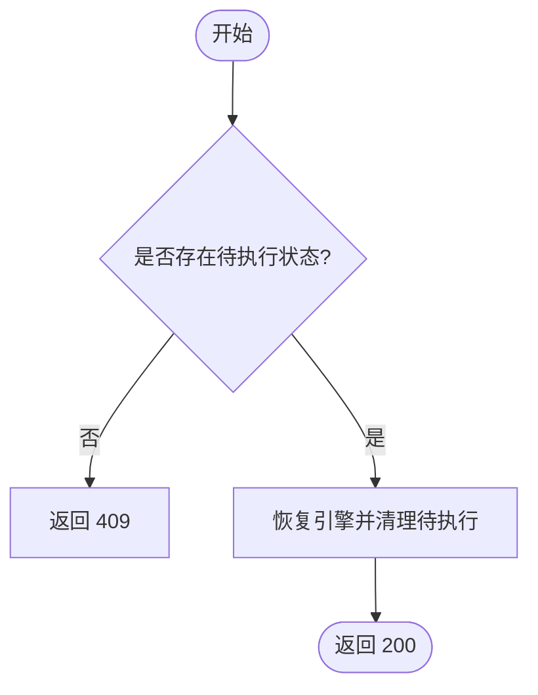
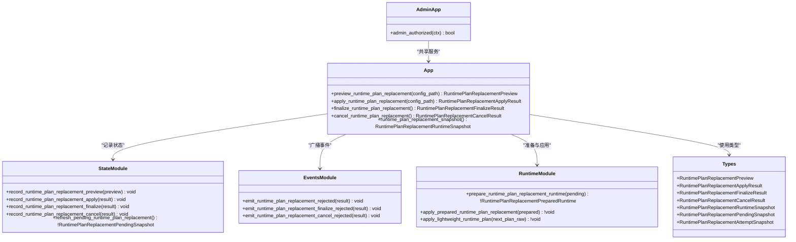

# 运行计划管理 API

<cite>
**本文引用的文件**   
- [admin_runtime.v](file://src/admin_runtime.v)
- [admin_server.v](file://src/admin_server.v)
- [admin_runtime_plan_replacement_preview.v](file://src/admin_runtime_plan_replacement_preview.v)
- [admin_runtime_plan_replacement_apply.v](file://src/admin_runtime_plan_replacement_apply.v)
- [admin_runtime_plan_replacement_finalize.v](file://src/admin_runtime_plan_replacement_finalize.v)
- [admin_runtime_plan_replacement_cancel.v](file://src/admin_runtime_plan_replacement_cancel.v)
- [admin_runtime_plan_replacement_state.v](file://src/admin_runtime_plan_replacement_state.v)
- [admin_runtime_plan_replacement_events.v](file://src/admin_runtime_plan_replacement_events.v)
- [admin_runtime_plan_replacement_runtime.v](file://src/admin_runtime_plan_replacement_runtime.v)
- [admin_runtime_plan_replacement_types.v](file://src/admin_runtime_plan_replacement_types.v)
</cite>

## 目录
1. [简介](#简介)
2. [项目结构](#项目结构)
3. [核心组件](#核心组件)
4. [架构总览](#架构总览)
5. [详细组件分析](#详细组件分析)
6. [依赖关系分析](#依赖关系分析)
7. [性能与扩展性](#性能与扩展性)
8. [故障排查指南](#故障排查指南)
9. [生产部署安全策略与最佳实践](#生产部署安全策略与最佳实践)
10. [结论](#结论)

## 简介
本文件面向运维与平台工程师，系统化说明 vhttpd 的“运行计划替换”能力及其对外暴露的管理 API。重点覆盖以下路径：
- GET /admin/runtime/plan/replacement
- GET /admin/runtime/plan/replacement/state
- POST /admin/runtime/plan/replacement/apply
- POST /admin/runtime/plan/replacement/finalize
- POST /admin/runtime/plan/replacement/cancel

文档将解释预览、应用、确认（最终化）、取消等操作的语义、状态机流转、版本控制机制、回滚策略、冲突检测与处理、批量操作建议，以及生产环境的安全策略与最佳实践。

## 项目结构
围绕运行计划替换的核心代码分布在 admin 层与运行时替换逻辑中：
- 路由与鉴权：在数据面与管理面分别注册相同语义的接口
- 业务编排：预览、应用、最终化、取消的具体流程实现
- 状态与事件：持久化的尝试快照、待执行状态、统计计数与事件广播
- 类型定义：统一的请求/响应结构与内部快照模型

图表来源
- [admin_server.v:470-557](file://src/admin_server.v#L470-L557)
- [admin_runtime.v:359-461](file://src/admin_runtime.v#L359-L461)
- [admin_runtime_plan_replacement_types.v:1-131](file://src/admin_runtime_plan_replacement_types.v#L1-L131)
- [admin_runtime_plan_replacement_events.v:1-54](file://src/admin_runtime_plan_replacement_events.v#L1-L54)
- [admin_runtime_plan_replacement_state.v:1-272](file://src/admin_runtime_plan_replacement_state.v#L1-L272)
- [admin_runtime_plan_replacement_runtime.v:1-110](file://src/admin_runtime_plan_replacement_runtime.v#L1-L110)

章节来源
- [admin_server.v:470-557](file://src/admin_server.v#L470-L557)
- [admin_runtime.v:359-461](file://src/admin_runtime.v#L359-L461)

## 核心组件
- 路由与鉴权
  - 数据面：在 App 上注册 /admin/runtime/plan/replacement* 系列接口
  - 管理面：在 AdminApp 上注册同名接口，并增加管理员鉴权
- 业务编排
  - 预览：计算当前计划与目标计划的差异，生成可执行的替换动作与影响范围
  - 应用：根据策略决定是否直接轻量应用或进入排空阶段；若需排空则记录待执行状态
  - 最终化：校验排空完成、准备新运行时并原子切换
  - 取消：恢复已排空的引擎，清理待执行状态
- 状态与事件
  - 维护最近一次尝试快照、累计计数、待执行状态（含排空进度）
  - 关键生命周期事件广播，便于外部系统观测与自动化编排
- 类型与快照
  - 统一的数据结构描述预览结果、应用结果、最终化结果、取消结果与运行时快照

章节来源
- [admin_runtime_plan_replacement_preview.v:1-53](file://src/admin_runtime_plan_replacement_preview.v#L1-L53)
- [admin_runtime_plan_replacement_apply.v:1-133](file://src/admin_runtime_plan_replacement_apply.v#L1-L133)
- [admin_runtime_plan_replacement_finalize.v:1-91](file://src/admin_runtime_plan_replacement_finalize.v#L1-L91)
- [admin_runtime_plan_replacement_cancel.v:1-62](file://src/admin_runtime_plan_replacement_cancel.v#L1-L62)
- [admin_runtime_plan_replacement_state.v:1-272](file://src/admin_runtime_plan_replacement_state.v#L1-L272)
- [admin_runtime_plan_replacement_events.v:1-54](file://src/admin_runtime_plan_replacement_events.v#L1-L54)
- [admin_runtime_plan_replacement_types.v:1-131](file://src/admin_runtime_plan_replacement_types.v#L1-L131)

## 架构总览
下图展示了从 HTTP 请求到运行时替换的完整调用链，包括鉴权、预览/应用/最终化/取消的业务分支与状态更新。

图表来源
- [admin_server.v:470-557](file://src/admin_server.v#L470-L557)
- [admin_runtime.v:359-461](file://src/admin_runtime.v#L359-L461)
- [admin_runtime_plan_replacement_preview.v:1-53](file://src/admin_runtime_plan_replacement_preview.v#L1-L53)
- [admin_runtime_plan_replacement_apply.v:1-133](file://src/admin_runtime_plan_replacement_apply.v#L1-L133)
- [admin_runtime_plan_replacement_finalize.v:1-91](file://src/admin_runtime_plan_replacement_finalize.v#L1-L91)
- [admin_runtime_plan_replacement_cancel.v:1-62](file://src/admin_runtime_plan_replacement_cancel.v#L1-L62)
- [admin_runtime_plan_replacement_state.v:1-272](file://src/admin_runtime_plan_replacement_state.v#L1-L272)
- [admin_runtime_plan_replacement_runtime.v:1-110](file://src/admin_runtime_plan_replacement_runtime.v#L1-L110)

## 详细组件分析

### 接口清单与行为
- GET /admin/runtime/plan/replacement
  - 作用：预览指定配置文件的运行计划替换影响
  - 参数：query.config 或 query.path（二选一）
  - 返回：预览对象，包含是否允许、策略、动作列表、受影响流水线、监听器重启、引擎排空、组件重载、诊断原因、当前与下一 schema 版本等
  - 错误：缺少配置文件时返回 400
- GET /admin/runtime/plan/replacement/state
  - 作用：获取替换相关的全局状态与最近尝试快照
  - 返回：统计计数、待执行状态、最近一次预览/应用/最终化/取消的快照
- POST /admin/runtime/plan/replacement/apply
  - 作用：尝试应用指定配置的运行计划替换
  - 行为：
    - 若存在待执行状态，返回 409 冲突
    - 若允许轻量应用，直接应用并返回 200
    - 若需要排空，启动排空并返回 202，同时写入待执行状态
    - 其他不允许的情况返回 409，并附带错误信息
- POST /admin/runtime/plan/replacement/finalize
  - 作用：在排空完成后最终化替换
  - 行为：
    - 若无待执行状态，返回 409
    - 若排空未完成，返回 409 等待
    - 否则准备新运行时并原子切换，返回 200
- POST /admin/runtime/plan/replacement/cancel
  - 作用：取消正在进行的排空流程
  - 行为：恢复已排空的引擎，清理待执行状态，返回 200；若无待执行状态返回 409

章节来源
- [admin_runtime.v:359-461](file://src/admin_runtime.v#L359-L461)
- [admin_server.v:470-557](file://src/admin_server.v#L470-L557)

### 预览流程与结果解析
- 读取目标配置文件，编译为运行时计划
- 与当前运行计划进行差异比较，生成执行计划
- 输出预览结果，包含：
  - allowed：是否允许替换
  - strategy：替换策略（如轻量应用、需要排空）
  - actions：具体替换动作列表
  - changed_pipelines/unchanged_pipelines：受影响的流水线集合
  - restart_listeners/drain_engines：需要重启的监听器与需要排空的引擎
  - reload_transforms/reload_providers/reload_relays：需要重载的组件
  - reasons：不允许时的原因
  - current_schema_version/next_schema_version：版本演进信息

图表来源
- [admin_runtime_plan_replacement_preview.v:1-53](file://src/admin_runtime_plan_replacement_preview.v#L1-L53)

章节来源
- [admin_runtime_plan_replacement_preview.v:1-53](file://src/admin_runtime_plan_replacement_preview.v#L1-L53)

### 应用流程与冲突检测
- 冲突检测：若存在待执行状态，立即拒绝并返回 409
- 策略分支：
  - 轻量应用：直接应用变更，返回 200
  - 需要排空：对每个需要排空的引擎执行排空，记录待执行状态，返回 202
  - 其他不允许：返回 409，附带错误信息
- 事件与审计：每次应用都会记录尝试快照与统计计数，并广播相应事件

图表来源
- [admin_runtime_plan_replacement_apply.v:1-133](file://src/admin_runtime_plan_replacement_apply.v#L1-L133)
- [admin_runtime_plan_replacement_state.v:1-272](file://src/admin_runtime_plan_replacement_state.v#L1-L272)

章节来源
- [admin_runtime_plan_replacement_apply.v:1-133](file://src/admin_runtime_plan_replacement_apply.v#L1-L133)
- [admin_runtime_plan_replacement_state.v:1-272](file://src/admin_runtime_plan_replacement_state.v#L1-L272)

### 最终化流程与原子切换
- 刷新待执行状态的排空进度
- 若未完成排空，返回 409 等待
- 准备新的运行时（校验配置哈希、重新构建引擎与路由），验证新引擎就绪后原子切换
- 成功后清理待执行状态并广播事件

图表来源
- [admin_runtime_plan_replacement_finalize.v:1-91](file://src/admin_runtime_plan_replacement_finalize.v#L1-L91)
- [admin_runtime_plan_replacement_runtime.v:1-110](file://src/admin_runtime_plan_replacement_runtime.v#L1-L110)

章节来源
- [admin_runtime_plan_replacement_finalize.v:1-91](file://src/admin_runtime_plan_replacement_finalize.v#L1-L91)
- [admin_runtime_plan_replacement_runtime.v:1-110](file://src/admin_runtime_plan_replacement_runtime.v#L1-L110)

### 取消流程与回滚策略
- 取消仅适用于处于排空中的待执行状态
- 恢复已排空的引擎，清理待执行状态，返回 200
- 若无待执行状态，返回 409
- 回滚策略：
  - 轻量应用：通过再次应用旧计划或回退配置实现
  - 排空+最终化：在最终化前可通过取消恢复；最终化后需通过应用旧计划回滚

图表来源
- [admin_runtime_plan_replacement_cancel.v:1-62](file://src/admin_runtime_plan_replacement_cancel.v#L1-L62)
- [admin_runtime_plan_replacement_state.v:1-272](file://src/admin_runtime_plan_replacement_state.v#L1-L272)

章节来源
- [admin_runtime_plan_replacement_cancel.v:1-62](file://src/admin_runtime_plan_replacement_cancel.v#L1-L62)
- [admin_runtime_plan_replacement_state.v:1-272](file://src/admin_runtime_plan_replacement_state.v#L1-L272)

### 状态管理与事件
- 状态快照
  - 最近一次尝试快照：包含时间戳、操作类型、状态、策略、是否允许、是否已应用、错误信息、动作列表、排空状态、受影响流水线、组件重载列表、原因等
  - 待执行状态：包含活跃标志、配置文件路径与哈希、策略、就绪标志、创建/更新时间、排空状态、受影响流水线、下一个 schema 版本等
  - 全局统计：预览/应用/最终化/取消次数、已应用/已最终化/已取消/排空中/被拒绝次数
- 事件广播
  - 应用被拒绝、最终化被拒绝、取消被拒绝、排空进行中、最终化等待、替换完成等事件，便于外部系统监控与自动化编排

章节来源
- [admin_runtime_plan_replacement_types.v:1-131](file://src/admin_runtime_plan_replacement_types.v#L1-L131)
- [admin_runtime_plan_replacement_state.v:1-272](file://src/admin_runtime_plan_replacement_state.v#L1-L272)
- [admin_runtime_plan_replacement_events.v:1-54](file://src/admin_runtime_plan_replacement_events.v#L1-L54)

### 版本控制机制
- 配置文件哈希：在最终化前校验配置文件哈希是否与待执行状态一致，防止并发修改导致不一致
- Schema 版本：预览结果中包含当前与下一个 schema 版本，用于评估兼容性
- 轻量应用与排空策略：由差异比较与执行计划决定，确保最小变更与可控影响

章节来源
- [admin_runtime_plan_replacement_runtime.v:1-110](file://src/admin_runtime_plan_replacement_runtime.v#L1-L110)
- [admin_runtime_plan_replacement_preview.v:1-53](file://src/admin_runtime_plan_replacement_preview.v#L1-L53)

### 批量操作方法
- 单实例多配置：通过循环调用 apply/finalize/cancel 接口，结合 state 查询轮询排空进度
- 多实例集群：
  - 使用配置中心或编排工具并行触发各实例的 apply
  - 基于 state 聚合各实例的排空进度，达到阈值后再触发 finalize
  - 失败重试与幂等：对 apply/finalize/cancel 设计幂等键（如 config_hash），避免重复提交造成副作用
- 灰度发布：按分组逐步推进，先小流量实例，再全量

[本节为概念性指导，不直接分析具体文件]

## 依赖关系分析
- 路由层依赖业务编排层
- 业务编排层依赖状态与事件模块
- 业务编排层依赖运行时准备与应用模块
- 类型模块贯穿所有层，提供统一数据结构

图表来源
- [admin_runtime.v:359-461](file://src/admin_runtime.v#L359-L461)
- [admin_server.v:470-557](file://src/admin_server.v#L470-L557)
- [admin_runtime_plan_replacement_state.v:1-272](file://src/admin_runtime_plan_replacement_state.v#L1-L272)
- [admin_runtime_plan_replacement_events.v:1-54](file://src/admin_runtime_plan_replacement_events.v#L1-L54)
- [admin_runtime_plan_replacement_runtime.v:1-110](file://src/admin_runtime_plan_replacement_runtime.v#L1-L110)
- [admin_runtime_plan_replacement_types.v:1-131](file://src/admin_runtime_plan_replacement_types.v#L1-L131)

章节来源
- [admin_runtime_plan_replacement_types.v:1-131](file://src/admin_runtime_plan_replacement_types.v#L1-L131)

## 性能与扩展性
- 轻量应用路径避免重启与排空，适合热更新场景，延迟低
- 排空路径会阻塞直至引擎就绪，建议在大规模集群中采用分批与灰度策略
- 状态刷新与排空状态轮询应设置合理间隔，避免高频请求造成压力
- 事件广播可用于异步编排，降低同步链路复杂度

[本节为通用指导，不直接分析具体文件]

## 故障排查指南
- 常见错误码
  - 400：请求参数错误或内部异常（例如缺少配置文件）
  - 409：冲突或条件不满足（例如存在待执行状态、排空未完成、无待执行状态）
  - 202：接受但尚未完成（排空进行中）
  - 200：成功
- 定位步骤
  - 查看 state 接口返回的最近尝试快照与待执行状态
  - 关注事件流中的 rejected/waiting/applied 等事件
  - 检查预览结果中的 reasons 与 affected pipelines
  - 核对配置文件哈希是否变化（最终化前会校验）
- 典型问题
  - 无法应用：检查 allowed 与 strategy，必要时调整配置或等待排空
  - 排空卡住：检查引擎 worker 状态与 inflight_requests
  - 最终化失败：检查新引擎就绪性与诊断信息

章节来源
- [admin_runtime_plan_replacement_state.v:1-272](file://src/admin_runtime_plan_replacement_state.v#L1-L272)
- [admin_runtime_plan_replacement_events.v:1-54](file://src/admin_runtime_plan_replacement_events.v#L1-L54)

## 生产部署安全策略与最佳实践
- 访问控制
  - 管理面接口必须启用管理员鉴权，限制来源 IP 白名单
  - 数据面接口仅在必要场景开启，并通过网关或代理进行认证与限流
- 配置安全
  - 配置文件存储于受控目录，权限最小化
  - 使用配置中心或密钥管理服务注入敏感信息
- 变更治理
  - 强制预览与审批流程，保留变更记录与审计日志
  - 灰度发布与回滚预案，确保快速恢复
- 监控与告警
  - 订阅替换事件，建立告警规则（拒绝、等待、失败）
  - 定期采集 state 快照，形成趋势报表
- 幂等与一致性
  - 引入幂等键（如 config_hash），避免重复提交
  - 在多实例环境中协调 apply/finalize 的顺序与时机

[本节为通用指导，不直接分析具体文件]

## 结论
运行计划替换 API 提供了从预览到最终化的完整生命周期管理能力，支持轻量应用与排空两种策略，具备完善的冲突检测、状态追踪与事件通知机制。通过合理的批量编排与安全策略，可在生产环境中实现稳定、可控、可观测的配置变更与运行时升级。