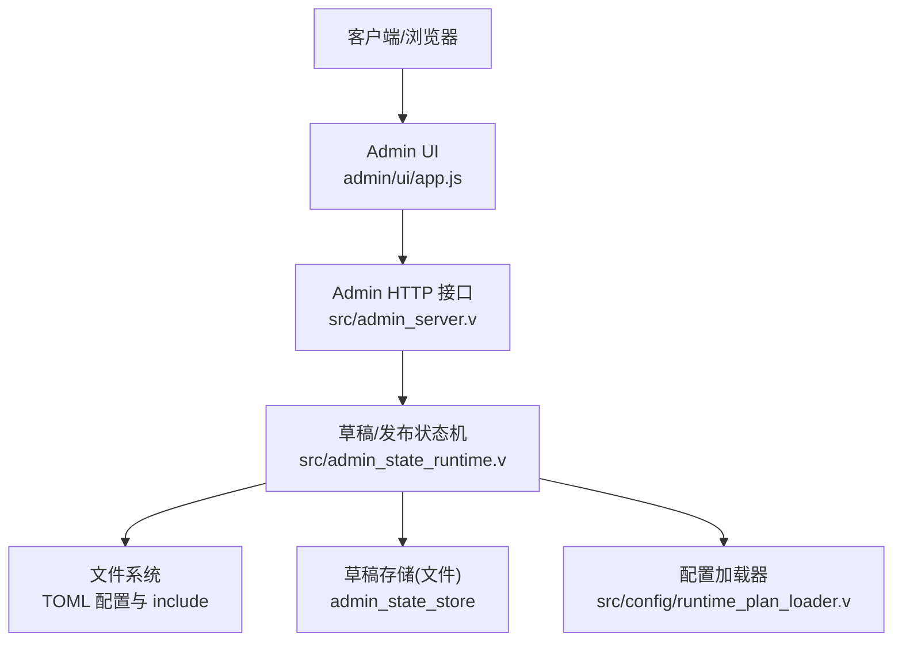
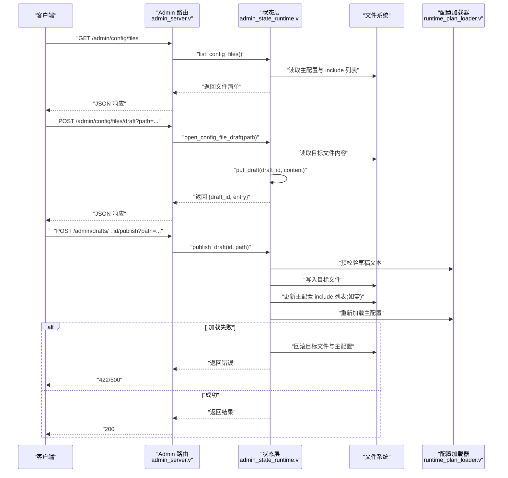
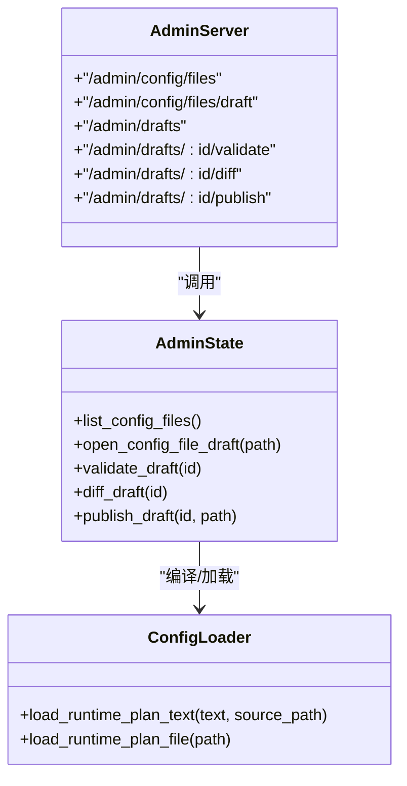

# 配置管理 API

<cite>
**本文引用的文件**
- [src/admin_server.v](file://src/admin_server.v)
- [src/admin_state_runtime.v](file://src/admin_state_runtime.v)
- [src/admin/types.v](file://src/admin/types.v)
- [admin/ui/app.js](file://admin/ui/app.js)
- [src/config/runtime_plan_loader.v](file://src/config/runtime_plan_loader.v)
- [admin/admin.toml](file://admin/admin.toml)
</cite>

## 目录
1. [简介](#简介)
2. [项目结构](#项目结构)
3. [核心组件](#核心组件)
4. [架构总览](#架构总览)
5. [详细组件分析](#详细组件分析)
6. [依赖关系分析](#依赖关系分析)
7. [性能考虑](#性能考虑)
8. [故障排查指南](#故障排查指南)
9. [结论](#结论)
10. [附录：API 参考与最佳实践](#附录api-参考与最佳实践)

## 简介
本文件为 vhttpd 的“配置管理 API”完整参考文档，聚焦于配置文件（TOML）的在线编辑、草稿管理与发布流程。覆盖以下能力：
- 配置文件列表查询：/admin/config/files
- 打开配置文件草稿：/admin/config/files/draft
- 通用草稿 CRUD：/admin/drafts
- 草稿校验与差异预览：/admin/drafts/:id/validate、/admin/drafts/:id/diff
- 配置发布：/admin/drafts/:id/publish
- 版本管理与回滚：通过事件日志与主配置 include 机制实现

该 API 面向管理员或自动化系统，用于在不重启服务的前提下安全地编辑、验证并发布运行时计划（Runtime Plan）相关的 TOML 配置片段。

## 项目结构
与配置管理 API 直接相关的代码主要分布在如下模块：
- 路由与鉴权：src/admin_server.v
- 状态与草稿/发布逻辑：src/admin_state_runtime.v
- 通用类型与鉴权辅助：src/admin/types.v
- 前端调用示例：admin/ui/app.js
- 配置加载与 include 解析：src/config/runtime_plan_loader.v
- 示例主配置：admin/admin.toml

图表来源
- [src/admin_server.v:307-334](file://src/admin_server.v#L307-L334)
- [src/admin_state_runtime.v:209-286](file://src/admin_state_runtime.v#L209-L286)
- [admin/ui/app.js:1-10](file://admin/ui/app.js#L1-L10)
- [src/config/runtime_plan_loader.v:86-106](file://src/config/runtime_plan_loader.v#L86-L106)

章节来源
- [src/admin_server.v:307-334](file://src/admin_server.v#L307-L334)
- [src/admin_state_runtime.v:209-286](file://src/admin_state_runtime.v#L209-L286)
- [admin/ui/app.js:1-10](file://admin/ui/app.js#L1-L10)
- [src/config/runtime_plan_loader.v:86-106](file://src/config/runtime_plan_loader.v#L86-L106)

## 核心组件
- 认证与鉴权
  - 所有 /admin/* 接口均要求携带 admin token，支持从请求头 x-vhttpd-admin-token 或查询参数 admin_token 传入。未提供或错误将返回 403。
- 配置清单接口
  - GET /admin/config/files：列出当前主配置及被 include 的所有子配置，包含路径、大小、是否存在、对应草稿 ID。
- 草稿创建接口
  - POST /admin/config/files/draft?path=... 或 include_path=...：根据目标路径读取现有内容并创建/复用草稿，返回 draft_id 与元信息。
- 通用草稿管理
  - GET/POST/PUT/DELETE /admin/drafts/:id：获取、保存、更新、删除草稿；GET /admin/drafts 列出全部草稿。
- 草稿校验与差异
  - POST /admin/drafts/:id/validate：编译并校验草稿，返回 schema_version、计数与诊断信息。
  - GET /admin/drafts/:id/diff：对比当前运行计划与草稿的差异预览，返回 allowed 与策略。
- 配置发布
  - POST /admin/drafts/:id/publish?path=...：将草稿写入目标 TOML 文件，并在主配置中按需添加 include 项；失败时自动回滚已写文件。

章节来源
- [src/admin/types.v:130-139](file://src/admin/types.v#L130-L139)
- [src/admin_server.v:307-334](file://src/admin_server.v#L307-L334)
- [src/admin_server.v:288-305](file://src/admin_server.v#L288-L305)
- [src/admin_server.v:405-468](file://src/admin_server.v#L405-L468)
- [src/admin_server.v:930-967](file://src/admin_server.v#L930-L967)
- [src/admin_state_runtime.v:445-569](file://src/admin_state_runtime.v#L445-L569)

## 架构总览
配置管理 API 的请求处理链路如下：
- 客户端发起请求到 /admin/* 路由
- 路由层进行鉴权与请求包装
- 调用状态层完成草稿读写、校验、差异计算与发布
- 发布阶段对目标文件落盘，必要时修改主配置的 include 列表
- 失败路径触发原子性回滚，保证主配置始终可加载

图表来源
- [src/admin_server.v:307-334](file://src/admin_server.v#L307-L334)
- [src/admin_state_runtime.v:209-286](file://src/admin_state_runtime.v#L209-L286)
- [src/admin_state_runtime.v:445-569](file://src/admin_state_runtime.v#L445-L569)
- [src/config/runtime_plan_loader.v:86-106](file://src/config/runtime_plan_loader.v#L86-L106)

## 详细组件分析

### 配置文件列表：GET /admin/config/files
- 功能
  - 返回当前主配置与所有 include 的子配置清单，包含角色（main/include）、绝对路径、相对 include 路径、是否存在、字节数、对应草稿 ID。
- 行为细节
  - 主配置路径由运行时源配置决定，默认位于工作目录下的 admin-draft.toml。
  - 通过扫描主配置中的 include = [...] 列表解析子配置路径，支持绝对与相对路径。
- 典型用途
  - 前端展示“配置树”，点击某文件后进入草稿编辑。

章节来源
- [src/admin_server.v:307-317](file://src/admin_server.v#L307-L317)
- [src/admin_state_runtime.v:209-240](file://src/admin_state_runtime.v#L209-L240)

### 打开配置文件草稿：POST /admin/config/files/draft
- 功能
  - 根据 path 或 include_path 定位目标 TOML 文件，读取其内容并创建/复用草稿，返回 draft_id 与 entry。
- 参数
  - query.path 或 query.include_path：目标文件的绝对路径或相对于主配置目录的相对路径。
- 返回
  - ok、error、draft_id、path、include_path、entry（包含 value）。
- 错误码
  - 200 成功；422 参数缺失或路径不在项目范围内等。

章节来源
- [src/admin_server.v:319-334](file://src/admin_server.v#L319-L334)
- [src/admin_state_runtime.v:242-286](file://src/admin_state_runtime.v#L242-L286)

### 草稿管理：/admin/drafts
- 列出草稿
  - GET /admin/drafts：列出所有草稿条目。
- 获取/保存/更新/删除
  - GET /admin/drafts/:id：获取指定草稿。
  - POST /admin/drafts：创建新草稿（若 id 为空则自动生成），body 为纯文本。
  - PUT /admin/drafts/:id：更新指定草稿。
  - DELETE /admin/drafts/:id：删除指定草稿。
- 元数据
  - 每个草稿关联元数据（source_path、include_path），用于后续发布定位目标文件。

章节来源
- [src/admin_server.v:288-305](file://src/admin_server.v#L288-L305)
- [src/admin_server.v:405-468](file://src/admin_server.v#L405-L468)
- [src/admin_state_runtime.v:124-169](file://src/admin_state_runtime.v#L124-L169)

### 草稿校验：POST /admin/drafts/:id/validate
- 功能
  - 将草稿文本按运行时计划模型编译并校验，返回 schema_version、各资源计数与诊断信息。
- 返回
  - ok、error、schema_version、counts、diagnostics。
- 状态码
  - 200 校验通过；422 存在语法或语义错误。

章节来源
- [src/admin_server.v:930-944](file://src/admin_server.v#L930-L944)
- [src/admin_state_runtime.v:176-202](file://src/admin_state_runtime.v#L176-L202)

### 差异预览：GET /admin/drafts/:id/diff
- 功能
  - 基于草稿生成运行时计划，并与当前运行计划比较，输出变更预览与策略。
- 返回
  - allowed、strategy、变更详情等。
- 状态码
  - 200 成功；422 草稿不可用或无法计算差异。

章节来源
- [src/admin_server.v:946-967](file://src/admin_server.v#L946-L967)
- [src/admin_state_runtime.v:204-207](file://src/admin_state_runtime.v#L204-L207)

### 配置发布：POST /admin/drafts/:id/publish
- 功能
  - 将草稿写入目标 TOML 文件，并在主配置中添加 include 项（如尚未包含），随后重新加载主配置以生效。
- 参数
  - query.path：目标文件的绝对路径或相对路径；若为空则使用草稿元数据中的 include_path。
- 行为
  - 预校验草稿文本；写入目标文件；更新主配置 include；再次加载主配置。
  - 任何一步失败都会回滚已写入的目标文件与主配置，确保一致性。
- 返回
  - ok、config_path、path、include_path、updated_main、error。
- 状态码
  - 200 成功；422 校验失败或路径不合法等。

章节来源
- [src/admin_server.v:968-1000](file://src/admin_server.v#L968-L1000)
- [src/admin_state_runtime.v:445-569](file://src/admin_state_runtime.v#L445-L569)

### 前端集成要点
- 前端通过 /admin/config/files 获取文件清单，选择文件后调用 /admin/config/files/draft 打开草稿。
- 在编辑器中保存草稿时调用 /admin/drafts/:id 的 PUT。
- 发布前可调用 /admin/drafts/:id/validate 与 /admin/drafts/:id/diff 进行校验与预览。
- 最终调用 /admin/drafts/:id/publish 完成发布。

章节来源
- [admin/ui/app.js:1-10](file://admin/ui/app.js#L1-L10)
- [admin/ui/app.js:880-884](file://admin/ui/app.js#L880-L884)
- [admin/ui/app.js:955-984](file://admin/ui/app.js#L955-L984)

## 依赖关系分析
- 路由层依赖状态层提供的草稿与发布方法。
- 状态层依赖：
  - 文件系统：读取/写入 TOML 文件与目录。
  - 配置加载器：编译与合并 include 链，确保发布后的主配置可加载。
  - 事件存储：记录草稿保存、删除、发布等事件，便于审计与回滚。
- 鉴权依赖统一工具函数，支持 header 与 query 两种传参方式。

图表来源
- [src/admin_server.v:307-334](file://src/admin_server.v#L307-L334)
- [src/admin_state_runtime.v:209-286](file://src/admin_state_runtime.v#L209-L286)
- [src/config/runtime_plan_loader.v:86-106](file://src/config/runtime_plan_loader.v#L86-L106)

章节来源
- [src/admin/types.v:130-139](file://src/admin/types.v#L130-L139)
- [src/admin_state_runtime.v:124-169](file://src/admin_state_runtime.v#L124-L169)
- [src/config/runtime_plan_loader.v:86-106](file://src/config/runtime_plan_loader.v#L86-L106)

## 性能考虑
- 列表接口仅读取主配置与解析 include 列表，开销较小。
- 草稿校验会编译整个运行时计划，可能涉及大量资源统计与诊断，建议在批量操作前缓存结果。
- 发布流程包含多次文件 I/O 与配置重载，建议在高并发场景下串行化发布请求，避免竞态条件。

[本节为通用指导，无需源码引用]

## 故障排查指南
- 403 禁止访问
  - 检查是否携带正确的 admin token（x-vhttpd-admin-token 或 admin_token 查询参数）。
- 422 参数或校验错误
  - 确认 path/include_path 是否为空或越界；查看 validate 返回的 error 与 diagnostics。
- 发布失败且主配置未生效
  - 检查事件日志与错误信息；确认目标文件权限与磁盘空间；观察是否触发了回滚。
- 主配置 include 重复或未生效
  - 确认 publish 返回 updated_main 字段；必要时手动检查主配置 include 列表。

章节来源
- [src/admin/types.v:130-139](file://src/admin/types.v#L130-L139)
- [src/admin_state_runtime.v:445-569](file://src/admin_state_runtime.v#L445-L569)

## 结论
配置管理 API 提供了安全的在线编辑、校验与发布能力，结合 include 机制与事件日志，实现了最小侵入的配置变更与可靠的回滚保障。建议在生产环境启用严格鉴权，并通过 diff 与 validate 流程降低误发风险。

[本节为总结，无需源码引用]

## 附录：API 参考与最佳实践

### 接口定义速查
- GET /admin/config/files
  - 作用：列出主配置与 include 子配置清单
  - 鉴权：需要 admin token
  - 返回：数组，每项含 role/path/include_path/exists/bytes/draft_id
- POST /admin/config/files/draft
  - 作用：打开目标配置文件的草稿
  - 参数：query.path 或 query.include_path
  - 返回：ok/error/draft_id/path/include_path/entry
- GET /admin/drafts
  - 作用：列出所有草稿
- GET /admin/drafts/:id
  - 作用：获取指定草稿
- POST /admin/drafts
  - 作用：创建草稿（id 可为空自动生成）
  - Body：纯文本
- PUT /admin/drafts/:id
  - 作用：更新草稿
  - Body：纯文本
- DELETE /admin/drafts/:id
  - 作用：删除草稿
- POST /admin/drafts/:id/validate
  - 作用：校验草稿
  - 返回：ok/error/schema_version/counts/diagnostics
- GET /admin/drafts/:id/diff
  - 作用：差异预览
  - 返回：allowed/strategy/变更详情
- POST /admin/drafts/:id/publish
  - 作用：发布草稿到目标文件并更新主配置 include
  - 参数：query.path（可选）
  - 返回：ok/config_path/path/include_path/updated_main/error

章节来源
- [src/admin_server.v:307-334](file://src/admin_server.v#L307-L334)
- [src/admin_server.v:288-305](file://src/admin_server.v#L288-L305)
- [src/admin_server.v:405-468](file://src/admin_server.v#L405-L468)
- [src/admin_server.v:930-967](file://src/admin_server.v#L930-L967)

### 配置文件结构与 include 机制
- 主配置与子配置均为 TOML 格式，遵循运行时计划模型 V2。
- 主配置通过 include = ["..."] 声明子配置路径，支持绝对与相对路径。
- 发布流程会在主配置中插入 include 项（若不存在），并确保主配置仍可加载。

章节来源
- [src/config/runtime_plan_loader.v:86-106](file://src/config/runtime_plan_loader.v#L86-L106)
- [admin/admin.toml:1-10](file://admin/admin.toml#L1-L10)

### 草稿管理机制
- 草稿以唯一 ID 标识，ID 可由客户端指定或由系统生成。
- 草稿内容与元数据分别存储，元数据包含 source_path 与 include_path，用于发布定位。
- 草稿生命周期事件（保存、删除、发布）会被记录到事件日志。

章节来源
- [src/admin_state_runtime.v:124-169](file://src/admin_state_runtime.v#L124-L169)
- [src/admin_state_runtime.v:147-157](file://src/admin_state_runtime.v#L147-L157)

### 发布验证规则
- 路径合法性：目标路径必须在项目根目录下，防止越界写入。
- 语法与语义校验：发布前会编译草稿文本，确保符合运行时计划模型。
- 原子性与回滚：写入目标文件与更新主配置后，若重新加载失败，将回滚目标文件与主配置。

章节来源
- [src/admin_state_runtime.v:576-620](file://src/admin_state_runtime.v#L576-L620)
- [src/admin_state_runtime.v:445-569](file://src/admin_state_runtime.v#L445-L569)

### 版本管理与回滚策略
- 版本管理
  - 通过事件日志记录每次草稿保存、删除与发布，可作为变更历史。
  - 主配置 include 列表的变化可通过 diff 与发布结果追踪。
- 回滚策略
  - 发布失败自动回滚目标文件与主配置。
  - 对于已发布的 include 项，可通过再次发布相同路径但不同内容的草稿来覆盖。
  - 若需完全撤销，可从事件日志恢复旧版本内容并重新发布。

章节来源
- [src/admin_state_runtime.v:445-569](file://src/admin_state_runtime.v#L445-L569)
- [src/admin_state_runtime.v:171-174](file://src/admin_state_runtime.v#L171-L174)

### 最佳实践
- 先校验再发布：调用 validate 与 diff 后再执行 publish。
- 小步快跑：将大改动拆分为多个小草稿，逐步发布以降低风险。
- 明确路径：尽量使用绝对路径或在 include 中使用相对路径，避免歧义。
- 保留证据：关注事件日志与返回的 updated_main 字段，确认主配置变更。
- 控制并发：避免同时发布同一目标文件或主配置，减少冲突。

[本节为通用指导，无需源码引用]