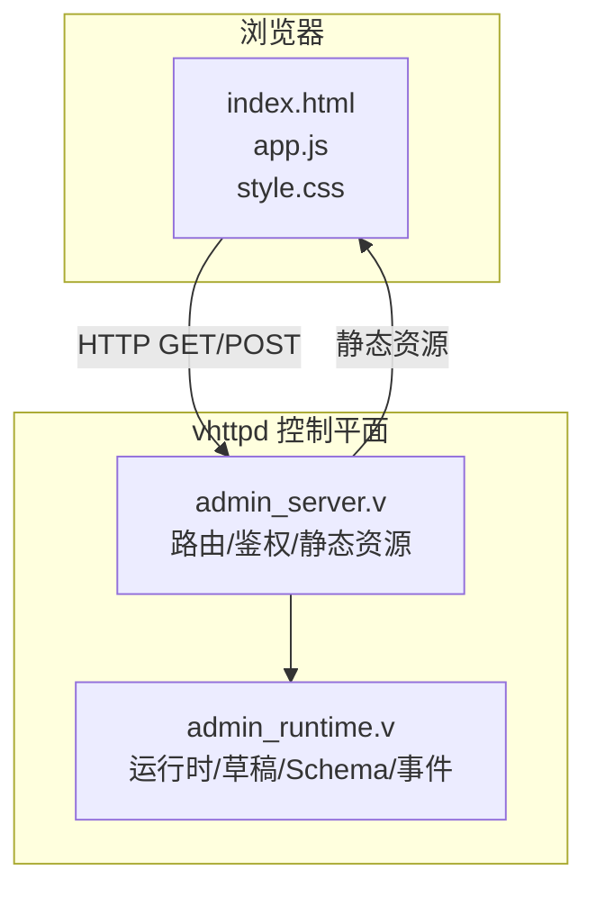
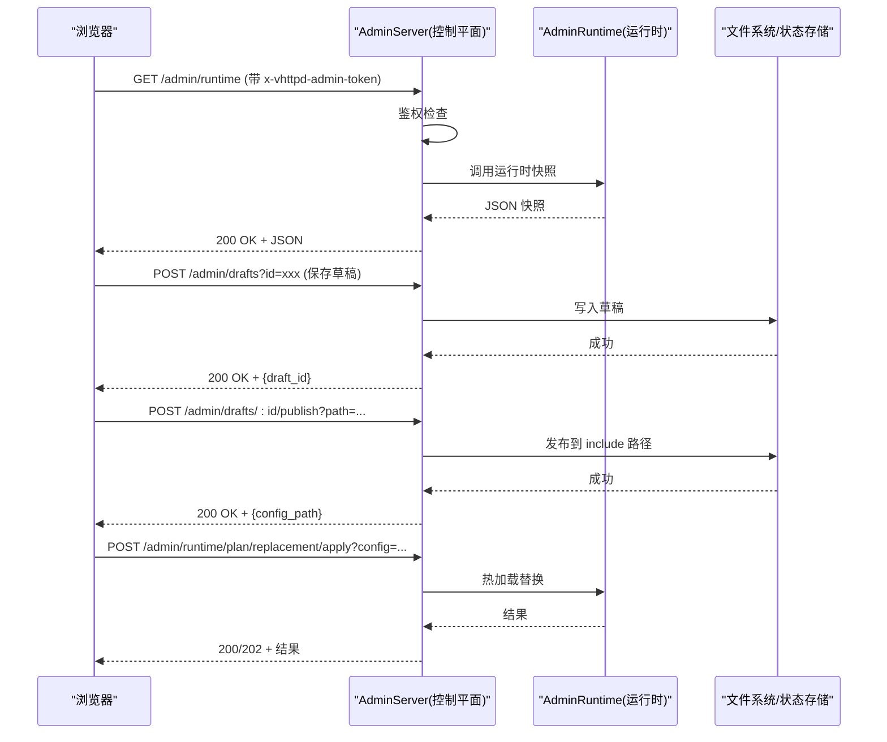
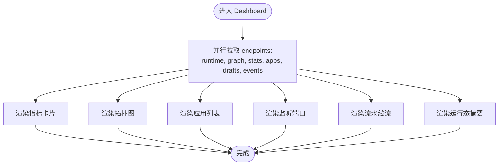
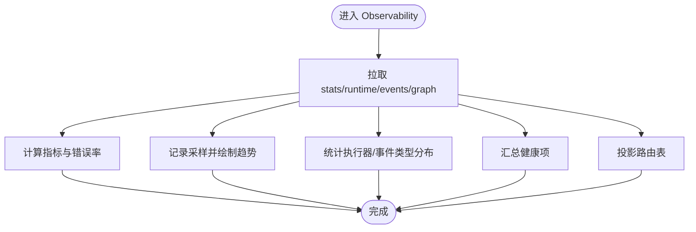
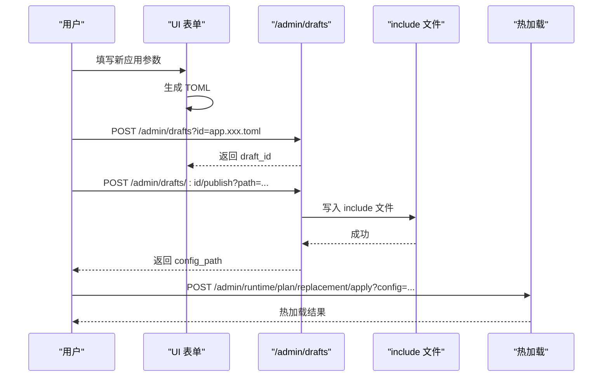
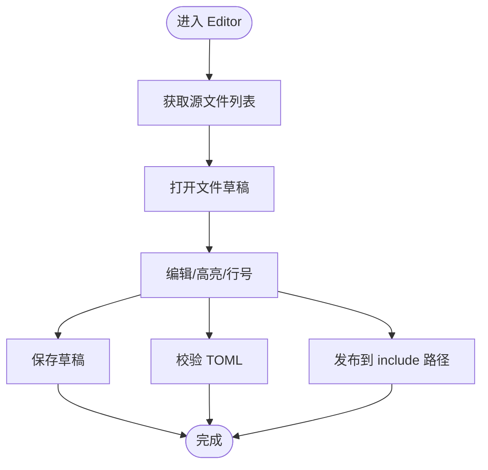
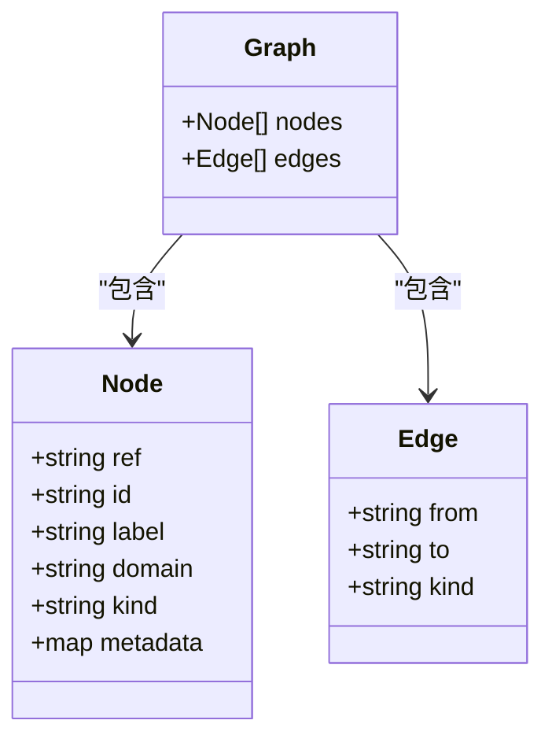
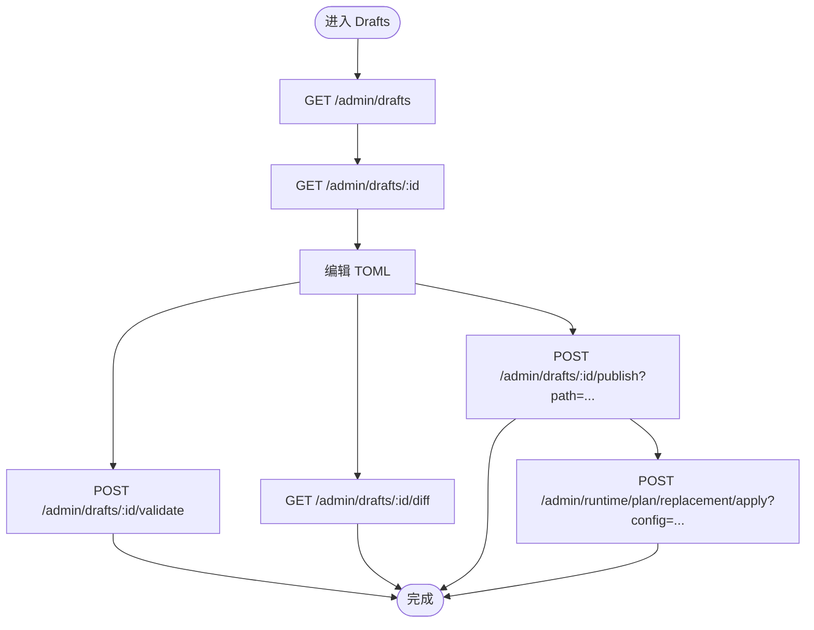
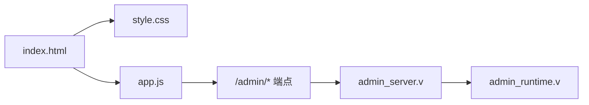

# Web 管理界面

<cite>
**本文引用的文件**   
- [admin/ui/index.html](file://admin/ui/index.html)
- [admin/ui/app.js](file://admin/ui/app.js)
- [admin/ui/style.css](file://admin/ui/style.css)
- [admin/admin.toml](file://admin/admin.toml)
- [src/admin_server.v](file://src/admin_server.v)
- [src/admin_runtime.v](file://src/admin_runtime.v)
- [README.md](file://README.md)
</cite>

## 目录
1. [简介](#简介)
2. [项目结构](#项目结构)
3. [核心组件](#核心组件)
4. [架构总览](#架构总览)
5. [详细组件分析](#详细组件分析)
6. [依赖关系分析](#依赖关系分析)
7. [性能与体验优化](#性能与体验优化)
8. [故障排查指南](#故障排查指南)
9. [结论](#结论)
10. [附录：使用步骤与截图说明](#附录使用步骤与截图说明)

## 简介
本文件面向运维与开发者，系统化介绍 vhttpd 的 Web 管理界面。内容覆盖实时监控仪表板、可观测性面板、应用管理、配置编辑器、运行时图、Schema 目录、草稿（Draft）工作流、事件日志与原始快照等核心功能；并给出页面使用方法、数据展示方式、交互操作、响应式设计与主题自定义指南，以及端到端的使用流程与操作步骤说明。

## 项目结构
Web 管理界面由“静态前端资源 + 服务端控制平面”两部分组成：
- 前端资源位于 admin/ui，包含入口 HTML、主逻辑 JS 与样式 CSS。
- 服务端提供 /admin/* 系列 API，负责鉴权、路由、状态聚合与持久化草稿/发布。

**图示来源**
- [admin/ui/index.html:1-36](file://admin/ui/index.html#L1-L36)
- [admin/ui/app.js:1-10](file://admin/ui/app.js#L1-L10)
- [admin/ui/style.css:1-20](file://admin/ui/style.css#L1-L20)
- [src/admin_server.v:111-141](file://src/admin_server.v#L111-L141)
- [src/admin_runtime.v:7-20](file://src/admin_runtime.v#L7-L20)

**章节来源**
- [admin/ui/index.html:1-36](file://admin/ui/index.html#L1-L36)
- [admin/ui/app.js:1-10](file://admin/ui/app.js#L1-L10)
- [admin/ui/style.css:1-20](file://admin/ui/style.css#L1-L20)
- [src/admin_server.v:111-141](file://src/admin_server.v#L111-L141)
- [src/admin_runtime.v:7-20](file://src/admin_runtime.v#L7-L20)

## 核心组件
- 侧边导航与视图切换：Dashboard、Observability、Applications、Editor、Runtime Graph、Schema、Drafts、Events、Raw。
- 认证令牌输入：通过 x-vhttpd-admin-token 头进行鉴权。
- 数据拉取与渲染：集中定义后端端点，统一错误处理，按视图渲染指标、拓扑、表格与图表。
- 草稿与发布：支持保存、校验、差异预览、发布到 include 路径，并可热加载生效。
- 源码编辑：打开配置或源文件草稿，语法高亮与行号显示，支持保存与发布。

**章节来源**
- [admin/ui/index.html:16-33](file://admin/ui/index.html#L16-L33)
- [admin/ui/app.js:1-21](file://admin/ui/app.js#L1-L21)
- [admin/ui/app.js:33-64](file://admin/ui/app.js#L33-L64)
- [admin/ui/app.js:84-102](file://admin/ui/app.js#L84-L102)
- [admin/ui/app.js:1054-1066](file://admin/ui/app.js#L1054-L1066)

## 架构总览
Web 管理界面的请求链路如下：浏览器发起 HTTP 请求至控制平面，控制平面执行鉴权后转发至运行时接口，返回 JSON 数据供前端渲染。

**图示来源**
- [src/admin_server.v:111-141](file://src/admin_server.v#L111-L141)
- [src/admin_server.v:288-334](file://src/admin_server.v#L288-L334)
- [src/admin_server.v:338-403](file://src/admin_server.v#L338-L403)
- [src/admin_server.v:470-557](file://src/admin_server.v#L470-L557)
- [src/admin_runtime.v:194-357](file://src/admin_runtime.v#L194-L357)
- [src/admin_runtime.v:398-461](file://src/admin_runtime.v#L398-L461)

## 详细组件分析

### 实时监控仪表板（Dashboard）
- 数据展示
  - 关键指标：应用数、监听器数、流水线数、中继数、草稿数、事件数。
  - 实时拓扑：基于 /admin/runtime/graph 的节点与边，绘制 Listener -> Pipeline -> Adapter -> Engine 的流向图。
  - 应用列表：从 /admin/apps 或图聚合生成，展示类型、监听器、流水线、引擎与状态。
  - 监听端口：列出协议/传输、地址与控制面标记。
  - 流水线流：匹配规则与出向适配器。
  - 运行态摘要：HTTP 请求/错误计数、活跃 WebSocket/Upstream、Worker 模式等。
- 交互操作
  - 点击“刷新”触发全量拉取。
  - 拓扑节点可点击查看详情弹窗。
- 数据来源
  - /admin/stats、/admin/runtime、/admin/runtime/graph、/admin/apps（或图聚合）。

**图示来源**
- [admin/ui/app.js:65-82](file://admin/ui/app.js#L65-L82)
- [admin/ui/app.js:268-357](file://admin/ui/app.js#L268-L357)
- [src/admin_runtime.v:7-20](file://src/admin_runtime.v#L7-L20)
- [src/admin_runtime.v:60-73](file://src/admin_runtime.v#L60-L73)
- [src/admin_server.v:131-141](file://src/admin_server.v#L131-L141)
- [src/admin_server.v:199-221](file://src/admin_server.v#L199-L221)

**章节来源**
- [admin/ui/index.html:44-70](file://admin/ui/index.html#L44-L70)
- [admin/ui/app.js:268-357](file://admin/ui/app.js#L268-L357)
- [src/admin_runtime.v:7-20](file://src/admin_runtime.v#L7-L20)
- [src/admin_runtime.v:60-73](file://src/admin_runtime.v#L60-L73)
- [src/admin_server.v:131-141](file://src/admin_server.v#L131-L141)
- [src/admin_server.v:199-221](file://src/admin_server.v#L199-L221)

### 可观测性面板（Observability）
- 数据展示
  - 指标：HTTP 请求总数、错误数与错误率、路由数量、开放通道、WebSocket 会话、进程存活时长。
  - 流量趋势：基于历史采样绘制的折线面积图。
  - 执行器分布：按 executor 维度统计占比。
  - 健康度网格：错误、拒绝、超时、上游错误、MCP 丢弃、飞书发送错误等。
  - 路由表：Listener/Pipeline/Executor/Methods/Paths。
- 交互操作
  - 顶部刷新按钮更新所有指标与图表。
- 数据来源
  - /admin/stats、/admin/runtime、/admin/events、/admin/runtime/graph。

**图示来源**
- [admin/ui/app.js:646-698](file://admin/ui/app.js#L646-L698)
- [admin/ui/app.js:165-175](file://admin/ui/app.js#L165-L175)
- [src/admin_runtime.v:37-58](file://src/admin_runtime.v#L37-L58)
- [src/admin_runtime.v:60-73](file://src/admin_runtime.v#L60-L73)
- [src/admin_server.v:131-141](file://src/admin_server.v#L131-L141)

**章节来源**
- [admin/ui/index.html:71-103](file://admin/ui/index.html#L71-L103)
- [admin/ui/app.js:646-698](file://admin/ui/app.js#L646-L698)
- [src/admin_runtime.v:37-58](file://src/admin_runtime.v#L37-L58)
- [src/admin_runtime.v:60-73](file://src/admin_runtime.v#L60-L73)
- [src/admin_server.v:131-141](file://src/admin_server.v#L131-L141)

### 应用管理（Applications）
- 功能要点
  - 应用清单：展示应用 ID、类型、监听器、流水线、引擎与状态。
  - 新应用向导：根据表单字段自动生成 TOML 片段，支持保存为草稿并发布到 include 路径。
  - 配置文件列表：列出已加载的配置及角色（main/include），支持对非 main 文件创建草稿。
- 交互操作
  - 填写表单 → 生成 TOML → 保存草稿 → 选择发布路径 → 发布 → 可选热加载。
- 数据来源
  - /admin/apps（或图聚合）、/admin/config/files、/admin/drafts。

**图示来源**
- [admin/ui/index.html:104-194](file://admin/ui/index.html#L104-L194)
- [admin/ui/app.js:724-815](file://admin/ui/app.js#L724-L815)
- [src/admin_server.v:288-334](file://src/admin_server.v#L288-L334)
- [src/admin_server.v:338-403](file://src/admin_server.v#L338-L403)
- [src/admin_server.v:470-557](file://src/admin_server.v#L470-L557)

**章节来源**
- [admin/ui/index.html:104-194](file://admin/ui/index.html#L104-L194)
- [admin/ui/app.js:724-815](file://admin/ui/app.js#L724-L815)
- [src/admin_server.v:288-334](file://src/admin_server.v#L288-L334)
- [src/admin_server.v:338-403](file://src/admin_server.v#L338-L403)
- [src/admin_server.v:470-557](file://src/admin_server.v#L470-L557)

### 配置编辑器（Editor）
- 功能要点
  - 源文件列表：列出可编辑的源文件（含语言类型、大小），支持打开草稿。
  - 编辑器：行号、语法高亮（TOML/JS/TS/JSON）、Tab 缩进、Ctrl/Cmd+S 快捷保存。
  - 动作：保存草稿、发布到目标路径、校验 TOML。
- 数据来源
  - /admin/source/files、/admin/source/files/draft、/admin/drafts、/admin/source/drafts/:id/publish。

**图示来源**
- [admin/ui/index.html:195-233](file://admin/ui/index.html#L195-L233)
- [admin/ui/app.js:489-575](file://admin/ui/app.js#L489-L575)
- [admin/ui/app.js:891-950](file://admin/ui/app.js#L891-L950)
- [src/admin_server.v:336-363](file://src/admin_server.v#L336-L363)
- [src/admin_server.v:387-403](file://src/admin_server.v#L387-L403)

**章节来源**
- [admin/ui/index.html:195-233](file://admin/ui/index.html#L195-L233)
- [admin/ui/app.js:489-575](file://admin/ui/app.js#L489-L575)
- [admin/ui/app.js:891-950](file://admin/ui/app.js#L891-L950)
- [src/admin_server.v:336-363](file://src/admin_server.v#L336-L363)
- [src/admin_server.v:387-403](file://src/admin_server.v#L387-L403)

### 运行时图（Runtime Graph）
- 功能要点
  - 节点列表：展示 domain、kind、metadata 等。
  - 拓扑图：在 Dashboard/Observability 中以 SVG 可视化呈现。
  - 节点详情：点击节点弹出模态框，展示入边/出边与元信息。
- 数据来源
  - /admin/runtime/graph。

**图示来源**
- [admin/ui/app.js:824-835](file://admin/ui/app.js#L824-L835)
- [admin/ui/app.js:206-259](file://admin/ui/app.js#L206-L259)
- [admin/ui/app.js:1034-1053](file://admin/ui/app.js#L1034-L1053)
- [src/admin_runtime.v:60-73](file://src/admin_runtime.v#L60-L73)

**章节来源**
- [admin/ui/index.html:234-239](file://admin/ui/index.html#L234-L239)
- [admin/ui/app.js:824-835](file://admin/ui/app.js#L824-L835)
- [admin/ui/app.js:206-259](file://admin/ui/app.js#L206-L259)
- [admin/ui/app.js:1034-1053](file://admin/ui/app.js#L1034-L1053)
- [src/admin_runtime.v:60-73](file://src/admin_runtime.v#L60-L73)

### Schema 目录（Schema）
- 功能要点
  - 目录页：列出 Domain 及其 Kinds。
  - 详情：可按 domain/kind 查询具体 schema 定义。
- 数据来源
  - /admin/schema、/admin/schema/:domain、/admin/schema/:domain/:kind。

**章节来源**
- [admin/ui/index.html:240-245](file://admin/ui/index.html#L240-L245)
- [admin/ui/app.js:836-844](file://admin/ui/app.js#L836-L844)
- [src/admin_runtime.v:75-135](file://src/admin_runtime.v#L75-L135)
- [src/admin_server.v:235-286](file://src/admin_server.v#L235-L286)

### 草稿（Drafts）
- 功能要点
  - 草稿列表：ID、更新时间、字节数、打开操作。
  - 编辑器：TOML 高亮、行号、保存/校验/差异/发布/删除。
  - 发布：将 include 路径写入磁盘，随后可通过热加载生效。
- 数据来源
  - /admin/drafts、/admin/drafts/:id、/admin/drafts/:id/validate、/admin/drafts/:id/diff、/admin/drafts/:id/publish。

**图示来源**
- [admin/ui/index.html:246-282](file://admin/ui/index.html#L246-L282)
- [admin/ui/app.js:845-1013](file://admin/ui/app.js#L845-L1013)
- [src/admin_runtime.v:137-357](file://src/admin_runtime.v#L137-L357)
- [src/admin_server.v:288-403](file://src/admin_server.v#L288-L403)
- [src/admin_server.v:470-557](file://src/admin_server.v#L470-L557)

**章节来源**
- [admin/ui/index.html:246-282](file://admin/ui/index.html#L246-L282)
- [admin/ui/app.js:845-1013](file://admin/ui/app.js#L845-L1013)
- [src/admin_runtime.v:137-357](file://src/admin_runtime.v#L137-L357)
- [src/admin_server.v:288-403](file://src/admin_server.v#L288-L403)
- [src/admin_server.v:470-557](file://src/admin_server.v#L470-L557)

### 事件日志（Events）
- 功能要点
  - 最近事件：时间、类型、目标键。
  - 限制：默认 limit=80，可在 URL 中调整。
- 数据来源
  - /admin/events?limit=80。

**章节来源**
- [admin/ui/index.html:283-288](file://admin/ui/index.html#L283-L288)
- [admin/ui/app.js:1014-1022](file://admin/ui/app.js#L1014-L1022)
- [src/admin_runtime.v:37-58](file://src/admin_runtime.v#L37-L58)
- [src/admin_server.v:167-185](file://src/admin_server.v#L167-L185)

### 原始快照（Raw）
- 功能要点
  - 以只读编辑器展示当前缓存的 data/errors 快照，便于调试。
- 数据来源
  - 前端内存 state.data/state.errors。

**章节来源**
- [admin/ui/index.html:289-300](file://admin/ui/index.html#L289-L300)
- [admin/ui/app.js:1023-1025](file://admin/ui/app.js#L1023-L1025)

## 依赖关系分析
- 前端依赖
  - index.html 引入 style.css 与 app.js。
  - app.js 集中声明后端端点，统一鉴权头注入与错误处理。
- 服务端依赖
  - admin_server.v 提供 /health、/admin/* 路由与鉴权中间逻辑。
  - admin_runtime.v 提供运行时、草稿、Schema、事件等数据接口。
- 外部依赖
  - README.md 列举了部分 /admin/* 端点能力，作为补充参考。

**图示来源**
- [admin/ui/index.html:7-8](file://admin/ui/index.html#L7-L8)
- [admin/ui/index.html:324-326](file://admin/ui/index.html#L324-L326)
- [admin/ui/app.js:1-10](file://admin/ui/app.js#L1-L10)
- [src/admin_server.v:111-141](file://src/admin_server.v#L111-L141)
- [src/admin_runtime.v:7-20](file://src/admin_runtime.v#L7-L20)

**章节来源**
- [admin/ui/index.html:7-8](file://admin/ui/index.html#L7-L8)
- [admin/ui/index.html:324-326](file://admin/ui/index.html#L324-L326)
- [admin/ui/app.js:1-10](file://admin/ui/app.js#L1-L10)
- [src/admin_server.v:111-141](file://src/admin_server.v#L111-L141)
- [src/admin_runtime.v:7-20](file://src/admin_runtime.v#L7-L20)
- [README.md:1147-1185](file://README.md#L1147-L1185)

## 性能与体验优化
- 并发拉取：refresh() 并行请求多个端点，减少首屏等待。
- 轻量图表：Sparkline 与 SVG 拓扑图避免重型库，降低包体与渲染开销。
- 滚动同步：代码编辑器通过分层实现滚动同步，提升大文件浏览体验。
- 响应式布局：CSS Grid/Flex 适配移动端，小屏自动堆叠列与工具栏。
- 主题变量：通过 CSS 变量集中管理色彩与尺寸，便于定制。

[本节为通用指导，不直接分析具体文件]

## 故障排查指南
- 鉴权失败
  - 现象：403 Forbidden。
  - 排查：确认侧边 Token 输入正确且已点击应用；检查服务端 token 配置。
- 端点不可用
  - 现象：404 Not Found。
  - 排查：确认控制平面是否启用 on_data_plane；核对路径与权限。
- 草稿保存/发布失败
  - 现象：422/400 错误。
  - 排查：查看返回 error 字段；确认 include 路径存在与可写；校验 TOML 语法。
- 热加载未生效
  - 现象：发布后无变化。
  - 排查：确认 publish 返回 config_path；再次调用 replacement/apply；观察状态与事件。

**章节来源**
- [src/admin_server.v:93-109](file://src/admin_server.v#L93-L109)
- [src/admin_runtime.v:11-20](file://src/admin_runtime.v#L11-L20)
- [src/admin_runtime.v:194-217](file://src/admin_runtime.v#L194-L217)
- [src/admin_runtime.v:338-357](file://src/admin_runtime.v#L338-L357)
- [src/admin_runtime.v:398-461](file://src/admin_runtime.v#L398-L461)

## 结论
Web 管理界面以“轻量前端 + 丰富后端 API”的方式，提供了从监控、诊断到配置变更的一站式管理能力。通过草稿与热加载机制，实现了安全可控的动态变更流程。配合响应式与主题变量，界面具备良好的可维护性与可扩展性。

[本节为总结性内容，不直接分析具体文件]

## 附录：使用步骤与截图说明

### 启动与访问
- 配置监听器与控制令牌
  - 在 admin/admin.toml 中设置 listeners.admin_ui 与 control.token。
- 启动服务后，浏览器访问 http://127.0.0.1:20210/admin/ui/index.html。
- 在左侧“Admin Token”输入框粘贴令牌并点击 OK。

**章节来源**
- [admin/admin.toml:15-24](file://admin/admin.toml#L15-L24)
- [admin/ui/index.html:27-33](file://admin/ui/index.html#L27-L33)

### 快速上手
- 仪表盘
  - 查看关键指标与拓扑图，点击节点查看详细信息。
- 可观测性
  - 关注错误率、健康度网格与流量趋势，定位异常。
- 应用管理
  - 使用“新应用配置”向导生成 TOML，保存草稿并发布到 include 路径，必要时热加载。
- 配置编辑器
  - 打开源文件草稿，进行编辑、校验与发布。
- 草稿工作流
  - 保存 → 校验 → 差异 → 发布 → 热加载。
- 事件与原始快照
  - 查看最近事件与当前内存快照，辅助问题定位。

**章节来源**
- [admin/ui/index.html:16-33](file://admin/ui/index.html#L16-L33)
- [admin/ui/app.js:84-102](file://admin/ui/app.js#L84-L102)
- [admin/ui/app.js:65-82](file://admin/ui/app.js#L65-L82)
- [admin/ui/app.js:724-815](file://admin/ui/app.js#L724-L815)
- [admin/ui/app.js:891-950](file://admin/ui/app.js#L891-L950)
- [admin/ui/app.js:845-1013](file://admin/ui/app.js#L845-L1013)
- [admin/ui/app.js:1014-1025](file://admin/ui/app.js#L1014-L1025)

### 界面自定义与主题配置
- 修改主题色与布局
  - 在 style.css 的 :root 中调整 CSS 变量（如 --bg、--accent、--surface 等）。
- 扩展视图
  - 在 index.html 中添加新的 nav button 与 view section，并在 app.js 中注册 selectView 映射与渲染函数。
- 新增端点
  - 在 app.js 的 endpoints 中追加路径，并在 render() 中增加对应渲染逻辑。

**章节来源**
- [admin/ui/style.css:1-20](file://admin/ui/style.css#L1-L20)
- [admin/ui/index.html:16-26](file://admin/ui/index.html#L16-L26)
- [admin/ui/app.js:1-10](file://admin/ui/app.js#L1-L10)
- [admin/ui/app.js:1054-1066](file://admin/ui/app.js#L1054-L1066)