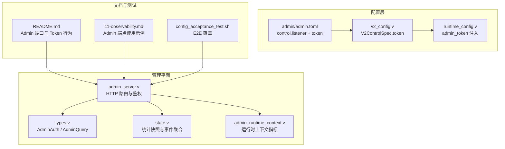
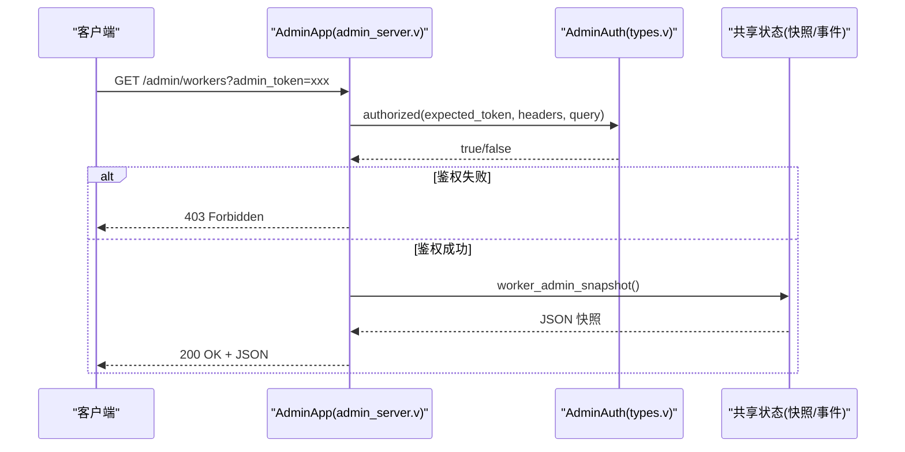
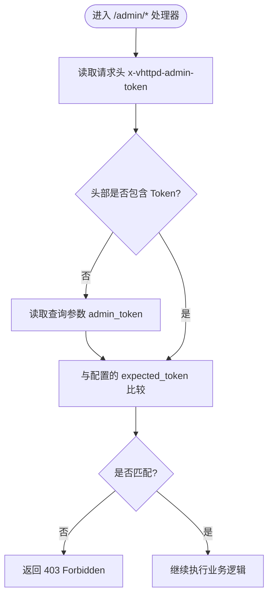
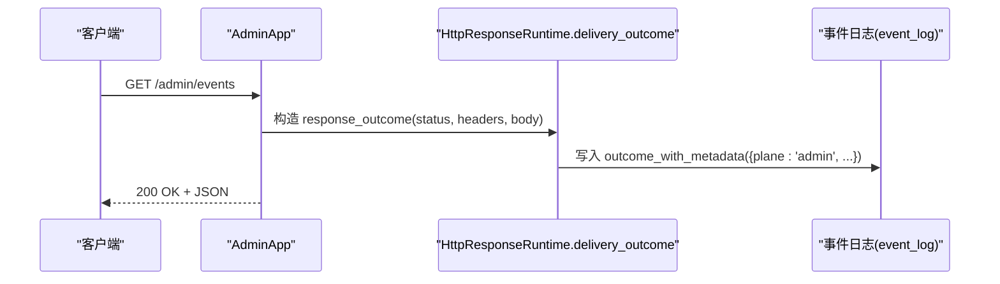
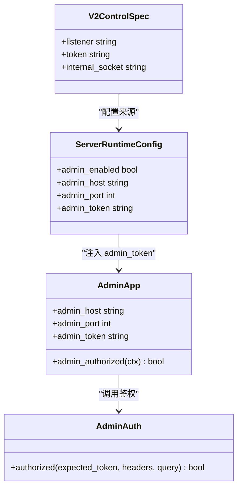

# 安全与认证

<cite>
**本文引用的文件列表**
- [admin_server.v](file://src/admin_server.v)
- [types.v](file://src/admin/types.v)
- [v2_config.v](file://src/config/v2_config.v)
- [runtime_config.v](file://src/server_lifecycle/runtime_config.v)
- [config_acceptance_test.sh](file://tests/e2e/config_acceptance_test.sh)
- [README.md](file://README.md)
- [11-observability.md](file://articles/11-observability.md)
- [admin.toml](file://admin/admin.toml)
- [state.v](file://src/admin/state.v)
- [admin_runtime_context.v](file://src/admin_runtime_context.v)
</cite>

## 目录
1. [简介](#简介)
2. [项目结构](#项目结构)
3. [核心组件](#核心组件)
4. [架构总览](#架构总览)
5. [详细组件分析](#详细组件分析)
6. [依赖关系分析](#依赖关系分析)
7. [性能与安全特性](#性能与安全特性)
8. [故障排查指南](#故障排查指南)
9. [结论](#结论)
10. [附录](#附录)

## 简介
本文件聚焦于 vhttpd 管理平面（Admin Plane）的安全与认证机制，系统性说明以下方面：
- Admin 平面的认证授权模型：Token 验证、访问控制策略
- 管理员权限模型与角色分配现状
- 安全配置最佳实践与安全头设置建议
- 审计日志记录与访问追踪的实现方式
- 与企业级认证系统（如 LDAP、OAuth2）的集成思路与扩展点

## 项目结构
围绕管理平面安全能力的相关代码主要分布在如下位置：
- 管理平面 HTTP 路由与鉴权入口：src/admin_server.v
- 通用鉴权与查询工具：src/admin/types.v
- V2 配置模型与控制面参数：src/config/v2_config.v
- 运行时配置组装与 admin_token 注入：src/server_lifecycle/runtime_config.v
- 可观测性与事件日志：src/admin/state.v、src/admin_runtime_context.v
- 示例配置与文档：admin/admin.toml、README.md、articles/11-observability.md
- E2E 用例覆盖：tests/e2e/config_acceptance_test.sh

图表来源
- [admin_server.v:101-109](file://src/admin_server.v#L101-L109)
- [types.v:130-139](file://src/admin/types.v#L130-L139)
- [v2_config.v:52-57](file://src/config/v2_config.v#L52-L57)
- [runtime_config.v:144-148](file://src/server_lifecycle/runtime_config.v#L144-L148)
- [admin.toml:21-24](file://admin/admin.toml#L21-L24)
- [README.md:1187-1202](file://README.md#L1187-L1202)
- [11-observability.md:1-33](file://articles/11-observability.md#L1-L33)
- [config_acceptance_test.sh:500-504](file://tests/e2e/config_acceptance_test.sh#L500-L504)

章节来源
- [admin_server.v:101-109](file://src/admin_server.v#L101-L109)
- [types.v:130-139](file://src/admin/types.v#L130-L139)
- [v2_config.v:52-57](file://src/config/v2_config.v#L52-L57)
- [runtime_config.v:144-148](file://src/server_lifecycle/runtime_config.v#L144-L148)
- [admin.toml:21-24](file://admin/admin.toml#L21-L24)
- [README.md:1187-1202](file://README.md#L1187-L1202)
- [11-observability.md:1-33](file://articles/11-observability.md#L1-L33)
- [config_acceptance_test.sh:500-504](file://tests/e2e/config_acceptance_test.sh#L500-L504)

## 核心组件
- 管理平面鉴权器：提供基于 Token 的简单鉴权，支持请求头或查询参数传入。当未配置 Token 时，默认放行（仅适用于本地调试）。
- 管理平面路由：大量 /admin/* 端点在进入业务逻辑前调用鉴权器进行校验，失败返回 403。
- 配置模型：V2 配置通过 control.listener 指定监听器，token 字段用于启用 Token 鉴权；运行时将 token 注入到 App 中供鉴权器使用。
- 可观测性：每个响应均附带元数据（包含 plane=admin），并可通过事件日志进行追踪。

章节来源
- [types.v:130-139](file://src/admin/types.v#L130-L139)
- [admin_server.v:101-109](file://src/admin_server.v#L101-L109)
- [v2_config.v:52-57](file://src/config/v2_config.v#L52-L57)
- [runtime_config.v:144-148](file://src/server_lifecycle/runtime_config.v#L144-L148)
- [admin_server.v:43-73](file://src/admin_server.v#L43-L73)

## 架构总览
管理平面在独立监听器上暴露 /admin/* 接口，所有写操作与敏感读操作均需 Token 鉴权。Token 来源于配置项 control.token，并在运行时注入到应用实例。

图表来源
- [admin_server.v:117-129](file://src/admin_server.v#L117-L129)
- [types.v:130-139](file://src/admin/types.v#L130-L139)

章节来源
- [admin_server.v:117-129](file://src/admin_server.v#L117-L129)
- [types.v:130-139](file://src/admin/types.v#L130-L139)

## 详细组件分析

### 认证与授权机制
- Token 来源与优先级
  - 优先从请求头 x-vhttpd-admin-token 读取
  - 若为空则回退到查询参数 admin_token
  - 若配置未设置 Token，则默认放行（仅用于本地开发）
- 鉴权失败处理
  - 统一返回 403 Forbidden，并附带错误码 forbbiden
- 适用范围
  - 所有需要认证的 /admin/* 端点均在处理器内显式调用鉴权方法

图表来源
- [types.v:130-139](file://src/admin/types.v#L130-L139)
- [admin_server.v:101-109](file://src/admin_server.v#L101-L109)

章节来源
- [types.v:130-139](file://src/admin/types.v#L130-L139)
- [admin_server.v:101-109](file://src/admin_server.v#L101-L109)
- [README.md:1187-1194](file://README.md#L1187-L1194)

### IP 白名单与访问控制列表（ACL）
- 当前实现
  - 源码中未发现针对管理平面的 IP 白名单或 ACL 内置实现
- 建议方案
  - 在网络边界（反向代理/网关/防火墙）实施 IP 白名单
  - 结合 TLS 与证书双向认证，限制管理平面仅在内网可达
  - 对 /admin/* 路径做前置鉴权（例如 Nginx 的 allow/deny 或云厂商 WAF）

章节来源
- [admin_server.v:101-109](file://src/admin_server.v#L101-L109)
- [types.v:130-139](file://src/admin/types.v#L130-L139)

### 管理员权限模型与角色分配
- 当前实现
  - 采用“单 Token”模式，未区分角色或细粒度权限
- 扩展方向
  - 在 AdminAuth.authorized 基础上增加角色解析与最小权限校验
  - 为不同端点定义所需角色集合，按角色矩阵进行授权决策
  - 引入会话/令牌生命周期管理与刷新机制

章节来源
- [types.v:130-139](file://src/admin/types.v#L130-L139)
- [admin_server.v:101-109](file://src/admin_server.v#L101-L109)

### 安全配置最佳实践与安全头设置
- 管理平面安全
  - 生产环境务必设置 control.token，避免空 Token 放行
  - 将 admin listener 绑定到 127.0.0.1 或通过反向代理暴露
  - 开启 TLS，强制 HTTPS 访问管理平面
- 站点安全头
  - 建议在配置中添加必要的安全响应头，如 X-Frame-Options、X-Content-Type-Options、Referrer-Policy、Permissions-Policy、CSP 等
  - 参考 WordPress Profiler 生成的 TOML 片段建议，在 [http.headers] 段补充缺失的安全头

章节来源
- [admin.toml:21-24](file://admin/admin.toml#L21-L24)
- [v2_config.v:52-57](file://src/config/v2_config.v#L52-L57)
- [php/package/src/VHttpd/WordPress/Profiler.php:1176-1197](file://php/package/src/VHttpd/WordPress/Profiler.php#L1176-L1197)

### 审计日志记录与访问追踪
- 事件日志
  - 通过 observability.event_log 输出 NDJSON 事件，便于集中采集与分析
- 请求追踪
  - 每个管理平面响应会附加 event_metadata（包含 plane=admin），并可携带 endpoint、action 等键值，便于关联分析
- 关键指标
  - /admin/stats 与 /admin/runtime 提供运行态统计，包括 HTTP 请求总数、错误数、超时数、队列深度等

图表来源
- [admin_server.v:43-73](file://src/admin_server.v#L43-L73)
- [11-observability.md:1-33](file://articles/11-observability.md#L1-L33)

章节来源
- [admin_server.v:43-73](file://src/admin_server.v#L43-L73)
- [11-observability.md:1-33](file://articles/11-observability.md#L1-L33)
- [state.v:12-39](file://src/admin/state.v#L12-L39)
- [admin_runtime_context.v:68-104](file://src/admin_runtime_context.v#L68-L104)

### 企业级认证系统集成（LDAP/OAuth2）
- 现状
  - 源码未提供 LDAP/OAuth2 的直接集成实现
- 集成思路
  - 在 AdminAuth.authorized 之前插入外部认证中间件：
    - 从上游身份提供者获取用户信息（如 JWT、SAML、OIDC）
    - 将用户标识与角色映射为内部 Token 或会话
    - 将结果注入到请求上下文，供后续鉴权使用
  - 在反向代理层完成协议握手与签名校验，仅转发已认证请求至 vhttpd 管理平面
  - 结合 RBAC 扩展 AdminAuth 以支持多角色与资源级授权

章节来源
- [types.v:130-139](file://src/admin/types.v#L130-L139)
- [admin_server.v:101-109](file://src/admin_server.v#L101-L109)

## 依赖关系分析
- 管理平面路由依赖 AdminAuth 进行鉴权
- 配置层 V2ControlSpec.token 决定是否需要鉴权
- 运行时将 token 注入到 App，供鉴权器比对
- 可观测性模块负责将响应结果与元数据写入事件日志

图表来源
- [admin_server.v:13-22](file://src/admin_server.v#L13-L22)
- [types.v:130-139](file://src/admin/types.v#L130-L139)
- [v2_config.v:52-57](file://src/config/v2_config.v#L52-L57)
- [runtime_config.v:144-148](file://src/server_lifecycle/runtime_config.v#L144-L148)

章节来源
- [admin_server.v:13-22](file://src/admin_server.v#L13-L22)
- [types.v:130-139](file://src/admin/types.v#L130-L139)
- [v2_config.v:52-57](file://src/config/v2_config.v#L52-L57)
- [runtime_config.v:144-148](file://src/server_lifecycle/runtime_config.v#L144-L148)

## 性能与安全特性
- 鉴权开销极低：仅字符串比较，适合高并发场景
- 管理平面建议仅对内网开放，减少攻击面
- 通过事件日志与统计端点进行容量规划与异常检测

章节来源
- [types.v:130-139](file://src/admin/types.v#L130-L139)
- [admin_server.v:117-129](file://src/admin_server.v#L117-L129)
- [11-observability.md:1-33](file://articles/11-observability.md#L1-L33)

## 故障排查指南
- 403 错误
  - 检查是否正确传递 x-vhttpd-admin-token 或 admin_token
  - 确认 control.token 已在配置中设置且与请求一致
- 管理平面不可达
  - 确认 admin listener 的 host/port 绑定正确
  - 若 admin-port 为 0，/admin/* 将在数据平面暴露，需确保路由未被拦截
- 事件日志无输出
  - 检查 observability.event_log 路径是否存在且可写
  - 确认进程有相应权限

章节来源
- [admin_server.v:101-109](file://src/admin_server.v#L101-L109)
- [README.md:1187-1202](file://README.md#L1187-L1202)
- [admin.toml:12-14](file://admin/admin.toml#L12-L14)

## 结论
- 管理平面当前采用轻量 Token 鉴权，满足基本访问控制需求
- 生产环境应严格配置 control.token，并通过网络边界与 TLS 加固
- 审计日志与统计端点为运维提供了良好的可观测性基础
- 如需更细粒度的权限控制与企业级认证，可在现有鉴权点上进行扩展

## 附录
- 常用管理端点
  - /health：健康检查
  - /admin/workers：Worker 池状态
  - /admin/stats：运行时统计
  - /admin/runtime：运行时摘要
  - /admin/events：事件列表
- 配置要点
  - control.listener 指向管理监听器
  - control.token 设置强随机 Token
  - observability.event_log 指定事件日志路径

章节来源
- [admin_server.v:111-141](file://src/admin_server.v#L111-L141)
- [admin.toml:21-24](file://admin/admin.toml#L21-L24)
- [11-observability.md:1-33](file://articles/11-observability.md#L1-L33)