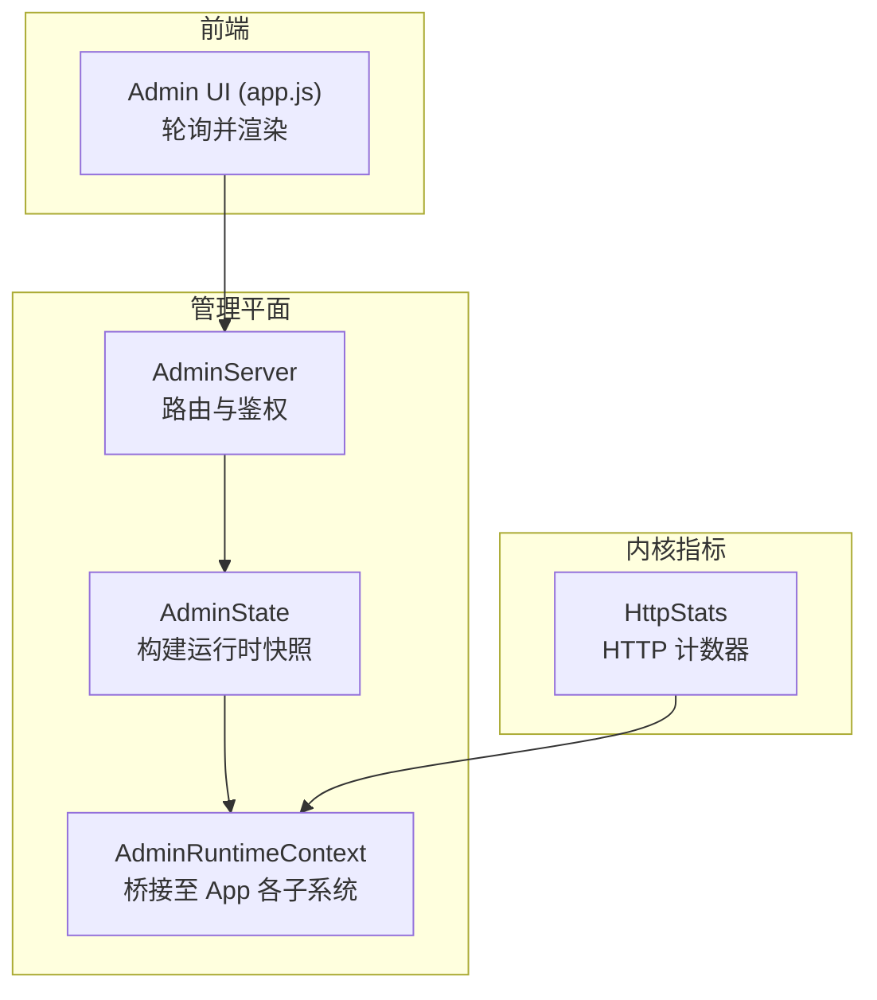
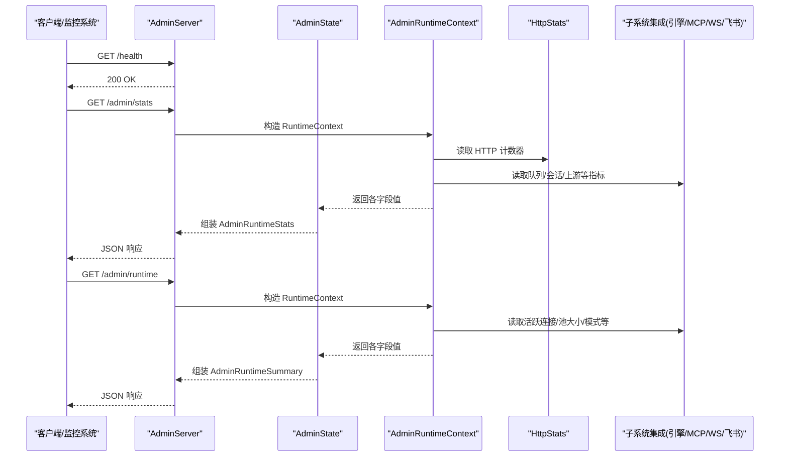
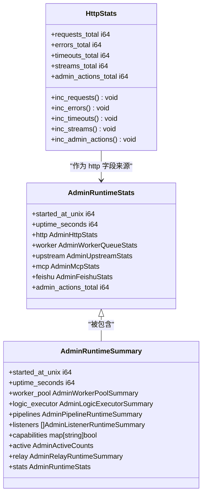
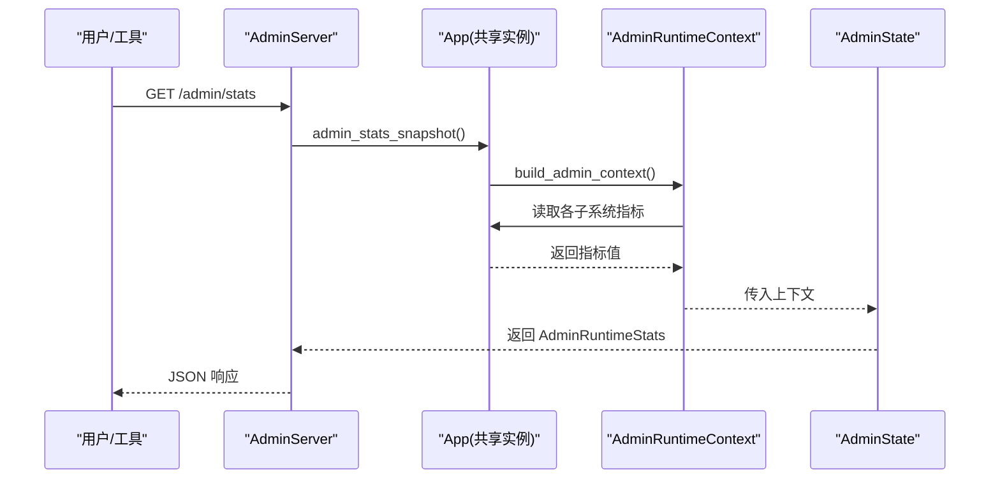
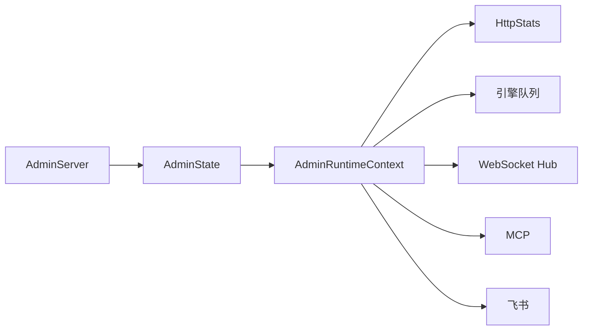

# 监控与告警

<cite>
**本文引用的文件**
- [src/http_stats.v](file://src/http_stats.v)
- [src/admin/state.v](file://src/admin/state.v)
- [src/admin_runtime_context.v](file://src/admin_runtime_context.v)
- [src/admin_server.v](file://src/admin_server.v)
- [admin/ui/app.js](file://admin/ui/app.js)
- [articles/11-observability.md](file://articles/11-observability.md)
</cite>

## 目录
1. [简介](#简介)
2. [项目结构](#项目结构)
3. [核心组件](#核心组件)
4. [架构总览](#架构总览)
5. [详细组件分析](#详细组件分析)
6. [依赖关系分析](#依赖关系分析)
7. [性能考量](#性能考量)
8. [故障排查指南](#故障排查指南)
9. [结论](#结论)
10. [附录](#附录)

## 简介
本章节面向生产运维与平台工程团队，系统化阐述 vhttpd 的监控、可观测性与告警能力。内容覆盖：
- 内置指标采集点与统计口径
- 管理平面（Admin Plane）提供的健康检查与运行时快照接口
- 指标聚合与导出路径（含 Prometheus 集成建议）
- 告警规则设计与触发条件
- 外部系统（Prometheus、Grafana）集成方式
- 性能瓶颈定位与故障诊断方法
- 监控面板与告警通知配置示例

## 项目结构
vhttpd 的可观测性由“内核指标 + 管理平面 + 前端可视化”三部分构成：
- 内核指标：HTTP 请求计数、错误、超时、流式连接等基础计数器
- 管理平面：提供 /health、/admin/stats、/admin/runtime 等端点，输出结构化 JSON 快照
- 前端可视化：Admin UI 通过调用管理平面 API 渲染实时面板

图表来源
- [src/admin_server.v:111-153](file://src/admin_server.v#L111-L153)
- [src/admin/state.v:10-54](file://src/admin/state.v#L10-L54)
- [src/admin_runtime_context.v:8-130](file://src/admin_runtime_context.v#L8-L130)
- [src/http_stats.v:1-32](file://src/http_stats.v#L1-L32)
- [admin/ui/app.js:656-675](file://admin/ui/app.js#L656-L675)

章节来源
- [src/admin_server.v:111-153](file://src/admin_server.v#L111-L153)
- [src/admin/state.v:10-54](file://src/admin/state.v#L10-L54)
- [src/admin_runtime_context.v:8-130](file://src/admin_runtime_context.v#L8-L130)
- [src/http_stats.v:1-32](file://src/http_stats.v#L1-L32)
- [admin/ui/app.js:656-675](file://admin/ui/app.js#L656-L675)

## 核心组件
- HttpStats：进程级 HTTP 请求计数器，包含请求总数、错误数、超时数、流式连接数、管理动作计数等。
- AdminState：将多源指标聚合成统一的运行时快照（AdminRuntimeStats/AdminRuntimeSummary），用于对外暴露。
- AdminRuntimeContext：以闭包形式桥接 App 内部各子系统（引擎队列、WebSocket Hub、MCP、飞书等）到 AdminState。
- AdminServer：实现管理平面 HTTP 路由、鉴权、静态页面托管，以及 /health、/admin/stats、/admin/runtime 等关键端点。
- Admin UI：前端通过轮询管理平面 API，渲染指标卡片、拓扑图与健康状态。

章节来源
- [src/http_stats.v:1-32](file://src/http_stats.v#L1-L32)
- [src/admin/state.v:10-103](file://src/admin/state.v#L10-L103)
- [src/admin_runtime_context.v:8-199](file://src/admin_runtime_context.v#L8-L199)
- [src/admin_server.v:111-153](file://src/admin_server.v#L111-L153)
- [admin/ui/app.js:656-675](file://admin/ui/app.js#L656-L675)

## 架构总览
下图展示了从请求进入、指标采集、快照聚合到对外暴露的完整链路。

图表来源
- [src/admin_server.v:111-153](file://src/admin_server.v#L111-L153)
- [src/admin/state.v:10-103](file://src/admin/state.v#L10-L103)
- [src/admin_runtime_context.v:8-199](file://src/admin_runtime_context.v#L8-L199)
- [src/http_stats.v:1-32](file://src/http_stats.v#L1-L32)

## 详细组件分析

### 指标采集与存储策略
- 采集点
  - HTTP 层：请求总量、错误总量、超时总量、流式连接总量、管理动作总量
  - 引擎队列：等待次数、拒绝次数、超时次数、当前深度、容量、超时阈值
  - WebSocket Hub：活跃连接数、活跃上游数
  - MCP：过期/驱逐/丢弃/采样相关计数、活跃会话数
  - 飞书：连接尝试/成功、接收帧、已确认事件、发送消息、发送错误
- 存储策略
  - 内存中按进程维护原子计数器（如 HttpStats）
  - 快照在访问时动态聚合（AdminState.stats_snapshot/runtime_snapshot）
  - 无持久化；适合被外部系统周期性拉取

章节来源
- [src/http_stats.v:1-32](file://src/http_stats.v#L1-L32)
- [src/admin/state.v:10-54](file://src/admin/state.v#L10-L54)
- [src/admin_runtime_context.v:28-129](file://src/admin_runtime_context.v#L28-L129)

### 健康检查机制
- /health：返回 200 OK，用于探针与负载均衡健康检查
- Admin UI 健康态：根据错误集合判定为 ok/degraded，并在界面展示

章节来源
- [src/admin_server.v:111-115](file://src/admin_server.v#L111-L115)
- [admin/ui/app.js:671-675](file://admin/ui/app.js#L671-L675)

### 查询接口与数据模型
- 关键端点
  - GET /health：健康检查
  - GET /admin/stats：运行时统计快照
  - GET /admin/runtime：运行时摘要（含池、执行器、管道、监听器、活跃计数、Relay 等）
- 数据模型
  - AdminRuntimeStats：HTTP、Worker 队列、上游计划、MCP、飞书等累计指标
  - AdminRuntimeSummary：扩展信息（池大小、后端模式、队列容量/超时、执行器详情、管道、监听器、活跃连接、Relay 详情等）

图表来源
- [src/http_stats.v:1-32](file://src/http_stats.v#L1-L32)
- [src/admin/state.v:10-103](file://src/admin/state.v#L10-L103)

章节来源
- [src/admin_server.v:131-153](file://src/admin_server.v#L131-L153)
- [src/admin/state.v:10-103](file://src/admin/state.v#L10-L103)

### 管理平面工作流（序列图）

图表来源
- [src/admin_server.v:131-141](file://src/admin_server.v#L131-L141)
- [src/admin_runtime_context.v:189-199](file://src/admin_runtime_context.v#L189-L199)
- [src/admin/state.v:10-54](file://src/admin/state.v#L10-L54)

### 前端可视化与交互
- Admin UI 定时轮询管理平面 API，渲染以下信息：
  - HTTP 请求/错误/超时/流式连接
  - 活跃通道、WebSockets、运行时长
  - 执行器类型分布、健康状态
- 健康状态基于错误集合判定，UI 上以标签显示 ok/degraded

章节来源
- [admin/ui/app.js:656-675](file://admin/ui/app.js#L656-L675)

## 依赖关系分析
- AdminServer 依赖 AdminState 与 AdminRuntimeContext 进行数据聚合
- AdminRuntimeContext 依赖 App 的各子系统（引擎、WebSocket、MCP、飞书等）
- HttpStats 作为底层计数器被 AdminRuntimeContext 读取并纳入快照

图表来源
- [src/admin_server.v:111-153](file://src/admin_server.v#L111-L153)
- [src/admin/state.v:10-103](file://src/admin/state.v#L10-L103)
- [src/admin_runtime_context.v:8-199](file://src/admin_runtime_context.v#L8-L199)
- [src/http_stats.v:1-32](file://src/http_stats.v#L1-L32)

章节来源
- [src/admin_server.v:111-153](file://src/admin_server.v#L111-L153)
- [src/admin/state.v:10-103](file://src/admin/state.v#L10-L103)
- [src/admin_runtime_context.v:8-199](file://src/admin_runtime_context.v#L8-L199)
- [src/http_stats.v:1-32](file://src/http_stats.v#L1-L32)

## 性能考量
- 指标采集开销
  - 计数器自增为 O(1)，对主路径影响极低
  - 快照聚合仅在管理平面请求时触发，避免热路径压力
- 并发与锁
  - 部分指标读取需加锁（如 MCP 活跃会话），应控制快照频率
- 前端轮询间隔
  - 建议 5-10 秒，避免频繁请求造成额外负载
- 资源上限
  - 关注队列深度、池大小、超时阈值，防止背压导致延迟上升

[本节为通用指导，不直接分析具体文件]

## 故障排查指南
- Worker 无响应
  - 现象：请求堆积、响应缓慢
  - 步骤：查看 /admin/workers、事件日志、必要时重启单个或全部 Worker
- 上游连接频繁断开
  - 现象：飞书/Ollama 重连频繁
  - 步骤：查看上游连接状态与事件、测试上游连通性
- MCP 会话无法创建
  - 现象：客户端连接失败
  - 步骤：查看 MCP 状态、检查 Worker 是否 busy、查看 MCP 错误日志
- 内存持续增长
  - 现象：进程内存增长
  - 步骤：监控内存使用、检查 Worker 内存、设置 max_requests 定期重启

章节来源
- [articles/11-observability.md:530-618](file://articles/11-observability.md#L530-L618)

## 结论
vhttpd 通过轻量级的内存计数器与管理平面快照，提供了开箱即用的可观测性能力。结合 Prometheus/Grafana 可实现完整的监控与告警闭环。建议在部署中启用 Admin Plane、配置合理的轮询与告警阈值，并结合事件日志进行问题定位。

[本节为总结性内容，不直接分析具体文件]

## 附录

### 关键指标清单与说明
- HTTP 指标
  - requests_total：自启动以来的总请求数
  - errors_total：错误请求总数
  - timeouts_total：超时请求总数
  - streams_total：流式连接总数
  - admin_actions_total：管理动作总数
- 引擎队列指标
  - queue_waits_total：排队等待次数
  - queue_rejected_total：被拒绝次数
  - queue_timeouts_total：队列超时次数
  - queue_depth：当前队列深度
  - pool_size：Worker 池大小
  - backend_mode：后端模式
  - queue_capacity：队列容量
  - queue_timeout_ms：队列超时毫秒
- WebSocket/MCP/飞书
  - ws_hub_active_conns：活跃 WebSocket 连接
  - ws_hub_active_upstreams：活跃上游数量
  - mcp_sessions_expired_total/evicted_total/pending_dropped_total/sampling_*：MCP 会话与采样相关计数
  - feishu connect_attempts/connect_successes/received_frames/acked_events/messages_sent/send_errors：飞书连接与消息统计

章节来源
- [src/http_stats.v:1-32](file://src/http_stats.v#L1-L32)
- [src/admin_runtime_context.v:28-129](file://src/admin_runtime_context.v#L28-L129)
- [src/admin/state.v:10-54](file://src/admin/state.v#L10-L54)

### 管理平面端点一览
- GET /health：健康检查
- GET /admin/stats：运行时统计快照
- GET /admin/runtime：运行时摘要
- GET /admin/workers：Worker 列表与状态
- GET /admin/events：事件日志（分页）
- GET /admin/runtime/graph：运行时拓扑图
- GET /admin/schema[/domain][/kind]：Schema 元数据
- GET /admin/drafts[/id]：草稿管理
- POST /admin/drafts[/id]/publish：发布草稿
- GET /admin/config/files：配置文件列表
- GET /admin/source/files：源码文件列表
- GET /admin/executors：执行器规格
- GET /admin/providers[/specs|runtimes]：提供者信息与运行时
- GET /admin/runtime/upstreams：上游连接列表
- GET /admin/runtime/websockets：WebSocket 会话列表
- GET /admin/runtime/mcp：MCP 会话列表
- GET /admin/runtime/provider-instances：Provider 实例列表
- POST /admin/runtime/events：分发运行时事件
- GET /admin/runtime/feishu|codex|db|cache：各 Provider 运行时快照
- POST /admin/workers/restart[/all]：重启 Worker
- POST /admin/workers/drain：优雅下线指定引擎

章节来源
- [src/admin_server.v:111-1028](file://src/admin_server.v#L111-L1028)

### Prometheus 集成与告警规则
- 抓取配置
  - job_name: vhttpd
  - metrics_path: /admin/metrics（若未内置则可通过中间件适配）
  - headers: x-vhttpd-admin-token: your-token
- 推荐告警规则
  - Worker 池耗尽：vhttpd_worker_available == 0
  - Worker 队列积压：vhttpd_worker_queue_length > 10
  - 高错误率：rate(vhttpd_http_requests_error[5m]) > 0.1
  - 上游断开：vhttpd_upstream_connected == 0
  - MCP 会话接近上限：vhttpd_mcp_sessions > 900

章节来源
- [articles/11-observability.md:406-526](file://articles/11-observability.md#L406-L526)

### Grafana 面板与通知设置（示例）
- 数据源：Prometheus
- 常用面板
  - HTTP 请求速率与错误率（Rate & Error Rate）
  - 队列深度与拒绝率（Queue Depth & Rejection）
  - 活跃连接与上游状态（Active Conns & Upstreams）
  - MCP 会话趋势（Sessions Trend）
  - 飞书连接与消息吞吐（Connect & Messages）
- 通知渠道
  - Webhook/邮件/IM（企业微信/飞书机器人）
  - 告警级别：warning/critical
  - 抑制与静默：针对已知变更窗口

[本节为概念性配置示例，不直接分析具体文件]