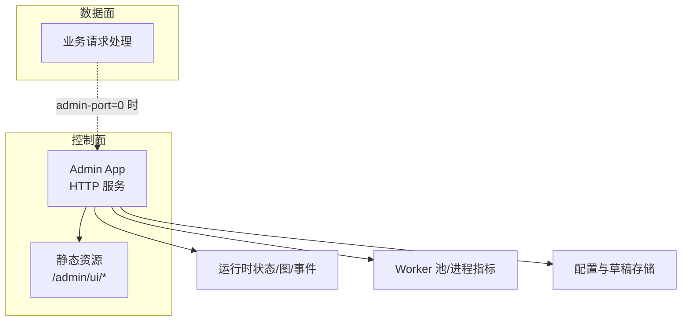
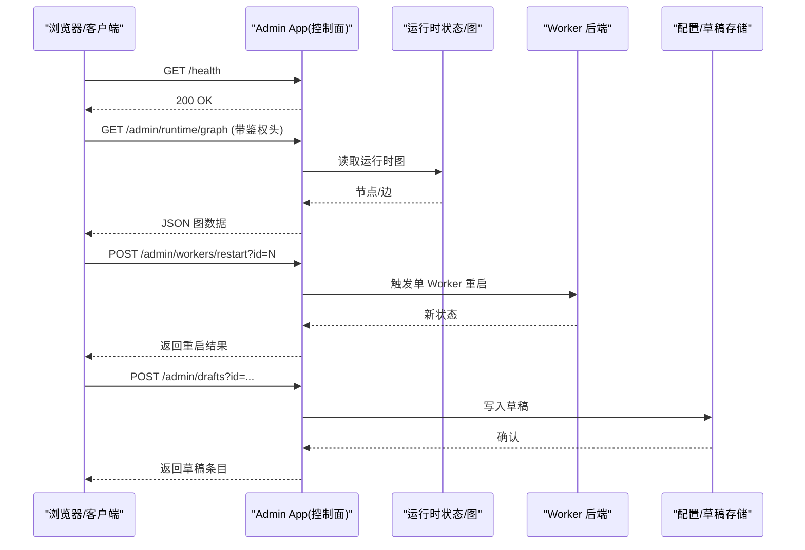
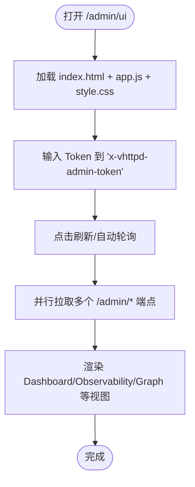
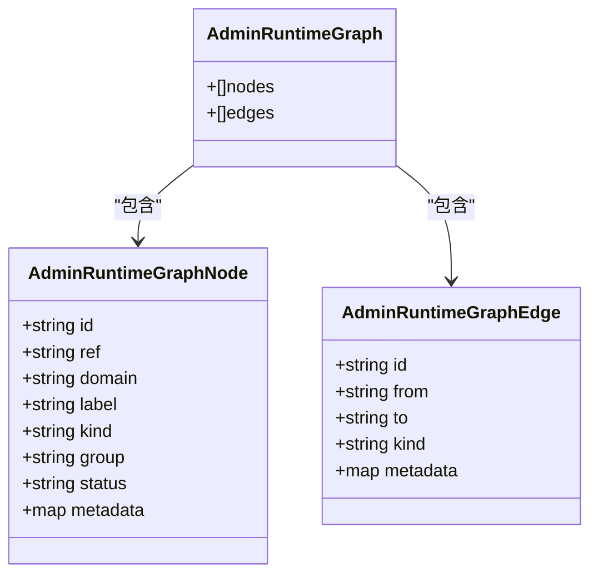
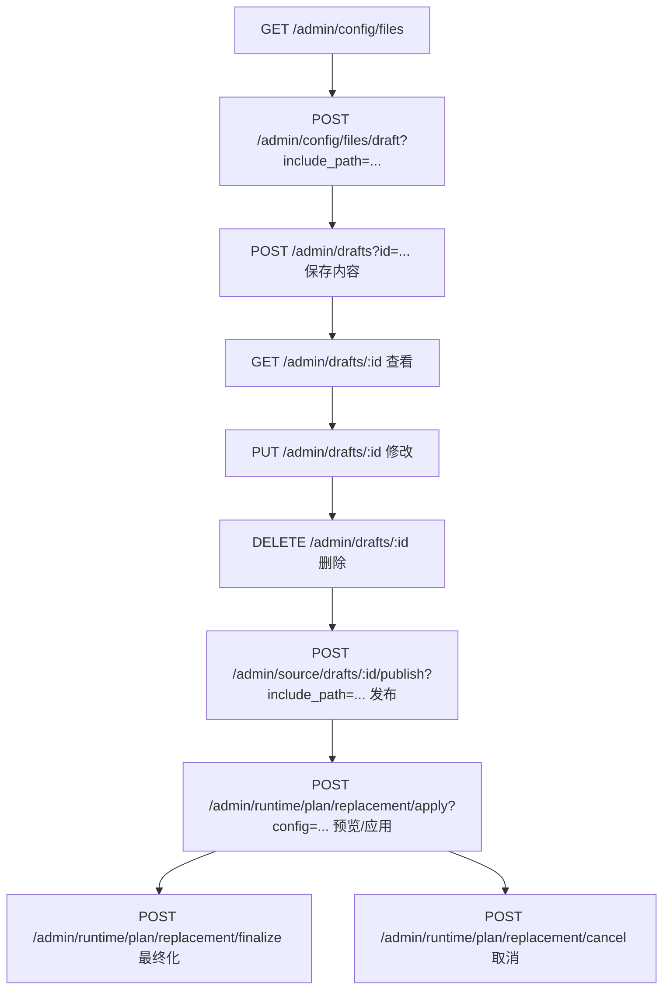
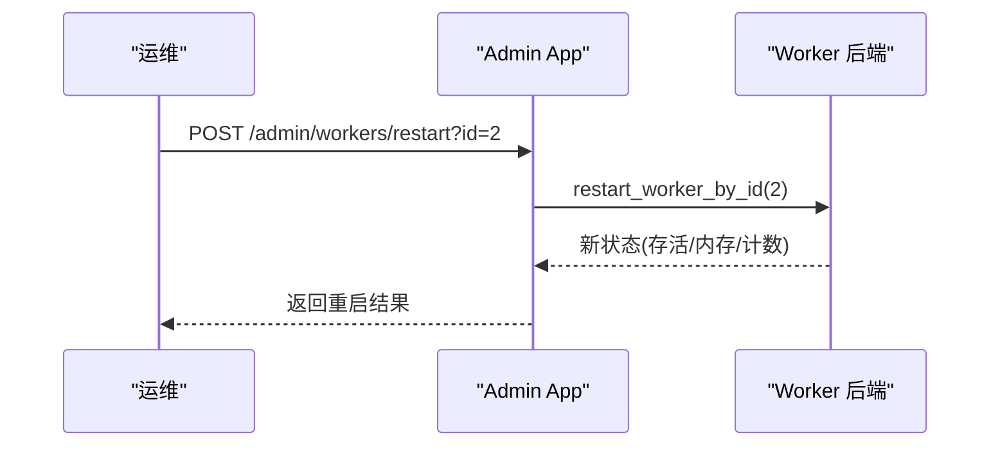
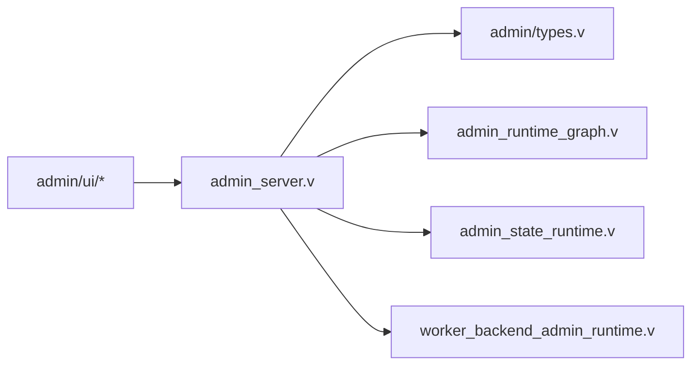

# 管理功能

<cite>
**本文引用的文件**   
- [admin_server.v](file://src/admin_server.v)
- [admin/types.v](file://src/admin/types.v)
- [admin_runtime_graph.v](file://src/admin_runtime_graph.v)
- [admin_state_runtime.v](file://src/admin_state_runtime.v)
- [worker_backend_admin_runtime.v](file://src/worker_backend_admin_runtime.v)
- [README.md](file://README.md)
- [ADMIN_CONTROL_PLANE_PLAN.md](file://docs/ADMIN_CONTROL_PLANE_PLAN.md)
- [11-observability.md](file://articles/11-observability.md)
- [admin.toml](file://admin/admin.toml)
- [index.html](file://admin/ui/index.html)
- [app.js](file://admin/ui/app.js)
</cite>

## 目录
1. [简介](#简介)
2. [项目结构](#项目结构)
3. [核心组件](#核心组件)
4. [架构总览](#架构总览)
5. [详细组件分析](#详细组件分析)
6. [依赖关系分析](#依赖关系分析)
7. [性能与容量规划](#性能与容量规划)
8. [故障排查指南](#故障排查指南)
9. [结论](#结论)
10. [附录：API 参考与配置项](#附录api-参考与配置项)

## 简介
本文件系统化梳理 vhttpd 的管理平面能力，覆盖 Web 管理界面、Admin API、安全机制、配置与扩展方式，以及监控告警与运维最佳实践。文档面向运维与平台工程师，既提供高层概览，也给出代码级映射与可操作指引。

## 项目结构
管理平面由“控制面（Admin Plane）”和“数据面（Data Plane）”两部分组成：
- 控制面：独立监听地址/端口，承载 /health、/admin/* 等管理接口与静态 UI。
- 数据面：当 admin-port=0 时，/admin/* 会回落到数据面端口；否则仅在控制面暴露。

图示来源
- [admin_server.v:75-91](file://src/admin_server.v#L75-L91)
- [admin_server.v:101-109](file://src/admin_server.v#L101-L109)
- [admin_server.v:111-141](file://src/admin_server.v#L111-L141)
- [admin_server.v:143-197](file://src/admin_server.v#L143-L197)
- [admin_server.v:288-363](file://src/admin_server.v#L288-L363)
- [admin_server.v:470-557](file://src/admin_server.v#L470-L557)
- [admin_server.v:839-928](file://src/admin_server.v#L839-L928)
- [admin/runtime_graph.v:32-71](file://src/admin_runtime_graph.v#L32-L71)
- [admin_state_runtime.v:99-127](file://src/admin_state_runtime.v#L99-L127)

章节来源
- [admin_server.v:75-91](file://src/admin_server.v#L75-L91)
- [admin_server.v:101-109](file://src/admin_server.v#L101-L109)
- [admin_server.v:111-141](file://src/admin_server.v#L111-L141)
- [admin_server.v:143-197](file://src/admin_server.v#L143-L197)
- [admin_server.v:288-363](file://src/admin_server.v#L288-L363)
- [admin_server.v:470-557](file://src/admin_server.v#L470-L557)
- [admin_server.v:839-928](file://src/admin_server.v#L839-L928)
- [admin/runtime_graph.v:32-71](file://src/admin_runtime_graph.v#L32-L71)
- [admin_state_runtime.v:99-127](file://src/admin_state_runtime.v#L99-L127)

## 核心组件
- Admin HTTP 服务与路由：实现 /health、/admin/workers、/admin/stats、/admin/runtime*、/admin/schema、/admin/drafts、/admin/config/files、/admin/source/files、/admin/providers、/admin/executors 等端点，并统一鉴权与审计元数据注入。
- 运行时图（Graph）：从运行期计划（runtime plan）构建节点与边，用于拓扑可视化与变更影响分析。
- 配置与草稿系统：支持列出配置/源码文件、打开草稿、保存/发布草稿、校验与热替换（replacement）。
- Worker 管理：查询 Worker 池快照、按 ID 重启单个 Worker、重启全部、标记 Drain。
- 认证授权：基于 token 的简单鉴权，支持 Header 或 Query 参数传入。
- 静态 UI：提供 Dashboard、Observability、Apps、Editor、Graph、Schema、Drafts、Events、Raw 等页面。

章节来源
- [admin_server.v:111-141](file://src/admin_server.v#L111-L141)
- [admin_server.v:143-197](file://src/admin_server.v#L143-L197)
- [admin_server.v:288-363](file://src/admin_server.v#L288-L363)
- [admin_server.v:470-557](file://src/admin_server.v#L470-L557)
- [admin_server.v:839-928](file://src/admin_server.v#L839-L928)
- [admin/types.v:130-139](file://src/admin/types.v#L130-L139)
- [admin/runtime_graph.v:32-71](file://src/admin_runtime_graph.v#L32-L71)
- [admin_state_runtime.v:99-127](file://src/admin_state_runtime.v#L99-L127)

## 架构总览
管理平面采用“控制面 + 数据面”双通道模式：
- 控制面：默认在独立 host/port 上暴露 /admin/*，适合内网访问。
- 数据面：当 admin-port=0 时，/admin/* 在数据面端口可用，便于无额外端口部署。

图示来源
- [admin_server.v:111-141](file://src/admin_server.v#L111-L141)
- [admin_server.v:187-197](file://src/admin_server.v#L187-L197)
- [admin_server.v:839-928](file://src/admin_server.v#L839-L928)
- [admin_server.v:365-385](file://src/admin_server.v#L365-L385)

## 详细组件分析

### Web 管理界面（/admin/ui）
- 入口与路由：静态资源通过 Admin App 的静态处理器提供，路径为 /admin/ui/*。
- 主要页面：Dashboard、Observability、Applications、Editor、Runtime Graph、Schema、Drafts、Events、Raw。
- 交互流程：前端集中调用 /admin/runtime、/admin/runtime/graph、/admin/config/files、/admin/source/files、/admin/schema、/admin/drafts、/admin/events、/admin/stats 等端点，并在请求中携带 x-vhttpd-admin-token。

图示来源
- [admin_server.v:75-91](file://src/admin_server.v#L75-L91)
- [index.html:1-327](file://admin/ui/index.html#L1-L327)
- [app.js:1-41](file://admin/ui/app.js#L1-L41)
- [app.js:33-64](file://admin/ui/app.js#L33-L64)

章节来源
- [admin_server.v:75-91](file://src/admin_server.v#L75-L91)
- [index.html:1-327](file://admin/ui/index.html#L1-L327)
- [app.js:1-41](file://admin/ui/app.js#L1-L41)
- [app.js:33-64](file://admin/ui/app.js#L33-L64)

### Admin API 端点总览
- 健康检查
  - GET /health
- 运行时信息
  - GET /admin/runtime
  - GET /admin/runtime/plan
  - GET /admin/runtime/graph
  - GET /admin/runtime/upstreams
  - GET /admin/runtime/websockets
  - GET /admin/runtime/mcp
  - GET /admin/runtime/provider-instances
  - GET /admin/runtime/events
  - GET /admin/runtime/feishu | codex | db | cache
- 统计与快照
  - GET /admin/stats
  - GET /admin/apps | /admin/applications | /admin/sites
  - GET /admin/providers | /admin/providers/specs | /admin/providers/runtimes
  - GET /admin/executors
  - GET /admin/runtime/transformers
- 配置与草稿
  - GET /admin/config/files
  - POST /admin/config/files/draft
  - GET /admin/source/files
  - POST /admin/source/files/draft
  - GET /admin/drafts
  - POST /admin/drafts
  - GET /admin/drafts/:id
  - PUT /admin/drafts/:id
  - DELETE /admin/drafts/:id
  - POST /admin/source/drafts/:id/publish
- 运行时计划替换（热更新）
  - GET /admin/runtime/plan/replacement
  - GET /admin/runtime/plan/replacement/state
  - POST /admin/runtime/plan/replacement/apply
  - POST /admin/runtime/plan/replacement/finalize
  - POST /admin/runtime/plan/replacement/cancel
- Worker 控制
  - GET /admin/workers
  - POST /admin/workers/restart?id=<id>
  - POST /admin/workers/restart/all
  - POST /admin/workers/drain?engine=...

说明：
- 所有 /admin/* 端点在启用 token 时必须携带 x-vhttpd-admin-token 或通过 ?admin_token= 传递，否则返回 403。
- 部分端点支持分页与过滤参数（如 limit、offset、details、room、conn_id、session_id、protocol_version、provider、role 等）。

章节来源
- [admin_server.v:111-141](file://src/admin_server.v#L111-L141)
- [admin_server.v:143-197](file://src/admin_server.v#L143-L197)
- [admin_server.v:235-286](file://src/admin_server.v#L235-L286)
- [admin_server.v:288-363](file://src/admin_server.v#L288-L363)
- [admin_server.v:365-468](file://src/admin_server.v#L365-L468)
- [admin_server.v:470-557](file://src/admin_server.v#L470-L557)
- [admin_server.v:574-621](file://src/admin_server.v#L574-L621)
- [admin_server.v:623-688](file://src/admin_server.v#L623-L688)
- [admin_server.v:690-740](file://src/admin_server.v#L690-L740)
- [admin_server.v:742-788](file://src/admin_server.v#L742-L788)
- [admin_server.v:839-928](file://src/admin_server.v#L839-L928)
- [README.md:1147-1221](file://README.md#L1147-L1221)

### 运行时图（Graph）
- 数据来源：从当前 runtime plan 构建 listener、resource、engine、adapter、pipeline、relay 等节点及引用边。
- 用途：拓扑可视化、链路追踪、变更影响分析。

图示来源
- [admin/runtime_graph.v:5-30](file://src/admin_runtime_graph.v#L5-L30)
- [admin/runtime_graph.v:32-71](file://src/admin_runtime_graph.v#L32-L71)

章节来源
- [admin/runtime_graph.v:5-30](file://src/admin_runtime_graph.v#L5-L30)
- [admin/runtime_graph.v:32-71](file://src/admin_runtime_graph.v#L32-L71)

### 配置与草稿（Drafts）
- 能力：列出配置/源码文件、打开草稿、保存/更新/删除草稿、发布到 include 路径、校验 TOML、对比差异、热替换。
- 存储：基于文件系统的事件日志目录下的 admin 子目录，或 .var/vhttpd/admin。

图示来源
- [admin_server.v:307-363](file://src/admin_server.v#L307-L363)
- [admin_server.v:365-468](file://src/admin_server.v#L365-L468)
- [admin_server.v:470-557](file://src/admin_server.v#L470-L557)
- [admin_state_runtime.v:99-127](file://src/admin_state_runtime.v#L99-L127)
- [admin_state_runtime.v:242-286](file://src/admin_state_runtime.v#L242-L286)
- [admin_state_runtime.v:315-355](file://src/admin_state_runtime.v#L315-L355)
- [admin_state_runtime.v:445-490](file://src/admin_state_runtime.v#L445-L490)

章节来源
- [admin_server.v:307-363](file://src/admin_server.v#L307-L363)
- [admin_server.v:365-468](file://src/admin_server.v#L365-L468)
- [admin_server.v:470-557](file://src/admin_server.v#L470-L557)
- [admin_state_runtime.v:99-127](file://src/admin_state_runtime.v#L99-L127)
- [admin_state_runtime.v:242-286](file://src/admin_state_runtime.v#L242-L286)
- [admin_state_runtime.v:315-355](file://src/admin_state_runtime.v#L315-L355)
- [admin_state_runtime.v:445-490](file://src/admin_state_runtime.v#L445-L490)

### Worker 管理与指标
- 查询：GET /admin/workers 返回 Worker 池快照（含 alive、pid、rss_kb、draining、inflight_requests、served_requests、restart_count、next_retry_ts 等）。
- 控制：
  - POST /admin/workers/restart?id=<id> 重启指定 Worker
  - POST /admin/workers/restart/all 重启全部
  - POST /admin/workers/drain?engine=... 将引擎置为 draining
- 指标采集：通过 ps 命令获取 RSS（KB），结合内部状态聚合。

图示来源
- [admin_server.v:839-928](file://src/admin_server.v#L839-L928)
- [worker_backend_admin_runtime.v:42-82](file://src/worker_backend_admin_runtime.v#L42-L82)
- [worker_backend_admin_runtime.v:1-40](file://src/worker_backend_admin_runtime.v#L1-L40)

章节来源
- [admin_server.v:839-928](file://src/admin_server.v#L839-L928)
- [worker_backend_admin_runtime.v:1-40](file://src/worker_backend_admin_runtime.v#L1-L40)
- [worker_backend_admin_runtime.v:42-82](file://src/worker_backend_admin_runtime.v#L42-L82)

### 安全机制（认证与访问控制）
- 认证模型：
  - 未设置 token：控制面端口开放（不推荐生产使用）。
  - 已设置 token：必须携带 x-vhttpd-admin-token 或 ?admin_token=，否则 403。
- 端口暴露模型：
  - admin-port=0：/admin/* 在数据面端口可用。
  - admin-port>0：/admin/* 仅出现在控制面端口，数据面返回 404。
- 审计与元数据：每个响应附带 admin_endpoint、admin_action 等元数据，便于事件日志记录与追踪。

章节来源
- [admin/types.v:130-139](file://src/admin/types.v#L130-L139)
- [admin_server.v:101-109](file://src/admin_server.v#L101-L109)
- [admin_server.v:111-141](file://src/admin_server.v#L111-L141)
- [README.md:1187-1221](file://README.md#L1187-L1221)

### 监控与可观测性
- 内置端点：/admin/stats、/admin/runtime、/admin/events、/admin/runtime/graph 等。
- 外部指标：建议配合 Prometheus 抓取 /admin/stats 与自定义指标，结合告警规则进行监控。
- 示例告警：包括 Worker 池耗尽、队列积压、高错误率、上游断开、MCP 会话接近上限等。

章节来源
- [admin_server.v:131-141](file://src/admin_server.v#L131-L141)
- [admin_server.v:167-185](file://src/admin_server.v#L167-L185)
- [11-observability.md:469-526](file://articles/11-observability.md#L469-L526)

## 依赖关系分析
- Admin App 依赖：
  - 运行时状态与图：admin_runtime_graph.v
  - 配置与草稿：admin_state_runtime.v
  - Worker 生命周期：worker_backend_admin_runtime.v
  - 通用类型与鉴权：admin/types.v
- 前端依赖：
  - 静态资源：/admin/ui/*
  - 后端端点：/admin/*（需鉴权）

图示来源
- [admin_server.v:75-91](file://src/admin_server.v#L75-L91)
- [admin/types.v:130-139](file://src/admin/types.v#L130-L139)
- [admin/runtime_graph.v:32-71](file://src/admin_runtime_graph.v#L32-L71)
- [admin_state_runtime.v:99-127](file://src/admin_state_runtime.v#L99-L127)
- [worker_backend_admin_runtime.v:42-82](file://src/worker_backend_admin_runtime.v#L42-L82)

章节来源
- [admin_server.v:75-91](file://src/admin_server.v#L75-L91)
- [admin/types.v:130-139](file://src/admin/types.v#L130-L139)
- [admin/runtime_graph.v:32-71](file://src/admin_runtime_graph.v#L32-L71)
- [admin_state_runtime.v:99-127](file://src/admin_state_runtime.v#L99-L127)
- [worker_backend_admin_runtime.v:42-82](file://src/worker_backend_admin_runtime.v#L42-L82)

## 性能与容量规划
- 控制面与数据面分离：生产环境建议启用独立 admin-port，避免管理流量与业务流量耦合。
- 限制与分页：多数列表类端点支持 limit/offset，合理设置 limit 避免大对象传输。
- 图与快照：/admin/runtime/graph 与 /admin/runtime/* 快照可能较大，建议在低频场景使用或增加缓存层。
- Worker 重启：批量重启应评估对在线请求的影响，必要时先 drain 再滚动重启。

[本节为通用指导，无需具体文件引用]

## 故障排查指南
- 403 Forbidden：检查是否配置了 admin token，并确保请求携带正确 header 或 query 参数。
- 404 Not Found：当 admin-port>0 时，数据面端口不再提供 /admin/*，请改用控制面端口。
- Worker 重启失败：确认 worker pool 已启用且目标 worker id 存在；查看 next_retry_ts 与 restart_count。
- 草稿发布失败：检查 include_path 解析与 TOML 语法；使用 /admin/drafts/:id 校验与 diff。

章节来源
- [admin/types.v:130-139](file://src/admin/types.v#L130-L139)
- [admin_server.v:101-109](file://src/admin_server.v#L101-L109)
- [admin_server.v:839-928](file://src/admin_server.v#L839-L928)
- [admin_state_runtime.v:242-286](file://src/admin_state_runtime.v#L242-L286)

## 结论
vhttpd 的管理平面提供了完备的运行时可视、配置编辑与热更新、Worker 控制与可观测性能力。通过控制面与数据面的灵活组合、严格的鉴权模型与丰富的 API，能够满足生产环境的日常运维与快速排障需求。建议在生产中启用独立 admin-port 与强 token，并结合外部监控系统建立告警闭环。

[本节为总结，无需具体文件引用]

## 附录：API 参考与配置项

### 关键配置项（示例）
- admin/admin.toml 中的 listeners.admin_ui 与 control.token 用于开启控制面与鉴权。
- README 中描述了 --admin-port、--admin-token 的行为与端口暴露模型。

章节来源
- [admin.toml:1-24](file://admin/admin.toml#L1-L24)
- [README.md:1187-1221](file://README.md#L1187-L1221)

### 常用 API 速查
- 健康检查：GET /health
- 运行时：GET /admin/runtime、/admin/runtime/graph、/admin/runtime/plan
- 统计：GET /admin/stats
- 事件：GET /admin/events?limit=...
- 配置/草稿：/admin/config/files、/admin/source/files、/admin/drafts
- 热更新：/admin/runtime/plan/replacement/*
- Worker：/admin/workers、/admin/workers/restart、/admin/workers/restart/all、/admin/workers/drain

章节来源
- [admin_server.v:111-141](file://src/admin_server.v#L111-L141)
- [admin_server.v:143-197](file://src/admin_server.v#L143-L197)
- [admin_server.v:288-363](file://src/admin_server.v#L288-L363)
- [admin_server.v:470-557](file://src/admin_server.v#L470-L557)
- [admin_server.v:839-928](file://src/admin_server.v#L839-L928)