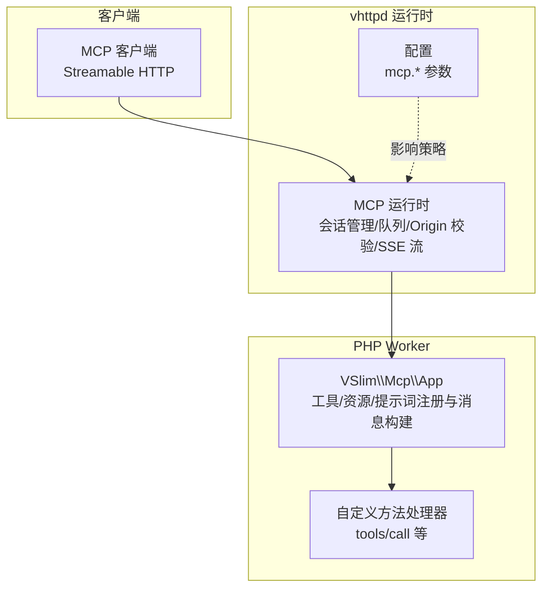
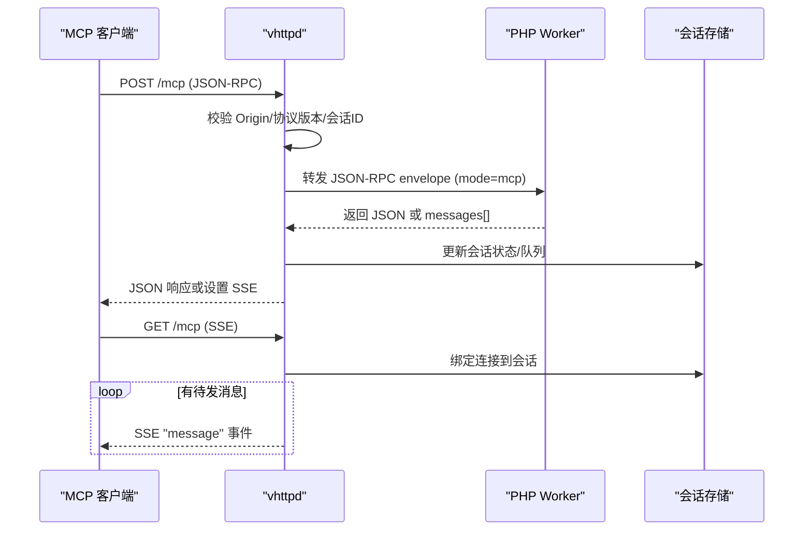
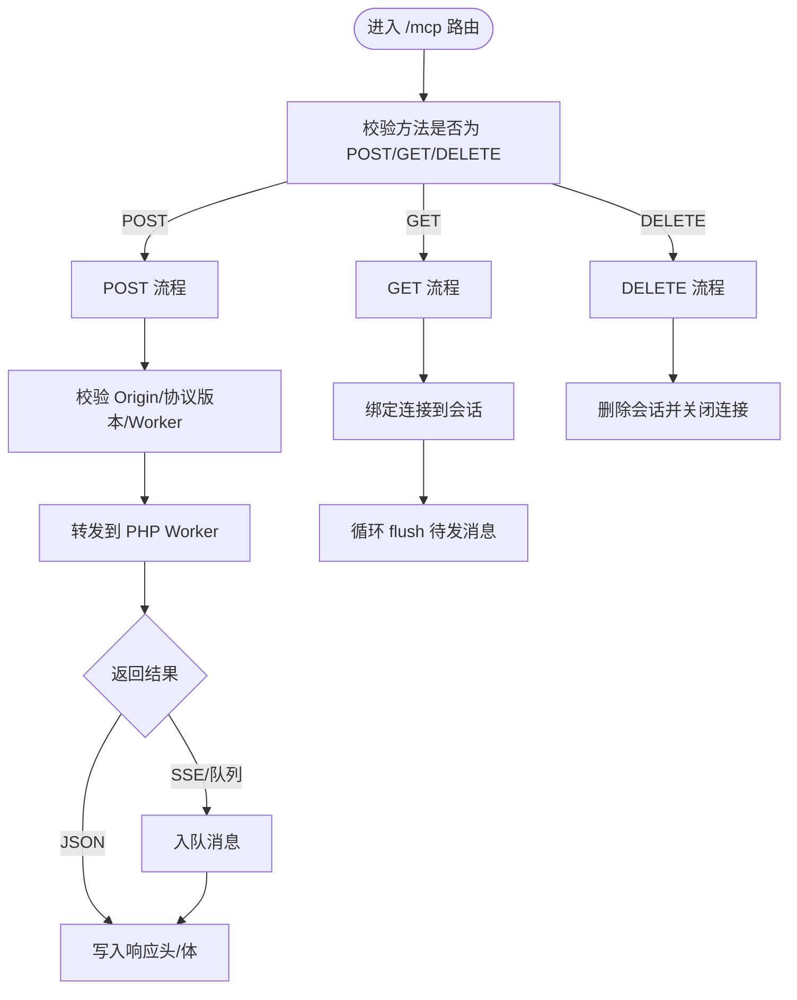
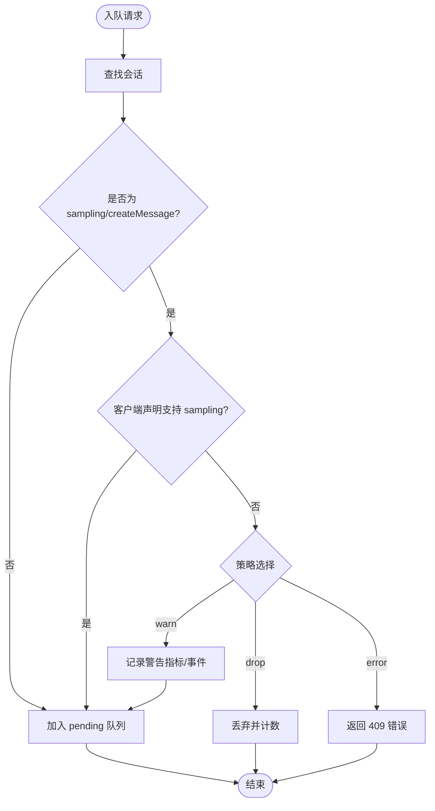
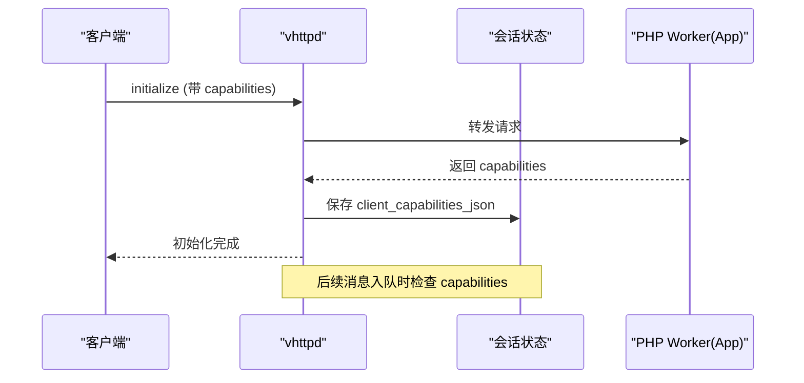
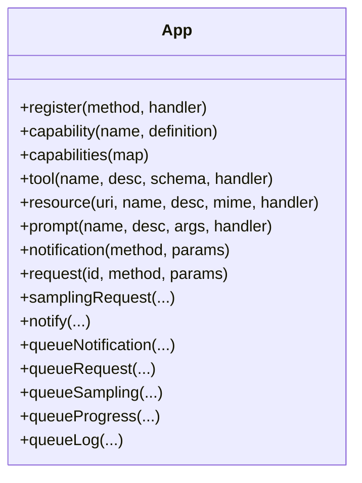
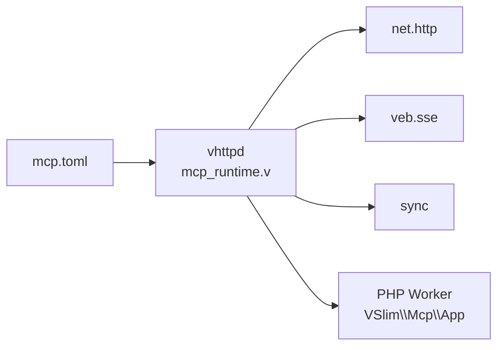

# MCP 运行时

<cite>
**本文引用的文件**
- [mcp_runtime.v](file://src/mcp_runtime.v)
- [MCP.md](file://docs/MCP.md)
- [MCP_APP_API.md](file://docs/MCP_APP_API.md)
- [MCP_CAPABILITY_NEGOTIATION_PLAN.md](file://docs/MCP_CAPABILITY_NEGOTIATION_PLAN.md)
- [MCP_RUNBOOK.md](file://docs/MCP_RUNBOOK.md)
- [MCP_MVP_PLAN.md](file://docs/MCP_MVP_PLAN.md)
- [mcp-app.php](file://examples/mcp-app.php)
- [mcp-feishu-app.php](file://examples/mcp-feishu-app.php)
- [feishu-bot-mcp-app.php](file://examples/feishu-bot-mcp-app.php)
- [mcp.toml](file://examples/config/mcp.toml)
</cite>

## 目录
1. [简介](#简介)
2. [项目结构](#项目结构)
3. [核心组件](#核心组件)
4. [架构总览](#架构总览)
5. [详细组件分析](#详细组件分析)
6. [依赖关系分析](#依赖关系分析)
7. [性能考量](#性能考量)
8. [故障排查指南](#故障排查指南)
9. [结论](#结论)
10. [附录](#附录)

## 简介
本文件系统性阐述 vhttpd 的 MCP（Model Context Protocol）运行时实现，聚焦以下主题：
- MCP 协议在 vhttpd 中的传输与会话管理边界
- 能力协商（能力发现、声明与兼容性检查）的现状与演进计划
- MCP 服务器的注册与管理（会话生命周期、状态监控、故障转移）
- MCP 应用 API（请求/响应格式、消息队列与通知、错误处理）
- 运行时配置项（服务器地址、认证与来源校验、超时与容量限制）
- 与上游服务（如 OpenAI 等）的集成思路（API 转换与参数映射）
- 实际使用示例与最佳实践

## 项目结构
MCP 在 vhttpd 中采用“传输/会话由 vhttpd 负责，方法处理由 PHP worker 负责”的分层设计。关键文件与职责如下：
- 运行时核心：src/mcp_runtime.v
- 文档总览与范围：docs/MCP.md
- 应用 API 说明：docs/MCP_APP_API.md
- 能力协商规划：docs/MCP_CAPABILITY_NEGOTIATION_PLAN.md
- 运行手册：docs/MCP_RUNBOOK.md
- MVP 规划与设计原则：docs/MCP_MVP_PLAN.md
- 示例应用与配置：examples/mcp-app.php、examples/mcp-feishu-app.php、examples/feishu-bot-mcp-app.php、examples/config/mcp.toml

图表来源
- [mcp_runtime.v:1-120](file://src/mcp_runtime.v#L1-L120)
- [MCP.md:29-46](file://docs/MCP.md#L29-L46)

章节来源
- [MCP.md:1-185](file://docs/MCP.md#L1-L185)
- [MCP_MVP_PLAN.md:1-120](file://docs/MCP_MVP_PLAN.md#L1-L120)

## 核心组件
- 会话模型与状态
  - McpSession：存储会话 ID、协议版本、请求/追踪 ID、路径、时间戳、客户端能力 JSON、绑定连接、待发送队列等。
  - AdminMcpSessionSnapshot/AdminMcpRuntimeSnapshot：用于管理端快照与统计。
- 会话生命周期与回收
  - 创建/更新：确保会话上限、逐出最久未活跃者、修剪过期会话。
  - 绑定/解绑连接：GET /mcp 时将 TCP 连接绑定到会话，断开时解绑。
- 队列与策略
  - mcp_session_queue：对消息进行入队；针对 sampling 能力缺失执行软告警/丢弃/报错策略。
  - flush：将队列中的消息以 SSE “message” 事件推送。
- 管理端接口
  - /admin/runtime/mcp：支持分页、过滤、详情展示，暴露会话数、最大会话数、最大待发消息、会话 TTL、允许的 Origin 列表、sampling 能力策略等。

章节来源
- [mcp_runtime.v:8-59](file://src/mcp_runtime.v#L8-L59)
- [mcp_runtime.v:73-159](file://src/mcp_runtime.v#L73-L159)
- [mcp_runtime.v:212-301](file://src/mcp_runtime.v#L212-L301)
- [mcp_runtime.v:331-392](file://src/mcp_runtime.v#L331-L392)

## 架构总览
vhttpd 将 MCP 视为“传输适配器”，职责边界清晰：
- vhttpd
  - 持有 HTTP/SSE 传输
  - 管理 MCP 会话
  - 校验 MCP-Protocol-Version 与 Origin
  - 处理 DELETE /mcp
  - 暴露 /admin/runtime/mcp
- PHP worker
  - 处理 mode=mcp 的请求
  - 返回 JSON-RPC body / 队列的通知/请求 / 会话元数据
- 用户层（VSlim\Mcp\App）
  - 注册 tools/resources/prompts
  - 构造通知/请求/采样请求并入队

图表来源
- [mcp_runtime.v:493-714](file://src/mcp_runtime.v#L493-L714)
- [mcp_runtime.v:721-795](file://src/mcp_runtime.v#L721-L795)

章节来源
- [MCP.md:29-46](file://docs/MCP.md#L29-L46)
- [MCP_MVP_PLAN.md:132-151](file://docs/MCP_MVP_PLAN.md#L132-L151)

## 详细组件分析

### 传输与路由（POST/GET/DELETE）
- POST /mcp
  - 校验：Worker 可用性、Origin 白名单、协议版本、空体。
  - 解析：提取会话 ID、客户端能力 JSON（来自请求体或已有会话）。
  - 分发：转交内核调度至 PHP worker，等待响应。
  - 结果：设置响应头（含 mcp-session-id、mcp-protocol-version），写入队列的消息通过 SSE 或后续 GET /mcp 推送。
- GET /mcp
  - 校验：Origin 白名单、必须的会话 ID。
  - 行为：接管连接，设置 SSE 头，持续 flush 队列消息，发送 keepalive。
- DELETE /mcp
  - 校验：Origin 白名单、会话 ID。
  - 行为：删除会话并关闭连接。

图表来源
- [mcp_runtime.v:493-714](file://src/mcp_runtime.v#L493-L714)
- [mcp_runtime.v:721-795](file://src/mcp_runtime.v#L721-L795)
- [mcp_runtime.v:829-877](file://src/mcp_runtime.v#L829-L877)

章节来源
- [mcp_runtime.v:493-714](file://src/mcp_runtime.v#L493-L714)
- [mcp_runtime.v:721-795](file://src/mcp_runtime.v#L721-L795)
- [mcp_runtime.v:829-877](file://src/mcp_runtime.v#L829-L877)

### 会话与队列管理
- 会话创建/更新
  - 自动生成会话 ID，记录协议版本、请求/追踪 ID、路径、时间戳。
  - 达到最大会话数时逐出最久未活跃者。
- 队列策略
  - 对 sampling/createMessage 的能力检查：warn/drop/error 三种策略。
  - 超限丢弃尾部消息，统计 dropped 数量。
- SSE 输出
  - 以事件名为 “message”，数据为单条 JSON-RPC 字符串。

图表来源
- [mcp_runtime.v:212-301](file://src/mcp_runtime.v#L212-L301)

章节来源
- [mcp_runtime.v:73-159](file://src/mcp_runtime.v#L73-L159)
- [mcp_runtime.v:212-301](file://src/mcp_runtime.v#L212-L301)
- [mcp_runtime.v:394-397](file://src/mcp_runtime.v#L394-L397)

### 能力协商（现状与演进）
- 现状
  - 服务端能力：由 VSlim\App 自动推导 tools/resources/prompts，并可在初始化返回 capabilities。
  - 客户端能力：在 initialize.params.capabilities 中声明，vhttpd 保存为会话快照（JSON 字符串）。
  - sampling：已具备最小软门控（无 capability 时仅记录警告并发出事件）。
- 演进计划
  - 将客户端能力纳入运行时门控，逐步对 sampling、progress、request 等进行软/硬门控。
  - 在管理端展示会话是否完成初始化、保存的能力集合、门控拒绝/警告统计。

图表来源
- [MCP_CAPABILITY_NEGOTIATION_PLAN.md:119-136](file://docs/MCP_CAPABILITY_NEGOTIATION_PLAN.md#L119-L136)
- [mcp_runtime.v:614-623](file://src/mcp_runtime.v#L614-L623)

章节来源
- [MCP_CAPABILITY_NEGOTIATION_PLAN.md:1-262](file://docs/MCP_CAPABILITY_NEGOTIATION_PLAN.md#L1-L262)
- [mcp_runtime.v:480-491](file://src/mcp_runtime.v#L480-L491)

### 应用 API（VSlim\Mcp\App）
- 注册层
  - register：自定义方法
  - capability/capabilities：显式声明服务端能力
  - tool/resource/prompt：注册内置能力并自动接入对应 list/get/call
- 构建层
  - notification/request：构造 JSON-RPC 字符串
  - samplingRequest：构造 sampling/createMessage 请求
- 队列层
  - queuedResult/queueMessages：返回标准结果结构（含 messages[]、session_id、protocol_version）
  - notify/queueNotification：入队通知并返回标准结果
  - queueRequest/queueSampling/queueProgress/queueLog：入队各类消息

图表来源
- [MCP_APP_API.md:41-107](file://docs/MCP_APP_API.md#L41-L107)
- [MCP_APP_API.md:112-154](file://docs/MCP_APP_API.md#L112-L154)
- [MCP_APP_API.md:171-288](file://docs/MCP_APP_API.md#L171-L288)

章节来源
- [MCP_APP_API.md:1-306](file://docs/MCP_APP_API.md#L1-L306)
- [mcp-app.php:1-140](file://examples/mcp-app.php#L1-L140)

### 示例应用与集成
- 基础示例
  - 注册 tools/resources/prompts，提供自定义 debug/* 方法，演示 notify/queueSampling/queueProgress/queueLog 的使用。
- 飞书集成示例
  - 将飞书上游能力通过 McpToolset 注册到 VSlim\Mcp\App，形成 MCP 与飞书消息通道的桥接。
- 运行手册
  - 包含 initialize、提取会话 ID、SSE 打开、队列通知与采样请求、软告警指标变化、会话删除等步骤。

章节来源
- [mcp-app.php:1-140](file://examples/mcp-app.php#L1-L140)
- [mcp-feishu-app.php:1-23](file://examples/mcp-feishu-app.php#L1-L23)
- [feishu-bot-mcp-app.php:1-157](file://examples/feishu-bot-mcp-app.php#L1-L157)
- [MCP_RUNBOOK.md:1-291](file://docs/MCP_RUNBOOK.md#L1-L291)

## 依赖关系分析
- vhttpd 与 PHP Worker 的契约
  - vhttpd 仅负责传输/会话/队列；具体方法处理由 PHP worker 完成。
- 内部依赖
  - net.http：HTTP 请求解析与响应写入
  - veb.sse：SSE 头与事件格式
  - sync：互斥锁、会话注册与清理
- 配置依赖
  - mcp.* 项影响会话上限、待发消息上限、会话 TTL、允许的 Origin 列表、sampling 能力策略。

图表来源
- [MCP_MVP_PLAN.md:61-126](file://docs/MCP_MVP_PLAN.md#L61-L126)
- [mcp.toml:24-32](file://examples/config/mcp.toml#L24-L32)

章节来源
- [MCP_MVP_PLAN.md:57-126](file://docs/MCP_MVP_PLAN.md#L57-L126)
- [mcp.toml:24-32](file://examples/config/mcp.toml#L24-L32)

## 性能考量
- 会话与队列容量控制
  - max_sessions：限制活动会话数量，超过则逐出最久未活跃者。
  - max_pending_messages：超出阈值丢弃尾部消息，降低内存占用。
  - session_ttl_seconds：TTL 过期自动清理。
- SSE 推送
  - 采用 keepalive 心跳维持长连接，flush 时按序推送队列消息。
- Origin 与协议版本校验
  - 防止跨域滥用与协议不匹配导致的额外开销。

章节来源
- [mcp_runtime.v:73-114](file://src/mcp_runtime.v#L73-L114)
- [mcp_runtime.v:331-392](file://src/mcp_runtime.v#L331-L392)
- [mcp_runtime.v:805-816](file://src/mcp_runtime.v#L805-L816)

## 故障排查指南
- 常见错误与定位
  - 405 Method Not Allowed：仅支持 POST/GET/DELETE。
  - 501 Not Implemented：Worker 未配置或方法未实现。
  - 403 Forbidden Origin：Origin 不在允许列表。
  - 400/404 缺失/未知会话 ID：GET /mcp 未携带正确 Mcp-Session-Id。
  - 409 Conflict：由于 sampling 能力策略拒绝入队。
- 指标与可观测性
  - mcp_sampling_capability_warnings_total：sampling 能力缺失软告警计数。
  - mcp_sampling_capability_dropped_total：策略为 drop 时丢弃计数。
  - mcp_sampling_capability_errors_total：策略为 error 时拒绝计数。
  - /admin/runtime 与 /admin/runtime/mcp：查看会话总数、详情、配置与统计。
- 运行手册步骤
  - 通过 curl 步骤验证 initialize、SSE、队列通知、采样请求与软告警指标变化。

章节来源
- [mcp_runtime.v:500-543](file://src/mcp_runtime.v#L500-L543)
- [mcp_runtime.v:624-645](file://src/mcp_runtime.v#L624-L645)
- [MCP_RUNBOOK.md:218-291](file://docs/MCP_RUNBOOK.md#L218-L291)

## 结论
vhttpd 将 MCP 的实现聚焦在可靠的传输与会话管理上，配合 PHP Worker 的方法处理与 VSlim\Mcp\App 的高层 API，形成清晰的职责边界。能力协商尚处于演进阶段，当前已对 sampling 提供软门控与可观测性。通过配置项与管理端接口，用户可以精细控制会话容量、队列长度、会话 TTL 与 Origin 白名单，满足本地开发与生产部署的安全与性能需求。

## 附录

### 配置选项（节选）
- [mcp].max_sessions：最大会话数
- [mcp].max_pending_messages：每个会话最大待发消息数
- [mcp].session_ttl_seconds：会话 TTL（秒）
- [mcp].allowed_origins：允许的 Origin 列表
- [mcp].sampling_capability_policy：sampling 能力策略（warn/drop/error）

章节来源
- [mcp.toml:24-32](file://examples/config/mcp.toml#L24-L32)
- [mcp_runtime.v:65-71](file://src/mcp_runtime.v#L65-L71)

### MCP 与上游服务集成思路
- 采样请求（sampling/createMessage）由客户端发起，服务端通过队列将其转发至客户端，不直接执行模型推理。
- 与 OpenAI 等上游的集成可通过 PHP Worker 的自定义方法实现：
  - 将 MCP 请求映射为上游 API 请求
  - 将上游响应转换为 MCP 通知/结果
  - 使用 App::queueNotification/queueProgress/queueLog 等进行反馈
- 注意参数映射与错误处理，确保符合 MCP JSON-RPC 规范与 SSE 事件格式。

章节来源
- [MCP.md:47-70](file://docs/MCP.md#L47-L70)
- [MCP_APP_API.md:128-154](file://docs/MCP_APP_API.md#L128-L154)