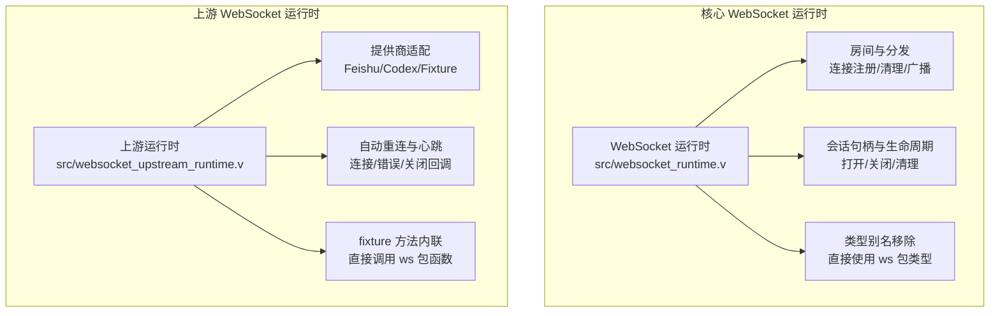
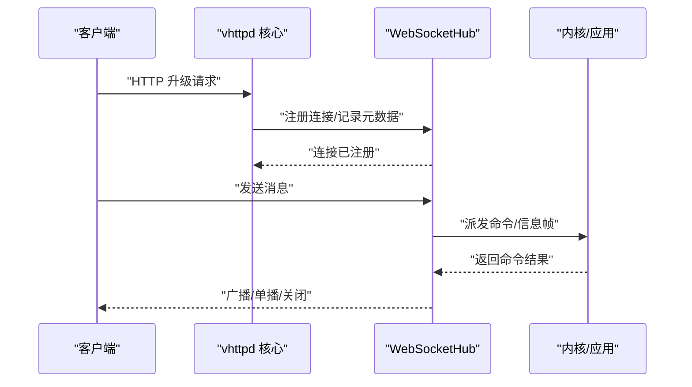
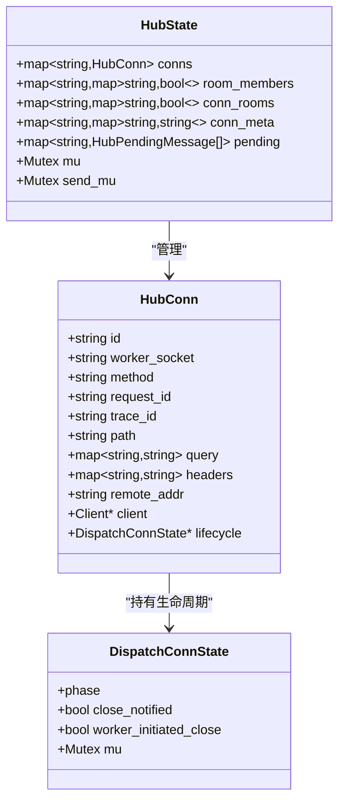
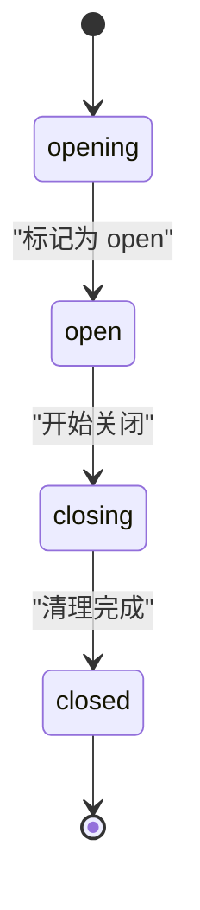
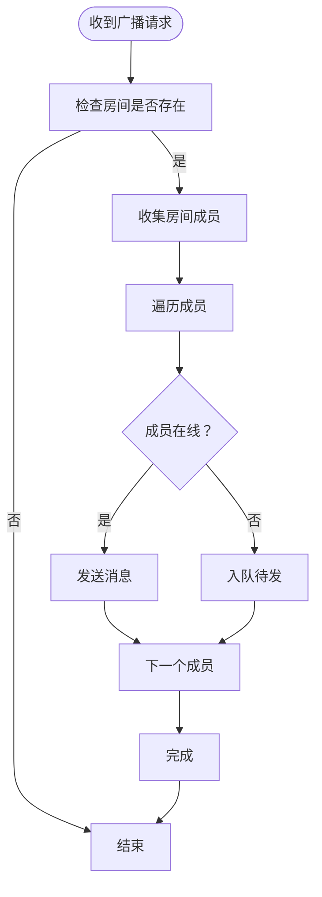
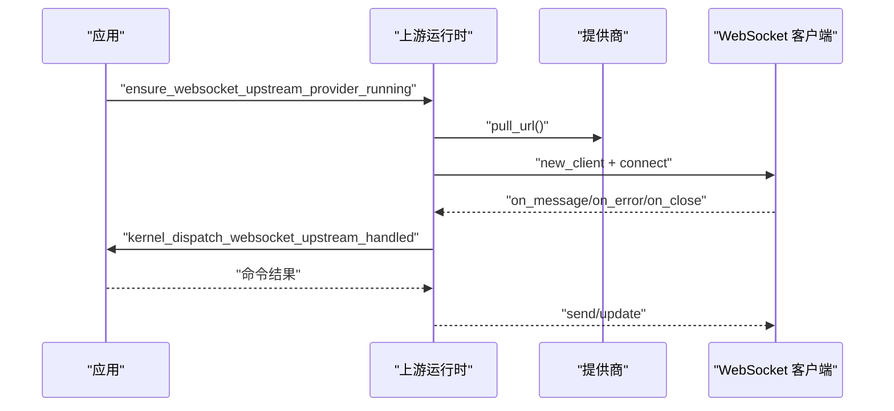
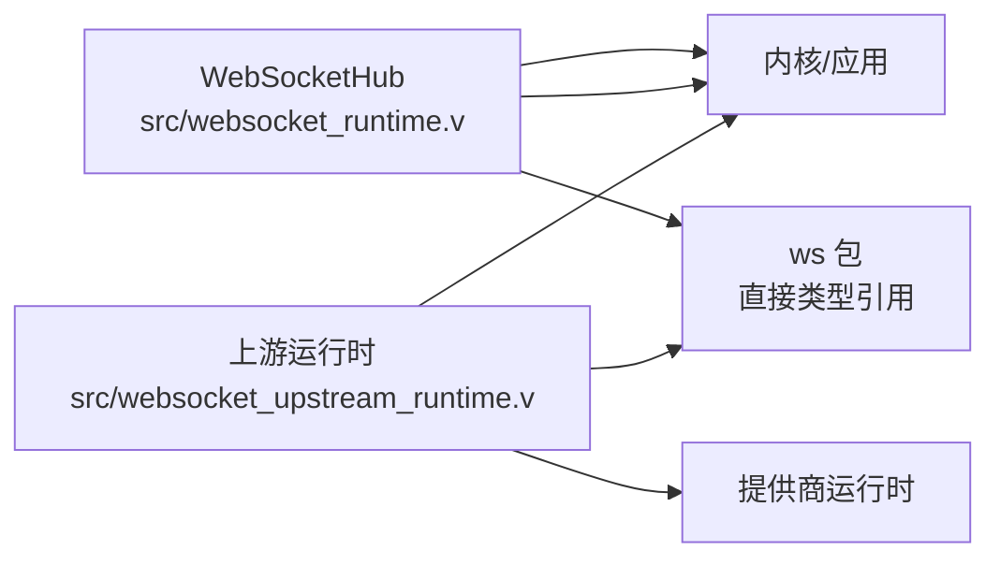
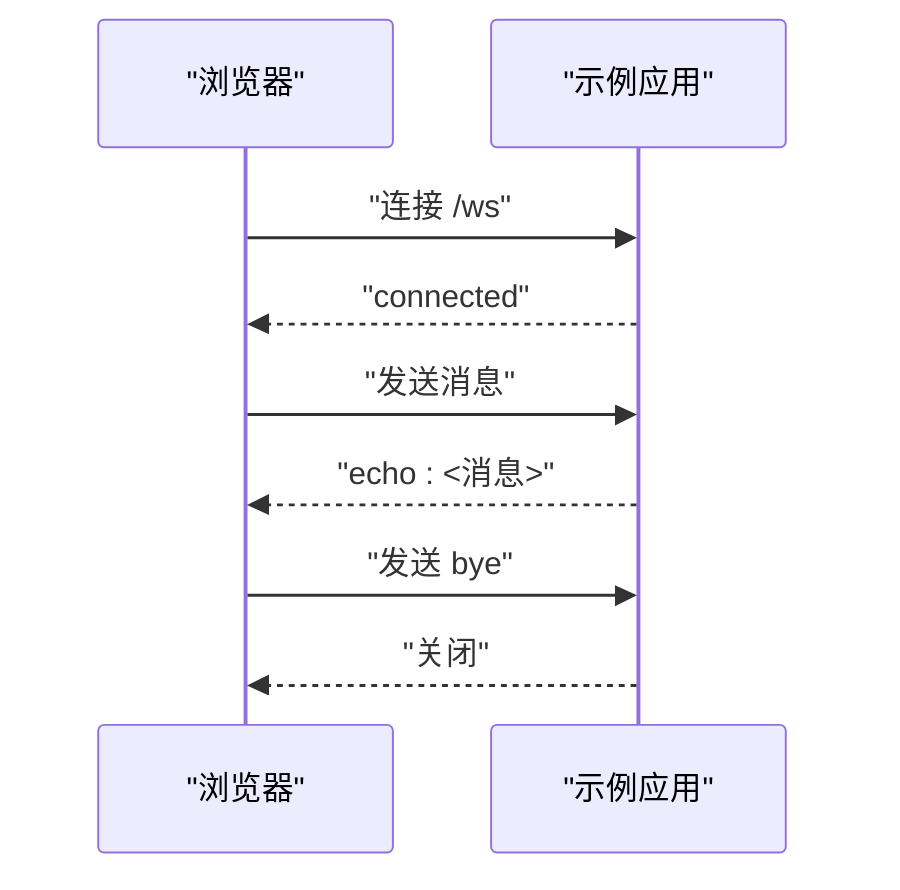

# WebSocket 运行时

<cite>
**本文引用的文件**
- [websocket_runtime.v](file://src/websocket_runtime.v)
- [websocket_upstream_runtime.v](file://src/websocket_upstream_runtime.v)
- [websocket_echo_app.php](file://examples/websocket_echo_app.php)
- [websocket_echo_app.js](file://examples/public/websocket_echo_app.js)
- [WEBSOCKET_EVENT_BUS_PLAN.md](file://docs/WEBSOCKET_EVENT_BUS_PLAN.md)
- [WEBSOCKET_MESSAGE_DISPATCH_PLAN.md](file://docs/WEBSOCKET_MESSAGE_DISPATCH_PLAN.md)
- [WEBSOCKET_MVP_PLAN.md](file://docs/WEBSOCKET_MVP_PLAN.md)
- [WEBSOCKET_PHASE2_IMPLEMENTATION_PLAN.md](file://docs/WEBSOCKET_PHASE2_IMPLEMENTATION_PLAN.md)
- [WEBSOCKET_UPSTREAM_PLAN.md](file://docs/WEBSOCKET_UPSTREAM_PLAN.md)
- [types.v](file://src/ws/types.v)
- [runtime.v](file://src/ws/runtime.v)
- [hub_runtime.v](file://src/ws/hub_runtime.v)
- [upstream_runtime.v](file://src/ws/upstream_runtime.v)
</cite>

## 更新摘要
**变更内容**
- 移除了未使用的类型别名（WebSocketDispatchConnState、HubConn、HubPendingMessage 等）
- 内联了 fixture 委托方法，直接调用 ws 包中的函数
- 更新了函数签名使用直接的 ws 包类型，简化了类型引用
- 优化了代码结构，减少了中间层抽象

## 目录
1. [简介](#简介)
2. [项目结构](#项目结构)
3. [核心组件](#核心组件)
4. [架构总览](#架构总览)
5. [详细组件分析](#详细组件分析)
6. [依赖关系分析](#依赖关系分析)
7. [性能考虑](#性能考虑)
8. [故障排查指南](#故障排查指南)
9. [结论](#结论)
10. [附录](#附录)

## 简介
本文件为 vhttpd WebSocket 运行时的深度技术文档，覆盖以下主题：
- WebSocket 连接管理：握手、建立、断开流程与生命周期控制
- 房间系统：房间创建、成员管理、消息广播与派发
- 在线状态与心跳：用户状态更新、心跳检测与离线处理
- 上游运行时：与外部服务的长连接管理与事件转发
- 会话句柄：连接状态维护与会话持久化
- API 使用示例：客户端连接、消息发送与事件监听
- 优化与安全：连接优化、性能调优与安全配置建议

## 项目结构
WebSocket 运行时由两部分组成：
- 核心 WebSocket 运行时（本地会话与房间分发）
- WebSocket 上游运行时（与外部服务的长连接与事件桥接）

**图表来源**
- [websocket_runtime.v:1-105](file://src/websocket_runtime.v#L1-L105)
- [websocket_upstream_runtime.v:1-887](file://src/websocket_upstream_runtime.v#L1-L887)

**章节来源**
- [websocket_runtime.v:1-105](file://src/websocket_runtime.v#L1-L105)
- [websocket_upstream_runtime.v:1-887](file://src/websocket_upstream_runtime.v#L1-L887)

## 核心组件
- WebSocketHub：集中管理连接、房间、元数据与待发消息队列
- 连接生命周期：opening/open/closing/closed 四阶段状态机
- 房间系统：基于连接 ID 的房间成员映射与房间到成员映射
- 上游运行时：按提供商拉取连接地址、建立连接、消息处理与自动重连
- 类型系统：直接使用 ws 包中的类型定义，移除了中间类型别名层

**章节来源**
- [websocket_runtime.v:10-15](file://src/websocket_runtime.v#L10-L15)
- [websocket_runtime.v:44-58](file://src/websocket_runtime.v#L44-L58)
- [websocket_runtime.v:516-558](file://src/websocket_runtime.v#L516-L558)
- [websocket_upstream_runtime.v:16-24](file://src/websocket_upstream_runtime.v#L16-L24)

## 架构总览
WebSocket 运行时在 vhttpd 中承担两类职责：
- 本地会话与房间：负责 HTTP 升级后的 WebSocket 会话管理、房间加入/离开、消息广播与派发
- 上游会话：负责与外部服务（如 Feishu、Codex）建立长连接，接收上游事件并转发给内核或应用

**图表来源**
- [websocket_runtime.v:323-342](file://src/websocket_runtime.v#L323-L342)
- [websocket_runtime.v:785-849](file://src/websocket_runtime.v#L785-L849)

## 详细组件分析

### 组件一：WebSocketHub 与房间系统
- 数据结构
  - HubConn：保存连接元信息（方法、路径、查询、头、远端地址、请求/追踪 ID、生命周期状态）
  - 房间映射：房间名 -> 成员集合；成员 -> 房间集合
  - 元数据：每个连接可附加键值对元数据
  - 待发队列：连接处于 opening 阶段时的消息缓存
- 关键能力
  - 注册/注销连接
  - 加入/离开房间
  - 设置/清除元数据
  - 发送消息（单播/广播）、派发广播（触发内核命令）
  - 关闭目标连接（带码与原因）

**图表来源**
- [types.v:107-121](file://src/ws/types.v#L107-L121)
- [types.v:17-23](file://src/ws/types.v#L17-L23)
- [types.v:345-365](file://src/ws/types.v#L345-L365)

**章节来源**
- [websocket_runtime.v:298-321](file://src/websocket_runtime.v#L298-L321)
- [websocket_runtime.v:323-342](file://src/websocket_runtime.v#L323-L342)
- [websocket_runtime.v:516-558](file://src/websocket_runtime.v#L516-L558)
- [websocket_runtime.v:560-636](file://src/websocket_runtime.v#L560-L636)
- [websocket_runtime.v:638-750](file://src/websocket_runtime.v#L638-L750)
- [websocket_runtime.v:752-783](file://src/websocket_runtime.v#L752-L783)

### 组件二：连接生命周期与状态机
- 阶段定义：opening/open/closing/closed
- 状态转换
  - 打开：opening -> open
  - 关闭：open/closing -> closing；随后清理
- 并发安全：通过互斥锁保护状态变更与读取

**图表来源**
- [types.v:9-14](file://src/ws/types.v#L9-L14)
- [types.v:49-103](file://src/ws/types.v#L49-L103)

**章节来源**
- [types.v:49-103](file://src/ws/types.v#L49-L103)

### 组件三：消息派发与广播
- 单播：ws_hub_send_to
- 广播：ws_hub_broadcast（直接写入/入队）
- 派发广播：ws_hub_broadcast_dispatch（向每个成员派发 info 帧，执行命令并处理关闭/失败）

**图表来源**
- [websocket_runtime.v:638-750](file://src/websocket_runtime.v#L638-L750)
- [websocket_runtime.v:560-636](file://src/websocket_runtime.v#L560-L636)

**章节来源**
- [websocket_runtime.v:560-636](file://src/websocket_runtime.v#L560-L636)
- [websocket_runtime.v:638-750](file://src/websocket_runtime.v#L638-L750)

### 组件四：上游运行时与外部服务桥接
- 提供商类型：Feishu、Fixture、Codex
- 自动启动：根据配置决定是否自动启动上游实例
- 连接管理：拉取 URL、建立连接、设置回调（消息/错误/关闭）
- 心跳与后处理：Feishu 心跳循环、Codex 握手与 ping 循环
- 命令执行：将上游事件转换为内核命令并执行

**图表来源**
- [websocket_upstream_runtime.v:746-769](file://src/websocket_upstream_runtime.v#L746-L769)
- [websocket_upstream_runtime.v:771-823](file://src/websocket_upstream_runtime.v#L771-L823)
- [websocket_upstream_runtime.v:517-539](file://src/websocket_upstream_runtime.v#L517-L539)
- [websocket_upstream_runtime.v:613-663](file://src/websocket_upstream_runtime.v#L613-L663)

**章节来源**
- [websocket_upstream_runtime.v:127-203](file://src/websocket_upstream_runtime.v#L127-L203)
- [websocket_upstream_runtime.v:476-515](file://src/websocket_upstream_runtime.v#L476-L515)
- [websocket_upstream_runtime.v:517-539](file://src/websocket_upstream_runtime.v#L517-L539)
- [websocket_upstream_runtime.v:613-663](file://src/websocket_upstream_runtime.v#L613-L663)
- [websocket_upstream_runtime.v:746-823](file://src/websocket_upstream_runtime.v#L746-L823)

### 组件五：会话句柄与持久化
- 会话句柄：承载连接标识、请求/追踪 ID、路径、查询、头等上下文
- 生命周期钩子：打开、关闭、清理阶段的状态维护
- 持久化：通过内核与应用层的命令与事件实现状态落盘（例如房间、元数据）

**章节来源**
- [websocket_runtime.v:10-42](file://src/websocket_runtime.v#L10-L42)
- [websocket_runtime.v:173-296](file://src/websocket_runtime.v#L173-L296)

### 组件六：类型系统重构
- 类型别名移除：WebSocketDispatchConnState、HubConn、HubPendingMessage 等类型别名已被移除
- 直接使用 ws 包类型：所有函数签名直接使用 ws 包中的类型定义
- fixture 方法内联：fixture_websocket_emit 等方法直接调用 ws 包中的对应函数
- 简化导入：减少了中间层抽象，直接从 ws 包导入所需类型

**更新** 仅保留了必要的 WebSocketUpstreamSendRequest 类型别名，用于上游运行时的统一请求格式

**章节来源**
- [websocket_runtime.v:7-15](file://src/websocket_runtime.v#L7-L15)
- [websocket_upstream_runtime.v:16-24](file://src/websocket_upstream_runtime.v#L16-L24)
- [websocket_runtime.v:112-115](file://src/websocket_runtime.v#L112-L115)

## 依赖关系分析
- WebSocketHub 依赖于内核的 WebSocket 派发框架（WorkerWebSocketFrame），用于广播与派发
- 上游运行时依赖提供商运行时（Feishu/Codex/Fixture）以获取连接 URL、执行命令
- 两者均通过互斥锁保证并发安全
- 类型系统直接依赖 ws 包，移除了中间类型别名层

**图表来源**
- [websocket_runtime.v:702-750](file://src/websocket_runtime.v#L702-L750)
- [websocket_upstream_runtime.v:541-575](file://src/websocket_upstream_runtime.v#L541-L575)

**章节来源**
- [websocket_runtime.v:702-750](file://src/websocket_runtime.v#L702-L750)
- [websocket_upstream_runtime.v:541-575](file://src/websocket_upstream_runtime.v#L541-L575)

## 性能考虑
- 并发模型
  - 使用互斥锁保护连接表、房间映射与待发队列，避免竞态
  - 发送路径采用独立发送锁，减少阻塞
- 广播策略
  - 在线成员直接发送，离线成员入队等待 flush
  - 广播派发会逐个成员派发 info 帧，注意大规模房间的 CPU 开销
- 上游连接
  - 自动重连与指数退避（由提供商实现）降低抖动
  - 心跳循环与握手后处理确保长连接稳定性
- 类型系统优化
  - 移除类型别名减少了内存占用和查找开销
  - 直接类型引用提高了编译时类型检查效率

**章节来源**
- [websocket_runtime.v:560-636](file://src/websocket_runtime.v#L560-L636)
- [websocket_upstream_runtime.v:771-823](file://src/websocket_upstream_runtime.v#L771-L823)

## 故障排查指南
- 连接无法建立
  - 检查 HTTP 升级是否成功，确认连接已注册
  - 查看连接生命周期状态是否停留在 opening
- 消息未送达
  - 若连接处于 opening，消息会被入队；确认后续 flush 是否执行
  - 广播时排除目标 ID 是否正确
- 上游连接异常
  - 查看连接/断开事件日志，确认提供商可用性与 URL 正确性
  - 检查错误回调与自动重连逻辑是否生效
- 类型系统问题
  - 确认所有函数签名都使用 ws 包中的直接类型定义
  - 检查 fixture 方法是否正确内联到 ws 包函数
- 管理接口
  - 使用管理端点查看活动连接、房间快照与上游活动记录

**章节来源**
- [websocket_runtime.v:360-390](file://src/websocket_runtime.v#L360-L390)
- [websocket_runtime.v:851-978](file://src/websocket_runtime.v#L851-L978)
- [websocket_upstream_runtime.v:825-909](file://src/websocket_upstream_runtime.v#L825-L909)

## 结论
vhttpd 的 WebSocket 运行时提供了完整的本地会话与房间管理能力，并通过上游运行时与外部服务进行稳定桥接。其状态机与并发控制保障了高可用，同时通过派发与广播机制实现了灵活的消息路由。最新的代码清理和重构进一步优化了类型系统，移除了不必要的抽象层，提高了代码的可维护性和性能。结合管理接口与日志，可有效支撑生产环境的运维与排障。

## 附录

### WebSocket API 使用示例
- 客户端连接
  - 使用浏览器原生 WebSocket 或示例脚本连接 ws://host:port/ws
  - 示例页面与脚本位于 examples/websocket_echo_app.php 与 examples/public/websocket_echo_app.js
- 消息发送
  - 连接建立后，服务端会回显消息；支持发送"bye"触发关闭
- 事件监听
  - 监听 open/message/close/error 事件，实时反馈连接状态

**图表来源**
- [websocket_echo_app.php:224-238](file://examples/websocket_echo_app.php#L224-L238)
- [websocket_echo_app.js:34-68](file://examples/public/websocket_echo_app.js#L34-L68)

**章节来源**
- [websocket_echo_app.php:182-240](file://examples/websocket_echo_app.php#L182-L240)
- [websocket_echo_app.js:1-92](file://examples/public/websocket_echo_app.js#L1-L92)

### 文档参考
- 事件总线与消息派发规划
  - [WEBSOCKET_EVENT_BUS_PLAN.md](file://docs/WEBSOCKET_EVENT_BUS_PLAN.md)
  - [WEBSOCKET_MESSAGE_DISPATCH_PLAN.md](file://docs/WEBSOCKET_MESSAGE_DISPATCH_PLAN.md)
- WebSocket 运行时演进计划
  - [WEBSOCKET_MVP_PLAN.md](file://docs/WEBSOCKET_MVP_PLAN.md)
  - [WEBSOCKET_PHASE2_IMPLEMENTATION_PLAN.md](file://docs/WEBSOCKET_PHASE2_IMPLEMENTATION_PLAN.md)
- 上游运行时计划
  - [WEBSOCKET_UPSTREAM_PLAN.md](file://docs/WEBSOCKET_UPSTREAM_PLAN.md)