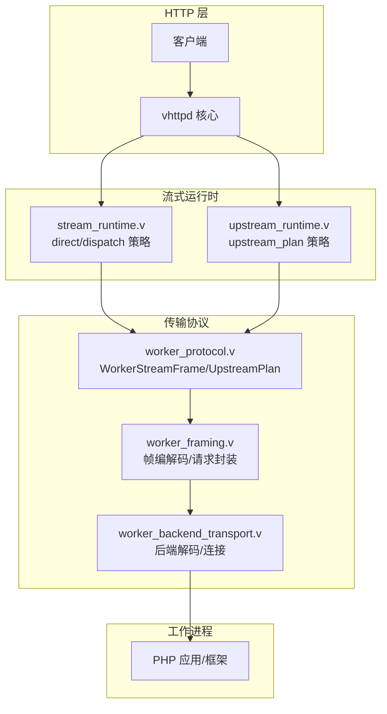
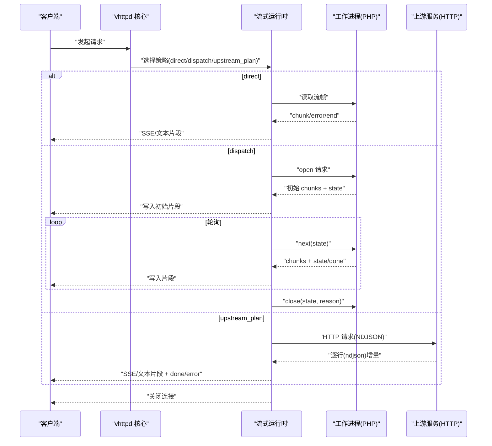
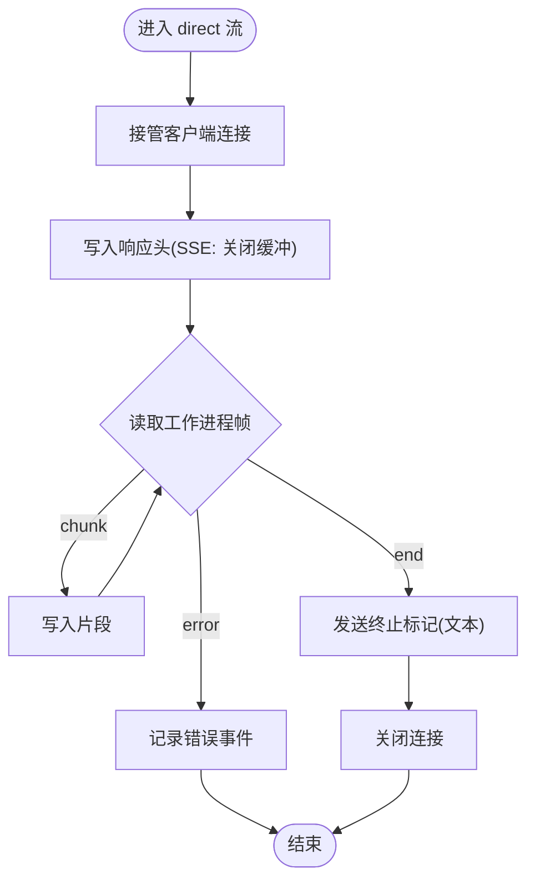
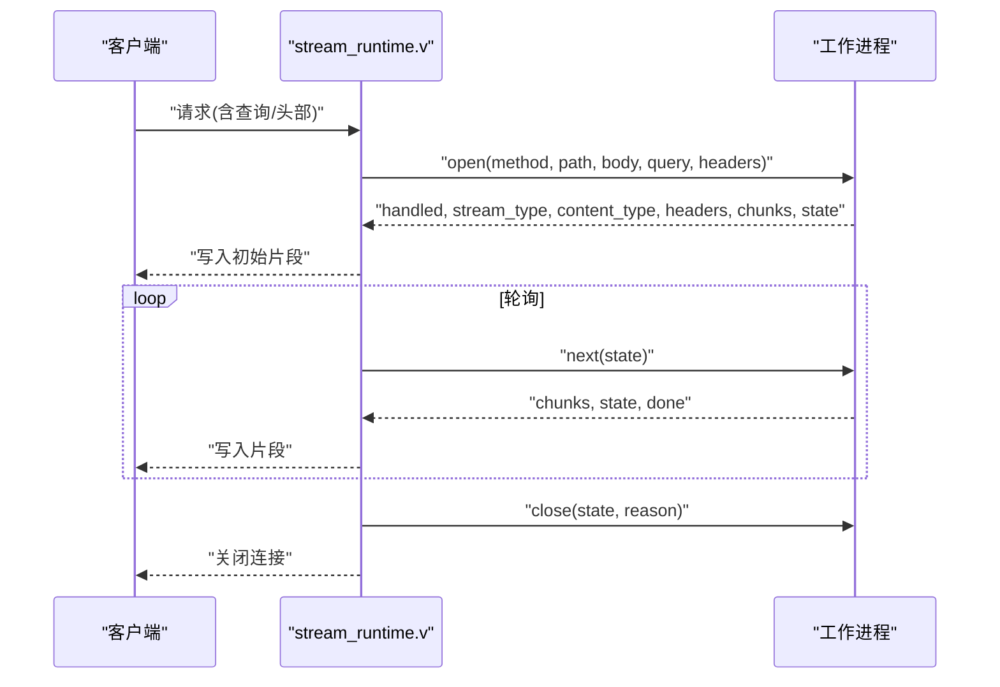
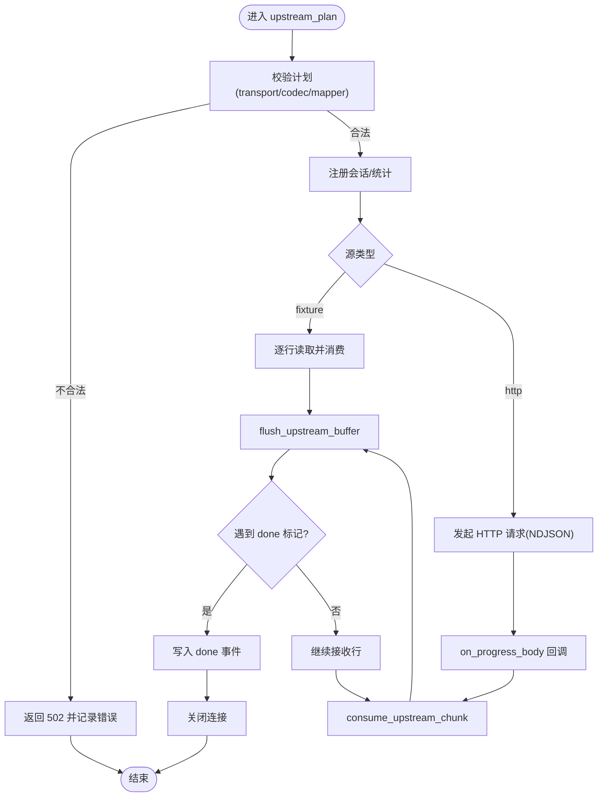
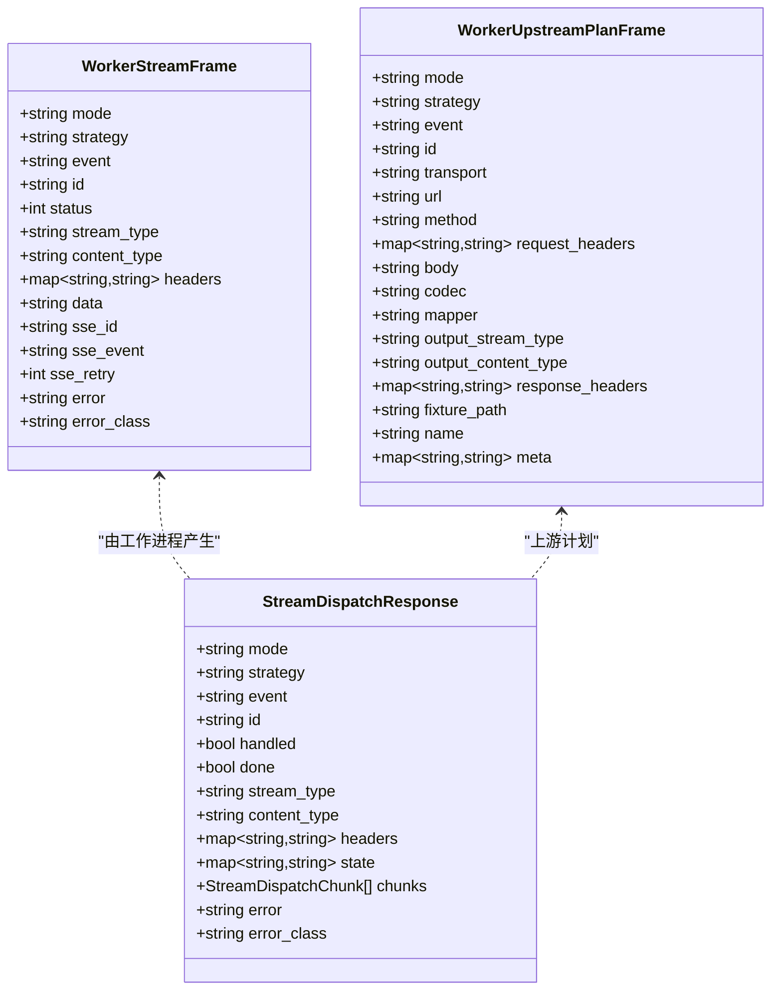

# 流式运行时

<cite>
**本文引用的文件**
- [stream_runtime.v](file://src/stream_runtime.v)
- [upstream_runtime.v](file://src/upstream_runtime.v)
- [worker_protocol.v](file://src/transport/worker_protocol.v)
- [worker_framing.v](file://src/transport/worker_framing.v)
- [worker_backend_transport.v](file://src/worker_backend_transport.v)
- [ai-stream-app.php](file://examples/ai-stream-app.php)
- [stream-dispatch-app.php](file://examples/stream-dispatch-app.php)
- [README.md](file://README.md)
</cite>

## 目录
1. [简介](#简介)
2. [项目结构](#项目结构)
3. [核心组件](#核心组件)
4. [架构总览](#架构总览)
5. [详细组件分析](#详细组件分析)
6. [依赖关系分析](#依赖关系分析)
7. [性能考量](#性能考量)
8. [故障排除指南](#故障排除指南)
9. [结论](#结论)
10. [附录](#附录)

## 简介
本文件系统性阐述 vhttpd 的流式运行时设计与实现，覆盖三大流式策略：direct（直接）、dispatch（调度）、upstream_plan（上游计划），并深入解析 SSE（Server-Sent Events）与文本流的处理机制、缓冲管理、客户端连接生命周期、错误恢复与可观测性。同时提供 PHP 应用侧的使用示例与最佳实践，帮助开发者快速集成与排障。

## 项目结构
围绕流式运行时的关键模块与文件如下：
- 运行时入口与策略分发：src/stream_runtime.v
- 上游计划执行器：src/upstream_runtime.v
- 工作线程协议与帧定义：src/transport/worker_protocol.v
- 帧编解码与请求封装：src/transport/worker_framing.v
- 后端传输与解码：src/worker_backend_transport.v
- 示例应用（PHP）：examples/ai-stream-app.php、examples/stream-dispatch-app.php
- 顶层说明与统一 API 约定：README.md

图表来源
- [stream_runtime.v:11-244](file://src/stream_runtime.v#L11-L244)
- [upstream_runtime.v:11-331](file://src/upstream_runtime.v#L11-L331)
- [worker_protocol.v:1-111](file://src/transport/worker_protocol.v#L1-L111)
- [worker_framing.v:122-172](file://src/transport/worker_framing.v#L122-L172)
- [worker_backend_transport.v:87-118](file://src/worker_backend_transport.v#L87-L118)

章节来源
- [stream_runtime.v:1-245](file://src/stream_runtime.v#L1-L245)
- [upstream_runtime.v:1-428](file://src/upstream_runtime.v#L1-L428)
- [worker_protocol.v:1-111](file://src/transport/worker_protocol.v#L1-L111)
- [worker_framing.v:122-172](file://src/transport/worker_framing.v#L122-L172)
- [worker_backend_transport.v:87-118](file://src/worker_backend_transport.v#L87-L118)

## 核心组件
- direct 策略
  - 直接从工作进程读取流帧，按 SSE 或文本模式写回客户端。
  - 支持错误帧与结束帧的处理，保证连接正确关闭。
- dispatch 策略
  - 将长连接的持续写入拆分为 open/next/close 轮询，工作进程仅在短生命周期内处理。
  - 支持 SSE 与文本两种输出类型，自动注入 x-accel-buffering=no（SSE）。
- upstream_plan 策略
  - 以“上游计划”形式代理外部 HTTP 源，按 ndjson 行增量解析并映射到 SSE/文本。
  - 提供 fixture 回放能力，支持错误注入与完成标记。

章节来源
- [stream_runtime.v:11-119](file://src/stream_runtime.v#L11-L119)
- [stream_runtime.v:142-244](file://src/stream_runtime.v#L142-L244)
- [upstream_runtime.v:205-331](file://src/upstream_runtime.v#L205-L331)

## 架构总览
下图展示 vhttpd 在不同流式策略下的控制流与数据流：

图表来源
- [stream_runtime.v:11-244](file://src/stream_runtime.v#L11-L244)
- [upstream_runtime.v:186-203](file://src/upstream_runtime.v#L186-L203)
- [worker_protocol.v:12-92](file://src/transport/worker_protocol.v#L12-L92)

## 详细组件分析

### direct 策略（直接流）
- 典型场景：工作进程直接以流式帧推送数据，无需持久状态。
- 关键点
  - 接管客户端连接，设置必要的响应头（如 x-accel-buffering=no 对 SSE）。
  - 循环读取工作进程帧，区分 chunk、error、end 三类事件。
  - 文本模式在结束时发送终止标记，SSE 模式保持连接直至显式关闭。
- 错误处理
  - 遇到 error 帧时记录错误事件并中断循环；end 帧用于优雅结束。

图表来源
- [stream_runtime.v:11-119](file://src/stream_runtime.v#L11-L119)

章节来源
- [stream_runtime.v:11-119](file://src/stream_runtime.v#L11-L119)

### dispatch 策略（调度流）
- 典型场景：需要在 vhttpd 中维持 SSE 连接，而工作进程仅处理 open/next/close 短生命周期调用。
- 关键点
  - open 成功后立即写入初始 chunks，并根据 stream_type 决定是否启用 SSE 缓冲禁用。
  - 主循环通过 next(state) 获取后续片段，直到 done=true。
  - 最终调用 close(state, reason) 完成交互。
- 错误处理
  - open/next 返回失败时，记录错误事件并尝试最佳努力关闭。

图表来源
- [stream_runtime.v:142-244](file://src/stream_runtime.v#L142-L244)
- [worker_protocol.v:30-71](file://src/transport/worker_protocol.v#L30-L71)

章节来源
- [stream_runtime.v:142-244](file://src/stream_runtime.v#L142-L244)
- [worker_protocol.v:30-71](file://src/transport/worker_protocol.v#L30-L71)

### upstream_plan 策略（上游计划）
- 典型场景：将外部 HTTP 源（如大模型推理服务）的 NDJSON 流转换为 SSE/文本。
- 关键点
  - 校验上游计划：仅支持 http 传输、ndjson 编解码、特定 mapper。
  - 使用回调 on_progress_body 逐块消费上游响应，按行解析并提取字段。
  - 支持 fixture 回放，便于本地调试与压测。
  - 自动注入 SSE 事件名与 done/error 片段。
- 数据路径
  - NDJSON 行 -> 解析 -> 字段提取 -> 映射到 SSE/文本 -> 输出 -> flush 缓冲。

图表来源
- [upstream_runtime.v:165-203](file://src/upstream_runtime.v#L165-L203)
- [upstream_runtime.v:130-141](file://src/upstream_runtime.v#L130-L141)
- [upstream_runtime.v:205-331](file://src/upstream_runtime.v#L205-L331)

章节来源
- [upstream_runtime.v:165-203](file://src/upstream_runtime.v#L165-L203)
- [upstream_runtime.v:130-141](file://src/upstream_runtime.v#L130-L141)
- [upstream_runtime.v:205-331](file://src/upstream_runtime.v#L205-L331)

### SSE 与文本流处理细节
- SSE 处理
  - 设置 content-type 为 text/event-stream，必要时禁用代理缓冲。
  - 将工作进程帧或上游行映射为 SSE 消息，支持自定义事件名、重试间隔与消息 ID。
- 文本流处理
  - 直通模式下按原始数据写入，结束时发送终止标记。
  - upstream_plan 文本模式下同样遵循终止规则。
- 缓冲与超时
  - direct/dispatch：写/读超时设为无限，确保长连接稳定。
  - upstream_plan：设置合理的停止复制阈值，避免内存膨胀。

章节来源
- [stream_runtime.v:11-119](file://src/stream_runtime.v#L11-L119)
- [stream_runtime.v:142-244](file://src/stream_runtime.v#L142-L244)
- [upstream_runtime.v:225-227](file://src/upstream_runtime.v#L225-L227)
- [upstream_runtime.v:198-199](file://src/upstream_runtime.v#L198-L199)

### PHP 应用侧集成与示例
- 统一流响应对象
  - README 中明确约定任意框架均可返回统一的流响应对象，以实现一致的传输契约。
- 示例应用
  - ai-stream-app.php：演示 passthrough 文本流与 SSE 两种模式。
  - stream-dispatch-app.php：演示基于 dispatch 的 SSE 流，前端使用 EventSource 订阅。

章节来源
- [README.md:1472-1501](file://README.md#L1472-L1501)
- [ai-stream-app.php:13-86](file://examples/ai-stream-app.php#L13-L86)
- [stream-dispatch-app.php:81-105](file://examples/stream-dispatch-app.php#L81-L105)

## 依赖关系分析
- 协议层
  - WorkerStreamFrame/StreamDispatchResponse/WorkerUpstreamPlanFrame 定义了流式交互的最小语义单元。
- 帧编解码
  - worker_framing.v 提供请求封装与流启动帧/上游计划帧的解码。
- 后端传输
  - worker_backend_transport.v 负责从工作进程读取流响应帧并解码。
- 运行时策略
  - stream_runtime.v 与 upstream_runtime.v 分别实现 direct/dispatch/upstream_plan 三种策略。

图表来源
- [worker_protocol.v:12-111](file://src/transport/worker_protocol.v#L12-L111)

章节来源
- [worker_protocol.v:12-111](file://src/transport/worker_protocol.v#L12-L111)
- [worker_framing.v:157-172](file://src/transport/worker_framing.v#L157-L172)
- [worker_backend_transport.v:96-99](file://src/worker_backend_transport.v#L96-L99)

## 性能考量
- 连接与超时
  - direct/dispatch：将写/读超时设为无限，适合长连接；注意合理设置 keepalive 与反向代理缓冲策略。
- 缓冲策略
  - SSE 模式默认禁用代理缓冲，降低延迟；文本模式可按需开启。
- 上游计划
  - 控制 on_progress_body 的停止复制阈值，避免单次拷贝过大导致内存峰值。
  - 使用 fixture 回放进行压测，减少真实上游抖动对测试的影响。
- 调度流
  - open/next 轮询频率与批次大小应平衡吞吐与延迟；合理设置 retry 与事件 ID 有助于客户端重连与去重。

[本节为通用指导，不直接分析具体文件]

## 故障排除指南
- 常见错误分类
  - upstream_error：上游不可达或协议不匹配（如非 http/非 ndjson）。
  - transport_error：工作进程通信异常或帧格式错误。
  - client_write_error：客户端连接断开或写失败。
- 观测与告警
  - 运行时会发出 http.stream.error 事件，包含方法、路径、请求 ID、跟踪 ID、错误类别与错误信息。
  - upstream_plan 执行期间会更新统计计数器，便于监控异常比例。
- 处理建议
  - upstream_plan：检查上游计划的 transport/codec/mapper 是否符合要求；确认 fixture 文件路径与内容格式。
  - dispatch：确认 open/next 返回的 state 与 done 状态；若出现传输错误，记录并尽快 close。
  - direct：关注 error 帧与 end 帧的顺序，确保连接在错误时也能正确关闭。

章节来源
- [upstream_runtime.v:249-310](file://src/upstream_runtime.v#L249-L310)
- [stream_runtime.v:194-227](file://src/stream_runtime.v#L194-L227)
- [stream_runtime.v:136-140](file://src/stream_runtime.v#L136-L140)

## 结论
vhttpd 的流式运行时通过 direct/dispatch/upstream_plan 三种策略覆盖了从工作进程直推、到调度式 SSE、再到上游代理的完整场景。借助统一的帧协议与清晰的错误/完成语义，开发者可在 PHP 应用中以一致的方式实现 AI token 流、日志流与代理流等业务场景。配合 fixture 回放与可观测事件，能够快速定位问题并优化性能。

[本节为总结，不直接分析具体文件]

## 附录

### 配置选项与运行参数（概览）
- upstream_plan
  - transport/method/url/request_headers/body：上游 HTTP 配置
  - codec：当前为 ndjson
  - mapper：ndjson_text_field 或 ndjson_sse_field
  - output_stream_type：text 或 sse
  - output_content_type：自定义 content-type
  - response_headers：透传给客户端的响应头
  - fixture_path：本地回放文件路径（可选）
  - meta：字段路径与事件名等元信息
- dispatch
  - open/next/close 的 state 与 done 状态机
  - chunks 为事件数组，支持 id/event/retry/data
- direct
  - 由工作进程直接推送 chunk/error/end 帧

章节来源
- [worker_protocol.v:73-92](file://src/transport/worker_protocol.v#L73-L92)
- [worker_protocol.v:30-71](file://src/transport/worker_protocol.v#L30-L71)
- [worker_protocol.v:12-28](file://src/transport/worker_protocol.v#L12-L28)

### PHP 使用示例（路径指引）
- 文本流与 SSE 示例
  - [ai-stream-app.php:37-73](file://examples/ai-stream-app.php#L37-L73)
- 调度式 SSE 示例（前端 EventSource）
  - [stream-dispatch-app.php:81-105](file://examples/stream-dispatch-app.php#L81-L105)

章节来源
- [README.md:1472-1501](file://README.md#L1472-L1501)
- [ai-stream-app.php:13-86](file://examples/ai-stream-app.php#L13-L86)
- [stream-dispatch-app.php:81-105](file://examples/stream-dispatch-app.php#L81-L105)