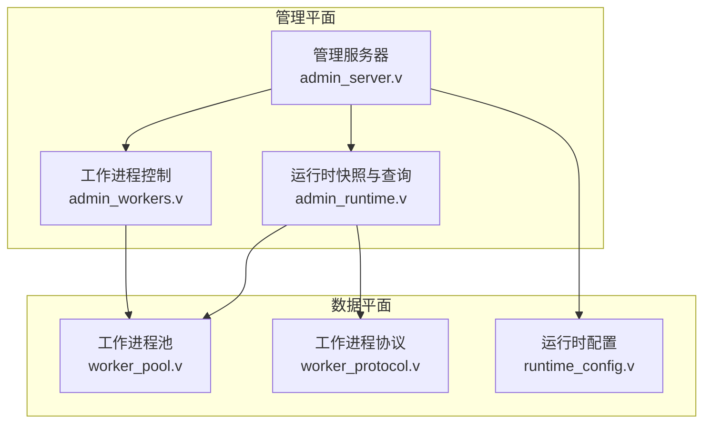
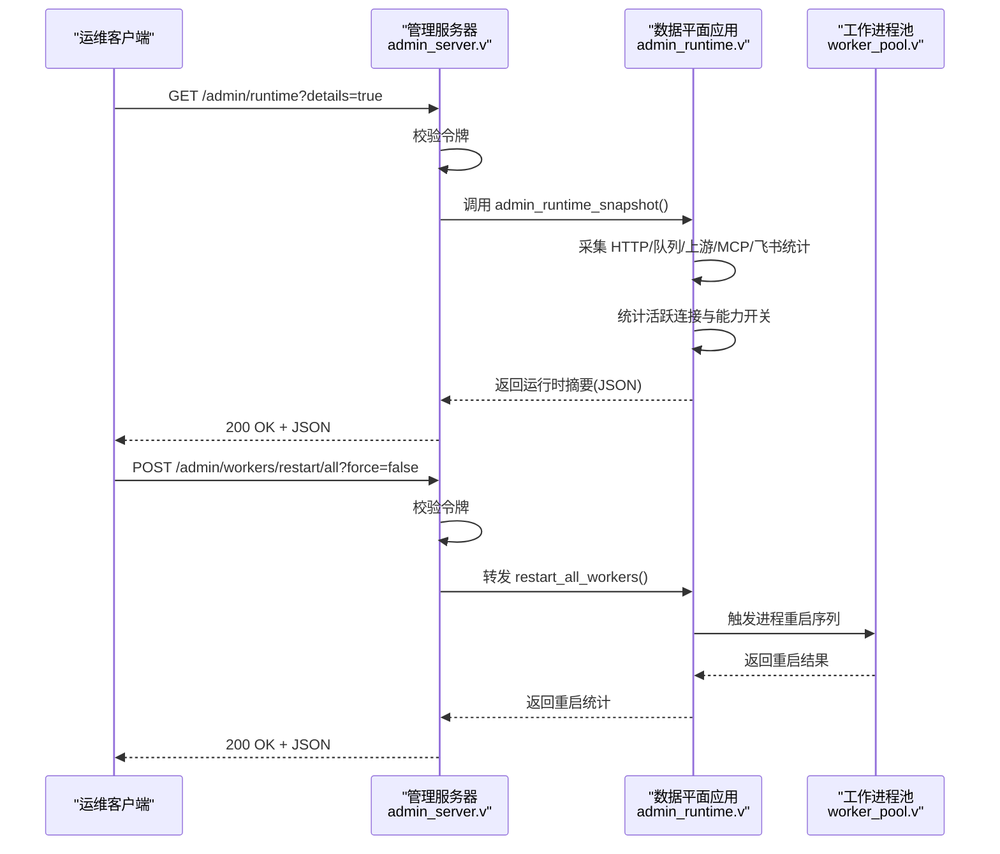
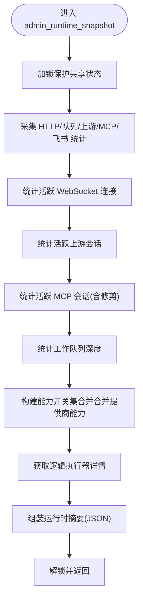
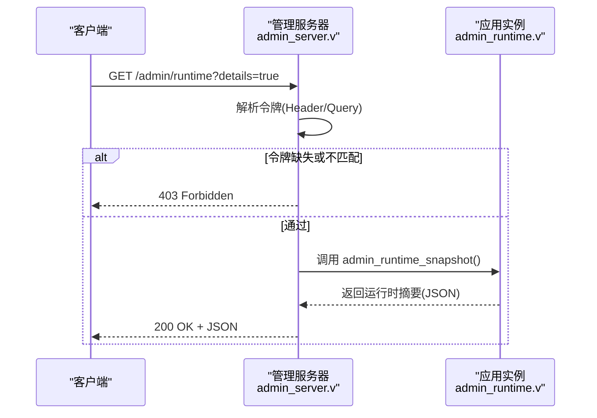
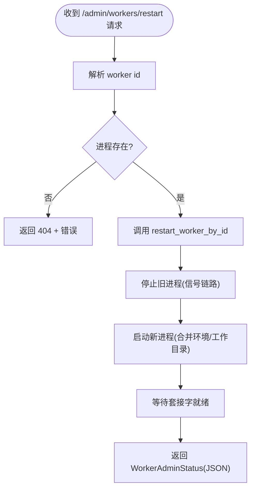
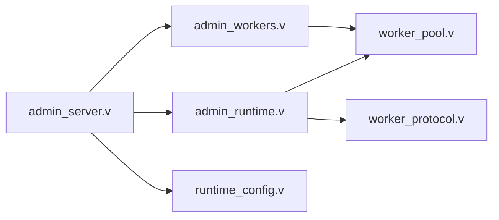

# 管理运行时

<cite>
**本文引用的文件**   
- [admin_runtime.v](file://src/admin_runtime.v)
- [admin_server.v](file://src/admin_server.v)
- [admin_workers.v](file://src/admin_workers.v)
- [worker_pool.v](file://src/transport/worker_pool.v)
- [worker_protocol.v](file://src/transport/worker_protocol.v)
- [runtime_config.v](file://src/config/runtime_config.v)
</cite>

## 目录
1. [简介](#简介)
2. [项目结构](#项目结构)
3. [核心组件](#核心组件)
4. [架构总览](#架构总览)
5. [详细组件分析](#详细组件分析)
6. [依赖关系分析](#依赖关系分析)
7. [性能考量](#性能考量)
8. [故障排查指南](#故障排查指南)
9. [结论](#结论)
10. [附录：管理 API 使用示例与配置项](#附录管理-api-使用示例与配置项)

## 简介
本文件面向运维与平台工程师，系统化阐述 vhttpd 的“管理运行时”设计与实现，重点覆盖：
- 运行时快照与状态采集机制（统计指标、活跃连接、能力开关等）
- 工作进程控制接口（启动、停止、重启、重试退避策略）
- 调试与诊断接口（实时状态查询、性能监控、消息与上游会话观测）
- 管理服务器实现（HTTP 管理 API、认证与访问控制）
- 工作进程池调度与负载均衡（轮询、亲和键、队列深度）
- 配置项与安全策略（监听、令牌、超时、队列容量、重启退避）

## 项目结构
管理运行时相关代码主要分布在以下模块：
- 管理运行时快照与数据平面 API：src/admin_runtime.v
- 管理服务器与管理平面 API：src/admin_server.v
- 数据平面工作进程控制与状态：src/admin_workers.v
- 工作进程生命周期与池化管理：src/transport/worker_pool.v
- 工作进程通信协议（HTTP/WS/MCP/上游计划）：src/transport/worker_protocol.v
- 运行时配置合并与多站点监听解析：src/config/runtime_config.v

图表来源
- [admin_server.v:1-588](file://src/admin_server.v#L1-L588)
- [admin_workers.v:1-155](file://src/admin_workers.v#L1-L155)
- [admin_runtime.v:1-323](file://src/admin_runtime.v#L1-L323)
- [worker_pool.v:1-181](file://src/transport/worker_pool.v#L1-L181)
- [worker_protocol.v:1-272](file://src/transport/worker_protocol.v#L1-L272)
- [runtime_config.v:1-440](file://src/config/runtime_config.v#L1-L440)

章节来源
- [admin_runtime.v:1-323](file://src/admin_runtime.v#L1-L323)
- [admin_server.v:1-588](file://src/admin_server.v#L1-L588)
- [admin_workers.v:1-155](file://src/admin_workers.v#L1-L155)
- [worker_pool.v:1-181](file://src/transport/worker_pool.v#L1-L181)
- [worker_protocol.v:1-272](file://src/transport/worker_protocol.v#L1-L272)
- [runtime_config.v:1-440](file://src/config/runtime_config.v#L1-L440)

## 核心组件
- 管理运行时快照（Stats/Snapshot）：聚合 HTTP 统计、工作队列等待/拒绝/超时、上游计划、MCP 会话与采样、飞书连接与消息等，并输出运行时摘要（能力开关、活跃连接数、逻辑执行器详情等）。
- 管理服务器（Admin Server）：提供 /admin 前缀的管理 API，支持认证、健康检查、运行时查询、工作进程重启、飞书消息发送等。
- 工作进程控制（Admin Workers）：在数据平面对外暴露 /admin/workers 与重启接口；在管理平面由 Admin Server 统一鉴权后转发。
- 工作进程池（Worker Pool）：负责进程启动、停止、信号处理、重启退避、套接字就绪探测、环境变量合并与工作目录设置。
- 协议模型（Worker Protocol）：定义工作进程与上游交互的帧结构、WS/MCP 消息格式、流式分发请求/响应等。
- 运行时配置（Runtime Config）：多站点监听解析、配置合并策略（Worker/Executor/PHP/Vjsx/Assets/MCP/Feishu/OpenAI 等）。

章节来源
- [admin_runtime.v:16-126](file://src/admin_runtime.v#L16-L126)
- [admin_server.v:75-588](file://src/admin_server.v#L75-L588)
- [admin_workers.v:45-155](file://src/admin_workers.v#L45-L155)
- [worker_pool.v:72-164](file://src/transport/worker_pool.v#L72-L164)
- [worker_protocol.v:4-272](file://src/transport/worker_protocol.v#L4-L272)
- [runtime_config.v:225-440](file://src/config/runtime_config.v#L225-L440)

## 架构总览
管理运行时采用“双平面”架构：
- 管理平面：独立的管理服务器，承载 /admin API，负责认证、审计与运维操作（如重启工作进程、查询运行时详情）。
- 数据平面：主服务与工作进程池，承载业务流量与运行时快照采集，向管理平面暴露只读查询接口。

图表来源
- [admin_server.v:124-147](file://src/admin_server.v#L124-L147)
- [admin_runtime.v:67-126](file://src/admin_runtime.v#L67-L126)
- [admin_workers.v:129-154](file://src/admin_workers.v#L129-L154)
- [worker_pool.v:140-164](file://src/transport/worker_pool.v#L140-L164)

## 详细组件分析

### 运行时快照与状态采集
- 统计维度
  - HTTP：请求数、错误数、超时数、流式请求数、管理动作数
  - 工作队列：等待总数、拒绝总数、超时总数
  - 上游计划：计划总数、计划错误总数
  - MCP：会话过期/驱逐、待处理丢弃、采样能力告警/丢弃/错误
  - 飞书：连接尝试/成功、接收帧、事件确认、消息发送与错误
- 运行时摘要
  - 启动时间与在线时长
  - 工作进程池大小、后端模式、队列容量/超时、队列深度
  - 逻辑执行器类型/生命周期/模型/提供商/详情
  - 能力开关集合（HTTP/Stream/WebSocket/MCP/上游等）
  - 活跃连接数（WebSocket、上游会话、MCP 会话、网关）
- 查询接口
  - /admin/runtime：返回运行时摘要
  - /admin/runtime/upstreams：可按角色/提供商过滤，支持分页与详情
  - /admin/runtime/websockets：可按房间/连接 ID 过滤，支持分页与详情
  - /admin/runtime/mcp：可按会话/协议版本过滤，支持分页与详情
  - /admin/runtime/provider-instances：按提供商过滤实例快照
  - /admin/providers/specs、/admin/providers/runtimes：注册提供商规格与运行时快照

图表来源
- [admin_runtime.v:67-126](file://src/admin_runtime.v#L67-L126)

章节来源
- [admin_runtime.v:16-126](file://src/admin_runtime.v#L16-L126)

### 管理服务器与认证机制
- 认证方式
  - 管理令牌：支持通过请求头 x-vhttpd-admin-token 或查询参数 admin_token 校验
  - 未配置令牌时默认放行（仅限开发或受控环境）
- 访问控制
  - 所有 /admin/* 接口均需认证通过
  - 403 Forbidden 返回标准错误体
- 健康检查
  - GET /admin/workers：返回 OK
- 关键接口
  - GET /admin/workers：返回工作进程池快照
  - GET /admin/stats：返回运行时统计快照
  - GET /admin/runtime：返回运行时摘要
  - GET /admin/providers：返回已注册提供商名称列表
  - GET /admin/executors：返回逻辑执行器规格快照
  - GET/POST /admin/runtime/*：运行时详情、上游/WS/MCP/实例、飞书聊天与消息发送
  - POST /admin/workers/restart 与 /admin/workers/restart/all：单个/全部重启工作进程

图表来源
- [admin_server.v:124-147](file://src/admin_server.v#L124-L147)
- [admin_runtime.v:151-171](file://src/admin_runtime.v#L151-L171)

章节来源
- [admin_server.v:41-63](file://src/admin_server.v#L41-L63)
- [admin_server.v:75-588](file://src/admin_server.v#L75-L588)

### 工作进程控制与重启策略
- 状态模型
  - WorkerAdminStatus：包含 id、socket、存活、pid、内存、是否降级、在途请求数、累计服务数、重启次数、下次重试时间戳
  - WorkerPoolAdminStatus：包含自动启动、池大小、轮询索引、最大请求数、套接字列表、工作进程列表
- 控制接口
  - GET /admin/workers：返回工作池快照
  - POST /admin/workers/restart?id=...：按 id 重启指定工作进程
  - POST /admin/workers/restart/all：重启所有工作进程（支持 force 参数）
- 生命周期与重启退避
  - 启动：合并环境变量、设置工作目录、以 shell 启动子进程、等待套接字就绪
  - 停止：先 TERM，再 PGKILL，最后 KILL 并等待退出
  - 退避：指数回退，上限可配置，避免雪崩式重启

图表来源
- [admin_workers.v:89-127](file://src/admin_workers.v#L89-L127)
- [worker_pool.v:72-95](file://src/transport/worker_pool.v#L72-L95)
- [worker_pool.v:114-131](file://src/transport/worker_pool.v#L114-L131)
- [worker_pool.v:166-180](file://src/transport/worker_pool.v#L166-L180)

章节来源
- [admin_workers.v:45-155](file://src/admin_workers.v#L45-L155)
- [worker_pool.v:72-164](file://src/transport/worker_pool.v#L72-L164)

### 协议与通信模型
- 工作进程协议涵盖
  - WorkerResponse：HTTP 响应帧
  - WorkerStreamFrame：流式事件帧（SSE 字段映射）
  - StreamDispatchRequest/Response：流式分发请求/响应
  - WorkerUpstreamPlanFrame：上游计划帧
  - WorkerRequestPayload：工作进程请求载荷
  - WorkerWebSocketFrame/Dispatch*：WebSocket 会话与分发命令
  - WorkerMcpDispatchRequest/Response：MCP 会话分发
  - WorkerWebSocketUpstream*：WS 上游统一命令结构
- 这些结构支撑管理平面查询与诊断（如 WS/MCP 会话详情、上游计划统计）。

章节来源
- [worker_protocol.v:4-272](file://src/transport/worker_protocol.v#L4-L272)

### 配置与多站点监听
- 多监听解析：若未显式 listeners，则从 sites 中推导，要求每个站点配置端口
- 配置合并策略：针对 Worker/Executor/PHP/Vjsx/Assets/MCP/Feishu/OpenAI 等模块提供细粒度合并规则，确保站点级覆盖正确生效
- 运行时配置：timezone 等运行时参数可被站点配置覆盖

章节来源
- [runtime_config.v:417-440](file://src/config/runtime_config.v#L417-L440)
- [runtime_config.v:225-364](file://src/config/runtime_config.v#L225-L364)

## 依赖关系分析
- 管理服务器依赖应用实例提供的快照与控制方法，通过共享引用进行调用
- 数据平面快照依赖多个子系统的统计与状态（HTTP、工作队列、上游 Hub、MCP、飞书）
- 工作进程池为进程生命周期与重启退避的核心实现，被管理平面与数据平面共同依赖

图表来源
- [admin_server.v:1-588](file://src/admin_server.v#L1-L588)
- [admin_workers.v:1-155](file://src/admin_workers.v#L1-L155)
- [admin_runtime.v:1-323](file://src/admin_runtime.v#L1-L323)
- [worker_pool.v:1-181](file://src/transport/worker_pool.v#L1-L181)
- [worker_protocol.v:1-272](file://src/transport/worker_protocol.v#L1-L272)
- [runtime_config.v:1-440](file://src/config/runtime_config.v#L1-L440)

## 性能考量
- 队列与背压
  - 队列容量与超时影响吞吐与延迟，建议结合业务峰值与工作进程数调优
  - 超时与拒绝统计可用于识别过载风险
- 重启退避
  - 指数回退上限避免级联失败，建议根据进程稳定性调整基值与上限
- 连接与会话
  - 活跃连接数与队列深度是热点指标，异常增长需优先检查上游/WS/MCP 侧
- 日志与追踪
  - 所有 /admin/* 接口设置 x-vhttpd-trace-id，便于跨平面关联定位

## 故障排查指南
- 认证失败
  - 现象：403 Forbidden
  - 排查：确认 x-vhttpd-admin-token 头或 admin_token 查询参数是否与配置一致
- 进程重启失败
  - 现象：/admin/workers/restart 返回 404 或错误
  - 排查：确认 worker id 是否存在；查看进程是否存活；检查套接字就绪与环境变量
- 进程无法就绪
  - 现象：启动后超时
  - 排查：检查等待就绪超时、工作目录权限、命令拼接（socket 占位符）
- 令牌缺失
  - 现象：未配置令牌时仍被拒绝
  - 排查：确认管理令牌配置与请求头/查询参数传递

章节来源
- [admin_server.v:41-63](file://src/admin_server.v#L41-L63)
- [admin_workers.v:89-127](file://src/admin_workers.v#L89-L127)
- [worker_pool.v:32-43](file://src/transport/worker_pool.v#L32-L43)

## 结论
管理运行时通过“双平面”架构实现了对 vhttpd 的可观测性与可控性：管理平面提供统一的运维入口与强认证，数据平面提供高保真的运行时快照与稳定的业务承载。配合工作进程池的生命周期管理与指数退避策略，可在高负载与异常场景下保持系统稳定与可恢复性。

## 附录：管理 API 使用示例与配置项

### 管理 API 使用示例（HTTP）
- 获取运行时摘要
  - GET /admin/runtime
  - 可选查询参数：details（布尔）、limit/offset（整数）、role/provider/session_id/room/conn_id/chat_type/chat_id 等（视具体端点而定）
- 获取工作进程快照
  - GET /admin/workers
- 重启单个工作进程
  - POST /admin/workers/restart?id=<worker_id>
- 全量重启工作进程
  - POST /admin/workers/restart/all?force=<true|false>
- 飞书消息发送（示例）
  - POST /admin/runtime/feishu/messages
  - 请求体：FeishuRuntimeSendMessageRequest（JSON）
  - 成功返回：AdminFeishuSendResponse（ok/message_id）

章节来源
- [admin_server.v:75-588](file://src/admin_server.v#L75-L588)
- [admin_workers.v:45-155](file://src/admin_workers.v#L45-L155)

### 配置项与安全设置
- 管理令牌
  - 通过请求头 x-vhttpd-admin-token 或查询参数 admin_token 校验
- 监听与多站点
  - 若未显式配置 listeners，将从 sites 推导监听器，要求每个站点配置端口
- 工作进程与队列
  - 自动启动、命令模板、套接字、池大小、队列容量、队列超时、最大请求数、重启退避基值与上限
- WebSocket 亲和与演员队列
  - 亲和键来源、作用域、回退策略；每键队列上限与超时
- MCP 会话与采样
  - 最大会话数、待处理消息上限、会话 TTL、允许的 Origin 列表、采样能力策略
- 飞书与 OpenAI 等提供商
  - 开关、基础地址、重连延迟、最近事件限制、路由与后端配置等

章节来源
- [runtime_config.v:225-440](file://src/config/runtime_config.v#L225-L440)