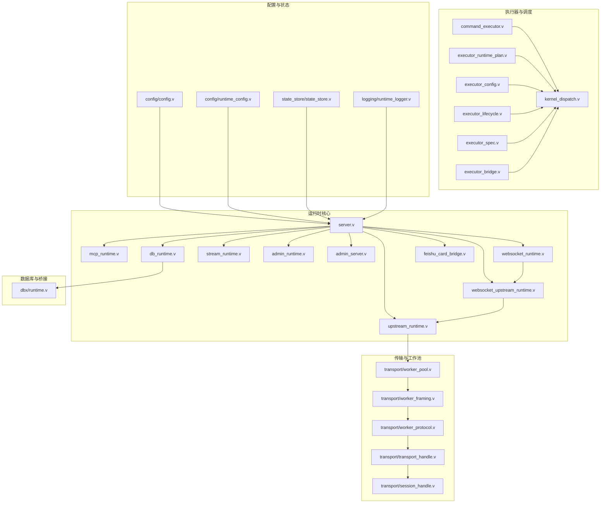
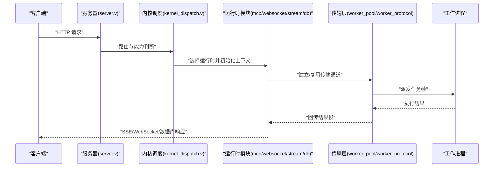
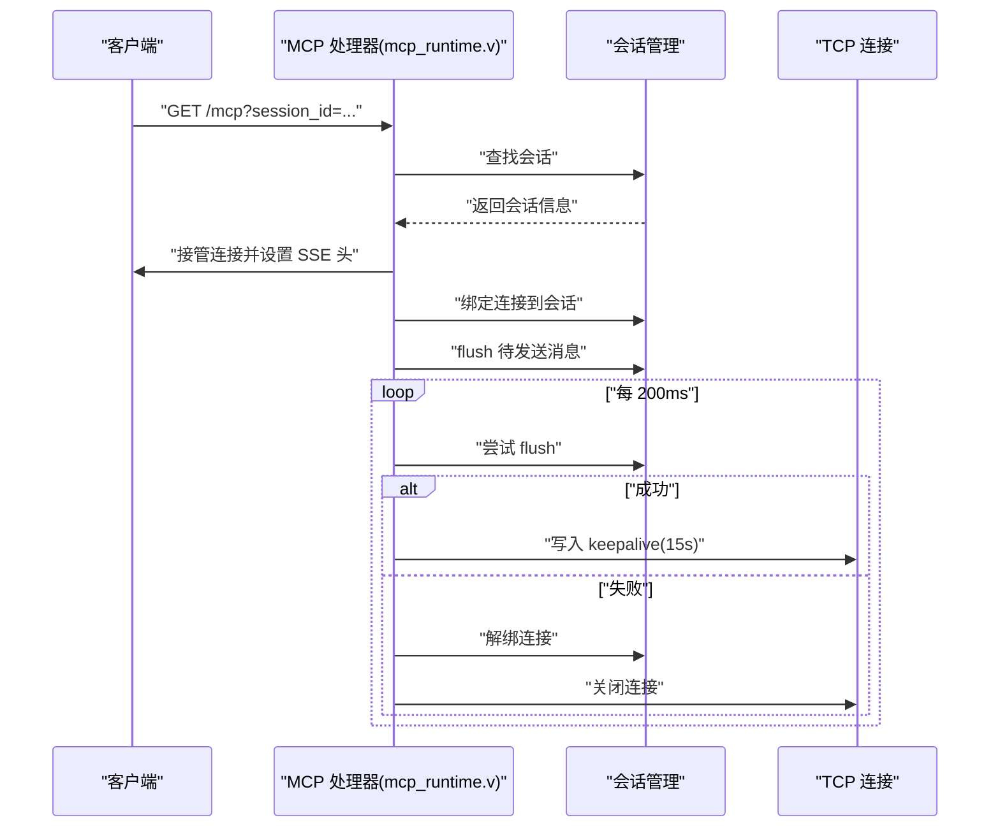
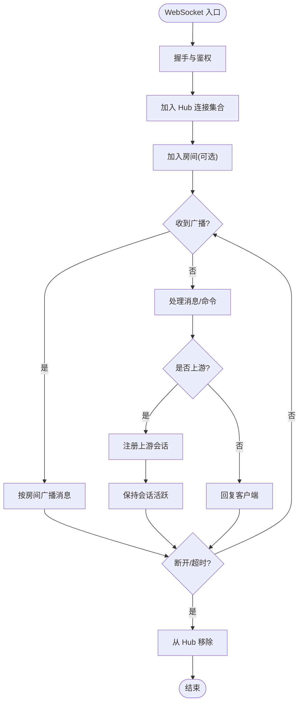
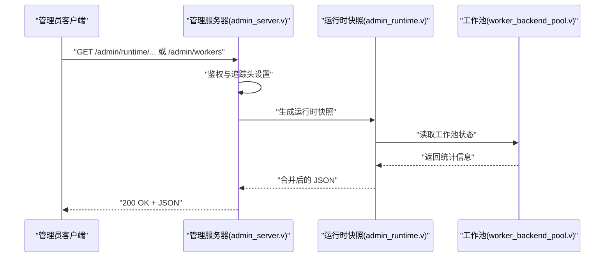
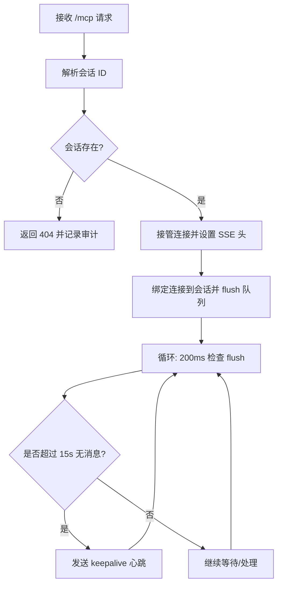
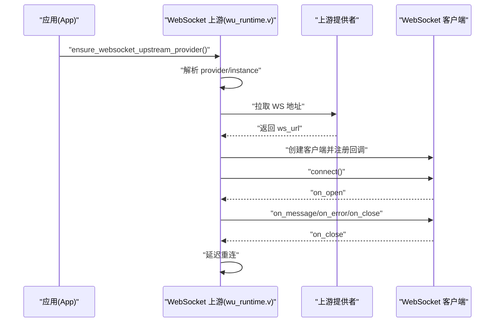
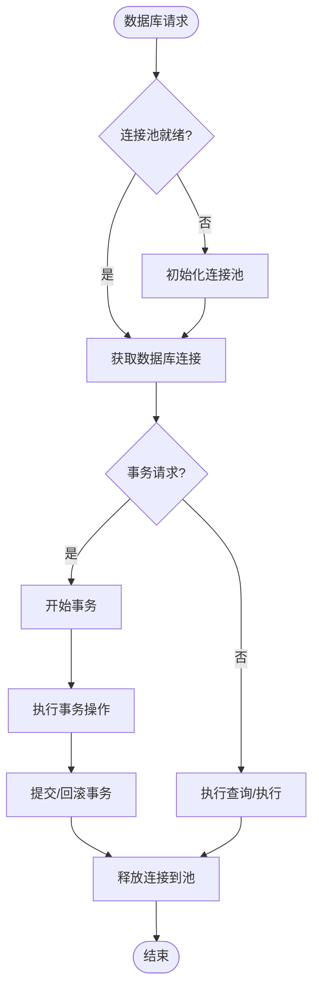
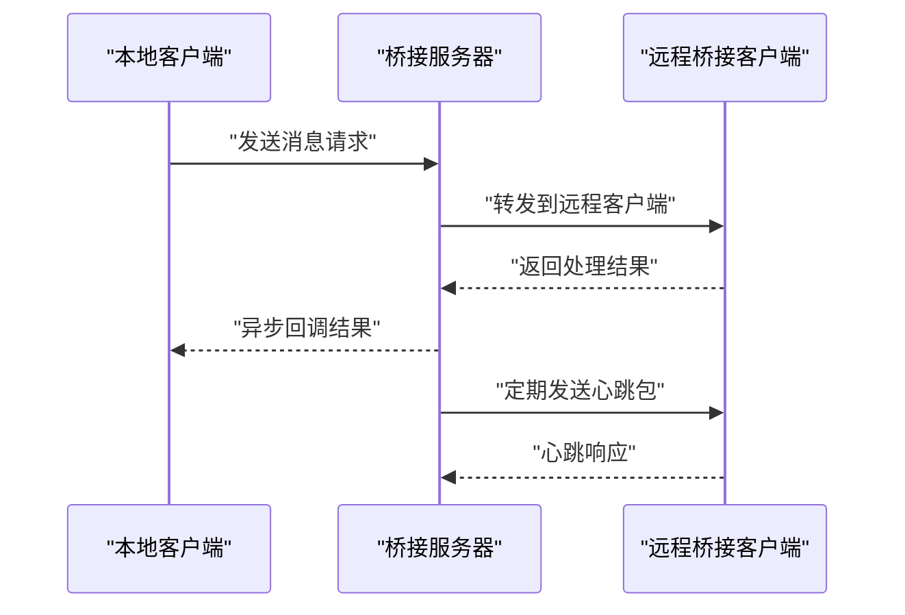
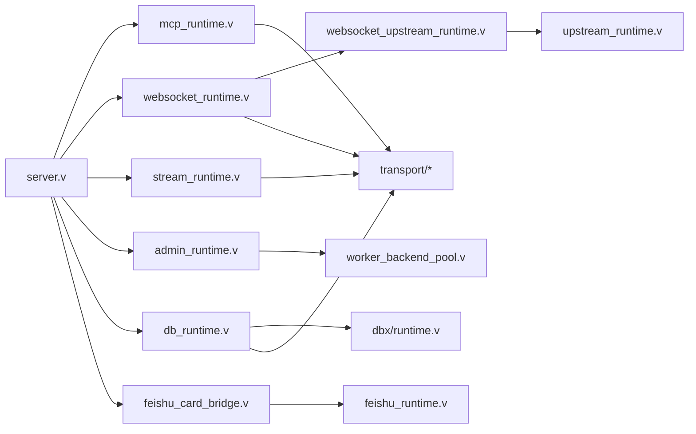

# 运行时组件

<cite>
**本文引用的文件**
- [src/mcp_runtime.v](file://src/mcp_runtime.v)
- [src/websocket_runtime.v](file://src/websocket_runtime.v)
- [src/websocket_upstream_runtime.v](file://src/websocket_upstream_runtime.v)
- [src/upstream_runtime.v](file://src/upstream_runtime.v)
- [src/admin_runtime.v](file://src/admin_runtime.v)
- [src/admin_server.v](file://src/admin_server.v)
- [src/worker_backend_pool.v](file://src/worker_backend_pool.v)
- [src/stream_runtime.v](file://src/stream_runtime.v)
- [src/command_executor.v](file://src/command_executor.v)
- [src/executor_runtime_plan.v](file://src/executor_runtime_plan.v)
- [src/server_runtime_config.v](file://src/server_runtime_config.v)
- [src/multi_server_runtime_orchestrator.v](file://src/multi_server_runtime_orchestrator.v)
- [src/app_runtime_builder.v](file://src/app_runtime_builder.v)
- [src/provider_registry.v](file://src/provider_registry.v)
- [src/provider_config.v](file://src/provider_config.v)
- [src/provider_spec.v](file://src/provider_spec.v)
- [src/transport/worker_protocol.v](file://src/transport/worker_protocol.v)
- [src/transport/worker_pool.v](file://src/transport/worker_pool.v)
- [src/transport/session_handle.v](file://src/transport/session_handle.v)
- [src/transport/worker_framing.v](file://src/transport/worker_framing.v)
- [src/transport/transport_handle.v](file://src/transport/transport_handle.v)
- [src/config/config.v](file://src/config/config.v)
- [src/config/runtime_config.v](file://src/config/runtime_config.v)
- [src/logging/runtime_logger.v](file://src/logging/runtime_logger.v)
- [src/state_store/state_store.v](file://src/state_store/state_store.v)
- [src/dispatch_context.v](file://src/dispatch_context.v)
- [src/kernel_dispatch.v](file://src/kernel_dispatch.v)
- [src/executor_bridge.v](file://src/executor_bridge.v)
- [src/executor_config.v](file://src/executor_config.v)
- [src/executor_lifecycle.v](file://src/executor_lifecycle.v)
- [src/executor_spec.v](file://src/executor_spec.v)
- [src/app_states.v](file://src/app_states.v)
- [src/command.v](file://src/command.v)
- [src/command_handlers.v](file://src/command_handlers.v)
- [src/worker_backend_dispatch.v](file://src/worker_backend_dispatch.v)
- [src/worker_backend_queue.v](file://src/worker_backend_queue.v)
- [src/worker_backend_runtime.v](file://src/worker_backend_runtime.v)
- [src/worker_backend_transport.v](file://src/worker_backend_transport.v)
- [src/internal_admin.v](file://src/internal_admin.v)
- [src/server.v](file://src/server.v)
- [src/main.v](file://src/main.v)
- [src/db_runtime.v](file://src/db_runtime.v)
- [src/dbx/runtime.v](file://src/dbx/runtime.v)
- [src/feishu_card_bridge.v](file://src/feishu_card_bridge.v)
- [src/mcp_protocol/types.v](file://src/mcp_protocol/types.v)
- [src/mcp_protocol/helpers.v](file://src/mcp_protocol/helpers.v)
- [src/ws/types.v](file://src/ws/types.v)
- [src/ws/hub_runtime.v](file://src/ws/hub_runtime.v)
- [config/vhttpd.example.toml](file://config/vhttpd.example.toml)
- [examples/config/mcp.toml](file://examples/config/mcp.toml)
- [examples/config/websocket-echo.toml](file://examples/config/websocket-echo.toml)
- [examples/config/ai-stream.toml](file://examples/config/ai-stream.toml)
- [examples/config/stream-dispatch.toml](file://examples/config/stream-dispatch.toml)
- [examples/mcp-app.php](file://examples/mcp-app.php)
- [examples/websocket_echo_app.php](file://examples/websocket_echo_app.php)
- [examples/ai-stream-app.php](file://examples/ai-stream-app.php)
- [examples/stream-dispatch-app.php](file://examples/stream-dispatch-app.php)
- [docs/MCP.md](file://docs/MCP.md)
- [docs/WEBSOCKET_EVENT_BUS_PLAN.md](file://docs/WEBSOCKET_EVENT_BUS_PLAN.md)
- [docs/WEBSOCKET_MESSAGE_DISPATCH_PLAN.md](file://docs/WEBSOCKET_MESSAGE_DISPATCH_PLAN.md)
- [docs/WEBSOCKET_UPSTREAM_PLAN.md](file://docs/WEBSOCKET_UPSTREAM_PLAN.md)
- [docs/STREAM_PHASE2_IMPLEMENTATION_PLAN.md](file://docs/STREAM_PHASE2_IMPLEMENTATION_PLAN.md)
- [docs/RUNTIME_MODULE_MAP.md](file://docs/RUNTIME_MODULE_MAP.md)
- [docs/EXECUTOR_MODES.md](file://docs/EXECUTOR_MODES.md)
- [docs/INTERNAL_HOST_SOCKET_PROTOCOL.md](file://docs/INTERNAL_HOST_SOCKET_PROTOCOL.md)
- [docs/TRANSPORT_CONTRACT.md](file://docs/TRANSPORT_CONTRACT.md)
</cite>

## 更新摘要
**所做更改**
- 更新了数据库运行时组件的类型引用，从本地类型别名改为直接使用模块限定名 `dbx.Request` 和 `dbx.Response`
- 更新了 MCP 运行时组件的类型引用，移除了本地类型别名，改用 `mcp_protocol.Session` 和 `mcp_protocol.QueueResult`
- 更新了 WebSocket 运行时组件的类型引用，改用 `ws.HubDispatchTarget` 和 `ws.PresenceSnapshot` 等模块限定名
- 更新了飞书卡片桥接组件的类型引用，移除了本地类型别名
- 修正了文档中关于内部类型别名使用的描述，反映了代码重构后的实际情况

## 目录
1. [简介](#简介)
2. [项目结构](#项目结构)
3. [核心组件](#核心组件)
4. [架构总览](#架构总览)
5. [详细组件分析](#详细组件分析)
6. [依赖关系分析](#依赖关系分析)
7. [性能考量](#性能考量)
8. [故障排查指南](#故障排查指南)
9. [结论](#结论)
10. [附录](#附录)

## 简介
本文件面向开发者系统性阐述 vhttpd 的运行时组件体系，重点覆盖以下方面：
- 流式运行时：SSE、文本流与 MCP 流的实现机制
- WebSocket 运行时：连接管理、房间系统与在线状态跟踪
- 管理运行时：运行时快照、工作进程控制与调试接口
- MCP 运行时：模型上下文协议（MCP）处理与能力协商
- WebSocket 上游运行时：与外部服务的长连接管理与事件处理
- 数据库运行时：基于 dbx 模块的数据库连接管理与事务处理
- 飞书卡片桥接：飞书卡片消息的桥接与转发机制
- 配置选项、API 接口与使用示例
- 扩展与定制运行时组件的实践指导

## 项目结构
vhttpd 将运行时能力以模块化方式组织，核心运行时分布在 src 目录下，配合 transport 层、配置层与示例应用共同构成完整的运行时生态。

**图表来源**
- [src/server.v](file://src/server.v)
- [src/mcp_runtime.v](file://src/mcp_runtime.v)
- [src/websocket_runtime.v](file://src/websocket_runtime.v)
- [src/websocket_upstream_runtime.v](file://src/websocket_upstream_runtime.v)
- [src/upstream_runtime.v](file://src/upstream_runtime.v)
- [src/stream_runtime.v](file://src/stream_runtime.v)
- [src/admin_runtime.v](file://src/admin_runtime.v)
- [src/admin_server.v](file://src/admin_server.v)
- [src/db_runtime.v](file://src/db_runtime.v)
- [src/feishu_card_bridge.v](file://src/feishu_card_bridge.v)
- [src/transport/worker_pool.v](file://src/transport/worker_pool.v)
- [src/transport/worker_framing.v](file://src/transport/worker_framing.v)
- [src/transport/worker_protocol.v](file://src/transport/worker_protocol.v)
- [src/transport/transport_handle.v](file://src/transport/transport_handle.v)
- [src/transport/session_handle.v](file://src/transport/session_handle.v)
- [src/command_executor.v](file://src/command_executor.v)
- [src/executor_runtime_plan.v](file://src/executor_runtime_plan.v)
- [src/executor_config.v](file://src/executor_config.v)
- [src/executor_lifecycle.v](file://src/executor_lifecycle.v)
- [src/executor_spec.v](file://src/executor_spec.v)
- [src/kernel_dispatch.v](file://src/kernel_dispatch.v)
- [src/executor_bridge.v](file://src/executor_bridge.v)
- [src/config/config.v](file://src/config/config.v)
- [src/config/runtime_config.v](file://src/config/runtime_config.v)
- [src/state_store/state_store.v](file://src/state_store/state_store.v)
- [src/logging/runtime_logger.v](file://src/logging/runtime_logger.v)
- [src/dbx/runtime.v](file://src/dbx/runtime.v)

**章节来源**
- [src/server.v](file://src/server.v)
- [src/config/config.v](file://src/config/config.v)
- [src/config/runtime_config.v](file://src/config/runtime_config.v)

## 核心组件
- 流式运行时（SSE/文本流/MCP 流）
  - 基于 TCP 连接与 SSE 协议的流式输出，支持消息队列与保活心跳
  - 通过会话绑定与刷新机制确保消息可靠投递
- WebSocket 运行时
  - 连接生命周期管理、房间系统与在线状态跟踪
  - 支持上游 WebSocket 代理与动态启动
- 管理运行时
  - 提供运行时快照、工作进程统计与调试接口
  - 暴露能力开关与运行时状态查询
- MCP 运行时
  - 实现模型上下文协议（MCP）的会话管理与能力协商
  - 支持跨域来源校验与会话 TTL 控制
- WebSocket 上游运行时
  - 与外部服务建立长连接，自动重连与事件回调
  - 注册/注销上游计划并记录统计信息
- 数据库运行时
  - 基于 dbx 模块的数据库连接管理与事务处理
  - 支持连接池、事务会话与查询执行
- 飞书卡片桥接
  - 飞书卡片消息的桥接与转发机制
  - 支持本地与远程桥接客户端的双向通信

**章节来源**
- [src/mcp_runtime.v](file://src/mcp_runtime.v)
- [src/websocket_runtime.v](file://src/websocket_runtime.v)
- [src/websocket_upstream_runtime.v](file://src/websocket_upstream_runtime.v)
- [src/upstream_runtime.v](file://src/upstream_runtime.v)
- [src/admin_runtime.v](file://src/admin_runtime.v)
- [src/admin_server.v](file://src/admin_server.v)
- [src/worker_backend_pool.v](file://src/worker_backend_pool.v)
- [src/db_runtime.v](file://src/db_runtime.v)
- [src/dbx/runtime.v](file://src/dbx/runtime.v)
- [src/feishu_card_bridge.v](file://src/feishu_card_bridge.v)

## 架构总览
vhttpd 的运行时由"请求入口 -> 调度分发 -> 运行时执行 -> 传输层"组成。请求进入后根据路径与能力选择对应运行时模块；运行时模块通过传输层与工作进程交互，最终以 SSE 或 WebSocket 形式返回数据。

**图表来源**
- [src/server.v](file://src/server.v)
- [src/kernel_dispatch.v](file://src/kernel_dispatch.v)
- [src/transport/worker_pool.v](file://src/transport/worker_pool.v)
- [src/transport/worker_protocol.v](file://src/transport/worker_protocol.v)
- [src/mcp_runtime.v](file://src/mcp_runtime.v)
- [src/websocket_runtime.v](file://src/websocket_runtime.v)
- [src/stream_runtime.v](file://src/stream_runtime.v)
- [src/db_runtime.v](file://src/db_runtime.v)

## 详细组件分析

### 流式运行时（SSE/文本流/MCP 流）
- 设计要点
  - 使用 TCP 连接承载 SSE 事件流，头部设置为 text/event-stream
  - 会话级消息队列（pending）用于缓存未发送消息，连接建立后批量 flush
  - 定期发送 keepalive 心跳，维持连接活跃
  - 支持跨域来源校验与会话 TTL 管理
- 关键流程
  - 会话绑定：takeover_conn 后绑定连接到指定会话
  - 刷新队列：循环检查并 flush 待发送消息
  - 断开清理：解绑连接并关闭，触发统计上报

**图表来源**
- [src/mcp_runtime.v](file://src/mcp_runtime.v)

**章节来源**
- [src/mcp_runtime.v](file://src/mcp_runtime.v)

### WebSocket 运行时（连接管理、房间系统、在线状态）
- 设计要点
  - Hub 统一管理连接集合与上游会话，支持并发安全
  - 房间系统基于会话标识进行消息广播与订阅
  - 在线状态跟踪通过连接集合与上游会话集合维护
- 关键流程
  - 连接接入：握手后加入 hub.conns
  - 房间广播：按房间维度向多个连接推送消息
  - 上游会话：注册/注销外部上游会话并统计
  - 清理策略：超时或断开时移除连接

**图表来源**
- [src/websocket_runtime.v](file://src/websocket_runtime.v)
- [src/websocket_upstream_runtime.v](file://src/websocket_upstream_runtime.v)
- [src/upstream_runtime.v](file://src/upstream_runtime.v)

**章节来源**
- [src/websocket_runtime.v](file://src/websocket_runtime.v)
- [src/websocket_upstream_runtime.v](file://src/websocket_upstream_runtime.v)
- [src/upstream_runtime.v](file://src/upstream_runtime.v)

### 管理运行时（快照、工作进程控制、调试接口）
- 设计要点
  - 运行时快照聚合多模块状态（WS、MCP、工作池等）
  - 工作进程控制暴露池大小、轮询索引、队列深度等指标
  - 管理接口提供认证与审计日志
- 关键流程
  - 快照生成：并发锁保护下收集各子系统状态
  - 工作池统计：汇总 socket 数量、最大请求数、排队深度
  - 管理端点：/admin/runtime/* 与 /admin/workers 提供 JSON 输出

**图表来源**
- [src/admin_server.v](file://src/admin_server.v)
- [src/admin_runtime.v](file://src/admin_runtime.v)
- [src/worker_backend_pool.v](file://src/worker_backend_pool.v)

**章节来源**
- [src/admin_runtime.v](file://src/admin_runtime.v)
- [src/admin_server.v](file://src/admin_server.v)
- [src/worker_backend_pool.v](file://src/worker_backend_pool.v)

### MCP 运行时（模型上下文协议）
- 设计要点
  - 会话结构包含协议版本、请求 ID、trace ID、路径、活动时间与客户端能力
  - 支持跨域来源白名单校验与会话 TTL 管理
  - 通过 SSE 写入 message 事件，配合 keepalive 维持连接
  - 使用直接的模块限定名 `mcp_protocol.Session` 和 `mcp_protocol.QueueResult` 替代本地类型别名
- 关键流程
  - 会话创建与绑定：生成 session_id，绑定连接并 flush 队列
  - 来源校验：若允许列表为空则放行，否则严格匹配
  - 删除会话：释放连接资源并关闭

**图表来源**
- [src/mcp_runtime.v](file://src/mcp_runtime.v)

**章节来源**
- [src/mcp_runtime.v](file://src/mcp_runtime.v)

### WebSocket 上游运行时（外部服务长连接）
- 设计要点
  - 动态启动：根据配置自动拉起上游提供者实例
  - 自动重连：连接失败后按指数/固定延迟重试
  - 事件回调：on_message/on_error/on_close 分别处理消息、错误与关闭
- 关键流程
  - 解析提供者与实例：默认实例解析与启用检查
  - 拉取地址：从配置或注册中心获取 WS 地址
  - 建立连接：设置读写超时并注册回调
  - 运行周期：连接成功后持续监听事件，断开后重连

**图表来源**
- [src/websocket_upstream_runtime.v](file://src/websocket_upstream_runtime.v)

**章节来源**
- [src/websocket_upstream_runtime.v](file://src/websocket_upstream_runtime.v)
- [src/upstream_runtime.v](file://src/upstream_runtime.v)

### 数据库运行时（dbx 模块集成）
- 设计要点
  - 使用 dbx 模块提供的统一数据库接口，支持 MySQL 和 PostgreSQL
  - 连接池管理与事务会话分离，支持参数化查询与预处理语句
  - 运行时快照包含连接状态、事务数量与错误统计
  - 直接使用 `dbx.Request` 和 `dbx.Response` 等模块限定类型
- 关键流程
  - 连接池初始化：根据驱动类型创建相应的连接池
  - 事务管理：开始事务、提交/回滚并管理会话生命周期
  - 查询执行：支持参数化查询与普通查询，返回标准化结果
  - 连接回收：事务结束后将连接归还到连接池或关闭

**图表来源**
- [src/db_runtime.v](file://src/db_runtime.v)
- [src/dbx/runtime.v](file://src/dbx/runtime.v)

**章节来源**
- [src/db_runtime.v](file://src/db_runtime.v)
- [src/dbx/runtime.v](file://src/dbx/runtime.v)

### 飞书卡片桥接（飞书消息桥接）
- 设计要点
  - 支持本地与远程桥接客户端的双向通信
  - 心跳机制：定期发送心跳包维持连接活跃
  - 异步消息处理：使用通道管理请求与响应的异步通信
  - 支持多种操作：send、update、append、finish、fail 等
- 关键流程
  - 客户端连接：建立 WebSocket 连接并注册回调函数
  - 消息分发：根据消息类型分发到相应的处理函数
  - 结果回调：将处理结果通过通道返回给调用方
  - 连接管理：自动重连与错误处理

**图表来源**
- [src/feishu_card_bridge.v](file://src/feishu_card_bridge.v)

**章节来源**
- [src/feishu_card_bridge.v](file://src/feishu_card_bridge.v)

## 依赖关系分析
- 组件耦合
  - 运行时模块（MCP/WS/Stream/Admin/DB/FCB）均依赖 server 作为统一入口
  - WebSocket 上游运行时依赖上游运行时进行会话注册与统计
  - 数据库运行时直接依赖 dbx 模块提供统一的数据库接口
  - 飞书卡片桥接依赖飞书运行时模块进行消息处理
  - 管理运行时聚合多模块状态并通过管理服务器对外暴露
- 外部依赖
  - 传输层提供工作池、帧协议与会话句柄，支撑运行时的并发与稳定性
  - 配置层与状态存储为运行时提供参数与持久化能力

**图表来源**
- [src/server.v](file://src/server.v)
- [src/mcp_runtime.v](file://src/mcp_runtime.v)
- [src/websocket_runtime.v](file://src/websocket_runtime.v)
- [src/websocket_upstream_runtime.v](file://src/websocket_upstream_runtime.v)
- [src/upstream_runtime.v](file://src/upstream_runtime.v)
- [src/admin_runtime.v](file://src/admin_runtime.v)
- [src/worker_backend_pool.v](file://src/worker_backend_pool.v)
- [src/stream_runtime.v](file://src/stream_runtime.v)
- [src/db_runtime.v](file://src/db_runtime.v)
- [src/dbx/runtime.v](file://src/dbx/runtime.v)
- [src/feishu_card_bridge.v](file://src/feishu_card_bridge.v)
- [src/transport/worker_pool.v](file://src/transport/worker_pool.v)
- [src/transport/worker_framing.v](file://src/transport/worker_framing.v)
- [src/transport/worker_protocol.v](file://src/transport/worker_protocol.v)

**章节来源**
- [src/server.v](file://src/server.v)
- [src/transport/worker_pool.v](file://src/transport/worker_pool.v)
- [src/transport/worker_framing.v](file://src/transport/worker_framing.v)
- [src/transport/worker_protocol.v](file://src/transport/worker_protocol.v)

## 性能考量
- 连接与队列
  - SSE/WS 连接采用无限读写超时，需结合 keepalive 与 TTL 控制避免资源泄漏
  - 会话队列（pending）应限制最大长度，防止内存膨胀
- 并发与锁
  - Hub 与 MCP 会话表使用互斥锁保护，注意在高并发场景下的锁竞争
  - 数据库连接池需要合理配置最大连接数，避免连接争用
- 传输层优化
  - 工作池大小与请求上限需根据 CPU/IO 调优，避免过载
  - 帧协议与会话句柄的序列化/反序列化应尽量减少拷贝
- 上游连接
  - 自动重连策略应设置上限与退避，避免风暴效应
- 飞书桥接
  - 心跳包频率需要平衡连接维持与网络开销
  - 异步处理机制需要合理设置通道容量，避免阻塞

## 故障排查指南
- 常见问题定位
  - 会话不存在：检查 session_id 是否正确传递与存在
  - 跨域拒绝：确认 allowed_origins 配置与请求 Origin 匹配
  - 连接断开：查看 keepalive 发送与 flush 成功与否
  - 管理接口 403：确认鉴权与访问来源
  - 数据库连接失败：检查连接池配置与数据库可达性
  - 飞书桥接异常：验证 WebSocket 连接状态与心跳机制
- 关键日志与审计
  - 管理服务器在每个端点调用后记录审计事件（方法、路径、状态、追踪 ID）
  - 运行时在关键路径（会话绑定/解绑、上游连接状态变更、数据库操作）产生事件
  - 飞书桥接记录消息发送、接收与错误处理的详细信息
- 建议操作
  - 使用管理快照接口快速评估当前运行时状态
  - 对 MCP/WS 进行最小化复现，逐步排除网络与配置因素
  - 监控数据库连接池使用情况，及时调整池大小配置

**章节来源**
- [src/admin_server.v](file://src/admin_server.v)
- [src/mcp_runtime.v](file://src/mcp_runtime.v)
- [src/websocket_runtime.v](file://src/websocket_runtime.v)
- [src/websocket_upstream_runtime.v](file://src/websocket_upstream_runtime.v)
- [src/db_runtime.v](file://src/db_runtime.v)
- [src/feishu_card_bridge.v](file://src/feishu_card_bridge.v)

## 结论
vhttpd 的运行时组件以模块化设计实现了从请求入口到流式输出的完整链路。MCP 与 WebSocket 提供了强大的实时通信能力，配合上游运行时与工作池传输层，满足复杂场景下的高并发与可靠性需求。数据库运行时通过 dbx 模块提供了统一的数据库访问接口，飞书卡片桥接实现了跨系统的消息互通。管理运行时提供了可观测性与运维能力，便于在生产环境中进行监控与排障。

## 附录

### 配置选项与示例
- vhttpd 主配置
  - 参考文件：[config/vhttpd.example.toml](file://config/vhttpd.example.toml)
  - 关键项：服务端口、日志级别、工作池大小、上游计划、能力开关
- MCP 示例配置
  - 参考文件：[examples/config/mcp.toml](file://examples/config/mcp.toml)
  - 关键项：允许来源、会话 TTL、采样策略
- WebSocket 示例配置
  - 参考文件：[examples/config/websocket-echo.toml](file://examples/config/websocket-echo.toml)
  - 关键项：房间策略、上游自动启动、事件回调
- AI 流示例配置
  - 参考文件：[examples/config/ai-stream.toml](file://examples/config/ai-stream.toml)
  - 关键项：流类型、编码器、映射器
- 流分发示例配置
  - 参考文件：[examples/config/stream-dispatch.toml](file://examples/config/stream-dispatch.toml)
  - 关键项：分发模式、目标路由
- 数据库运行时配置
  - 参考文件：[config/vhttpd.example.toml](file://config/vhttpd.example.toml)
  - 关键项：数据库驱动、连接池大小、超时设置

**章节来源**
- [config/vhttpd.example.toml](file://config/vhttpd.example.toml)
- [examples/config/mcp.toml](file://examples/config/mcp.toml)
- [examples/config/websocket-echo.toml](file://examples/config/websocket-echo.toml)
- [examples/config/ai-stream.toml](file://examples/config/ai-stream.toml)
- [examples/config/stream-dispatch.toml](file://examples/config/stream-dispatch.toml)

### API 接口清单
- 管理接口
  - GET /admin/workers：返回工作池与工作进程快照
  - GET /admin/runtime/feishu：返回飞书运行时快照
  - GET /admin/runtime/db：返回数据库运行时快照
  - GET /admin/runtime/provider-instances：返回提供者实例快照（可过滤）
- 运行时接口
  - GET /mcp：SSE 流式 MCP 输出（需携带会话 ID）
  - GET /ws：WebSocket 连接（房间/广播/上游）
  - POST /db：数据库操作接口（查询/执行/事务）
  - GET /bridge/ws：飞书卡片桥接 WebSocket
- 数据库接口
  - POST /db：支持 ping、begin_transaction、commit、rollback、query、execute 操作
  - GET /db/snapshot：返回数据库运行时快照

**章节来源**
- [src/admin_server.v](file://src/admin_server.v)
- [src/mcp_runtime.v](file://src/mcp_runtime.v)
- [src/websocket_runtime.v](file://src/websocket_runtime.v)
- [src/db_runtime.v](file://src/db_runtime.v)
- [src/feishu_card_bridge.v](file://src/feishu_card_bridge.v)

### 使用示例
- MCP 应用示例
  - 文件：[examples/mcp-app.php](file://examples/mcp-app.php)
  - 用途：演示如何通过会话 ID 获取 SSE 流
- WebSocket 回显示例
  - 文件：[examples/websocket_echo_app.php](file://examples/websocket_echo_app.php)
  - 用途：演示连接、房间广播与消息处理
- AI 流示例
  - 文件：[examples/ai-stream-app.php](file://examples/ai-stream-app.php)
  - 用途：演示流式输出与事件处理
- 流分发示例
  - 文件：[examples/stream-dispatch-app.php](file://examples/stream-dispatch-app.php)
  - 用途：演示分发策略与路由
- 数据库操作示例
  - 文件：[examples/ai-stream-app.php](file://examples/ai-stream-app.php)
  - 用途：演示数据库连接池与事务处理
- 飞书卡片桥接示例
  - 文件：[examples/websocket_echo_app.php](file://examples/websocket_echo_app.php)
  - 用途：演示飞书消息的桥接与转发

**章节来源**
- [examples/mcp-app.php](file://examples/mcp-app.php)
- [examples/websocket_echo_app.php](file://examples/websocket_echo_app.php)
- [examples/ai-stream-app.php](file://examples/ai-stream-app.php)
- [examples/stream-dispatch-app.php](file://examples/stream-dispatch-app.php)

### 扩展与定制指导
- 新增运行时模块
  - 参考模块映射与执行器模式：[docs/RUNTIME_MODULE_MAP.md](file://docs/RUNTIME_MODULE_MAP.md)、[docs/EXECUTOR_MODES.md](file://docs/EXECUTOR_MODES.md)
  - 参考内部主机套接字协议与传输契约：[docs/INTERNAL_HOST_SOCKET_PROTOCOL.md](file://docs/INTERNAL_HOST_SOCKET_PROTOCOL.md)、[docs/TRANSPORT_CONTRACT.md](file://docs/TRANSPORT_CONTRACT.md)
- MCP 能力协商
  - 参考 MCP 文档与实现计划：[docs/MCP.md](file://docs/MCP.md)
  - 参考 MCP 能力协商方案：[docs/MCP_CAPABILITY_NEGOTIATION_PLAN.md](file://docs/MCP_CAPABILITY_NEGOTIATION_PLAN.md)
- WebSocket 事件总线与消息分发
  - 参考事件总线与消息分发计划：[docs/WEBSOCKET_EVENT_BUS_PLAN.md](file://docs/WEBSOCKET_EVENT_BUS_PLAN.md)、[docs/WEBSOCKET_MESSAGE_DISPATCH_PLAN.md](file://docs/WEBSOCKET_MESSAGE_DISPATCH_PLAN.md)
- WebSocket 上游计划
  - 参考上游计划文档：[docs/WEBSOCKET_UPSTREAM_PLAN.md](file://docs/WEBSOCKET_UPSTREAM_PLAN.md)
- 流式阶段实现
  - 参考流式阶段实现计划：[docs/STREAM_PHASE2_IMPLEMENTATION_PLAN.md](file://docs/STREAM_PHASE2_IMPLEMENTATION_PLAN.md)
- 数据库运行时扩展
  - 参考 dbx 模块接口：[src/dbx/runtime.v](file://src/dbx/runtime.v)
  - 支持新的数据库驱动：在 dbx 模块中添加驱动支持
- 飞书卡片桥接扩展
  - 参考飞书运行时接口：[src/feishu_runtime.v](file://src/feishu_runtime.v)
  - 支持新的飞书消息类型与处理逻辑

**章节来源**
- [docs/RUNTIME_MODULE_MAP.md](file://docs/RUNTIME_MODULE_MAP.md)
- [docs/EXECUTOR_MODES.md](file://docs/EXECUTOR_MODES.md)
- [docs/INTERNAL_HOST_SOCKET_PROTOCOL.md](file://docs/INTERNAL_HOST_SOCKET_PROTOCOL.md)
- [docs/TRANSPORT_CONTRACT.md](file://docs/TRANSPORT_CONTRACT.md)
- [docs/MCP.md](file://docs/MCP.md)
- [docs/MCP_CAPABILITY_NEGOTIATION_PLAN.md](file://docs/MCP_CAPABILITY_NEGOTIATION_PLAN.md)
- [docs/WEBSOCKET_EVENT_BUS_PLAN.md](file://docs/WEBSOCKET_EVENT_BUS_PLAN.md)
- [docs/WEBSOCKET_MESSAGE_DISPATCH_PLAN.md](file://docs/WEBSOCKET_MESSAGE_DISPATCH_PLAN.md)
- [docs/WEBSOCKET_UPSTREAM_PLAN.md](file://docs/WEBSOCKET_UPSTREAM_PLAN.md)
- [docs/STREAM_PHASE2_IMPLEMENTATION_PLAN.md](file://docs/STREAM_PHASE2_IMPLEMENTATION_PLAN.md)
- [src/dbx/runtime.v](file://src/dbx/runtime.v)
- [src/feishu_runtime.v](file://src/feishu_runtime.v)