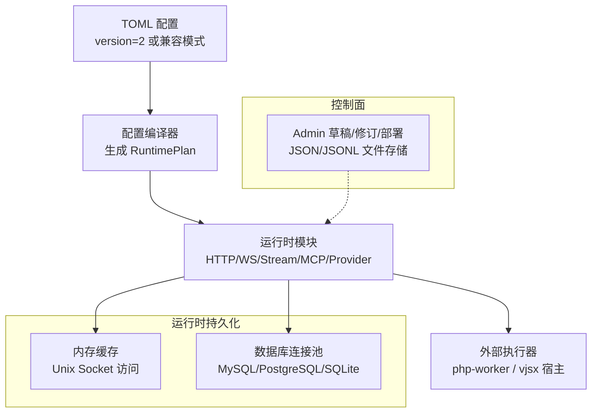
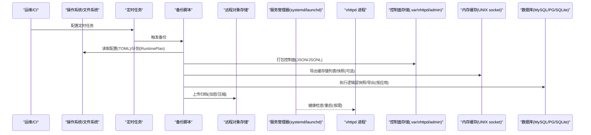
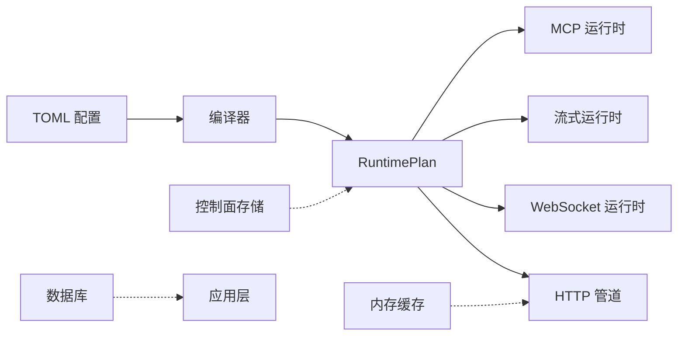

# 备份恢复

<cite>
**本文引用的文件**   
- [README.md](file://README.md)
- [ADMIN_CONTROL_PLANE_PLAN.md](file://docs/ADMIN_CONTROL_PLANE_PLAN.md)
- [CONFIGURATION_MODEL_V2.md](file://docs/CONFIGURATION_MODEL_V2.md)
- [PROTOCOL_PIPELINE_IMPLEMENTATION_PLAN.md](file://docs/PROTOCOL_PIPELINE_IMPLEMENTATION_PLAN.md)
- [config.v](file://src/config/config.v)
- [runtime_plan_loader.v](file://src/config/runtime_plan_loader.v)
- [server_lifecycle_runtime_config.v](file://src/server_lifecycle/runtime_config.v)
- [pipeline_runtime.v](file://src/pipeline_runtime.v)
- [cachex_runtime.v](file://src/cachex/runtime.v)
- [dbx_runtime.v](file://src/dbx/runtime.v)
- [inproc_vjsx_host_session_store_api.v](file://src/executor/inproc_vjsx_host_session_store_api.v)
- [state_store_test.v](file://src/state_store/state_store_test.v)
- [vhttpd@.service](file://deploy/systemd/vhttpd@.service)
- [io.guweigang.vhttpd.plist](file://deploy/launchd/io.guweigang.vhttpd.plist)
- [install_runtime.sh](file://scripts/install_runtime.sh)
- [runtime_doctor.sh](file://scripts/runtime_doctor.sh)
- [bundle_runtime_libs.sh](file://scripts/bundle_runtime_libs.sh)
- [object-cache.php](file://php/package/wordpress/v-profiler/object-cache.php)
</cite>

## 目录
1. [引言](#引言)
2. [项目结构](#项目结构)
3. [核心组件](#核心组件)
4. [架构总览](#架构总览)
5. [详细组件分析](#详细组件分析)
6. [依赖关系分析](#依赖关系分析)
7. [性能与一致性考量](#性能与一致性考量)
8. [故障排查指南](#故障排查指南)
9. [结论](#结论)
10. [附录：自动化脚本与定时任务](#附录自动化脚本与定时任务)

## 引言
本文件面向运维与平台工程团队，提供 vhttpd 的备份与恢复策略。内容覆盖需备份的数据类型（配置、运行时状态、会话、缓存、数据库等）、自动化备份与定时任务、本地与远程目标、不同恢复场景（完全恢复、增量恢复、灾难恢复）、数据一致性与验证方法，以及数据库迁移与版本升级时的数据保护策略。文档同时结合仓库中已有的控制面持久化设计、内存缓存与数据库运行态快照能力，给出可落地的操作建议。

## 项目结构
vhttpd 将“声明式配置”编译为不可变的运行时计划（RuntimePlan），由原生 V 模块消费；控制面（Admin）通过嵌入式存储管理草稿、修订与部署记录；运行时暴露多种快照接口用于观测与诊断。这些特性为制定备份与恢复策略提供了清晰的边界与抓手。

图表来源
- [CONFIGURATION_MODEL_V2.md:166-215](file://docs/CONFIGURATION_MODEL_V2.md#L166-L215)
- [PROTOCOL_PIPELINE_IMPLEMENTATION_PLAN.md:894-969](file://docs/PROTOCOL_PIPELINE_IMPLEMENTATION_PLAN.md#L894-L969)
- [ADMIN_CONTROL_PLANE_PLAN.md:69-146](file://docs/ADMIN_CONTROL_PLANE_PLAN.md#L69-L146)

章节来源
- [README.md:428-525](file://README.md#L428-L525)
- [CONFIGURATION_MODEL_V2.md:166-215](file://docs/CONFIGURATION_MODEL_V2.md#L166-L215)
- [ADMIN_CONTROL_PLANE_PLAN.md:69-146](file://docs/ADMIN_CONTROL_PLANE_PLAN.md#L69-L146)

## 核心组件
- 配置与计划
  - TOML 配置经编译器生成不可变 RuntimePlan，作为运行时唯一输入。
  - 支持 version=2 严格校验与 V1 兼容路径。
- 控制面持久化
  - Admin 使用嵌入式文件存储（JSON/JSONL），原子写入，启动重建轻量索引。
- 运行时快照
  - 缓存子系统提供进程内键值快照与统计。
  - 数据库子系统提供连接池、慢查询、事务等运行态快照。
- 会话与状态
  - 进程内会话存储 API 支持 set/get/patch/TTL 与 CAS 语义。
  - 示例应用（如 codexbot）使用 SQLite WAL 进行业务状态持久化。

章节来源
- [config.v:132-170](file://src/config/config.v#L132-L170)
- [runtime_plan_loader.v:443-473](file://src/config/runtime_plan_loader.v#L443-L473)
- [ADMIN_CONTROL_PLANE_PLAN.md:69-146](file://docs/ADMIN_CONTROL_PLANE_PLAN.md#L69-L146)
- [cachex_runtime.v:1-70](file://src/cachex/runtime.v#L1-L70)
- [dbx_runtime.v:1-70](file://src/dbx/runtime.v#L1-L70)
- [inproc_vjsx_host_session_store_api.v:43-86](file://src/executor/inproc_vjsx_host_session_store_api.v#L43-L86)

## 架构总览
下图展示备份与恢复在系统中的关键触点：配置、控制面、缓存、数据库与会话。

图表来源
- [ADMIN_CONTROL_PLANE_PLAN.md:69-146](file://docs/ADMIN_CONTROL_PLANE_PLAN.md#L69-L146)
- [cachex_runtime.v:1-70](file://src/cachex/runtime.v#L1-L70)
- [dbx_runtime.v:1-70](file://src/dbx/runtime.v#L1-L70)
- [vhttpd@.service](file://deploy/systemd/vhttpd@.service)
- [io.guweigang.vhttpd.plist](file://deploy/launchd/io.guweigang.vhttpd.plist)

## 详细组件分析

### 需要备份的数据类型与范围
- 配置文件与计划
  - TOML 配置（含多站点/多监听器）。
  - 已编译的 RuntimePlan（可通过 admin 端点获取并归档）。
- 控制面数据
  - 草稿、修订、部署记录与事件日志（JSON/JSONL）。
- 运行时状态
  - 进程内缓存（键空间、统计指标）。
  - 数据库连接池与慢查询观察（用于定位问题，非主数据源）。
- 会话与应用状态
  - 进程内会话（带 TTL/CAS）。
  - 应用级持久化（例如 SQLite WAL 的业务表）。
- 静态资源与上传目录
  - 静态根目录与上传临时目录（根据配置）。

章节来源
- [README.md:428-525](file://README.md#L428-L525)
- [ADMIN_CONTROL_PLANE_PLAN.md:69-146](file://docs/ADMIN_CONTROL_PLANE_PLAN.md#L69-L146)
- [cachex_runtime.v:1-70](file://src/cachex/runtime.v#L1-L70)
- [dbx_runtime.v:1-70](file://src/dbx/runtime.v#L1-L70)
- [inproc_vjsx_host_session_store_api.v:43-86](file://src/executor/inproc_vjsx_host_session_store_api.v#L43-L86)

### 自动化备份脚本与定时任务
- 备份范围
  - 配置与计划：TOML + RuntimePlan JSON。
  - 控制面：.var/vhttpd/admin 目录。
  - 缓存：键列表与统计快照（仅观测用途）。
  - 数据库：按应用选择合适方式（如 MySQL/PG 的逻辑导出或快照；SQLite 的 WAL 文件集）。
  - 静态与上传：配置中的 web_root 与 upload_dir。
- 存储目标
  - 本地：按日/周归档到 /var/backups/vhttpd。
  - 远程：同步至对象存储（S3/OSS/MinIO），开启加密与保留策略。
- 定时任务
  - Linux：systemd timer 或 cron。
  - macOS：launchd plist。
- 参考模板
  - systemd 单元与 launchd plist 见部署模板。
  - 安装与自检脚本可用于环境准备与验证。

章节来源
- [vhttpd@.service](file://deploy/systemd/vhttpd@.service)
- [io.guweigang.vhttpd.plist](file://deploy/launchd/io.guweigang.vhttpd.plist)
- [install_runtime.sh](file://scripts/install_runtime.sh)
- [runtime_doctor.sh](file://scripts/runtime_doctor.sh)
- [bundle_runtime_libs.sh](file://scripts/bundle_runtime_libs.sh)

### 数据恢复流程

#### 完全恢复
- 适用场景：整站重建、跨主机迁移。
- 步骤要点
  - 停止服务（优雅关闭，等待 worker 退出）。
  - 恢复配置与计划（TOML + RuntimePlan）。
  - 恢复控制面数据（.var/vhttpd/admin）。
  - 恢复静态与上传目录。
  - 恢复数据库（按引擎导入/还原）。
  - 启动服务并验证健康端点与关键路由。

章节来源
- [README.md:367-411](file://README.md#L367-L411)
- [ADMIN_CONTROL_PLANE_PLAN.md:69-146](file://docs/ADMIN_CONTROL_PLANE_PLAN.md#L69-L146)

#### 增量恢复
- 适用场景：单站点/单应用变更回滚、局部数据修复。
- 步骤要点
  - 基于最近一次全量备份 + 增量差异（文件或数据库 binlog/WAL）恢复。
  - 优先恢复只读数据（配置、静态），再恢复写数据（数据库）。
  - 对控制面与缓存无需强制恢复（可重建或忽略）。

章节来源
- [CONFIGURATION_MODEL_V2.md:166-215](file://docs/CONFIGURATION_MODEL_V2.md#L166-L215)

#### 灾难恢复
- 适用场景：节点/机房级故障。
- 步骤要点
  - 从异地副本拉取最新全量+增量。
  - 先恢复只读层（配置/静态），再恢复数据库。
  - 启动后执行端到端冒烟测试（健康、关键路由、MCP/Feishu 连通性）。

章节来源
- [README.md:367-411](file://README.md#L367-L411)

### 数据一致性保证措施
- 控制面持久化
  - 使用临时文件+原子重命名写入，避免半写状态。
  - 启动时扫描目录重建轻量索引。
- 缓存与会话
  - 进程内缓存无跨进程一致性要求；会话支持 TTL 与 CAS，避免并发覆盖。
- 数据库
  - 推荐逻辑层快照（导出/快照）而非直接拷贝数据文件（除 SQLite 外）。
  - SQLite 使用 WAL 模式，需在恢复时包含所有相关文件。

章节来源
- [ADMIN_CONTROL_PLANE_PLAN.md:87-112](file://docs/ADMIN_CONTROL_PLANE_PLAN.md#L87-L112)
- [state_store_test.v:37-52](file://src/state_store/state_store_test.v#L37-L52)
- [inproc_vjsx_host_session_store_api.v:43-86](file://src/executor/inproc_vjsx_host_session_store_api.v#L43-L86)

### 备份验证方法
- 完整性校验
  - 对归档包计算并保存校验和（sha256sum）。
  - 定期抽样解压校验。
- 可恢复性演练
  - 在隔离环境执行最小化恢复（仅配置+静态+空库），验证启动成功。
  - 逐步引入数据库与关键数据，验证关键路由与上游集成。
- 运行时观测
  - 利用 admin 端点查看 RuntimePlan、worker 与 provider 快照，确认恢复后行为一致。

章节来源
- [README.md:1112-1171](file://README.md#L1112-L1171)

### 数据库迁移与版本升级的数据保护策略
- 迁移前
  - 创建全量快照（逻辑导出或快照），并记录版本与时间戳。
  - 冻结写入口（灰度/限流），确保导出一致性。
- 迁移中
  - 先在只读副本执行迁移脚本与校验。
  - 切换流量至新版本实例，保持旧实例热备。
- 迁移后
  - 观察慢查询与错误率，必要时回滚至旧快照。
  - 清理过期备份，保留满足保留策略的版本。

章节来源
- [dbx_runtime.v:1-70](file://src/dbx/runtime.v#L1-L70)

## 依赖关系分析
- 配置到运行时
  - TOML -> 编译器 -> RuntimePlan -> 各运行时模块（HTTP/WS/Stream/MCP/Provider）。
- 控制面与运行时
  - Admin 存储独立于运行时数据平面，便于单独备份与恢复。
- 缓存与会话
  - 进程内缓存与会话 API 为运行时内部能力，不对外部强一致。

图表来源
- [CONFIGURATION_MODEL_V2.md:166-215](file://docs/CONFIGURATION_MODEL_V2.md#L166-L215)
- [PROTOCOL_PIPELINE_IMPLEMENTATION_PLAN.md:894-969](file://docs/PROTOCOL_PIPELINE_IMPLEMENTATION_PLAN.md#L894-L969)
- [ADMIN_CONTROL_PLANE_PLAN.md:69-146](file://docs/ADMIN_CONTROL_PLANE_PLAN.md#L69-L146)

章节来源
- [config.v:132-170](file://src/config/config.v#L132-L170)
- [runtime_plan_loader.v:443-473](file://src/config/runtime_plan_loader.v#L443-L473)

## 性能与一致性考量
- 备份窗口
  - 尽量在低峰期执行，避免与高吞吐请求竞争 I/O。
- 数据库导出
  - 使用逻辑导出（mysqldump/pg_dump/sqlite3 .dump）以保证一致性；避免直接拷贝 InnoDB/PG 数据文件。
- 缓存与会话
  - 不纳入强一致恢复范围；恢复后可重建。
- 静态与上传
  - 大文件采用分片/并行传输，启用去重与断点续传。

[本节为通用指导，不直接分析具体文件]

## 故障排查指南
- 启动失败
  - 检查配置语法与路径解析（环境变量与相对路径）。
  - 使用 runtime_doctor 与环境检测脚本验证依赖。
- 端口冲突/权限
  - 确认 systemd/launchd 模板中的用户、工作目录与端口绑定。
- 健康检查
  - 通过 admin 端点与健康路由验证服务就绪。

章节来源
- [README.md:367-411](file://README.md#L367-L411)
- [runtime_doctor.sh](file://scripts/runtime_doctor.sh)

## 结论
vhttpd 的备份与恢复应围绕“配置即计划、控制面独立、运行时快照可观测”的原则展开。以 TOML 与 RuntimePlan 为核心，配合控制面 JSON/JSONL 与数据库逻辑快照，构建分层备份体系；通过定期演练与校验，确保在完全恢复、增量恢复与灾难恢复场景下具备可预期的 RTO/RPO。

[本节为总结，不直接分析具体文件]

## 附录：自动化脚本与定时任务

### 备份清单与顺序
- 只读层
  - TOML 配置与 RuntimePlan JSON。
  - 静态资源与上传目录。
- 控制面
  - .var/vhttpd/admin 目录。
- 数据层
  - 数据库逻辑导出（MySQL/PG）或 SQLite 快照（WAL 相关文件）。
- 顺序
  - 先只读层，再控制面，最后数据层。

### 定时任务建议
- Linux
  - 使用 systemd timer 或 cron 每日执行，保留 N 天滚动。
- macOS
  - 使用 launchd plist 调度。

章节来源
- [vhttpd@.service](file://deploy/systemd/vhttpd@.service)
- [io.guweigang.vhttpd.plist](file://deploy/launchd/io.guweigang.vhttpd.plist)

### 远程同步与加密
- 使用 s3cmd/rclone/ossutil 等同步工具，开启服务端加密与客户端签名。
- 设置生命周期策略自动清理过期备份。

[本节为通用指导，不直接分析具体文件]

### WordPress 对象缓存适配
- 若使用 WordPress 对象缓存桥接，注意其调用的是进程内缓存接口，不影响备份范围。

章节来源
- [object-cache.php:80-126](file://php/package/wordpress/v-profiler/object-cache.php#L80-L126)