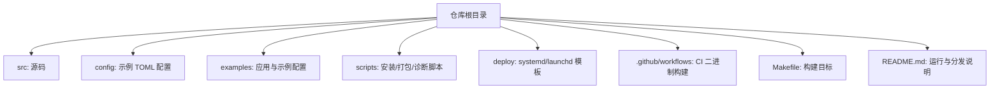
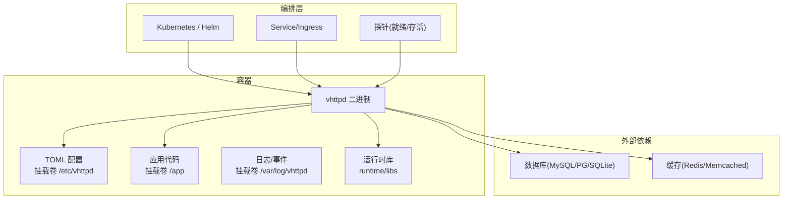
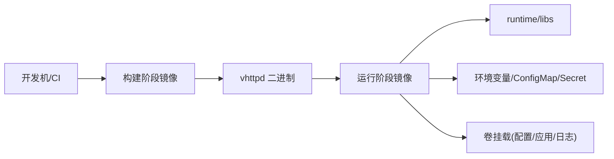

# 容器化部署

<cite>
**本文引用的文件**   
- [README.md](file://README.md)
- [Makefile](file://Makefile)
- [config/vhttpd.example.toml](file://config/vhttpd.example.toml)
- [deploy/systemd/vhttpd@.service](file://deploy/systemd/vhttpd@.service)
- [deploy/launchd/io.guweigang.vhttpd.plist](file://deploy/launchd/io.guweigang.vhttpd.plist)
- [.github/workflows/vhttpd-binaries.yml](file://.github/workflows/vhttpd-binaries.yml)
- [scripts/install_runtime.sh](file://scripts/install_runtime.sh)
- [scripts/runtime_doctor.sh](file://scripts/runtime_doctor.sh)
- [scripts/bundle_runtime_libs.sh](file://scripts/bundle_runtime_libs.sh)
- [examples/config/hello.toml](file://examples/config/hello.toml)
- [examples/config/laravel.toml](file://examples/config/laravel.toml)
- [examples/config/wordpress.toml](file://examples/config/wordpress.toml)
- [articles/12-advanced-patterns.md](file://articles/12-advanced-patterns.md)
</cite>

## 目录
1. [简介](#简介)
2. [项目结构](#项目结构)
3. [核心组件](#核心组件)
4. [架构总览](#架构总览)
5. [详细组件分析](#详细组件分析)
6. [依赖分析](#依赖分析)
7. [性能考虑](#性能考虑)
8. [故障排查指南](#故障排查指南)
9. [结论](#结论)
10. [附录](#附录)

## 简介
本指南面向生产环境，提供 VHTTPD 的完整容器化与编排方案。内容涵盖：
- 构建优化：多阶段构建、基础镜像选择、安全加固
- 运行时配置：环境变量、卷挂载、网络与安全
- 本地编排：docker-compose 示例
- 集群编排：Kubernetes Deployment/Service/ConfigMap/Secret 清单
- 大规模发布：Helm Chart 模板与滚动更新策略
- 高级特性：健康检查、资源限制、滚动更新、灰度与回滚

VHTTPD 是一个以 veb 为 HTTP 源的多协议执行宿主，支持 PHP worker、嵌入式 vjsx、WebSocket 与多种流式协议，适合在容器与 Kubernetes 中运行。

## 项目结构
仓库包含构建脚本、示例配置、服务管理模板与文档，便于在不同环境中快速落地容器化部署。

**图示来源**
- [README.md](file://README.md)
- [Makefile](file://Makefile)

**章节来源**
- [README.md](file://README.md)
- [Makefile](file://Makefile)

## 核心组件
- 构建系统
  - Makefile 提供 build/prod 等目标，控制 TLS 后端、DB 开关、GC 策略与产物输出路径。
  - CI 工作流用于生成跨平台二进制产物，并附带运行时库打包与 RPATH 重写逻辑。
- 运行模式
  - 前台进程 + 外部进程管理器（systemd/launchd）或容器运行时。
  - 通过 TOML 配置加载，支持变量展开与环境注入。
- 分发与安装
  - 提供 runtime 安装脚本与 doctor 自检脚本，便于在最小镜像中验证依赖。

**章节来源**
- [Makefile](file://Makefile)
- [README.md](file://README.md)

## 架构总览
下图展示 vhttpd 在容器中的典型运行形态：容器内仅运行单一可执行文件，通过卷挂载注入配置与应用代码，通过环境变量覆盖关键参数，由编排层负责健康检查、滚动更新与扩缩容。

[此图为概念性架构图，不直接映射具体源码文件]

## 详细组件分析

### 一、Docker 镜像构建（多阶段构建）
建议采用“编译期镜像 + 运行期镜像”的两阶段构建，将构建工具链与中间产物隔离，最终镜像仅包含二进制与必要运行时库，体积更小、攻击面更低。

- 构建阶段（Builder）
  - 基于 Debian Bookworm Slim 或 Alpine，安装 V 编译器与系统依赖（OpenSSL、Boehm GC、pkg-config、数据库客户端开发包）。
  - 使用 Makefile 的 prod 目标进行优化构建，启用 -prod 与无缓存选项。
  - 可选：根据 WITH_DB 开关决定是否链接 MySQL/PostgreSQL 客户端。
- 运行阶段（Runtime）
  - 基于 distroless 或 minimal 发行版，复制 vhttpd 二进制与 runtime/libs。
  - 设置非 root 用户运行，禁用不必要的系统能力。
  - 暴露端口：HTTP 与管理端口（默认分离），通过环境变量或 ConfigMap 注入。

参考要点（来自仓库说明）：
- 构建目标与标志位：见 Makefile 的 build/prod 目标与 V_TLS_BACKEND/V_DB_FLAGS 等变量。
- 二进制分发与运行时库打包：README 中描述了打包产物结构与 RPATH 重写，利于在精简镜像中运行。
- 推荐的最小安装流程：scripts/install_runtime.sh core/db/full 与 scripts/runtime_doctor.sh 自检。

**章节来源**
- [Makefile](file://Makefile)
- [README.md](file://README.md)
- [scripts/install_runtime.sh](file://scripts/install_runtime.sh)
- [scripts/runtime_doctor.sh](file://scripts/runtime_doctor.sh)
- [scripts/bundle_runtime_libs.sh](file://scripts/bundle_runtime_libs.sh)

### 二、基础镜像选择与安全配置
- 基础镜像
  - 构建阶段：debian:bookworm-slim 或 alpine:3.x（需安装对应依赖）。
  - 运行阶段：distroless/static、gcr.io/distroless/cc、或 minimal 发行版。
- 安全加固
  - 非 root 用户运行；只读根文件系统；最小权限集。
  - 仅暴露必要端口；关闭调试端点或置于内网管理平面。
  - 使用 Secret 注入敏感信息（如 Feishu app_id/app_secret、admin token）。
  - 定期扫描镜像漏洞，锁定基础镜像版本。

**章节来源**
- [README.md](file://README.md)

### 三、环境变量与配置注入
- 环境变量
  - 常见变量：VHTTPD_CONFIG、VHTTPD_APP、VHTTPD_SOCKET_PREFIX、FEISHU_* 系列等。
  - TOML 支持 ${env.NAME} 与 ${section.key} 变量展开，便于集中管理与覆盖。
- 配置来源优先级
  - 默认值 -> TOML 配置 -> CLI 参数（CLI 优先）。
- 推荐实践
  - 将通用配置放入 ConfigMap，敏感字段放入 Secret。
  - 通过环境变量覆盖不同环境的差异项（端口、时区、池大小等）。

**章节来源**
- [README.md](file://README.md)
- [config/vhttpd.example.toml](file://config/vhttpd.example.toml)

### 四、卷挂载策略
- 配置卷
  - /etc/vhttpd：存放 TOML 配置文件（可通过 ConfigMap 挂载）。
- 应用卷
  - /app：PHP 应用或 vjsx 入口所在目录（通过 Volume 或 Image 内置）。
- 日志与事件
  - /var/log/vhttpd：事件日志与标准输出重定向（持久化到 PVC 或侧车收集）。
- 运行时库
  - runtime/libs：若使用自打包运行时库，确保与二进制同目录或通过 RPATH 指向。

**章节来源**
- [README.md](file://README.md)

### 五、网络与服务暴露
- 端口规划
  - HTTP 数据面：默认 19881（可在 TOML 中调整）。
  - 管理面：默认 19981（建议仅对内网暴露）。
- 网络模型
  - 单实例：直接暴露 Service。
  - 多实例：配合 Ingress/网关做路由与限流。
- WebSocket/长连接
  - 如需粘性会话，结合负载均衡器会话保持或应用层一致性哈希。

**章节来源**
- [README.md](file://README.md)

### 六、docker-compose 示例
以下给出一个可直接运行的 compose 片段思路（请结合实际路径与镜像名替换）：
- 定义 vhttpd 服务
  - image: 使用前述多阶段构建产物
  - ports: 映射 HTTP 与管理端口
  - environment: 注入 VHTTPD_CONFIG、VHTTPD_APP、FEISHU_* 等
  - volumes: 挂载配置、应用、日志目录
  - restart: always
- 可选：定义 sidecar 日志收集或数据库服务

[本节为概念性示例，未直接引用具体源码文件]

### 七、Kubernetes 部署清单
- Deployment
  - replicas：按负载设定
  - containers：指定镜像、端口、环境变量、资源限制、探针
  - volumeMounts：挂载配置、应用、日志
- Service
  - ClusterIP/LoadBalancer/NodePort 按需选择
  - 暴露 HTTP 与管理端口（管理端口建议仅内部访问）
- ConfigMap
  - 存放 TOML 配置（paths、server、worker、executor、php、assets、feishu 等）
- Secret
  - 存储敏感信息（FEISHU_APP_ID、FEISHU_APP_SECRET、admin.token 等）
- 健康检查
  - livenessProbe/readinessProbe：HTTP GET /health 或自定义端点
- 滚动更新
  - strategy.rollingUpdate：maxUnavailable/maxSurge 控制节奏
- 资源限制
  - requests/limits：CPU/内存，避免抖动与 OOM

参考示例片段（来自仓库文章）：
- Deployment/Service 示例与探针、资源限制配置

**章节来源**
- [articles/12-advanced-patterns.md](file://articles/12-advanced-patterns.md)

### 八、Helm Chart 模板（大规模集群）
- Chart 结构
  - values.yaml：全局默认值（镜像、副本数、资源、探针、环境变量、卷、Service 类型等）
  - templates/deployment.yaml：渲染 Deployment
  - templates/service.yaml：渲染 Service
  - templates/configmap.yaml：渲染 ConfigMap
  - templates/secret.yaml：渲染 Secret
  - templates/hpa.yaml：可选，自动扩缩容
- 关键能力
  - 多环境 values 覆盖（dev/staging/prod）
  - 通过 values 切换 executor/php/vjsx 模式
  - 通过 values 注入 FEISHU_* 等第三方凭据
  - 统一探针与滚动策略

[本节为概念性模板设计，未直接引用具体源码文件]

### 九、健康检查、资源限制与滚动更新
- 健康检查
  - 就绪探针：确认 worker 池初始化完成、监听端口可用
  - 存活探针：检测进程是否响应
- 资源限制
  - CPU/内存 requests/limits 合理设置，结合 HPA 实现弹性
- 滚动更新
  - 逐步替换 Pod，保障零停机
  - 失败自动回滚，观察指标与日志定位问题

**章节来源**
- [articles/12-advanced-patterns.md](file://articles/12-advanced-patterns.md)

## 依赖分析
- 构建依赖
  - V 编译器、OpenSSL、Boehm GC、pkg-config、数据库客户端开发包（MySQL/PostgreSQL/SQLite）
  - vjsx 模块与 QuickJS 源码（可选，取决于 executor=vjsx）
- 运行时依赖
  - 二进制与 bundled 运行时库（libssl/libcrypto/libgc/libmysqlclient/libpq 等）
  - 通过 RPATH 优先加载 bundled 库，降低宿主机依赖风险

**图示来源**
- [README.md](file://README.md)
- [Makefile](file://Makefile)

**章节来源**
- [README.md](file://README.md)
- [Makefile](file://Makefile)

## 性能考虑
- 构建优化
  - 使用 prod 目标与 -nocache，减少镜像体积与启动时间
  - 固定依赖版本，保证可复现构建
- 运行时优化
  - 合理设置 worker pool_size、read_timeout_ms、queue_capacity 等
  - 开启静态资源缓存（assets.enabled/cache_control）
  - 针对 AI 流式场景，利用 stream phase 3 与 UpstreamPlan 提升吞吐
- 资源规划
  - 依据 QPS 与延迟目标设置 CPU/内存请求与限制
  - 使用 HPA 基于 CPU/内存或自定义指标自动扩缩容

**章节来源**
- [README.md](file://README.md)

## 故障排查指南
- 启动失败
  - 检查 TOML 路径与变量展开是否正确
  - 使用 scripts/runtime_doctor.sh 校验环境与依赖
- 无法连接数据库
  - 确认已安装 db 运行时库或镜像中包含相应 client 库
  - 检查网络策略与 Secret 注入
- 管理端不可用
  - 确认 admin.host/admin.port/token 配置正确且未被防火墙拦截
- 日志与事件
  - 查看 files.event_log 与标准输出，结合编排层日志收集

**章节来源**
- [README.md](file://README.md)
- [scripts/runtime_doctor.sh](file://scripts/runtime_doctor.sh)

## 结论
通过将 VHTTPD 以多阶段构建方式打包为精简镜像，并结合 ConfigMap/Secret、卷挂载与健康探针，可以在 Docker 与 Kubernetes 中稳定运行。借助 Helm 模板与滚动更新策略，可实现大规模集群的高效交付与运维。

## 附录

### A. 常用环境变量与配置键
- 环境变量
  - VHTTPD_CONFIG：TOML 配置文件路径
  - VHTTPD_APP：应用入口（PHP 或 vjsx）
  - VHTTPD_SOCKET_PREFIX：Worker socket 前缀
  - FEISHU_APP_ID/FEISHU_APP_SECRET/FEISHU_VERIFICATION_TOKEN/FEISHU_ENCRYPT_KEY：飞书集成凭据
- TOML 关键段
  - paths：根路径、应用与扩展路径
  - server：host/port
  - files：pid_file/event_log
  - worker：pool_size/read_timeout_ms/socket_prefix 等
  - executor：kind=php|vjsx
  - php：bin/worker_entry/app_entry/extensions/args
  - admin：host/port/token
  - assets：enabled/prefix/root/cache_control
  - feishu：全局与多 app 配置

**章节来源**
- [README.md](file://README.md)
- [config/vhttpd.example.toml](file://config/vhttpd.example.toml)

### B. 示例配置参考
- hello 应用配置
- laravel 应用配置
- wordpress 应用配置

**章节来源**
- [examples/config/hello.toml](file://examples/config/hello.toml)
- [examples/config/laravel.toml](file://examples/config/laravel.toml)
- [examples/config/wordpress.toml](file://examples/config/wordpress.toml)

### C. 服务管理模板
- systemd 单元模板（Linux）
- launchd plist 模板（macOS）

**章节来源**
- [deploy/systemd/vhttpd@.service](file://deploy/systemd/vhttpd@.service)
- [deploy/launchd/io.guweigang.vhttpd.plist](file://deploy/launchd/io.guweigang.vhttpd.plist)

### D. CI 二进制构建
- GitHub Actions 工作流用于构建 linux-amd64/macos-* 二进制，并附带运行时库打包与 RPATH 重写，便于在精简镜像中运行。

**章节来源**
- [.github/workflows/vhttpd-binaries.yml](file://.github/workflows/vhttpd-binaries.yml)
- [README.md](file://README.md)