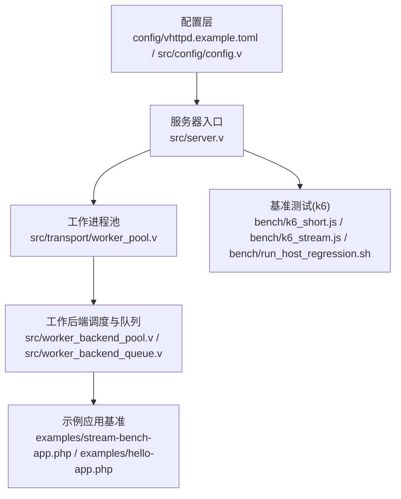
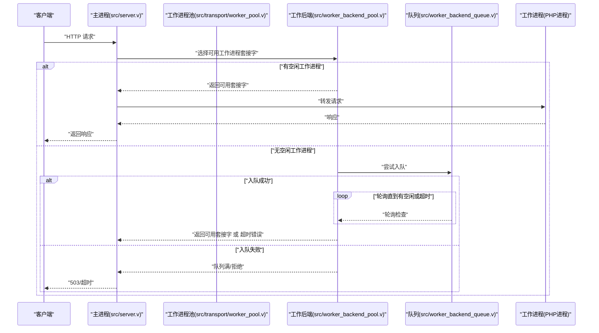
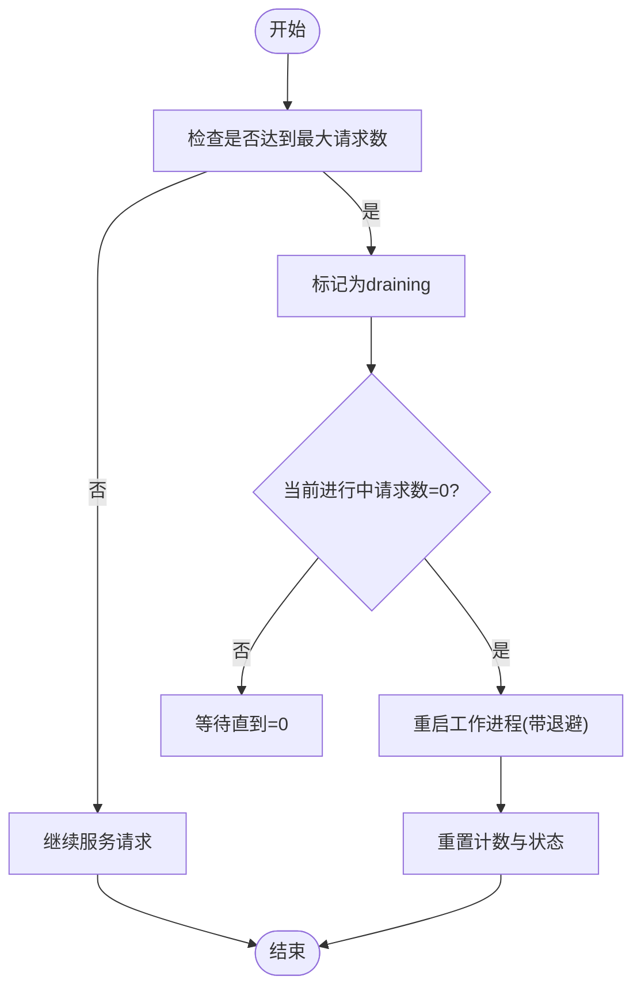
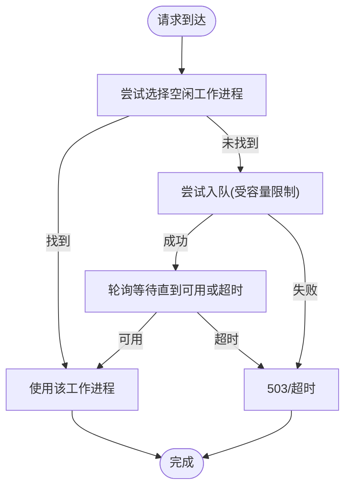
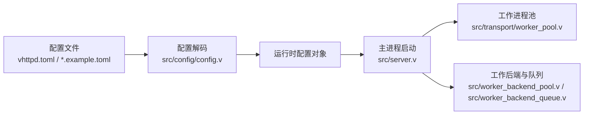

# 性能调优

<cite>
**本文引用的文件**
- [bench/README.md](file://bench/README.md)
- [bench/k6_short.js](file://bench/k6_short.js)
- [bench/k6_stream.js](file://bench/k6_stream.js)
- [bench/run_host_regression.sh](file://bench/run_host_regression.sh)
- [config/vhttpd.example.toml](file://config/vhttpd.example.toml)
- [src/config/config.v](file://src/config/config.v)
- [src/transport/worker_pool.v](file://src/transport/worker_pool.v)
- [src/worker_backend_pool.v](file://src/worker_backend_pool.v)
- [src/worker_backend_queue.v](file://src/worker_backend_queue.v)
- [src/server.v](file://src/server.v)
- [examples/stream-bench-app.php](file://examples/stream-bench-app.php)
- [examples/hello-app.php](file://examples/hello-app.php)
- [vhttpd.toml](file://vhttpd.toml)
</cite>

## 目录
1. [简介](#简介)
2. [项目结构](#项目结构)
3. [核心组件](#核心组件)
4. [架构总览](#架构总览)
5. [详细组件分析](#详细组件分析)
6. [依赖关系分析](#依赖关系分析)
7. [性能考量与优化建议](#性能考量与优化建议)
8. [故障排查指南](#故障排查指南)
9. [结论](#结论)
10. [附录：基准测试与工具使用](#附录：基准测试与工具使用)

## 简介
本文件面向系统管理员与性能工程师，提供 vhttpd 的系统化性能调优指导。内容覆盖内存使用优化（工作进程生命周期与重启退避）、并发控制（工作进程数量、连接池与请求队列）、网络性能（TCP 参数、连接复用与缓冲区）、基准测试（k6）以及不同负载场景下的调优策略与监控指标解读。

## 项目结构
vhttpd 的性能相关能力主要由以下模块构成：
- 配置层：定义服务器、工作进程池、队列、PHP 执行器等参数
- 传输层：管理工作进程生命周期、自动拉起、重启退避与套接字选择
- 工作后端：队列排队、超时与拒绝策略、统计与可观测性
- 基准测试：k6 脚本与回归脚本，支持短请求与流式传输压测

图表来源
- [config/vhttpd.example.toml:1-67](file://config/vhttpd.example.toml#L1-L67)
- [src/config/config.v:284-307](file://src/config/config.v#L284-L307)
- [src/server.v:171-201](file://src/server.v#L171-L201)
- [src/transport/worker_pool.v:32-183](file://src/transport/worker_pool.v#L32-L183)
- [src/worker_backend_pool.v:306-383](file://src/worker_backend_pool.v#L306-L383)
- [src/worker_backend_queue.v:59-93](file://src/worker_backend_queue.v#L59-L93)
- [examples/stream-bench-app.php:1-88](file://examples/stream-bench-app.php#L1-L88)
- [examples/hello-app.php:1-49](file://examples/hello-app.php#L1-L49)
- [bench/k6_short.js:1-44](file://bench/k6_short.js#L1-L44)
- [bench/k6_stream.js:1-52](file://bench/k6_stream.js#L1-L52)
- [bench/run_host_regression.sh:1-130](file://bench/run_host_regression.sh#L1-L130)

章节来源
- [config/vhttpd.example.toml:1-67](file://config/vhttpd.example.toml#L1-L67)
- [src/config/config.v:284-307](file://src/config/config.v#L284-L307)
- [src/server.v:171-201](file://src/server.v#L171-L201)

## 核心组件
- 配置模型：集中定义服务器、工作进程池、队列容量与超时、PHP 执行器路径与扩展等关键参数
- 工作进程池：负责工作进程的启动、健康探测、重启退避、最大请求数限制与套接字选择
- 工作后端队列：在无可用工作进程时进行排队等待，支持容量限制与超时
- 基准测试：提供短请求与流式传输两类场景，便于对比不同配置下的吞吐与延迟表现

章节来源
- [src/config/config.v:24-41](file://src/config/config.v#L24-L41)
- [src/transport/worker_pool.v:74-97](file://src/transport/worker_pool.v#L74-L97)
- [src/worker_backend_queue.v:9-23](file://src/worker_backend_queue.v#L9-L23)
- [bench/README.md:59-158](file://bench/README.md#L59-L158)

## 架构总览
vhttpd 的数据面采用“主进程 + 多工作进程”的模式，主进程负责监听与调度，工作进程通过 Unix 域套接字与主进程通信。当工作进程池启用时，主进程会自动拉起工作进程，并在进程异常或达到最大请求数后按退避策略重启；当所有工作进程繁忙时，请求可进入队列等待，直至超时或被拒绝。

图表来源
- [src/server.v:38-80](file://src/server.v#L38-L80)
- [src/transport/worker_pool.v:142-166](file://src/transport/worker_pool.v#L142-L166)
- [src/worker_backend_pool.v:306-383](file://src/worker_backend_pool.v#L306-L383)
- [src/worker_backend_queue.v:59-93](file://src/worker_backend_queue.v#L59-L93)

## 详细组件分析

### 内存使用优化与工作进程生命周期
- 最大请求数限制：工作进程在服务一定请求数后进入“draining”状态，待当前请求完成后再重启，避免长时间运行导致的内存碎片与泄漏累积
- 重启退避：失败重启采用指数退避上限，降低雪崩风险
- 进程资源观测：可通过进程 PID 查询 RSS 内存，辅助定位内存增长问题

图表来源
- [src/worker_backend_pool.v:179-194](file://src/worker_backend_pool.v#L179-L194)
- [src/transport/worker_pool.v:168-182](file://src/transport/worker_pool.v#L168-L182)
- [src/worker_backend_pool.v:401-416](file://src/worker_backend_pool.v#L401-L416)

章节来源
- [src/worker_backend_pool.v:179-194](file://src/worker_backend_pool.v#L179-L194)
- [src/transport/worker_pool.v:168-182](file://src/transport/worker_pool.v#L168-L182)
- [src/worker_backend_pool.v:401-416](file://src/worker_backend_pool.v#L401-L416)

### 并发控制与队列策略
- 工作进程池大小：决定并发处理能力上限
- 队列容量与超时：在高并发下保护系统不被压垮，避免无限排队
- 轮询选择策略：RR 轮询空闲工作进程，优先挑选非“draining”且无进行中请求的进程

图表来源
- [src/worker_backend_pool.v:206-246](file://src/worker_backend_pool.v#L206-L246)
- [src/worker_backend_queue.v:59-93](file://src/worker_backend_queue.v#L59-L93)

章节来源
- [src/worker_backend_pool.v:206-246](file://src/worker_backend_pool.v#L206-L246)
- [src/worker_backend_queue.v:59-93](file://src/worker_backend_queue.v#L59-L93)

### 网络性能优化要点
- 连接复用：通过工作进程池与 RR 轮询减少连接建立开销
- 套接字选择：健康探测确保工作进程可用，避免连接失败带来的重试成本
- 队列与超时：防止突发流量导致的级联阻塞

章节来源
- [src/transport/worker_pool.v:34-45](file://src/transport/worker_pool.v#L34-L45)
- [src/worker_backend_pool.v:306-383](file://src/worker_backend_pool.v#L306-L383)

### 配置项与调优入口
- 服务器与运行时：主机、端口、时区
- 工作进程：读超时、自动启动、池大小、套接字前缀、最大请求数、重启退避
- 队列：容量、超时、轮询间隔
- PHP 执行器：二进制、工作进程入口、应用入口、扩展列表、参数

章节来源
- [config/vhttpd.example.toml:8-67](file://config/vhttpd.example.toml#L8-L67)
- [src/config/config.v:24-41](file://src/config/config.v#L24-L41)
- [src/config/config.v:495-542](file://src/config/config.v#L495-L542)
- [src/server.v:118-125](file://src/server.v#L118-L125)

## 依赖关系分析
- 配置解析依赖 toml 解码，生成运行时配置对象
- 主进程根据配置构建应用运行时，启动服务器与工作进程池
- 工作进程池与队列共同决定请求能否被承接与何时被拒绝

图表来源
- [config/vhttpd.example.toml:1-67](file://config/vhttpd.example.toml#L1-L67)
- [src/config/config.v:313-352](file://src/config/config.v#L313-L352)
- [src/server.v:171-201](file://src/server.v#L171-L201)
- [src/transport/worker_pool.v:142-166](file://src/transport/worker_pool.v#L142-L166)
- [src/worker_backend_pool.v:306-383](file://src/worker_backend_pool.v#L306-L383)
- [src/worker_backend_queue.v:59-93](file://src/worker_backend_queue.v#L59-L93)

章节来源
- [src/config/config.v:313-352](file://src/config/config.v#L313-L352)
- [src/server.v:171-201](file://src/server.v#L171-L201)

## 性能考量与优化建议

### 内存使用优化
- 合理设置最大请求数：在业务允许范围内降低重启频率，平衡内存回收与吞吐
- 观察 RSS：结合进程 PID 的 RSS 指标，识别是否存在渐进式增长，必要时缩短最大请求数周期
- 重启退避：适当提高基础退避与上限，避免频繁重启造成抖动

章节来源
- [src/worker_backend_pool.v:179-194](file://src/worker_backend_pool.v#L179-L194)
- [src/transport/worker_pool.v:168-182](file://src/transport/worker_pool.v#L168-L182)
- [src/worker_backend_pool.v:401-416](file://src/worker_backend_pool.v#L401-L416)

### 并发控制调优
- 工作进程池大小：从 CPU 核心数与 IO 特性出发，逐步提升至瓶颈出现点
- 队列容量与超时：在峰值流量下保持合理的排队窗口，避免过长导致尾延迟过高
- 健康探测与退避：确保工作进程可用性，减少无效重试

章节来源
- [src/worker_backend_pool.v:206-246](file://src/worker_backend_pool.v#L206-L246)
- [src/worker_backend_queue.v:59-93](file://src/worker_backend_queue.v#L59-L93)
- [src/transport/worker_pool.v:34-45](file://src/transport/worker_pool.v#L34-L45)

### 网络性能优化
- TCP 参数：在系统层面适度增大发送/接收缓冲区、半连接队列与 TIME_WAIT 复用
- 连接复用：尽量使用 keep-alive 与 HTTP/2，减少握手开销
- 套接字路径：确保 Unix 域套接字权限正确，避免权限导致的连接失败

章节来源
- [src/transport/worker_pool.v:34-45](file://src/transport/worker_pool.v#L34-L45)

### 不同负载场景建议
- 短请求场景：侧重 CPU 密集型任务，适度提高池大小与队列超时，避免排队
- 流式传输场景：关注事件/文本两种模式下的传输开销，固定令牌数对比不同间隔，固定间隔对比不同令牌数以验证线性扩展

章节来源
- [bench/README.md:102-158](file://bench/README.md#L102-L158)
- [examples/stream-bench-app.php:42-87](file://examples/stream-bench-app.php#L42-L87)

## 故障排查指南
- 工作进程未就绪：检查套接字路径与权限，确认命令行参数注入了套接字占位符
- 全部工作进程繁忙：查看队列容量与超时设置，评估是否需要扩容池大小
- 重启退避触发：观察重启次数与下次重试时间戳，判断是否为瞬时错误或持续异常
- 内存增长：结合 RSS 指标与最大请求数重启策略，确认是否需要缩短生命周期

章节来源
- [src/transport/worker_pool.v:47-64](file://src/transport/worker_pool.v#L47-L64)
- [src/worker_backend_pool.v:306-383](file://src/worker_backend_pool.v#L306-L383)
- [src/worker_backend_pool.v:418-457](file://src/worker_backend_pool.v#L418-L457)
- [src/worker_backend_pool.v:401-416](file://src/worker_backend_pool.v#L401-L416)

## 结论
通过对工作进程生命周期、队列策略与网络传输的系统化调优，vhttpd 可在不同负载场景下获得稳定且可预期的性能表现。建议以基准测试为依据，结合监控指标迭代优化，逐步逼近系统瓶颈并实现稳定扩容。

## 附录：基准测试与工具使用

### k6 基准测试
- 短请求基准：用于评估静态路由与简单逻辑的吞吐与延迟
- 流式传输基准：分别测试 SSE 与文本模式，对比不同令牌数与间隔对延迟与吞吐的影响
- 回归脚本：一键构建、启动 vhttpd、运行短请求与流式基准，并清理残留进程

章节来源
- [bench/README.md:59-158](file://bench/README.md#L59-L158)
- [bench/k6_short.js:11-30](file://bench/k6_short.js#L11-L30)
- [bench/k6_stream.js:12-31](file://bench/k6_stream.js#L12-L31)
- [bench/run_host_regression.sh:90-130](file://bench/run_host_regression.sh#L90-L130)

### 基准测试执行步骤
- 安装 k6 并准备环境变量（如基础 URL、路径、流模式、工作进程池大小）
- 运行短请求与流式传输脚本，观察阈值与错误率
- 使用回归脚本进行端到端回归，包含健康检查与进程清理

章节来源
- [bench/README.md:16-58](file://bench/README.md#L16-L58)
- [bench/run_host_regression.sh:12-66](file://bench/run_host_regression.sh#L12-L66)

### 结果分析要点
- 短请求：关注 p95/p99 延迟与失败率阈值是否达标
- 流式传输：关注模式差异、令牌数与间隔对延迟与吞吐的影响，验证近似线性扩展
- 队列行为：当出现排队与超时时，结合队列统计指标定位瓶颈

章节来源
- [bench/k6_short.js:25-30](file://bench/k6_short.js#L25-L30)
- [bench/k6_stream.js:26-31](file://bench/k6_stream.js#L26-L31)
- [src/worker_backend_queue.v:35-57](file://src/worker_backend_queue.v#L35-L57)