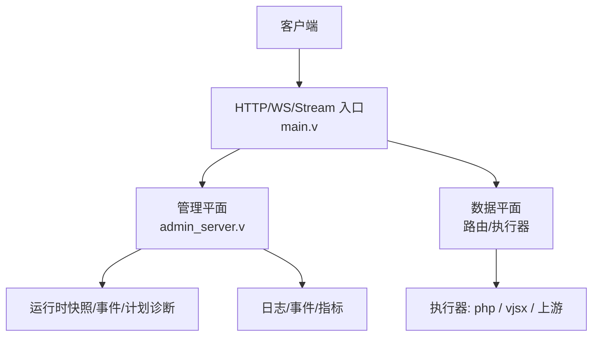
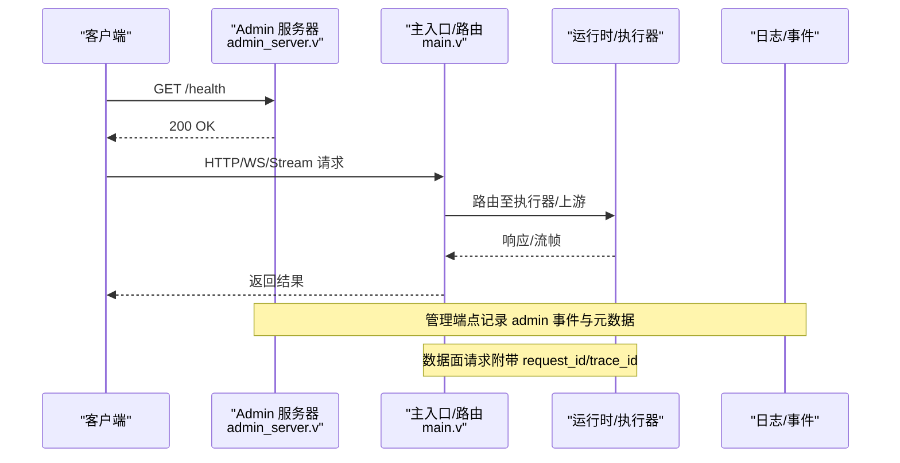

# 故障排查

<cite>
**本文引用的文件**   
- [README.md](file://README.md)
- [src/main.v](file://src/main.v)
- [src/admin_server.v](file://src/admin_server.v)
- [src/logging/runtime_logger.v](file://src/logging/runtime_logger.v)
- [scripts/doctor.sh](file://scripts/doctor.sh)
- [scripts/runtime_doctor.sh](file://scripts/runtime_doctor.sh)
- [articles/11-observability.md](file://articles/11-observability.md)
- [src/app_runtime_builder_test.v](file://src/app_runtime_builder_test.v)
- [src/runtime_plan_route_builder.v](file://src/runtime_plan_route_builder.v)
- [src/config/v2_plan_compiler.v](file://src/config/v2_plan_compiler.v)
- [php/package/src/VHttpd/WordPress/Profiler.php](file://php/package/src/VHttpd/WordPress/Profiler.php)
</cite>

## 目录
1. [简介](#简介)
2. [项目结构](#项目结构)
3. [核心组件](#核心组件)
4. [架构总览](#架构总览)
5. [详细组件分析](#详细组件分析)
6. [依赖分析](#依赖分析)
7. [性能考虑](#性能考虑)
8. [故障排查指南](#故障排查指南)
9. [结论](#结论)
10. [附录](#附录)

## 简介
本指南聚焦于 vhttpd 在生产与开发环境中的问题定位与解决，覆盖启动失败、性能瓶颈、内存泄漏、网络连接异常等典型场景。文档同时说明如何使用内置的诊断工具与健康检查端点，如何系统化分析日志（错误日志、性能日志、调试模式），以及如何监控 CPU、内存、磁盘、网络等资源并识别异常。最后给出性能调优建议与第三方依赖问题的排查方法。

## 项目结构
vhttpd 将“管理平面”和“数据平面”解耦：
- 管理平面提供健康检查、运行时快照、事件查询、配置替换预览与应用等能力；
- 数据平面负责 HTTP/WebSocket/流式请求的接入、路由与执行器调度；
- 可观测性通过结构化日志、事件日志与 Admin 端点暴露指标。

图表来源
- [src/main.v:1-117](file://src/main.v#L1-L117)
- [src/admin_server.v:110-165](file://src/admin_server.v#L110-L165)

章节来源
- [README.md:1147-1185](file://README.md#L1147-L1185)
- [src/main.v:1-117](file://src/main.v#L1-L117)

## 核心组件
- 健康检查与管理端点：提供进程存活、工作池状态、运行时摘要、事件列表、计划诊断等能力。
- 日志系统：支持按环境变量控制级别，生产默认 warn，开发默认 info。
- 诊断脚本：构建期 doctor 与运行期 runtime-doctor，用于环境与依赖自检。
- 可观测性文章：Prometheus 集成、自定义指标、日志轮转策略等实践。

章节来源
- [src/admin_server.v:110-165](file://src/admin_server.v#L110-L165)
- [src/logging/runtime_logger.v:1-42](file://src/logging/runtime_logger.v#L1-L42)
- [scripts/doctor.sh:1-108](file://scripts/doctor.sh#L1-L108)
- [scripts/runtime_doctor.sh:1-126](file://scripts/runtime_doctor.sh#L1-L126)
- [articles/11-observability.md:406-468](file://articles/11-observability.md#L406-L468)

## 架构总览
下图展示了从请求进入、到管理平面与数据平面的交互，以及关键的可观测性输出点。

图表来源
- [src/admin_server.v:110-165](file://src/admin_server.v#L110-L165)
- [src/main.v:40-73](file://src/main.v#L40-L73)

## 详细组件分析

### 健康检查与管理端点
- 健康检查：GET /health 返回 200 OK，用于负载均衡或编排系统的存活探测。
- 工作池与统计：GET /admin/workers、GET /admin/stats 返回工作池与工作队列状态。
- 运行时快照：GET /admin/runtime 返回活跃连接/会话计数、能力开关、内存占用等。
- 计划与诊断：GET /admin/runtime/plan 返回当前运行时计划及诊断信息，便于快速发现配置错误。
- 事件与图：GET /admin/events、GET /admin/runtime/graph 提供最近事件与拓扑视图。
- 上游与 WebSocket/MCP：/admin/runtime/upstreams、/admin/runtime/websockets、/admin/runtime/mcp 提供活动会话与过滤能力。
- 提供者实例：/admin/runtime/provider-instances 提供 Feishu/Codex 等提供者实例状态。

章节来源
- [README.md:1147-1185](file://README.md#L1147-L1185)
- [src/admin_server.v:110-165](file://src/admin_server.v#L110-L165)
- [src/admin_server.v:623-675](file://src/admin_server.v#L623-L675)
- [src/admin_server.v:677-716](file://src/admin_server.v#L677-L716)

### 日志系统与调试模式
- 日志级别：通过环境变量 VHTTPD_LOG_LEVEL 控制，支持 debug/info/warn/error/fatal；生产默认 warn，开发默认 info。
- 时间与时区：日志使用本地时间，时区由运行时配置决定。
- 调试模式：在开发环境下可将级别设为 debug，结合 Admin 事件与运行时快照进行定位。

章节来源
- [src/logging/runtime_logger.v:1-42](file://src/logging/runtime_logger.v#L1-L42)

### 诊断与自检脚本
- 构建期诊断：scripts/doctor.sh 检查命令、pkg-config、QuickJS 源码、DB 客户端工具等。
- 运行期诊断：scripts/runtime_doctor.sh 检查二进制、动态库解析、sqlite3/mysql_config/pg_config 可用性与 vjsx 资源嵌入情况。

章节来源
- [scripts/doctor.sh:1-108](file://scripts/doctor.sh#L1-L108)
- [scripts/runtime_doctor.sh:1-126](file://scripts/runtime_doctor.sh#L1-L126)

### 运行时计划与诊断
- 计划编译阶段会收集诊断信息，并在运行时通过 /admin/runtime/plan 暴露。
- 测试用例验证了当引用缺失或配置不合法时，诊断会被追加到运行时可见的计划中。

章节来源
- [src/config/v2_plan_compiler.v:182-203](file://src/config/v2_plan_compiler.v#L182-L203)
- [src/app_runtime_builder_test.v:11-58](file://src/app_runtime_builder_test.v#L11-L58)
- [src/app_runtime_builder_test.v:411-474](file://src/app_runtime_builder_test.v#L411-L474)
- [src/app_runtime_builder_test.v:662-718](file://src/app_runtime_builder_test.v#L662-L718)

### PHP 侧性能探针（示例）
- WordPress Profiler 示例展示了如何在应用层采集请求上下文、峰值内存、头部等信息，辅助定位慢请求与内存问题。

章节来源
- [php/package/src/VHttpd/WordPress/Profiler.php:925-943](file://php/package/src/VHttpd/WordPress/Profiler.php#L925-L943)

## 依赖分析
- 外部依赖：OpenSSL、Boehm GC、SQLite/MySQL/PostgreSQL 客户端库、QuickJS（vjsx）。
- 打包与分发：发布包内嵌非系统原生库，并通过 RPATH/@loader_path 优先加载，降低现场依赖缺失风险。
- 诊断脚本帮助快速发现缺少的命令与库。

章节来源
- [README.md:300-366](file://README.md#L300-L366)
- [scripts/doctor.sh:49-101](file://scripts/doctor.sh#L49-L101)
- [scripts/runtime_doctor.sh:46-87](file://scripts/runtime_doctor.sh#L46-L87)

## 性能考虑
- 指标与可视化：通过 /admin/metrics 暴露 Prometheus 格式指标，配合 Grafana 进行可视化。
- 自定义指标：在 PHP Worker 中可通过 Metrics API 上报业务指标。
- 日志轮转：配合 logrotate 对 NDJSON 日志进行切割与归档，避免磁盘膨胀。
- 资源监控：关注 worker 队列长度、错误率、WebSocket/MCP 会话数、内存占用等关键指标。

章节来源
- [articles/11-observability.md:406-468](file://articles/11-observability.md#L406-L468)

## 故障排查指南

### 启动失败
常见原因与步骤：
- 依赖缺失：使用 scripts/doctor.sh 与 scripts/runtime_doctor.sh 检查命令与库是否齐全。
- 端口冲突：确认监听端口未被占用，必要时更换端口。
- 配置错误：查看 /admin/runtime/plan 的诊断信息，修复路径正则、引用缺失等问题。
- 权限与路径：确保 pid_file、event_log、assets root 等路径存在且可写。

操作要点：
- 使用 /health 确认进程存活。
- 使用 /admin/runtime 与 /admin/stats 观察启动后状态。
- 调整 VHTTPD_LOG_LEVEL=debug 获取更详细的启动日志。

章节来源
- [scripts/doctor.sh:1-108](file://scripts/doctor.sh#L1-L108)
- [scripts/runtime_doctor.sh:1-126](file://scripts/runtime_doctor.sh#L1-L126)
- [src/admin_server.v:110-165](file://src/admin_server.v#L110-L165)
- [src/logging/runtime_logger.v:1-42](file://src/logging/runtime_logger.v#L1-L42)

### 性能问题
定位思路：
- 指标层面：关注 /admin/stats 与 /admin/runtime 的 HTTP 错误率、worker 队列长度、活跃连接数、内存占用。
- 链路追踪：利用 request_id/trace_id 关联一次请求在各模块的日志与事件。
- 应用层：参考 PHP Profiler 示例，采集峰值内存与请求上下文，定位热点路径。
- 外部依赖：数据库连接池、上游服务延迟与限流。

优化建议：
- 合理设置 worker 池大小与超时参数，避免队列积压。
- 启用结构化日志与采样，减少 I/O 开销。
- 针对长连接与流式处理，关注上游协议与缓冲策略。

章节来源
- [README.md:1147-1185](file://README.md#L1147-L1185)
- [php/package/src/VHttpd/WordPress/Profiler.php:925-943](file://php/package/src/VHttpd/WordPress/Profiler.php#L925-L943)
- [src/main.v:40-73](file://src/main.v#L40-L73)

### 内存泄漏
排查步骤：
- 观察 /admin/runtime 的内存指标趋势，判断是否存在持续增长。
- 结合 PHP Profiler 的 peak_memory_bytes 与 included_files_count，定位大对象或重复加载。
- 检查上游长连接与缓存是否未释放，关注 WebSocket/MCP 会话生命周期。
- 在低峰期重启 worker 或进程，对比内存曲线变化。

缓解措施：
- 限制单次请求最大内存与对象数量。
- 定期清理缓存与会话，避免无限增长。
- 对长连接增加心跳与超时回收。

章节来源
- [php/package/src/VHttpd/WordPress/Profiler.php:925-943](file://php/package/src/VHttpd/WordPress/Profiler.php#L925-L943)
- [src/admin_server.v:623-675](file://src/admin_server.v#L623-L675)

### 网络连接异常
常见问题：
- 上游服务不可达或限流：检查 /admin/runtime/upstreams 与 /admin/runtime/websockets 的活动会话与错误。
- 证书与 TLS：确认 OpenSSL 与受信任根证书可用。
- 防火墙与代理：检查中间网络设备拦截与超时。

定位方法：
- 使用 /admin/runtime 与 /admin/events 查看错误事件与重试次数。
- 开启 debug 日志，捕获握手与传输阶段的错误码。
- 使用 curl 与 openssl s_client 验证连通性与证书链。

章节来源
- [src/admin_server.v:623-675](file://src/admin_server.v#L623-L675)
- [src/logging/runtime_logger.v:1-42](file://src/logging/runtime_logger.v#L1-L42)

### 使用内置诊断工具与健康检查
- 健康检查：GET /health 返回 200 OK。
- 工作池与统计：GET /admin/workers、GET /admin/stats。
- 运行时快照：GET /admin/runtime。
- 计划诊断：GET /admin/runtime/plan。
- 事件与图：GET /admin/events、GET /admin/runtime/graph。
- 上游/WS/MCP：GET /admin/runtime/upstreams、/admin/runtime/websockets、/admin/runtime/mcp。
- 提供者实例：GET /admin/runtime/provider-instances。

章节来源
- [README.md:1147-1185](file://README.md#L1147-L1185)
- [src/admin_server.v:110-165](file://src/admin_server.v#L110-L165)
- [src/admin_server.v:623-675](file://src/admin_server.v#L623-L675)
- [src/admin_server.v:677-716](file://src/admin_server.v#L677-L716)

### 日志分析方法
- 错误日志：筛选 error/fatal 级别，结合 request_id/trace_id 聚合同一请求的错误栈与上下游调用。
- 性能日志：关注耗时较长的请求，结合 /admin/stats 的 HTTP 错误率与队列深度。
- 调试模式：设置 VHTTPD_LOG_LEVEL=debug，临时提升日志粒度，定位边界条件与竞态。
- 事件日志：通过 /admin/events 拉取最近事件，结合时间窗口分析异常触发点。

章节来源
- [src/logging/runtime_logger.v:1-42](file://src/logging/runtime_logger.v#L1-L42)
- [src/admin_server.v:167-185](file://src/admin_server.v#L167-L185)

### 系统资源监控
- CPU：观察系统负载与进程 CPU 使用率，结合 /admin/stats 的请求吞吐与错误率。
- 内存：关注 /admin/runtime 的内存占用与 PHP Profiler 的峰值内存。
- 磁盘：监控 event_log 与日志文件大小，配置 logrotate 与归档策略。
- 网络：检查连接数、重传与丢包，结合上游健康检查与重试策略。

章节来源
- [articles/11-observability.md:406-468](file://articles/11-observability.md#L406-L468)
- [php/package/src/VHttpd/WordPress/Profiler.php:925-943](file://php/package/src/VHttpd/WordPress/Profiler.php#L925-L943)

### 性能瓶颈分析与调优建议
- 瓶颈定位：通过 /admin/runtime/plan 的诊断信息与 /admin/events 的事件序列，识别配置与路由问题。
- 调优方向：
  - 增大 worker 池上限与队列容量，避免请求堆积。
  - 调整超时与重试策略，降低上游抖动影响。
  - 启用结构化日志与采样，减少日志 I/O 压力。
  - 对热点接口引入缓存与批处理。

章节来源
- [src/config/v2_plan_compiler.v:182-203](file://src/config/v2_plan_compiler.v#L182-L203)
- [src/app_runtime_builder_test.v:11-58](file://src/app_runtime_builder_test.v#L11-L58)

### 第三方依赖问题排查
- 构建期：使用 scripts/doctor.sh 检查 v、pkg-config、openssl、bdw-gc、quickjs 源码与 DB 客户端工具。
- 运行期：使用 scripts/runtime_doctor.sh 检查 ldd/otool 解析、sqlite3/mysql_config/pg_config 可用性。
- 打包产物：确认二进制优先加载内嵌库，避免现场缺少系统库导致启动失败。

章节来源
- [scripts/doctor.sh:49-101](file://scripts/doctor.sh#L49-L101)
- [scripts/runtime_doctor.sh:46-87](file://scripts/runtime_doctor.sh#L46-L87)
- [README.md:300-366](file://README.md#L300-L366)

## 结论
通过健康检查与管理端点、结构化日志与事件、诊断脚本与运行时计划诊断，vhttpd 提供了完善的故障定位与运维能力。结合 Prometheus 指标与自定义埋点，可在生产环境中实现端到端的可观测性。遵循本文的排查流程与调优建议，可有效缩短 MTTR，提升系统稳定性与性能。

## 附录
- 常用命令与端点清单见“健康检查与管理端点”章节。
- 可观测性实践（Prometheus、日志轮转、自定义指标）详见“性能考虑”章节。