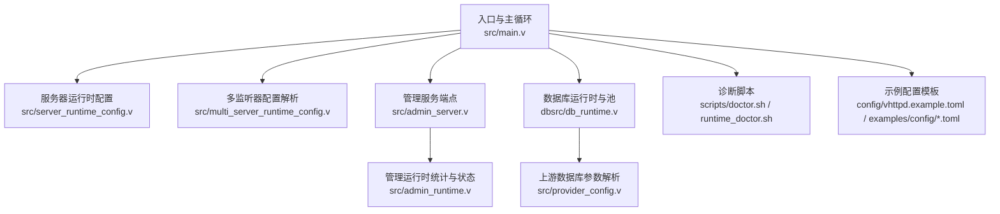
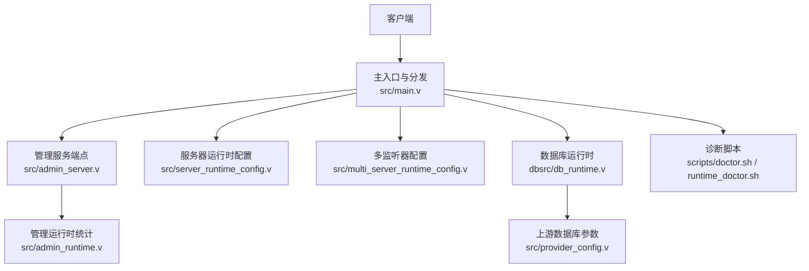
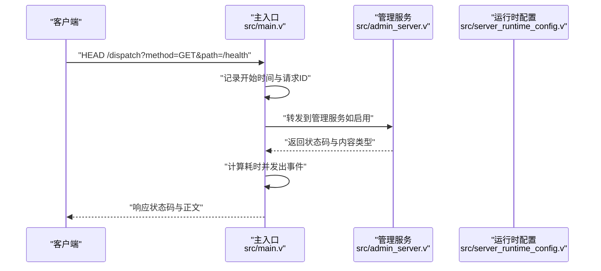
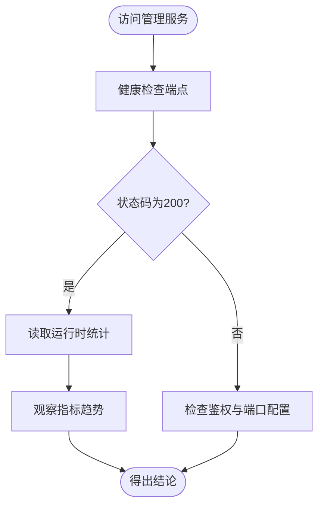
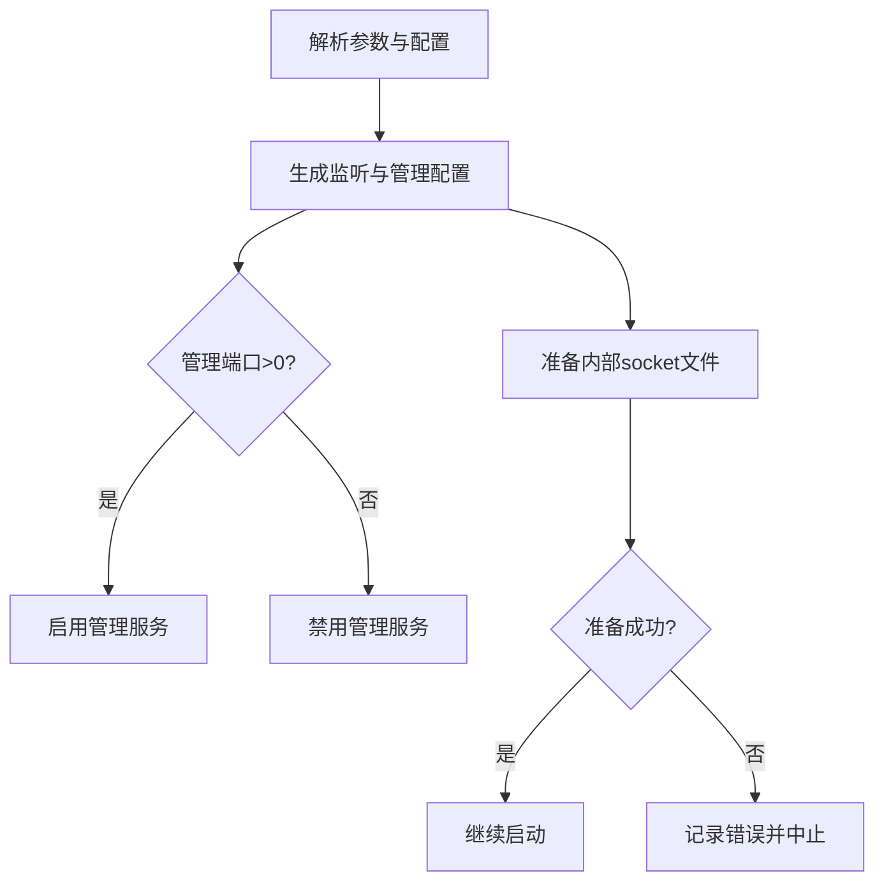
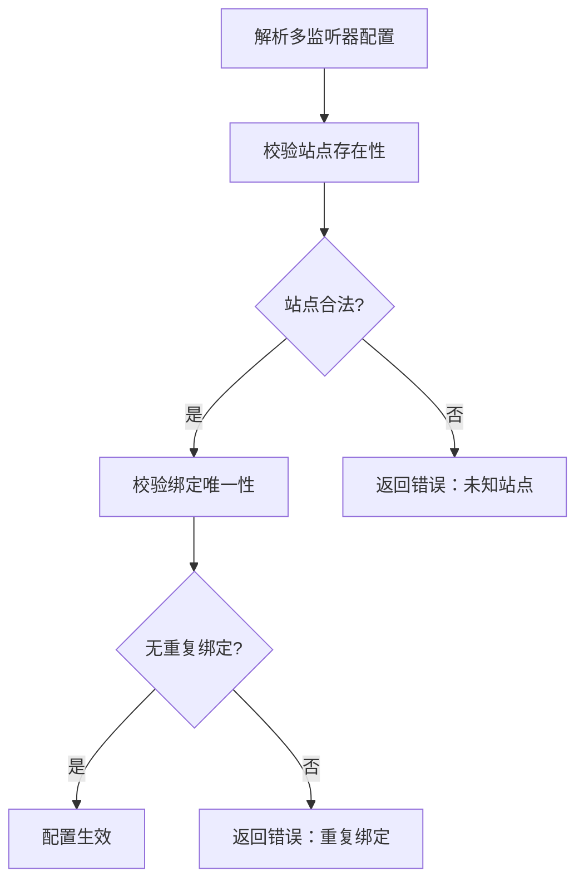
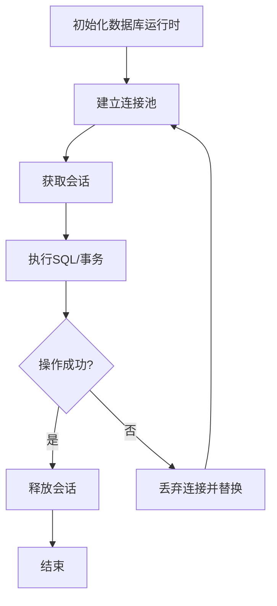
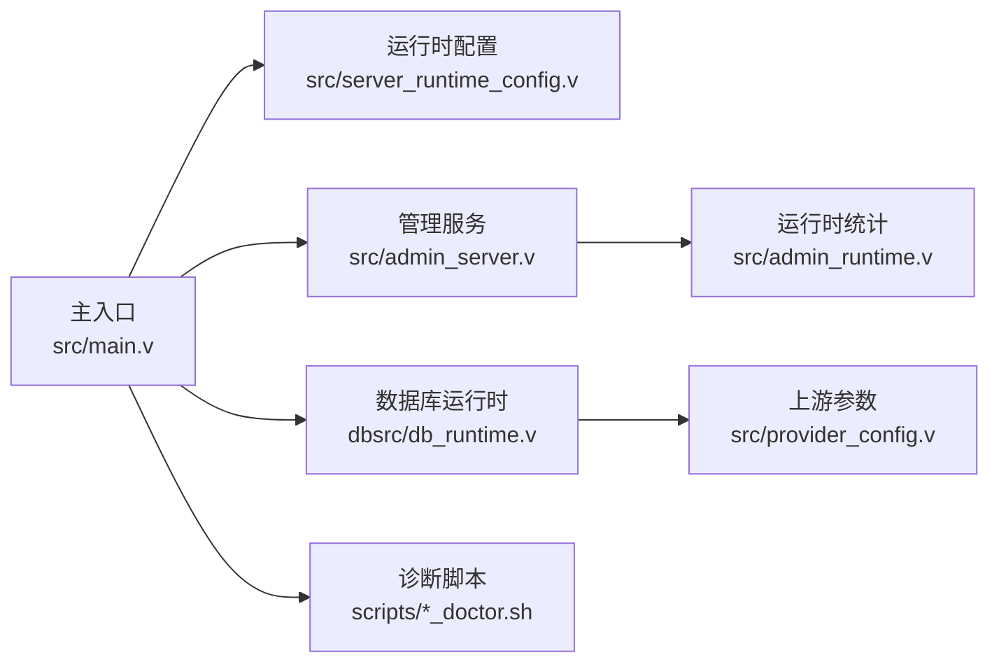

# 故障排除

<cite>
**本文引用的文件**
- [scripts/doctor.sh](file://scripts/doctor.sh)
- [scripts/runtime_doctor.sh](file://scripts/runtime_doctor.sh)
- [src/main.v](file://src/main.v)
- [src/admin_server.v](file://src/admin_server.v)
- [src/admin_runtime.v](file://src/admin_runtime.v)
- [src/server_runtime_config.v](file://src/server_runtime_config.v)
- [src/provider_config.v](file://src/provider_config.v)
- [dbsrc/db_runtime.v](file://dbsrc/db_runtime.v)
- [src/multi_server_runtime_config.v](file://src/multi_server_runtime_config.v)
- [src/codex_runtime.v](file://src/codex_runtime.v)
- [config/vhttpd.example.toml](file://config/vhttpd.example.toml)
- [examples/config/hello.toml](file://examples/config/hello.toml)
- [examples/config/ai-stream.toml](file://examples/config/ai-stream.toml)
- [examples/config/ollama-proxy.toml](file://examples/config/ollama-proxy.toml)
- [examples/config/openai-gateway.toml](file://examples/config/openai-gateway.toml)
- [examples/config/db-upstream.toml](file://examples/config/db-upstream.toml)
- [examples/config/db-upstream-pg.toml](file://examples/config/db-upstream-pg.toml)
- [vhttpd.toml](file://vhttpd.toml)
</cite>

## 目录
1. [简介](#简介)
2. [项目结构](#项目结构)
3. [核心组件](#核心组件)
4. [架构总览](#架构总览)
5. [详细组件分析](#详细组件分析)
6. [依赖分析](#依赖分析)
7. [性能考虑](#性能考虑)
8. [故障排除指南](#故障排除指南)
9. [结论](#结论)
10. [附录](#附录)

## 简介
本指南面向运维人员，提供 vhttpd 的系统化故障排除方法与实操步骤，覆盖启动失败、配置错误、连接超时、性能问题、网络与权限限制、资源限制等常见场景，并结合内置诊断脚本 doctor.sh 与 runtime_doctor.sh 的功能与输出进行解读，帮助快速定位根因并实施修复或应急恢复。

## 项目结构
vhttpd 由核心运行时、管理接口、多站点/监听器配置、数据库与上游集成、以及示例配置与脚本组成。关键目录与文件如下：
- 核心运行时与入口：src/main.v、src/server_runtime_config.v、src/multi_server_runtime_config.v
- 管理接口：src/admin_server.v、src/admin_runtime.v
- 数据库与上游：dbsrc/db_runtime.v、src/provider_config.v
- 示例配置：config/vhttpd.example.toml、examples/config/*.toml
- 诊断脚本：scripts/doctor.sh、scripts/runtime_doctor.sh
- 运行配置：vhttpd.toml

图表来源
- [src/main.v:1577-1621](file://src/main.v#L1577-L1621)
- [src/server_runtime_config.v:46-75](file://src/server_runtime_config.v#L46-L75)
- [src/multi_server_runtime_config.v:19-61](file://src/multi_server_runtime_config.v#L19-L61)
- [src/admin_server.v:52-114](file://src/admin_server.v#L52-L114)
- [src/admin_runtime.v:49-66](file://src/admin_runtime.v#L49-L66)
- [dbsrc/db_runtime.v:90-104](file://dbsrc/db_runtime.v#L90-L104)
- [src/provider_config.v:57-88](file://src/provider_config.v#L57-L88)
- [scripts/doctor.sh](file://scripts/doctor.sh)
- [scripts/runtime_doctor.sh](file://scripts/runtime_doctor.sh)
- [config/vhttpd.example.toml](file://config/vhttpd.example.toml)
- [examples/config/hello.toml](file://examples/config/hello.toml)

章节来源
- [src/main.v:1577-1621](file://src/main.v#L1577-L1621)
- [src/server_runtime_config.v:46-75](file://src/server_runtime_config.v#L46-L75)
- [src/multi_server_runtime_config.v:19-61](file://src/multi_server_runtime_config.v#L19-L61)
- [src/admin_server.v:52-114](file://src/admin_server.v#L52-L114)
- [src/admin_runtime.v:49-66](file://src/admin_runtime.v#L49-L66)
- [dbsrc/db_runtime.v:90-104](file://dbsrc/db_runtime.v#L90-L104)
- [src/provider_config.v:57-88](file://src/provider_config.v#L57-L88)
- [scripts/doctor.sh](file://scripts/doctor.sh)
- [scripts/runtime_doctor.sh](file://scripts/runtime_doctor.sh)
- [config/vhttpd.example.toml](file://config/vhttpd.example.toml)
- [examples/config/hello.toml](file://examples/config/hello.toml)

## 核心组件
- 主入口与请求分发：负责 HTTP 请求的接收、路由与响应，支持 HEAD 调试路径与事件流接口。
- 管理服务：提供健康检查、统计信息与内部状态查询，便于诊断运行时健康度。
- 服务器运行时配置：解析命令行参数与配置文件，生成监听地址、管理员端口与令牌、工作目录、内部 socket 等。
- 多监听器配置：支持多站点/监听器绑定，校验重复绑定与站点合法性。
- 数据库运行时：构建数据库连接池、会话管理与连接回收，支持错误上报与重连策略。
- 诊断脚本：doctor.sh 用于环境与配置诊断，runtime_doctor.sh 用于运行时状态采集与分析。

章节来源
- [src/main.v:1577-1621](file://src/main.v#L1577-L1621)
- [src/admin_server.v:52-114](file://src/admin_server.v#L52-L114)
- [src/admin_runtime.v:49-66](file://src/admin_runtime.v#L49-L66)
- [src/server_runtime_config.v:46-75](file://src/server_runtime_config.v#L46-L75)
- [src/multi_server_runtime_config.v:19-61](file://src/multi_server_runtime_config.v#L19-L61)
- [dbsrc/db_runtime.v:90-104](file://dbsrc/db_runtime.v#L90-L104)
- [scripts/doctor.sh](file://scripts/doctor.sh)
- [scripts/runtime_doctor.sh](file://scripts/runtime_doctor.sh)

## 架构总览
下图展示 vhttpd 的关键交互：客户端请求进入主入口，经由管理服务与运行时配置，最终通过数据库运行时与上游完成数据访问；诊断脚本贯穿于启动前与运行期，辅助定位问题。

图表来源
- [src/main.v:1577-1621](file://src/main.v#L1577-L1621)
- [src/admin_server.v:52-114](file://src/admin_server.v#L52-L114)
- [src/admin_runtime.v:49-66](file://src/admin_runtime.v#L49-L66)
- [src/server_runtime_config.v:46-75](file://src/server_runtime_config.v#L46-L75)
- [src/multi_server_runtime_config.v:19-61](file://src/multi_server_runtime_config.v#L19-L61)
- [dbsrc/db_runtime.v:90-104](file://dbsrc/db_runtime.v#L90-L104)
- [src/provider_config.v:57-88](file://src/provider_config.v#L57-L88)
- [scripts/doctor.sh](file://scripts/doctor.sh)
- [scripts/runtime_doctor.sh](file://scripts/runtime_doctor.sh)

## 详细组件分析

### 组件一：主入口与请求分发（启动失败与连接超时）
- 关键行为
  - 支持 /dispatch 与 HEAD 方法，便于调试与健康探测。
  - 记录请求耗时、状态码、请求 ID、追踪 ID 并发出事件。
- 常见问题
  - 启动失败：端口占用、监听地址不可达、内部 socket 文件创建失败。
  - 连接超时：上游服务不可达、代理链路阻塞、内核参数限制。
- 诊断要点
  - 检查监听端口与主机绑定是否冲突。
  - 使用管理服务健康端点确认进程存活。
  - 查看请求事件中的 duration_ms 与状态码分布。

图表来源
- [src/main.v:1577-1621](file://src/main.v#L1577-L1621)
- [src/admin_server.v:52-114](file://src/admin_server.v#L52-L114)
- [src/server_runtime_config.v:46-75](file://src/server_runtime_config.v#L46-L75)

章节来源
- [src/main.v:1577-1621](file://src/main.v#L1577-L1621)
- [src/admin_server.v:52-114](file://src/admin_server.v#L52-L114)
- [src/server_runtime_config.v:46-75](file://src/server_runtime_config.v#L46-L75)

### 组件二：管理服务与运行时统计（健康检查与状态）
- 关键行为
  - 提供健康检查端点，返回 200 表示服务可用。
  - 汇总各类运行时指标（如 MCP、飞书、HTTP 管理动作等）。
- 常见问题
  - 管理端口未开放、鉴权失败导致无法访问。
  - 统计缺失或异常，可能反映上游或执行器异常。
- 诊断要点
  - 确认 --admin-port 与 --admin-token 配置。
  - 对比不同端点返回的状态与指标变化趋势。

图表来源
- [src/admin_server.v:52-114](file://src/admin_server.v#L52-L114)
- [src/admin_runtime.v:49-66](file://src/admin_runtime.v#L49-L66)

章节来源
- [src/admin_server.v:52-114](file://src/admin_server.v#L52-L114)
- [src/admin_runtime.v:49-66](file://src/admin_runtime.v#L49-L66)

### 组件三：服务器运行时配置（配置错误与资源限制）
- 关键行为
  - 解析命令行参数与配置文件，生成监听地址、管理员端口与令牌、内部 socket 文件等。
  - 根据监听器 ID 与站点 ID 准备运行时文件。
- 常见问题
  - 管理端口为 0 导致管理服务被禁用。
  - 监听地址为空或非法，导致绑定失败。
  - 内部 socket 文件准备失败，影响内部通信。
- 诊断要点
  - 检查 --admin-host/--admin-port/--admin-token 参数与配置文件对应项。
  - 校验 assets_root_real、pid_file、internal_admin_socket 是否可写。

图表来源
- [src/server_runtime_config.v:46-75](file://src/server_runtime_config.v#L46-L75)

章节来源
- [src/server_runtime_config.v:46-75](file://src/server_runtime_config.v#L46-L75)

### 组件四：多监听器配置（多站点/监听器冲突）
- 关键行为
  - 校验监听器 ID、站点 ID、绑定地址唯一性。
  - 若站点不存在或绑定重复则报错。
- 常见问题
  - 监听器缺少 site 或指向未知站点。
  - 监听器绑定在同一 host:port 上导致冲突。
- 诊断要点
  - 检查 listeners 与 sites 的映射关系。
  - 排除重复的 host:port 绑定。

图表来源
- [src/multi_server_runtime_config.v:19-61](file://src/multi_server_runtime_config.v#L19-L61)

章节来源
- [src/multi_server_runtime_config.v:19-61](file://src/multi_server_runtime_config.v#L19-L61)

### 组件五：数据库运行时与上游（连接超时与资源限制）
- 关键行为
  - 构建数据库运行时，维护连接池与会话。
  - 在连接异常时进行回收与替换，避免阻塞。
- 常见问题
  - 连接池满载、上游数据库不可达、超时设置过小。
  - 连接泄漏导致资源耗尽。
- 诊断要点
  - 观察连接池大小与活跃会话数。
  - 检查超时参数与上游网络延迟。
  - 关注错误上报与连接回收逻辑。

图表来源
- [dbsrc/db_runtime.v:90-104](file://dbsrc/db_runtime.v#L90-L104)
- [dbsrc/db_runtime.v:295-342](file://dbsrc/db_runtime.v#L295-L342)

章节来源
- [dbsrc/db_runtime.v:90-104](file://dbsrc/db_runtime.v#L90-L104)
- [dbsrc/db_runtime.v:295-342](file://dbsrc/db_runtime.v#L295-L342)

### 组件六：诊断脚本（doctor.sh 与 runtime_doctor.sh）
- doctor.sh
  - 功能：检查系统环境、依赖、配置文件完整性与权限，输出诊断报告。
  - 输出解读：关注“必需项”、“可选项”、“权限/路径”、“配置项”的告警与错误级别提示。
- runtime_doctor.sh
  - 功能：在运行时采集关键指标、连接状态、内存/CPU 使用、日志位置等。
  - 输出解读：结合管理服务统计与日志分析，定位瓶颈与异常。

章节来源
- [scripts/doctor.sh](file://scripts/doctor.sh)
- [scripts/runtime_doctor.sh](file://scripts/runtime_doctor.sh)

## 依赖分析
- 组件耦合
  - 主入口依赖运行时配置与管理服务；管理服务依赖运行时统计。
  - 数据库运行时依赖上游参数解析与配置文件。
  - 诊断脚本独立于运行时，但与配置文件与系统环境强相关。
- 外部依赖
  - 网络栈、文件系统权限、数据库驱动与上游服务可达性。

图表来源
- [src/main.v:1577-1621](file://src/main.v#L1577-L1621)
- [src/admin_server.v:52-114](file://src/admin_server.v#L52-L114)
- [src/admin_runtime.v:49-66](file://src/admin_runtime.v#L49-L66)
- [src/server_runtime_config.v:46-75](file://src/server_runtime_config.v#L46-L75)
- [dbsrc/db_runtime.v:90-104](file://dbsrc/db_runtime.v#L90-L104)
- [src/provider_config.v:57-88](file://src/provider_config.v#L57-L88)
- [scripts/doctor.sh](file://scripts/doctor.sh)
- [scripts/runtime_doctor.sh](file://scripts/runtime_doctor.sh)

章节来源
- [src/main.v:1577-1621](file://src/main.v#L1577-L1621)
- [src/admin_server.v:52-114](file://src/admin_server.v#L52-L114)
- [src/admin_runtime.v:49-66](file://src/admin_runtime.v#L49-L66)
- [src/server_runtime_config.v:46-75](file://src/server_runtime_config.v#L46-L75)
- [dbsrc/db_runtime.v:90-104](file://dbsrc/db_runtime.v#L90-L104)
- [src/provider_config.v:57-88](file://src/provider_config.v#L57-L88)
- [scripts/doctor.sh](file://scripts/doctor.sh)
- [scripts/runtime_doctor.sh](file://scripts/runtime_doctor.sh)

## 性能考虑
- 连接池与并发
  - 合理设置数据库连接池大小，避免过度连接导致上游限流或资源耗尽。
  - 监控活跃会话数与队列长度，及时扩容或优化 SQL。
- 超时与重试
  - 适当增大请求超时与上游超时，平衡吞吐与稳定性。
  - 对瞬时错误采用指数退避重试，避免雪崩。
- 日志与采样
  - 控制高频日志量级，必要时降低采样率，避免 I/O 成为瓶颈。
  - 使用管理服务统计与 runtime_doctor.sh 输出进行热点分析。

## 故障排除指南

### 启动失败
- 可能原因
  - 管理端口为 0 或被占用；监听地址不可达；内部 socket 文件准备失败。
- 诊断步骤
  - 使用 doctor.sh 检查端口占用与权限。
  - 校验 --admin-port 与 --admin-host 参数，确保非零且可达。
  - 查看运行时配置生成的 internal_admin_socket 是否可写。
- 解决方案
  - 更换管理端口或修复权限；修正监听地址；清理冲突 socket 文件后重启。

章节来源
- [src/server_runtime_config.v:46-75](file://src/server_runtime_config.v#L46-L75)
- [scripts/doctor.sh](file://scripts/doctor.sh)

### 配置错误
- 可能原因
  - 多监听器缺少站点或指向未知站点；同一 host:port 绑定重复。
- 诊断步骤
  - 使用 runtime_doctor.sh 采集配置摘要与绑定列表。
  - 对照多监听器配置解析逻辑，检查 listeners 与 sites 映射。
- 解决方案
  - 为监听器指定有效站点；移除重复绑定；确保站点定义完整。

章节来源
- [src/multi_server_runtime_config.v:19-61](file://src/multi_server_runtime_config.v#L19-L61)
- [scripts/runtime_doctor.sh](file://scripts/runtime_doctor.sh)

### 连接超时
- 可能原因
  - 上游数据库不可达或超时设置过小；连接池满载；网络延迟高。
- 诊断步骤
  - 使用 runtime_doctor.sh 检查连接池与会话状态。
  - 结合管理服务统计查看数据库相关指标。
  - 分析日志中错误上报与连接回收触发频率。
- 解决方案
  - 调整超时参数与连接池大小；优化 SQL 与索引；排查网络路径。

章节来源
- [dbsrc/db_runtime.v:90-104](file://dbsrc/db_runtime.v#L90-L104)
- [dbsrc/db_runtime.v:295-342](file://dbsrc/db_runtime.v#L295-L342)
- [src/admin_runtime.v:49-66](file://src/admin_runtime.v#L49-L66)
- [scripts/runtime_doctor.sh](file://scripts/runtime_doctor.sh)

### 性能问题
- 可能原因
  - 高并发下连接池不足；日志量过大；上游响应慢。
- 诊断步骤
  - 使用 runtime_doctor.sh 获取 CPU/内存/连接数等指标。
  - 对比管理服务统计中的请求耗时与错误率。
  - 审核配置文件中的超时与池大小设置。
- 解决方案
  - 扩容连接池与并发；降低日志级别或采样率；优化上游服务。

章节来源
- [src/admin_runtime.v:49-66](file://src/admin_runtime.v#L49-L66)
- [scripts/runtime_doctor.sh](file://scripts/runtime_doctor.sh)
- [config/vhttpd.example.toml](file://config/vhttpd.example.toml)

### 网络连接与权限配置
- 可能原因
  - 管理端口仅绑定 127.0.0.1；防火墙拦截；文件权限不足。
- 诊断步骤
  - 使用 doctor.sh 检查端口监听与权限。
  - 使用 netstat/ss 检查端口状态与防火墙规则。
  - 校验配置文件与运行用户对 socket/pid 文件的读写权限。
- 解决方案
  - 将管理端口绑定到可访问地址；放行防火墙；修正权限。

章节来源
- [src/server_runtime_config.v:46-75](file://src/server_runtime_config.v#L46-L75)
- [scripts/doctor.sh](file://scripts/doctor.sh)

### 资源限制
- 可能原因
  - 文件句柄上限过低；内存不足；CPU 被其他进程抢占。
- 诊断步骤
  - 使用 runtime_doctor.sh 检查资源使用峰值。
  - 对比系统 ulimit 与 cgroup 限制。
- 解决方案
  - 提升文件句柄与内存限制；调整调度优先级；隔离资源。

章节来源
- [scripts/runtime_doctor.sh](file://scripts/runtime_doctor.sh)

### 日志分析技巧
- 关注点
  - 错误爆发（error burst）与延迟（duration_ms）。
  - 数据库错误与连接回收触发频率。
  - 管理服务统计中的异常指标。
- 实践
  - 使用 runtime_doctor.sh 输出作为日志分析的锚点。
  - 对比同一时间段内的请求与错误分布，定位热点。

章节来源
- [src/codex_runtime.v:1785-1818](file://src/codex_runtime.v#L1785-L1818)
- [src/admin_runtime.v:49-66](file://src/admin_runtime.v#L49-L66)

### 应急处理与恢复
- 流程
  - 快速评估：使用 doctor.sh 与 runtime_doctor.sh 获取现状。
  - 降级：临时关闭高风险上游或降低并发。
  - 修复：修正配置、扩容资源、修复网络与权限。
  - 验证：通过管理服务健康端点与统计指标确认恢复。
- 恢复策略
  - 回滚到上一个稳定配置版本。
  - 清理异常 socket 与缓存，重启主进程与工作进程。
  - 持续监控与告警联动，防止问题反复。

章节来源
- [scripts/doctor.sh](file://scripts/doctor.sh)
- [scripts/runtime_doctor.sh](file://scripts/runtime_doctor.sh)
- [src/admin_server.v:52-114](file://src/admin_server.v#L52-L114)

## 结论
通过结合 doctor.sh 与 runtime_doctor.sh 的诊断能力、管理服务的健康与统计信息、以及对多监听器与数据库运行时的深入理解，运维人员可以高效定位 vhttpd 的启动、配置、连接与性能问题，并制定针对性的修复与应急恢复策略。

## 附录

### 常用配置参考
- 全局示例：config/vhttpd.example.toml
- 示例站点配置：examples/config/hello.toml、examples/config/ai-stream.toml、examples/config/ollama-proxy.toml、examples/config/openai-gateway.toml、examples/config/db-upstream.toml、examples/config/db-upstream-pg.toml
- 运行配置：vhttpd.toml

章节来源
- [config/vhttpd.example.toml](file://config/vhttpd.example.toml)
- [examples/config/hello.toml](file://examples/config/hello.toml)
- [examples/config/ai-stream.toml](file://examples/config/ai-stream.toml)
- [examples/config/ollama-proxy.toml](file://examples/config/ollama-proxy.toml)
- [examples/config/openai-gateway.toml](file://examples/config/openai-gateway.toml)
- [examples/config/db-upstream.toml](file://examples/config/db-upstream.toml)
- [examples/config/db-upstream-pg.toml](file://examples/config/db-upstream-pg.toml)
- [vhttpd.toml](file://vhttpd.toml)